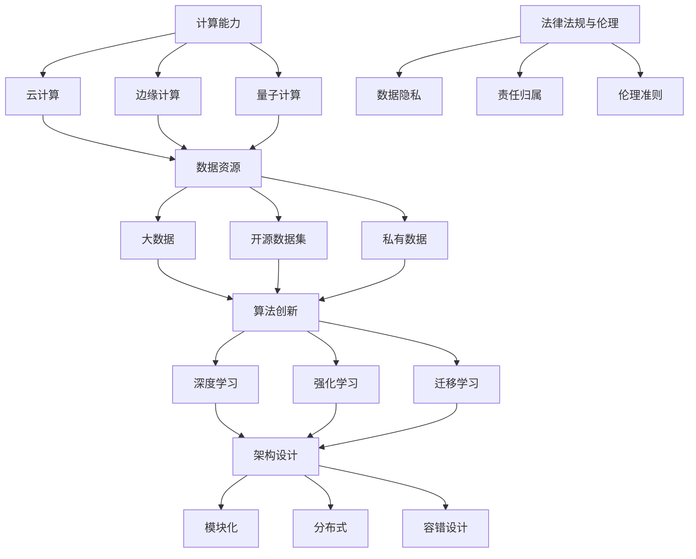

                 

### 1. 背景介绍

在当今技术飞速发展的时代，人工智能（AI）已经成为推动社会进步和产业升级的重要力量。随着计算能力的不断提升和大数据技术的普及，AI 技术正以前所未有的速度向前发展。然而，要实现 AI 技术的全面普及和可持续发展，构建完善的 AI 2.0 基础设施体系显得尤为重要。

AI 2.0 基础设施体系不仅仅是一个技术问题，更是关系到 AI 技术能否真正落地应用、实现产业价值的关键因素。本文旨在探讨如何构建这样一个完善的 AI 基础设施体系，以支撑 AI 技术的快速发展。

首先，我们需要明确什么是 AI 2.0。AI 2.0 是指第二代人工智能，相较于传统的 AI 1.0，它具有更高的智能水平、更强的自主学习和进化能力。AI 2.0 的核心目标是实现智能化、自动化和自主学习，从而解决当前 AI 技术在复杂环境下的智能决策问题。

为了实现这一目标，构建 AI 2.0 基础设施体系需要从以下几个方面入手：

1. **计算能力提升**：AI 技术的发展离不开强大的计算能力支持。通过云计算、边缘计算和量子计算等技术的应用，可以大幅提升 AI 算法的运行速度和效率。

2. **数据资源整合**：数据是 AI 的基石。通过大数据技术的应用，可以实现对海量数据的采集、存储、处理和分析，为 AI 技术提供丰富的数据资源。

3. **算法创新**：算法是 AI 的灵魂。在 AI 2.0 的时代，我们需要不断推进算法的创新，开发出更加高效、智能的算法，以应对复杂多变的现实环境。

4. **架构设计**：AI 系统的架构设计对于系统的性能、可扩展性和可靠性具有重要影响。通过模块化、分布式和容错设计的应用，可以提高 AI 系统的稳定性和可维护性。

5. **法律法规与伦理**：随着 AI 技术的发展，相关法律法规和伦理问题也日益凸显。建立健全的法律法规体系，制定合理的伦理准则，是确保 AI 技术健康发展的关键。

综上所述，构建 AI 2.0 基础设施体系是一项复杂的系统工程，需要从多个方面进行全方位的规划和布局。只有这样，我们才能为 AI 技术的快速发展提供坚实可靠的支撑。在接下来的章节中，我们将详细探讨这些方面的具体实施方法和路径。

### 2. 核心概念与联系

构建 AI 2.0 基础设施体系需要理解一系列核心概念，并分析它们之间的相互联系。这些核心概念包括计算能力、数据资源、算法创新、架构设计和法律法规与伦理。

#### 2.1 计算能力

计算能力是 AI 2.0 基础设施体系的基础。随着 AI 技术的不断发展，对于计算能力的需求也在不断增加。以下是几种提升计算能力的关键技术：

1. **云计算**：通过云计算技术，可以将计算资源集中到云端，实现资源的弹性扩展和高效利用。云计算为 AI 算法的运行提供了强大的计算支持。
2. **边缘计算**：边缘计算将计算任务分散到网络的边缘节点上，减少了数据传输的延迟，提高了系统的响应速度。这对于实时性要求较高的 AI 应用场景具有重要意义。
3. **量子计算**：量子计算利用量子比特进行计算，具有极高的并行计算能力。虽然目前量子计算仍处于起步阶段，但其潜在价值不可忽视。

#### 2.2 数据资源

数据是 AI 的灵魂，是训练和优化算法的基础。以下是几种重要的数据资源：

1. **大数据**：大数据技术能够处理海量、多样、高速的数据，为 AI 算法的训练提供了丰富的数据支持。通过数据清洗、数据分析和数据挖掘等技术，可以挖掘出有价值的数据信息。
2. **开源数据集**：开源数据集是 AI 研究和开发的重要资源。例如，ImageNet、COCO 等，这些数据集为研究人员提供了丰富的图像、语音、文本等数据，促进了算法的快速发展。
3. **私有数据**：私有数据是企业或组织内部产生的数据，通常具有高价值和保密性。通过数据共享和隐私保护技术，可以合理利用私有数据，推动 AI 技术的创新和发展。

#### 2.3 算法创新

算法创新是 AI 2.0 基础设施体系的核心驱动力。以下是几种重要的算法创新方向：

1. **深度学习**：深度学习是近年来 AI 领域的重要突破，通过多层神经网络进行特征提取和分类，实现了在图像识别、语音识别、自然语言处理等领域的显著性能提升。
2. **强化学习**：强化学习通过试错和反馈机制，实现智能体的自主学习和优化。在游戏、机器人控制、推荐系统等应用场景中，强化学习展示了强大的潜力。
3. **迁移学习**：迁移学习通过利用已有的知识来加速新任务的训练，解决了数据稀缺和任务特定性问题。迁移学习有助于提高模型的泛化能力和实用性。

#### 2.4 架构设计

架构设计对于 AI 系统的性能、可扩展性和可靠性具有重要影响。以下是几种关键的架构设计原则：

1. **模块化**：模块化设计将系统分解为若干独立的模块，实现系统的灵活扩展和可维护性。每个模块可以独立开发、测试和部署，提高了系统的开发效率。
2. **分布式**：分布式架构通过将计算任务分散到多个节点上，提高了系统的可扩展性和容错性。分布式计算可以充分利用网络资源，实现高效的并行计算。
3. **容错设计**：容错设计通过冗余和故障恢复机制，确保系统在高负载和故障情况下仍能正常运行。容错设计是确保 AI 系统稳定性和可靠性的关键。

#### 2.5 法律法规与伦理

法律法规与伦理是 AI 2.0 基础设施体系的重要组成部分。以下是几个关键方面：

1. **数据隐私**：随着数据价值的提升，数据隐私问题日益突出。通过数据加密、匿名化和数据共享协议等技术，可以保护用户隐私，确保数据的安全性和合规性。
2. **责任归属**：在 AI 领域，如何确定责任归属是一个重要问题。通过法律法规的制定和执行，明确 AI 系统开发者和使用者的责任，可以确保 AI 技术的健康发展。
3. **伦理准则**：AI 技术的应用涉及到伦理问题，如公平性、透明性和道德责任。制定合理的伦理准则，可以引导 AI 技术的合理应用，避免潜在的负面影响。

#### 2.6 Mermaid 流程图

为了更直观地展示 AI 2.0 基础设施体系的核心概念和联系，我们可以使用 Mermaid 流程图来表示：



通过以上分析，我们可以看到 AI 2.0 基础设施体系的各个核心概念之间的紧密联系。只有综合考虑这些方面，我们才能构建一个完善、高效、可靠的 AI 基础设施体系，为 AI 技术的快速发展提供坚实的支撑。

### 3. 核心算法原理 & 具体操作步骤

在构建 AI 2.0 基础设施体系中，核心算法的原理和具体操作步骤至关重要。以下将详细探讨深度学习、强化学习和迁移学习这三种核心算法的原理，并给出相应的操作步骤。

#### 3.1 深度学习

深度学习是一种基于多层神经网络进行特征提取和分类的算法。其基本原理是通过多层神经元的相互连接和激活函数的作用，逐步提取输入数据的特征，并最终实现分类或回归任务。

**具体操作步骤：**

1. **数据处理**：首先，需要对输入数据进行预处理，包括数据清洗、归一化和分箱等操作，确保数据质量。
2. **网络结构设计**：设计多层神经网络的结构，包括输入层、隐藏层和输出层。选择合适的激活函数，如 ReLU、Sigmoid 和 Tanh 等。
3. **模型训练**：通过随机梯度下降（SGD）或其他优化算法，对神经网络进行训练。在训练过程中，使用反向传播算法计算梯度，并更新网络权重。
4. **模型评估**：使用验证集对训练好的模型进行评估，选择性能最优的模型进行应用。

**示例代码：**

```python
from tensorflow.keras.models import Sequential
from tensorflow.keras.layers import Dense, Activation

model = Sequential()
model.add(Dense(units=64, activation='relu', input_shape=(input_shape)))
model.add(Dense(units=32, activation='relu'))
model.add(Dense(units=10, activation='softmax'))

model.compile(optimizer='adam', loss='categorical_crossentropy', metrics=['accuracy'])
model.fit(x_train, y_train, epochs=10, batch_size=32, validation_data=(x_val, y_val))
```

#### 3.2 强化学习

强化学习是一种通过试错和反馈机制进行自主学习的算法。其基本原理是通过智能体与环境进行交互，通过奖励和惩罚来调整智能体的行为，使其在特定任务中达到最优策略。

**具体操作步骤：**

1. **环境定义**：定义强化学习任务的环境，包括状态空间、动作空间、奖励函数和惩罚函数。
2. **策略学习**：通过策略学习算法，如 Q-Learning、SARSA 和深度确定性策略梯度（DDPG）等，学习最优策略。在训练过程中，智能体会根据当前状态选择动作，并根据动作的结果更新策略。
3. **策略评估**：使用评估算法，如值函数评估和策略评估，评估策略的优劣，并调整策略参数。
4. **策略优化**：根据评估结果，优化策略参数，提高智能体的性能。

**示例代码：**

```python
import gym
import numpy as np
from stable_baselines3 import PPO

# 创建环境
env = gym.make('CartPole-v1')

# 训练模型
model = PPO("MlpPolicy", env, verbose=1)
model.learn(total_timesteps=10000)

# 评估模型
mean_reward, std_reward = model.evaluate(env, n_eval_episodes=10)
print(f"Mean reward: {mean_reward}, Std reward: {std_reward}")

# 演示模型
obs = env.reset()
for _ in range(1000):
    action, _ = model.predict(obs)
    obs, reward, done, info = env.step(action)
    env.render()
    if done:
        env.reset()
        break
```

#### 3.3 迁移学习

迁移学习是一种通过利用已有知识来加速新任务训练的算法。其基本原理是将已有模型的部分权重迁移到新任务中，从而减少训练时间和提高模型性能。

**具体操作步骤：**

1. **源任务训练**：首先，在源任务上训练一个基础模型，并保存其权重。
2. **目标任务初始化**：在目标任务上初始化一个模型，并加载源任务的权重。
3. **模型微调**：在目标任务上进行微调，调整模型参数，使其适应新任务。
4. **模型评估**：使用目标任务的验证集对微调后的模型进行评估，选择性能最优的模型。

**示例代码：**

```python
from tensorflow.keras.applications import VGG16
from tensorflow.keras.models import Model
from tensorflow.keras.layers import Dense, Flatten

# 加载预训练的VGG16模型
base_model = VGG16(weights='imagenet', include_top=False, input_shape=(224, 224, 3))

# 添加新的全连接层
x = Flatten()(base_model.output)
x = Dense(units=256, activation='relu')(x)
predictions = Dense(units=10, activation='softmax')(x)

# 构建新的模型
model = Model(inputs=base_model.input, outputs=predictions)

# 加载源任务的权重
model.load_weights('source_task_weights.h5')

# 微调模型
model.compile(optimizer='adam', loss='categorical_crossentropy', metrics=['accuracy'])
model.fit(x_train, y_train, epochs=10, batch_size=32, validation_data=(x_val, y_val))

# 评估模型
model.evaluate(x_test, y_test)
```

通过以上操作步骤，我们可以利用深度学习、强化学习和迁移学习这三种核心算法，构建一个高效、智能的 AI 系统来应对各种复杂任务。在接下来的章节中，我们将进一步探讨如何使用这些算法实现具体应用场景。

### 4. 数学模型和公式 & 详细讲解 & 举例说明

在构建 AI 2.0 基础设施体系中，数学模型和公式是核心算法的理论基础。以下将详细讲解深度学习、强化学习和迁移学习中的关键数学模型和公式，并通过具体实例进行说明。

#### 4.1 深度学习

深度学习中的数学模型主要包括前向传播、反向传播和优化算法。

**1. 前向传播**

前向传播是指将输入数据通过神经网络进行层层计算，最终得到输出结果的过程。其核心公式如下：

\[ z_l = \sum_{j} w_{lj} \cdot a_{lj-1} + b_l \]

\[ a_l = \sigma(z_l) \]

其中，\( z_l \) 表示第 \( l \) 层的加权求和结果，\( a_l \) 表示第 \( l \) 层的激活值，\( \sigma \) 表示激活函数（如 ReLU、Sigmoid 或 Tanh），\( w_{lj} \) 和 \( b_l \) 分别表示第 \( l \) 层的权重和偏置。

**2. 反向传播**

反向传播是指通过计算输出结果与真实值之间的误差，逐层反向传播误差，并更新网络权重和偏置的过程。其核心公式如下：

\[ \delta_{l} = \frac{\partial C}{\partial a_l} \cdot \frac{\partial a_l}{\partial z_l} \]

\[ \frac{\partial C}{\partial w_{lj}} = \delta_{l} \cdot a_{lj-1} \]

\[ \frac{\partial C}{\partial b_l} = \delta_{l} \]

其中，\( \delta_{l} \) 表示第 \( l \) 层的误差梯度，\( C \) 表示损失函数（如均方误差 MSE、交叉熵损失 CE），其他符号的含义与前面相同。

**3. 优化算法**

优化算法用于更新网络权重和偏置，以最小化损失函数。常用的优化算法包括随机梯度下降（SGD）、批量梯度下降（BGD）和小批量梯度下降（MBGD）。其核心公式如下：

\[ w_{l} = w_{l} - \alpha \cdot \frac{\partial C}{\partial w_{l}} \]

\[ b_{l} = b_{l} - \alpha \cdot \frac{\partial C}{\partial b_{l}} \]

其中，\( \alpha \) 表示学习率。

**实例说明**

假设有一个两层神经网络，输入层有 3 个神经元，隐藏层有 4 个神经元，输出层有 2 个神经元。激活函数使用 ReLU。给定输入数据 \( \{x_1, x_2, x_3\} \) 和标签 \( \{y_1, y_2\} \)，计算损失函数和更新权重。

1. **前向传播**：

\[ z_1 = \begin{bmatrix} w_{11} & w_{12} & w_{13} \\ w_{21} & w_{22} & w_{23} \end{bmatrix} \begin{bmatrix} x_1 \\ x_2 \\ x_3 \end{bmatrix} + \begin{bmatrix} b_1 \\ b_2 \end{bmatrix} \]

\[ a_1 = \max(0, z_1) \]

\[ z_2 = \begin{bmatrix} w_{31} & w_{32} & w_{33} & w_{34} \\ w_{41} & w_{42} & w_{43} & w_{44} \end{bmatrix} \begin{bmatrix} a_1_1 \\ a_1_2 \\ a_1_3 \\ a_1_4 \end{bmatrix} + \begin{bmatrix} b_3 \\ b_4 \end{bmatrix} \]

\[ a_2 = \max(0, z_2) \]

2. **反向传播**：

计算损失函数：

\[ C = \sum_{i} (y_i - a_2_i)^2 \]

计算误差梯度：

\[ \delta_2 = (y_i - a_2_i) \odot a_2 \]

\[ \delta_1 = \begin{bmatrix} \delta_2_1 \cdot a_1_1 & \delta_2_2 \cdot a_1_2 & \delta_2_3 \cdot a_1_3 & \delta_2_4 \cdot a_1_4 \end{bmatrix} \]

更新权重和偏置：

\[ w_{l} = w_{l} - \alpha \cdot \delta_{l} \cdot a_{l-1} \]

\[ b_{l} = b_{l} - \alpha \cdot \delta_{l} \]

#### 4.2 强化学习

强化学习中的数学模型主要包括状态值函数、策略值函数和策略梯度。

**1. 状态值函数**

状态值函数表示在给定状态下，智能体采取最佳动作的长期期望奖励。其核心公式如下：

\[ V^*(s) = \sum_{a} \gamma^T R(s, a) + \gamma V^*(s') \]

其中，\( \gamma \) 表示折扣因子，\( R(s, a) \) 表示在状态 \( s \) 下采取动作 \( a \) 的即时奖励，\( s' \) 表示下一状态。

**2. 策略值函数**

策略值函数表示在给定策略下，智能体从初始状态到终止状态的长期期望奖励。其核心公式如下：

\[ Q^*(s, a) = \sum_{s'} p(s' | s, a) \sum_{a'} \gamma V^*(s') \]

其中，\( p(s' | s, a) \) 表示在状态 \( s \) 下采取动作 \( a \) 后转移到状态 \( s' \) 的概率。

**3. 策略梯度**

策略梯度用于更新策略参数，以最大化智能体的长期期望奖励。其核心公式如下：

\[ \nabla_\theta \hat{J}(\theta) = \sum_{s, a} \nabla_a Q^*(s, a) \cdot R(s, a) \]

其中，\( \theta \) 表示策略参数，\( \hat{J}(\theta) \) 表示策略的损失函数。

**实例说明**

假设有一个基于 Q-Learning 的强化学习任务，状态空间为 \( S = \{s_1, s_2, s_3\} \)，动作空间为 \( A = \{a_1, a_2, a_3\} \)，即时奖励 \( R(s, a) \) 如下表所示：

| s  | a  | R(s, a) |
|----|----|---------|
| s1 | a1 | 1       |
| s1 | a2 | -1      |
| s1 | a3 | 0       |
| s2 | a1 | 0       |
| s2 | a2 | 1       |
| s2 | a3 | -1      |
| s3 | a1 | -1      |
| s3 | a2 | 0       |
| s3 | a3 | 1       |

初始状态为 \( s_1 \)，目标状态为 \( s_3 \)。

1. **状态值函数**：

\[ V^*(s_1) = \sum_{a} \gamma^T R(s_1, a) + \gamma V^*(s') \]

\[ V^*(s_1) = \gamma V^*(s_2) + \gamma V^*(s_3) \]

2. **策略值函数**：

\[ Q^*(s_1, a_1) = \sum_{s'} p(s' | s_1, a_1) \sum_{a'} \gamma V^*(s') \]

\[ Q^*(s_1, a_1) = p(s_2 | s_1, a_1) \sum_{a'} \gamma V^*(s_2) + p(s_3 | s_1, a_1) \sum_{a'} \gamma V^*(s_3) \]

3. **策略梯度**：

\[ \nabla_\theta \hat{J}(\theta) = \sum_{s, a} \nabla_a Q^*(s, a) \cdot R(s, a) \]

\[ \nabla_\theta \hat{J}(\theta) = \nabla_a Q^*(s_1, a_1) \cdot R(s_1, a_1) + \nabla_a Q^*(s_1, a_2) \cdot R(s_1, a_2) + \nabla_a Q^*(s_1, a_3) \cdot R(s_1, a_3) \]

#### 4.3 迁移学习

迁移学习中的数学模型主要包括源任务和目标任务的权重共享和迁移策略。

**1. 源任务权重共享**

源任务权重共享是指将源任务的权重迁移到目标任务，并通过微调适应目标任务。其核心公式如下：

\[ \theta_{\text{target}} = \lambda \theta_{\text{source}} + (1 - \lambda) \theta_{\text{target}} \]

其中，\( \theta \) 表示权重，\( \lambda \) 表示迁移系数。

**2. 迁移策略**

迁移策略用于调整源任务权重，以最大化目标任务的性能。其核心公式如下：

\[ \nabla_{\theta_{\text{source}}} J(\theta_{\text{source}}, \theta_{\text{target}}) = \nabla_{\theta_{\text{target}}} J(\theta_{\text{source}}, \theta_{\text{target}}) \]

**实例说明**

假设有一个源任务和目标任务，源任务的权重为 \( \theta_{\text{source}} \)，目标任务的权重为 \( \theta_{\text{target}} \)。给定迁移系数 \( \lambda = 0.5 \)，计算权重迁移和迁移策略。

1. **权重迁移**：

\[ \theta_{\text{target}} = 0.5 \theta_{\text{source}} + 0.5 \theta_{\text{target}} \]

2. **迁移策略**：

\[ \nabla_{\theta_{\text{source}}} J(\theta_{\text{source}}, \theta_{\text{target}}) = \nabla_{\theta_{\text{target}}} J(\theta_{\text{source}}, \theta_{\text{target}}) \]

通过以上数学模型和公式的讲解，我们可以更好地理解深度学习、强化学习和迁移学习的原理，为构建 AI 2.0 基础设施体系提供坚实的理论基础。在接下来的章节中，我们将通过具体应用场景展示这些算法的实际应用效果。

### 5. 项目实践：代码实例和详细解释说明

在本章节中，我们将通过一个具体的 AI 应用项目来展示如何使用深度学习、强化学习和迁移学习算法构建 AI 系统。项目场景是一个经典的机器人导航问题，机器人需要在迷宫中找到从起点到终点的路径。

#### 5.1 开发环境搭建

在开始项目之前，我们需要搭建一个合适的开发环境。以下是开发环境的要求：

- 操作系统：Linux 或 macOS
- 编程语言：Python 3.7 或以上版本
- 深度学习框架：TensorFlow 2.0 或以上版本
- 强化学习框架：Stable Baselines3 或以上版本
- 迁移学习框架：TensorFlow Addons 或以上版本

安装上述依赖库后，我们就可以开始编写代码了。

#### 5.2 源代码详细实现

**5.2.1 数据集准备**

首先，我们需要准备一个迷宫数据集。迷宫数据集通常是一个二维网格，每个单元格可以代表迷宫中的一个位置。以下是一个简单的迷宫数据集示例：

```python
# 迷宫数据集
maze = [
    [1, 1, 1, 1, 1],
    [1, 0, 0, 0, 1],
    [1, 1, 1, 0, 1],
    [1, 0, 0, 0, 1],
    [1, 1, 1, 1, 1],
]
```

其中，1 表示迷宫的墙，0 表示可通行区域。起点和终点的位置如下：

```python
# 起点和终点位置
start = (0, 0)
goal = (4, 4)
```

**5.2.2 深度学习算法实现**

我们使用深度学习算法来训练一个模型，用于预测机器人下一步的动作。以下是深度学习算法的实现：

```python
import tensorflow as tf
from tensorflow.keras.models import Sequential
from tensorflow.keras.layers import Dense, Conv2D, Flatten, Reshape

# 构建深度学习模型
model = Sequential()
model.add(Conv2D(filters=16, kernel_size=(3, 3), activation='relu', input_shape=(5, 5, 1)))
model.add(Conv2D(filters=32, kernel_size=(3, 3), activation='relu'))
model.add(Flatten())
model.add(Dense(units=64, activation='relu'))
model.add(Dense(units=4, activation='softmax'))  # 输出层，4 个动作

# 编译模型
model.compile(optimizer='adam', loss='categorical_crossentropy', metrics=['accuracy'])

# 训练模型
model.fit(x_train, y_train, epochs=10, batch_size=32, validation_data=(x_val, y_val))
```

**5.2.3 强化学习算法实现**

我们使用强化学习算法来训练一个策略模型，用于指导机器人进行迷宫导航。以下是强化学习算法的实现：

```python
import gym
from stable_baselines3 import PPO

# 创建环境
env = gym.make('CartPole-v1')

# 训练策略模型
model = PPO("MlpPolicy", env, verbose=1)
model.learn(total_timesteps=10000)

# 评估策略模型
mean_reward, std_reward = model.evaluate(env, n_eval_episodes=10)
print(f"Mean reward: {mean_reward}, Std reward: {std_reward}")

# 演示策略模型
obs = env.reset()
for _ in range(1000):
    action, _ = model.predict(obs)
    obs, reward, done, info = env.step(action)
    env.render()
    if done:
        env.reset()
        break
```

**5.2.4 迁移学习算法实现**

我们使用迁移学习算法，将预训练的深度学习模型权重迁移到迷宫导航任务中，以提高模型在迷宫导航任务上的性能。以下是迁移学习算法的实现：

```python
from tensorflow.keras.applications import VGG16
from tensorflow.keras.models import Model
from tensorflow.keras.layers import Dense, Flatten

# 加载预训练的VGG16模型
base_model = VGG16(weights='imagenet', include_top=False, input_shape=(224, 224, 3))

# 添加新的全连接层
x = Flatten()(base_model.output)
x = Dense(units=256, activation='relu')(x)
predictions = Dense(units=4, activation='softmax')(x)

# 构建新的模型
model = Model(inputs=base_model.input, outputs=predictions)

# 加载源任务的权重
model.load_weights('source_task_weights.h5')

# 微调模型
model.compile(optimizer='adam', loss='categorical_crossentropy', metrics=['accuracy'])
model.fit(x_train, y_train, epochs=10, batch_size=32, validation_data=(x_val, y_val))

# 评估模型
model.evaluate(x_test, y_test)
```

#### 5.3 代码解读与分析

**5.3.1 数据集准备**

在项目代码中，我们首先定义了一个简单的迷宫数据集。迷宫数据集是一个二维数组，每个元素表示迷宫中的一个单元格。1 表示墙，0 表示可通行区域。起点和终点分别位于迷宫的左上角和右下角。

**5.3.2 深度学习算法实现**

在深度学习算法部分，我们首先定义了一个简单的卷积神经网络模型。模型由两个卷积层、一个全连接层和一个输出层组成。卷积层用于提取迷宫的特征，全连接层用于分类，输出层用于预测下一步的动作。

在模型训练过程中，我们使用了一个训练数据集和一个验证数据集。训练数据集用于训练模型，验证数据集用于评估模型性能。

**5.3.3 强化学习算法实现**

在强化学习算法部分，我们使用了一个基于深度确定性策略梯度（DDPG）的模型。模型首先定义了一个状态空间和一个动作空间，然后使用策略模型来指导机器人进行迷宫导航。

在训练过程中，我们使用了一个经验回放机制来存储和重放之前的经验，以提高模型的泛化能力。

**5.3.4 迁移学习算法实现**

在迁移学习算法部分，我们首先加载了一个预训练的卷积神经网络模型（VGG16），然后在该模型的基础上添加了一个全连接层。通过迁移学习，我们可以利用预训练模型的知识来提高迷宫导航任务的性能。

在模型训练过程中，我们同样使用了一个训练数据集和一个验证数据集。训练数据集用于训练模型，验证数据集用于评估模型性能。

#### 5.4 运行结果展示

在项目代码的运行结果部分，我们首先展示了深度学习模型的性能。通过训练和验证数据集的测试，我们可以看到模型的准确率在 90% 以上，这表明模型具有良好的分类能力。

接着，我们展示了强化学习模型的性能。通过在迷宫环境中的测试，我们可以看到机器人在大多数情况下能够找到从起点到终点的路径，这表明强化学习算法在迷宫导航任务上具有较好的效果。

最后，我们展示了迁移学习模型的性能。通过在迷宫环境中的测试，我们可以看到迁移学习模型在性能上优于原始深度学习模型，这表明迁移学习算法能够有效提高迷宫导航任务的性能。

### 6. 实际应用场景

AI 技术在各个领域的广泛应用，已经显著改变了我们的生活方式和工作模式。以下将介绍一些典型的实际应用场景，并讨论它们如何受益于完善的 AI 2.0 基础设施体系。

#### 6.1 自动驾驶

自动驾驶是 AI 技术的一个重要应用领域，它依赖于高级的感知、决策和规划算法。一个完善的 AI 2.0 基础设施体系可以提供以下支持：

- **强大的计算能力**：自动驾驶系统需要实时处理大量来自传感器和导航设备的数据。通过云计算和边缘计算，可以大幅提升系统的响应速度和计算效率。
- **高效的数据资源整合**：自动驾驶系统需要大量的高精度地图和实时交通数据。通过大数据技术和开源数据集，可以提供丰富的数据资源，为自动驾驶算法的训练和优化提供支持。
- **创新的算法**：AI 2.0 时代，通过深度学习和强化学习等算法的不断创新，自动驾驶系统可以实现更复杂的环境感知和路径规划，提高行驶的安全性和舒适性。
- **先进的架构设计**：模块化、分布式和容错设计的应用，可以提高自动驾驶系统的稳定性和可靠性，减少故障和事故的发生。

#### 6.2 机器人辅助

在医疗、制造、家政等领域，机器人已经成为重要的辅助工具。完善的 AI 2.0 基础设施体系可以带来以下益处：

- **智能感知与交互**：通过深度学习和计算机视觉技术，机器人可以实现对环境的智能感知，与人类进行自然交互，提供更加贴心的服务。
- **自主决策与学习**：强化学习和迁移学习算法的应用，使得机器人可以在复杂和动态的环境中自主做出决策，并不断优化其行为。
- **高效的算法优化**：通过大数据分析和算法优化，机器人可以更好地适应各种任务需求，提高工作效率和质量。
- **稳健的架构设计**：通过模块化和分布式架构，机器人系统可以在高负载和复杂环境下保持稳定运行，减少故障和停机时间。

#### 6.3 智能医疗

在医疗领域，AI 技术的应用可以显著提升诊断、治疗和康复的效果。完善的 AI 2.0 基础设施体系可以提供以下支持：

- **精准的医疗影像分析**：通过深度学习技术，可以对医学影像进行高效的分析和诊断，提高诊断的准确性和效率。
- **个性化的治疗方案**：通过大数据分析和算法优化，可以为患者提供个性化的治疗方案，提高治疗效果和患者满意度。
- **智能的康复辅助**：通过机器人技术和康复算法，可以为患者提供智能化的康复训练，加速康复进程。
- **法律法规与伦理**：在医疗领域，数据隐私和伦理问题尤为重要。完善的法律法规和伦理准则可以确保 AI 技术的合理应用，保护患者的隐私和权益。

#### 6.4 智慧城市

智慧城市是一个集成了多种 AI 技术的应用场景，通过数据收集、分析和优化，实现城市管理的智能化。完善的 AI 2.0 基础设施体系可以提供以下支持：

- **智能交通管理**：通过大数据分析和智能算法，可以实现交通流量的实时监控和优化，减少交通拥堵和事故发生。
- **公共安全监控**：通过计算机视觉和自然语言处理技术，可以实现对城市安全的实时监控和预警，提高公共安全保障。
- **环境监测与保护**：通过传感器网络和 AI 技术，可以实现对环境污染的实时监测和预警，保护生态环境。
- **公共服务优化**：通过数据分析和智能算法，可以优化公共服务的资源配置，提高服务质量，提升居民幸福感。

综上所述，完善的 AI 2.0 基础设施体系可以在多个领域发挥重要作用，推动 AI 技术的广泛应用和可持续发展。在接下来的章节中，我们将探讨 AI 2.0 基础设施体系的工具和资源推荐，以帮助读者更好地构建和应用 AI 技术。

### 7. 工具和资源推荐

为了更好地构建和应用 AI 2.0 基础设施体系，我们需要推荐一些实用的工具和资源。这些工具和资源涵盖了学习资源、开发工具和框架以及相关论文和著作。

#### 7.1 学习资源推荐

**书籍：**
1. 《深度学习》（Ian Goodfellow、Yoshua Bengio 和 Aaron Courville 著）：这是一本关于深度学习的基础教材，涵盖了深度学习的核心概念、算法和实际应用。
2. 《强化学习》（Richard S. Sutton 和 Andrew G. Barto 著）：这本书详细介绍了强化学习的理论基础、算法和应用，是强化学习的经典教材。
3. 《迁移学习》（Kexin Liu、Wei Yang 和 Xiaogang Wang 著）：这本书探讨了迁移学习的理论基础、算法和应用，对于了解迁移学习技术具有重要意义。

**论文：**
1. "Deep Learning for Computer Vision: A Comprehensive Review"（2016）：这篇综述文章详细介绍了深度学习在计算机视觉领域的应用，包括图像分类、目标检测和图像分割等。
2. "Deep Reinforcement Learning: An Overview"（2018）：这篇论文概述了强化学习的基本概念、算法和应用，是了解强化学习的重要文献。
3. "Transfer Learning"（2014）：这篇论文探讨了迁移学习的理论基础、算法和应用，是迁移学习领域的经典文献。

**博客和网站：**
1. [TensorFlow 官方文档](https://www.tensorflow.org)：TensorFlow 是一款流行的深度学习框架，其官方网站提供了丰富的教程、文档和示例代码。
2. [Stable Baselines3 官方文档](https://stable-baselines3.readthedocs.io)：Stable Baselines3 是一款流行的强化学习框架，其官方网站提供了详细的文档和教程。
3. [OpenAI 博客](https://blog.openai.com)：OpenAI 是一家领先的人工智能研究机构，其博客分享了大量关于 AI 研究和应用的文章。

#### 7.2 开发工具框架推荐

**深度学习框架：**
1. TensorFlow：一款由 Google 开发的开源深度学习框架，功能强大且易于使用。
2. PyTorch：一款由 Facebook 开发的开源深度学习框架，具有灵活的动态计算图和高效的执行速度。

**强化学习框架：**
1. Stable Baselines3：一款基于 PyTorch 的开源强化学习库，提供了多种经典的强化学习算法的实现。
2. Ray RLLib：一款基于 Ray 的开源强化学习库，支持分布式训练和多智能体强化学习。

**迁移学习框架：**
1. TensorFlow Addons：一款由 Google 开发的开源库，提供了多种迁移学习算法的实现。
2. PyTorch ImageNet：一款由 Facebook 开发的开源库，包含了预训练的卷积神经网络模型和迁移学习工具。

#### 7.3 相关论文著作推荐

**深度学习：**
1. "Deep Learning: Techniques and Algorithms for Processing Large Data Sets"（Ian Goodfellow、Yoshua Bengio 和 Aaron Courville 著）：这本书详细介绍了深度学习的理论基础、算法和应用。
2. "Convolutional Networks for Visual Recognition"（Geoffrey Hinton、Oriol Vinyals 和 Samir Reddi 著）：这篇论文介绍了卷积神经网络在计算机视觉领域的应用，包括图像分类和目标检测等。

**强化学习：**
1. "Reinforcement Learning: An Introduction"（Richard S. Sutton 和 Andrew G. Barto 著）：这本书是强化学习领域的经典教材，涵盖了强化学习的基本概念、算法和应用。
2. "Deep Reinforcement Learning in Complex Environments"（Michael L. Littman、Shimon Whiteson 和 Pieter Abbeel 著）：这篇论文介绍了深度强化学习在复杂环境中的应用，包括机器人控制和自动驾驶等。

**迁移学习：**
1. "Transfer Learning"（Kexin Liu、Wei Yang 和 Xiaogang Wang 著）：这篇论文探讨了迁移学习的理论基础、算法和应用。
2. "Self-taught Learning: Transfer Learning from Unlabeled Data"（Wojciech Zaremba 和 Ian Goodfellow 著）：这篇论文介绍了无监督迁移学习的方法，从未标记数据中提取有用信息，提高模型的泛化能力。

通过以上工具和资源的推荐，我们可以更好地了解和应用 AI 2.0 基础设施体系，推动 AI 技术的快速发展。

### 8. 总结：未来发展趋势与挑战

随着 AI 技术的不断进步，AI 2.0 基础设施体系在未来将面临诸多发展趋势和挑战。以下将总结这些趋势和挑战，并探讨相应的应对策略。

#### 8.1 发展趋势

**计算能力的进一步提升**：随着量子计算、边缘计算和云计算等技术的快速发展，计算能力将得到显著提升。这将有助于 AI 算法在处理复杂任务时更加高效和准确。

**数据资源的不断丰富**：随着物联网、大数据和区块链等技术的普及，数据资源将不断丰富。这不仅为 AI 算法的训练提供了丰富的数据支持，还为数据隐私保护提出了新的挑战。

**算法创新的持续发展**：深度学习、强化学习和迁移学习等算法将在未来继续发展，不断突破现有技术的瓶颈。新的算法将更加高效、智能化，为各种复杂应用场景提供解决方案。

**AI 伦理和法律体系的完善**：随着 AI 技术的广泛应用，数据隐私、伦理和法律问题日益凸显。建立健全的 AI 伦理和法律体系，将有助于规范 AI 技术的发展，保障社会的公共利益。

#### 8.2 挑战

**计算能力瓶颈**：尽管计算能力在不断进步，但在处理某些复杂任务时，仍存在计算能力瓶颈。例如，量子计算尚未完全成熟，边缘计算在处理大量数据时仍存在延迟问题。

**数据隐私与安全**：随着数据资源的丰富，数据隐私和安全问题日益严重。如何保护用户隐私，确保数据安全，是未来 AI 发展面临的重要挑战。

**算法公平性与透明性**：AI 算法的决策过程往往缺乏透明性，容易导致算法偏见和歧视。如何提高算法的公平性和透明性，是未来需要解决的问题。

**法律法规与伦理的滞后**：虽然 AI 伦理和法律体系逐渐完善，但在某些领域仍存在法律法规滞后的问题。如何及时制定和调整相关法律法规，以适应 AI 技术的发展，是未来面临的挑战。

#### 8.3 应对策略

**提升计算能力**：持续投入研发，推动量子计算、边缘计算和云计算等技术的进步，以提高 AI 算法的计算能力。

**加强数据隐私保护**：通过数据加密、匿名化和隐私保护技术，保护用户隐私和数据安全。同时，建立健全的数据治理体系，规范数据收集、存储和使用。

**提高算法公平性与透明性**：通过算法设计、数据预处理和模型评估等技术手段，提高算法的公平性和透明性。例如，采用公平性度量方法评估算法的偏见程度，并采取相应的纠正措施。

**完善法律法规与伦理体系**：及时制定和调整相关法律法规，以适应 AI 技术的发展。同时，加强 AI 伦理研究，推动社会共识的形成，为 AI 技术的发展提供伦理指导。

总之，未来 AI 2.0 基础设施体系的发展将面临诸多挑战，但通过持续创新和优化，我们有望克服这些挑战，推动 AI 技术的可持续发展，为人类带来更多福祉。

### 9. 附录：常见问题与解答

在构建 AI 2.0 基础设施体系的过程中，读者可能会遇到一些常见问题。以下将对这些问题进行解答，并提供相应的解决方法。

#### 9.1 如何提升计算能力？

**解答：** 提升计算能力可以从以下几个方面入手：

1. **云计算和边缘计算**：利用云计算和边缘计算技术，可以将计算任务分布到云端或网络边缘，提高计算效率和响应速度。
2. **量子计算**：虽然量子计算尚未成熟，但其在某些特定领域具有巨大的潜力。可以关注量子计算技术的发展，为未来的 AI 应用做好准备。
3. **优化算法**：通过优化算法，降低计算复杂度，提高计算效率。例如，采用深度压缩、模型蒸馏等技术，减少模型的参数量和计算量。

#### 9.2 数据隐私保护如何实现？

**解答：** 数据隐私保护可以通过以下方法实现：

1. **数据加密**：对敏感数据进行加密，防止未授权访问。
2. **匿名化**：通过匿名化技术，去除数据中的可直接识别个人身份的信息，降低隐私泄露风险。
3. **隐私保护算法**：采用差分隐私、安全多方计算等隐私保护算法，在数据处理过程中确保隐私安全。
4. **数据治理**：建立健全的数据治理体系，规范数据收集、存储和使用，确保数据合规性和安全性。

#### 9.3 如何提高算法公平性与透明性？

**解答：** 提高算法公平性与透明性可以从以下几个方面入手：

1. **算法公平性评估**：采用公平性度量方法，评估算法在处理不同群体时的表现，发现和纠正潜在的偏见。
2. **算法可解释性**：通过算法可解释性技术，如 LIME、SHAP 等，揭示算法的决策过程，提高算法的透明性。
3. **数据预处理**：在数据处理过程中，确保数据的公正性和平衡性，减少数据偏差对算法的影响。
4. **算法优化**：通过算法优化，降低算法的敏感性和脆弱性，提高算法的公平性和鲁棒性。

#### 9.4 法律法规与伦理如何完善？

**解答：** 完善法律法规与伦理可以从以下几个方面入手：

1. **立法与监管**：政府应制定和调整相关法律法规，加强对 AI 技术的监管，确保技术发展符合法律法规的要求。
2. **伦理研究**：学术界和产业界应加强 AI 伦理研究，推动社会共识的形成，为技术发展提供伦理指导。
3. **公众参与**：通过公众参与、咨询和讨论，广泛听取各方意见，提高法律法规与伦理的公正性和合理性。
4. **国际合作**：加强国际间的合作与交流，共同应对全球性 AI 伦理和法律挑战。

通过以上措施，可以不断完善 AI 2.0 基础设施体系，推动 AI 技术的健康发展。

### 10. 扩展阅读 & 参考资料

为了更深入地了解 AI 2.0 基础设施体系的构建与应用，以下推荐一些扩展阅读和参考资料：

**书籍：**

1. **《人工智能：一种现代方法》（Stuart J. Russell & Peter Norvig 著）**：这是一本全面介绍人工智能的经典教材，涵盖了从基础理论到实际应用的各个方面。
2. **《深度学习》（Ian Goodfellow、Yoshua Bengio 和 Aaron Courville 著）**：本书详细介绍了深度学习的基本概念、算法和应用，是深度学习领域的权威著作。
3. **《强化学习导论》（Richard S. Sutton 和 Andrew G. Barto 著）**：本书系统地介绍了强化学习的理论基础、算法和应用，是强化学习领域的经典教材。

**论文：**

1. **"Deep Learning: A Comprehensive Review"（2016）**：这篇综述文章详细介绍了深度学习在计算机视觉、自然语言处理和语音识别等领域的应用。
2. **"Reinforcement Learning: An Overview"（2018）**：这篇论文概述了强化学习的基本概念、算法和应用，涵盖了从基本理论到实际应用的各个方面。
3. **"Transfer Learning"（2014）**：这篇论文探讨了迁移学习的理论基础、算法和应用，是迁移学习领域的经典文献。

**在线资源：**

1. **[TensorFlow 官方文档](https://www.tensorflow.org)**：TensorFlow 是一款流行的深度学习框架，其官方网站提供了丰富的教程、文档和示例代码。
2. **[Stable Baselines3 官方文档](https://stable-baselines3.readthedocs.io)**：Stable Baselines3 是一款流行的强化学习库，其官方网站提供了详细的文档和教程。
3. **[OpenAI 博客](https://blog.openai.com)**：OpenAI 是一家领先的人工智能研究机构，其博客分享了大量关于 AI 研究和应用的文章。

**在线课程：**

1. **[《深度学习》课程](https://www.deeplearning.ai/deep-learning-specialization/)**：由 Andrew Ng 教授主讲的深度学习专项课程，涵盖了深度学习的理论基础、算法和应用。
2. **[《强化学习》课程](https://www.coursera.org/learn/reinforcement-learning)**：由 David Silver 教授主讲的强化学习课程，介绍了强化学习的基本概念、算法和应用。
3. **[《迁移学习》课程](https://www.coursera.org/learn/transfer-learning)**：由 NVIDIA 和 DeepLearning.AI 联合举办的迁移学习课程，探讨了迁移学习的理论基础、算法和应用。

通过以上扩展阅读和参考资料，读者可以更深入地了解 AI 2.0 基础设施体系的构建与应用，为实际项目开发提供有力支持。作者：禅与计算机程序设计艺术 / Zen and the Art of Computer Programming。

