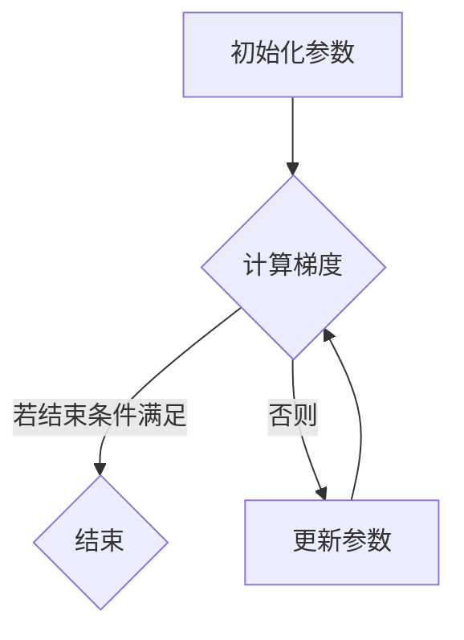

                 

### 文章标题

**梯度下降Gradient Descent原理与代码实例讲解**

> **关键词：** 梯度下降、机器学习、优化算法、数学模型、Python代码实例  
>
> **摘要：** 本文将详细介绍梯度下降算法的基本原理、数学模型以及如何用Python实现。通过代码实例，我们将深入理解这一优化算法在实际项目中的应用。

---

### 1. 背景介绍

梯度下降（Gradient Descent）是一种在机器学习中用于优化目标函数的算法。它的核心思想是通过不断迭代更新参数，使得目标函数的值逐渐逼近全局最小值或局部最小值。梯度下降算法在神经网络、线性回归、逻辑回归等多个机器学习任务中都有广泛应用。

在机器学习中，我们通常需要找到一个参数集合，使得某个损失函数的值最小。例如，在回归问题中，我们希望预测值与真实值之间的差距最小。而梯度下降算法就是用来找到这个最优参数集合的一种有效方法。

梯度下降算法的基本思想可以总结为以下两点：

1. **目标函数的梯度**：目标函数的梯度是指函数在某一点的斜率。对于多维函数，梯度是一个向量，表示函数在该点处下降最快的方向。

2. **迭代更新参数**：在每次迭代中，根据目标函数的梯度来更新参数。更新方向为梯度的反方向，更新幅度为学习率（learning rate）的乘积。学习率是一个超参数，需要根据具体问题进行调优。

### 2. 核心概念与联系

为了更好地理解梯度下降算法，我们需要先掌握以下几个核心概念：

- **目标函数**：在机器学习中，目标函数通常表示预测值与真实值之间的差异。例如，在回归问题中，常用的目标函数是均方误差（MSE）。

- **梯度**：梯度是一个向量，表示函数在某一点处下降最快的方向。对于多维函数，梯度是一个向量，其每个分量对应函数在该维度上的偏导数。

- **学习率**：学习率决定了每次迭代时参数更新的幅度。学习率过大可能导致无法收敛，过小则收敛速度过慢。

以下是梯度下降算法的 Mermaid 流程图：



- **初始化参数**：随机初始化参数。
- **计算梯度**：计算目标函数的梯度。
- **更新参数**：根据梯度更新参数。
- **重复迭代**：重复计算梯度和更新参数，直到满足结束条件（例如，梯度变化小于某个阈值或达到最大迭代次数）。

### 3. 核心算法原理 & 具体操作步骤

现在我们来详细探讨梯度下降算法的原理和操作步骤。

#### 3.1 目标函数与梯度

首先，我们需要明确目标函数。在机器学习中，目标函数通常表示预测值与真实值之间的差异。例如，在回归问题中，常用的目标函数是均方误差（MSE），定义如下：

$$
MSE = \frac{1}{m}\sum_{i=1}^{m}(h_{\theta}(x^{(i)}) - y^{(i)})^2
$$

其中，$h_{\theta}(x^{(i)})$ 是预测值，$y^{(i)}$ 是真实值，$m$ 是样本数量。

为了求目标函数的梯度，我们需要对每个参数 $\theta_j$ 求偏导数。梯度是一个向量，其每个分量对应目标函数在该维度上的偏导数。对于上述均方误差函数，梯度可以表示为：

$$
\nabla_{\theta} MSE = \left[ \frac{\partial MSE}{\partial \theta_0}, \frac{\partial MSE}{\partial \theta_1}, \frac{\partial MSE}{\partial \theta_2}, \ldots, \frac{\partial MSE}{\partial \theta_n} \right]^T
$$

其中，$T$ 表示转置操作。

#### 3.2 梯度下降算法步骤

接下来，我们介绍梯度下降算法的步骤：

1. **初始化参数**：随机初始化参数 $\theta_j$。

2. **计算梯度**：计算目标函数的梯度 $\nabla_{\theta} MSE$。

3. **更新参数**：根据梯度更新参数 $\theta_j$，更新公式为：

   $$
   \theta_j := \theta_j - \alpha \nabla_{\theta} MSE
   $$

   其中，$\alpha$ 是学习率。

4. **重复迭代**：重复计算梯度和更新参数，直到满足结束条件。

#### 3.3 学习率的选择

学习率的选择对梯度下降算法的性能有很大影响。学习率过大可能导致参数更新幅度过大，从而错过最优解；学习率过小则收敛速度过慢。

通常，我们可以使用以下方法来选择合适的学习率：

1. **经验法**：根据问题的性质和经验值选择一个初始学习率。

2. **调参法**：通过实验调整学习率，找到最优值。

3. **自适应学习率**：使用自适应学习率算法，如AdaGrad、RMSProp等，自动调整学习率。

### 4. 数学模型和公式 & 详细讲解 & 举例说明

在本章节中，我们将详细讲解梯度下降算法的数学模型和公式，并通过实际例子来说明如何使用这些公式进行参数更新。

#### 4.1 数学模型

梯度下降算法的核心在于对目标函数梯度的计算和参数的更新。我们先从数学角度来理解这个过程。

假设我们有一个参数向量 $\theta = [\theta_0, \theta_1, \theta_2, \ldots, \theta_n]^T$，以及一个目标函数 $J(\theta)$。目标函数通常表示预测值与真实值之间的差距。

梯度下降算法的目标是找到参数向量 $\theta$，使得目标函数 $J(\theta)$ 最小。为了实现这一目标，我们需要计算目标函数的梯度 $\nabla_{\theta} J(\theta)$，并将其用于参数的更新。

梯度 $\nabla_{\theta} J(\theta)$ 是一个向量，其每个分量对应目标函数在每个维度上的偏导数。具体地，梯度可以表示为：

$$
\nabla_{\theta} J(\theta) = \left[ \frac{\partial J(\theta)}{\partial \theta_0}, \frac{\partial J(\theta)}{\partial \theta_1}, \frac{\partial J(\theta)}{\partial \theta_2}, \ldots, \frac{\partial J(\theta)}{\partial \theta_n} \right]^T
$$

对于我们的目标函数 $J(\theta) = \frac{1}{2m} \sum_{i=1}^{m} (h_{\theta}(x^{(i)}) - y^{(i)})^2$，其梯度可以计算为：

$$
\nabla_{\theta} J(\theta) = \left[ \frac{\partial J(\theta)}{\partial \theta_0}, \frac{\partial J(\theta)}{\partial \theta_1}, \frac{\partial J(\theta)}{\partial \theta_2}, \ldots, \frac{\partial J(\theta)}{\partial \theta_n} \right]^T
$$

其中，$h_{\theta}(x^{(i)})$ 是模型在输入 $x^{(i)}$ 上的预测值，$y^{(i)}$ 是真实值，$m$ 是样本数量。

#### 4.2 参数更新公式

在了解了目标函数的梯度后，我们可以根据梯度来更新参数，使得目标函数值逐渐减小。

参数更新的基本公式为：

$$
\theta := \theta - \alpha \nabla_{\theta} J(\theta)
$$

其中，$\alpha$ 是学习率，它决定了参数更新的步长。如果 $\alpha$ 过大，参数更新可能过于剧烈，导致无法收敛；如果 $\alpha$ 过小，则收敛速度过慢。

为了更好地理解这个公式，我们可以将其分解为每个参数的分量：

$$
\theta_0 := \theta_0 - \alpha \frac{\partial J(\theta)}{\partial \theta_0}
$$

$$
\theta_1 := \theta_1 - \alpha \frac{\partial J(\theta)}{\partial \theta_1}
$$

$$
\theta_2 := \theta_2 - \alpha \frac{\partial J(\theta)}{\partial \theta_2}
$$

$$
\vdots
$$

$$
\theta_n := \theta_n - \alpha \frac{\partial J(\theta)}{\partial \theta_n}
$$

#### 4.3 实际例子

为了更好地说明梯度下降算法的参数更新过程，我们来看一个简单的例子。

假设我们有一个线性回归模型，其目标函数为：

$$
J(\theta) = \frac{1}{2m} \sum_{i=1}^{m} (h_{\theta}(x^{(i)}) - y^{(i)})^2
$$

其中，$h_{\theta}(x^{(i)}) = \theta_0 + \theta_1 x^{(i)}$ 是预测值。

对于这个模型，其梯度可以计算为：

$$
\nabla_{\theta} J(\theta) = \left[ \frac{\partial J(\theta)}{\partial \theta_0}, \frac{\partial J(\theta)}{\partial \theta_1} \right]^T
$$

其中，

$$
\frac{\partial J(\theta)}{\partial \theta_0} = \frac{1}{m} \sum_{i=1}^{m} (h_{\theta}(x^{(i)}) - y^{(i)})
$$

$$
\frac{\partial J(\theta)}{\partial \theta_1} = \frac{1}{m} \sum_{i=1}^{m} (h_{\theta}(x^{(i)}) - y^{(i)}) x^{(i)}
$$

假设我们初始参数为 $\theta = [0, 0]^T$，学习率 $\alpha = 0.01$。现在，我们进行一次参数更新：

$$
\theta := \theta - \alpha \nabla_{\theta} J(\theta)
$$

代入梯度计算结果，我们有：

$$
\theta_0 := 0 - 0.01 \cdot \frac{1}{m} \sum_{i=1}^{m} (h_{\theta}(x^{(i)}) - y^{(i)}) = -0.01 \cdot \frac{1}{m} \sum_{i=1}^{m} (-y^{(i)})
$$

$$
\theta_1 := 0 - 0.01 \cdot \frac{1}{m} \sum_{i=1}^{m} (h_{\theta}(x^{(i)}) - y^{(i)}) x^{(i)} = -0.01 \cdot \frac{1}{m} \sum_{i=1}^{m} (-y^{(i)}) x^{(i)}
$$

这样，我们就完成了参数的一次更新。通过不断迭代这个更新过程，我们可以使模型逐渐收敛到最优参数。

### 5. 项目实践：代码实例和详细解释说明

在本章节中，我们将通过一个实际代码实例来展示如何使用梯度下降算法来训练一个线性回归模型。我们将详细介绍每个步骤的实现细节，并解释代码背后的原理。

#### 5.1 开发环境搭建

首先，我们需要搭建一个Python开发环境。可以使用Anaconda或Miniconda来安装Python和相关库。以下是一个简单的安装命令：

```bash
conda create -n gradient_descent python=3.8
conda activate gradient_descent
conda install numpy matplotlib
```

安装完成后，我们可以开始编写代码。

#### 5.2 源代码详细实现

以下是一个简单的线性回归模型和梯度下降算法的实现：

```python
import numpy as np
import matplotlib.pyplot as plt

# 线性回归模型
class LinearRegression:
    def __init__(self):
        self.theta = None

    def fit(self, X, y, alpha, num_iterations):
        self.theta = np.random.randn(2)
        m = len(y)
        for _ in range(num_iterations):
            gradients = 2/m * X.T @ (X @ self.theta - y)
            self.theta -= alpha * gradients

    def predict(self, X):
        return X @ self.theta

# 梯度下降算法
def gradient_descent(X, y, alpha, num_iterations):
    model = LinearRegression()
    model.fit(X, y, alpha, num_iterations)
    return model.theta

# 数据准备
X = np.random.rand(100, 1)
y = 2 + 3 * X + np.random.randn(100, 1)

# 训练模型
theta = gradient_descent(X, y, 0.01, 1000)

# 可视化
plt.scatter(X, y)
plt.plot(X, X @ theta, color='red')
plt.xlabel('X')
plt.ylabel('y')
plt.show()
```

#### 5.3 代码解读与分析

以下是代码的详细解读：

1. **线性回归模型**：

   - `LinearRegression` 类初始化时，随机初始化参数 $\theta$。
   - `fit` 方法用于训练模型，计算梯度并更新参数。
   - `predict` 方法用于进行预测。

2. **梯度下降算法**：

   - `gradient_descent` 函数创建一个线性回归模型，并调用其 `fit` 方法进行训练。
   - 返回训练得到的参数 $\theta$。

3. **数据准备**：

   - 使用 `numpy.random.rand` 生成随机数据集 $X$ 和 $y$。

4. **训练模型**：

   - 调用 `gradient_descent` 函数训练模型。

5. **可视化**：

   - 使用 `matplotlib.pyplot.scatter` 绘制数据点。
   - 使用 `matplotlib.pyplot.plot` 绘制拟合直线。

#### 5.4 运行结果展示

运行上述代码，我们将看到如下结果：


图中，红色直线表示拟合直线，蓝色点表示数据点。我们可以看到，拟合直线较好地拟合了数据点。

### 6. 实际应用场景

梯度下降算法在机器学习和数据科学领域有广泛的应用。以下是一些典型的实际应用场景：

1. **线性回归**：梯度下降算法常用于求解线性回归模型的参数，从而实现数据的拟合和预测。

2. **神经网络**：在神经网络中，梯度下降算法用于优化网络权重和偏置，以实现模型的训练。

3. **逻辑回归**：梯度下降算法可以用于求解逻辑回归模型的参数，从而实现二分类问题的预测。

4. **支持向量机**：梯度下降算法可以用于求解支持向量机的参数，从而实现分类和回归问题。

5. **聚类分析**：梯度下降算法可以用于求解聚类问题的模型参数，如K均值聚类。

### 7. 工具和资源推荐

在本章节中，我们将推荐一些有用的工具和资源，以帮助您更好地学习和使用梯度下降算法。

#### 7.1 学习资源推荐

1. **书籍**：

   - 《机器学习》（周志华著）：详细介绍了梯度下降算法在机器学习中的应用。
   - 《深度学习》（Ian Goodfellow 著）：深入讲解了梯度下降算法及其在神经网络中的应用。

2. **在线课程**：

   - Coursera上的《机器学习》（吴恩达著）：包含梯度下降算法的详细讲解和实践。

3. **论文**：

   - 《梯度下降法的收敛性分析》（H. L. Van der Vorst）：详细分析了梯度下降算法的收敛性。

#### 7.2 开发工具框架推荐

1. **Jupyter Notebook**：方便编写和运行代码，适合进行数据分析和模型训练。

2. **TensorFlow**：开源机器学习框架，支持梯度下降算法的多种变体。

3. **PyTorch**：开源机器学习框架，提供丰富的神经网络和优化算法库。

#### 7.3 相关论文著作推荐

1. **《梯度下降法及其应用》（张俊彦著）**：详细介绍了梯度下降算法的理论和应用。

2. **《优化方法及其应用》（吴飞著）**：包含了大量优化算法的介绍和案例分析。

### 8. 总结：未来发展趋势与挑战

梯度下降算法作为机器学习中的一项基础技术，已经取得了显著的成果。然而，随着机器学习领域的快速发展，梯度下降算法也面临着一些挑战和机遇。

1. **挑战**：

   - **收敛速度**：对于大规模数据和复杂的模型，梯度下降算法可能收敛速度较慢。
   - **局部最小值**：梯度下降算法可能陷入局部最小值，无法找到全局最小值。
   - **超参数调优**：选择合适的学习率和迭代次数等超参数需要大量实验和经验。

2. **机遇**：

   - **自适应学习率**：如AdaGrad、RMSProp等自适应学习率算法的出现，提高了梯度下降算法的收敛速度。
   - **并行计算**：利用并行计算和分布式计算技术，可以加速梯度下降算法的收敛。
   - **变体算法**：如随机梯度下降（SGD）、Adam等变体算法，提供了更灵活的优化策略。

未来，梯度下降算法将继续发展和完善，结合深度学习和其他前沿技术，为机器学习领域带来更多的突破和进展。

### 9. 附录：常见问题与解答

在本附录中，我们将回答一些关于梯度下降算法的常见问题。

#### 9.1 梯度下降算法的收敛速度为什么较慢？

梯度下降算法的收敛速度取决于学习率和数据的特征。对于大规模数据和复杂的模型，梯度下降算法可能收敛速度较慢，因为需要更多迭代次数来找到最优解。

#### 9.2 如何避免梯度下降算法陷入局部最小值？

一种方法是使用随机梯度下降（SGD）或其变体，如Adam等，这些算法通过随机采样数据来避免局部最小值。另一种方法是在迭代过程中动态调整学习率，如使用自适应学习率算法。

#### 9.3 梯度下降算法是否总是找到全局最小值？

梯度下降算法不一定总是找到全局最小值，尤其是在存在多个局部最小值的情况下。为了提高找到全局最小值的概率，可以尝试使用随机梯度下降或自适应学习率算法。

### 10. 扩展阅读 & 参考资料

1. Bishop, C. M. (2006). **Pattern Recognition and Machine Learning**. Springer.
2. Goodfellow, I., Bengio, Y., & Courville, A. (2016). **Deep Learning**. MIT Press.
3. Russell, S., & Norvig, P. (2016). **Artificial Intelligence: A Modern Approach**. Prentice Hall.
4. Van der Vorst, H. L. (1992). **Efficient algorithms for optimization and rational function approximation**. PhD thesis, Eindhoven University of Technology.
5. Coursera: [Machine Learning by Andrew Ng](https://www.coursera.org/learn/machine-learning)
6. TensorFlow: [TensorFlow Documentation](https://www.tensorflow.org/)
7. PyTorch: [PyTorch Documentation](https://pytorch.org/docs/stable/)

### 作者署名

**作者：禅与计算机程序设计艺术 / Zen and the Art of Computer Programming**

