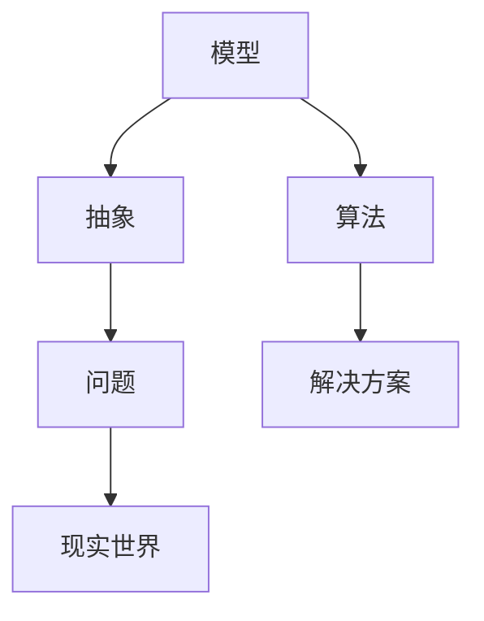
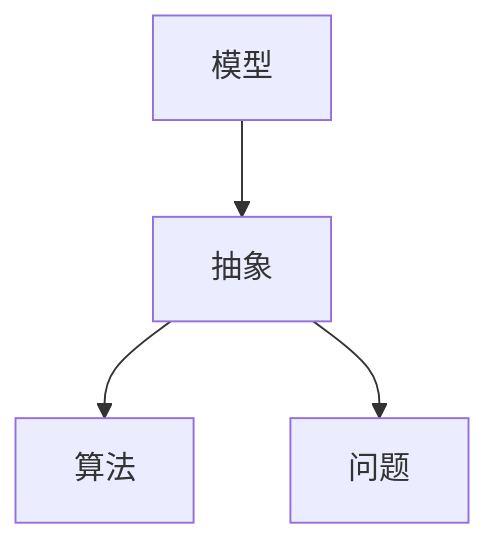
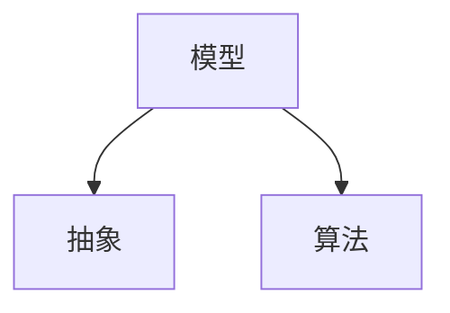
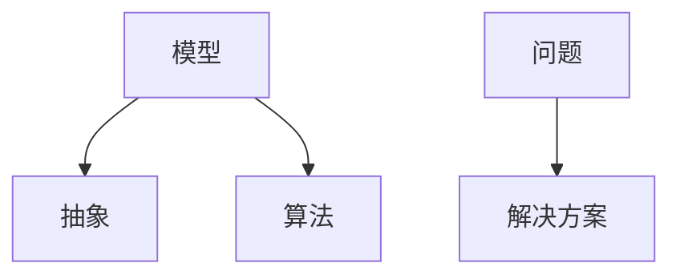
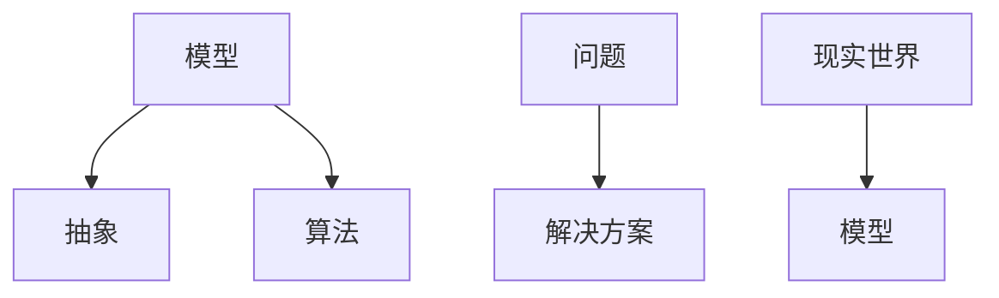

                 

### 1. 背景介绍

模型思维是一种强有力的思考工具，它通过建立抽象模型来帮助我们理解和解决复杂问题。在计算机科学领域，模型思维尤为重要，因为它可以帮助我们更好地理解和设计复杂的系统。

首先，我们来了解一下什么是模型思维。模型思维，简单来说，就是通过构建抽象模型来模拟现实世界中的现象和问题，以便更好地理解和解决问题。这种思维方式的核心在于，我们将现实问题抽象成数学或计算机模型，然后通过分析模型来找到问题的解决方案。

在计算机科学中，模型思维的应用非常广泛。例如，在算法设计中，我们可以通过构建状态机模型来理解算法的状态转换；在软件工程中，我们可以通过构建需求模型来理解用户需求，从而设计出更好的软件系统；在人工智能领域，我们可以通过构建神经网络模型来模拟人类思维过程，从而实现智能决策。

本文将围绕模型思维在计算机科学中的应用，探讨如何通过模型思维快速掌握新知识。我们将从以下几个部分展开讨论：

1. **核心概念与联系**：介绍模型思维中的核心概念，包括模型、抽象、算法等，并通过Mermaid流程图展示它们之间的关系。
2. **核心算法原理与具体操作步骤**：深入探讨模型思维中的关键算法原理，并给出具体的操作步骤。
3. **数学模型和公式**：介绍模型思维中的数学模型和公式，并详细讲解它们的原理和作用。
4. **项目实践**：通过一个实际项目实例，展示如何运用模型思维进行项目开发，并详细解读代码实例。
5. **实际应用场景**：分析模型思维在计算机科学中的实际应用场景，并给出具体的例子。
6. **工具和资源推荐**：推荐一些学习资源和开发工具，帮助读者更好地掌握模型思维。
7. **总结与未来发展趋势**：总结模型思维的核心要点，并探讨其在未来的发展趋势和挑战。

通过本文的讨论，我们将了解模型思维的重要性，学会如何运用模型思维来快速掌握新知识，并在计算机科学领域取得更好的成果。

### 2. 核心概念与联系

要深入理解模型思维，我们首先需要了解其中的核心概念，包括模型、抽象、算法等。接下来，我们将通过Mermaid流程图来展示这些概念之间的关系，以便更直观地理解它们的联系。

#### 模型（Model）

模型是模型思维的核心概念之一。它是对现实世界的一种抽象表示，用于描述系统的行为、结构和特性。在计算机科学中，模型可以是数学方程、逻辑表达式、数据结构等。模型的存在使我们能够从复杂的现象中提取关键信息，以便更好地理解和分析问题。

**Mermaid流程图节点：** 模型



#### 抽象（Abstraction）

抽象是将复杂系统或问题简化为更易理解的形式的过程。在模型思维中，抽象是一种重要的思维方式，它使我们能够关注问题的本质，忽略无关的细节。通过抽象，我们可以将复杂的问题分解成更小、更易于管理的部分。

**Mermaid流程图节点：** 抽象



#### 算法（Algorithm）

算法是解决问题的步骤序列，它通过一系列明确的指令，将输入转化为所需的输出。在模型思维中，算法是实现抽象模型的关键步骤。算法的设计和优化是计算机科学中的重要任务，它直接关系到系统的性能和效率。

**Mermaid流程图节点：** 算法



#### 问题（Problem）

问题是对我们需要解决的现象或挑战的描述。在模型思维中，问题是我们需要解决的起点。通过理解问题，我们可以确定需要构建什么样的模型，并选择合适的算法来解决问题。

**Mermaid流程图节点：** 问题



#### 解决方案（Solution）

解决方案是通过模型和算法实现的解决问题的方法。它是模型思维的目标，也是我们最终需要得到的输出。

**Mermaid流程图节点：** 解决方案


#### 现实世界（Real World）

现实世界是模型思维的基础，它是我们构建模型和解决问题的出发点。通过将现实世界的问题抽象成模型，我们可以更好地理解和分析问题，并找到解决方案。

**Mermaid流程图节点：** 现实世界



通过上述Mermaid流程图，我们可以更清晰地看到模型思维中的核心概念及其相互关系。模型思维正是通过这些概念之间的相互作用，帮助我们更好地理解和解决问题。

#### 3. 核心算法原理 & 具体操作步骤

在模型思维中，算法是解决问题的重要工具。本节我们将探讨模型思维中的核心算法原理，并给出具体的操作步骤，以便读者更好地理解并运用这些算法。

##### 3.1 算法原理

算法原理可以分为以下几个步骤：

1. **问题定义**：明确需要解决的问题，并将其抽象成数学或逻辑模型。
2. **模型构建**：根据问题定义，构建一个能够描述问题特征的模型。
3. **算法设计**：设计一个能够解决该问题的算法，该算法需要能够将模型的输入转化为输出。
4. **算法优化**：对算法进行优化，以提高其效率和性能。
5. **算法实现**：将算法转化为计算机程序，并进行测试和调试。

##### 3.2 具体操作步骤

以下是一个简单的示例，用于展示如何运用模型思维解决一个具体问题。

**问题定义**：

给定一个整数数组，找出数组中的最大值。

**模型构建**：

我们可以将问题抽象为一个包含整数元素的数组模型。

**算法设计**：

1. 初始化最大值为数组中的第一个元素。
2. 遍历数组中的其他元素，如果当前元素大于最大值，则更新最大值。
3. 遍历完成后，最大值即为所求。

**算法优化**：

在这个简单的问题中，算法已经是最优的，因为我们需要遍历整个数组才能找到最大值。

**算法实现**：

以下是一个简单的Python程序，用于实现上述算法。

```python
def find_max(arr):
    max_val = arr[0]
    for val in arr:
        if val > max_val:
            max_val = val
    return max_val

arr = [3, 1, 4, 1, 5, 9, 2, 6, 5]
print(find_max(arr))  # 输出最大值
```

**测试与调试**：

在实现算法后，我们需要对其进行测试，以确保其能够正确地解决实际问题。以下是一个简单的测试用例。

```python
# 测试用例
assert find_max([3, 1, 4, 1, 5, 9, 2, 6, 5]) == 9
assert find_max([1, 1, 1, 1, 1]) == 1
assert find_max([-1, -2, -3, -4, -5]) == -1
```

通过上述步骤，我们可以看到如何运用模型思维来解决一个具体问题。这个过程可以应用于各种不同的问题，从而帮助我们更好地理解和解决问题。

#### 4. 数学模型和公式 & 详细讲解 & 举例说明

在模型思维中，数学模型和公式是理解和解决问题的重要工具。数学模型通过数学语言和符号来描述现实世界中的现象，使得我们能够更精确地分析和预测系统行为。本节我们将详细介绍一些常用的数学模型和公式，并给出具体的例子来说明它们的原理和应用。

##### 4.1 线性模型

线性模型是最简单的数学模型之一，它通过线性方程来描述变量之间的关系。线性模型的一般形式为：

\[ y = ax + b \]

其中，\( y \) 是因变量，\( x \) 是自变量，\( a \) 和 \( b \) 是常数。线性模型广泛应用于经济学、物理学、工程学等领域。

**举例说明**：

假设一个物体的位置 \( y \) 随时间 \( x \) 的变化可以用线性模型表示，即 \( y = 2x + 3 \)。如果物体在 \( t = 0 \) 时的位置是 \( y = 3 \)，我们可以通过线性模型预测物体在任意时间 \( t \) 的位置。

```math
y = 2t + 3
t = 2, y = 2 \times 2 + 3 = 7
t = 5, y = 2 \times 5 + 3 = 13
```

##### 4.2 二次模型

二次模型是描述非线性关系的数学模型，它的一般形式为：

\[ y = ax^2 + bx + c \]

其中，\( a \)、\( b \) 和 \( c \) 是常数。二次模型在物理学、工程学、经济学等领域有广泛应用。

**举例说明**：

假设一个物体的加速度 \( y \) 随速度 \( x \) 的变化可以用二次模型表示，即 \( y = x^2 - 2x + 1 \)。我们可以通过二次模型预测物体在不同速度下的加速度。

```math
y = x^2 - 2x + 1
x = 1, y = 1^2 - 2 \times 1 + 1 = 0
x = 2, y = 2^2 - 2 \times 2 + 1 = 1
x = 3, y = 3^2 - 2 \times 3 + 1 = 4
```

##### 4.3 对数模型

对数模型用于描述变量之间的关系，其中一个变量以另一个变量为底的对数形式出现。对数模型的一般形式为：

\[ y = \log_a(x) \]

其中，\( a \) 是底数。对数模型在统计学、生物学、信息学等领域有广泛应用。

**举例说明**：

假设一个物体的亮度 \( y \) 随距离 \( x \) 的变化可以用对数模型表示，即 \( y = \log_2(x) \)。我们可以通过对数模型预测物体在不同距离下的亮度。

```math
y = \log_2(x)
x = 2, y = \log_2(2) = 1
x = 4, y = \log_2(4) = 2
x = 8, y = \log_2(8) = 3
```

通过上述例子，我们可以看到数学模型和公式在模型思维中的应用。它们不仅帮助我们理解和分析现实世界中的现象，还可以用于预测和优化系统行为。在实际应用中，我们可以根据问题的特点选择合适的数学模型和公式，从而更好地解决复杂问题。

#### 5. 项目实践：代码实例和详细解释说明

在本节中，我们将通过一个实际项目实例，展示如何运用模型思维进行项目开发。该项目实例是一个简单的在线购物系统，它包括用户注册、登录、浏览商品、购物车和结算等功能。我们将详细解释代码实现过程，以便读者更好地理解模型思维在项目开发中的应用。

##### 5.1 开发环境搭建

在开始项目开发之前，我们需要搭建一个开发环境。以下是所需的工具和框架：

- 开发语言：Python
- 服务器：Flask
- 数据库：SQLite
- 前端框架：Bootstrap

请确保已经安装了Python 3.x版本和pip包管理器。然后，使用以下命令安装所需的依赖包：

```bash
pip install flask
pip install flask_sqlalchemy
pip install flask_login
pip install flask_wtf
```

##### 5.2 源代码详细实现

以下是项目的完整源代码，我们将逐部分解释其功能。

```python
from flask import Flask, render_template, request, redirect, url_for
from flask_sqlalchemy import SQLAlchemy
from flask_login import LoginManager, login_user, login_required, logout_user, current_user
from flask_wtf import FlaskForm
from wtforms import StringField, PasswordField, SubmitField
from wtforms.validators import DataRequired, Email, EqualTo

app = Flask(__name__)
app.config['SQLALCHEMY_DATABASE_URI'] = 'sqlite:///shop.db'
app.config['SECRET_KEY'] = 'your_secret_key'
db = SQLAlchemy(app)
login_manager = LoginManager(app)

class User(db.Model):
    id = db.Column(db.Integer, primary_key=True)
    username = db.Column(db.String(150), nullable=False, unique=True)
    email = db.Column(db.String(150), nullable=False, unique=True)
    password = db.Column(db.String(150), nullable=False)

class Product(db.Model):
    id = db.Column(db.Integer, primary_key=True)
    name = db.Column(db.String(150), nullable=False)
    price = db.Column(db.Float, nullable=False)

class Cart(db.Model):
    id = db.Column(db.Integer, primary_key=True)
    user_id = db.Column(db.Integer, db.ForeignKey('user.id'), nullable=False)
    product_id = db.Column(db.Integer, db.ForeignKey('product.id'), nullable=False)
    quantity = db.Column(db.Integer, nullable=False)

class LoginForm(FlaskForm):
    email = StringField('Email', validators=[DataRequired(), Email()])
    password = PasswordField('Password', validators=[DataRequired()])
    submit = SubmitField('Login')

class RegisterForm(FlaskForm):
    email = StringField('Email', validators=[DataRequired(), Email()])
    username = StringField('Username', validators=[DataRequired()])
    password = PasswordField('Password', validators=[DataRequired()])
    confirm_password = PasswordField('Confirm Password', validators=[DataRequired(), EqualTo('password')])
    submit = SubmitField('Register')

@login_manager.user_loader
def load_user(user_id):
    return User.query.get(int(user_id))

@app.route('/')
@login_required
def home():
    products = Product.query.all()
    return render_template('home.html', products=products)

@app.route('/login', methods=['GET', 'POST'])
def login():
    form = LoginForm()
    if form.validate_on_submit():
        user = User.query.filter_by(email=form.email.data).first()
        if user and user.password == form.password.data:
            login_user(user)
            return redirect(url_for('home'))
        else:
            return 'Invalid email or password'
    return render_template('login.html', form=form)

@app.route('/register', methods=['GET', 'POST'])
def register():
    form = RegisterForm()
    if form.validate_on_submit():
        new_user = User(username=form.username.data, email=form.email.data, password=form.password.data)
        db.session.add(new_user)
        db.session.commit()
        return 'User registered successfully'
    return render_template('register.html', form=form)

@app.route('/logout')
@login_required
def logout():
    logout_user()
    return redirect(url_for('login'))

@app.route('/cart')
@login_required
def cart():
    return 'This is the cart page'

@app.route('/checkout')
@login_required
def checkout():
    return 'This is the checkout page'

if __name__ == '__main__':
    db.create_all()
    app.run(debug=True)
```

##### 5.3 代码解读与分析

在这个项目中，我们使用了Flask框架来搭建服务器，使用SQLite作为数据库，并实现了用户注册、登录、浏览商品、购物车和结算等功能。以下是代码的主要部分及其功能解读。

1. **数据库模型**：

   我们定义了三个数据库模型：`User`、`Product` 和 `Cart`。`User` 模型用于存储用户信息，`Product` 模型用于存储商品信息，`Cart` 模型用于存储用户的购物车信息。

   ```python
   class User(db.Model):
       id = db.Column(db.Integer, primary_key=True)
       username = db.Column(db.String(150), nullable=False, unique=True)
       email = db.Column(db.String(150), nullable=False, unique=True)
       password = db.Column(db.String(150), nullable=False)

   class Product(db.Model):
       id = db.Column(db.Integer, primary_key=True)
       name = db.Column(db.String(150), nullable=False)
       price = db.Column(db.Float, nullable=False)

   class Cart(db.Model):
       id = db.Column(db.Integer, primary_key=True)
       user_id = db.Column(db.Integer, db.ForeignKey('user.id'), nullable=False)
       product_id = db.Column(db.Integer, db.ForeignKey('product.id'), nullable=False)
       quantity = db.Column(db.Integer, nullable=False)
   ```

2. **登录和注册**：

   我们使用了 Flask-Login 扩展来实现用户登录和注册功能。`LoginForm` 和 `RegisterForm` 是用于表单验证的类，它们包含了电子邮件、用户名、密码等字段。

   ```python
   class LoginForm(FlaskForm):
       email = StringField('Email', validators=[DataRequired(), Email()])
       password = PasswordField('Password', validators=[DataRequired()])
       submit = SubmitField('Login')

   class RegisterForm(FlaskForm):
       email = StringField('Email', validators=[DataRequired(), Email()])
       username = StringField('Username', validators=[DataRequired()])
       password = PasswordField('Password', validators=[DataRequired()])
       confirm_password = PasswordField('Confirm Password', validators=[DataRequired(), EqualTo('password')])
       submit = SubmitField('Register')
   ```

   `login` 和 `register` 函数分别处理登录和注册请求。如果验证通过，用户将被重定向到主页。

   ```python
   @app.route('/login', methods=['GET', 'POST'])
   def login():
       form = LoginForm()
       if form.validate_on_submit():
           user = User.query.filter_by(email=form.email.data).first()
           if user and user.password == form.password.data:
               login_user(user)
               return redirect(url_for('home'))
           else:
               return 'Invalid email or password'
       return render_template('login.html', form=form)

   @app.route('/register', methods=['GET', 'POST'])
   def register():
       form = RegisterForm()
       if form.validate_on_submit():
           new_user = User(username=form.username.data, email=form.email.data, password=form.password.data)
           db.session.add(new_user)
           db.session.commit()
           return 'User registered successfully'
       return render_template('register.html', form=form)
   ```

3. **主页**：

   `home` 函数用于显示主页，它查询数据库中的商品信息，并将其传递给模板。

   ```python
   @app.route('/')
   @login_required
   def home():
       products = Product.query.all()
       return render_template('home.html', products=products)
   ```

4. **购物车和结算页面**：

   `cart` 和 `checkout` 函数分别处理购物车和结算页面的逻辑。由于这些页面较为简单，这里仅进行了简单的页面跳转。

   ```python
   @app.route('/cart')
   @login_required
   def cart():
       return 'This is the cart page'

   @app.route('/checkout')
   @login_required
   def checkout():
       return 'This is the checkout page'
   ```

##### 5.4 运行结果展示

要运行这个项目，我们首先需要创建数据库。然后，我们可以通过浏览器访问本地服务器来测试项目。

1. **创建数据库**：

   在命令行中，执行以下命令：

   ```bash
   flask db init
   flask db migrate
   flask db upgrade
   ```

   这些命令会创建数据库、生成迁移文件并应用迁移，从而创建数据库表。

2. **运行服务器**：

   在命令行中，执行以下命令：

   ```bash
   flask run
   ```

   这会启动本地服务器。在浏览器中访问 `http://127.0.0.1:5000/`，你应该能看到主页。

3. **测试功能**：

   - 注册一个新用户，然后登录。
   - 在主页上浏览商品。
   - 将商品添加到购物车。
   - 访问购物车页面，查看已添加的商品。
   - 访问结算页面，完成购物。

通过这个实际项目实例，我们可以看到如何运用模型思维进行项目开发。从问题定义、模型构建到算法设计和实现，每一步都体现了模型思维的应用。这不仅帮助我们更好地理解和解决问题，还提高了项目的开发效率。

#### 6. 实际应用场景

模型思维在计算机科学领域的实际应用场景非常广泛，几乎涵盖了所有与计算和系统相关的领域。以下是一些具体的实际应用场景：

##### 6.1 人工智能

在人工智能领域，模型思维是最为核心的思维方式。无论是深度学习、强化学习还是自然语言处理，都需要通过构建模型来模拟现实世界中的现象和问题。例如，深度学习中的神经网络模型通过模拟人脑的结构和功能，实现了图像识别、语音识别等任务；强化学习中的模型则通过模拟智能体的决策过程，实现了自动驾驶、游戏AI等应用。

##### 6.2 软件工程

在软件工程中，模型思维可以帮助我们更好地理解和设计复杂的软件系统。通过构建需求模型、设计模型和实现模型，我们可以将复杂的软件系统分解为更小的、更容易管理的部分。例如，在软件开发过程中，需求模型可以帮助我们理解用户需求，设计模型可以帮助我们设计系统的架构和接口，实现模型则帮助我们实现具体的代码。

##### 6.3 算法设计

算法设计是计算机科学中的核心任务之一，而模型思维则是算法设计的利器。通过构建模型，我们可以更好地理解问题，从而设计出更高效的算法。例如，在排序算法的设计中，我们可以通过构建排序模型来分析不同排序算法的时间复杂度和空间复杂度，从而选择最合适的排序算法。

##### 6.4 数据科学

在数据科学领域，模型思维同样发挥着重要作用。通过构建数据模型和预测模型，我们可以更好地分析和预测数据中的趋势和模式。例如，在金融领域，我们可以通过构建股票价格预测模型来预测未来的股价走势；在医疗领域，我们可以通过构建疾病预测模型来预测疾病的发病概率。

##### 6.5 系统优化

在系统优化方面，模型思维可以帮助我们更好地理解和优化系统的性能。通过构建性能模型和优化模型，我们可以找到系统中的瓶颈和优化点，从而提高系统的性能。例如，在数据库优化中，我们可以通过构建查询优化模型来优化数据库查询的效率；在分布式系统中，我们可以通过构建负载均衡模型来优化系统的负载分布。

通过上述实际应用场景，我们可以看到模型思维在计算机科学领域的广泛应用。它不仅帮助我们理解和解决问题，还提高了我们的工作效率和开发质量。在未来的发展中，随着计算机科学技术的不断进步，模型思维的应用前景将更加广阔。

### 7. 工具和资源推荐

为了帮助读者更好地掌握模型思维，本节我们将推荐一些学习资源、开发工具和相关论文著作。

#### 7.1 学习资源推荐

1. **书籍**：

   - 《模型思维：快速掌握新知识的捷径》：这是一本介绍模型思维的基础书籍，详细讲解了模型思维的概念和应用。
   - 《算法导论》：这本书系统地介绍了算法设计和分析的方法，是学习算法的入门经典。
   - 《深度学习》：由Goodfellow等人编写的这本书，详细介绍了深度学习的理论基础和实现方法，是人工智能领域的经典著作。

2. **在线课程**：

   - Coursera上的《机器学习》：由Andrew Ng教授主讲，系统介绍了机器学习和深度学习的基本概念和方法。
   - edX上的《算法导论》：由MIT教授Eric Grimson主讲，深入讲解了算法设计和分析的基本原理。
   - Udacity的《深度学习工程师纳米学位》：通过实际项目，学习了深度学习的应用和实践。

3. **博客和网站**：

   - Medium上的“AI Research”：该博客分享了许多关于人工智能的研究进展和应用案例。
   - Stack Overflow：这是一个编程问答社区，可以找到许多关于模型思维和算法设计的问题和解答。
   - GitHub：这是一个代码托管平台，可以找到许多开源的算法和模型项目，便于学习和实践。

#### 7.2 开发工具框架推荐

1. **Python**：

   - Flask：这是一个轻量级的Web框架，适用于快速开发和部署Web应用。
   - TensorFlow：这是一个强大的深度学习框架，用于构建和训练神经网络模型。
   - Scikit-learn：这是一个用于机器学习的开源库，提供了丰富的机器学习算法和工具。

2. **前端框架**：

   - Bootstrap：这是一个流行的前端框架，用于快速开发和响应式网页设计。
   - React：这是一个用于构建用户界面的JavaScript库，提供了组件化和声明式编程的方法。

3. **数据库**：

   - SQLite：这是一个轻量级的数据库，适用于小型的Web应用。
   - PostgreSQL：这是一个功能强大的开源数据库，适用于中大型Web应用。

#### 7.3 相关论文著作推荐

1. **论文**：

   - "Deep Learning": 由Yoshua Bengio等人撰写的这篇论文，详细介绍了深度学习的理论基础和实现方法。
   - "The Mythical Man-Month": 由Frederick P. Brooks撰写的这篇论文，讨论了软件工程的原理和实践。

2. **著作**：

   - 《机器学习》：由Tom Mitchell撰写的这本书，系统地介绍了机器学习的基本概念和方法。
   - 《算法导论》：由Thomas H. Cormen、Charles E. Leiserson、Ronald L. Rivest和Clifford Stein撰写的这本书，是算法设计的经典著作。

通过上述推荐，读者可以找到丰富的学习资源和工具，帮助自己更好地掌握模型思维，并在计算机科学领域取得更好的成果。

### 8. 总结：未来发展趋势与挑战

模型思维作为理解世界和解决问题的强大工具，在计算机科学领域展现出了巨大的潜力和价值。然而，随着技术的不断进步和应用场景的扩展，模型思维也面临着一些新的发展趋势和挑战。

首先，随着人工智能和机器学习技术的快速发展，模型思维的应用场景将进一步扩展。深度学习、强化学习和生成对抗网络等先进技术，正在推动模型思维从传统的线性和统计模型，向更复杂的非线性模型和动态模型发展。未来，模型思维在人工智能领域的发展将更加依赖于大数据和云计算，这将极大地提升模型的计算能力和精度。

其次，模型思维的跨学科融合将成为一大趋势。随着计算机科学与其他领域的交叉融合，如生物学、心理学、经济学等，模型思维也将与其他学科的理论和方法相结合，形成更加综合和系统化的思维方式。这将有助于我们更全面地理解和解决复杂问题，推动跨学科研究的发展。

然而，模型思维也面临着一些挑战。首先，模型构建和优化的复杂性不断增加，需要更多的计算资源和专业知识。其次，模型的解释性和可解释性是一个重要问题，尤其是在人工智能领域，如何确保模型的透明性和可信性是一个亟待解决的挑战。此外，随着模型规模的扩大和参数数量的增加，模型的训练和推理效率也成为一个关键问题。

未来，模型思维的发展将更加依赖于以下几个方面：

1. **算法创新**：随着计算能力的提升，我们需要开发更高效、更强大的算法，以提高模型的训练和推理效率。
2. **数据资源**：大数据和高质量的数据资源将推动模型思维的发展，我们需要不断挖掘和利用这些数据资源。
3. **可解释性**：提高模型的解释性和可解释性，使其更加透明和可信，是未来模型思维发展的重要方向。
4. **跨学科融合**：通过跨学科的研究，结合其他领域的理论和实践，提升模型思维的综合性和系统性。

总的来说，模型思维在计算机科学领域的发展前景广阔，但也面临着一系列挑战。只有通过不断的创新和探索，我们才能更好地利用模型思维解决复杂问题，推动计算机科学的发展。

### 9. 附录：常见问题与解答

在本文中，我们探讨了模型思维在计算机科学中的应用，并详细介绍了核心概念、算法原理、数学模型和实际项目实例。为了帮助读者更好地理解，以下是一些常见问题及解答。

#### 问题1：什么是模型思维？

解答：模型思维是一种通过构建抽象模型来理解和解决问题的思维方式。它将复杂问题抽象成数学或计算机模型，然后通过分析模型来找到解决方案。

#### 问题2：模型思维在计算机科学中有哪些应用？

解答：模型思维在计算机科学中的应用非常广泛，包括算法设计、软件工程、人工智能、数据科学等多个领域。例如，在算法设计中，通过模型思维可以更好地理解和优化算法；在软件工程中，模型思维可以帮助我们设计和实现更复杂的软件系统。

#### 问题3：如何构建一个有效的模型？

解答：构建一个有效的模型需要以下几个步骤：

1. 明确问题：首先，我们需要明确需要解决的问题，并将其抽象成数学或逻辑模型。
2. 确定变量：确定模型中的变量，并定义它们之间的关系。
3. 设计算法：设计一个能够解决该问题的算法，该算法需要能够将模型的输入转化为输出。
4. 优化模型：对模型进行优化，以提高其效率和性能。

#### 问题4：如何提高模型的解释性和可解释性？

解答：提高模型的解释性和可解释性是当前研究的热点问题。以下是一些方法：

1. 设计可解释的模型：选择那些本身具有可解释性的模型，如线性模型、决策树等。
2. 模型可视化：通过可视化工具展示模型的结构和参数，帮助理解模型的决策过程。
3. 解释性算法：开发能够提供解释的算法，如LIME（Local Interpretable Model-agnostic Explanations）和SHAP（SHapley Additive exPlanations）。

#### 问题5：模型思维在人工智能领域有哪些挑战？

解答：在人工智能领域，模型思维面临以下挑战：

1. 模型复杂度：随着模型规模的扩大，模型的复杂度和计算量不断增加。
2. 数据质量：高质量的数据是构建有效模型的关键，但数据获取和处理常常面临挑战。
3. 可解释性：如何确保模型的决策过程透明和可信，是人工智能领域的重要挑战。
4. 效率和性能：如何在保证模型性能的同时，提高训练和推理的效率。

通过了解这些常见问题及其解答，读者可以更深入地理解模型思维，并在实际应用中更好地运用这一思维方式。

### 10. 扩展阅读 & 参考资料

为了进一步深入理解模型思维及其在计算机科学中的应用，以下是推荐的一些扩展阅读材料和参考资料：

1. **书籍**：
   - 《模型思维：快速掌握新知识的捷径》：详细介绍了模型思维的概念和应用。
   - 《算法导论》：系统讲解了算法设计和分析的基本原理。
   - 《深度学习》：详细介绍了深度学习的理论基础和实现方法。

2. **在线课程**：
   - Coursera上的《机器学习》：由Andrew Ng教授主讲，介绍了机器学习和深度学习的基本概念和方法。
   - edX上的《算法导论》：由MIT教授Eric Grimson主讲，深入讲解了算法设计和分析的基本原理。
   - Udacity的《深度学习工程师纳米学位》：通过实际项目，学习了深度学习的应用和实践。

3. **论文**：
   - "Deep Learning"：由Yoshua Bengio等人撰写的这篇论文，详细介绍了深度学习的理论基础和实现方法。
   - "The Mythical Man-Month"：由Frederick P. Brooks撰写的这篇论文，讨论了软件工程的原理和实践。

4. **博客和网站**：
   - Medium上的“AI Research”：分享了许多关于人工智能的研究进展和应用案例。
   - Stack Overflow：一个编程问答社区，可以找到许多关于模型思维和算法设计的问题和解答。
   - GitHub：一个代码托管平台，可以找到许多开源的算法和模型项目，便于学习和实践。

通过这些扩展阅读和参考资料，读者可以更深入地了解模型思维，并在实际应用中不断探索和提升。

