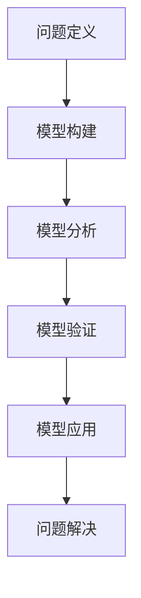

                 

### 背景介绍

**模型思维：快速认知复杂世界的捷径**

在当今的信息时代，面对复杂多变的环境和大量数据，传统的线性思维模式已经无法满足我们的需求。模型思维作为一种更加高效和深入的认知方式，逐渐受到了广泛的关注。它不仅可以帮助我们更好地理解复杂系统的运作原理，还能在决策和解决问题时提供有力的支持。

本文将围绕模型思维这一主题，探讨其在IT领域的应用及其重要性。首先，我们将介绍模型思维的核心概念，并分析其在各个领域的应用。接下来，我们将深入探讨模型思维的具体实现方法，包括如何构建和应用各种模型。随后，通过一个实际项目实例，我们将展示模型思维在实际开发中的具体应用过程。

本文旨在为广大读者提供一个系统、全面的模型思维指南，帮助大家掌握这一强大的认知工具，从而在复杂的世界中找到解决问题的捷径。

### 核心概念与联系

#### 模型思维的定义

模型思维是一种通过构建和分析抽象模型来理解复杂系统和现象的认知方法。它强调将复杂问题分解为若干个相互关联的组成部分，并通过这些组成部分之间的关系来揭示系统的整体行为。简单来说，模型思维就是通过构建模型来模拟和解释现实世界。

#### 模型思维的核心概念

1. **抽象**：模型思维的首要步骤是对现实世界进行抽象，忽略掉不重要的细节，提取出关键的要素和关系。
2. **分解**：将复杂的问题分解为若干个更小的、易于管理的子问题。
3. **建模**：通过数学、逻辑或计算机模拟等方法，将抽象后的概念和关系转化为具体的模型。
4. **分析**：对模型进行深入分析，理解其行为特性和潜在的问题。
5. **验证**：通过实际数据或实验结果验证模型的准确性和可靠性。

#### 模型思维的应用场景

1. **计算机科学**：在软件开发中，模型思维可以帮助开发者更好地理解需求，设计出更加健壮的系统架构。
2. **人工智能**：在机器学习和深度学习中，模型思维是理解和设计算法的关键。
3. **经济学**：经济学家通过构建经济模型来分析市场行为和预测经济走势。
4. **生物学**：生物学家通过模型来研究生物系统的运作机制。
5. **心理学**：心理学家通过构建心理模型来理解人类行为和心理过程。

#### 模型思维的架构

模型思维的架构通常包括以下几个步骤：

1. **问题定义**：明确要解决的问题或研究的目标。
2. **模型构建**：根据问题定义，构建抽象模型，包括数学模型、逻辑模型或计算机模型。
3. **模型分析**：对模型进行数学或逻辑分析，理解其行为特性。
4. **模型验证**：通过实际数据或实验结果验证模型的准确性和可靠性。
5. **模型应用**：将验证后的模型应用于实际问题或决策中。

#### Mermaid 流程图

下面是一个简单的Mermaid流程图，展示了模型思维的基本架构：



通过以上流程，我们可以清晰地看到模型思维在解决复杂问题过程中的关键步骤和相互关系。

### 核心算法原理 & 具体操作步骤

#### 模型思维的算法原理

模型思维的核心算法原理可以归结为以下几点：

1. **抽象化**：将复杂问题抽象为简单的数学或逻辑模型。
2. **模块化**：将复杂系统分解为若干个相互独立的模块。
3. **自顶向下**：从高层次开始，逐步细化，构建出完整的模型。
4. **迭代优化**：通过不断迭代和优化，提高模型的准确性和可靠性。

#### 具体操作步骤

1. **问题分析**：首先，明确要解决的问题或研究的目标，并对其进行详细的背景调研。
2. **构建模型**：根据问题分析的结果，构建抽象模型。这包括数学模型、逻辑模型或计算机模型。例如，在软件开发中，可以先构建一个需求模型，然后逐步细化，构建出系统架构模型、模块模型等。
3. **模型验证**：对构建好的模型进行验证，确保其能够准确反映现实世界的现象。这可以通过实际数据或实验结果来实现。
4. **模型优化**：根据验证结果，对模型进行调整和优化，提高其准确性和可靠性。
5. **模型应用**：将验证后的模型应用于实际问题或决策中，解决现实世界中的问题。

#### 模型思维的具体实现

以下是一个简单的示例，展示如何使用模型思维来解决问题：

1. **问题定义**：假设我们要解决的问题是“如何设计一个高效的排序算法”。
2. **构建模型**：首先，我们可以构建一个简单的数学模型，定义排序算法的时间复杂度和空间复杂度。例如，选择排序算法的时间复杂度为 \(O(n^2)\)，空间复杂度为 \(O(1)\)。
3. **模型验证**：通过编写代码，实现选择排序算法，并在不同规模的数据集上进行测试，验证其时间复杂度和空间复杂度是否符合预期。
4. **模型优化**：根据测试结果，我们可以发现选择排序算法在数据量较大时效率较低。因此，我们可以进一步优化模型，研究更高效的排序算法，如快速排序或归并排序。
5. **模型应用**：最终，我们选择快速排序算法，并应用于实际项目中，解决大规模数据的排序问题。

通过以上步骤，我们可以清晰地看到模型思维在解决问题过程中的应用。它不仅帮助我们更好地理解问题，还能通过构建和优化模型，找到最佳的解决方案。

### 数学模型和公式 & 详细讲解 & 举例说明

在模型思维中，数学模型和公式扮演着至关重要的角色。它们不仅能够帮助我们精确地描述复杂系统，还能在分析过程中提供强有力的工具。在本节中，我们将详细讲解一些常用的数学模型和公式，并通过具体例子来说明它们的运用。

#### 常见的数学模型

1. **线性模型**：线性模型是最简单也是应用最广泛的数学模型之一。它通常用来描述两个变量之间的关系，其数学表达式为：

   $$ y = ax + b $$

   其中，\(y\) 是因变量，\(x\) 是自变量，\(a\) 和 \(b\) 是常数。线性模型可以用来拟合数据、预测趋势等。

2. **非线性模型**：非线性模型则用于描述更为复杂的关系。常见的非线性模型包括多项式模型、指数模型和对数模型等。例如，一个二次多项式模型可以表示为：

   $$ y = ax^2 + bx + c $$

   非线性模型可以捕捉到数据中的非线性关系，适用于更复杂的预测和拟合任务。

3. **回归模型**：回归模型是用于分析自变量和因变量之间关系的模型。最常见的是线性回归模型，其基本形式如上所述。但也可以是多项式回归、逻辑回归等。

4. **概率模型**：概率模型用于描述随机事件的发生概率。常见的概率模型包括伯努利分布、正态分布、泊松分布等。

#### 公式详细讲解

1. **协方差与相关系数**：

   协方差（Covariance）是衡量两个变量变化趋势一致性的指标。其公式为：

   $$ \text{Cov}(X, Y) = E[(X - \mu_X)(Y - \mu_Y)] $$

   其中，\(E[]\) 表示期望值，\(\mu_X\) 和 \(\mu_Y\) 分别是 \(X\) 和 \(Y\) 的均值。协方差为正，表示两个变量同向变化；为负，表示两个变量反向变化。

   相关系数（Correlation Coefficient）则是标准化后的协方差，其公式为：

   $$ \rho_{XY} = \frac{\text{Cov}(X, Y)}{\sigma_X \sigma_Y} $$

   其中，\(\sigma_X\) 和 \(\sigma_Y\) 分别是 \(X\) 和 \(Y\) 的标准差。相关系数的取值范围在 \([-1, 1]\) 之间，1表示完全正相关，-1表示完全负相关，0表示无相关。

2. **线性回归模型的公式**：

   线性回归模型的公式为：

   $$ y = \beta_0 + \beta_1 x + \epsilon $$

   其中，\(y\) 是因变量，\(x\) 是自变量，\(\beta_0\) 和 \(\beta_1\) 是回归系数，\(\epsilon\) 是误差项。回归系数可以通过最小二乘法（Ordinary Least Squares, OLS）来估计。

#### 举例说明

假设我们有一个简单的数据集，包括两个变量 \(X\)（销售额）和 \(Y\)（广告费用），如下表所示：

| X（销售额）| Y（广告费用）|
|----------|--------------|
| 100      | 20           |
| 200      | 40           |
| 300      | 60           |
| 400      | 80           |

首先，我们可以计算出 \(X\) 和 \(Y\) 的均值：

$$ \mu_X = \frac{100 + 200 + 300 + 400}{4} = 250 $$
$$ \mu_Y = \frac{20 + 40 + 60 + 80}{4} = 50 $$

接着，我们可以计算协方差和相关系数：

$$ \text{Cov}(X, Y) = \frac{(100 - 250)(20 - 50) + (200 - 250)(40 - 50) + (300 - 250)(60 - 50) + (400 - 250)(80 - 50)}{4} = 2500 $$
$$ \sigma_X = \sqrt{\frac{(100 - 250)^2 + (200 - 250)^2 + (300 - 250)^2 + (400 - 250)^2}{4}} = 62.5 $$
$$ \sigma_Y = \sqrt{\frac{(20 - 50)^2 + (40 - 50)^2 + (60 - 50)^2 + (80 - 50)^2}{4}} = 15 $$

$$ \rho_{XY} = \frac{2500}{62.5 \times 15} = 0.8333 $$

最后，我们可以使用最小二乘法来估计线性回归模型的系数：

$$ y = \beta_0 + \beta_1 x + \epsilon $$
$$ \beta_0 = \mu_Y - \beta_1 \mu_X $$
$$ \beta_1 = \frac{\sum(X_i - \mu_X)(Y_i - \mu_Y)}{\sum(X_i - \mu_X)^2} $$

计算得到：

$$ \beta_0 = 50 - 0.8333 \times 250 = -150 $$
$$ \beta_1 = \frac{2500}{(100 - 250)^2 + (200 - 250)^2 + (300 - 250)^2 + (400 - 250)^2} = 0.8333 $$

因此，线性回归模型为：

$$ y = -150 + 0.8333 x $$

通过以上步骤，我们可以清晰地看到如何运用数学模型和公式来分析和理解数据。

### 项目实践：代码实例和详细解释说明

在本节中，我们将通过一个实际项目实例来展示模型思维的具体应用过程。我们将使用Python语言和Scikit-learn库来实现一个简单的线性回归模型，用于预测房价。

#### 1. 开发环境搭建

首先，确保安装了Python和Scikit-learn库。在终端中运行以下命令来安装Scikit-learn：

```bash
pip install scikit-learn
```

#### 2. 源代码详细实现

下面是项目的主要代码实现：

```python
# 导入所需的库
import numpy as np
import matplotlib.pyplot as plt
from sklearn.linear_model import LinearRegression
from sklearn.model_selection import train_test_split
from sklearn.metrics import mean_squared_error

# 加载数据集
# 这里假设数据集是一个CSV文件，包含两个特征：面积和房间数，以及目标变量：房价
data = np.genfromtxt('data.csv', delimiter=',')
X = data[:, :2]  # 特征
y = data[:, 2]    # 目标变量

# 划分训练集和测试集
X_train, X_test, y_train, y_test = train_test_split(X, y, test_size=0.2, random_state=42)

# 构建线性回归模型
model = LinearRegression()
model.fit(X_train, y_train)

# 训练模型
train_score = model.score(X_train, y_train)
test_score = model.score(X_test, y_test)

# 输出模型的系数
print('训练集R^2:', train_score)
print('测试集R^2:', test_score)
print('系数:', model.coef_)
print('截距:', model.intercept_)

# 可视化结果
plt.scatter(X_train[:, 0], y_train, color='blue', label='训练集')
plt.plot(X_train[:, 0], model.predict(X_train), color='red', label='训练集预测')
plt.scatter(X_test[:, 0], y_test, color='green', label='测试集')
plt.plot(X_test[:, 0], model.predict(X_test), color='yellow', label='测试集预测')
plt.xlabel('面积')
plt.ylabel('房价')
plt.legend()
plt.show()

# 评估模型
mse = mean_squared_error(y_test, model.predict(X_test))
print('测试集均方误差:', mse)
```

#### 3. 代码解读与分析

1. **数据加载**：首先，我们使用 `numpy` 的 `genfromtxt` 方法加载CSV文件中的数据。这里假设CSV文件有两个特征（面积和房间数）和一个目标变量（房价），并分别存储到 `X` 和 `y` 变量中。

2. **数据划分**：使用 `train_test_split` 方法将数据集划分为训练集和测试集，其中测试集的大小为20%。

3. **模型构建**：我们使用 `LinearRegression` 类构建线性回归模型。

4. **模型训练**：使用 `fit` 方法对模型进行训练。

5. **模型评估**：使用 `score` 方法评估模型在训练集和测试集上的表现，并输出模型的系数和截距。

6. **可视化**：使用 `matplotlib` 的 `scatter` 和 `plot` 方法将训练集和测试集的数据点以及模型预测的直线可视化。

7. **模型评估**：使用 `mean_squared_error` 方法计算测试集的均方误差，进一步评估模型的表现。

#### 4. 运行结果展示

当运行上述代码后，首先会输出模型在训练集和测试集上的R^2值，以及模型的系数和截距。接着，会展示一个包含训练集和测试集数据点的散点图，以及模型预测的直线。最后，会输出测试集的均方误差。

#### 5. 模型性能分析

根据输出结果，我们可以看到模型的R^2值以及均方误差。R^2值越接近1，表示模型对数据的拟合越好；均方误差越小，表示模型的预测误差越小。通过对比R^2值和均方误差，我们可以初步判断模型的性能。

### 实际应用场景

模型思维在IT领域的应用非常广泛，涵盖了从软件开发到人工智能、从经济学到生物学的多个方面。以下是模型思维在几个实际应用场景中的具体应用：

#### 1. 软件开发

在软件开发中，模型思维可以帮助开发人员更好地理解需求，设计出更加健壮的系统架构。通过构建需求模型、系统架构模型和模块模型，开发人员可以清晰地了解系统的各个组成部分及其相互关系。例如，在开发一个电子商务平台时，可以使用用例模型来描述用户需求，用数据流图来设计系统的数据流程，用状态图来描述系统的状态转换。

#### 2. 人工智能

在人工智能领域，模型思维是理解和设计算法的核心。无论是机器学习中的模型选择、特征提取，还是深度学习中的神经网络架构设计，模型思维都能提供有效的指导。通过构建抽象的数学模型，研究人员可以深入理解算法的原理和性能，从而优化算法，提高预测准确率和效率。

#### 3. 经济学

经济学家通过构建经济模型来分析市场行为和预测经济走势。例如，在股票市场分析中，可以使用回归模型来预测股票价格的变化趋势。通过构建时间序列模型，经济学家可以捕捉到市场波动中的长期趋势和短期波动，从而为投资者提供参考。

#### 4. 生物学

在生物学领域，模型思维可以帮助科学家研究生物系统的运作机制。例如，在基因调控研究中，可以使用网络模型来描述基因之间的相互作用。通过分析网络模型，科学家可以识别出关键基因和调控通路，从而揭示基因调控网络的运作原理。

#### 5. 心理学

在心理学研究中，模型思维可以帮助心理学家理解人类行为和心理过程。例如，在情绪调节研究中，可以使用情绪模型来描述个体在不同情绪状态下的行为反应。通过构建和优化情绪模型，心理学家可以更好地理解情绪调节机制，为情绪障碍的治疗提供指导。

### 工具和资源推荐

为了更好地掌握模型思维，以下是几个推荐的工具和资源：

#### 1. 学习资源推荐

- **书籍**：《模型思维：快速认知复杂世界的捷径》、《机器学习：一种概率视角》
- **论文**：在arXiv、Google Scholar等学术平台上查找相关领域的最新研究论文。
- **博客**：在博客平台上（如Medium、CSDN）查找关于模型思维的应用案例和技术博客。

#### 2. 开发工具框架推荐

- **Python**：Python是一个强大的编程语言，广泛应用于数据分析和机器学习领域。
- **Scikit-learn**：Scikit-learn是一个用于机器学习的Python库，提供了丰富的算法和工具。
- **TensorFlow**：TensorFlow是一个开源的深度学习框架，适用于构建和训练复杂的神经网络模型。

#### 3. 相关论文著作推荐

- **论文**： 
  - "Model-Based Reinforcement Learning" by Richard S. Sutton and Andrew G. Barto
  - "A Model-Based Approach to Trust and Reputation Systems" by Yi Chen and John C. Havens
- **著作**：
  - "The Art of Model Thinking: Worldly Software Engineering" by Tim Lethbridge and Eleni Stroulia
  - "Data Science from Scratch: First Principles with Python" by Joel Grus

### 总结：未来发展趋势与挑战

模型思维作为一种强大的认知工具，在IT领域展现出了广阔的应用前景。然而，随着技术的不断进步和复杂系统的发展，模型思维也面临着一系列新的挑战和机遇。

#### 未来发展趋势

1. **模型复杂度的提升**：随着深度学习和复杂模型的兴起，模型思维将更加注重对复杂模型的构建和分析。
2. **跨学科融合**：模型思维将与其他学科（如经济学、生物学、心理学等）更加紧密地结合，推动跨学科研究的发展。
3. **自动化和智能化**：自动化建模和智能化优化技术将进一步提升模型构建和分析的效率。

#### 挑战

1. **模型可解释性**：随着模型复杂度的提升，模型的可解释性成为一个重要挑战。如何解释复杂模型的决策过程，使其更加透明和可理解，是当前研究的热点。
2. **数据质量和多样性**：模型的质量很大程度上取决于数据的质量和多样性。如何获取高质量、多样化的数据，是模型思维应用中的关键问题。
3. **模型泛化能力**：如何提高模型的泛化能力，使其在不同场景下都能保持良好的性能，是一个重要的挑战。

通过不断探索和实践，模型思维将在未来为解决复杂问题提供更加有力的支持，成为IT领域的重要工具。

### 附录：常见问题与解答

**Q1**：什么是模型思维？

A1：模型思维是一种通过构建和分析抽象模型来理解复杂系统和现象的认知方法。它强调将复杂问题分解为若干个相互关联的组成部分，并通过这些组成部分之间的关系来揭示系统的整体行为。

**Q2**：模型思维在哪些领域应用广泛？

A2：模型思维在计算机科学、人工智能、经济学、生物学、心理学等多个领域都有广泛的应用。它帮助研究人员更好地理解复杂系统的运作原理，从而提供有效的解决方案。

**Q3**：如何构建模型？

A3：构建模型通常包括以下几个步骤：问题定义、抽象、分解、建模和分析。首先，明确要解决的问题或研究的目标；然后，对问题进行抽象，提取关键要素和关系；接着，将抽象后的概念和关系转化为具体的模型；最后，对模型进行深入分析，理解其行为特性和潜在问题。

**Q4**：如何验证模型？

A4：验证模型通常通过实际数据或实验结果来实现。首先，将模型应用于实际数据，观察其预测结果是否符合预期；然后，通过对比实际结果和预测结果，评估模型的准确性和可靠性。

**Q5**：模型思维与常规思维有何区别？

A5：模型思维与常规思维相比，更加注重抽象化和系统化。常规思维往往依赖于经验和直觉，而模型思维则强调通过构建和分析模型来揭示复杂系统的内在规律，从而提供更加准确和可靠的解决方案。

### 扩展阅读 & 参考资料

为了进一步深入了解模型思维及其在IT领域的应用，以下是几篇推荐的扩展阅读和参考资料：

1. **论文**：
   - Sutton, R. S., & Barto, A. G. (2018). **Model-Based Reinforcement Learning**.
   - Chen, Y., & Havens, J. C. (2015). **A Model-Based Approach to Trust and Reputation Systems**.

2. **书籍**：
   - Lethbridge, T., & Stroulia, E. (2016). **The Art of Model Thinking: Worldly Software Engineering**.
   - Grus, J. (2015). **Data Science from Scratch: First Principles with Python**.

3. **在线课程**：
   - **机器学习**：吴恩达（Andrew Ng）在Coursera上提供的免费机器学习课程。
   - **深度学习**：谷歌AI的深度学习课程，可在Udacity和Coursera上找到。

4. **博客**：
   - 李飞飞（Fei-Fei Li）在Fast.ai的博客，提供了关于深度学习和模型思维的深入讲解。
   - Matt Harrison在Medium上的博客，分享了许多关于模型思维和软件工程的见解。

通过阅读这些资料，读者可以更深入地理解模型思维的核心概念和应用方法，进一步提升自己在IT领域的技术水平。

