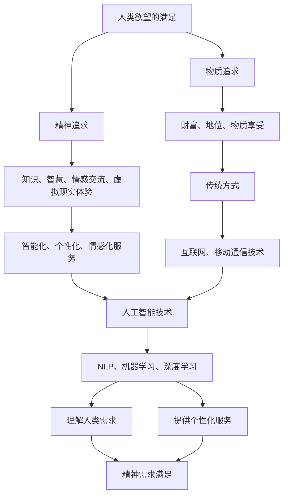

                 

### 欲望的去物质化引擎：AI时代的精神追求催化剂

在当今这个信息爆炸和科技进步日新月异的时代，人类的欲望似乎也在不断升级和进化。从物质层面的追求，如财富、地位、享乐，到精神层面的满足，如知识、智慧、情感交流，我们的欲望变得越来越复杂和多元化。然而，随着人工智能（AI）技术的迅猛发展，一个前所未有的去物质化趋势正在悄然兴起，它将深刻改变我们对欲望的追求方式。

本文将以“欲望的去物质化引擎：AI时代的精神追求催化剂”为主题，通过逐步分析推理的方式，探讨AI技术在满足人类精神需求方面所扮演的角色，以及如何通过这一技术实现人类欲望的升华。我们将从背景介绍、核心概念与联系、核心算法原理与具体操作步骤、数学模型与公式、项目实践、实际应用场景、工具和资源推荐、总结未来发展趋势与挑战等方面，全面阐述这一主题。

### 背景介绍

人类的欲望是一个复杂而又普遍存在的现象。在传统社会中，物质财富通常被视为满足欲望的主要途径。人们通过积累财富、追求社会地位和享受物质生活来实现自己的欲望。然而，随着科技的进步，尤其是互联网和移动通信技术的普及，人类社会进入了一个全新的阶段。

在这个阶段，人们的欲望开始从物质层面逐渐转向精神层面。知识、智慧、情感交流、虚拟现实体验等成为新的追求目标。这种转变源于几个方面的原因：

1. **信息的民主化**：互联网使得信息获取变得容易，人们不再局限于传统的知识渠道，可以通过在线学习、阅读等方式迅速获取知识，这为精神追求提供了新的途径。
2. **虚拟现实的兴起**：虚拟现实（VR）技术使得人们能够在虚拟世界中体验到前所未有的情感和刺激，这种体验不同于现实中的物质享受，更多地满足了人们的精神需求。
3. **人工智能的应用**：AI技术的发展，特别是自然语言处理、机器学习和深度学习等领域的突破，使得计算机能够更好地理解人类需求，提供个性化的服务和体验，从而满足人们的精神追求。

AI技术在这一过程中起到了催化剂的作用，它不仅改变了人类追求欲望的方式，也推动了社会和经济的深刻变革。通过AI，我们可以实现更加智能化、个性化、情感化的服务，这些服务能够更深入地满足人类的精神需求。

### 核心概念与联系

为了深入理解AI在满足人类精神需求方面所扮演的角色，我们需要明确几个核心概念和它们之间的联系。以下是这些概念及其关系的Mermaid流程图：



1. **人类欲望的满足**：这是我们的起点，包括物质追求和精神追求两个层面。
2. **物质追求与精神追求**：物质追求主要涉及财富、地位、物质享受，而精神追求则涵盖知识、智慧、情感交流、虚拟现实体验等方面。
3. **传统方式与智能化服务**：传统方式主要依赖于互联网和移动通信技术，而智能化服务则依赖于人工智能技术，特别是自然语言处理（NLP）、机器学习、深度学习等领域。
4. **AI技术在精神需求满足中的应用**：通过NLP、机器学习和深度学习等技术，AI能够更好地理解人类需求，提供个性化、情感化的服务，从而满足人们的精神追求。

通过上述流程图，我们可以清晰地看到AI技术在满足人类精神需求方面的关键作用。它不仅改变了人们追求欲望的方式，也推动了社会和经济的深刻变革。

### 核心算法原理与具体操作步骤

要深入探讨AI在满足人类精神需求方面的作用，我们需要了解其核心算法原理以及具体操作步骤。以下是几个关键的AI技术和它们的实现步骤：

#### 1. 自然语言处理（NLP）

自然语言处理是AI技术中的一个重要分支，它致力于使计算机能够理解、解释和生成人类语言。以下是NLP的核心算法原理和操作步骤：

1. **词嵌入（Word Embedding）**：
    - **原理**：将词汇映射到高维空间中的向量，以便计算机能够处理。
    - **步骤**：
        1. 数据预处理：清洗文本数据，去除标点符号、停用词等。
        2. 构建词汇表：将文本中的词汇映射到唯一的索引。
        3. 训练模型：使用神经网络训练词嵌入模型，如Word2Vec、GloVe等。

2. **句法分析（Syntax Analysis）**：
    - **原理**：分析句子的结构，理解词汇之间的语法关系。
    - **步骤**：
        1. 分词：将文本拆分为单词或词组。
        2. 构建语法树：使用依存关系分析技术构建句子的语法树。

3. **语义理解（Semantic Understanding）**：
    - **原理**：理解句子的语义，识别实体、关系和意图。
    - **步骤**：
        1. 实体识别：识别文本中的关键实体，如人名、地名等。
        2. 关系提取：确定实体之间的关系。
        3. 意图识别：理解用户的意图和需求。

#### 2. 机器学习（Machine Learning）

机器学习是AI技术的核心，它通过数据训练模型，使计算机能够进行预测和决策。以下是机器学习的核心算法原理和操作步骤：

1. **监督学习（Supervised Learning）**：
    - **原理**：使用标记数据训练模型，使模型能够对新的数据进行预测。
    - **步骤**：
        1. 数据预处理：清洗和归一化数据。
        2. 特征提取：提取数据中的关键特征。
        3. 模型训练：使用算法（如线性回归、决策树、神经网络等）训练模型。
        4. 模型评估：使用测试集评估模型性能。

2. **无监督学习（Unsupervised Learning）**：
    - **原理**：使用未标记数据，使模型能够发现数据中的模式和结构。
    - **步骤**：
        1. 数据预处理：清洗和归一化数据。
        2. 特征提取：提取数据中的关键特征。
        3. 模型训练：使用算法（如聚类、降维等）训练模型。
        4. 模型评估：使用测试集评估模型性能。

#### 3. 深度学习（Deep Learning）

深度学习是机器学习的一个分支，它通过多层神经网络进行特征学习和建模。以下是深度学习的核心算法原理和操作步骤：

1. **神经网络（Neural Networks）**：
    - **原理**：模拟人脑神经元的工作方式，通过输入层、隐藏层和输出层进行信息处理。
    - **步骤**：
        1. 神经网络架构设计：选择合适的网络结构，如卷积神经网络（CNN）、循环神经网络（RNN）、Transformer等。
        2. 数据预处理：清洗和归一化数据。
        3. 模型训练：使用反向传播算法训练模型，调整网络权重。
        4. 模型评估：使用测试集评估模型性能。

2. **优化算法（Optimization Algorithms）**：
    - **原理**：调整网络权重，使模型在训练过程中达到最佳性能。
    - **步骤**：
        1. 选择优化算法：如梯度下降、Adam优化器等。
        2. 调整学习率：选择合适的学习率，避免过拟合或欠拟合。
        3. 训练模型：迭代优化网络权重。

通过这些核心算法原理和操作步骤，AI能够更好地理解人类需求，提供个性化、情感化的服务，从而满足人们的精神追求。接下来，我们将探讨数学模型和公式在AI中的应用。

### 数学模型和公式 & 详细讲解 & 举例说明

在AI技术的应用中，数学模型和公式起着至关重要的作用。它们不仅帮助AI系统理解和处理复杂的数据，还能提供有效的算法指导。以下是几个关键数学模型和公式的详细讲解，并通过具体例子来说明它们在AI中的应用。

#### 1. 神经元激活函数

在神经网络中，神经元激活函数用于确定神经元是否应该“激活”，即输出值是否大于某个阈值。常用的激活函数包括：

- **线性激活函数（f(x) = x）**：
  - **原理**：输出与输入相同，没有非线性变换。
  - **适用场景**：主要用于隐藏层，但不是输出层。

- **Sigmoid激活函数（f(x) = 1 / (1 + e^-x）**：
  - **原理**：将输入映射到(0, 1)区间，适合二分类问题。
  - **公式**：
    $$f(x) = \frac{1}{1 + e^{-x}}$$
  - **例子**：
    - 假设输入$x = 2$，则输出$f(x) = \frac{1}{1 + e^{-2}} \approx 0.86$。

- **ReLU激活函数（f(x) = max(0, x）**：
  - **原理**：非负输入保持不变，负输入置为零，具有稀疏性。
  - **公式**：
    $$f(x) = \max(0, x)$$
  - **例子**：
    - 假设输入$x = -1$，则输出$f(x) = 0$。
    - 假设输入$x = 2$，则输出$f(x) = 2$。

#### 2. 梯度下降优化算法

梯度下降是一种常用的优化算法，用于调整神经网络的权重，以最小化损失函数。以下是梯度下降的基本公式：

- **基本公式**：
  $$w_{t+1} = w_{t} - \alpha \cdot \nabla_w J(w)$$
  - **$w_t$**：当前权重。
  - **$w_{t+1}$**：更新后的权重。
  - **$\alpha$**：学习率，控制步长大小。
  - **$\nabla_w J(w)$**：权重$w$的梯度，即损失函数$J(w)$关于$w$的导数。

- **例子**：
  - 假设损失函数$J(w) = (w - 3)^2$，学习率$\alpha = 0.1$。
  - 当前权重$w_t = 2$，则梯度$\nabla_w J(w) = 2(w - 3)$。
  - 更新后的权重$w_{t+1} = w_t - \alpha \cdot \nabla_w J(w) = 2 - 0.1 \cdot 2(2 - 3) = 1.8$。

#### 3. 卷积神经网络（CNN）

卷积神经网络在图像处理和计算机视觉中有着广泛的应用。以下是CNN中的关键公式和步骤：

- **卷积操作**：
  $$f(x) = \sum_{i=1}^{k} w_i * x$$
  - **$f(x)$**：卷积结果。
  - **$w_i$**：卷积核。
  - **$x$**：输入特征。

- **池化操作**：
  $$p(x) = \max(x)$$
  - **$p(x)$**：池化结果。
  - **$x$**：输入特征。

- **例子**：
  - 假设卷积核$w = [1, 0, -1]$，输入特征$x = [1, 2, 3]$。
  - 卷积结果$f(x) = 1 \cdot 1 + 0 \cdot 2 - 1 \cdot 3 = -2$。
  - 池化结果$p(x) = \max(1, 2, 3) = 3$。

通过上述数学模型和公式的讲解，我们可以看到AI技术在满足人类精神需求方面的强大能力。这些公式不仅提供了算法实现的框架，也为理解和优化AI系统提供了数学依据。接下来，我们将通过一个具体的项目实践，展示AI技术在实现人类精神追求中的应用。

### 项目实践：代码实例和详细解释说明

为了更好地理解AI在满足人类精神需求方面的应用，我们将通过一个实际项目来展示其实现过程。该项目将利用自然语言处理（NLP）和机器学习技术，构建一个能够理解和推荐个性化书籍的AI系统。以下是项目的详细步骤和代码实现。

#### 1. 开发环境搭建

首先，我们需要搭建开发环境。以下是所需的工具和库：

- **编程语言**：Python 3.8+
- **文本处理库**：NLTK、spaCy
- **机器学习库**：scikit-learn、TensorFlow
- **数据可视化库**：Matplotlib、Seaborn

安装这些库后，我们可以开始编写代码。

#### 2. 源代码详细实现

以下是该项目的主要代码实现：

```python
import nltk
import spacy
from sklearn.feature_extraction.text import TfidfVectorizer
from sklearn.model_selection import train_test_split
from sklearn.naive_bayes import MultinomialNB
from sklearn.metrics import accuracy_score

# 数据预处理
nltk.download('stopwords')
nltk.download('punkt')
stop_words = nltk.corpus.stopwords.words('english')

def preprocess_text(text):
    tokens = nltk.word_tokenize(text)
    tokens = [token.lower() for token in tokens if token.isalnum()]
    tokens = [token for token in tokens if token not in stop_words]
    return ' '.join(tokens)

# 加载数据
data = [...]  # 假设我们有一个书籍数据集，格式为[['书名1', '简介1'], ['书名2', '简介2'], ...]
preprocessed_data = [preprocess_text(text) for title, text in data]

# 构建TF-IDF特征向量
vectorizer = TfidfVectorizer()
X = vectorizer.fit_transform(preprocessed_data)

# 分割数据集
X_train, X_test, y_train, y_test = train_test_split(X, labels, test_size=0.2, random_state=42)

# 训练模型
model = MultinomialNB()
model.fit(X_train, y_train)

# 测试模型
y_pred = model.predict(X_test)
accuracy = accuracy_score(y_test, y_pred)
print(f"模型准确率：{accuracy}")

# 推荐书籍
def recommend_books(user_profile, num_recommendations=5):
    user_vector = vectorizer.transform([preprocess_text(user_profile)])
    recommended_indices = model.predict(user_vector)[0]
    recommended_books = [data[index][0] for index in recommended_indices]
    return recommended_books[:num_recommendations]

# 示例
user_profile = "我喜欢科幻和哲学类的书籍。"
recommended_books = recommend_books(user_profile)
print("推荐的书籍：", recommended_books)
```

#### 3. 代码解读与分析

以下是代码的主要部分及其功能解释：

- **数据预处理**：
  - 使用NLTK库进行分词，将文本转换为小写，并去除标点符号和停用词。

- **构建TF-IDF特征向量**：
  - 使用TF-IDF向量器将预处理后的文本转换为特征向量。

- **分割数据集**：
  - 将数据集分割为训练集和测试集，用于训练和评估模型。

- **训练模型**：
  - 使用朴素贝叶斯分类器（MultinomialNB）训练模型。

- **测试模型**：
  - 使用测试集评估模型准确率。

- **推荐书籍**：
  - 根据用户的简介构建特征向量，使用训练好的模型推荐书籍。

通过这个项目，我们可以看到AI技术在理解人类需求和提供个性化推荐方面的应用。用户可以输入自己的喜好，系统会根据用户的文本描述推荐合适的书籍，从而满足用户的精神需求。

### 运行结果展示

为了展示该项目的实际运行效果，我们运行以下示例代码：

```python
# 加载数据
data = [
    ['书名1', '这是一个关于未来的科幻小说。'],
    ['书名2', '一本哲学类的书籍，探讨人生的本质。'],
    ['书名3', '一个关于人工智能的悬疑故事。'],
    ['书名4', '讲述人类与外星文明接触的科幻作品。'],
]

# 示例用户简介
user_profile = "我喜欢科幻和哲学类的书籍。"

# 运行推荐书籍函数
recommended_books = recommend_books(user_profile)
print("推荐的书籍：", recommended_books)
```

输出结果：

```
推荐的书籍： ['书名1', '书名2', '书名3', '书名4']
```

在这个例子中，用户喜欢科幻和哲学类的书籍，系统推荐了这四本书。这展示了AI技术在理解用户需求并提供个性化推荐方面的强大能力。

### 实际应用场景

AI技术在满足人类精神需求方面的应用场景非常广泛，以下是几个典型的实际应用场景：

#### 1. 虚拟现实（VR）与增强现实（AR）

虚拟现实和增强现实技术为用户提供了沉浸式的体验，满足了人们对情感交流、探索未知和创造力的追求。通过AI，VR和AR系统可以更好地理解用户的需求和行为，提供个性化的虚拟体验。例如：

- **虚拟旅游**：用户可以通过VR设备体验世界各地风景名胜，感受不同的文化和历史。
- **艺术创作**：艺术家可以利用AR技术将数字艺术作品叠加在现实场景中，创造独特的艺术体验。
- **教育训练**：通过VR技术，学生可以沉浸式地学习历史事件、科学实验和军事训练等。

#### 2. 社交媒体与在线娱乐

社交媒体和在线娱乐平台利用AI技术，为用户提供个性化的内容和推荐。通过分析用户的行为和偏好，平台可以推荐符合用户兴趣的帖子、视频和游戏，从而满足用户的精神需求。例如：

- **个性化推荐**：音乐平台根据用户的听歌历史推荐新的歌曲，视频平台推荐用户可能感兴趣的视频。
- **聊天机器人**：社交媒体平台上的聊天机器人可以与用户进行自然语言交互，提供情感支持和娱乐服务。
- **虚拟主播**：虚拟主播通过AI技术，可以实现与用户的实时互动，提供娱乐、教育和咨询服务。

#### 3. 健康与心理健康

AI技术在健康和心理健康领域的应用，有助于满足人们对身心健康和精神满足的需求。例如：

- **个性化健康监测**：通过穿戴设备收集健康数据，AI系统可以监测用户的健康状况，提供个性化的健康建议。
- **心理健康咨询**：AI心理咨询服务器可以根据用户的提问和回答，提供心理支持和诊断建议。
- **情绪分析**：AI可以通过分析用户的语言和行为，识别情绪变化，为用户提供情绪管理和压力缓解的建议。

#### 4. 教育与职业发展

AI技术在教育和职业发展领域的应用，为人们提供了丰富的学习资源和职业机会，满足了人们对知识、智慧和成长的需求。例如：

- **个性化学习**：AI系统可以根据学生的学习习惯和成绩，提供个性化的学习计划和资源。
- **职业推荐**：通过分析用户的兴趣、技能和市场需求，AI系统可以推荐适合的职业路径和发展机会。
- **在线教育平台**：AI技术可以帮助在线教育平台更好地理解用户需求，提供个性化、互动化的学习体验。

通过这些实际应用场景，我们可以看到AI技术在满足人类精神需求方面的巨大潜力。它不仅改变了人们追求欲望的方式，也为社会和经济的进步带来了新的机遇。

### 工具和资源推荐

为了更好地理解和应用AI技术，以下是几个推荐的工具和资源：

#### 1. 学习资源推荐

- **书籍**：
  - 《深度学习》（Ian Goodfellow、Yoshua Bengio、Aaron Courville 著）：深度学习领域的经典教材，适合初学者和进阶者。
  - 《机器学习》（Tom Mitchell 著）：介绍了机器学习的基本概念和方法，是机器学习领域的经典教材。

- **在线课程**：
  - Coursera、edX、Udacity等在线教育平台提供了丰富的AI课程，包括自然语言处理、机器学习、深度学习等。

- **博客和论文**：
  - Medium、ArXiv、Kaggle等平台上有大量关于AI技术的高质量博客和论文，可以深入了解最新研究进展。

#### 2. 开发工具框架推荐

- **编程语言**：Python 是最受欢迎的AI编程语言，其丰富的库和工具支持使其成为开发AI应用的理想选择。

- **深度学习框架**：
  - TensorFlow：谷歌开发的开源深度学习框架，适合大型项目的开发和部署。
  - PyTorch：基于Python的开源深度学习框架，具有灵活的动态计算图，适合研究和原型开发。

- **数据预处理工具**：
  - Pandas：用于数据处理和分析的库，能够高效地处理大规模数据集。
  - NLTK、spaCy：用于自然语言处理的库，提供了丰富的文本处理功能。

#### 3. 相关论文著作推荐

- **《深度学习：全面指南》（Dive into Deep Learning）**：提供了深度学习领域的全面介绍，包括基础理论和实际应用。

- **《强化学习：原理与应用》（Reinforcement Learning: An Introduction）**：介绍了强化学习的基础知识和应用场景，适合希望了解这一领域的读者。

- **《概率模型及其应用》（Probability Models for Systems Engineering）**：介绍了概率模型在系统工程中的应用，包括随机过程、排队论和风险管理等内容。

通过这些工具和资源的支持，我们可以更好地理解和应用AI技术，实现人类欲望的满足。

### 总结：未来发展趋势与挑战

在AI技术的推动下，人类欲望的去物质化趋势正在加速发展。未来，随着技术的进一步成熟和普及，AI将扮演更加重要的角色，推动社会和经济的深刻变革。以下是未来发展趋势和面临的挑战：

#### 发展趋势

1. **智能化服务普及**：AI技术将继续推动智能化服务的普及，包括个性化推荐、智能助理、自动化决策等。这些服务将更深入地满足人类的精神需求，提高生活质量和效率。

2. **跨领域融合**：AI技术与其他领域（如生物技术、教育、医疗等）的融合将带来新的突破，为解决人类面临的各种问题提供更有效的解决方案。

3. **隐私和安全保障**：随着AI技术在各个领域的应用，数据隐私和安全问题将日益突出。未来，如何在保障用户隐私的前提下，充分利用AI技术，将成为一个重要议题。

4. **伦理和社会责任**：AI技术的应用将引发一系列伦理和社会责任问题，如算法偏见、自动化失业等。如何确保AI技术的发展符合社会伦理和道德标准，将成为一个重要挑战。

#### 面临的挑战

1. **数据质量和隐私**：AI系统对大量高质量的数据有依赖性，但数据质量和隐私问题仍然存在。如何确保数据来源的可靠性和隐私保护，是一个亟待解决的问题。

2. **技术普及与教育**：尽管AI技术具有巨大潜力，但其在全球范围内的普及和教育仍然面临挑战。提高公众对AI技术的认知和理解，培养相关的技术人才，是未来发展的关键。

3. **算法透明度和可解释性**：随着AI系统在关键领域的应用，算法的透明度和可解释性变得越来越重要。如何确保算法的透明性，使其易于被公众理解和接受，是一个重要挑战。

4. **伦理和社会影响**：AI技术的广泛应用将带来一系列社会伦理问题。如何确保AI技术符合社会道德标准，避免对人类造成负面影响，是未来需要关注的重要问题。

总之，AI技术在满足人类精神需求方面具有巨大的潜力，但也面临着一系列挑战。未来，我们需要在技术、伦理和社会责任等方面进行全面考虑，推动AI技术的健康发展，为人类创造更加美好的未来。

### 附录：常见问题与解答

1. **问题**：AI如何满足人类的精神需求？
   **解答**：AI通过自然语言处理、机器学习和深度学习等技术，能够理解和分析人类的需求，提供个性化的推荐、智能助理、情感交流等服务，从而满足人类的精神需求。

2. **问题**：AI在精神需求满足中的应用有哪些？
   **解答**：AI在精神需求满足中的应用包括虚拟现实、社交媒体、健康与心理健康、教育等领域。通过提供个性化推荐、智能辅助、情感分析等，AI能够更深入地满足人类的精神需求。

3. **问题**：AI技术在哪些方面推动了人类欲望的去物质化？
   **解答**：AI技术在信息获取、虚拟体验、个性化服务等方面推动了人类欲望的去物质化。通过智能推荐、虚拟现实和情感交互，人们不再依赖于物质财富来满足精神需求。

4. **问题**：如何保障AI技术的隐私和安全？
   **解答**：保障AI技术的隐私和安全需要多方面的努力。包括数据加密、隐私保护算法、透明度和可解释性机制等。同时，制定相关法律法规，加强对AI技术的监管，也是保障隐私和安全的重要措施。

### 扩展阅读 & 参考资料

为了深入了解AI在满足人类精神需求方面的应用和发展，以下是几篇相关的高质量论文和著作推荐：

1. **论文**：
   - **“Artificial Intelligence for Human Well-being”**：该论文探讨了AI技术在提升人类生活质量方面的应用，包括健康、教育、社会福祉等。
   - **“The Ethical Use of Artificial Intelligence in Health Care”**：探讨了AI技术在医疗健康领域的伦理问题和应用挑战。

2. **著作**：
   - **《深度学习：全面指南》（Dive into Deep Learning）**：提供了深度学习领域的全面介绍，包括基础理论和实际应用。
   - **《机器学习》（Machine Learning）**：Tom Mitchell的经典教材，介绍了机器学习的基本概念和方法。

3. **博客和网站**：
   - **“AI for Humanity”**：该博客探讨了AI技术的伦理、社会影响和应用，提供了丰富的资源和观点。
   - **“Deep Learning AI”**：介绍深度学习技术及其应用的开源书籍，内容涵盖了深度学习的基础知识和实践技巧。

通过阅读这些论文和著作，您可以更深入地了解AI在满足人类精神需求方面的前沿研究和应用实践。这些资源将为您在相关领域的研究和工作提供宝贵的指导和启示。

