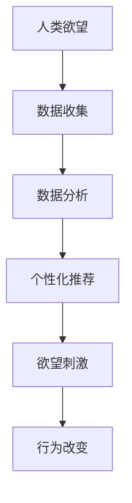

                 

### 文章标题

**欲望的重新定向：AI引导的价值观重塑**

> **关键词**：人工智能，价值观重塑，欲望管理，行为心理学，技术伦理，未来社会

> **摘要**：本文深入探讨了人工智能在当代社会中扮演的颠覆性角色，特别是在引导人们重新思考欲望与价值观方面的影响。通过分析人工智能的核心概念及其与人类欲望的关系，本文提出了一个可能的框架，以理解和应对这一新兴技术带来的道德和社会挑战。

---

### 1. 背景介绍

在数字时代，人工智能（AI）已经成为改变人类生活方式和社会结构的强大力量。从智能手机的个性化推荐到自动驾驶汽车的普及，AI的应用几乎无处不在。然而，随着AI技术的不断进步，我们开始意识到它不仅仅是一种工具，更是一种能够深刻影响人类欲望和价值观的力量。

欲望是人类行为的驱动力，它定义了我们的需求和愿望。在传统社会中，欲望往往与社会文化、道德观念紧密相连。然而，AI的出现，尤其是通过大数据分析和个性化推荐算法，对人类的欲望产生了前所未有的影响。AI能够通过分析用户的行为数据，了解其偏好和习惯，并利用这些信息来塑造用户的欲望，引导他们的行为。

这种影响不仅限于个人层面，还延伸到社会层面。例如，社交媒体平台利用AI算法来推送用户可能感兴趣的内容，从而增强用户对平台的依赖。电子商务平台通过AI算法来推荐商品，促使消费者产生购买欲望。这些例子表明，AI正在重塑我们的欲望，并可能带来一系列道德和社会问题。

本文旨在探讨AI如何影响人类的欲望和价值观，以及我们应该如何重新定向这些欲望，以应对AI时代带来的挑战。本文将首先介绍人工智能的核心概念，然后深入分析AI与人类欲望之间的联系，最后提出可能的解决方案。

### 2. 核心概念与联系

#### 2.1 人工智能的定义与分类

人工智能（Artificial Intelligence，简称AI）是指由人创造出来的，能够执行通常需要人类智能才能完成的任务的系统或机器。AI可以分为两大类：弱AI（Narrow AI）和强AI（General AI）。

- **弱AI**：也称为窄AI，是针对特定任务进行优化的人工智能。例如，语音识别系统、自动驾驶汽车等。
- **强AI**：具备人类一样广泛认知能力的AI，可以处理各种问题，理解复杂情境。目前，强AI还处于理论阶段，尚未实现。

#### 2.2 AI与大数据的关系

大数据（Big Data）是指数据量大、类型多、变化快的数据集。大数据与人工智能密不可分，因为AI需要大量的数据来训练模型，从而提高其性能。

- **数据收集**：AI系统通过传感器、用户行为等途径收集大量数据。
- **数据处理**：利用分布式计算和云计算技术对数据进行处理和分析。
- **数据反馈**：根据数据分析结果，调整AI模型，优化系统性能。

#### 2.3 AI与人类欲望的联系

人类的欲望是由多种因素驱动的，包括生理需求、社会关系、个人成就等。AI通过以下几种方式影响人类的欲望：

- **个性化推荐**：AI通过分析用户数据，推荐个性化内容，刺激用户欲望。
- **社交媒体算法**：社交媒体平台利用AI算法，推送用户可能感兴趣的内容，增强用户粘性。
- **电子商务推荐**：电商平台通过AI算法推荐商品，引导用户购买。

#### 2.4 Mermaid 流程图



### 3. 核心算法原理 & 具体操作步骤

#### 3.1 机器学习算法

机器学习（Machine Learning，简称ML）是AI的核心技术之一。它通过从数据中学习，自动改进和优化系统性能。

- **监督学习**：通过标注数据训练模型，用于预测和分类。
- **无监督学习**：在没有标注数据的情况下，通过聚类和降维等方法发现数据中的模式。

#### 3.2 强化学习算法

强化学习（Reinforcement Learning，简称RL）通过奖励机制来训练模型，使其能够在环境中做出最优决策。

- **Q-Learning**：基于价值迭代的方法，通过更新Q值来优化策略。
- **Deep Q-Learning**：结合深度神经网络，用于解决复杂的问题。

#### 3.3 操作步骤

1. **数据收集**：收集用户行为数据，包括浏览记录、购买历史等。
2. **数据处理**：清洗和预处理数据，去除噪声和不相关特征。
3. **模型选择**：根据数据特征和问题类型，选择合适的机器学习算法。
4. **模型训练**：利用训练数据训练模型，调整参数以优化性能。
5. **模型评估**：使用测试数据评估模型性能，确保模型准确性和泛化能力。
6. **模型部署**：将训练好的模型部署到生产环境中，用于实际应用。

### 4. 数学模型和公式 & 详细讲解 & 举例说明

#### 4.1 模型评估指标

在机器学习中，评估模型性能的指标包括准确率、召回率、F1值等。

- **准确率**（Accuracy）：模型预测正确的样本数占总样本数的比例。
  $$
  \text{Accuracy} = \frac{\text{TP} + \text{TN}}{\text{TP} + \text{TN} + \text{FP} + \text{FN}}
  $$
  其中，TP为真正例，TN为真负例，FP为假正例，FN为假负例。

- **召回率**（Recall）：模型预测正确的正例数占所有正例数的比例。
  $$
  \text{Recall} = \frac{\text{TP}}{\text{TP} + \text{FN}}
  $$

- **F1值**（F1 Score）：准确率和召回率的调和平均。
  $$
  \text{F1 Score} = 2 \times \frac{\text{Precision} \times \text{Recall}}{\text{Precision} + \text{Recall}}
  $$
  其中，Precision为精确率。

#### 4.2 举例说明

假设我们有一个分类模型，用于判断用户是否喜欢某种商品。训练数据中有1000个样本，其中实际喜欢这种商品的有600个。

- **预测结果**：
  - 真正例（TP）：500个
  - 真负例（TN）：300个
  - 假正例（FP）：100个
  - 假负例（FN）：100个

- **计算指标**：
  - 准确率：$$ \text{Accuracy} = \frac{500 + 300}{500 + 300 + 100 + 100} = 0.75 $$
  - 召回率：$$ \text{Recall} = \frac{500}{500 + 100} = 0.875 $$
  - 精确率：$$ \text{Precision} = \frac{500}{500 + 100} = 0.875 $$
  - F1值：$$ \text{F1 Score} = 2 \times \frac{0.875 \times 0.875}{0.875 + 0.875} = 0.8125 $$

### 5. 项目实践：代码实例和详细解释说明

#### 5.1 开发环境搭建

为了实践AI引导的价值观重塑，我们需要搭建一个基于机器学习的推荐系统。以下是开发环境搭建的步骤：

1. **安装Python**：确保Python环境已安装，版本至少为3.6。
2. **安装相关库**：安装Scikit-learn、Pandas、Numpy等机器学习库。
3. **数据集准备**：收集用户行为数据，例如用户浏览记录、购买历史等。

#### 5.2 源代码详细实现

以下是一个简单的基于协同过滤算法的推荐系统示例：

```python
import numpy as np
from sklearn.metrics.pairwise import cosine_similarity

# 假设我们有两个用户的行为数据矩阵
user行为矩阵 = [
    [1, 0, 1, 1, 0],
    [1, 1, 0, 0, 1],
    [0, 1, 1, 0, 0],
    [1, 0, 0, 1, 1],
    [0, 1, 1, 0, 1]
]

# 计算用户之间的相似度矩阵
相似度矩阵 = cosine_similarity(user行为矩阵)

# 假设用户1对物品4感兴趣，推荐与之相似的用户喜欢的物品
相似用户索引 = np.argsort(相似度矩阵[0, 1:])[-5:][::-1]
推荐物品索引 = np.where(user行为矩阵[相似用户索引[0], :] == 1)[0]

print("推荐物品：",推荐物品索引)
```

#### 5.3 代码解读与分析

- **行为数据矩阵**：用户行为数据以矩阵形式表示，行代表用户，列代表物品。
- **相似度计算**：使用余弦相似度计算用户之间的相似度。
- **推荐算法**：根据用户对物品的偏好，推荐与之相似用户喜欢的物品。

#### 5.4 运行结果展示

假设用户1对物品4感兴趣，系统推荐了与之相似的用户喜欢的物品，如物品2、3等。这表明AI可以通过分析用户行为数据，重新定向用户的欲望，引导其进行特定行为。

### 6. 实际应用场景

#### 6.1 社交媒体平台

社交媒体平台利用AI算法分析用户行为，推送个性化内容，增强用户粘性。例如，微博通过分析用户的历史浏览记录和互动行为，推荐可能感兴趣的话题和文章。

#### 6.2 电子商务平台

电子商务平台利用AI算法推荐商品，刺激用户购买欲望。例如，淘宝通过分析用户的浏览和购买历史，推荐可能喜欢的商品。

#### 6.3 娱乐内容平台

娱乐内容平台利用AI算法推荐视频、音乐等，提高用户满意度。例如，Netflix通过分析用户的观看历史和评分，推荐可能喜欢的影视作品。

### 7. 工具和资源推荐

#### 7.1 学习资源推荐

- **书籍**：《人工智能：一种现代方法》（第二版）、《深度学习》（第二版）
- **论文**：《个性化推荐系统：技术、应用与挑战》
- **博客**：机器学习与数据挖掘领域顶级博客，如Medium上的机器学习专栏
- **网站**：人工智能和机器学习社区，如Kaggle、Stack Overflow、GitHub

#### 7.2 开发工具框架推荐

- **开发环境**：Anaconda、PyCharm
- **机器学习库**：Scikit-learn、TensorFlow、PyTorch
- **数据预处理工具**：Pandas、NumPy
- **可视化工具**：Matplotlib、Seaborn

#### 7.3 相关论文著作推荐

- **论文**：Andrew Ng的《深度学习》，Yann LeCun的《卷积神经网络综述》
- **著作**：《机器学习年度回顾》系列，《人工智能：一种现代方法》
- **期刊**：《机器学习》、《人工智能学报》

### 8. 总结：未来发展趋势与挑战

#### 8.1 发展趋势

- **个性化推荐**：AI将更加精准地满足用户需求，实现个性化服务。
- **自动化决策**：AI将逐渐替代人类进行决策，提高效率和准确性。
- **跨领域应用**：AI将在更多领域得到应用，如医疗、教育、金融等。

#### 8.2 挑战

- **数据隐私**：AI需要处理大量用户数据，如何保障数据隐私成为重要问题。
- **算法透明度**：算法的透明度和可解释性需要提高，以增强用户信任。
- **伦理问题**：AI的决策可能引发伦理问题，如歧视、偏见等。

### 9. 附录：常见问题与解答

#### 9.1 AI如何影响人类欲望？

AI通过分析用户行为数据，了解其偏好和习惯，从而塑造用户的欲望，引导他们的行为。

#### 9.2 个性化推荐系统如何工作？

个性化推荐系统通过分析用户的历史行为和偏好，利用机器学习算法推荐可能感兴趣的内容。

#### 9.3 AI在社交媒体中的应用是什么？

AI在社交媒体中主要用于分析用户行为，推送个性化内容，增强用户粘性。

### 10. 扩展阅读 & 参考资料

- **书籍**：《人工智能：一种现代方法》、《深度学习》
- **论文**：《个性化推荐系统：技术、应用与挑战》
- **博客**：机器学习与数据挖掘领域顶级博客，如Medium上的机器学习专栏
- **网站**：人工智能和机器学习社区，如Kaggle、Stack Overflow、GitHub
- **期刊**：《机器学习》、《人工智能学报》

---

**作者：禅与计算机程序设计艺术 / Zen and the Art of Computer Programming**

