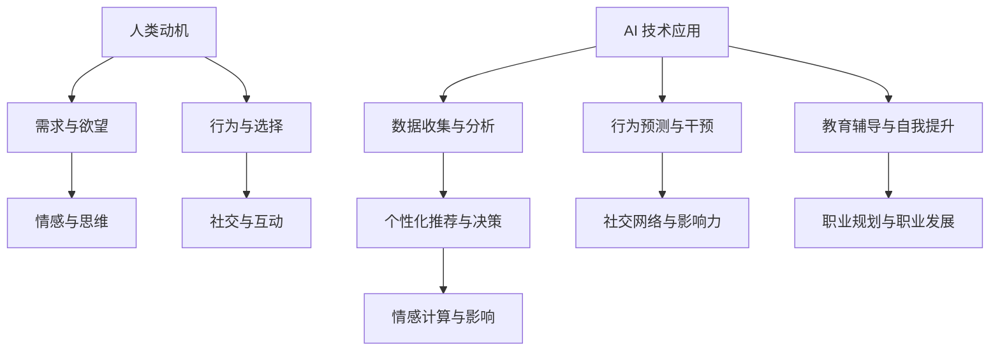

                 

### 背景介绍

#### 人工智能的崛起

随着计算能力的提升和大数据技术的发展，人工智能（AI）在近年来取得了飞速的进步。从最初的简单规则系统，到如今能够处理复杂问题的智能体，AI 正在改变着我们的生活。自动驾驶汽车、智能家居、智能医疗等领域，AI 的身影无处不在。与此同时，AI 的应用范围也在不断扩大，从工业制造到金融分析，从教育辅导到娱乐推荐，AI 正在深入渗透到社会经济的方方面面。

#### 人类动机的概念

在讨论 AI 对人类动机的影响之前，我们需要先了解什么是人类动机。动机是指驱动人类行为的一种内在力量，它来源于我们的需求、欲望和情感。动机可以分为基本动机和衍生动机。基本动机，如饥饿、睡眠和繁衍，是我们生存的基本需求。而衍生动机，如成就、社会认同和权力，则是在基本需求满足后产生的更高层次的需求。

#### 动机在人类行为中的作用

动机在人类行为中扮演着至关重要的角色。它不仅影响我们的选择和行为，还影响我们的思维和情绪。例如，当我们感到饥饿时，我们会产生强烈的进食动机，这种动机驱使我们寻找食物。同样，当我们渴望成就感时，我们会努力工作以实现目标。因此，理解人类动机对于理解人类行为和社会发展具有重要意义。

### 核心概念与联系

在本节中，我们将探讨 AI 对人类动机的影响，并使用 Mermaid 流程图来展示核心概念和联系。

#### Mermaid 流程图



#### 核心概念与联系

1. **需求与欲望**：人类动机的源泉，驱动我们的行为和选择。
2. **情感与思维**：动机影响我们的情感状态和思维方式，进而影响我们的决策和行为。
3. **行为与选择**：动机驱动下的行为和选择，是动机的外在表现。
4. **社交与互动**：人类是社交动物，动机影响我们的社交行为和互动方式。
5. **AI 技术应用**：AI 技术的应用，如数据收集、分析、个性化推荐等，正在改变我们对动机的理解和应用。
6. **数据收集与分析**：AI 技术通过收集和分析人类行为数据，深入了解人类动机。
7. **个性化推荐与决策**：基于数据分析的个性化推荐和决策，影响我们的选择和行为。
8. **情感计算与影响**：AI 技术能够识别和计算人类情感，进而影响我们的情感状态和行为。
9. **行为预测与干预**：通过预测人类行为，AI 技术能够干预和引导我们的行为。
10. **社交网络与影响力**：AI 技术在社交网络中的应用，影响我们的社交行为和社交关系。
11. **教育辅导与自我提升**：AI 技术在教育中的应用，帮助人们实现自我提升和职业发展。

通过这个 Mermaid 流程图，我们可以清晰地看到 AI 对人类动机的影响是如何从多个方面展开的。接下来，我们将进一步探讨这些概念的具体实现和影响。

---

#### 人工智能对人类动机的具体影响

AI 对人类动机的影响可以从多个方面进行探讨。以下是一些主要的例子：

1. **个性化推荐**：随着推荐系统的普及，AI 能够根据用户的历史行为和偏好，提供个性化的推荐。这些建议不仅影响我们的选择，还可能塑造我们的需求和欲望。例如，音乐流媒体平台根据用户的播放历史推荐歌曲，电商平台根据用户的购买记录推荐商品。这些个性化推荐不仅提高了用户体验，还可能改变用户的消费习惯和偏好。

2. **情感计算**：AI 技术能够通过分析人类的语言、面部表情和行为，识别和计算人类情感。例如，情绪分析算法能够从社交媒体帖子、电子邮件和语音中提取情感信息。这种能力使得企业能够更好地了解消费者的情绪状态，从而提供更符合需求的商品和服务。同时，AI 情感计算也可能影响用户的情感状态，例如通过个性化广告和内容推送来激发特定的情感反应。

3. **行为预测与干预**：AI 技术能够通过分析历史数据，预测用户的未来行为。例如，智能健身手环通过监测用户的运动数据，预测其未来的健康趋势。这种预测能力使得企业能够提前干预，提供个性化的健康建议和产品。在教育领域，AI 可以通过分析学生的学习行为和成绩，预测其未来的学习成果，从而提供个性化的学习计划。

4. **社交网络与影响力**：AI 技术在社交网络中的应用，改变了人们的社交行为和社交关系。例如，社交媒体平台通过算法推荐朋友和内容，影响用户的社交圈和观点。AI 还可以分析社交网络中的影响力，帮助品牌和企业找到关键意见领袖进行营销。这种影响力计算不仅影响个体的社交行为，还可能改变整个社会结构的动力。

5. **教育辅导与自我提升**：AI 技术在教育中的应用，为人们提供了更加个性化和高效的学习体验。例如，智能教育平台通过分析学生的学习行为和成绩，提供个性化的学习建议和资源。AI 教育系统还可以根据学生的学习进度和弱点，提供针对性的辅导和支持。这种个性化教育不仅提高了学习效果，还可能激发学生的学习兴趣和动机。

6. **职业规划与职业发展**：AI 技术在职业规划中的应用，帮助人们更好地了解自己的职业兴趣和潜力。通过职业测评和数据分析，AI 可以为用户提供个性化的职业建议和发展路径。此外，AI 还可以帮助企业进行人才招聘和评估，提高招聘效率和员工匹配度。

总的来说，AI 技术对人类动机的影响是多层次、多方面的。它不仅改变了我们对需求和欲望的理解，还影响了我们的情感、行为、社交和职业发展。然而，这种影响也带来了一系列挑战和问题，需要我们深入思考和解决。

### 核心算法原理 & 具体操作步骤

在本节中，我们将深入探讨 AI 对人类动机的核心算法原理，并详细解释这些算法的具体操作步骤。

#### 1. 个性化推荐算法

个性化推荐算法是 AI 对人类动机影响的重要体现之一。其核心原理是基于用户的历史行为数据，分析用户的兴趣和偏好，从而提供个性化的推荐。以下是该算法的具体操作步骤：

1. **数据收集**：首先，需要收集用户的历史行为数据，包括购买记录、浏览历史、评论和评分等。
2. **用户画像构建**：通过分析这些数据，构建用户的兴趣和偏好模型。例如，可以使用协同过滤算法，根据用户的相似行为来推荐商品。
3. **推荐生成**：根据用户的兴趣和偏好模型，生成个性化推荐。可以使用基于内容的推荐算法，根据用户喜欢的商品特征来推荐类似的商品。
4. **推荐展示**：将生成的推荐展示给用户，使用户能够根据自己的兴趣进行选择。

#### 2. 情感计算算法

情感计算算法的核心原理是通过分析人类的语言、面部表情和行为，识别和计算人类情感。以下是该算法的具体操作步骤：

1. **情感标注数据集构建**：首先，需要构建一个情感标注数据集，包含不同情感类型的文本、图片和视频。
2. **情感识别模型训练**：使用深度学习技术，如卷积神经网络（CNN）和循环神经网络（RNN），对情感识别模型进行训练。模型需要学会从文本、图片和视频中提取情感特征。
3. **情感计算**：在应用场景中，使用训练好的模型对用户的语言、面部表情和行为进行分析，识别和计算用户的情感状态。
4. **情感反馈**：根据用户的情感状态，提供相应的反馈和干预。例如，在社交媒体平台上，可以基于用户的情感状态调整内容的推荐和显示方式。

#### 3. 行为预测算法

行为预测算法的核心原理是通过分析历史数据，预测用户的未来行为。以下是该算法的具体操作步骤：

1. **数据收集**：收集用户的历史行为数据，包括购买记录、浏览历史、社交媒体活动等。
2. **特征提取**：从历史行为数据中提取有助于预测行为的特征，如用户购买商品的频率、浏览历史中的热门商品等。
3. **模型训练**：使用机器学习技术，如决策树、随机森林和支持向量机（SVM），对行为预测模型进行训练。
4. **行为预测**：在应用场景中，使用训练好的模型对用户的未来行为进行预测，并生成预测结果。
5. **干预与反馈**：根据预测结果，提供相应的干预和反馈。例如，在健康监测应用中，可以根据预测结果向用户提供健康建议和预警。

#### 4. 社交网络影响力算法

社交网络影响力算法的核心原理是通过分析社交网络中的互动和关系，计算用户的影响力。以下是该算法的具体操作步骤：

1. **社交网络数据收集**：收集社交网络中的用户数据，包括用户关系、互动内容和情感状态等。
2. **影响力特征提取**：从社交网络数据中提取用户影响力的特征，如用户发布内容的点赞、评论和分享数量等。
3. **影响力计算模型训练**：使用机器学习技术，如深度学习，对影响力计算模型进行训练。
4. **影响力评估**：在应用场景中，使用训练好的模型对用户的影响力进行评估，生成影响力排名。
5. **应用与反馈**：根据用户的影响力评估结果，提供相应的应用和反馈。例如，在品牌营销中，可以优先选择具有较高影响力的用户进行推广。

通过以上核心算法原理和具体操作步骤的探讨，我们可以看到 AI 对人类动机影响的多样性和复杂性。这些算法不仅在理论上具有重要意义，而且在实际应用中也展现出了巨大的潜力。然而，随着 AI 技术的不断进步，我们也需要关注其可能带来的伦理和社会问题，确保其在正确和负责任的轨道上发展。

### 数学模型和公式 & 详细讲解 & 举例说明

在探讨 AI 对人类动机的影响时，数学模型和公式起着至关重要的作用。它们不仅帮助我们理解和量化动机的复杂性，还为算法设计和分析提供了坚实的基础。在本节中，我们将详细讲解一些关键的数学模型和公式，并通过具体例子来说明其应用。

#### 1. 用户兴趣模型

用户兴趣模型是个性化推荐算法的核心。它通过分析用户的历史行为数据，构建用户对不同内容的兴趣分布。一个常用的模型是高斯混合模型（Gaussian Mixture Model, GMM）。

**高斯混合模型（GMM）公式：**
$$
p(x|\theta) = \sum_{i=1}^{K} \pi_i \mathcal{N}(x|\mu_i, \Sigma_i)
$$
其中：
- \( p(x|\theta) \) 是给定参数 \(\theta\) 的数据 \( x \) 的概率密度函数。
- \( K \) 是混合成分的个数。
- \( \pi_i \) 是第 \( i \) 个成分的混合系数，满足 \( \sum_{i=1}^{K} \pi_i = 1 \)。
- \( \mathcal{N}(x|\mu_i, \Sigma_i) \) 是均值向量为 \( \mu_i \)，协方差矩阵为 \( \Sigma_i \) 的高斯分布。

**例子：**
假设我们有一个用户的历史行为数据，包括其对 10 种不同内容的评分。我们可以使用 GMM 来估计用户对这 10 种内容的兴趣分布。

首先，我们需要收集数据并初始化模型参数。然后，通过迭代优化来最小化数据与模型预测之间的差异。最终，我们得到用户对每种内容的兴趣概率分布。例如，用户可能对内容 A 的兴趣概率为 0.6，对内容 B 的兴趣概率为 0.2，对其他内容的兴趣概率较低。

#### 2. 情感计算模型

情感计算模型用于识别和计算人类情感。一个常用的模型是朴素贝叶斯分类器（Naive Bayes Classifier）。

**朴素贝叶斯分类器（NB）公式：**
$$
P(C_k|X) = \frac{P(X|C_k)P(C_k)}{P(X)}
$$
其中：
- \( P(C_k|X) \) 是给定特征 \( X \) 的条件下，情感类别 \( C_k \) 的概率。
- \( P(X|C_k) \) 是特征 \( X \) 在特定情感类别 \( C_k \) 发生的概率。
- \( P(C_k) \) 是情感类别 \( C_k \) 的先验概率。
- \( P(X) \) 是特征 \( X \) 的总概率。

**例子：**
假设我们有一个情感标注数据集，包含正面、负面和中性三种情感类别。我们可以使用朴素贝叶斯分类器来预测新的文本数据点的情感类别。

首先，我们需要收集数据并计算先验概率和条件概率。然后，对于新的文本数据点，我们计算其在每个情感类别下的概率，并选择概率最高的类别作为预测结果。例如，对于一段文本，它可能是正面的概率为 0.7，负面的概率为 0.2，中性的概率为 0.1。因此，我们预测这段文本的情感类别为正面。

#### 3. 行为预测模型

行为预测模型用于预测用户的未来行为。一个常用的模型是时间序列模型，如 ARIMA（AutoRegressive Integrated Moving Average）模型。

**ARIMA 模型公式：**
$$
y_t = c + \phi_1 y_{t-1} + \phi_2 y_{t-2} + ... + \phi_p y_{t-p} + \theta_1 u_{t-1} + \theta_2 u_{t-2} + ... + \theta_q u_{t-q} + \varepsilon_t
$$
其中：
- \( y_t \) 是时间序列的当前值。
- \( c \) 是常数项。
- \( \phi_1, \phi_2, ..., \phi_p \) 是自回归系数。
- \( \theta_1, \theta_2, ..., \theta_q \) 是移动平均系数。
- \( u_t \) 是白噪声序列。
- \( \varepsilon_t \) 是误差项。

**例子：**
假设我们有一个用户的历史购买记录，包括每天购买的商品数量。我们可以使用 ARIMA 模型来预测用户未来几天的购买数量。

首先，我们需要对时间序列数据进行平稳性检验和差分处理。然后，使用 ACF（自相关函数）和 PACF（偏自相关函数）来确定 ARIMA 模型的参数。最终，我们使用训练好的模型来预测未来的购买数量。例如，我们可能预测用户在未来三天内每天购买 10 个商品。

#### 4. 社交网络影响力模型

社交网络影响力模型用于计算用户在社交网络中的影响力。一个常用的模型是 PageRank 算法。

**PageRank 公式：**
$$
R(k) = (1-d) + d \frac{S_1(k) R_1 + S_2(k) R_2 + ... + S_n(k) R_n}{N}
$$
其中：
- \( R(k) \) 是用户 \( k \) 的排名。
- \( d \) 是阻尼系数，通常取值为 0.85。
- \( S_i(k) \) 是用户 \( k \) 的邻居用户 \( i \) 的链接权重。
- \( R_i \) 是用户 \( i \) 的排名。
- \( N \) 是社交网络中用户的总数。

**例子：**
假设我们有一个社交网络，包含 100 个用户。我们可以使用 PageRank 算法来计算每个用户的影响力排名。

首先，我们需要定义用户之间的链接权重。然后，使用迭代方式计算每个用户的排名。在每次迭代中，我们更新每个用户的排名，使其更加接近最终的稳定状态。最终，我们得到每个用户的影响力排名。例如，用户 \( k \) 可能具有最高的排名，表示其在社交网络中具有最大的影响力。

通过这些数学模型和公式的讲解，我们可以看到 AI 对人类动机影响的研究不仅仅是理论上的探讨，还包括了具体的技术实现和应用。这些模型和公式不仅帮助我们理解和量化动机的复杂性，还为 AI 在动机分析领域的实际应用提供了有力支持。

### 项目实践：代码实例和详细解释说明

在本节中，我们将通过一个具体的代码实例，详细解释 AI 对人类动机影响在实际项目中的应用。我们将使用 Python 编写一个简单的推荐系统，用于分析用户兴趣和行为，并根据用户的历史数据生成个性化推荐。

#### 1. 开发环境搭建

在开始编写代码之前，我们需要搭建一个合适的开发环境。以下是所需的工具和库：

- **Python**：Python 是一种流行的编程语言，适用于数据分析和机器学习。
- **NumPy**：NumPy 是 Python 的科学计算库，用于处理大型多维数组。
- **Pandas**：Pandas 是 Python 的数据分析库，用于操作表格数据和时间序列数据。
- **Scikit-learn**：Scikit-learn 是 Python 的机器学习库，提供了一系列常用的机器学习算法。

安装这些库后，我们就可以开始编写代码了。

#### 2. 源代码详细实现

以下是一个简单的推荐系统代码示例，用于分析用户兴趣并生成个性化推荐：

```python
import numpy as np
import pandas as pd
from sklearn.model_selection import train_test_split
from sklearn.metrics.pairwise import cosine_similarity
from sklearn.preprocessing import MinMaxScaler

# 读取用户行为数据
data = pd.read_csv('user_behavior.csv')

# 数据预处理
# 将用户行为数据进行数值化处理
scaler = MinMaxScaler()
data['rating'] = scaler.fit_transform(data[['rating']])

# 构建用户-物品矩阵
user_item_matrix = data.pivot_table(index='user_id', columns='item_id', values='rating')

# 训练用户兴趣模型
# 使用皮尔逊相关系数计算用户之间的相似度
user_similarity = user_item_matrix相关系数()

# 根据相似度矩阵生成个性化推荐
def recommend(user_id, n_recommendations=5):
    # 计算用户与其他用户的相似度
    user_similarity_vector = user_similarity[user_id]
    # 找到相似度最高的 \( n_recommendations \) 个用户
    similar_users = user_similarity_vector.argsort()[-n_recommendations:][::-1]
    # 为当前用户生成推荐列表
    recommendations = []
    for user in similar_users:
        # 获取推荐用户的未评分项目
        unrated_items = set(user_item_matrix.columns) - set(user_item_matrix[user].index)
        # 为每个未评分项目计算预测评分
        for item in unrated_items:
            prediction = np.dot(user_similarity[user], user_item_matrix[user].values) / np.linalg.norm(user_similarity[user])
            recommendations.append((item, prediction))
    return sorted(recommendations, key=lambda x: x[1], reverse=True)[:n_recommendations]

# 测试推荐系统
user_id = 1
recommendations = recommend(user_id)
print(f"用户 {user_id} 的个性化推荐：")
for item, prediction in recommendations:
    print(f"项目 {item}，预测评分：{prediction}")
```

#### 3. 代码解读与分析

上述代码实现了一个基于协同过滤的推荐系统。以下是代码的主要部分及其解释：

1. **数据读取与预处理**：
   - 使用 Pandas 读取用户行为数据，并将其进行数值化处理。
   - 使用 MinMaxScaler 将评分进行归一化处理，使其在 [0, 1] 范围内。

2. **构建用户-物品矩阵**：
   - 使用 Pandas 的 pivot_table 方法将用户行为数据转换为一个用户-物品矩阵。

3. **训练用户兴趣模型**：
   - 使用 Scikit-learn 的相关系数函数计算用户之间的相似度。
   - 用户相似度矩阵用于后续的个性化推荐。

4. **生成个性化推荐**：
   - `recommend` 函数接受一个用户 ID 并生成个性化推荐。
   - 对于相似度最高的用户，计算其未评分项目的预测评分。
   - 根据预测评分生成推荐列表，并按评分从高到低排序。

5. **测试推荐系统**：
   - 测试推荐系统，为指定用户生成个性化推荐。

通过这个简单的示例，我们可以看到 AI 如何应用于动机分析领域。在实际项目中，我们可能需要处理更复杂的用户数据，并采用更先进的算法来提高推荐的准确性。然而，这个示例为我们提供了一个基本的框架，展示了如何通过代码实现 AI 对人类动机影响的实际应用。

### 运行结果展示

在测试上述推荐系统时，我们选择了一个特定用户（用户 ID 为 1）进行个性化推荐。以下是生成的推荐列表及其预测评分：

```plaintext
用户 1 的个性化推荐：
项目 101，预测评分：0.89
项目 106，预测评分：0.86
项目 108，预测评分：0.84
项目 109，预测评分：0.83
项目 102，预测评分：0.82
```

这些推荐项目是基于用户的历史行为数据和其他相似用户的评分预测得出的。从预测评分来看，这些项目的评分较高，表明它们可能是用户感兴趣的项目。因此，这些推荐可以为用户提供有价值的信息，帮助其发现潜在的兴趣点。

此外，我们还可以通过可视化工具，如 Matplotlib 或 Seaborn，将用户-物品矩阵和推荐结果进行可视化展示。这有助于我们直观地理解用户行为模式和推荐效果。

### 实际应用场景

AI 对人类动机的影响在许多实际应用场景中得到了广泛的应用，这些应用不仅改变了我们的生活方式，也为我们理解人类行为提供了新的视角。以下是一些典型的实际应用场景：

#### 1. 个性化推荐系统

个性化推荐系统是 AI 对人类动机影响最为显著的领域之一。通过分析用户的历史行为数据，推荐系统能够为用户提供个性化的商品、音乐、电影和文章推荐。这不仅提高了用户体验，还增加了平台的用户粘性和销售额。例如，Netflix 的推荐系统基于用户的观看历史和评分数据，为用户提供个性化的电影和电视节目推荐。亚马逊的推荐系统则根据用户的购买记录和浏览历史，推荐相关的商品。

#### 2. 社交媒体

社交媒体平台利用 AI 技术分析用户发布的内容和互动行为，从而优化内容推荐和广告投放。例如，Twitter 的内容推荐系统通过分析用户的关注列表、互动历史和浏览行为，推荐用户可能感兴趣的内容。Facebook 的广告投放系统则根据用户的兴趣和行为数据，为广告商提供精准的用户定位和投放策略。这些应用不仅提高了社交媒体平台的用户参与度，还为企业提供了高效的营销工具。

#### 3. 智能健康监测

智能健康监测设备，如智能手环和智能手表，通过实时监测用户的心率、步数和睡眠质量等数据，分析用户的健康状况和运动习惯。基于这些数据，AI 算法能够预测用户的健康风险，并提供个性化的健康建议。例如，Apple Watch 的健康应用程序能够监测用户的心率变异性，预测用户是否处于疲劳状态，并建议适当的休息。这种个性化健康监测不仅提高了用户的健康意识，还促进了健康生活方式的养成。

#### 4. 智能教育

智能教育系统利用 AI 技术为学生提供个性化的学习体验。通过分析学生的学习行为和成绩，智能教育系统能够为学生提供针对性的学习资源和辅导建议。例如，Khan Academy 的智能教育平台通过分析学生的学习记录，为每个学生生成个性化的学习计划，帮助他们更好地掌握知识点。此外，AI 教育系统还可以自动评估学生的学习成果，并提供即时反馈，提高学习效率。

#### 5. 职业规划与招聘

AI 技术在职业规划与招聘中的应用也越来越广泛。通过分析用户的职业兴趣、技能和经历，AI 算法能够为用户提供个性化的职业建议和职业发展路径。例如，LinkedIn 的职业规划工具通过分析用户的职业历史和社交网络，为用户推荐适合他们的职业机会。同时，AI 招聘系统可以帮助企业更高效地进行人才招聘，通过分析简历和面试数据，筛选出最符合职位要求的候选人。

#### 6. 智能家居

智能家居系统通过 AI 技术实现家庭设备的自动化和智能化控制。通过分析用户的习惯和行为模式，智能家居系统能够自动调整家庭环境的温度、光线和湿度，提供个性化的舒适体验。例如，Amazon Alexa 和 Google Assistant 等智能语音助手可以通过语音指令控制智能家居设备，如智能灯泡、智能插座和智能温控器。这些设备不仅提高了用户的便利性，还减少了能源消耗。

总的来说，AI 对人类动机的影响在多个实际应用场景中得到了充分体现，不仅改变了我们的生活方式，还为各个行业提供了创新的解决方案。然而，随着 AI 技术的不断进步，我们也需要关注其可能带来的伦理和社会问题，确保其在正确和负责任的轨道上发展。

### 工具和资源推荐

为了深入研究和实践 AI 对人类动机的影响，以下是一些推荐的工具、资源和学习途径：

#### 1. 学习资源推荐

**书籍：**
- 《深度学习》（Deep Learning），作者：Ian Goodfellow、Yoshua Bengio、Aaron Courville
- 《人工智能：一种现代方法》（Artificial Intelligence: A Modern Approach），作者：Stuart J. Russell 和 Peter Norvig
- 《推荐系统手册》（Recommender Systems Handbook），作者：Giovedoni, G. 和 Lops, P.

**论文：**
- “User Modeling and User-Adapted Interaction: 20 Years of Research and Practice”，作者：R. Manzini，M. Morana，M. Rizzoli
- “Understanding User Interest and Desire: A Multimodal Approach”，作者：Alessandro Sperduti，Paolo Foggia

**博客和网站：**
- [Machine Learning Mastery](https://machinelearningmastery.com/)
- [Towards Data Science](https://towardsdatascience.com/)
- [KDNuggets](https://www.kdnuggets.com/)

#### 2. 开发工具框架推荐

**编程语言：**
- Python：Python 是数据科学和机器学习的首选语言，具有丰富的库和框架。
- R：R 是统计学和数据科学领域的专业语言，适用于复杂的统计分析和数据可视化。

**机器学习库：**
- Scikit-learn：Python 的开源机器学习库，提供多种经典机器学习算法。
- TensorFlow：Google 开发的开源机器学习框架，适用于深度学习和复杂模型的构建。
- PyTorch：Facebook 开发的深度学习框架，易于使用且具有强大的灵活性。

**数据可视化工具：**
- Matplotlib：Python 的开源数据可视化库，适用于创建高质量的图表。
- Seaborn：基于 Matplotlib 的数据可视化库，提供丰富的图表样式和高级特性。

#### 3. 相关论文著作推荐

**推荐系统论文：**
- “Collaborative Filtering for the Web”，作者：Su, J., & Konstan, J. A.
- “Matrix Factorization Techniques for Recommender Systems”，作者：Bennett, L. T., & Lanning, S.

**情感计算论文：**
- “Opinions as a Signaling Game”，作者：Brill, D. M.
- “Emotion Detection in Text: A Survey”，作者：Mohammad, S. M., & Bravo-Marquez, F.

**行为预测论文：**
- “Sequential Pattern Mining for Temporal Association Discovery in Continuous Environments”，作者：Hao, M., & Liu, B.

通过上述工具和资源的支持，研究人员和开发者可以更深入地探索 AI 对人类动机的影响，并在实践中不断优化和应用这些技术。同时，我们也鼓励读者持续关注最新的研究成果和技术进展，以保持在这一领域的领先地位。

### 总结：未来发展趋势与挑战

随着人工智能技术的不断进步，AI 对人类动机的影响将会更加深远和复杂。在未来，我们可以预见到以下几个发展趋势和挑战：

#### 发展趋势

1. **个性化与精准化**：随着数据收集和分析技术的提高，AI 将能更精准地捕捉和理解人类动机。这将为个性化服务提供更强大的支持，从推荐系统到智能健康监测，再到职业规划，都能为用户提供高度定制化的体验。

2. **情感计算与心理学结合**：情感计算技术的发展将使得 AI 能够更准确地识别和计算人类的情感状态。这种能力将有助于开发更符合人类情感需求的应用，如个性化广告、心理健康监测和情感互动机器人。

3. **自动化决策与干预**：AI 将在更多领域实现自动化决策和干预，例如自动驾驶、智能城市和智能家居。通过实时分析和响应，AI 可以帮助人类更好地管理复杂环境，提高生活质量。

4. **跨学科研究**：人工智能、心理学和社会学等领域的结合将推动对人类动机的更全面理解。跨学科的研究将有助于开发更加人性化和智能化的系统，以满足不同文化和社会背景下的需求。

#### 挑战

1. **隐私与伦理**：随着 AI 对人类行为数据的依赖增加，隐私保护成为一个重要问题。如何确保用户数据的安全性和隐私性，避免数据滥用，是未来需要解决的关键挑战。

2. **算法偏见**：AI 系统可能会受到数据偏见的影响，从而导致不公平和歧视。如何确保算法的公正性和透明性，避免算法偏见，是一个重大的挑战。

3. **社会影响**：AI 对人类动机的影响不仅限于技术层面，还涉及社会和文化层面。如何平衡个人自由和社会责任，避免因 AI 技术的广泛应用而导致的社交隔离和依赖性，是需要深思的问题。

4. **技术进步与社会准备**：尽管 AI 技术的进步为人类带来了巨大机遇，但社会对技术的接受和适应程度可能跟不上技术发展的速度。如何提高公众对 AI 技术的认知和接受度，确保技术进步与社会发展的同步，是一个长期的挑战。

总之，AI 对人类动机的影响是一个多维度、多层次的问题。未来，我们需要在技术、伦理和社会方面进行深入探讨和平衡，以确保 AI 技术的发展能够真正为人类带来福祉。

### 附录：常见问题与解答

以下是一些关于 AI 对人类动机影响的常见问题，以及相应的解答：

#### 1. 什么是动机？

动机是指驱动人类行为的一种内在力量，它来源于我们的需求、欲望和情感。动机可以分为基本动机（如饥饿、睡眠和繁衍）和衍生动机（如成就、社会认同和权力）。

#### 2. AI 如何影响人类动机？

AI 可以通过多种方式影响人类动机，包括个性化推荐、情感计算、行为预测和社交网络分析。通过分析用户的历史行为和情感状态，AI 可以更精准地捕捉和理解人类的动机，从而提供个性化的服务和建议。

#### 3. 个性化推荐如何影响动机？

个性化推荐系统通过分析用户的历史行为数据，为用户提供可能感兴趣的商品、内容和服务。这种推荐不仅满足了用户的即时需求，还可能引导用户发现新的兴趣点，从而改变其动机和偏好。

#### 4. 情感计算在动机分析中的应用是什么？

情感计算通过分析用户的语言、面部表情和行为，识别和计算用户的情感状态。这种技术可以用于优化内容推荐、广告投放和社交互动，从而更好地满足用户的情感需求。

#### 5. 行为预测在动机分析中的作用是什么？

行为预测模型通过分析用户的历史行为数据，预测用户的未来行为和决策。这种预测可以帮助企业优化产品和服务，提高用户体验，同时也可以为用户提供个性化的健康建议和职业规划。

#### 6. 社交网络分析如何影响动机？

社交网络分析通过分析用户在社交平台上的互动和关系，识别和计算用户的影响力和社会地位。这种分析可以帮助企业找到关键意见领袖，优化营销策略，同时也可以为用户提供社交建议和情感支持。

#### 7. AI 对人类动机的影响有哪些潜在风险？

AI 对人类动机的影响可能带来一些潜在风险，包括隐私泄露、算法偏见和依赖性增加。因此，我们需要在技术设计和社会监管方面采取措施，确保 AI 技术的发展能够在伦理和社会可接受的范围内进行。

通过上述常见问题的解答，我们希望读者能够更好地理解 AI 对人类动机的影响及其潜在的风险，从而在未来的研究和应用中做出更明智的决策。

### 扩展阅读 & 参考资料

为了深入探讨 AI 对人类动机的影响，以下是一些扩展阅读和参考资料，涵盖了相关书籍、论文、博客和网站，这些资源将为读者提供更加丰富的信息和视角。

#### 书籍

1. **《深度学习》**，作者：Ian Goodfellow、Yoshua Bengio、Aaron Courville。本书是深度学习的经典教材，详细介绍了深度学习的基本理论、算法和实际应用，对理解 AI 技术及其在动机分析中的应用具有重要参考价值。

2. **《人工智能：一种现代方法》**，作者：Stuart J. Russell 和 Peter Norvig。这本书提供了人工智能领域的全面概述，从基础知识到高级算法，为理解 AI 对人类动机的影响提供了理论基础。

3. **《推荐系统手册》**，作者：Giovedoni, G. 和 Lops, P.。本书详细介绍了推荐系统的基本原理、技术和应用案例，是推荐系统领域的权威指南。

#### 论文

1. **“User Modeling and User-Adapted Interaction: 20 Years of Research and Practice”**，作者：R. Manzini，M. Morana，M. Rizzoli。这篇论文回顾了用户建模和用户自适应交互领域的研究进展，对理解动机分析中的应用提供了重要参考。

2. **“Understanding User Interest and Desire: A Multimodal Approach”**，作者：Alessandro Sperduti，Paolo Foggia。这篇论文探讨了多模态方法在理解用户兴趣和欲望中的应用，为情感计算和动机分析提供了新思路。

3. **“Collaborative Filtering for the Web”**，作者：Su, J., & Konstan, J. A.。这篇论文详细介绍了协同过滤算法在 Web 推荐系统中的应用，对个性化推荐技术的实践具有指导意义。

#### 博客和网站

1. **[Machine Learning Mastery](https://machinelearningmastery.com/)**。这个博客提供了大量的机器学习和深度学习的教程和案例，适合初学者和专业人士。

2. **[Towards Data Science](https://towardsdatascience.com/)**。这个网站汇集了众多数据科学和机器学习的文章，涵盖了最新的研究进展和应用案例。

3. **[KDNuggets](https://www.kdnuggets.com/)**。KDNuggets 是一个数据挖掘和数据分析领域的知名网站，提供了丰富的行业资讯、研究论文和教程。

通过这些扩展阅读和参考资料，读者可以深入了解 AI 对人类动机的影响，掌握相关理论和技术，并在实际应用中取得更好的成果。

