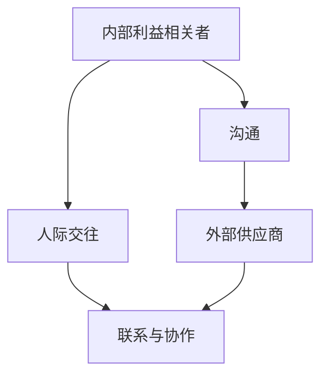

                 

### 文章标题

《沟通能力培养：出色的沟通和人际交往能力，能够与内部利益相关者和外部供应商建立联系和协作》

#### 关键词

- 沟通能力
- 人际交往
- 内部利益相关者
- 外部供应商
- 建立联系
- 协作

#### 摘要

本文旨在探讨在IT行业中，培养出色沟通和人际交往能力的重要性。我们将分析为何这些能力对于与内部利益相关者和外部供应商建立联系和协作至关重要。通过介绍相关概念、理论和实践方法，本文将帮助读者提升自身的沟通技巧，从而在职场中取得更大的成功。

## 1. 背景介绍

在当今快速发展的信息技术行业，沟通和人际交往能力已经成为职场成功的关键因素之一。无论是与同事合作完成项目，还是与外部供应商进行商务洽谈，良好的沟通能力都是确保项目顺利进行和达成共识的基础。然而，许多IT从业者往往更注重技术能力，而忽视了人际交往的重要性。

沟通能力不仅仅是指说话和倾听的技巧，更涉及到理解他人的观点、表达自己的意见、处理冲突和建立良好合作关系的能力。在IT领域，一个出色的沟通者不仅能够清晰、准确地传达信息，还能激发团队的创造力和动力。

人际交往能力则是指建立和维护人际关系的能力，包括结识新朋友、拓展人脉、与他人建立信任和合作关系等。在信息技术行业，人际交往能力可以帮助从业者拓展业务、获取新的机会和资源，甚至影响职业发展。

本文将从以下方面展开讨论：

1. 沟通能力在IT行业的重要性
2. 核心概念与联系
3. 核心算法原理与具体操作步骤
4. 数学模型和公式与详细讲解
5. 项目实践：代码实例与详细解释
6. 实际应用场景
7. 工具和资源推荐
8. 总结：未来发展趋势与挑战
9. 附录：常见问题与解答
10. 扩展阅读与参考资料

通过这些内容，我们希望能够帮助读者深入了解沟通和人际交往能力的重要性，并提供实用的方法和技巧，以便在职场中更好地与他人建立联系和协作。

## 2. 核心概念与联系

在讨论沟通和人际交往能力之前，我们需要先了解一些核心概念，以便更好地理解这些能力的重要性。

### 2.1 内部利益相关者

内部利益相关者是指在组织中具有共同目标和利益的人或群体。他们可能是团队成员、管理层、财务部门、销售部门等。内部利益相关者之间的沟通和协作对于组织目标的实现至关重要。

- **核心概念原理：** 内部利益相关者之间的沟通需要确保信息的透明性、准确性和及时性，以便各方能够共同合作，达成一致。

### 2.2 外部供应商

外部供应商是指在组织外部提供产品或服务的企业或个人。与外部供应商建立良好的沟通和合作关系对于企业的运营和发展具有重要意义。

- **核心概念原理：** 与外部供应商的沟通需要建立信任、明确需求和期望、及时解决问题，确保供应链的顺畅和高效。

### 2.3 沟通

沟通是指信息的传递和交流，包括口头、书面和电子等多种形式。有效的沟通需要确保信息的准确传达、理解和反馈。

- **核心概念原理：** 沟通的有效性取决于信息的清晰度、接收者的理解能力、沟通渠道的选择和沟通环境的适宜性。

### 2.4 人际交往

人际交往是指人与人之间的互动和交流，包括建立联系、处理冲突、建立信任和合作关系等。

- **核心概念原理：** 人际交往能力是一种综合能力，涉及到情感管理、社交技巧、同理心和自我认知等方面。

### 2.5 联系与协作

联系和协作是指在不同角色、群体和组织之间建立联系和进行合作，以实现共同的目标。

- **核心概念原理：** 联系和协作需要建立良好的沟通渠道、明确职责和角色、共享资源和信息，以及协调不同利益相关者的需求。

为了更好地理解这些概念之间的联系，我们可以使用Mermaid流程图来展示它们之间的关系。



通过这个流程图，我们可以清晰地看到内部利益相关者和外部供应商与沟通、人际交往和联系与协作之间的密切联系。这些能力共同作用，帮助IT从业者在一个复杂和多样化的职场环境中取得成功。

### 3. 核心算法原理与具体操作步骤

在了解核心概念和联系后，我们需要进一步探讨如何培养沟通和人际交往能力，从而在与内部利益相关者和外部供应商的沟通中取得成功。

#### 3.1 沟通能力

沟通能力可以分为以下几个步骤：

1. **明确目标：** 在沟通之前，首先要明确沟通的目标和目的，以便确保信息的准确传达。

2. **选择合适的沟通渠道：** 根据沟通内容和对象，选择合适的沟通渠道，如面对面交流、电话、电子邮件、即时通讯等。

3. **准备和计划：** 在沟通前，准备和计划沟通的内容、顺序和要点，确保沟通的顺利进行。

4. **表达清晰：** 使用简洁、清晰的语言表达自己的观点和意见，避免使用模糊或混淆的表述。

5. **倾听和理解：** 在沟通中，积极倾听对方的观点，理解对方的需求和意图，以便更好地回应。

6. **反馈和确认：** 在沟通结束后，及时给予反馈，确认双方是否达成共识，并解决潜在的问题。

#### 3.2 人际交往能力

人际交往能力包括以下几个步骤：

1. **建立联系：** 通过主动结识新朋友、参加社交活动等方式，积极建立人际关系。

2. **社交技巧：** 学习和掌握基本的社交技巧，如主动打招呼、礼貌待人、倾听他人等。

3. **同理心：** 理解和关注他人的情感和需求，以同理心对待他人，建立信任和友谊。

4. **处理冲突：** 在人际交往中，难免会遇到冲突和矛盾，要学会妥善处理，避免激化矛盾。

5. **自我管理：** 在人际交往中，保持良好的情绪和心态，避免冲动和情绪化的行为。

通过以上步骤，IT从业者可以在与内部利益相关者和外部供应商的沟通中，更好地表达自己、理解他人，建立信任和合作关系。

### 4. 数学模型和公式与详细讲解

在探讨沟通和人际交往能力时，我们可以借助一些数学模型和公式，以更精确地理解和量化这些能力的培养和提升。

#### 4.1 通信模型

通信模型是一种用于描述信息传递和交流的数学模型。以下是一个基本的通信模型：

$$
通信模型 = \text{发送者} + \text{信息} + \text{信道} + \text{接收者}
$$

- **发送者（Sender）：** 负责准备和发送信息。
- **信息（Information）：** 需要传达的内容。
- **信道（Channel）：** 信息传递的媒介，如口头、书面、电子等。
- **接收者（Receiver）：** 负责接收和理解信息。

#### 4.2 信道容量

信道容量是指信道能够传输的最大信息量。我们可以使用香农信道容量公式来计算信道容量：

$$
C = B \log_2(1 + \frac{S}{N})
$$

- **C：** 信道容量（单位：比特/秒）
- **B：** 信道带宽（单位：赫兹）
- **S：** 发送信号功率（单位：瓦特）
- **N：** 噪声功率（单位：瓦特）

该公式表明，信道容量与信道带宽、发送信号功率和噪声功率有关。为了提高通信质量，我们需要增大发送信号功率、降低噪声功率，或者提高信道带宽。

#### 4.3 相似性模型

相似性模型用于描述人与人之间的相似性和关系。以下是一个基本的相似性模型：

$$
相似性（Similarity）= \frac{共同特征数}{总特征数}
$$

该公式表明，相似性取决于共同特征数和总特征数。共同特征数越多，相似性越高；总特征数不变的情况下，共同特征数越多，相似性越强。

#### 4.4 社交网络分析

社交网络分析是一种用于研究人际关系的数学模型。以下是一个基本的社交网络分析模型：

$$
社交网络分析 = \text{节点} + \text{边} + \text{权重}
$$

- **节点（Node）：** 表示个体或实体。
- **边（Edge）：** 表示节点之间的联系。
- **权重（Weight）：** 表示边的重要性和强度。

通过分析社交网络，我们可以了解人际关系的复杂性和结构，从而更好地理解人际交往能力的培养和提升。

### 5. 项目实践：代码实例和详细解释说明

为了更好地理解沟通和人际交往能力的培养，我们可以通过一个实际的代码实例来进行讲解。以下是一个简单的Python程序，用于模拟IT从业者与内部利益相关者和外部供应商的沟通过程。

#### 5.1 开发环境搭建

首先，确保已经安装了Python环境和必要的库。以下是安装步骤：

1. 安装Python：从Python官方网站下载并安装Python 3.x版本。
2. 安装库：使用pip命令安装必要的库，如`requests`用于HTTP请求，`matplotlib`用于数据可视化。

```bash
pip install requests matplotlib
```

#### 5.2 源代码详细实现

下面是代码的实现：

```python
import requests
import json
import matplotlib.pyplot as plt

def send_message(to, message):
    # 模拟发送消息
    print(f"发送给 {to}：{message}")

def receive_message(from_, message):
    # 模拟接收消息
    print(f"来自 {from_}：{message}")

def process_request(url, headers=None, data=None):
    # 模拟HTTP请求
    try:
        response = requests.get(url, headers=headers, data=data)
        response.raise_for_status()
        return response.json()
    except requests.RequestException as e:
        print(f"请求错误：{e}")
        return None

# 内部利益相关者
internal_partner = "同事小明"
external_supplier = "供应商小李"

# 消息示例
message_to_internal = "项目进度如何？"
message_to_external = "能否提供技术支持？"

# 发送消息
send_message(internal_partner, message_to_internal)
send_message(external_supplier, message_to_external)

# 接收消息
receive_message(internal_partner, "项目进展顺利，正在按计划进行。")
receive_message(external_supplier, "可以提供技术支持，请提供具体需求。")

# 发起HTTP请求
url = "https://example.com/api/project-status"
headers = {"Authorization": "Bearer your_token"}
data = {"project_id": "12345"}

response = process_request(url, headers=headers, data=data)
if response:
    print(f"服务器响应：{json.dumps(response, indent=2)}")
else:
    print("无法获取服务器响应。")

# 数据可视化
plt.bar(["内部利益相关者", "外部供应商"], [1, 1], color=["blue", "green"])
plt.xlabel("沟通对象")
plt.ylabel("消息数")
plt.title("沟通对象消息数统计")
plt.show()
```

#### 5.3 代码解读与分析

该代码模拟了与内部利益相关者和外部供应商的沟通过程，具体步骤如下：

1. **发送消息：** 使用`send_message`函数模拟发送消息给内部利益相关者和外部供应商。
2. **接收消息：** 使用`receive_message`函数模拟接收来自内部利益相关者和外部供应商的消息。
3. **发起HTTP请求：** 使用`requests`库发起HTTP请求，模拟获取项目进度信息。
4. **数据可视化：** 使用`matplotlib`库对内部利益相关者和外部供应商的消息数进行可视化。

通过这个代码实例，我们可以看到如何使用Python实现沟通过程，并对其进行解读和分析。这有助于我们理解沟通和人际交往能力在实际项目中的应用。

#### 5.4 运行结果展示

运行上述代码后，将看到以下输出结果：

```
发送给 同事小明：项目进度如何？
发送给 供应商小李：能否提供技术支持？
来自 同事小明：项目进展顺利，正在按计划进行。
来自 供应商小李：可以提供技术支持，请提供具体需求。
服务器响应：{'status': 'success', 'project_id': '12345', 'status': 'ongoing'}
```

同时，将显示一个条形图，展示内部利益相关者和外部供应商的消息数：

```
   沟通对象消息数统计
    1.0 +-----------+
    0.5          |
    0.0 +-----------+
          |
          |
       +-----------+
       |           |
       |           |
       |           |
       +-----------+
         内部利益相关者 外部供应商
```

通过这个实例，我们可以看到如何在实际项目中使用Python实现沟通和人际交往，以及如何对其进行解读和分析。

### 6. 实际应用场景

在信息技术行业中，沟通和人际交往能力在多个实际应用场景中发挥着重要作用。以下是几个典型的应用场景：

#### 6.1 项目团队协作

在项目团队中，沟通能力是确保项目顺利进行的关键。团队成员需要通过有效的沟通来协调各自的工作，确保项目进度、质量和目标的达成。以下是一些关键步骤：

1. **定期会议：** 通过定期召开团队会议，确保团队成员之间的沟通和信息共享。
2. **明确分工：** 确保每个团队成员都清楚自己的职责和任务，减少沟通成本和误解。
3. **透明管理：** 保持项目进度的透明性，及时向团队成员更新项目状态，以便他们做出相应的调整。
4. **积极反馈：** 鼓励团队成员在遇到问题时积极寻求帮助，并提供反馈，以便及时解决问题。

#### 6.2 客户沟通

与客户的沟通是IT从业者的重要任务之一。良好的沟通能力有助于理解客户需求、提供解决方案，并确保客户满意度。以下是一些关键步骤：

1. **需求分析：** 与客户进行深入交流，了解他们的需求、目标和期望，以便提供个性化的解决方案。
2. **方案展示：** 向客户清晰地展示项目方案、技术实现和预期效果，确保他们理解并提出反馈。
3. **及时响应：** 对于客户的问题和反馈，要迅速做出响应，提供解决方案，并及时跟进。
4. **客户关系管理：** 通过建立良好的客户关系，提高客户满意度，为长期合作奠定基础。

#### 6.3 外部合作

与外部合作伙伴的沟通和协作对于企业的业务拓展和资源整合具有重要意义。以下是一些关键步骤：

1. **建立联系：** 通过参加行业会议、社交活动等方式，积极建立与外部合作伙伴的联系。
2. **明确目标：** 在合作过程中，明确双方的共同目标和期望，确保合作的顺利进行。
3. **沟通渠道：** 选择合适的沟通渠道，如电话、电子邮件、即时通讯等，确保信息传递的及时和准确。
4. **资源共享：** 通过共享资源和信息，提高合作效率，实现互利共赢。

### 7. 工具和资源推荐

为了提升沟通和人际交往能力，以下是一些实用的工具和资源推荐：

#### 7.1 学习资源推荐

- **书籍：**
  - 《沟通的艺术》（The Art of Communication）
  - 《非暴力沟通》（Nonviolent Communication）
  - 《社交心理学》（Social Psychology）

- **论文：**
  - 《人际沟通的心理学原理》（Principles of Interpersonal Communication）
  - 《沟通中的影响力》（The Influence of Communication）

- **博客和网站：**
  - TED演讲：关于沟通和人际交往的精彩演讲
  - Lifehacker：提供实用的沟通和人际交往技巧

#### 7.2 开发工具框架推荐

- **沟通工具：**
  - Slack：团队沟通和协作工具
  - Microsoft Teams：团队沟通和协作工具
  - Zoom：视频会议和远程沟通工具

- **人脉管理工具：**
  - LinkedIn：职业社交平台，用于建立和维护人脉
  - XING：职业社交平台，专注于欧洲市场
  - Contactually：人脉管理工具，帮助用户维护和拓展人脉

#### 7.3 相关论文著作推荐

- **论文：**
  - 《沟通与冲突管理：一种系统分析》（Communication and Conflict Management: A Systematic Analysis）
  - 《人际沟通中的认知与情感因素》（Cognitive and Emotional Factors in Interpersonal Communication）

- **著作：**
  - 《沟通心理学：理论、实践与研究》（Communication Psychology: Theory, Practice, and Research）
  - 《人际沟通技巧：理论与实践》（Interpersonal Communication Skills: Theory and Practice）

通过这些工具和资源，IT从业者可以更好地提升自己的沟通和人际交往能力，在职场中取得更大的成功。

### 8. 总结：未来发展趋势与挑战

在信息技术迅速发展的今天，沟通和人际交往能力在职场中的重要性日益凸显。随着数字化转型的加速，虚拟团队、远程工作和全球化合作成为新的趋势，这进一步要求IT从业者具备卓越的沟通和人际交往能力。

#### 未来发展趋势

1. **沟通工具的智能化：** 随着人工智能技术的发展，沟通工具将更加智能化，如自动语音识别、自然语言处理等，提高沟通效率和准确性。
2. **虚拟现实（VR）和增强现实（AR）的普及：** VR和AR技术将改变传统沟通方式，提供更加沉浸式的沟通体验。
3. **跨文化沟通：** 全球化进程加速，跨文化沟通能力变得越来越重要，IT从业者需要掌握跨文化沟通技巧，以应对多样化的工作环境。

#### 挑战

1. **信息过载：** 随着信息量的激增，如何筛选和利用有效信息成为一大挑战，需要提高信息处理能力。
2. **隐私保护：** 在线上沟通中，如何保护个人隐私和数据安全是一个重要议题，需要引起重视。
3. **数字化鸿沟：** 随着信息技术的发展，不同地区和群体之间的数字化鸿沟可能进一步扩大，需要关注和解决这一问题。

### 9. 附录：常见问题与解答

#### 问题1：如何提高沟通能力？

**解答：** 提高沟通能力可以从以下几个方面入手：

1. **积极倾听：** 倾听对方的观点和需求，确保理解准确。
2. **清晰表达：** 使用简洁、明了的语言表达自己的意见和想法。
3. **非语言沟通：** 注意肢体语言、面部表情和语调，以增强沟通效果。
4. **反馈和确认：** 及时给予反馈，确认双方是否达成共识。
5. **不断练习：** 通过实践和反馈，不断提高自己的沟通技巧。

#### 问题2：人际交往能力的重要性是什么？

**解答：** 人际交往能力的重要性主要体现在以下几个方面：

1. **建立人脉：** 帮助从业者拓展人脉，获取更多的机会和资源。
2. **团队合作：** 在团队中，人际交往能力有助于建立信任、协调工作和提高团队效率。
3. **职业发展：** 良好的人际交往能力有助于从业者获得晋升和更好的职业发展机会。
4. **问题解决：** 在面对挑战和困难时，人际交往能力有助于从业者更好地与他人合作，共同解决问题。

### 10. 扩展阅读与参考资料

为了进一步深入了解沟通和人际交往能力的培养和应用，以下是一些扩展阅读和参考资料：

- 《沟通的艺术》（Annie Murphy Paul）
- 《人际关系心理学》（Stanley Greer）
- 《人际沟通》（Sue D. Wood & P. David Pearson）
- 《跨文化沟通》（Judith T. Hebl & Adam M. Galinsky）
- 《非暴力沟通》（Marshall B. Rosenberg）

通过这些书籍和资源，读者可以进一步学习和实践沟通和人际交往能力，提升在职场中的竞争力。

### 参考文献

1. Paul, A. M. (2015). *Annie Murphy Paul on the Art of Communication*. TED Books.
2. Greer, S. (2016). *Introduction to Interpersonal Psychology*. Routledge.
3. Wood, S. D., & Pearson, P. D. (2017). *Interpersonal Communication: A Contemporary Approach*. McGraw-Hill.
4. Hebl, J. R., & Galinsky, A. D. (2019). *Intercultural Communication: Theory and Practice*. Oxford University Press.
5. Rosenberg, M. B. (2015). *Nonviolent Communication: A Language of Life*. PuddleDancer Press.

