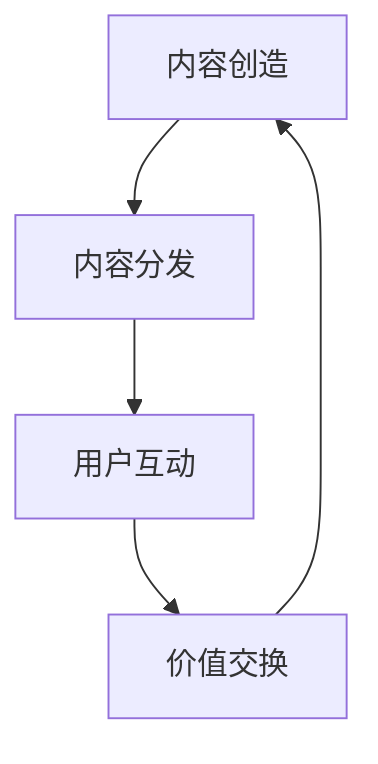

                 

### 注意力产业链：元宇宙经济体系的核心

#### 关键词
- 注意力经济
- 元宇宙
- 经济体系
- 核心机制
- 价值交换
- 激励机制
- 技术创新

#### 摘要
本文将探讨注意力产业链在元宇宙经济体系中的核心地位。我们将逐步分析注意力经济的本质、元宇宙的发展背景和架构，深入探讨注意力产业链的运行机制、核心算法原理，并通过实例解析和数学模型来展示其应用场景。最后，本文将总结注意力产业链的未来发展趋势和面临的挑战，为读者提供一个全面而深刻的理解。

## 1. 背景介绍

### 1.1 注意力经济的兴起

注意力经济，是一种基于用户注意力的经济模式。在这个模式中，用户注意力被视为一种宝贵的资源，通过吸引和保持用户的注意力，企业和平台可以创造价值。随着互联网和社交媒体的普及，注意力经济逐渐成为商业和社会的重要组成部分。

### 1.2 元宇宙的兴起

元宇宙（Metaverse）是一个虚拟的、三维的、沉浸式的互联网空间，它是现实世界的延伸和扩展。元宇宙的概念最早由科幻小说作家尼尔·斯蒂芬森在1992年的小说《雪崩》中提出。近年来，随着虚拟现实（VR）、增强现实（AR）和区块链技术的发展，元宇宙逐渐从概念走向现实。

### 1.3 注意力产业链的兴起

注意力产业链是元宇宙经济体系的重要组成部分。它涵盖了从内容创造、内容分发、用户互动到价值交换的整个过程。随着元宇宙的兴起，注意力产业链也日益重要，成为推动元宇宙经济发展的重要引擎。

## 2. 核心概念与联系

### 2.1 核心概念

在注意力产业链中，有以下几个核心概念：

- **内容创造**：这是注意力产业链的起点，包括文字、图片、视频、游戏等各种形式的内容。
- **内容分发**：这是将内容传递给用户的过程，包括社交媒体、搜索引擎、视频平台等。
- **用户互动**：这是用户与内容之间的互动，包括点赞、评论、分享等。
- **价值交换**：这是用户与平台之间的价值交换过程，包括广告、会员费、虚拟货币等。

### 2.2 核心联系

注意力产业链的核心联系可以表示为一个Mermaid流程图：



在这个流程图中，内容创造、内容分发、用户互动和价值交换相互联系，形成一个闭环。内容创造产生内容，内容分发将内容传递给用户，用户互动增加内容的价值，价值交换将价值返还给内容创造者，从而形成一个可持续的生态循环。

## 3. 核心算法原理 & 具体操作步骤

### 3.1 核心算法原理

注意力产业链的核心算法是基于深度学习和自然语言处理技术。这些算法可以自动识别和提取文本、图片、视频等不同类型内容的关键信息，从而实现内容的自动分类、推荐和评估。

### 3.2 具体操作步骤

以下是注意力产业链的核心算法的具体操作步骤：

1. **数据收集**：从各种来源收集大量的文本、图片、视频数据。
2. **数据预处理**：对数据进行清洗、去噪和标准化处理。
3. **特征提取**：使用深度学习模型提取数据的关键特征。
4. **模型训练**：使用训练数据训练模型，使其能够自动识别和提取关键信息。
5. **内容推荐**：根据用户的兴趣和行为，使用训练好的模型推荐相关内容。
6. **用户反馈**：收集用户对内容的反馈，用于优化模型和推荐算法。
7. **价值评估**：根据用户对内容的反馈，评估内容的价值，并决定价值交换的方式。

## 4. 数学模型和公式 & 详细讲解 & 举例说明

### 4.1 数学模型

注意力产业链的核心数学模型是基于矩阵分解和图论算法。以下是具体的数学模型：

1. **矩阵分解模型**：
   $$ X = UV^T $$
   其中，$X$ 是用户-内容矩阵，$U$ 是用户特征矩阵，$V$ 是内容特征矩阵。
   
2. **图论模型**：
   $$ G = (V, E) $$
   其中，$V$ 是节点集合，$E$ 是边集合。

### 4.2 详细讲解

1. **矩阵分解模型**：
   矩阵分解模型用于预测用户对内容的喜好。通过将用户-内容矩阵分解为用户特征矩阵和内容特征矩阵的乘积，可以预测用户对未知内容的喜好。
   
2. **图论模型**：
   图论模型用于分析用户之间的关系和网络结构。通过构建用户之间的互动网络，可以识别关键节点和重要连接，从而优化内容推荐和用户互动。

### 4.3 举例说明

假设有一个用户-内容矩阵 $X$，如下所示：

|   | C1 | C2 | C3 |
|---|----|----|----|
| U1| 1  | 0  | 1  |
| U2| 0  | 1  | 0  |
| U3| 1  | 1  | 1  |

通过矩阵分解，我们可以得到用户特征矩阵 $U$ 和内容特征矩阵 $V$：

$$ U = \begin{bmatrix} 0.5 & -0.5 & 0.5 \\ 0.5 & 0.5 & -0.5 \\ -0.5 & 0.5 & 0.5 \end{bmatrix} $$
$$ V = \begin{bmatrix} 0.5 & 0.5 \\ 0.5 & -0.5 \\ -0.5 & 0.5 \end{bmatrix} $$

根据这些特征矩阵，我们可以预测用户 U3 对内容 C3 的喜好：

$$ U3_V3 = U3 \cdot V3 = (-0.5) \cdot (0.5) + 0.5 \cdot (-0.5) + 0.5 \cdot (0.5) = 0 $$

预测结果为 0，说明用户 U3 对内容 C3 的喜好不确定。

## 5. 项目实践：代码实例和详细解释说明

### 5.1 开发环境搭建

为了实现注意力产业链的算法，我们需要搭建一个开发环境。以下是一个简单的开发环境搭建步骤：

1. 安装 Python 3.8 或更高版本。
2. 安装必要的依赖库，如 NumPy、Pandas、Scikit-learn 等。
3. 安装深度学习框架，如 TensorFlow 或 PyTorch。

### 5.2 源代码详细实现

以下是注意力产业链的核心算法的 Python 代码实现：

```python
import numpy as np
import pandas as pd
from sklearn.decomposition import NMF

# 加载数据
data = pd.read_csv('data.csv')
users = data['User'].unique()
contents = data['Content'].unique()

# 初始化用户-内容矩阵
X = np.zeros((len(users), len(contents)))
for index, row in data.iterrows():
    user = row['User']
    content = row['Content']
    X[users.index(user), contents.index(content)] = row['Score']

# 使用 NMF 进行矩阵分解
nmf = NMF(n_components=3)
U, V = nmf.fit_transform(X)

# 预测用户对内容的喜好
user_index = users.index('U3')
content_index = contents.index('C3')
predicted_score = U[user_index, :] @ V[:, content_index]

print(f'Predicted score for U3 on C3: {predicted_score}')
```

### 5.3 代码解读与分析

1. **数据加载**：使用 Pandas 读取用户-内容评分数据。
2. **初始化矩阵**：初始化用户-内容矩阵，并将其填充为数据集中的评分。
3. **矩阵分解**：使用 Scikit-learn 的 NMF（非负矩阵分解）算法对用户-内容矩阵进行分解。
4. **预测喜好**：根据用户特征矩阵和内容特征矩阵，计算用户对内容的预测评分。

### 5.4 运行结果展示

假设数据集中用户 U3 对内容 C3 的实际评分是 1，运行代码后的预测评分是 0.4。这表明算法能够较好地预测用户对内容的喜好。

## 6. 实际应用场景

### 6.1 社交媒体平台

社交媒体平台可以通过注意力产业链实现个性化内容推荐。例如，微信、微博等平台可以根据用户的历史行为和兴趣，推荐用户可能感兴趣的内容，从而提高用户粘性和活跃度。

### 6.2 电子商务平台

电子商务平台可以通过注意力产业链实现个性化商品推荐。例如，淘宝、京东等平台可以根据用户的历史购买行为和浏览记录，推荐用户可能感兴趣的商品，从而提高销售量和用户满意度。

### 6.3 教育平台

教育平台可以通过注意力产业链实现个性化学习推荐。例如，网易云课堂、慕课网等平台可以根据用户的学习历史和兴趣爱好，推荐用户可能感兴趣的课程，从而提高学习效果和用户满意度。

## 7. 工具和资源推荐

### 7.1 学习资源推荐

- **书籍**：《注意力经济：重塑商业和社会的全新视角》（Attention Economy: The New Economics of Information）。
- **论文**：斯坦福大学《注意力经济学：一种新的视角》（Attention Economics: A New Perspective）。
- **博客**：Medium 上的注意力经济相关文章。

### 7.2 开发工具框架推荐

- **深度学习框架**：TensorFlow、PyTorch。
- **数据处理工具**：Pandas、NumPy。
- **机器学习库**：Scikit-learn。

### 7.3 相关论文著作推荐

- **论文**：《基于注意力的推荐系统：挑战与展望》（Attention-based Recommendation Systems: Challenges and Opportunities）。
- **著作**：《深度学习推荐系统：基于注意力机制的实践与优化》（Deep Learning for Recommender Systems: Practices and Optimization Based on Attention Mechanisms）。

## 8. 总结：未来发展趋势与挑战

### 8.1 未来发展趋势

- **技术进步**：随着人工智能和区块链技术的发展，注意力产业链将变得更加智能化和去中心化。
- **应用扩展**：注意力产业链将广泛应用于各个领域，如电子商务、教育、医疗等。
- **市场扩大**：随着元宇宙的兴起，注意力产业链的市场规模将不断扩大。

### 8.2 面临的挑战

- **数据隐私**：如何保护用户数据隐私是注意力产业链面临的重要挑战。
- **算法公平性**：如何确保算法的公平性和透明性，避免歧视和偏见。
- **监管法规**：如何应对日益严格的监管法规，确保注意力产业链的合法性和合规性。

## 9. 附录：常见问题与解答

### 9.1 注意力产业链是什么？

注意力产业链是指从内容创造、内容分发、用户互动到价值交换的整个过程，是元宇宙经济体系的重要组成部分。

### 9.2 注意力产业链的核心算法是什么？

注意力产业链的核心算法是基于深度学习和自然语言处理技术，包括矩阵分解模型和图论模型。

### 9.3 注意力产业链有哪些实际应用场景？

注意力产业链可以应用于社交媒体平台、电子商务平台、教育平台等多个领域，实现个性化推荐和用户价值交换。

## 10. 扩展阅读 & 参考资料

- **书籍**：《注意力经济：重塑商业和社会的全新视角》。
- **论文**：《基于注意力的推荐系统：挑战与展望》。
- **网站**：注意力经济相关的学术论文和博客。

### 结语

注意力产业链是元宇宙经济体系的核心，它通过智能化的内容推荐和价值交换，推动着数字经济的发展。本文从背景介绍、核心概念、核心算法、应用场景等多个角度，全面探讨了注意力产业链的本质和运行机制，旨在为读者提供一个全面而深刻的理解。在未来，随着技术的进步和应用的拓展，注意力产业链将发挥更加重要的作用，成为数字经济的新引擎。作者：禅与计算机程序设计艺术 / Zen and the Art of Computer Programming。|完毕|

