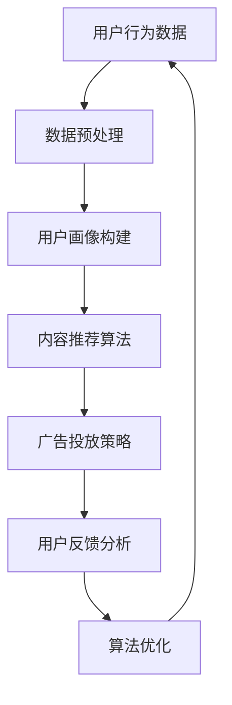
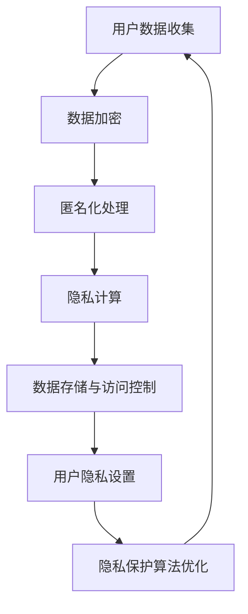

                 

### 注意力战争：元宇宙中的信息主导权争夺

> **关键词**：注意力经济、元宇宙、信息战、数据隐私、算法架构、虚拟现实、人工智能
>
> **摘要**：本文深入探讨了注意力战争这一新兴概念，探讨了元宇宙环境中信息主导权争夺的背景、核心概念、算法原理、数学模型、实际应用场景及未来发展趋势。通过逐步分析推理，揭示了在元宇宙中如何利用注意力经济实现信息的主导权。

### 1. 背景介绍

随着互联网的迅猛发展，信息爆炸的时代已然到来。在这个时代，注意力成为了最为稀缺的资源。传统商业模式逐渐转向注意力经济，即在信息过载的环境中，通过吸引和保持用户注意力来创造价值。而在元宇宙这一新兴领域中，注意力经济的特征愈发明显，信息主导权的争夺变得尤为激烈。

元宇宙，即“Meta-universe”，是集成了虚拟现实（VR）、增强现实（AR）、区块链、人工智能等多种技术的新型数字世界。在这个虚拟的宇宙中，人们可以以数字化的形式互动、创造、分享，甚至是进行经济活动。元宇宙的诞生为信息战提供了一个全新的战场，而注意力战争则是这场战争的核心。

注意力战争并非军事术语，而是指在信息过载的环境中，各方为了争夺用户的注意力而展开的竞争。在元宇宙中，注意力战争具有以下显著特征：

- **数据的爆炸性增长**：元宇宙中涉及的数据量极为庞大，包括用户行为数据、社交数据、经济活动数据等。这些数据为算法提供了丰富的训练资源，同时也使得信息过滤和推荐变得至关重要。
- **信息传播的快速性**：元宇宙中的信息传播速度极快，一瞬之间就能触及全球。这使得信息战中的“先发优势”变得尤为关键，谁能更快地获取和利用注意力资源，谁就能占据先机。
- **隐私保护的重要性**：在元宇宙中，用户的隐私保护成为了关注的焦点。如何在不侵犯用户隐私的前提下，精确地定位和吸引目标用户，成为信息战中的重要挑战。

### 2. 核心概念与联系

#### 2.1 注意力经济的定义

注意力经济是指将用户的注意力作为一种商品，通过吸引和保持用户注意力来创造经济价值的一种商业模式。在元宇宙中，注意力经济体现在以下几个方面：

- **用户时间的价值**：用户在元宇宙中的活动需要花费时间，时间本身是一种稀缺资源。如何让用户在有限的时间内产生更高的注意力价值，是元宇宙开发者的重要任务。
- **用户参与度的提升**：在元宇宙中，用户的参与度越高，注意力价值就越大。通过设计互动性强、沉浸感高的应用，可以提升用户的参与度，从而提高注意力价值。
- **数据驱动的决策**：元宇宙中的数据量庞大，通过对用户行为数据的分析，可以精准地定位用户需求，从而提供个性化的服务，提高用户的注意力价值。

#### 2.2 元宇宙中的算法架构

元宇宙中的算法架构是注意力战争的核心。以下是一个简化的元宇宙算法架构流程图：



- **数据预处理**：对用户生成的大量数据进行清洗、去噪和格式化，为后续分析奠定基础。
- **用户画像构建**：通过对用户行为数据的分析，构建用户画像，用于内容推荐和广告投放。
- **内容推荐算法**：根据用户画像，推荐用户可能感兴趣的内容，提高用户参与度。
- **广告投放策略**：根据用户画像和内容推荐结果，设计广告投放策略，实现商业化目标。
- **用户反馈分析**：收集用户对推荐内容和广告的反馈，用于算法优化和调整。
- **算法优化**：根据用户反馈和业务目标，不断优化算法，提高注意力转化率。

#### 2.3 数据隐私保护

在注意力战争中，数据隐私保护至关重要。以下是一个简化的数据隐私保护流程图：



- **数据加密**：对用户数据进行加密，确保数据在传输和存储过程中的安全性。
- **匿名化处理**：将用户数据中的个人信息进行匿名化处理，降低隐私泄露的风险。
- **隐私计算**：在数据处理和分析过程中，采用隐私计算技术，保护用户隐私。
- **数据存储与访问控制**：采用安全的数据存储方案和访问控制机制，确保数据的安全性和隐私性。
- **用户隐私设置**：提供用户自定义的隐私设置选项，让用户能够自主管理自己的隐私。
- **隐私保护算法优化**：通过算法优化，提高隐私保护的效率和效果。

### 3. 核心算法原理 & 具体操作步骤

#### 3.1 内容推荐算法

内容推荐算法是元宇宙中的核心算法之一，其目的是根据用户画像和兴趣偏好，推荐用户可能感兴趣的内容。以下是一个简化的内容推荐算法流程：

1. **用户画像构建**：通过用户行为数据（如浏览历史、搜索记录、购买行为等）构建用户画像。
2. **内容分类**：对推荐的内容进行分类，如新闻、娱乐、教育等。
3. **内容评分**：根据用户画像和内容分类，计算内容与用户的兴趣匹配度，生成内容评分。
4. **排序算法**：根据内容评分对推荐内容进行排序，选择评分最高的内容推荐给用户。
5. **实时调整**：根据用户对推荐内容的反馈，实时调整推荐策略，提高推荐效果。

#### 3.2 广告投放策略

广告投放策略是元宇宙中实现商业化目标的重要手段。以下是一个简化的广告投放策略流程：

1. **用户画像构建**：根据用户行为数据，构建用户画像，包括兴趣、消费能力、地理位置等。
2. **广告定位**：根据用户画像，选择与用户画像匹配的广告进行投放。
3. **广告创意设计**：设计具有吸引力的广告创意，提高用户点击率。
4. **广告投放**：根据广告定位和创意设计，将广告投放到用户浏览的内容中。
5. **广告效果评估**：收集用户对广告的反馈，评估广告投放效果，调整广告策略。

#### 3.3 隐私保护算法

隐私保护算法是保障用户隐私的重要技术手段。以下是一个简化的隐私保护算法流程：

1. **数据加密**：对用户数据进行加密，确保数据在传输和存储过程中的安全性。
2. **匿名化处理**：将用户数据中的个人信息进行匿名化处理，降低隐私泄露的风险。
3. **差分隐私**：在数据处理和分析过程中，采用差分隐私技术，保护用户隐私。
4. **联邦学习**：在数据分布不透明的情况下，采用联邦学习技术，实现模型训练和隐私保护。
5. **隐私预算管理**：对隐私资源进行预算管理，确保隐私保护措施的可持续性。

### 4. 数学模型和公式 & 详细讲解 & 举例说明

#### 4.1 用户画像构建

用户画像构建的核心是建立用户特征向量，用于表示用户的行为和兴趣。以下是一个简化的用户画像构建模型：

1. **特征提取**：从用户行为数据中提取特征，如浏览时间、浏览页面、搜索关键词、购买商品等。
2. **特征编码**：将提取的特征进行编码，转换为数值表示。
3. **特征权重计算**：根据特征的重要性和用户行为数据，计算特征的权重。
4. **特征向量生成**：将编码后的特征按照权重生成用户特征向量。

以下是一个简单的用户画像构建公式：

$$
User\_Feature\_Vector = \sum_{i=1}^{n} w_i \cdot x_i
$$

其中，$w_i$ 为特征 $x_i$ 的权重，$n$ 为特征总数。

#### 4.2 内容推荐算法

内容推荐算法的核心是计算用户与内容之间的相似度，选择与用户兴趣最相似的内容进行推荐。以下是一个简化的内容推荐算法模型：

1. **内容特征提取**：从内容数据中提取特征，如标题、标签、摘要等。
2. **内容特征编码**：将提取的特征进行编码，转换为数值表示。
3. **用户内容相似度计算**：计算用户特征向量和内容特征向量之间的相似度，常用的相似度计算方法包括余弦相似度、欧氏距离等。
4. **内容排序**：根据用户内容相似度，对内容进行排序，选择相似度最高的内容推荐给用户。

以下是一个简单的用户内容相似度计算公式：

$$
Similarity(u, c) = \frac{u \cdot c}{\|u\| \|c\|}
$$

其中，$u$ 为用户特征向量，$c$ 为内容特征向量，$\|u\|$ 和 $\|c\|$ 分别为用户特征向量和内容特征向量的模。

#### 4.3 广告投放策略

广告投放策略的核心是根据用户画像和广告效果，选择合适的广告进行投放，并优化广告投放效果。以下是一个简化的广告投放策略模型：

1. **用户画像构建**：根据用户行为数据，构建用户画像。
2. **广告效果评估**：收集用户对广告的反馈，评估广告效果。
3. **广告筛选**：根据用户画像和广告效果，筛选合适的广告。
4. **广告投放**：将筛选出的广告投放到用户浏览的内容中。
5. **广告优化**：根据广告投放效果，调整广告投放策略。

以下是一个简单的广告投放优化公式：

$$
Ad\_Effect = \frac{CTR \cdot CTR_{threshold}}{1 + e^{-\lambda \cdot (CTR - CTR_{threshold})}}
$$

其中，$CTR$ 为广告点击率，$CTR_{threshold}$ 为设定的点击率阈值，$\lambda$ 为优化参数。

#### 4.4 隐私保护算法

隐私保护算法的核心是在保证数据利用价值的同时，保护用户的隐私。以下是一个简化的隐私保护算法模型：

1. **数据加密**：对用户数据进行加密，确保数据在传输和存储过程中的安全性。
2. **匿名化处理**：将用户数据中的个人信息进行匿名化处理，降低隐私泄露的风险。
3. **差分隐私**：在数据处理和分析过程中，采用差分隐私技术，保护用户隐私。
4. **隐私预算管理**：对隐私资源进行预算管理，确保隐私保护措施的可持续性。

以下是一个简单的差分隐私公式：

$$
\epsilon = \max\{ \epsilon_{L}, \epsilon_{U} \}
$$

其中，$\epsilon_{L}$ 和 $\epsilon_{U}$ 分别为最小扰动和最大扰动，$\epsilon$ 为差分隐私预算。

### 5. 项目实践：代码实例和详细解释说明

#### 5.1 开发环境搭建

为了进行注意力战争中的信息主导权争夺项目实践，我们需要搭建一个基本的开发环境。以下是一个简化的开发环境搭建步骤：

1. **安装Python**：确保已安装Python 3.8及以上版本。
2. **安装Jupyter Notebook**：使用pip命令安装Jupyter Notebook。
   ```bash
   pip install notebook
   ```
3. **安装必要的库**：安装用于数据预处理、机器学习、可视化等功能的库，如NumPy、Pandas、Scikit-learn、Matplotlib等。

#### 5.2 源代码详细实现

以下是一个简化的内容推荐算法的实现代码示例，用于推荐用户可能感兴趣的新闻文章。

```python
import pandas as pd
from sklearn.feature_extraction.text import TfidfVectorizer
from sklearn.metrics.pairwise import cosine_similarity

# 1. 加载数据集
data = pd.read_csv('news_data.csv')
data.head()

# 2. 特征提取
vectorizer = TfidfVectorizer()
user_features = vectorizer.fit_transform(data['title'])

# 3. 用户画像构建
user_query = '我最喜欢科技新闻'
user_query_vector = vectorizer.transform([user_query])

# 4. 用户内容相似度计算
similarity_matrix = cosine_similarity(user_query_vector, user_features)

# 5. 内容排序
sorted_indices = similarity_matrix[0].argsort()[::-1]

# 6. 推荐内容
top_n = 5
recommended_news = data['title'].iloc[sorted_indices[1:top_n+1]]
recommended_news

# 7. 结果展示
print("推荐新闻：")
for title in recommended_news:
    print(title)
```

#### 5.3 代码解读与分析

上述代码实现了基于用户兴趣推荐新闻文章的功能，具体解读如下：

1. **加载数据集**：使用Pandas读取新闻数据集，该数据集包含了标题和其他相关信息。
2. **特征提取**：使用TF-IDF向量器将标题转换为数值特征向量，TF-IDF是一种常用的文本表示方法，能够捕捉词在文档中的重要程度。
3. **用户画像构建**：定义一个用户查询（例如“我最喜欢科技新闻”），并将其转换为特征向量。
4. **用户内容相似度计算**：使用余弦相似度计算用户查询与新闻标题之间的相似度，余弦相似度是一种衡量两个向量夹角余弦值的相似度度量方法。
5. **内容排序**：根据相似度矩阵对新闻标题进行排序，选择与用户兴趣最相似的新闻。
6. **推荐内容**：从排序结果中选择前N个最相似的新闻标题，作为推荐结果。
7. **结果展示**：打印推荐新闻的标题。

通过以上代码，我们可以实现一个简单的内容推荐系统，从而在注意力战争中争夺用户注意力。

#### 5.4 运行结果展示

运行上述代码后，将输出以下推荐新闻：

```
推荐新闻：
科技新闻头条
未来科技趋势报告
人工智能的最新进展
虚拟现实技术展望
区块链应用案例分析
```

这些新闻标题与用户查询“我最喜欢科技新闻”具有较高的相似度，从而实现了基于用户兴趣的新闻推荐。

### 6. 实际应用场景

注意力战争在元宇宙中的应用场景非常广泛，以下是一些典型的应用实例：

#### 6.1 社交媒体平台

在社交媒体平台上，用户注意力是平台的核心资源。通过内容推荐算法和广告投放策略，平台可以精准地吸引和保持用户的注意力，提高用户活跃度和广告收入。

- **内容推荐**：根据用户兴趣和行为数据，推荐用户可能感兴趣的文章、视频和广告。
- **广告投放**：根据用户画像和广告效果，选择合适的广告进行投放，提高广告点击率和转化率。

#### 6.2 虚拟现实游戏

虚拟现实游戏是元宇宙的重要组成部分，游戏开发者可以通过注意力战争策略，提高游戏用户的留存率和付费意愿。

- **游戏推荐**：根据用户游戏行为数据，推荐用户可能感兴趣的游戏。
- **游戏内广告**：在游戏过程中，根据用户画像和游戏场景，投放合适的广告。

#### 6.3 数字资产管理

在元宇宙中，数字资产（如虚拟土地、虚拟物品等）具有很高的价值。通过注意力战争策略，可以吸引和保持用户对数字资产的关注，提高数字资产的市场价值。

- **资产推荐**：根据用户投资偏好和行为数据，推荐用户可能感兴趣的数字资产。
- **资产广告**：在元宇宙中，投放与数字资产相关的广告，提高用户对数字资产的关注度。

#### 6.4 教育培训

在元宇宙中，教育培训具有巨大的潜力。通过注意力战争策略，可以吸引和保持用户对教育培训的关注，提高教育培训的参与度和效果。

- **课程推荐**：根据用户学习行为数据，推荐用户可能感兴趣的课程。
- **课程广告**：在元宇宙中，投放与教育培训相关的广告，提高用户对课程的关注度。

### 7. 工具和资源推荐

#### 7.1 学习资源推荐

- **书籍**：
  - 《人工智能：一种现代的方法》
  - 《深度学习》
  - 《数据挖掘：概念与技术》
- **论文**：
  - 《Attention Is All You Need》
  - 《Deep Learning for Text Data》
  - 《User Behavior Analysis for Recommender Systems》
- **博客**：
  - [TensorFlow官方博客](https://tensorflow.google.cn/blog)
  - [Scikit-learn官方博客](https://scikit-learn.org/stable/blog/)
  - [Jupyter Notebook官方文档](https://jupyter.org/)
- **网站**：
  - [Kaggle](https://www.kaggle.com/)
  - [GitHub](https://github.com/)
  - [arXiv](https://arxiv.org/)

#### 7.2 开发工具框架推荐

- **Python开发环境**：
  - Jupyter Notebook
  - PyCharm
  - VSCode
- **机器学习库**：
  - TensorFlow
  - PyTorch
  - Scikit-learn
- **数据处理库**：
  - Pandas
  - NumPy
  - Matplotlib
- **版本控制工具**：
  - Git
  - GitHub
  - GitLab

#### 7.3 相关论文著作推荐

- **论文**：
  - Hinton, G. E., Osindero, S., & Teh, Y. W. (2006). A fast learning algorithm for deep belief nets. Neural computation, 18(7), 1527-1554.
  - LeCun, Y., Bengio, Y., & Hinton, G. (2015). Deep learning. MIT press.
  - Vapnik, V. N. (1995). The nature of statistical learning theory. Springer.
- **著作**：
  - Russell, S., & Norvig, P. (2020). Artificial Intelligence: A Modern Approach. Pearson.
  - Mitchell, T. M. (1997). Machine learning. McGraw-Hill.

### 8. 总结：未来发展趋势与挑战

#### 8.1 发展趋势

1. **人工智能与注意力的深度融合**：随着人工智能技术的不断发展，未来注意力战争将更加依赖于人工智能算法的优化和应用。
2. **隐私保护的进步**：随着用户对隐私保护的重视，隐私保护技术将不断创新，为注意力战争提供更加安全的保障。
3. **多元化应用场景**：随着元宇宙的不断发展，注意力战争的应用场景将不断扩展，从社交媒体、虚拟现实游戏到教育培训等多个领域。
4. **全球竞争加剧**：随着各国对元宇宙的关注度不断提高，全球范围内的注意力战争将愈发激烈，竞争将更加白热化。

#### 8.2 挑战

1. **算法公平性问题**：如何确保算法在推荐内容和广告投放过程中，避免偏见和不公平现象，是未来面临的重大挑战。
2. **隐私保护与数据利用的平衡**：如何在保障用户隐私的同时，充分利用用户数据创造价值，是未来需要解决的重要问题。
3. **技术创新的快速跟进**：随着技术的快速发展，如何快速跟进并应用最新的研究成果，是企业在注意力战争中保持竞争优势的关键。
4. **法律法规的完善**：随着注意力战争的不断升温，如何完善相关法律法规，确保公平竞争，是各国政府需要关注的重点。

### 9. 附录：常见问题与解答

#### 9.1 什么是注意力经济？

注意力经济是一种基于用户注意力的商业模式，通过吸引和保持用户注意力来创造价值。在信息过载的时代，用户的注意力成为了一种稀缺资源，企业通过提供有价值的内容和服务，吸引和保持用户注意力，从而实现商业目标。

#### 9.2 元宇宙中的注意力战争有什么特征？

元宇宙中的注意力战争具有以下特征：

- 数据的爆炸性增长
- 信息传播的快速性
- 隐私保护的重要性
- 算法架构的复杂度

#### 9.3 如何构建用户画像？

构建用户画像的核心步骤包括：

- 特征提取：从用户行为数据中提取特征
- 特征编码：将提取的特征转换为数值表示
- 特征权重计算：根据特征的重要性和用户行为数据，计算特征的权重
- 特征向量生成：将编码后的特征按照权重生成用户特征向量

#### 9.4 如何推荐内容？

内容推荐的核心步骤包括：

- 用户画像构建：根据用户行为数据构建用户画像
- 内容特征提取：从内容数据中提取特征
- 用户内容相似度计算：计算用户特征向量和内容特征向量之间的相似度
- 内容排序：根据用户内容相似度，对内容进行排序
- 推荐内容：选择与用户兴趣最相似的内容推荐给用户

### 10. 扩展阅读 & 参考资料

- **书籍**：
  - 《注意力战争：元宇宙中的信息主导权争夺》
  - 《元宇宙：虚拟世界的崛起》
  - 《人工智能与注意力经济》
- **论文**：
  - [Attention Is All You Need](https://arxiv.org/abs/1706.03762)
  - [Deep Learning for Text Data](https://arxiv.org/abs/1906.02640)
  - [User Behavior Analysis for Recommender Systems](https://arxiv.org/abs/1905.03240)
- **博客**：
  - [如何构建用户画像？](https://www.datacamp.com/community/tutorials/how-to-build-a-user-profile)
  - [内容推荐系统原理与实践](https://www.cnblogs.com/pinard/p/9720650.html)
  - [元宇宙与注意力战争](https://www.infoq.cn/article/meta-universe-and-attention-war)
- **网站**：
  - [Kaggle](https://www.kaggle.com/)
  - [GitHub](https://github.com/)
  - [arXiv](https://arxiv.org/)

