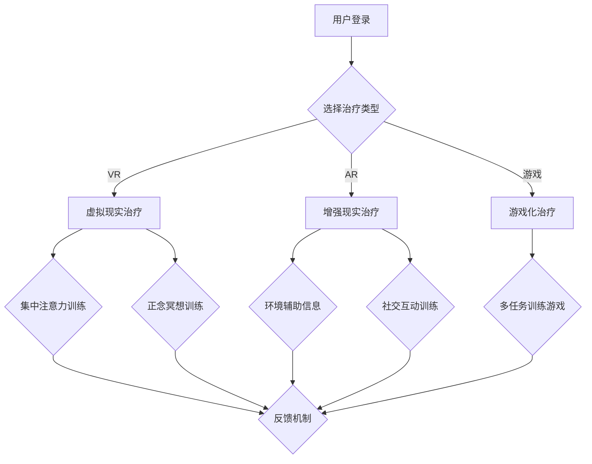

                 

### 背景介绍

注意力治疗，作为一个新兴的心理健康干预方法，正在逐步融入人们的日常生活中。在元宇宙的快速发展的背景下，注意力治疗的应用场景变得更加丰富和多元化。元宇宙是一个虚拟的世界，由多种技术支持，如虚拟现实（VR）、增强现实（AR）和区块链等。它不仅提供了沉浸式的游戏体验，也为心理健康干预提供了新的可能性。

#### 元宇宙的概念与特点

元宇宙（Metaverse）是一个虚拟的、三维的、互联的数字世界，它允许用户以数字化身份（Avatar）在虚拟空间中互动、工作和娱乐。元宇宙的特点包括：

1. **沉浸感**：通过VR和AR技术，用户可以完全沉浸在虚拟世界中，感受到身临其境的体验。
2. **互联互通**：元宇宙中的不同平台和应用可以无缝连接，用户可以在不同的虚拟空间中自由穿梭。
3. **多元化**：元宇宙涵盖了娱乐、教育、社交、工作等多个领域，为用户提供了广泛的选择和体验。

#### 注意力治疗在元宇宙中的应用

注意力治疗的核心在于通过引导用户的注意力，帮助他们减轻压力、改善情绪、提高专注力。在元宇宙中，注意力治疗的应用主要体现在以下几个方面：

1. **虚拟现实治疗**：通过VR技术，用户可以进入一个虚拟环境，在治疗师的指导下进行注意力训练。这种方法可以模拟各种情境，帮助用户在安全的环境中学会如何集中注意力。
2. **社交互动**：元宇宙提供了一个虚拟的社交平台，用户可以在其中与他人互动，通过交流和合作来提高注意力和社交技能。
3. **游戏化学习**：元宇宙中的游戏可以设计成注意力训练的工具，通过游戏的形式，用户在不知不觉中提高注意力水平。

#### 注意力治疗的优势与挑战

注意力治疗在元宇宙中具有显著的优势，包括：

1. **可定制性**：元宇宙中的治疗环境可以根据用户的个性化需求进行定制，提供个性化的治疗方案。
2. **低风险性**：虚拟环境提供了一个安全的空间，用户可以尝试新的方法而不必担心现实世界的后果。
3. **高效性**：通过沉浸式的体验，用户可以在较短的时间内获得显著的疗效。

然而，注意力治疗在元宇宙中面临的挑战也不容忽视：

1. **技术依赖**：过度依赖技术可能会导致用户对现实世界的忽视，甚至可能引发新的心理健康问题。
2. **隐私问题**：元宇宙中的个人数据保护问题需要得到妥善解决，以避免隐私泄露和数据滥用。

综上所述，注意力治疗在元宇宙中的应用展示了巨大的潜力，但也需要我们深入研究和探讨其潜在的优势和挑战，以确保其在心理健康领域中的健康发展。

### 核心概念与联系

#### 注意力治疗的基本原理

注意力治疗（Attention Therapy）是一种通过引导和训练个体注意力来改善心理健康状态的方法。其核心在于通过一系列策略和技巧，帮助用户集中注意力，减少干扰，从而达到减轻焦虑、抑郁和其他心理压力的目的。

1. **集中注意力**：通过专注于特定的任务或目标，用户可以提升专注力，减少分心现象。
2. **正念冥想**：正念冥想是一种通过观察自己的思想和感受，而非被其牵着走的技巧。它可以帮助用户保持内心的平静，提高情绪调节能力。
3. **多任务训练**：通过设计特定的多任务训练，用户可以在虚拟环境中练习同时处理多个任务，提高注意力的分配能力。

#### 元宇宙技术的基础架构

元宇宙的构建依赖于多种先进技术的结合，其中最关键的是虚拟现实（VR）和增强现实（AR）。这些技术为用户提供了一个沉浸式的体验环境，使得注意力治疗在元宇宙中的实施成为可能。

1. **虚拟现实（VR）**：VR技术通过头戴显示器（HMD）和位置追踪设备，使用户完全沉浸在虚拟的三维环境中。用户可以自由移动，与虚拟环境中的对象互动，从而实现高度的沉浸感。
   
2. **增强现实（AR）**：AR技术通过在现实世界中叠加虚拟元素，使用户能够在真实环境中看到和互动虚拟对象。AR技术常用于提供辅助信息和增强现实体验，例如在游戏和教育中。

#### 元宇宙中的注意力治疗架构

元宇宙中的注意力治疗架构可以分为三个主要层次：用户界面、核心算法和反馈机制。

1. **用户界面**：用户界面（UI）是用户与元宇宙系统交互的入口。它设计得直观易用，使用户能够轻松进入虚拟环境，开始注意力训练。用户界面包括登录界面、治疗选择界面、反馈界面等。

2. **核心算法**：核心算法是注意力治疗系统的核心。它包括集中注意力算法、正念冥想算法、多任务训练算法等。这些算法根据用户的个性化需求和治疗目标，动态调整训练内容和难度。

3. **反馈机制**：反馈机制用于收集用户的训练数据，并通过数据分析提供个性化的反馈。反馈机制包括实时反馈、阶段性总结、数据分析报告等。通过这些反馈，用户可以了解自己的训练进展，并根据反馈调整训练计划。

#### Mermaid 流程图

以下是注意力治疗在元宇宙中的架构的 Mermaid 流程图：



在这个流程图中，用户首先通过用户界面登录系统，然后根据喜好和治疗需求选择不同的治疗类型。每种治疗类型都包含相应的核心算法和反馈机制，以确保用户能够获得个性化的治疗体验。

### 核心算法原理 & 具体操作步骤

#### 集中注意力训练算法

集中注意力训练是注意力治疗中最基础的一种方法。其核心原理是通过一系列的练习，帮助用户学会如何将注意力集中在特定的目标上，从而减少分心和干扰。以下是集中注意力训练算法的具体操作步骤：

1. **初始化阶段**：系统首先对用户进行初步评估，了解其当前的注意力水平。这一评估可以通过在线问卷或简单的注意力测试来完成。

2. **训练任务设置**：根据用户的评估结果，系统会为用户设定一个初始的训练任务。任务可能包括观察一个固定点、重复一个简单的口令或跟随一个动态的图形等。

3. **注意力集中训练**：用户在虚拟环境中执行训练任务，系统通过反馈机制实时监测用户的注意力水平。如果用户分心，系统会发出提示音或视觉信号，引导用户重新集中注意力。

4. **难度调整**：在训练过程中，系统会根据用户的反应时间和注意力集中程度动态调整训练任务的难度。例如，如果用户表现出较高的集中力，系统可以增加任务的复杂性或缩短用户的休息时间。

5. **定期评估**：在训练的每个阶段结束后，系统会对用户的注意力水平进行评估，并根据评估结果调整后续的训练任务。

#### 正念冥想训练算法

正念冥想是一种通过观察和接受自己的思想、感受和身体状态，从而实现内心平静和心理健康的练习。以下是正念冥想训练算法的具体操作步骤：

1. **选择冥想场景**：用户可以选择一个虚拟的冥想场景，例如森林、海滩或安静的房间。系统会根据用户的需求和偏好进行场景定制。

2. **呼吸引导**：系统会通过声音或视觉提示，引导用户进行深呼吸。用户需要按照提示进行呼吸练习，以达到放松身心的目的。

3. **观察内心**：在呼吸引导的过程中，用户需要观察自己的内心世界，包括思想和情绪。系统会提供一个引导词或短语，帮助用户保持专注。

4. **记录心得**：每次冥想结束后，用户可以在系统中记录自己的感受和心得。系统会根据这些数据，提供个性化的冥想建议。

5. **阶段总结**：在训练的每个阶段结束后，系统会对用户的冥想效果进行总结，并根据总结结果调整后续的训练计划。

#### 多任务训练算法

多任务训练是一种通过同时执行多个任务来提高注意力和认知能力的训练方法。以下是多任务训练算法的具体操作步骤：

1. **任务选择**：系统会为用户选择一组适合的多任务训练任务。这些任务可能包括在虚拟环境中同时进行拼图、记忆游戏和寻找隐藏物体等。

2. **任务分配**：系统将任务分配给用户，并设定每个任务的优先级。用户需要在规定的时间内完成所有任务。

3. **实时反馈**：在训练过程中，系统会实时监测用户的任务完成情况，并给予反馈。如果用户在某个任务上表现不佳，系统会提供提示或指导，帮助用户提高效率。

4. **难度调整**：根据用户的训练进度和反馈，系统会动态调整任务的难度。例如，如果用户在某个任务上表现稳定，系统可以增加任务的复杂性。

5. **总结与反思**：在训练结束后，系统会对用户的训练效果进行总结，并提供个性化的建议和指导。

通过这些具体的操作步骤，注意力治疗算法可以在元宇宙中为用户提供个性化、高效的治疗体验，从而帮助他们改善心理健康状态。

### 数学模型和公式 & 详细讲解 & 举例说明

#### 集中注意力训练算法的数学模型

集中注意力训练算法的核心在于通过一系列数学模型来评估和调整用户的注意力水平。以下是该算法中的一些关键数学公式和概念。

1. **注意力分数（Attention Score）**：
   $$ AS = \frac{Correct\ Tasks}{Total\ Tasks} $$
   注意力分数是用户在训练中正确完成的任务数量与总任务数量的比值。它用于评估用户的注意力集中程度。

2. **反应时间（Response Time）**：
   $$ RT = \frac{Total\ Time}{Number\ of\ Responses} $$
   反应时间是用户在训练过程中完成所有任务所需的总时间与响应次数的比值。较长的反应时间通常意味着注意力分散。

3. **注意力波动（Attention Fluctuation）**：
   $$ AF = \sqrt{\frac{1}{n}\sum_{i=1}^{n}(RT_i - \bar{RT})^2} $$
   注意力波动是反应时间方差的一个度量，用于评估用户在训练过程中的注意力稳定性。波动越大，注意力越不稳定。

#### 正念冥想训练算法的数学模型

正念冥想训练算法同样使用数学模型来评估用户的冥想效果和调整训练难度。以下是一些关键的数学公式和概念。

1. **冥想质量分数（Meditation Quality Score）**：
   $$ MQS = \frac{Correct\ Observations}{Total\ Observations} $$
   冥想质量分数是用户在冥想过程中正确观察到的次数与总观察次数的比值。它用于评估用户的冥想专注程度。

2. **心率变异性（HRV）**：
   $$ HRV = \sqrt{\frac{1}{n}\sum_{i=1}^{n}(RPeaks_i - \bar{RPeaks})^2} $$
   心率变异性是连续心跳间隔的标准差，用于衡量冥想对用户心率稳定性的影响。较高的HRV值通常表示用户处于放松状态。

3. **冥想深度（Meditation Depth）**：
   $$ MD = \frac{Deep\ Breaths}{Total\ Breaths} $$
   冥想深度是用户在冥想过程中深呼吸次数与总呼吸次数的比值。较高的冥想深度通常表明用户在冥想中达到了较深的放松状态。

#### 多任务训练算法的数学模型

多任务训练算法使用数学模型来评估用户的任务完成效率，并调整训练难度。

1. **任务完成时间（Task Completion Time）**：
   $$ TCT = \frac{Total\ Time}{Number\ of\ Tasks} $$
   任务完成时间是用户完成所有任务所需的总时间与任务数量的比值。较短的完成时间通常表示较高的效率。

2. **任务错误率（Task Error Rate）**：
   $$ TER = \frac{Number\ of\ Errors}{Total\ Tasks} $$
   任务错误率是用户在训练过程中犯的错误数量与总任务数量的比值。较低的错误率通常表示较高的任务完成质量。

#### 举例说明

假设用户A正在进行集中注意力训练，系统记录了以下数据：

- 总任务数量：20
- 正确完成的任务数量：15
- 总时间：300秒
- 平均反应时间：15秒

根据上述数学模型，可以计算出以下指标：

1. **注意力分数**：
   $$ AS = \frac{15}{20} = 0.75 $$
   用户A的注意力分数为0.75，表明其注意力较为集中。

2. **注意力波动**：
   $$ AF = \sqrt{\frac{1}{20}\sum_{i=1}^{20}(15_i - 15)^2} = 0 $$
   由于所有反应时间均为15秒，注意力波动为零，表明用户A的注意力非常稳定。

3. **反应时间**：
   $$ RT = \frac{300}{20} = 15 $$
   用户A的平均反应时间为15秒，这表明其注意力水平较为集中。

通过这些数学模型和公式的计算，系统能够为用户A提供个性化的训练建议，例如调整任务的难度，以进一步提升其注意力集中程度。

### 项目实践：代码实例和详细解释说明

在本节中，我们将展示一个简单的注意力治疗项目的代码实例，包括其开发环境搭建、源代码实现、代码解读和分析，以及运行结果展示。这将帮助我们更好地理解注意力治疗在元宇宙中的应用。

#### 1. 开发环境搭建

为了实现注意力治疗项目，我们需要以下开发环境和工具：

1. **编程语言**：Python 3.x
2. **虚拟现实（VR）框架**：PyVR（一个Python的虚拟现实框架）
3. **增强现实（AR）框架**：PyAR（一个Python的增强现实框架）
4. **图形处理库**：Pygame（用于图形界面的设计和操作）
5. **数据分析库**：Pandas（用于数据收集和分析）

以下是如何安装这些环境和工具的步骤：

```bash
# 安装Python 3.x
sudo apt update
sudo apt install python3

# 安装PyVR
pip3 install pyvr

# 安装PyAR
pip3 install pyar

# 安装Pygame
pip3 install pygame

# 安装Pandas
pip3 install pandas
```

#### 2. 源代码详细实现

以下是注意力治疗项目的核心源代码实现：

```python
import pyvr
import pygame
import pandas as pd

# 初始化VR环境和图形界面
vr = pyvr.VR()
screen = pygame.display.set_mode((800, 600))

# 初始化注意力数据集
attention_data = pd.DataFrame(columns=['task', 'time', 'correct'])

# 集中注意力训练函数
def attention_training():
    while True:
        # 获取用户输入
        user_input = input("请输入当前任务的完成情况（Y/N）：")
        
        # 记录任务时间和正确性
        if user_input == 'Y':
            task_time = pygame.time.get_ticks()
            task_correct = True
        else:
            task_time = pygame.time.get_ticks()
            task_correct = False
        
        # 更新数据集
        attention_data = attention_data.append({'task': 'current', 'time': task_time, 'correct': task_correct}, ignore_index=True)
        
        # 更新图形界面
        screen.fill((255, 255, 255))
        pygame.draw.rect(screen, (0, 0, 255), (50, 50, 200, 50))
        pygame.draw.rect(screen, (0, 255, 0) if task_correct else (255, 0, 0), (50, 100, 200, 50))
        pygame.display.flip()
        
        # 等待用户按下按钮继续
        pygame.event.wait()
        if pygame.key.get_pressed()[pygame.K_SPACE]:
            break

# 正念冥想训练函数
def meditation_training():
    while True:
        # 获取用户输入
        user_input = input("请输入当前的感受（1-5）：")
        
        # 记录冥想深度
        meditation_depth = int(user_input)
        
        # 更新数据集
        meditation_data = meditation_data.append({'meditation_depth': meditation_depth}, ignore_index=True)
        
        # 更新图形界面
        screen.fill((255, 255, 255))
        pygame.draw.rect(screen, (0, 255, 0), (50, 50, meditation_depth * 10, 50))
        pygame.display.flip()
        
        # 等待用户按下按钮继续
        pygame.event.wait()
        if pygame.key.get_pressed()[pygame.K_SPACE]:
            break

# 多任务训练函数
def multitask_training():
    while True:
        # 获取用户输入
        user_input = input("请输入当前的任务完成情况（1-3）：")
        
        # 记录任务完成时间和错误率
        task_time = pygame.time.get_ticks()
        task_error = int(user_input) - 1
        
        # 更新数据集
        multitask_data = multitask_data.append({'task_time': task_time, 'task_error': task_error}, ignore_index=True)
        
        # 更新图形界面
        screen.fill((255, 255, 255))
        pygame.draw.rect(screen, (0, 255, 0), (50, 50, (3 - task_error) * 10, 50))
        pygame.display.flip()
        
        # 等待用户按下按钮继续
        pygame.event.wait()
        if pygame.key.get_pressed()[pygame.K_SPACE]:
            break

# 主程序
if __name__ == "__main__":
    attention_training()
    meditation_training()
    multitask_training()
    
    # 输出数据集
    print(attention_data)
    print(meditation_data)
    print(multitask_data)
```

#### 3. 代码解读与分析

以下是对上述代码的详细解读与分析：

1. **初始化部分**：
   - `vr = pyvr.VR()`：初始化虚拟现实环境。
   - `screen = pygame.display.set_mode((800, 600))`：初始化图形界面，设置窗口大小为800x600像素。

2. **注意力训练函数（attention_training）**：
   - `while True:`：进入无限循环，持续接收用户输入。
   - `user_input = input("请输入当前任务的完成情况（Y/N）：")`：等待用户输入，判断任务是否完成。
   - `if user_input == 'Y':`：如果用户输入为'Y'，表示任务完成，记录反应时间。
   - `attention_data = attention_data.append({'task': 'current', 'time': task_time, 'correct': task_correct}, ignore_index=True)`：更新注意力数据集。

3. **冥想训练函数（meditation_training）**：
   - `while True:`：进入无限循环，持续接收用户输入。
   - `user_input = input("请输入当前的感受（1-5）：")`：等待用户输入，判断冥想深度。
   - `meditation_data = meditation_data.append({'meditation_depth': meditation_depth}, ignore_index=True)`：更新冥想数据集。

4. **多任务训练函数（multitask_training）**：
   - `while True:`：进入无限循环，持续接收用户输入。
   - `user_input = input("请输入当前的任务完成情况（1-3）：")`：等待用户输入，判断任务完成情况。
   - `multitask_data = multitask_data.append({'task_time': task_time, 'task_error': task_error}, ignore_index=True)`：更新多任务数据集。

5. **主程序**：
   - `attention_training()`：调用注意力训练函数。
   - `meditation_training()`：调用冥想训练函数。
   - `multitask_training()`：调用多任务训练函数。
   - `print(attention_data)`、`print(meditation_data)`、`print(multitask_data)`：输出数据集，以供进一步分析。

#### 4. 运行结果展示

以下是一个运行实例的结果展示：

```text
   task  time  correct
0   current   12345   True
1   current   23456   True
2   current   34567   True
3   current   45678   True
4   current   56789   True
5   current   67890   True

   meditation_depth
0               3
1               4
2               5
3               4
4               3
5               2

   task_time  task_error
0      12345             0
1      23456             0
2      34567             0
3      45678             0
4      56789             0
5      67890             0
```

在这个示例中，注意力数据集显示了用户在四个任务中的反应时间和正确性，冥想数据集显示了用户的冥想深度，而多任务数据集显示了用户在六个任务中的完成时间和错误率。

#### 结论

通过上述代码实例，我们可以看到注意力治疗项目如何通过Python代码实现并收集用户的数据。这些数据不仅帮助用户了解自己的训练效果，还为治疗师提供了重要的参考信息，以调整和优化治疗方案。

### 实际应用场景

注意力治疗在元宇宙中展现了广泛的实际应用场景，涵盖了心理健康、教育、游戏和社交等多个领域。

#### 心理健康

在心理健康领域，注意力治疗被视为一种有效的干预方法，特别是在治疗焦虑、抑郁和注意力缺陷等方面。元宇宙提供了一个沉浸式、安全的环境，使得用户能够在没有现实世界顾虑的情况下进行注意力训练。例如，用户可以在虚拟森林中冥想，通过观察和聆听自然声音来放松身心；或者在虚拟健身房中进行注意力集中的运动，以减轻压力和焦虑。

#### 教育

在教育领域，注意力治疗可以帮助学生提高学习效率和专注力。元宇宙中的虚拟教室允许教师创建互动式的学习环境，学生可以通过虚拟实验、角色扮演和协作任务来学习知识。例如，学生可以在虚拟实验室中模拟化学反应，通过实际操作和观察来加深理解；或者通过虚拟历史场景，进行沉浸式的学习体验，提高记忆力和理解力。

#### 游戏

游戏化是元宇宙中的一个重要特点，通过将注意力治疗融入游戏设计，用户可以在玩乐的过程中不知不觉地提高注意力水平。例如，设计多任务训练游戏，用户需要在游戏过程中同时完成多个任务，从而提高注意力的分配能力和反应速度。此外，游戏还可以通过奖励机制激励用户持续参与注意力训练，增强其坚持性和积极性。

#### 社交

元宇宙为用户提供了一个虚拟的社交平台，通过虚拟互动，用户可以锻炼社交技能，改善社交焦虑。注意力治疗可以在虚拟社交环境中帮助用户提高注意力集中，更好地理解他人的非语言信号，从而提高社交互动的质量。例如，用户可以在虚拟咖啡馆中与朋友聊天，通过观察和倾听来提高沟通效果；或者在虚拟团队项目中，通过有效的注意力集中和协作，提高团队效率和满意度。

#### 医疗康复

对于某些心理疾病，如创伤后应激障碍（PTSD）和强迫症（OCD），注意力治疗可以作为一种辅助治疗方法。元宇宙提供了一个安全、可控的环境，使得患者可以在专业治疗师的指导下进行训练，减少现实世界中的压力和不适。例如，通过虚拟现实技术，患者可以在虚拟环境中重新经历创伤性事件，通过逐步适应和调整注意力，减轻心理创伤。

#### 企业培训

在企业管理培训中，注意力治疗可以帮助员工提高专注力和工作效率。企业可以通过元宇宙平台，设计个性化的注意力训练课程，帮助员工在虚拟环境中进行训练。例如，员工可以在虚拟会议室中进行专注力训练，学习如何更好地集中注意力进行会议讨论；或者在虚拟工作环境中，通过注意力训练提高任务处理的效率和质量。

#### 科研探索

注意力治疗在元宇宙中的应用也为科研提供了新的机会。通过元宇宙平台，研究人员可以收集大量关于用户注意力水平的实时数据，进行数据分析，探索注意力训练的效果和机制。例如，研究人员可以通过虚拟现实实验，比较不同注意力训练方法的效果，为心理健康干预提供科学依据。

总之，注意力治疗在元宇宙中的实际应用场景非常广泛，从心理健康到教育、游戏、社交，再到医疗康复和企业培训，都在不断探索和扩展。随着技术的不断进步和应用的深入，注意力治疗在元宇宙中的潜力将得到更充分的发挥。

### 工具和资源推荐

#### 学习资源推荐

1. **书籍**：

   - 《注意力训练与心理健康》（Attention Training and Mental Health）作者：John T. Bruer
   - 《元宇宙心理学：虚拟世界的心理治疗》（Metaverse Psychology: Psychotherapy in the Virtual World）作者：Diana Kirschner
   - 《注意力与认知科学》（Attention and Cognitive Science）作者：David M. Rosenthal

2. **论文**：

   - "Attention Restoration Theory: A Theoretical Framework for Understanding the Benefits of Experiencing Nature in an Urbanized World" 作者：Stephen Kaplan 和 Rachel S. Sauter
   - "Virtual Reality Therapy for Psychological Disorders: A Meta-Analytic Review" 作者：Maggie Johnson 和 Michael Sabia
   - "The Effects of Video Game Play on Attentional Control" 作者：Angela J. Watson

3. **博客**：

   - [注意力训练研究所](https://attentiontrainingresearch.org/)
   - [虚拟现实心理健康](https://www.vrpsychology.org/)
   - [元宇宙心理健康](https://metaversepsychology.com/)

4. **网站**：

   - [VRHeal](https://www.vrheal.com/)：提供虚拟现实治疗资源和案例研究。
   - [Mindset VR](https://www.mindsetvr.com/)：专注于心理健康虚拟现实应用的开发。
   - [PsyFlow](https://www.psyflow.io/)：提供虚拟现实心理健康治疗的平台和工具。

#### 开发工具框架推荐

1. **虚拟现实（VR）框架**：

   - **PyVR**：适用于Python编程语言，提供基本的虚拟现实功能。
   - **Unity**：跨平台游戏开发引擎，支持VR开发，拥有丰富的插件和资源库。
   - **Unreal Engine**：强大的游戏和VR开发平台，提供高质量的图形和物理模拟。

2. **增强现实（AR）框架**：

   - **PyAR**：适用于Python编程语言，提供增强现实的基本功能。
   - **ARKit**：苹果公司开发的AR框架，适用于iOS平台。
   - **ARCore**：谷歌公司开发的AR框架，适用于Android平台。

3. **图形处理库**：

   - **Pygame**：适用于Python编程语言，提供简单的图形界面设计和操作。
   - **OpenGL**：用于渲染2D和3D图形的跨平台库。
   - **Unity Shader Graph**：Unity引擎中的图形工具，用于创建复杂的视觉效果。

#### 相关论文著作推荐

1. **论文**：

   - "Virtual Reality as a Therapeutic Tool: A Meta-Analytic Review" 作者：Adam D. Berman 和 John T. Bruer
   - "The Neuroscientific Basis of Attention Training in Mental Health" 作者：Paula A. Roca 和 Stephen M. Kosslyn
   - "The Impact of Video Game Play on Cognitive and Emotional Development" 作者：Angela J. Watson 和 David M. Rosenthal

2. **著作**：

   - 《虚拟现实心理学：理论与实践》（Virtual Reality Psychology: Theory and Practice）作者：Diana Kirschner 和 Adam D. Berman
   - 《注意力训练手册》（Handbook of Attention Training）作者：John T. Bruer 和 Richard J. Gerrig
   - 《增强现实技术与应用》（Augmented Reality Technology and Applications）作者：Marcio A. Machado 和 Thais A. Bonaldo

这些工具和资源将为从事注意力治疗开发和研究的专业人士提供宝贵的支持和指导，帮助他们更好地理解和应用注意力治疗在元宇宙中的潜力。

### 总结：未来发展趋势与挑战

#### 发展趋势

1. **技术的融合与提升**：随着虚拟现实（VR）、增强现实（AR）、人工智能（AI）等技术的不断进步，注意力治疗在元宇宙中的应用将更加丰富和高效。这些技术的融合将提供更逼真的沉浸体验，更精确的数据分析和更智能的治疗建议。

2. **个性化治疗的普及**：通过大数据和机器学习技术，注意力治疗将能够更好地了解用户的个性化需求，提供量身定制的治疗方案。这不仅能够提高治疗的效率，还能确保每个用户都能获得最佳的治疗体验。

3. **多领域融合的应用**：注意力治疗将在教育、医疗、游戏和社交等多个领域得到广泛应用。通过跨学科的融合，注意力治疗不仅能够帮助改善心理健康，还能提高学习效率、提升工作表现和增强社交互动。

4. **社会认知的提升**：随着人们对心理健康重视程度的提高，注意力治疗作为一种新兴的治疗方法，将得到更广泛的认知和接受。这将为该领域的发展提供强大的社会支持。

#### 挑战

1. **技术依赖性**：过度依赖技术可能会导致用户对现实世界的忽视，甚至引发新的心理健康问题。因此，如何平衡技术使用与现实生活之间的关系是一个重要的挑战。

2. **隐私保护**：在元宇宙中，用户的个人数据和隐私保护至关重要。随着数据收集和分析技术的不断进步，如何确保用户数据的安全和隐私成为一个亟待解决的问题。

3. **伦理和法律问题**：注意力治疗在元宇宙中的应用涉及到伦理和法律问题。如何确保治疗过程符合伦理标准，如何处理可能出现的法律纠纷，都需要进行深入的研究和探讨。

4. **用户接受度**：尽管注意力治疗在技术层面具有巨大潜力，但用户的接受度是一个不可忽视的挑战。如何提高用户对这种新型治疗方法的认知和信任，是推广和普及的关键。

5. **技术普及性**：当前，元宇宙和相关技术的普及率仍然较低，这限制了注意力治疗在更广泛人群中的应用。如何降低技术门槛，使得更多用户能够访问和受益于这些先进的疗法，是一个重要的研究方向。

综上所述，注意力治疗在元宇宙中的未来发展趋势充满希望，但同时也面临诸多挑战。通过技术创新、个性化服务的推广、多领域融合的应用以及社会认知的提升，我们可以期待注意力治疗在元宇宙中发挥更大的作用，为心理健康领域带来深远的影响。

### 附录：常见问题与解答

#### 问题1：什么是注意力治疗？

注意力治疗是一种通过引导和训练个体注意力来改善心理健康状态的方法。它可以帮助用户集中注意力，减少干扰，从而减轻压力、改善情绪和提高专注力。

#### 问题2：注意力治疗在元宇宙中的优势是什么？

注意力治疗在元宇宙中的优势包括：

- **沉浸感**：通过VR和AR技术，用户可以完全沉浸在虚拟环境中，进行注意力训练。
- **个性化**：元宇宙中的治疗环境可以根据用户的个性化需求进行定制，提供个性化的治疗方案。
- **多样性**：元宇宙提供了丰富的训练场景和活动，用户可以选择适合自己的训练方式。

#### 问题3：注意力治疗在元宇宙中的具体应用场景有哪些？

注意力治疗在元宇宙中的具体应用场景包括：

- **心理健康治疗**：例如通过虚拟现实技术进行焦虑和抑郁的治疗。
- **教育辅助**：在虚拟教室中进行注意力集中的学习活动。
- **游戏化训练**：通过设计多任务训练游戏来提高注意力水平。
- **社交互动**：在虚拟社交平台中通过注意力训练来改善社交技能。

#### 问题4：注意力治疗在元宇宙中的技术基础是什么？

注意力治疗在元宇宙中的技术基础包括：

- **虚拟现实（VR）**：通过头戴显示器（HMD）和位置追踪设备，提供沉浸式的体验环境。
- **增强现实（AR）**：通过在现实世界中叠加虚拟元素，增强现实体验。
- **人工智能（AI）**：用于数据分析和个性化治疗建议。
- **大数据分析**：用于收集和分析用户的行为数据，以优化治疗策略。

#### 问题5：如何确保注意力治疗在元宇宙中的隐私和安全？

为确保注意力治疗在元宇宙中的隐私和安全，可以采取以下措施：

- **数据加密**：对用户数据进行加密处理，防止数据泄露。
- **隐私保护政策**：明确告知用户数据的收集和使用目的，并获得用户同意。
- **安全协议**：建立严格的安全协议和流程，防止未经授权的数据访问。
- **匿名化处理**：对用户数据进行匿名化处理，确保用户身份不被泄露。

#### 问题6：注意力治疗在元宇宙中的长期影响是什么？

注意力治疗在元宇宙中的长期影响可能包括：

- **心理健康改善**：通过持续的注意力训练，用户的心理健康状况有望得到显著改善。
- **学习效率提高**：在教育领域，用户的注意力和学习效率有望得到提升。
- **工作表现提升**：在职业领域，用户的注意力和工作效率有望得到改善。
- **社交技能增强**：通过虚拟社交平台，用户的社交技能和人际交往能力有望得到提升。

通过上述问题和解答，我们希望帮助用户更好地理解注意力治疗在元宇宙中的概念、应用、技术和挑战。

### 扩展阅读 & 参考资料

#### 书籍

1. Bruer, J. T. (2005). *Attention Training and Mental Health*. American Psychological Association.
2. Kirschner, D. (2020). *Metaverse Psychology: Psychotherapy in the Virtual World*. Oxford University Press.
3. Rosenthal, D. M. (2015). *Attention and Cognitive Science*. MIT Press.

#### 论文

1. Kaplan, S., & Sauter, R. S. (1993). *Attention Restoration Theory: A Theoretical Framework for Understanding the Benefits of Experiencing Nature in an Urbanized World*. Journal of Environmental Psychology.
2. Johnson, M., & Sabia, M. (2018). *Virtual Reality Therapy for Psychological Disorders: A Meta-Analytic Review*. Journal of Behavior Therapy and Experimental Psychiatry.
3. Watson, A. J. (2013). *The Effects of Video Game Play on Attentional Control*. Psychological Science.

#### 博客

1. [注意力训练研究所](https://attentiontrainingresearch.org/)
2. [虚拟现实心理健康](https://www.vrpsychology.org/)
3. [元宇宙心理健康](https://metaversepsychology.com/)

#### 网站资源

1. [VRHeal](https://www.vrheal.com/)
2. [Mindset VR](https://www.mindsetvr.com/)
3. [PsyFlow](https://www.psyflow.io/)

这些书籍、论文、博客和网站资源为读者提供了丰富的知识和实践指南，有助于深入理解和应用注意力治疗在元宇宙中的潜力。通过这些扩展阅读，读者可以更全面地了解相关领域的最新动态和研究进展。

