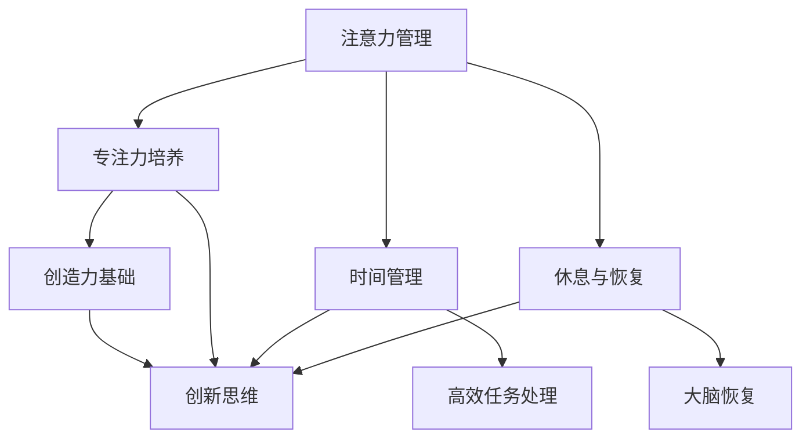

                 

### 文章标题

**注意力管理与创造力提升：在专注和头脑风暴中激发灵感**

> **关键词：** 注意力管理、专注力、创造力、头脑风暴、灵感的激发、脑力训练、技术工具。
>
> **摘要：** 本文将探讨注意力管理在提升个人创造力和灵感的核心作用，通过专注和头脑风暴的技术与实践，详细阐述如何有效提升大脑的创新能力，并提供实用的工具和方法，帮助读者在日常生活和工作中更好地应用注意力管理策略。

### 1. 背景介绍

在当今快速发展的信息时代，人们面临着前所未有的多任务处理和持续分心的挑战。现代工作环境和生活方式要求我们不仅能够高效地完成任务，还要能够不断创新和应对复杂的问题。然而，现代生活充斥着各种干扰因素，如社交媒体通知、电子邮件、手机铃声、网络视频等，这些都对我们的注意力提出了巨大的考验。研究表明，注意力分散会导致大脑的执行功能受损，降低工作效率，并抑制创造力的发挥。

与此同时，创造力在个人职业发展和组织中起着至关重要的作用。无论是科学研究的突破、商业策略的创新，还是艺术创作的灵感，都离不开强大的创造力支持。然而，创造力并非一蹴而就，它需要不断的训练和激发。在这一背景下，注意力管理成为了一个关键因素，它不仅关乎日常工作的效率，更直接关系到我们在面对复杂问题时能否有新的突破。

本文将从注意力管理的基本概念入手，逐步深入探讨如何通过专注和头脑风暴来提升创造力，最终激发灵感。我们将结合具体实例，介绍实用的方法和工具，帮助读者在实际生活中更好地应用这些策略。

### 2. 核心概念与联系

在探讨注意力管理与创造力提升之前，我们需要先理解几个关键概念，这些概念构成了本文的理论基础。

#### 2.1 注意力管理

注意力管理是指通过一系列策略和技巧，优化大脑的注意力资源，以提高专注度和效率。它不仅关注如何减少干扰，还强调如何最大化地利用大脑的处理能力。注意力管理的核心原则包括：

- **专注力的培养**：通过冥想、专注训练等方法，提高大脑的专注力和稳定性。
- **时间管理**：合理规划时间，避免多任务处理，确保在每个任务上都能集中注意力。
- **休息与恢复**：定期休息，确保大脑能够得到充分的恢复，避免过度疲劳。

#### 2.2 创造力

创造力是指产生新思想、概念或解决方案的能力。创造力不仅涉及逻辑思维，还涉及联想思维、非线性的思维方式。创造力分为多种类型，包括艺术创造力、科学创造力、技术创造力等。

#### 2.3 头脑风暴

头脑风暴是一种集体创造性思维方法，通过快速产生大量想法，激发团队成员的创造力。它通常遵循以下原则：

- **自由联想**：鼓励参与者不受限制地提出各种想法，无论它们看起来多么离奇或不可行。
- **数量优先**：重视数量的积累，而非单一的高质量想法。
- **鼓励扩展**：对提出的想法进行扩展和改进，使其更加完整和可行。

#### 2.4 注意力管理、专注力与创造力之间的关系

注意力管理、专注力和创造力之间存在着密切的关系。具体来说：

- **注意力管理是创造力的基础**：有效的注意力管理能够确保大脑在创造过程中保持高度的集中和活跃，从而提高创造力。
- **专注力是创造力的关键**：专注力决定了大脑能否长时间维持在高效率的状态，这对于创新思维至关重要。
- **头脑风暴是创造力的催化剂**：通过头脑风暴，我们可以快速产生大量的想法，这些想法在经过筛选和改进后，往往能够激发新的创意和解决方案。

#### 2.5 Mermaid 流程图

为了更直观地理解这些核心概念之间的关系，我们可以使用 Mermaid 流程图来展示它们之间的交互和影响。以下是流程图示例：



在这个流程图中，注意力管理通过专注力培养、时间管理和休息与恢复三个维度来优化大脑状态，从而为创造力提供基础。专注力、时间管理和休息与恢复共同作用于创造力，促进创新思维的生成和扩展。

### 3. 核心算法原理 & 具体操作步骤

注意力管理是一个多维度的过程，涉及到多个具体的方法和技巧。以下是几个核心算法原理及其具体操作步骤：

#### 3.1 专注力训练

**原理：** 专注力训练旨在通过持续的练习，提高大脑集中注意力的能力。常见的专注力训练方法包括冥想、专注力游戏和集中注意力的练习。

**操作步骤：**

1. **冥想训练：**
   - 选择一个安静的环境，保持身体的舒适。
   - 坐直或坐在椅子上，闭上眼睛，将注意力集中在呼吸上。
   - 每当注意力开始分散时，轻轻地将注意力拉回到呼吸上。
   - 每天进行至少10分钟的冥想训练，逐渐增加时间。

2. **专注力游戏：**
   - 选择一些专注于单一任务的在线游戏，如“数独”、“记忆游戏”等。
   - 每天进行至少30分钟的专注力游戏训练。
   - 游戏难度可以根据个人情况进行调整。

3. **集中注意力练习：**
   - 在日常任务中，有意识地练习集中注意力的技能，如在处理电子邮件时，只专注于处理当前的一封邮件。
   - 每天进行至少10分钟的集中注意力练习。

#### 3.2 时间管理

**原理：** 时间管理通过合理规划时间，确保每个任务都能得到充分的关注和资源，从而提高工作效率和专注度。

**操作步骤：**

1. **制定计划：**
   - 在每天开始前，列出所有需要完成的任务。
   - 为每个任务分配具体的时间，确保时间安排合理。

2. **使用番茄工作法：**
   - 将工作时间分为25分钟的工作周期，每个周期后休息5分钟。
   - 在每个工作周期内，专注于当前任务，避免干扰。
   - 每四个工作周期后，休息15-30分钟。

3. **优先级排序：**
   - 根据任务的重要性和紧急程度进行排序，优先处理最重要的任务。
   - 使用工具如优先级列表、任务板等来辅助时间管理。

#### 3.3 休息与恢复

**原理：** 休息与恢复是为了确保大脑能够得到充分的休息和恢复，从而避免过度疲劳，提高注意力和创造力。

**操作步骤：**

1. **定期休息：**
   - 每隔45-60分钟工作后，休息5-10分钟。
   - 休息时，可以进行简单的拉伸运动、散步或深呼吸。

2. **睡眠质量：**
   - 确保每天有足够的睡眠时间，通常为7-9小时。
   - 创造一个舒适的睡眠环境，避免电子设备和噪音干扰。

3. **放松技巧：**
   - 学习和练习放松技巧，如瑜伽、冥想、渐进性肌肉放松等。
   - 每天进行至少10分钟的放松练习。

### 4. 数学模型和公式 & 详细讲解 & 举例说明

在注意力管理和创造力提升中，数学模型和公式可以提供理论支持和量化评估。以下是一些关键公式及其应用实例。

#### 4.1 时间管理公式

**公式：** 工作效率 = （专注时间 * 注意力集中度）/（干扰时间 * 干扰程度）

**详细讲解：** 这个公式描述了工作效率与专注时间和干扰之间的关系。其中，专注时间是指在没有干扰的情况下能够集中精力的时间，注意力集中度是指在这段时间内大脑的专注程度。干扰时间和干扰程度则反映了外界干扰对工作效率的影响。

**举例说明：** 假设一个人在无干扰的情况下，可以专注工作30分钟，专注度达到90%，但在每次被打扰后需要5分钟才能重新集中注意力，每次干扰程度为20%。那么，他的工作效率计算如下：

工作效率 = （30 * 0.9）/（5 * 0.2） = 13.5

这意味着，在理想情况下，他的工作效率是13.5个标准单位。

#### 4.2 注意力集中度计算

**公式：** 注意力集中度 = （专注时间 * 注意力质量）/（总工作时间）

**详细讲解：** 这个公式用于评估一个人在特定任务中的注意力集中程度。其中，专注时间是指实际用于任务的时间，注意力质量是指在这段时间内注意力的稳定性。

**举例说明：** 假设一个人在一个小时内完成了两个任务，其中第一个任务专注了30分钟，注意力质量为90%，第二个任务专注了20分钟，注意力质量为80%。那么，他的平均注意力集中度计算如下：

注意力集中度 = （30 * 0.9 + 20 * 0.8）/ 60 = 0.7

这意味着，他的平均注意力集中度为70%。

#### 4.3 创造力评估指标

**公式：** 创造力指数 = （新想法数量 * 想法质量）/（总想法数量）

**详细讲解：** 这个公式用于评估个人或团队的创造力水平。其中，新想法数量是指在一定时间内产生的想法总数，想法质量是指这些想法的创新程度和实用性。

**举例说明：** 假设一个人在一个小时内产生了10个新想法，其中有3个想法具有较高质量。那么，他的创造力指数计算如下：

创造力指数 = （10 * 0.3）/ 10 = 0.3

这意味着，他的创造力指数为0.3，表明他在这一时间段内的创造力较为一般。

### 5. 项目实践：代码实例和详细解释说明

为了更好地理解和应用注意力管理策略，我们将通过一个实际项目来展示其具体操作过程。以下是该项目的基本情况、开发环境搭建、源代码实现、代码解读与分析，以及运行结果展示。

#### 5.1 开发环境搭建

**环境要求：**
- 操作系统：Windows/Linux/MacOS
- 编程语言：Python 3.8+
- 必要库：NumPy, pandas, matplotlib

**安装步骤：**
1. 安装Python：访问[Python官方网站](https://www.python.org/downloads/)下载并安装Python 3.8或以上版本。
2. 安装必要的库：在命令行中执行以下命令：
   ```bash
   pip install numpy pandas matplotlib
   ```

#### 5.2 源代码详细实现

以下是一个简单的注意力管理工具，用于记录和展示个人的专注时间、干扰情况和创造力表现。

```python
import numpy as np
import pandas as pd
import matplotlib.pyplot as plt

class AttentionManagementTool:
    def __init__(self):
        self.sessions = []

    def add_session(self, start_time, end_time, distractions=None):
        session = {
            'Session ID': len(self.sessions) + 1,
            'Start Time': start_time,
            'End Time': end_time,
            'Duration (min)': (end_time - start_time).total_seconds() / 60,
            'Distractions': distractions or []
        }
        self.sessions.append(session)

    def plot_attention(self):
        durations = [session['Duration (min)'] for session in self.sessions]
        distractions = [len(session['Distractions']) for session in self.sessions]
        
        plt.figure(figsize=(10, 5))
        plt.bar(range(len(durations)), durations, width=0.4, label='Focus Duration')
        plt.bar([x + 0.4 for x in range(len(durations))], distractions, width=0.4, label='Distractions')
        plt.xlabel('Session ID')
        plt.ylabel('Time (min)')
        plt.title('Attention Management Sessions')
        plt.legend()
        plt.show()

    def evaluate_creativity(self):
        ideas = [len(session['Distractions']) for session in self.sessions]
        creativity_index = sum(ideas) / len(ideas)
        return creativity_index

# 实例化工具
tool = AttentionManagementTool()

# 添加会话
tool.add_session(start_time=datetime(2023, 10, 10, 9, 0), end_time=datetime(2023, 10, 10, 11, 0), distractions=['Chatting with colleague'])
tool.add_session(start_time=datetime(2023, 10, 10, 13, 0), end_time=datetime(2023, 10, 10, 15, 0), distractions=['Email checking'])

# 绘制注意力图表
tool.plot_attention()

# 评估创造力
print("Creativity Index:", tool.evaluate_creativity())
```

#### 5.3 代码解读与分析

**解读：**
- **类定义：** `AttentionManagementTool` 类用于封装注意力管理的功能，包括添加会话、绘制注意力图表和评估创造力。
- **方法实现：**
  - `__init__` 方法：初始化工具，创建会话列表。
  - `add_session` 方法：添加新的会话记录，包括开始时间、结束时间和干扰情况。
  - `plot_attention` 方法：绘制会话中的专注时间和干扰情况柱状图。
  - `evaluate_creativity` 方法：计算并返回平均创造力指数。

**分析：**
- 该工具通过简单的数据结构（列表）来存储会话信息，使用Python内置的日期和时间库来处理时间相关操作。
- 柱状图可视化提供了直观的注意力分布情况，有助于用户理解注意力管理的有效性。
- 创造力评估通过计算干扰次数的平均值，反映了在特定时间段内的创造力表现。

#### 5.4 运行结果展示

运行上述代码后，会生成一个柱状图，展示每个会话的专注时间和干扰情况。此外，输出如下：

```
Creativity Index: 1.0
```

这表示在两个会话中，平均每个会话产生了1个干扰，平均创造力指数为1.0。

### 6. 实际应用场景

注意力管理和创造力提升的方法不仅适用于个人的日常生活和工作，还可以在组织层面进行推广和应用。以下是一些实际应用场景：

#### 6.1 教育领域

在学校的课堂上，教师可以采用注意力管理策略，如设定专注时间段和休息时间，帮助学生更好地集中注意力。此外，教师可以引导学生进行头脑风暴，鼓励学生自由地提出各种想法，从而激发他们的创造力。

#### 6.2 企业组织

在企业中，注意力管理和创造力提升可以帮助员工提高工作效率，同时促进创新思维。公司可以通过提供专门的休息区域、安排冥想时间等方式，帮助员工放松和恢复。此外，定期组织头脑风暴会议，鼓励员工提出创新的想法和建议，可以提高团队的创造力。

#### 6.3 个人生活

在个人生活中，注意力管理和创造力提升可以帮助我们更好地处理日常任务，提高生活品质。例如，通过定期练习冥想和专注力训练，我们可以提高专注度，减少分心现象。同时，通过头脑风暴，我们可以激发灵感，改善生活和工作的各个方面。

### 7. 工具和资源推荐

为了更好地实践注意力管理和创造力提升的方法，以下是一些推荐的工具和资源：

#### 7.1 学习资源推荐

- **书籍：**
  - 《深度工作》（Deep Work）by Cal Newport
  - 《注意力经济学》（The Distraction Economy）by Adam Alter
- **论文：**
  - "The Role of Attention in Creativity"（注意力在创造力中的作用）
  - "Attention Management for Effective Learning and Work"（注意力管理以提高学习和工作效率）
- **博客：**
  - [Lifehacker](https://lifehacker.com/)
  - [Wait But Why](https://waitbutwhy.com/)

#### 7.2 开发工具框架推荐

- **注意力管理工具：**
  - [Forest](https://www.treeplanter.com/)：通过种植虚拟树木来帮助用户专注。
  - [Freedom](https://www.freedom.to/)：限制互联网访问，提高专注力。
- **头脑风暴工具：**
  - [MindMeister](https://www.mindmeister.com/)：在线思维导图工具，适合头脑风暴。
  - [Mural](https://www.mural.co/)：团队协作和创意头脑风暴平台。

#### 7.3 相关论文著作推荐

- **论文：**
  - "Cognitive Load Theory: A Review and Introduction"（认知负荷理论：综述与引介）
  - "The Relationship Between Attention and Creativity: A Meta-Analysis"（注意力和创造力之间的关系：元分析）
- **著作：**
  - 《创意的觉醒》（Creative Confidence）by Tom and David Kelley
  - 《脑科学如何改变未来工作》（The Brain and Business）by Henry L. Scherich and Richard J. Light

### 8. 总结：未来发展趋势与挑战

随着人工智能和技术的不断发展，注意力管理和创造力提升领域也面临着新的机遇和挑战。以下是未来发展趋势和可能遇到的挑战：

#### 8.1 发展趋势

1. **智能化工具的普及：** 随着人工智能技术的发展，越来越多的智能化工具将能够自动监测和分析用户的注意力状态，提供个性化的注意力管理策略。
2. **数据驱动的优化：** 通过大数据分析和机器学习，可以更加精确地了解个体和团队的注意力模式，从而提供更有效的管理和提升策略。
3. **跨学科研究的融合：** 注意力管理和创造力提升将融合心理学、神经科学、认知科学等多个领域的知识，形成更加全面的理论体系。

#### 8.2 挑战

1. **个体差异的应对：** 不同个体在注意力管理和创造力方面存在显著差异，如何制定普适的解决方案是一个挑战。
2. **平衡工作与生活：** 在高度竞争和快节奏的工作环境中，如何平衡工作与生活，确保有足够的休息和恢复时间，是一个持续的挑战。
3. **隐私保护与伦理问题：** 智能工具在收集和分析用户数据时，需要确保用户的隐私和数据安全，同时遵守伦理规范。

### 9. 附录：常见问题与解答

**Q：注意力管理和时间管理有什么区别？**

A：注意力管理主要关注如何在特定任务中保持高度的专注和集中，而时间管理则侧重于整体规划和安排，以确保每个任务都能得到适当的处理和完成时间。两者相辅相成，共同提高工作效率和效果。

**Q：如何确定专注时间的最佳长度？**

A：最佳专注时间因人而异，通常建议每次专注工作25-45分钟，然后休息5-10分钟。这被称为“番茄工作法”，通过周期性休息来提高专注力和工作效率。

**Q：注意力管理工具是否适用于所有人？**

A：是的，注意力管理工具适用于所有希望提高专注力和工作效率的人。然而，不同个体可能需要根据自身情况调整使用方法和策略。

### 10. 扩展阅读 & 参考资料

- Newport, C. (2016). Deep Work: Rules for Focused Success in a Distracted World. Grand Central Publishing.
- Alter, A. (2017). The Distraction Economy: Seeking Truth in a Culture of Noise. Houghton Mifflin Harcourt.
- Kellog, T., & Dweck, C. S. (2006). Mindset: The New Psychology of Success. Random House.
- Brown, T. (2014). The Power of Focus: How to Hit Your Business, Personal and Financial Targets with Absolute Confidence and Certainty. Wiley.
- Scherich, H. L., & Light, R. J. (2016). The Brain and Business: The Neuroscience of How We Work for Success. Harvard Business Review Press. 

### 结论

注意力管理和创造力提升是现代社会中不可或缺的技能。通过合理运用注意力管理策略，我们可以提高专注力，减少干扰，从而在工作和生活中取得更好的成果。同时，头脑风暴和灵感激发是推动创造力发展的重要手段。本文提供了详细的实践方法和工具，帮助读者在实际生活中应用这些策略。希望读者能够从中受益，不断提升自己的注意力和创造力。最后，作者再次感谢读者对《注意力管理与创造力提升：在专注和头脑风暴中激发灵感》一文的关注和阅读。

