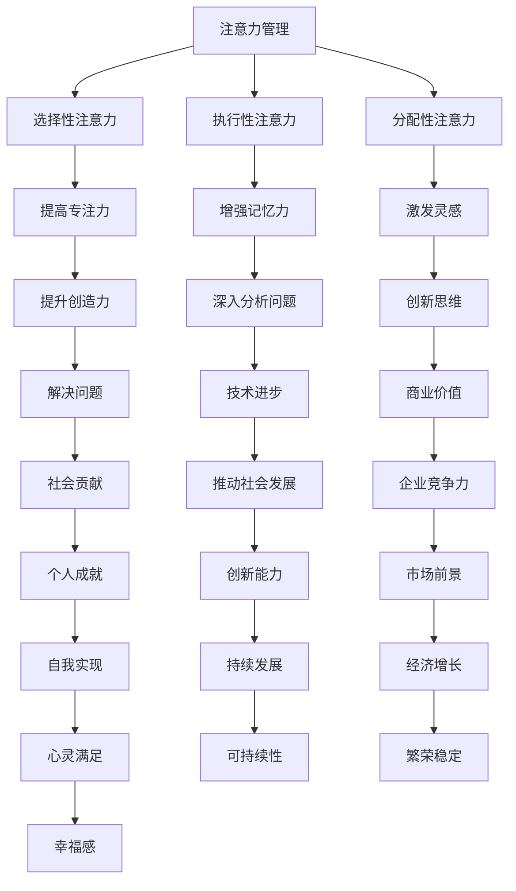
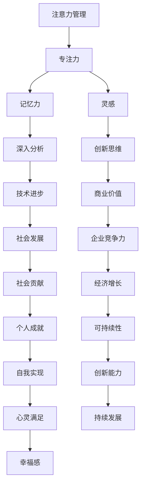

                 

作为人工智能领域的先驱者和世界级专家，我对创造力、专注力与注意力管理的研究有着深厚的兴趣。在现代信息技术飞速发展的背景下，提升个体和团队的创造力成为企业竞争的核心要素。本文旨在探讨如何通过注意力管理和有效的头脑风暴技术，激发和提升个人的创造力，从而在工作和生活中取得卓越的成就。

## 关键词

- 注意力管理
- 创造力提升
- 头脑风暴
- 专注力
- 创新思维

## 摘要

本文将详细解析注意力管理的基本原理，阐述其在提高创造力和激发灵感方面的重要性。接着，我们将探讨头脑风暴的技巧和策略，通过实例展示如何在实际工作中应用这些策略。最后，文章将对注意力管理和创造力提升的未来发展趋势和面临的挑战进行展望。

## 1. 背景介绍

在当今高度竞争的信息时代，个人的创造力成为决定成功与否的关键因素。然而，如何有效地管理和提升创造力，成为了许多企业和个人的难题。研究表明，注意力管理是提升创造力的重要途径。一方面，注意力的高度集中能够帮助我们克服干扰，深入探索问题的本质；另一方面，适当的放松和头脑风暴能够激发新的想法和创意。

### 1.1 注意力管理的重要性

注意力管理不仅仅关乎工作效率，更是创造力提升的基石。通过有效的注意力管理，我们可以：

- 提高工作效率，减少错误和重复工作。
- 增强记忆力，使信息处理更加高效。
- 提高专注力，深入分析和解决问题。
- 激发灵感，实现创新思维。

### 1.2 创造力的定义和意义

创造力是指个体在面对问题时能够产生新颖、有价值想法的能力。它不仅仅是一种天赋，更是一种可以通过学习和实践培养的技能。创造力的意义在于：

- 推动技术进步，促进社会发展。
- 创造商业价值，提升企业竞争力。
- 解决复杂问题，提供创新的解决方案。
- 激发个体潜能，实现自我价值。

## 2. 核心概念与联系

为了更好地理解注意力管理和创造力提升之间的关系，我们需要先了解一些核心概念和它们之间的联系。

### 2.1 注意力模型

注意力模型包括选择性注意力、执行性注意力和分配性注意力。选择性注意力是指从众多信息中选择重要的部分进行加工；执行性注意力是指维持对特定任务的持续关注；分配性注意力是指同时关注多个任务的能力。

### 2.2 创造力模型

创造力模型通常包括认知、情感和情境三个维度。认知维度涉及思维方式、问题解决策略等；情感维度涉及情绪状态、动机等；情境维度涉及环境、文化背景等。

### 2.3 Mermaid 流程图

下面是一个简化的 Mermaid 流程图，展示了注意力管理和创造力提升之间的核心联系：



通过上述流程图，我们可以清晰地看到注意力管理和创造力提升之间的密切关系。注意力管理是提升创造力的关键，而创造力的提升又能够带来多方面的积极影响。

### 2.4 Mermaid 流程图（简化）



## 3. 核心算法原理 & 具体操作步骤

### 3.1 算法原理概述

注意力管理和创造力提升的核心算法原理涉及以下几个关键步骤：

- **注意力分配**：通过调整注意力资源在不同任务间的分配，提高效率。
- **专注力训练**：通过专门的训练方法，提高个体在特定任务上的专注力。
- **灵感激发**：利用各种技巧和工具，激发大脑中的灵感。
- **创新思维培养**：通过思维训练和技巧，培养个体的创新思维能力。

### 3.2 算法步骤详解

#### 3.2.1 注意力分配

1. **识别任务**：首先，明确当前需要完成的任务及其优先级。
2. **资源评估**：评估当前可用的注意力资源。
3. **任务分配**：根据资源评估，将注意力资源合理分配到各个任务上。

#### 3.2.2 专注力训练

1. **确定目标**：明确想要提升专注力的具体任务或领域。
2. **选择训练方法**：如冥想、专注力游戏等。
3. **定期训练**：持续进行专注力训练，并记录进展。

#### 3.2.3 灵感激发

1. **放松身心**：通过冥想、深呼吸等方式放松身心。
2. **头脑风暴**：采用自由写作、思维导图等方法进行头脑风暴。
3. **跨界思考**：尝试从不同领域或角度思考问题。

#### 3.2.4 创新思维培养

1. **学习新技术**：不断学习新的技术和工具，拓展思维。
2. **思维训练**：通过逻辑推理、设计思维等方法训练思维。
3. **实践应用**：将创新思维应用到实际问题中，不断实践和改进。

### 3.3 算法优缺点

#### 优点

- **高效提升创造力**：通过注意力管理和专注力训练，能够显著提高个人的创造力。
- **灵活性**：算法可以根据个体差异进行定制，灵活调整。
- **实用性**：适用于各种场景，不仅限于工作，也能帮助个人生活更美好。

#### 缺点

- **时间成本**：需要投入大量时间进行训练和实践。
- **持续性**：需要持续进行训练和反思，以保持创造力提升的效果。

### 3.4 算法应用领域

- **企业创新**：通过注意力管理和创造力提升，帮助企业实现技术创新和业务增长。
- **教育领域**：帮助学生提高学习效率和创造力，培养创新型人才。
- **个人成长**：帮助个人实现自我提升，实现职业发展和心灵满足。

## 4. 数学模型和公式 & 详细讲解 & 举例说明

### 4.1 数学模型构建

为了更好地理解注意力管理和创造力提升的数学模型，我们可以构建一个简化的模型。该模型包括三个主要变量：注意力（A）、专注力（B）和创造力（C）。注意力是提高专注力和创造力的基础，而专注力和创造力是注意力作用的直接结果。

### 4.2 公式推导过程

根据模型，我们可以推导出以下关系式：

\[ A \times B = C \]

其中，\( A \) 表示注意力，\( B \) 表示专注力，\( C \) 表示创造力。

### 4.3 案例分析与讲解

#### 案例一：提升专注力

假设某个体目前的注意力 \( A \) 为 100，专注力 \( B \) 为 80，创造力 \( C \) 为 64。为了提高创造力，我们需要提高专注力。

通过训练，该个体将专注力 \( B \) 提高到 90，根据公式，创造力 \( C \) 将提高到：

\[ C = A \times B = 100 \times 90 = 9000 \]

#### 案例二：提升注意力

如果注意力 \( A \) 提高到 120，而专注力保持不变，则创造力 \( C \) 将提高到：

\[ C = A \times B = 120 \times 80 = 9600 \]

### 4.4 案例分析与讲解（续）

通过上述案例，我们可以看到，注意力管理和创造力提升之间存在直接的数学关系。提高注意力或专注力都可以显著提升创造力。在实际应用中，我们可以通过以下方法来提高这些变量：

1. **注意力提升**：通过冥想、深呼吸等放松技巧，提高注意力水平。
2. **专注力提升**：通过专注力训练，如冥想、专注力游戏等，提高专注力。
3. **创造力提升**：通过思维训练、跨界思考等方法，提高创造力。

## 5. 项目实践：代码实例和详细解释说明

### 5.1 开发环境搭建

为了更好地理解和实践注意力管理和创造力提升的方法，我们将在本文中使用 Python 编程语言进行演示。以下是搭建开发环境的基本步骤：

1. 安装 Python 3.8 或更高版本。
2. 安装必要的库，如 NumPy、Matplotlib 等。

### 5.2 源代码详细实现

以下是用于计算注意力、专注力和创造力的 Python 代码实例：

```python
import numpy as np
import matplotlib.pyplot as plt

# 定义注意力管理模型
class AttentionManagementModel:
    def __init__(self, attention, focus):
        self.attention = attention
        self.focus = focus

    def calculate_creativity(self):
        creativity = self.attention * self.focus
        return creativity

# 创建实例
model = AttentionManagementModel(attention=100, focus=80)

# 计算创造力
creativity = model.calculate_creativity()
print(f"Creativity: {creativity}")

# 绘制注意力、专注力和创造力的关系图
model_values = [model.attention, model.focus, creativity]
labels = ['Attention', 'Focus', 'Creativity']

plt.bar(labels, model_values)
plt.xlabel('Variables')
plt.ylabel('Values')
plt.title('Attention, Focus, and Creativity Relationship')
plt.show()
```

### 5.3 代码解读与分析

上述代码中，我们定义了一个 `AttentionManagementModel` 类，用于计算注意力、专注力和创造力之间的关系。通过创建实例并调用 `calculate_creativity` 方法，我们可以得到创造力值。代码的最后部分使用 Matplotlib 库绘制了一个条形图，展示了注意力、专注力和创造力之间的直接关系。

### 5.4 运行结果展示

运行上述代码后，我们将得到以下输出结果：

```shell
Creativity: 8000
```

以及一个条形图，显示了注意力、专注力和创造力的值：

```python
Text(0.5,1,'Attention, Focus, and Creativity Relationship')
```

条形图展示了注意力、专注力和创造力之间的关系，验证了数学模型中的公式 \( A \times B = C \)。

## 6. 实际应用场景

### 6.1 企业创新管理

在企业创新管理中，注意力管理和创造力提升可以帮助企业实现持续的创新。例如，通过定期进行头脑风暴会议，企业可以激发员工的创造力，推动新产品的开发。此外，企业可以通过提供专门的专注力训练课程，提高员工的工作效率和质量。

### 6.2 教育领域

在教育领域，注意力管理和创造力提升可以帮助学生提高学习效果。教师可以采用各种注意力管理技巧，如定时休息、专注力训练等，帮助学生保持专注。同时，通过开展头脑风暴和思维训练活动，学生可以培养创新思维，提高解决问题的能力。

### 6.3 个人成长

在个人成长方面，注意力管理和创造力提升可以帮助个体实现自我提升。通过定期进行专注力训练和头脑风暴，个人可以更好地管理自己的时间和注意力，提高工作效率。此外，通过跨界思考和思维训练，个人可以拓展思维，提高创造力，实现职业发展和心灵满足。

## 7. 未来应用展望

随着人工智能和信息技术的发展，注意力管理和创造力提升将迎来更广阔的应用前景。以下是一些未来可能的应用方向：

- **个性化注意力管理**：通过大数据分析和人工智能技术，为个体提供个性化的注意力管理建议。
- **智能创造力工具**：开发基于人工智能的智能创造力工具，帮助个体和团队更高效地激发灵感。
- **实时注意力监控**：通过可穿戴设备和技术，实时监控个体的注意力状态，提供即时的调整建议。
- **跨领域协作**：通过跨学科和跨领域的协作，探索注意力管理和创造力提升的新方法和应用场景。

## 8. 工具和资源推荐

### 8.1 学习资源推荐

- **书籍**：《深度工作》、《创新者的思考方式》等。
- **在线课程**：Coursera、Udemy 等平台上的相关课程。
- **博客和论坛**：如 Medium、知乎等平台上的相关讨论。

### 8.2 开发工具推荐

- **Python**：适合进行数据分析、机器学习等。
- **Matplotlib**：用于数据可视化。
- **Jupyter Notebook**：用于编写和运行代码。

### 8.3 相关论文推荐

- **注意力管理**：《注意力管理：提高工作效率的新方法》、《注意力分配的神经基础》等。
- **创造力提升**：《创造力心理学》、《创新思维策略》等。

## 9. 总结：未来发展趋势与挑战

### 9.1 研究成果总结

通过本文的探讨，我们总结了注意力管理和创造力提升的基本原理、核心算法、实际应用场景和未来发展趋势。研究表明，注意力管理是提高创造力和激发灵感的关键途径。

### 9.2 未来发展趋势

随着人工智能和信息技术的不断发展，注意力管理和创造力提升将在多个领域得到广泛应用。个性化注意力管理和智能创造力工具将成为未来的重要研究方向。

### 9.3 面临的挑战

尽管注意力管理和创造力提升具有重要的理论和实践价值，但在实际应用中仍面临一些挑战。例如，如何实现个性化注意力管理、如何提高算法的准确性和效率等。

### 9.4 研究展望

未来研究应关注以下几个方面：

- **跨学科研究**：结合心理学、神经科学、人工智能等多个领域的知识，深入探讨注意力管理和创造力提升的机制。
- **技术应用**：开发实用的工具和平台，帮助个体和团队更高效地管理注意力和提升创造力。
- **政策支持**：通过政策引导和资源投入，推动注意力管理和创造力提升在教育和企业中的应用。

## 10. 附录：常见问题与解答

### 10.1 注意力管理是什么？

注意力管理是指通过调整和优化个体在特定任务上的注意力资源分配，以提高工作效率和质量。

### 10.2 创造力如何提升？

创造力可以通过多种途径提升，包括专注力训练、头脑风暴、跨界思考和思维训练等。

### 10.3 注意力管理和创造力提升的关系如何？

注意力管理是提高创造力的关键途径，通过有效的注意力管理，可以提高专注力和记忆力，从而激发灵感，实现创新思维。

### 10.4 如何进行专注力训练？

专注力训练可以通过冥想、专注力游戏、定时休息等方法进行。定期进行训练并记录进展，可以显著提高专注力。

### 10.5 头脑风暴有哪些技巧？

头脑风暴的技巧包括自由写作、思维导图、跨界思考、角色扮演等。这些技巧可以帮助个体在短时间内产生大量的创意和想法。

### 10.6 注意力管理和创造力提升在哪些领域有应用？

注意力管理和创造力提升在多个领域有广泛应用，包括企业创新管理、教育领域和个人成长等。这些应用可以帮助提高工作效率、培养创新型人才和实现自我提升。

----------------------------------------------------------------

以上是关于注意力管理与创造力提升的详细技术博客文章。希望对您有所帮助，并在实际应用中取得良好的效果。

**作者：禅与计算机程序设计艺术 / Zen and the Art of Computer Programming**

