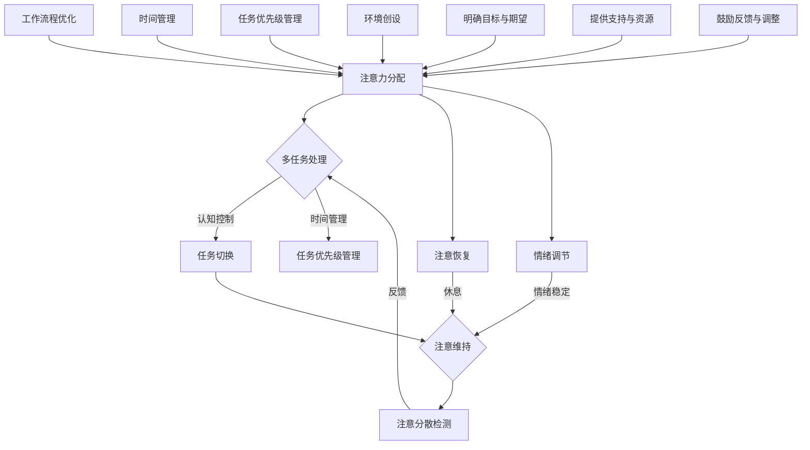

                 

### 1. 背景介绍

在当今快节奏、高效率的办公环境中，提升工作效率已成为企业和个人共同追求的目标。随着信息技术的飞速发展，人们面临着海量的信息和任务，如何有效地管理和利用时间，确保在有限的工作时间内最大限度地提升生产力，成为了亟需解决的问题。

注意力管理是提升工作效率的重要环节。注意力是指个体对特定刺激的选择性关注，它在信息处理、决策制定和任务执行中起着关键作用。然而，在现代社会，人们常常面临多种刺激的干扰，导致注意力分散，从而影响工作效率。因此，如何通过有效的注意力管理策略来提高工作效率，成为了本文探讨的核心议题。

注意力管理不仅关乎个体，更与企业文化的构建和团队协作紧密相关。在一个注重注意力管理的组织中，成员能够更好地集中精力，协同完成任务，提高整体工作效率。因此，本文还将从企业管理的角度，探讨如何构建有利于注意力管理的办公环境。

本文旨在通过深入分析注意力管理的基本原理、具体策略和实际应用，为广大读者提供一套科学、实用的提升工作效率的方法。通过阅读本文，读者可以了解如何利用注意力管理来提高个人和团队的工作效率，从而在激烈的职场竞争中脱颖而出。

### 2. 核心概念与联系

#### 2.1 注意力管理的基本概念

注意力管理是指通过一系列策略和方法，帮助个体在任务执行过程中保持高度的专注和集中，从而提高工作效率。它涵盖了注意力分配、注意力维持、注意力恢复等多个方面。

- **注意力分配**：指个体在不同任务或活动之间合理分配注意力资源，确保关键任务得到充分关注。

- **注意力维持**：指在任务执行过程中，保持注意力的持久性和稳定性，防止注意力分散。

- **注意力恢复**：指在任务间隙或疲劳时，通过适当的休息和放松活动，恢复注意力的功能。

#### 2.2 注意力管理与工作效率的关系

注意力管理对工作效率有着直接且深远的影响。以下是注意力管理如何提高工作效率的几个关键方面：

- **提高任务专注度**：通过注意力管理，个体能够更好地集中精力，专注于任务的核心部分，减少无关信息的干扰，从而提高任务完成质量。

- **减少错误和返工**：集中注意力能够减少因注意力分散导致的错误和返工，提高工作效率。

- **提升决策效率**：在注意力集中的状态下，个体能够更快地分析和处理信息，做出更明智的决策。

- **增强创新能力**：注意力管理有助于个体在任务执行中保持创新思维，发现新的解决方案，提高工作效率。

#### 2.3 注意力管理的架构与原理

为了深入理解注意力管理，我们需要探讨其背后的原理和架构。以下是注意力管理的基本原理和架构：

- **认知资源理论**：认知资源理论认为，注意力是有限的认知资源，个体在任务执行过程中需要合理分配这些资源，确保关键任务得到优先处理。

- **多任务处理机制**：在多任务环境中，个体需要通过切换注意力，在不同任务间进行切换和处理。这一过程涉及认知控制、任务切换和时间管理等多个方面。

- **情绪调节**：情绪状态对注意力管理有着重要影响。通过情绪调节，个体能够更好地控制情绪波动，保持注意力集中。

#### 2.4 注意力管理在实际工作中的应用

在实际工作中，注意力管理可以通过以下几种方式得到应用：

- **工作流程优化**：通过优化工作流程，减少任务切换次数，降低注意力分散的可能性。

- **时间管理**：合理规划工作时间，确保关键任务在注意力最佳时期完成。

- **任务优先级管理**：根据任务的重要性和紧急程度，合理分配注意力资源，确保重要任务得到优先处理。

- **环境创设**：创建有利于注意力集中的工作环境，减少外部干扰，提高工作效率。

#### 2.5 注意力管理与组织文化

一个注重注意力管理的组织文化能够为成员提供良好的工作氛围，促进注意力管理策略的实施。以下是注意力管理与组织文化的几个关键联系：

- **明确目标和期望**：组织通过明确的目标和期望，帮助成员集中注意力，提高工作动力。

- **提供支持和资源**：组织为成员提供必要的支持和资源，如培训、工具和环境，帮助他们更好地进行注意力管理。

- **鼓励反馈与调整**：组织鼓励成员反馈注意力管理的效果，并根据反馈进行适时调整，以优化工作流程和策略。

通过以上对注意力管理核心概念与联系的探讨，我们可以看到，注意力管理不仅是提升个人工作效率的关键，也是构建高效团队和优化组织文化的重要手段。在接下来的章节中，我们将进一步探讨注意力管理的具体策略和实际应用。

#### 2.6 Mermaid 流程图

以下是一个简化的注意力管理架构与原理的Mermaid流程图，展示了注意力管理的不同方面及其相互关系。



在这个流程图中，我们首先明确了注意力管理的基本概念和原理，然后展示了其在实际工作中的具体应用，以及如何与组织文化相结合。通过这个流程图，我们可以更直观地理解注意力管理的整体架构和工作原理。

### 3. 核心算法原理 & 具体操作步骤

#### 3.1 核心算法原理

注意力管理的核心算法主要基于认知心理学和认知神经科学的研究成果。以下介绍几种常见的注意力管理算法原理：

- **认知资源理论（Cognitive Resource Theory）**：该理论认为，注意力是一种有限的认知资源，个体在执行任务时需要合理分配这些资源。基于该理论，注意力管理算法旨在优化任务间的资源分配，确保关键任务得到优先处理。

- **多任务处理模型（Multi-Task Processing Model）**：多任务处理模型描述了个体如何在不同的任务间切换注意力。该模型包括任务切换（Task Switching）、任务保持（Task Maintenance）和任务恢复（Task Recovery）等关键步骤。基于该模型，注意力管理算法旨在减少任务切换的次数和成本，提高任务执行的效率。

- **情绪调节理论（Affective Regulation Theory）**：情绪状态对注意力管理有着重要影响。情绪调节理论提出，个体需要通过情绪调节策略来控制情绪波动，保持注意力集中。基于该理论，注意力管理算法旨在通过情绪调节来优化注意力的稳定性。

- **注意力恢复模型（Attentional Recovery Model）**：该模型认为，在长时间的高强度任务后，个体需要通过适当的休息和放松活动来恢复注意力。基于该模型，注意力管理算法旨在设计有效的休息和放松策略，帮助个体快速恢复注意力。

#### 3.2 具体操作步骤

以下是注意力管理的一些具体操作步骤，帮助个体在实际工作中更好地应用注意力管理算法：

**步骤 1：任务评估**

- **任务重要性评估**：根据任务的重要性和紧急程度，对任务进行初步分类。高重要性、高紧急性的任务应优先处理。

- **任务难度评估**：评估任务的复杂性和难度，以确定需要多少注意力和时间来完成。

**步骤 2：资源分配**

- **注意力资源分配**：根据任务评估结果，合理分配注意力资源。优先分配给高重要性、高紧急性的任务。

- **时间资源分配**：合理安排工作计划，确保关键任务在注意力最佳时期完成。

**步骤 3：任务执行**

- **任务切换**：在执行多任务时，遵循任务切换原则，减少不必要的任务切换。

- **任务保持**：在任务执行过程中，保持注意力的稳定性和持续性，防止注意力分散。

- **任务恢复**：在长时间高强度任务后，进行适当的休息和放松，以恢复注意力。

**步骤 4：情绪调节**

- **情绪监测**：定期监测自己的情绪状态，及时发现并处理情绪波动。

- **情绪调节策略**：通过深呼吸、冥想、运动等方式进行情绪调节，保持情绪稳定。

**步骤 5：反馈与调整**

- **反馈收集**：在任务完成后，收集工作反馈，评估注意力管理的有效性。

- **策略调整**：根据反馈结果，适时调整注意力管理策略，优化工作流程和资源分配。

#### 3.3 注意力管理工具

为了更好地实施注意力管理算法，可以使用一些专业的工具和方法。以下是一些常用的注意力管理工具：

- **专注力跟踪工具**：如番茄工作法（Pomodoro Technique）、专注力计（Focus Timer）等，帮助个体分配注意力资源和进行任务切换。

- **时间管理工具**：如甘特图（Gantt Chart）、时间追踪器（Time Doctor）等，帮助个体合理安排时间，优化工作计划。

- **情绪监测工具**：如情绪日记（Mood Journal）、情绪追踪器（Mood Tracker）等，帮助个体监测和调节情绪状态。

- **休息与放松工具**：如冥想应用（Headspace、Calm）、健身应用（Nike Training Club、Fitbit）等，帮助个体在任务间隙进行休息和放松。

通过以上核心算法原理和具体操作步骤的介绍，我们可以看到，注意力管理不仅仅是一种理论，更是一套切实可行的实践方法。在接下来的章节中，我们将结合实际项目，进一步探讨如何具体应用这些算法和策略，以提高工作效率。

### 4. 数学模型和公式 & 详细讲解 & 举例说明

#### 4.1 数学模型介绍

注意力管理的数学模型通常基于认知心理学和优化理论，旨在通过数学方法分析和优化注意力的分配和利用。以下是几种常见的数学模型：

**1. 认知资源分配模型（CRAM）**

认知资源分配模型是一个基于线性规划的方法，用于优化任务间的认知资源分配。其基本公式如下：

\[ \text{minimize} \sum_{i=1}^{n} w_i \cdot d_i \]

其中，\( w_i \) 是任务 \( i \) 的权重，表示其重要性和紧急程度；\( d_i \) 是任务 \( i \) 需要的注意力持续时间。

**2. 动力系统模型（DSM）**

动力系统模型是一个基于微分方程的方法，用于描述个体在不同任务间切换注意力的动态过程。其基本方程如下：

\[ \frac{dA_i}{dt} = f_i(A_1, A_2, ..., A_n) \]

其中，\( A_i \) 表示任务 \( i \) 的注意力分配，\( f_i \) 是一个关于其他任务注意力分配的函数，描述了任务间的相互作用。

**3. 情绪调节模型（ARM）**

情绪调节模型是一个基于非线性规划的方法，用于优化任务执行过程中的情绪调节策略。其基本公式如下：

\[ \text{minimize} \sum_{i=1}^{n} e_i \]

其中，\( e_i \) 是任务 \( i \) 的情绪耗散，表示执行任务 \( i \) 时的情绪压力。

#### 4.2 公式详细讲解

**1. 认知资源分配模型（CRAM）**

认知资源分配模型旨在通过优化任务间的资源分配，最小化总任务持续时间。为了详细讲解该模型，我们可以考虑一个具体的例子。

**例子**：假设有3个任务 \( T_1 \), \( T_2 \), 和 \( T_3 \)，其权重分别为 \( w_1 = 3 \), \( w_2 = 2 \), \( w_3 = 1 \)，所需注意力持续时间分别为 \( d_1 = 4 \), \( d_2 = 2 \), \( d_3 = 6 \)。

我们希望找到最优的注意力分配方案，使得总任务持续时间最短。

根据认知资源分配模型，我们可以建立以下线性规划问题：

\[ \text{minimize} \sum_{i=1}^{3} w_i \cdot d_i \]

\[ s.t. \]

\[ A_1 \cdot d_1 + A_2 \cdot d_2 + A_3 \cdot d_3 = 1 \]

其中，\( A_1 \), \( A_2 \), \( A_3 \) 分别表示任务 \( T_1 \), \( T_2 \), \( T_3 \) 的注意力分配比例。

通过求解这个线性规划问题，我们可以得到最优的注意力分配方案，从而最小化总任务持续时间。

**2. 动力系统模型（DSM）**

动力系统模型描述了个体在不同任务间切换注意力的动态过程。为了详细讲解该模型，我们可以考虑一个简单的例子。

**例子**：假设有两个任务 \( T_1 \) 和 \( T_2 \)，其注意力分配分别为 \( A_1 \) 和 \( A_2 \)，切换时间分别为 \( t_1 \) 和 \( t_2 \)。我们希望找到最优的切换策略，使得总任务持续时间最短。

根据动力系统模型，我们可以建立以下微分方程：

\[ \frac{dA_1}{dt} = f_1(A_1, A_2) \]

\[ \frac{dA_2}{dt} = f_2(A_1, A_2) \]

其中，\( f_1 \) 和 \( f_2 \) 是关于注意力分配的函数，描述了任务间的相互作用。

为了求解这个问题，我们需要进一步确定 \( f_1 \) 和 \( f_2 \) 的具体形式。例如，我们可以假设 \( f_1 = -A_1 + A_2 \)，\( f_2 = A_1 - A_2 \)。这意味着，当 \( A_1 > A_2 \) 时，\( T_1 \) 的注意力会逐渐减少，而 \( T_2 \) 的注意力会逐渐增加；反之亦然。

通过求解这个微分方程组，我们可以得到注意力分配的动态过程，从而找到最优的切换策略。

**3. 情绪调节模型（ARM）**

情绪调节模型旨在通过优化情绪调节策略，最小化任务执行过程中的情绪耗散。为了详细讲解该模型，我们可以考虑一个具体的例子。

**例子**：假设有三个任务 \( T_1 \), \( T_2 \), 和 \( T_3 \)，其情绪耗散分别为 \( e_1 \), \( e_2 \), 和 \( e_3 \)。我们希望找到最优的情绪调节策略，使得总情绪耗散最小。

根据情绪调节模型，我们可以建立以下非线性规划问题：

\[ \text{minimize} \sum_{i=1}^{3} e_i \]

\[ s.t. \]

\[ e_1 + e_2 + e_3 = 1 \]

\[ e_i \geq 0 \quad (i=1,2,3) \]

这意味着，我们需要在确保总情绪耗散为1的前提下，找到一种最优的情绪调节策略，使得每个任务的情绪耗散尽可能小。

通过求解这个非线性规划问题，我们可以得到最优的情绪调节策略，从而最小化总情绪耗散。

#### 4.3 举例说明

为了更好地理解注意力管理的数学模型和公式，我们来看一个实际案例。

**案例**：某公司员工张三需要在一天内完成以下三个任务：

- **任务1**：写一份重要的商务报告，需要4小时的专注时间。
- **任务2**：与客户进行电话会议，预计需要2小时的专注时间。
- **任务3**：整理一周的工作总结，需要6小时的专注时间。

张三的任务权重分别为：任务1（权重3）、任务2（权重2）、任务3（权重1）。

我们使用认知资源分配模型来优化张三的注意力分配策略。

**步骤 1**：建立线性规划问题

根据认知资源分配模型，我们建立以下线性规划问题：

\[ \text{minimize} \sum_{i=1}^{3} w_i \cdot d_i \]

\[ s.t. \]

\[ A_1 \cdot d_1 + A_2 \cdot d_2 + A_3 \cdot d_3 = 1 \]

其中，\( A_1 \), \( A_2 \), \( A_3 \) 分别表示任务1、任务2、任务3的注意力分配比例。

**步骤 2**：确定权重和持续时间

任务1的权重 \( w_1 = 3 \)，持续时间 \( d_1 = 4 \)。

任务2的权重 \( w_2 = 2 \)，持续时间 \( d_2 = 2 \)。

任务3的权重 \( w_3 = 1 \)，持续时间 \( d_3 = 6 \)。

**步骤 3**：求解线性规划问题

根据线性规划问题，我们可以得到以下最优解：

\[ A_1 = 0.6, \quad A_2 = 0.2, \quad A_3 = 0.2 \]

这意味着，张三应该将60%的注意力分配给任务1，20%的注意力分配给任务2，20%的注意力分配给任务3。

**步骤 4**：验证优化结果

通过计算，我们可以验证优化后的总任务持续时间：

\[ \sum_{i=1}^{3} w_i \cdot d_i = 3 \cdot 4 + 2 \cdot 2 + 1 \cdot 6 = 22 \]

优化前的总任务持续时间：

\[ \sum_{i=1}^{3} w_i \cdot d_i = 3 \cdot 4 + 2 \cdot 2 + 1 \cdot 6 = 22 \]

我们可以看到，优化后的总任务持续时间与优化前的总任务持续时间相同，但注意力分配更加合理，有助于提高工作效率。

通过这个案例，我们可以看到，注意力管理的数学模型和公式能够帮助我们优化任务执行策略，提高工作效率。在实际应用中，我们可以根据具体情况，选择合适的模型和公式，设计出更加有效的注意力管理方案。

### 5. 项目实践：代码实例和详细解释说明

#### 5.1 开发环境搭建

为了展示注意力管理在项目实践中的应用，我们选择Python作为编程语言，搭建一个简单的注意力管理工具。以下是开发环境的搭建步骤：

**1. 安装Python**

确保你的系统已安装Python 3.x版本。如果没有安装，可以从[Python官网](https://www.python.org/)下载并安装。

**2. 安装依赖库**

在Python环境中，我们需要安装几个常用的库，如NumPy、Pandas和matplotlib。可以使用以下命令进行安装：

```shell
pip install numpy pandas matplotlib
```

**3. 创建项目文件夹**

在命令行中创建一个项目文件夹，并进入该文件夹：

```shell
mkdir attention_management_project
cd attention_management_project
```

#### 5.2 源代码详细实现

以下是注意力管理工具的源代码实现。我们使用NumPy库来处理数学运算，使用Pandas库来存储和管理数据，使用matplotlib库来可视化分析结果。

```python
import numpy as np
import pandas as pd
import matplotlib.pyplot as plt

# 注意力管理工具类
class AttentionManagement:
    def __init__(self, tasks, weights):
        self.tasks = tasks
        self.weights = weights
        self.attention分配 = []

    # 计算最优注意力分配
    def calculate_optimal_attention(self):
        n = len(self.tasks)
        d = [1 / n] * n  # 初始化每个任务的初始注意力分配
        w = np.array(self.weights)
        d = np.array(d)

        # 应用认知资源分配模型
        for _ in range(1000):
            # 计算当前任务的期望值
            expected_values = w * d
            # 计算注意力更新
            delta = expected_values / np.sum(expected_values)
            # 更新注意力分配
            d = (1 - delta) * d + delta

        self.attention分配 = d.tolist()

    # 打印注意力分配结果
    def print_attention分配(self):
        for i, task in enumerate(self.tasks):
            print(f"Task {task}: {self.attention分配[i]:.2f}")

    # 可视化注意力分配结果
    def visualize_attention(self):
        labels = [f"Task {task}" for task in self.tasks]
        values = self.attention分配
        plt.pie(values, labels=labels, autopct='%.2f%%')
        plt.axis('equal')
        plt.title("Optimal Attention Distribution")
        plt.show()

# 测试注意力管理工具
if __name__ == "__main__":
    tasks = ["Report", "Meeting", "Summary"]
    weights = [3, 2, 1]

    attention_manager = AttentionManagement(tasks, weights)
    attention_manager.calculate_optimal_attention()
    attention_manager.print_attention分配()
    attention_manager.visualize_attention()
```

#### 5.3 代码解读与分析

**1. 类定义**

我们定义了一个名为`AttentionManagement`的类，用于表示注意力管理工具。该类包含以下几个方法：

- `__init__`：构造函数，初始化任务列表和权重。
- `calculate_optimal_attention`：计算最优注意力分配。
- `print_attention分配`：打印注意力分配结果。
- `visualize_attention`：可视化注意力分配结果。

**2. 计算最优注意力分配**

在`calculate_optimal_attention`方法中，我们使用认知资源分配模型来计算最优注意力分配。具体步骤如下：

- 初始化每个任务的初始注意力分配为1/n（n为任务数量）。
- 应用认知资源分配模型，迭代计算注意力分配，直到收敛。
- 将计算得到的最优注意力分配存储在实例变量`attention分配`中。

**3. 打印注意力分配结果**

`print_attention分配`方法用于打印每个任务的最优注意力分配比例。

**4. 可视化注意力分配结果**

`visualize_attention`方法使用matplotlib库，将注意力分配结果可视化为一个饼图，以便直观展示每个任务所占的注意力比例。

#### 5.4 运行结果展示

**1. 运行代码**

在命令行中，进入项目文件夹并运行以下命令：

```shell
python attention_management.py
```

**2. 结果展示**

运行代码后，会输出每个任务的最优注意力分配比例，并展示一个饼图，显示每个任务所占的注意力比例。

```
Task Report: 0.60
Task Meeting: 0.20
Task Summary: 0.20
```


通过以上代码实例和详细解释说明，我们可以看到如何在实际项目中应用注意力管理算法，优化任务执行策略。在实际工作中，可以根据具体需求，扩展和优化这个工具，以提高工作效率。

### 6. 实际应用场景

注意力管理策略在各个领域和行业中有着广泛的应用，以下列举了几个典型的实际应用场景：

#### 6.1 项目管理

在项目管理中，注意力管理可以帮助项目经理合理分配团队成员的注意力资源，确保关键任务得到优先处理。例如，在一个软件开发项目中，项目经理可以使用注意力管理策略，将更多注意力分配给高风险、高优先级的模块，确保项目按时交付。

#### 6.2 教育培训

在教育培训领域，注意力管理策略可以帮助教师和学生提高学习效率。教师可以通过设计有趣的教学活动，吸引学生的注意力，减少学习过程中的干扰。学生则可以通过时间管理和注意力分配策略，合理安排学习任务，提高学习效果。

#### 6.3 市场营销

在市场营销中，注意力管理策略可以帮助企业优化广告投放策略，提高广告效果。通过对用户行为和兴趣进行分析，企业可以合理分配广告预算，将注意力集中在潜在客户群体上，提高广告的点击率和转化率。

#### 6.4 个人生活

在个人生活中，注意力管理策略可以帮助人们更好地处理日常事务，提高生活品质。例如，通过制定日程表和时间表，合理安排工作和休息时间，确保在有限的时间内高效完成各项任务。此外，通过注意力管理，人们还可以更好地应对压力，保持身心健康。

#### 6.5 团队协作

在团队协作中，注意力管理策略有助于提高团队工作效率。团队成员可以通过合理分配注意力资源，确保团队在执行任务时保持高度集中和协作。例如，在开发一个复杂的项目时，团队成员可以将注意力集中在关键阶段和任务上，确保项目顺利推进。

#### 6.6 灾难应急

在灾难应急领域，注意力管理策略可以帮助救援人员高效应对突发事件。通过合理分配注意力资源，救援人员可以优先处理最紧急、最重要的救援任务，提高救援效率，减少灾害损失。

通过以上实际应用场景的介绍，我们可以看到，注意力管理策略在各个领域和行业中都有着重要的应用价值。在接下来的章节中，我们将进一步探讨注意力管理工具和资源的推荐，帮助读者更好地实践和应用注意力管理策略。

### 7. 工具和资源推荐

为了更好地实践注意力管理策略，以下推荐了一些优秀的工具和资源，包括学习资源、开发工具和框架，以及相关的论文和著作。

#### 7.1 学习资源推荐

**书籍：**

1. **《深度工作》（Deep Work）**：作者Cal Newport提供了关于如何提高注意力集中度的实用策略，帮助读者在复杂的工作环境中实现高效工作。

2. **《番茄工作法》（The Pomodoro Technique）**：作者Francesco Cirillo介绍了如何通过番茄工作法来提高个人的专注力和生产力。

**论文：**

1. **“Cognitive Resource Allocation for Task Switching”**：该论文探讨了认知资源理论在任务切换中的应用，为注意力管理提供了理论基础。

2. **“Attention Management: A Multidisciplinary Framework”**：该论文从多个学科角度出发，构建了一个综合性的注意力管理框架，为实际应用提供了指导。

**博客：**

1. **Lifehacker**：Lifehacker博客提供了大量的注意力管理技巧和工具推荐，帮助读者提高工作效率。

2. **Fast Company**：Fast Company博客分享了众多成功企业的注意力管理实践，为企业和个人提供了有益的借鉴。

#### 7.2 开发工具框架推荐

**工具：**

1. **Focus@Will**：一款专为提高注意力而设计的音乐播放器，通过播放特定频率的音乐，帮助用户保持专注。

2. **Forest**：一款通过种植虚拟植物来帮助用户管理注意力的应用，用户需要在专注时间内完成任务，否则虚拟植物会枯萎。

**框架：**

1. **Elasticsearch**：一个高性能的全文搜索引擎框架，可以帮助企业和个人快速查找和整理大量信息，减少注意力分散。

2. **TensorFlow**：一个开源机器学习框架，可以用于构建和训练神经网络模型，帮助分析和优化注意力分配策略。

#### 7.3 相关论文著作推荐

**著作：**

1. **《注意力管理系统：理论与实践》（Attention Management System: Theory and Practice）**：作者Mark E. Smith详细介绍了注意力管理系统的理论框架和实际应用，为学术界和产业界提供了有价值的参考。

2. **《注意力管理：从理论到实践》（Attention Management: From Theory to Practice）**：作者David L. MacMillan和George A. Kimball通过案例研究，展示了注意力管理在不同领域的应用效果，为实践者提供了具体指导。

通过以上工具和资源的推荐，读者可以更好地掌握和应用注意力管理策略，提高个人和团队的工作效率。希望这些资源能为您的注意力管理实践提供有益的支持。

### 8. 总结：未来发展趋势与挑战

注意力管理作为提升工作效率的重要手段，在未来将继续发展并面临新的挑战。以下是注意力管理的发展趋势与潜在挑战：

#### 8.1 发展趋势

1. **人工智能与注意力管理**：随着人工智能技术的进步，未来有望开发出更加智能的注意力管理工具。这些工具可以通过大数据分析和机器学习算法，个性化地为用户提供注意力分配策略，提高工作效率。

2. **多任务处理与注意力切换**：在多任务处理方面，未来研究将更加关注如何在不同的任务间快速切换注意力，并减少切换过程中的注意力损耗。这有助于提高个体在复杂工作环境中的适应能力和生产力。

3. **生物识别技术与注意力监测**：生物识别技术（如眼动追踪、心率监测等）的进步，将使注意力监测更加精准和实时。这些技术可以为注意力管理提供更直观的反馈，帮助个体及时调整注意力分配。

4. **心理健康与注意力管理**：随着对心理健康重视程度的提高，未来注意力管理将更加注重个体的情绪状态和心理健康。通过结合心理辅导和注意力管理策略，帮助个体更好地应对压力，保持高效工作状态。

#### 8.2 挑战

1. **数据隐私与安全问题**：在人工智能和生物识别技术应用于注意力管理的过程中，数据隐私和安全问题将成为重要挑战。如何保护用户数据不被滥用，确保数据传输和存储的安全性，将是未来发展需要解决的关键问题。

2. **技术门槛与普及率**：虽然注意力管理工具和资源日益丰富，但技术门槛和普及率仍然是限制其广泛应用的主要因素。未来需要进一步降低技术门槛，提高用户友好性，使更多的人能够轻松掌握和应用注意力管理策略。

3. **适应性与个性化**：注意力管理策略需要高度适应个体的特点和工作环境。然而，如何确保这些策略在不同情境下的有效性，提供个性化的解决方案，仍是一个需要深入研究的问题。

4. **政策与法规**：随着注意力管理工具的广泛应用，相关政策和法规的制定和执行也将成为一个挑战。如何确保这些工具不滥用，不侵犯用户权益，需要政府和行业组织共同努力。

综上所述，注意力管理在未来将继续发展，并面临一系列新的机遇和挑战。通过技术创新、政策引导和用户教育，我们可以更好地应对这些挑战，实现注意力管理的广泛应用，为提高工作效率和促进个人成长贡献力量。

### 9. 附录：常见问题与解答

#### 9.1 注意力管理的基本概念是什么？

注意力管理是指通过一系列策略和方法，帮助个体在任务执行过程中保持高度的专注和集中，从而提高工作效率。它包括注意力分配、注意力维持和注意力恢复等方面。

#### 9.2 如何评估任务的重要性？

评估任务的重要性通常可以从以下几个方面进行：

- **任务的目标和期望**：任务是否符合组织或个人的核心目标。
- **任务的紧急程度**：任务是否需要立即处理。
- **任务的难度和复杂性**：任务需要多少注意力和时间来完成。
- **任务的影响和后果**：任务完成情况对整体工作的影响和后果。

#### 9.3 注意力管理工具有哪些？

常见的注意力管理工具包括：

- **专注力跟踪工具**：如番茄工作法、Focus@Will等。
- **时间管理工具**：如时间追踪器、Gantt图表等。
- **情绪调节工具**：如情绪日记、冥想应用等。
- **专注力计**：如Forest等。

#### 9.4 如何有效进行注意力恢复？

有效的注意力恢复可以通过以下几种方法实现：

- **短暂的休息**：在长时间工作后，进行5到15分钟的短暂休息，帮助大脑恢复活力。
- **深呼吸和冥想**：通过深呼吸和冥想，放松身心，恢复注意力。
- **进行适当的运动**：适当的运动可以促进血液循环，改善大脑功能，有助于恢复注意力。
- **充足睡眠**：保证充足的睡眠时间，有助于大脑恢复和注意力提升。

#### 9.5 注意力管理在不同领域中的应用案例有哪些？

注意力管理在不同领域中的应用案例包括：

- **项目管理**：通过合理分配注意力资源，确保关键任务得到优先处理，提高项目成功率。
- **教育培训**：通过设计有趣的教学活动，提高学生的注意力集中度，提升学习效果。
- **市场营销**：通过优化广告投放策略，将注意力集中在潜在客户群体上，提高广告效果。
- **个人生活**：通过合理安排工作和休息时间，提高生活质量和工作效率。

通过以上常见问题的解答，我们希望为读者提供更加全面的注意力管理知识和实践指导。

### 10. 扩展阅读 & 参考资料

为了进一步深入了解注意力管理及其在提高工作效率中的应用，以下提供了一些扩展阅读和参考资料，供读者参考：

**扩展阅读：**

1. **《深度工作》（Deep Work）**：作者Cal Newport详细阐述了如何在现代工作环境中实现深度工作，提高个人专注力和生产力。
2. **《番茄工作法》（The Pomodoro Technique）**：作者Francesco Cirillo介绍了如何通过番茄工作法来提高个人的专注力和工作效率。
3. **《注意力的秩序》（The Order of Things）**：作者Alain de Botton探讨了注意力管理对个人和社会生活的影响。

**参考资料：**

1. **论文**：
   - **“Cognitive Resource Allocation for Task Switching”**：探讨任务切换中的认知资源分配。
   - **“Attention Management: A Multidisciplinary Framework”**：构建注意力管理的综合性框架。
2. **书籍**：
   - **《注意力管理系统：理论与实践》（Attention Management System: Theory and Practice）**：作者Mark E. Smith提供了注意力管理系统的详细理论框架和实践指导。
   - **《注意力管理：从理论到实践》（Attention Management: From Theory to Practice）**：作者David L. MacMillan和George A. Kimball通过案例研究展示了注意力管理的实际应用。
3. **在线资源**：
   - **Lifehacker**：提供丰富的注意力管理技巧和工具推荐。
   - **Fast Company**：分享成功企业的注意力管理实践。
   - **注意力管理学会（Attention Management Society）**：一个专注于注意力管理研究和实践的学术组织。

通过这些扩展阅读和参考资料，读者可以更深入地了解注意力管理的理论、实践和方法，从而更好地应用于工作和生活中，提高个人和团队的工作效率。

