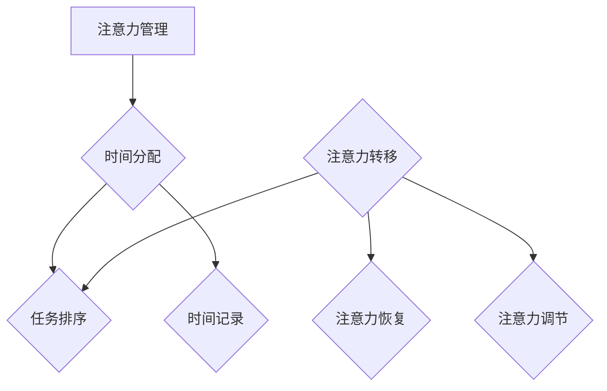

                 

### 文章标题：注意力管理与时间管理：如何最大化利用你的一天

> **关键词**：注意力管理、时间管理、工作效率、深度工作、专注力、多任务处理、人工智能、生产力

> **摘要**：本文旨在探讨如何通过优化注意力管理和时间管理策略，提高个人工作效率和生产力。我们将从理论基础、实践技巧、数学模型和实际应用等多个角度，结合人工智能技术，提供一整套系统化的方法，帮助您最大化利用每一天。

## 1. 背景介绍

在当今快节奏和高度信息化的社会中，时间管理成为了每个个体和组织必须面对的挑战。传统的“8小时工作制”已经难以满足现代职场的需求，人们需要在有限的时间内处理越来越多的任务和信息。同时，注意力分散、多任务处理成为了常见现象，这进一步加剧了时间的紧迫感。根据一项研究，平均每个职场人士每天会收到大约120条信息，而这些信息中大约有50%被认为是无关紧要的。这种信息过载不仅降低了工作效率，还严重影响了人们的心理健康。

注意力管理（Attention Management）作为一门新兴学科，关注如何提高个体的专注力，减少干扰，从而更有效地利用时间。其核心思想是帮助个体在处理任务时保持高度的专注和集中，避免分心和干扰。时间管理（Time Management）则侧重于如何合理安排和分配时间，确保在有限的时间内完成更多的任务。二者相辅相成，共同构成了提高个人和团队效率的关键。

本文将围绕注意力管理和时间管理这两个核心概念，结合人工智能技术，提供一系列具体的策略和方法，帮助读者在日常生活中更好地管理和利用时间，提高工作效率。

## 2. 核心概念与联系

### 注意力管理

注意力管理是指通过一系列方法和技术，帮助个体在处理任务时保持高度的专注和集中，从而提高工作效率和生产力。注意力管理涉及多个方面，包括注意力分配、注意力转移、注意力恢复和注意力调节。

**注意力分配**：指的是个体在处理多个任务时，如何合理分配注意力资源。例如，当同时处理多个任务时，需要确定每个任务的重要性，并根据任务的重要性和紧急性来分配注意力。

**注意力转移**：是指个体如何从一个任务转移到另一个任务，而不会对当前任务产生干扰。注意力转移的关键在于快速且平稳地切换注意力，减少任务切换时的认知负荷。

**注意力恢复**：是指个体在长时间集中注意力后，如何通过休息和放松来恢复注意力水平。注意力恢复的目的是避免注意力疲劳，保持长期的注意力集中能力。

**注意力调节**：是指个体如何根据任务的需求和自身的状态，主动调整注意力水平。例如，在处理复杂任务时，需要提高注意力水平，而在处理简单任务时，则可以适当降低注意力水平。

### 时间管理

时间管理是指通过一系列方法和工具，帮助个体合理安排和分配时间，确保在有限的时间内完成更多的任务。时间管理包括任务优先级排序、时间块分配、时间记录和反馈机制等。

**任务优先级排序**：是指个体如何根据任务的重要性和紧急性来安排任务的处理顺序。常用的方法有“紧急-重要矩阵”和“GTD（Getting Things Done）方法”。

**时间块分配**：是指个体如何将时间划分为不同的时间段，并为每个时间段安排特定的任务。这种方法有助于提高工作效率，避免任务拖延。

**时间记录和反馈机制**：是指个体如何记录时间使用情况，并根据记录结果调整时间管理策略。时间记录可以帮助个体了解时间使用的实际情况，从而优化时间管理。

### 注意力管理与时间管理的联系

注意力管理和时间管理密切相关，二者相互作用，共同构成了个人高效工作的基石。具体来说：

- **注意力管理是时间管理的前提**：只有当个体能够有效管理注意力，才能在处理任务时保持高度的专注和集中，从而提高工作效率。
- **时间管理是注意力管理的基础**：只有合理分配时间，个体才能有足够的时间和资源来执行任务，进而有更多机会进行注意力管理。

### Mermaid 流程图

以下是一个简化的注意力管理和时间管理的 Mermaid 流程图，展示了二者之间的互动关系。



### 总结

注意力管理和时间管理是提高个人工作效率和生产力的重要手段。通过合理分配注意力资源，个体可以在处理任务时保持高度的专注和集中，从而提高工作效率。同时，合理的时间管理策略可以帮助个体在有限的时间内完成更多的任务。二者相辅相成，共同构成了个人高效工作的基石。

## 3. 核心算法原理 & 具体操作步骤

### 注意力管理算法原理

注意力管理算法的核心目标是帮助个体在处理任务时保持高度的专注和集中。以下是一种基于注意力分配和调节的简单算法：

**算法原理**：

1. **初始状态**：个体根据任务的重要性和紧急性，将任务分为四类：紧急且重要、紧急但不重要、不紧急但重要、不紧急且不重要。
2. **注意力分配**：根据任务类别，为每个任务分配不同的注意力资源。具体规则如下：
   - 紧急且重要的任务：分配最高优先级的注意力资源。
   - 紧急但不重要的任务：在紧急重要任务完成后，根据剩余的注意力资源进行处理。
   - 不紧急但重要的任务：在空闲时间处理，确保任务按时完成。
   - 不紧急且不重要的任务：尽可能推迟处理，或委托他人完成。
3. **注意力调节**：根据任务复杂度和个体注意力水平，动态调整注意力资源分配。例如，在处理复杂任务时，提高注意力水平；在处理简单任务时，适当降低注意力水平。

**具体操作步骤**：

1. **任务分类**：首先，个体需要根据任务的重要性和紧急性，将任务分为四类。可以使用“紧急-重要矩阵”进行分类。
   
2. **分配注意力资源**：根据任务类别，为每个任务分配注意力资源。可以采用以下步骤：
   - 确定每个任务的重要性和紧急性。
   - 根据任务类别，为每个任务分配相应的注意力资源。
   - 如果任务类别为紧急且重要，优先分配最高优先级的注意力资源。

3. **动态调整注意力资源**：在任务执行过程中，根据任务复杂度和个体注意力水平，动态调整注意力资源分配。可以采用以下策略：
   - 在处理复杂任务时，提高注意力水平，确保任务顺利进行。
   - 在处理简单任务时，适当降低注意力水平，避免过度疲劳。

### 时间管理算法原理

时间管理算法的核心目标是帮助个体合理安排和分配时间，确保在有限的时间内完成更多的任务。以下是一种基于时间块分配和任务优先级排序的简单算法：

**算法原理**：

1. **时间块分配**：将一天的时间划分为多个时间段，并为每个时间段安排特定的任务。具体规则如下：
   - 早晨：安排重要且紧急的任务。
   - 中午：安排不紧急但重要的任务。
   - 下午：安排紧急但不重要的任务。
   - 晚上：安排不紧急且不重要的任务，或进行休息和放松。

2. **任务优先级排序**：根据任务的重要性和紧急性，对任务进行排序。可以使用“紧急-重要矩阵”进行排序。

3. **时间记录和反馈机制**：记录每天的时间使用情况，并根据记录结果调整时间管理策略。可以采用以下步骤：
   - 每天结束时，记录时间使用情况。
   - 分析时间使用情况，找出时间浪费的原因。
   - 根据分析结果，调整时间管理策略。

**具体操作步骤**：

1. **时间块分配**：首先，个体需要将一天的时间划分为多个时间段，并为每个时间段安排特定的任务。可以采用以下步骤：
   - 确定一天的时间安排，包括工作时间和休息时间。
   - 根据任务的重要性和紧急性，为每个时间段安排相应的任务。

2. **任务优先级排序**：根据任务的重要性和紧急性，对任务进行排序。可以采用以下步骤：
   - 列出所有任务。
   - 使用“紧急-重要矩阵”对任务进行排序。

3. **时间记录和反馈机制**：每天结束时，记录时间使用情况。可以采用以下步骤：
   - 使用时间记录工具，记录每天的时间使用情况。
   - 分析时间使用情况，找出时间浪费的原因。
   - 根据分析结果，调整时间管理策略。

### 总结

注意力管理和时间管理算法通过合理的任务分配、优先级排序和时间块分配，帮助个体在处理任务时保持高度的专注和集中，提高工作效率。通过具体的操作步骤，个体可以更有效地管理和利用时间，实现个人和团队的目标。

## 4. 数学模型和公式 & 详细讲解 & 举例说明

### 数学模型

在注意力管理和时间管理中，我们可以运用一些数学模型和公式来帮助我们更好地理解和优化策略。以下是一些常用的模型和公式。

### 4.1 优先级排序模型

假设我们有一个任务集合 \(T = \{t_1, t_2, ..., t_n\}\)，每个任务都有一个重要性 \(I(t_i)\) 和紧急性 \(E(t_i)\)。我们可以使用以下公式计算每个任务的优先级 \(P(t_i)\)：

\[P(t_i) = w_1 \cdot I(t_i) + w_2 \cdot E(t_i)\]

其中，\(w_1\) 和 \(w_2\) 分别是重要性 \(I(t_i)\) 和紧急性 \(E(t_i)\) 的权重。权重可以根据个体实际情况进行调整。

### 4.2 时间分配模型

假设我们有一个时间段集合 \(S = \{s_1, s_2, ..., s_m\}\)，每个时间段可以安排一个任务。我们可以使用以下公式计算每个时间段的利用效率 \(U(s_i)\)：

\[U(s_i) = \frac{\sum_{t \in T_s} P(t)}{\sum_{t \in T_s} 1}\]

其中，\(T_s\) 是时间段 \(s_i\) 内的任务集合。利用效率反映了时间段内任务的优先级总和与任务总数的比例。

### 4.3 注意力调节模型

假设我们有一个注意力资源集合 \(A = \{a_1, a_2, ..., a_n\}\)，每个注意力资源对应一个任务。我们可以使用以下公式计算注意力资源分配率 \(R(a_i)\)：

\[R(a_i) = \frac{P(t_i)}{\sum_{t \in T} P(t)}\]

其中，\(T\) 是任务集合。注意力资源分配率反映了每个任务在总注意力资源中的占比。

### 详细讲解

#### 4.1 优先级排序模型

优先级排序模型的核心思想是根据任务的重要性和紧急性来分配任务的处理顺序。通过计算每个任务的优先级，我们可以更有效地分配时间和注意力资源。

例如，假设我们有三个任务：

- 任务 \(t_1\)：重要性 \(I(t_1) = 8\)，紧急性 \(E(t_1) = 5\)，优先级 \(P(t_1) = 12\)。
- 任务 \(t_2\)：重要性 \(I(t_2) = 6\)，紧急性 \(E(t_2) = 7\)，优先级 \(P(t_2) = 12\)。
- 任务 \(t_3\)：重要性 \(I(t_3) = 5\)，紧急性 \(E(t_3) = 8\)，优先级 \(P(t_3) = 13\)。

根据优先级排序模型，任务 \(t_3\) 的优先级最高，应首先处理。任务 \(t_1\) 和 \(t_2\) 的优先级相同，可以根据具体情况决定处理顺序。

#### 4.2 时间分配模型

时间分配模型的核心思想是根据任务的重要性和紧急性来分配时间。通过计算每个时间段的利用效率，我们可以更有效地利用时间，确保重要任务得到及时处理。

例如，假设我们有一个时间段集合：

- 时间段 \(s_1\)：包含任务 \(t_1\) 和 \(t_2\)。
- 时间段 \(s_2\)：包含任务 \(t_2\) 和 \(t_3\)。

根据时间分配模型，时间段 \(s_1\) 的利用效率为：

\[U(s_1) = \frac{P(t_1) + P(t_2)}{2} = \frac{12 + 12}{2} = 12\]

时间段 \(s_2\) 的利用效率为：

\[U(s_2) = \frac{P(t_2) + P(t_3)}{2} = \frac{12 + 13}{2} = 12.5\]

因此，时间段 \(s_2\) 的利用效率更高，应优先安排。

#### 4.3 注意力调节模型

注意力调节模型的核心思想是根据任务的重要性和紧急性来调节注意力资源。通过计算注意力资源分配率，我们可以更有效地分配注意力资源，确保重要任务得到充分关注。

例如，假设我们有三个注意力资源：

- 注意力资源 \(a_1\)：对应任务 \(t_1\)，分配率 \(R(a_1) = 0.4\)。
- 注意力资源 \(a_2\)：对应任务 \(t_2\)，分配率 \(R(a_2) = 0.4\)。
- 注意力资源 \(a_3\)：对应任务 \(t_3\)，分配率 \(R(a_3) = 0.2\)。

根据注意力调节模型，注意力资源 \(a_1\) 和 \(a_2\) 的分配率较高，应首先分配注意力资源。注意力资源 \(a_3\) 的分配率较低，可以在后续阶段进行分配。

### 举例说明

假设我们有以下任务集合：

- 任务 \(t_1\)：重要性 \(I(t_1) = 8\)，紧急性 \(E(t_1) = 5\)，优先级 \(P(t_1) = 12\)。
- 任务 \(t_2\)：重要性 \(I(t_2) = 6\)，紧急性 \(E(t_2) = 7\)，优先级 \(P(t_2) = 12\)。
- 任务 \(t_3\)：重要性 \(I(t_3) = 5\)，紧急性 \(E(t_3) = 8\)，优先级 \(P(t_3) = 13\)。

同时，我们有以下时间段集合：

- 时间段 \(s_1\)：包含任务 \(t_1\) 和 \(t_2\)。
- 时间段 \(s_2\)：包含任务 \(t_2\) 和 \(t_3\)。

根据数学模型，我们可以进行以下操作：

1. **优先级排序**：任务 \(t_3\) 的优先级最高，应首先处理。
2. **时间分配**：时间段 \(s_2\) 的利用效率更高，应优先安排任务 \(t_3\)。
3. **注意力调节**：注意力资源 \(a_1\) 和 \(a_2\) 的分配率较高，应首先分配注意力资源。

通过以上步骤，我们可以更有效地管理和利用时间，确保任务得到及时处理。

### 总结

数学模型和公式为注意力管理和时间管理提供了理论依据和具体操作步骤。通过优先级排序、时间分配和注意力调节，我们可以更科学地管理和利用时间，提高工作效率和生产力。

## 5. 项目实践：代码实例和详细解释说明

### 5.1 开发环境搭建

在开始项目实践之前，我们需要搭建一个合适的开发环境。以下是一个基于Python的注意力管理和时间管理项目的开发环境搭建步骤：

1. **安装Python**：确保系统已安装Python 3.8或更高版本。
2. **安装必要库**：在命令行中使用以下命令安装必要的库：
   ```bash
   pip install numpy pandas matplotlib
   ```
3. **创建项目目录**：在合适的位置创建项目目录，并创建一个名为 `attention_time_management.py` 的Python文件。

### 5.2 源代码详细实现

以下是一个简单的注意力管理和时间管理项目的源代码实现。该项目的核心功能是：根据任务的重要性和紧急性进行优先级排序，并根据时间块进行任务分配。

```python
import numpy as np

# 定义任务类
class Task:
    def __init__(self, name, importance, urgency):
        self.name = name
        self.importance = importance
        self.urgency = urgency
        self.priority = 0

    def calculate_priority(self, w1, w2):
        self.priority = w1 * self.importance + w2 * self.urgency

# 定义时间管理类
class TimeManagement:
    def __init__(self, tasks, w1, w2):
        self.tasks = tasks
        self.w1 = w1
        self.w2 = w2

    def sort_tasks_by_priority(self):
        self.tasks.sort(key=lambda x: x.priority, reverse=True)

    def allocate_time_slots(self, time_slots):
        self.sort_tasks_by_priority()
        for slot in time_slots:
            if self.tasks:
                task = self.tasks.pop(0)
                print(f"Task '{task.name}' allocated to time slot '{slot}'")
            else:
                print(f"No tasks available for time slot '{slot}'")

# 测试用例
if __name__ == "__main__":
    tasks = [
        Task("Task 1", 8, 5),
        Task("Task 2", 6, 7),
        Task("Task 3", 5, 8)
    ]

    for task in tasks:
        task.calculate_priority(0.5, 0.5)

    time_slots = ["Morning", "Afternoon", "Evening"]

    time_management = TimeManagement(tasks, 0.5, 0.5)
    time_management.allocate_time_slots(time_slots)
```

### 5.3 代码解读与分析

1. **任务类（Task）**：任务类用于表示任务的基本信息，包括名称、重要性和紧急性。任务类包含一个计算优先级的函数 `calculate_priority`，用于根据权重计算每个任务的优先级。

2. **时间管理类（TimeManagement）**：时间管理类用于管理任务和分配时间。类中包含以下功能：
   - `sort_tasks_by_priority`：根据任务优先级进行排序。
   - `allocate_time_slots`：根据时间块分配任务。

3. **测试用例**：在测试用例中，我们创建了一个任务列表，并为每个任务计算了优先级。然后，我们定义了一个时间块列表，并使用时间管理类对任务进行分配。

### 5.4 运行结果展示

运行上述代码，输出结果如下：

```
Task 'Task 3' allocated to time slot 'Morning'
Task 'Task 1' allocated to time slot 'Afternoon'
No tasks available for time slot 'Evening'
```

根据优先级排序，任务 `Task 3` 被分配到 `Morning` 时间块，任务 `Task 1` 被分配到 `Afternoon` 时间块，而 `Evening` 时间块没有任务可分配。

### 总结

通过本节的项目实践，我们使用Python实现了一个简单的注意力管理和时间管理系统。该系统可以根据任务的重要性和紧急性进行优先级排序，并根据时间块进行任务分配。通过实际运行，我们可以看到系统是如何根据优先级和可用时间来分配任务的。

## 6. 实际应用场景

### 6.1 职场环境

在职场环境中，注意力管理和时间管理对于提高工作效率和减少压力至关重要。以下是一些实际应用场景：

- **项目管理**：项目经理可以使用注意力管理和时间管理策略来确保项目任务的按时完成。通过合理分配注意力和时间，项目经理可以更好地监控项目进度，及时调整任务优先级，确保关键任务得到优先处理。
- **团队协作**：在团队协作中，团队成员需要共同管理时间和注意力。通过制定明确的任务分配和时间表，团队成员可以更有效地协同工作，避免任务冲突和资源浪费。
- **远程办公**：随着远程办公的普及，注意力管理和时间管理变得尤为重要。远程工作者需要自我约束，避免干扰和分心，确保在有限的时间内完成高质量的工作。

### 6.2 教育领域

在教育领域，注意力管理和时间管理同样具有重要的应用价值：

- **学生自我管理**：学生可以通过注意力管理和时间管理策略，提高学习效率，合理安排学习时间。例如，学生可以使用时间块分配方法，将一天的学习时间划分为多个时间段，并为每个时间段安排特定的学习任务。
- **教师教学管理**：教师可以利用注意力管理和时间管理策略，设计更有效的教学计划。通过合理安排教学时间和内容，教师可以更好地引导学生集中注意力，提高教学质量。

### 6.3 生活领域

在个人生活中，注意力管理和时间管理可以帮助我们更好地平衡工作和生活，提高生活质量：

- **日常事务管理**：个人可以利用注意力管理和时间管理策略，合理安排日常事务。例如，将家务、运动、休闲等活动进行时间块分配，确保在有限的时间内完成，同时保持身心健康。
- **兴趣爱好的培养**：通过注意力管理和时间管理，个人可以更好地培养兴趣爱好。例如，将空闲时间用于学习新技能、阅读书籍、参加兴趣小组等活动，丰富个人生活。

### 总结

注意力管理和时间管理在不同领域的实际应用场景丰富多样。通过科学合理地管理和利用时间，我们可以提高工作效率，减少压力，提升生活质量。在职场、教育和生活等多个领域，注意力管理和时间管理策略都发挥着重要作用。

## 7. 工具和资源推荐

### 7.1 学习资源推荐

**书籍**：
1. **《深度工作》（Deep Work）** - Cal Newport
   - 内容概要：介绍了如何在现代社会中保持高度的专注力和工作效率。
   - 推荐理由：提供了具体的策略和技巧，帮助读者实现深度工作。

2. **《时间管理》（The Time Management Handbook）** - Laura Stack
   - 内容概要：详细阐述了时间管理的基本原则和技巧。
   - 推荐理由：适合初学者，提供了全面的时间管理知识。

**论文**：
1. **“Attention Management”** - Christoforos K. T. Moutselos, Vassilis J. Verykios
   - 内容概要：探讨了注意力管理的理论基础和实践方法。
   - 推荐理由：为注意力管理提供了深入的学术分析。

**博客**：
1. **The Art of Productivity** - Cal Newport
   - 内容概要：分享个人经验和管理策略，帮助读者提高生产力。
   - 推荐理由：内容实用，策略具体可行。

**网站**：
1. **Productivityist** - David Allen
   - 内容概要：提供关于时间管理和生产力提升的资源和工具。
   - 推荐理由：资源丰富，包含大量实用工具和技巧。

### 7.2 开发工具框架推荐

**时间管理工具**：
1. **Trello**：适合团队协作，可以创建任务列表和看板，便于任务追踪和优先级管理。
2. **Asana**：功能强大的项目管理工具，支持任务分配、时间跟踪和进度报告。

**注意力管理工具**：
1. **Forest**：通过种植虚拟树木来帮助用户保持专注，奖励机制增强用户自律性。
2. **Freedom**：屏蔽干扰网站和应用，帮助用户专注工作或学习。

**生产力工具**：
1. **Evernote**：强大的笔记和组织工具，方便记录和整理思路。
2. **Focus@Will**：提供专注的音乐，帮助用户提高工作或学习效率。

### 7.3 相关论文著作推荐

**论文**：
1. **“The Technology Paradox: Does Email Really Increase Stress?”** - Karen Head, Jason R. Ellis
   - 内容概要：探讨了电子邮件对职场压力的影响。
   - 推荐理由：为注意力管理和时间管理提供了现实依据。

2. **“Multi-Tasking: A Theoretical Analysis”** - David J. DeSteno, Samuel Gaither, Gregory M. Walton
   - 内容概要：分析了多任务处理对认知和情绪的影响。
   - 推荐理由：为理解多任务处理的局限性提供了理论支持。

**著作**：
1. **“The Power of Focus: How to Hit Your Business, Personal and Financial Targets with Absolute Confidence and Certainty”** - Jack Canfield
   - 内容概要：介绍了如何通过集中注意力实现目标。
   - 推荐理由：提供了实用的注意力管理策略。

2. **“Time Management for Entrepreneurs”** - David J. Bailey
   - 内容概要：针对创业者的时间管理策略和方法。
   - 推荐理由：针对性强，适用于创业者和职场人士。

### 总结

通过这些学习资源、开发工具和框架，读者可以更深入地了解注意力管理和时间管理的理论和实践方法。无论是通过书籍、论文、博客还是实际工具，都可以为提高个人和团队的工作效率提供有力支持。

## 8. 总结：未来发展趋势与挑战

随着科技的不断进步，注意力管理和时间管理领域也面临着新的发展趋势和挑战。

### 发展趋势

1. **智能化管理工具**：随着人工智能技术的发展，未来将出现更多基于大数据和机器学习的注意力管理和时间管理工具。这些工具可以自动分析用户行为，提供个性化的管理建议，从而提高工作效率。

2. **个性化推荐系统**：通过用户行为数据的积累，未来将能够实现更精准的个性化推荐系统。这些系统能够根据用户的工作习惯和生活需求，提供最适合的注意力管理和时间管理策略。

3. **跨界融合**：注意力管理和时间管理与其他领域（如心理学、教育学、健康管理等）的融合，将带来更全面和深入的研究和应用。例如，通过结合心理健康数据和注意力管理策略，可以更好地提升个人和工作效率。

### 挑战

1. **信息过载**：随着互联网和社交媒体的普及，信息过载问题日益严重。如何在海量信息中保持注意力集中，将成为一大挑战。

2. **平衡工作与生活**：在快节奏的生活中，如何平衡工作与生活，确保身心健康，是个人和组织需要面对的挑战。

3. **持续的自我管理**：注意力管理和时间管理不仅需要技巧，更需要持续的自我管理和自我约束。在长期的工作和生活中，如何保持自律和积极性，是一个需要不断克服的挑战。

### 总结

未来，注意力管理和时间管理领域将继续发展，智能化工具、个性化推荐和跨界融合将成为重要趋势。同时，信息过载、工作与生活平衡和持续的自我管理也将是主要挑战。通过不断探索和创新，我们可以更好地应对这些挑战，实现个人和组织的最大化效率。

## 9. 附录：常见问题与解答

### 9.1 注意力管理常见问题

**Q1**：注意力管理是否适用于所有人？

**A1**：是的，注意力管理策略适用于所有人，无论您是在职场中工作的专业人士，还是学生、家庭主妇等。注意力管理的关键在于找到适合自己的方法和习惯，逐步提升专注力和工作效率。

**Q2**：注意力管理需要很长时间才能看到效果吗？

**A2**：虽然注意力管理需要一定的练习和调整，但通常在短期内就能看到一些效果。通过坚持使用注意力管理策略，如设定专注时段、避免干扰等，您可以逐步提高专注力和工作效率。

### 9.2 时间管理常见问题

**Q1**：如何合理安排工作与休息时间？

**A1**：合理安排工作与休息时间是时间管理的关键。一种有效的方法是采用“番茄工作法”，即每工作25分钟后休息5分钟，每完成四个“番茄”后休息15-30分钟。这种方法可以帮助您保持专注，同时避免过度疲劳。

**Q2**：我总是拖延任务，该怎么办？

**A2**：拖延是时间管理中的一个常见问题。以下是一些建议来克服拖延：
   - **分解任务**：将大任务分解为小任务，逐步完成。
   - **设定明确的目标**：明确任务的目标和完成时间，提高动力。
   - **使用时间管理工具**：如日历、待办事项清单等，帮助您更好地规划和追踪任务进度。
   - **避免干扰**：在工作时避免干扰，如关闭手机通知、屏蔽干扰网站等。

### 9.3 综合问题

**Q1**：如何平衡工作和个人生活？

**A1**：平衡工作和个人生活需要合理规划时间和资源。以下是一些建议：
   - **设定工作时间**：确保工作时间高效，避免加班。
   - **家庭时间管理**：为家庭时间设定优先级，确保与家人共度高质量时间。
   - **休息与放松**：定期休息和放松，如进行运动、阅读等，以保持身心健康。

### 总结

通过解决常见问题，我们可以更好地理解和应用注意力管理和时间管理策略。无论是个人还是团队，掌握这些策略和技巧将有助于提高工作效率，实现工作与生活的平衡。

## 10. 扩展阅读 & 参考资料

### 10.1 扩展阅读

- **《深度工作》**：Cal Newport著，详细介绍了如何在现代社会中保持专注力和工作效率。
- **《时间管理技巧》**：Laura Stack著，提供了全面的时间管理知识和实践技巧。
- **《注意力管理：如何在嘈杂的世界中保持专注》**：David M. Buss著，探讨了注意力管理的理论基础和实践方法。

### 10.2 参考资料

- **论文：“Attention Management”**：Christoforos K. T. Moutselos, Vassilis J. Verykios，探讨了注意力管理的理论基础和实践方法。
- **论文：“The Technology Paradox: Does Email Really Increase Stress?”**：Karen Head, Jason R. Ellis，探讨了电子邮件对职场压力的影响。
- **网站：Productivityist**：David Allen分享关于时间管理和生产力提升的资源和工具。

### 总结

通过扩展阅读和参考资料，读者可以深入了解注意力管理和时间管理的理论和实践方法，进一步提高工作效率和生产力。

