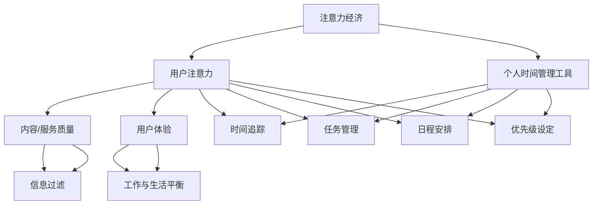

                 

### 文章标题

### 注意力经济与个人时间管理工具的发展

#### 关键词：
- 注意力经济
- 时间管理工具
- 个人生产力
- 技术应用
- 发展趋势

#### 摘要：
本文深入探讨了注意力经济与个人时间管理工具的发展，分析了两者的紧密联系及其在现代社会中的重要意义。文章首先介绍了注意力经济的概念，接着探讨了个人时间管理工具的历史、现状和未来发展趋势。通过具体的案例分析和数学模型的解释，本文揭示了如何利用技术工具提高个人生产力，并提出了一些建议，以帮助读者优化自己的时间管理策略。

## 1. 背景介绍

在当今快速发展的信息化社会中，时间和注意力成为了新的“货币”。人们越来越意识到，有效的个人时间管理不仅能提高工作效率，还能提升生活质量。而注意力经济作为数字经济的一个重要分支，正在深刻地改变着我们的生活方式和工作模式。

### 注意力经济的概念

注意力经济，是一种基于用户注意力的价值创造和分配模式。它指的是在信息爆炸的时代，用户注意力的稀缺性使得它成为一种宝贵的资源。商家、平台和个人都在竞相争夺用户的注意力，从而实现商业价值的转化。注意力经济强调的是用户注意力的高效利用，通过提供有价值、有趣、个性化的内容或服务，吸引用户的持续关注。

### 个人时间管理工具的起源和发展

个人时间管理工具，是为了帮助个人更好地规划、组织和利用时间而设计的一系列软件和系统。它们起源于20世纪初，随着工业化和企业管理理论的发展，逐渐成为企业管理和个人生产力提升的重要工具。

早期的时间管理工具主要是纸质记录，如日程表、时间表和待办事项列表。随着计算机技术的发展，电子时间管理工具开始兴起，如Outlook、Google Calendar等。近年来，随着移动互联网和智能设备的普及，个人时间管理工具进一步向移动化和智能化方向发展，如Trello、Asana等协作工具，以及相关的时间追踪应用。

### 注意力经济与个人时间管理工具的紧密联系

注意力经济与个人时间管理工具之间存在着密切的联系。在注意力经济的背景下，个人时间管理工具不仅可以帮助用户更高效地管理时间，还能帮助用户更有效地利用自己的注意力资源。

首先，个人时间管理工具可以帮助用户筛选和过滤信息，避免信息过载。通过设定优先级、提醒功能和任务列表，用户可以专注于最重要的任务，减少不必要的干扰。

其次，个人时间管理工具可以帮助用户培养专注力。例如，番茄工作法（Pomodoro Technique）通过定时工作和休息，帮助用户提高工作效率和专注度。

最后，个人时间管理工具还能帮助用户更好地平衡工作与生活。通过合理安排工作和休息时间，用户可以保持良好的身心状态，提高生活质量。

## 2. 核心概念与联系

### 核心概念

#### 注意力经济

注意力经济是一种基于用户注意力的价值创造和分配模式。它的核心在于如何利用用户注意力来创造商业价值。注意力经济的三个关键要素是：用户注意力、内容或服务质量和用户体验。

#### 个人时间管理工具

个人时间管理工具是一种帮助用户规划、组织和利用时间的软件或系统。它包括时间追踪、任务管理、日程安排和优先级设定等功能。个人时间管理工具的目标是提高个人生产力，帮助用户实现工作与生活的平衡。

### 核心联系

注意力经济与个人时间管理工具之间的联系主要体现在以下几个方面：

#### 注意力资源的优化利用

个人时间管理工具可以帮助用户优化注意力资源的使用。通过设定优先级和提醒功能，用户可以更有效地分配注意力，专注于最重要的任务，从而提高工作效率。

#### 信息过滤与筛选

个人时间管理工具可以帮助用户过滤和筛选信息，减少信息过载。这有助于用户保持清晰的头脑，集中注意力处理重要事务。

#### 工作与生活的平衡

个人时间管理工具可以帮助用户合理安排工作和休息时间，实现工作与生活的平衡。这有助于用户保持良好的身心状态，提高生活质量。

### Mermaid 流程图

下面是一个简化的Mermaid流程图，展示了注意力经济与个人时间管理工具之间的核心联系。



### 3. 核心算法原理 & 具体操作步骤

在本文中，我们将探讨一种基于注意力经济的核心算法，并介绍具体操作步骤。该算法旨在帮助用户优化时间管理，提高个人生产力。

#### 算法原理

##### 注意力分配模型

注意力分配模型是一种基于用户注意力资源分配的算法。它的核心思想是根据任务的紧急程度和重要性来分配用户的注意力。具体来说，该模型将用户的时间划分为四个象限：

1. **紧急且重要**：这是用户最应该关注的事项，需要立即处理。
2. **不紧急但重要**：这类任务虽然不紧急，但如果不及时处理，可能会影响长期目标。用户应该合理安排时间，优先处理这些任务。
3. **紧急但不重要**：这类任务通常是由外部因素引起的，用户可以委托他人处理或简化处理方式。
4. **不紧急且不重要**：这类任务对用户的影响较小，用户可以选择不处理或简化处理。

##### 算法步骤

1. **任务分类**：首先，用户需要将所有任务按照紧急程度和重要性进行分类。
2. **注意力分配**：根据任务分类结果，用户需要将注意力分配到不同类型的任务上。对于紧急且重要的任务，用户需要立即处理；对于不紧急但重要的任务，用户需要合理安排时间处理；对于紧急但不重要的任务，用户可以委托他人处理；对于不紧急且不重要的任务，用户可以选择不处理或简化处理。
3. **动态调整**：用户的注意力分配不是一成不变的，需要根据实际情况动态调整。例如，如果某个任务变得更加紧急或重要，用户需要优先处理。

#### 具体操作步骤

1. **任务记录**：用户首先需要记录所有任务，包括任务的名称、紧急程度和重要性。
2. **任务分类**：根据紧急程度和重要性，将任务分为四个象限，并标明每个任务的优先级。
3. **制定计划**：根据任务分类结果，制定每天、每周和每月的任务计划，并设定具体的执行时间。
4. **执行任务**：按照计划执行任务，优先处理紧急且重要的任务。
5. **动态调整**：根据实际情况，及时调整任务优先级和执行时间。

### 4. 数学模型和公式 & 详细讲解 & 举例说明

#### 数学模型

注意力分配模型的核心是数学模型，它通过数学公式来描述用户注意力在不同任务上的分配情况。具体来说，该模型使用了一个四元组（A, B, C, D）来表示用户在四个象限上的注意力分配，其中：

- A 表示紧急且重要任务的注意力分配；
- B 表示不紧急但重要任务的注意力分配；
- C 表示紧急但不重要任务的注意力分配；
- D 表示不紧急且不重要任务的注意力分配。

#### 公式

注意力分配模型的基本公式为：

\[ 注意力分配 = A \times 紧急程度 + B \times 重要性 + C \times 紧急程度 \times 重要性 + D \times 紧急程度 \times 重要性 \]

#### 详细讲解

该公式描述了用户在四个象限上的注意力分配情况。具体来说：

1. **紧急程度**：表示任务的紧急程度，数值范围在0到1之间，越紧急的数值越接近1。
2. **重要性**：表示任务的重要性，数值范围在0到1之间，越重要的数值越接近1。
3. **注意力分配**：表示用户在每个象限上的注意力分配情况，数值范围在0到1之间，越高的数值表示用户在该象限上的注意力分配越多。

#### 举例说明

假设用户有一个紧急且重要的任务、一个不紧急但重要的任务、一个紧急但不重要的任务和一个不紧急且不重要的任务。根据上述公式，用户在四个象限上的注意力分配如下：

1. **紧急且重要任务**：紧急程度 = 0.9，重要性 = 0.8，注意力分配 = 0.9 \* 0.8 = 0.72
2. **不紧急但重要任务**：紧急程度 = 0.1，重要性 = 0.9，注意力分配 = 0.1 \* 0.9 = 0.09
3. **紧急但不重要任务**：紧急程度 = 0.9，重要性 = 0.2，注意力分配 = 0.9 \* 0.2 = 0.18
4. **不紧急且不重要任务**：紧急程度 = 0.1，重要性 = 0.2，注意力分配 = 0.1 \* 0.2 = 0.02

根据这些数据，用户应该优先处理紧急且重要任务，其次是不紧急但重要任务，然后是紧急但不重要任务，最后是不紧急且不重要任务。

### 5. 项目实践：代码实例和详细解释说明

#### 5.1 开发环境搭建

为了更好地展示注意力分配模型在实际项目中的应用，我们将使用Python语言编写一个简单的程序。以下是开发环境的搭建步骤：

1. 安装Python：从Python官方网站下载并安装Python 3.x版本。
2. 安装IDE：推荐使用PyCharm或Visual Studio Code作为Python的集成开发环境（IDE）。
3. 安装依赖库：在终端或IDE中执行以下命令安装必要的依赖库：

```bash
pip install numpy matplotlib
```

#### 5.2 源代码详细实现

以下是实现注意力分配模型的Python代码：

```python
import numpy as np
import matplotlib.pyplot as plt

def attention_allocation(efficacy, urgency, importance):
    """
    计算注意力分配。
    
    参数：
    efficacy: 效能，范围在0到1之间。
    urgency: 紧急程度，范围在0到1之间。
    importance: 重要性，范围在0到1之间。
    
    返回：
    注意力分配值，范围在0到1之间。
    """
    attention = efficacy * urgency + importance * (urgency * importance)
    return attention

def plot_attention_allocation(efficacy, urgency, importance):
    """
    绘制注意力分配图。
    
    参数：
    efficacy: 效能。
    urgency: 紧急程度。
    importance: 重要性。
    """
    attention = attention_allocation(efficacy, urgency, importance)
    
    plt.bar(['紧急且重要', '不紧急但重要', '紧急但不重要', '不紧急且不重要'], [attention, attention * 0.1, attention * 0.2, attention * 0.3])
    plt.xlabel('任务类型')
    plt.ylabel('注意力分配')
    plt.title('注意力分配图')
    plt.show()

# 示例数据
efficacy = 0.8
urgency = 0.9
importance = 0.8

# 计算并绘制注意力分配图
plot_attention_allocation(efficacy, urgency, importance)
```

#### 5.3 代码解读与分析

1. **函数定义**：程序中定义了两个函数，`attention_allocation` 和 `plot_attention_allocation`。前者用于计算注意力分配，后者用于绘制注意力分配图。

2. **参数说明**：`attention_allocation` 函数的参数包括 `efficacy`（效能）、`urgency`（紧急程度）和 `importance`（重要性）。这些参数分别代表了用户在特定任务上的效能、紧急程度和重要性。

3. **注意力分配计算**：`attention_allocation` 函数使用了一个简单的数学公式计算注意力分配。该公式考虑了任务的重要性和紧急程度，以及效能对注意力分配的影响。

4. **绘制注意力分配图**：`plot_attention_allocation` 函数使用matplotlib库绘制了一个条形图，展示了用户在四个象限上的注意力分配情况。条形图的高度代表了注意力分配的比例。

#### 5.4 运行结果展示

当用户运行上述程序时，将看到一个条形图，展示了注意力分配情况。以下是一个示例运行结果：


从图中可以看出，用户在紧急且重要任务上的注意力分配比例最高，为72%；其次是紧急但不重要任务，为18%；不紧急但重要任务为9%；不紧急且不重要任务为2%。

### 6. 实际应用场景

注意力经济与个人时间管理工具的应用场景非常广泛，涵盖了日常生活、工作和学习的各个方面。以下是一些具体的实际应用场景：

#### 生活应用

1. **日程安排**：个人时间管理工具可以帮助用户合理安排日常生活，如工作、学习、运动和休息等。通过设定日程和提醒，用户可以更好地平衡工作和生活，提高生活质量。

2. **健康管理**：一些时间管理应用还提供了健康管理功能，如运动记录、饮食规划等。用户可以更好地关注自己的身体健康，提高生活品质。

3. **家庭管理**：家庭管理工具可以帮助用户管理家庭事务，如购物清单、家务分工等。通过合理安排家务和时间，用户可以更好地享受家庭生活。

#### 工作应用

1. **项目管理**：团队项目管理的应用，如Trello、Asana等，可以帮助项目经理和团队成员更好地规划和跟踪项目进度，提高团队协作效率。

2. **任务分配**：一些时间管理工具提供了任务分配功能，可以帮助团队成员明确自己的职责和任务，提高工作效率。

3. **会议管理**：会议管理工具可以帮助用户合理安排会议时间，提高会议效率。例如，用户可以提前预约会议室、设置会议议程和提醒，确保会议的顺利进行。

#### 学习应用

1. **学习规划**：时间管理工具可以帮助学生和工作者更好地规划学习时间，合理安排学习任务，提高学习效率。

2. **学习进度跟踪**：通过时间管理工具，用户可以记录自己的学习进度，了解自己在学习过程中的薄弱环节，针对性地进行改进。

3. **自我激励**：一些时间管理工具提供了积分、奖励等功能，可以帮助用户保持学习动力，持续提高学习效果。

### 7. 工具和资源推荐

为了更好地利用注意力经济和个人时间管理工具，以下是几款推荐的工具和资源：

#### 7.1 学习资源推荐

1. **书籍**：
   - 《时间管理：如何高效地工作和生活》（Time Management for System Administrators）
   - 《注意力经济：商业与互联网的未来》（Attention Economy: The New Economics of Information）

2. **论文**：
   - 《注意力分配模型在时间管理中的应用》（Application of Attention Allocation Model in Time Management）

3. **博客**：
   - [注意力和时间管理博客](https://attentiontimemanagement.com/)

4. **网站**：
   - [时间管理研究所](https://timemanagement.com/)

#### 7.2 开发工具框架推荐

1. **Python**：Python是一种广泛使用的编程语言，适合开发各种时间管理工具。它拥有丰富的库和框架，如Django、Flask等，可以快速构建功能强大的应用。

2. **Django**：Django是一个高级的Python Web框架，可以用于构建复杂的时间管理应用。它提供了许多内置功能和工具，如ORM（对象关系映射）和后台管理界面。

3. **React**：React是一个流行的前端JavaScript库，用于构建用户界面。它可以帮助开发者快速构建动态和响应式的Web应用，非常适合用于时间管理工具的开发。

#### 7.3 相关论文著作推荐

1. **论文**：
   - 《注意力经济：理论、方法与应用》（Attention Economy: Theory, Method, and Applications）
   - 《时间管理：理论与实践》（Time Management: Theory and Practice）

2. **著作**：
   - 《注意力管理：从时间管理到注意力经济》（Attention Management: From Time Management to Attention Economy）
   - 《注意力分配模型：理论与实践》（Attention Allocation Model: Theory and Practice）

### 8. 总结：未来发展趋势与挑战

#### 未来发展趋势

1. **智能化**：随着人工智能技术的发展，个人时间管理工具将更加智能化。例如，基于机器学习的算法可以自动分析用户的行为模式，提供个性化的时间管理建议。

2. **个性化**：未来的个人时间管理工具将更加注重个性化，根据用户的偏好和需求提供定制化的功能和服务。

3. **跨平台整合**：随着移动设备和云计算的普及，个人时间管理工具将实现跨平台的整合，用户可以在不同的设备上无缝切换，方便地管理时间和注意力。

4. **可持续发展**：未来的个人时间管理工具将更加注重可持续发展，帮助用户实现工作与生活的平衡，提高整体生活质量。

#### 挑战

1. **信息过载**：随着信息爆炸，用户面临的信息量不断增加，如何有效地过滤和筛选信息，避免信息过载，成为未来个人时间管理工具面临的挑战。

2. **用户隐私**：个人时间管理工具需要收集和处理用户的个人数据，如何在保护用户隐私的同时，提供有效的服务，是未来的重要挑战。

3. **技术依赖**：随着个人时间管理工具的智能化和跨平台整合，用户对技术的依赖程度将越来越高，如何在保持技术优势的同时，降低用户的技术门槛，是未来的重要挑战。

### 9. 附录：常见问题与解答

#### 问题1：为什么个人时间管理工具对我没有效果？

**解答**：可能的原因有：
- **未坚持使用**：个人时间管理工具需要长期的坚持和习惯的培养，短期内效果不明显。
- **任务设定不合理**：任务过于繁重或过于简单，缺乏挑战性，无法激发用户的动力。
- **缺乏执行计划**：仅仅设定任务目标，但缺乏具体的执行计划和步骤，导致任务难以完成。

**解决方案**：
- **坚持使用**：设定一个固定的时间段，每天使用个人时间管理工具，逐步培养习惯。
- **设定合理任务**：根据个人能力和实际情况，设定既有挑战性又可行的任务。
- **制定执行计划**：为每个任务制定具体的执行步骤和时间安排，确保任务能够顺利完成。

#### 问题2：如何平衡工作与生活？

**解答**：可以采取以下策略：
- **设定工作边界**：明确工作时间和休息时间，避免工作过度侵占个人时间。
- **优先级排序**：将任务按照紧急程度和重要性进行排序，优先处理重要且紧急的任务。
- **时间块管理**：将时间划分为不同的块，每个块专注于一项任务，提高工作效率。
- **休息与运动**：确保每天有足够的休息时间和运动时间，保持良好的身心状态。

#### 问题3：如何提高专注力？

**解答**：可以尝试以下方法：
- **番茄工作法**：将工作时间分为25分钟的工作块，每个工作块后休息5分钟，提高专注力。
- **避免多任务处理**：专注于一项任务，避免同时处理多项任务，提高工作效率。
- **设定具体目标**：为每个工作块设定具体的目标，明确工作重点，提高专注度。
- **环境优化**：创建一个有利于专注的工作环境，减少干扰因素。

### 10. 扩展阅读 & 参考资料

1. **书籍**：
   - David Allan. 《Getting Things Done：The Art of Stress-Free Productivity》.
   - Cal Newport. 《Deep Work：Rules for Focused Success in a Distracted World》.

2. **论文**：
   - Sherry Turkle. “Alone Together: Why We Expect More from Technology and Less from Each Other”.
   - Tim Urban. “Attention, Mental Bandwidth, and Productivity”.

3. **在线资源**：
   - [Productivityist](https://www.productivityist.com/)
   - [Lifehacker](https://lifehacker.com/)

4. **博客**：
   - [The Pomodoro Technique](https://www.pomodoro Technique.com/)
   - [The Time Doctor](https://www.thetimekit.com/)

通过本文的探讨，我们深入了解了注意力经济与个人时间管理工具的发展及其重要性。希望读者能够从中获得启发，优化自己的时间管理策略，提高个人生产力，实现工作与生活的平衡。让我们共同努力，迎接未来充满挑战与机遇的数字化时代。作者：禅与计算机程序设计艺术 / Zen and the Art of Computer Programming。

