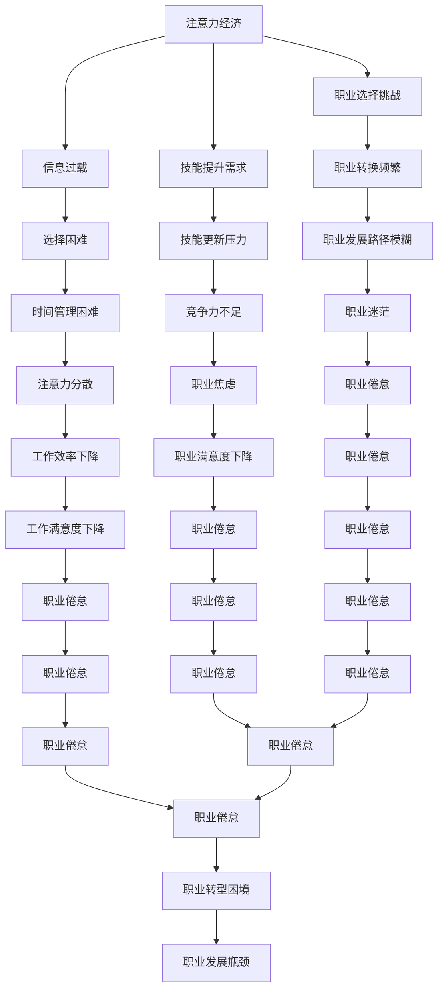
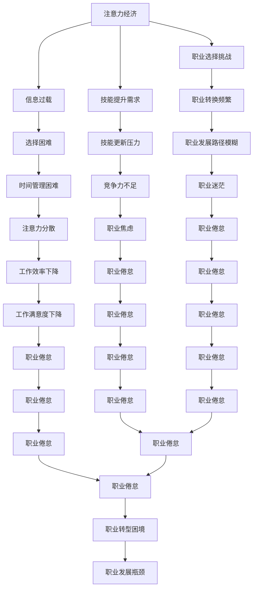

                 

关键词：注意力经济，个人职业规划，技能提升，可持续发展

> 摘要：本文将探讨注意力经济的兴起及其对个人职业规划的影响，分析在注意力经济背景下如何调整个人技能和职业发展方向，以实现可持续发展的目标。

## 1. 背景介绍

随着互联网和数字技术的迅猛发展，信息爆炸的时代已经到来。人们在海量的信息中寻求关注和认可，形成了所谓的“注意力经济”。这种经济模式改变了传统的价值创造方式，使得内容创作者、平台运营商和受众之间的关系变得更加紧密。在这种背景下，个人职业规划也面临着前所未有的挑战和机遇。

### 注意力经济的定义与特点

注意力经济（Attention Economy）是指人们通过关注、分享和互动来创造和获取价值的经济模式。其特点如下：

1. **内容为王**：高质量的内容是吸引注意力的关键，因此内容创作者需要不断提高自己的创作能力。
2. **平台依赖**：互联网平台成为连接创作者和受众的桥梁，平台的算法和推荐机制对内容传播和影响力起着决定性作用。
3. **用户参与**：用户不仅是内容的消费者，也是内容的创造者，通过互动和分享来增加内容的曝光度和影响力。
4. **时间稀缺**：在注意力经济中，时间变得尤为珍贵，人们更愿意将注意力集中在有价值的内容上。

### 个人职业规划面临的问题

在注意力经济下，个人职业规划面临以下问题：

1. **信息过载**：海量的信息让个人难以筛选和消化，容易导致选择困难。
2. **职业转换频繁**：注意力经济中的热门领域变化迅速，个人需要不断调整自己的职业方向。
3. **技能更新压力**：随着技术的快速发展，个人需要不断学习和更新自己的技能，以适应市场需求。
4. **职业发展路径模糊**：传统的职业发展路径不再明确，个人需要探索更加多元化的职业发展路径。

## 2. 核心概念与联系

为了更好地理解注意力经济对个人职业规划的影响，我们需要了解以下几个核心概念：

### 注意力经济学原理

1. **稀缺性**：注意力是有限的资源，人们倾向于将注意力分配给最具价值的内容。
2. **注意力转移**：用户可以在不同内容之间转移注意力，因此内容创作者需要不断创新和吸引受众。
3. **注意力效应**：高质量的内容能够吸引更多的注意力，从而形成正反馈循环。

### 个人职业规划模型

1. **技能评估**：了解自己的技能优势和不足，进行自我评估。
2. **市场需求分析**：研究市场需求，找到与自身技能相匹配的职业领域。
3. **职业发展路径规划**：根据市场需求和个人技能，规划职业发展路径。

### 注意力经济与个人职业规划的关联

注意力经济对个人职业规划的影响主要体现在以下几个方面：

1. **职业选择**：在注意力经济下，个人更倾向于选择那些能够吸引注意力、具有较高影响力的职业。
2. **技能提升**：为了在注意力经济中获得竞争优势，个人需要不断学习和提升自己的技能。
3. **职业转换**：注意力经济中的热门领域变化迅速，个人需要具备快速适应市场变化的能力。

### Mermaid 流程图



## 3. 核心算法原理 & 具体操作步骤

### 3.1 算法原理概述

在注意力经济中，个人职业规划的调整需要基于以下几个核心算法原理：

1. **用户行为分析算法**：通过分析用户的浏览、搜索、分享等行为，了解用户兴趣和偏好。
2. **技能评估算法**：对个人的技能进行定量和定性评估，确定个人的技能优势和不足。
3. **市场需求分析算法**：分析市场需求，预测未来热门职业和技能需求。
4. **职业发展路径规划算法**：根据个人技能和市场需求，为个人规划职业发展路径。

### 3.2 算法步骤详解

1. **用户行为分析算法**
   - 收集用户行为数据（如浏览历史、搜索记录、社交互动等）。
   - 利用机器学习算法（如聚类、关联规则挖掘等）分析用户兴趣和偏好。
   - 建立用户画像，为后续分析提供基础。

2. **技能评估算法**
   - 收集个人技能数据（如学历、工作经验、项目成果等）。
   - 利用评价模型（如层次分析法、模糊综合评价法等）对个人技能进行评估。
   - 输出个人技能等级和技能评估报告。

3. **市场需求分析算法**
   - 收集市场需求数据（如招聘信息、行业报告、政策文件等）。
   - 利用数据挖掘技术（如时间序列分析、文本挖掘等）分析市场需求。
   - 输出市场需求预测报告。

4. **职业发展路径规划算法**
   - 将个人技能与市场需求进行匹配，确定潜在的职业领域。
   - 利用优化算法（如遗传算法、粒子群算法等）为个人规划职业发展路径。
   - 输出职业发展建议和路径规划报告。

### 3.3 算法优缺点

1. **优点**
   - 提高个人职业规划的准确性和效率。
   - 降低职业选择和转换的风险。
   - 帮助个人更好地适应市场需求。

2. **缺点**
   - 需要大量的数据和计算资源。
   - 算法结果可能受到数据质量和算法选择的影响。
   - 无法完全替代个人的主观判断和决策。

### 3.4 算法应用领域

- **人才招聘与培养**：利用算法分析候选人的技能和潜力，为招聘和人才培养提供决策支持。
- **职业咨询与服务**：为个人提供个性化的职业规划建议，帮助其实现职业发展目标。
- **人力资源管理**：帮助企业评估员工的技能和发展潜力，优化人力资源配置。

## 4. 数学模型和公式 & 详细讲解 & 举例说明

### 4.1 数学模型构建

在注意力经济中，个人职业规划的数学模型可以基于以下假设：

1. **用户价值函数**：用户对某个职业领域的价值取决于其兴趣、技能和市场需求。
2. **职业选择模型**：用户在多个职业领域之间进行选择，以最大化自己的价值。
3. **技能提升模型**：用户根据市场需求和个人兴趣，选择提升自己的技能。

### 4.2 公式推导过程

1. **用户价值函数**

   $$ V_i = f(I_i, S_i, D_i) $$

   其中，$V_i$表示用户在领域$i$的价值，$I_i$表示用户在领域$i$的兴趣，$S_i$表示用户在领域$i$的技能，$D_i$表示领域$i$的市场需求。

2. **职业选择模型**

   $$ C^* = \arg\max C f(I_i, S_i, D_i) $$

   其中，$C^*$表示用户选择的最优职业领域，$C$表示所有可能的职业领域。

3. **技能提升模型**

   $$ S_i^{new} = S_i + \alpha \cdot (D_i - S_i) $$

   其中，$S_i^{new}$表示用户在领域$i$的新技能水平，$S_i$表示用户在领域$i$的当前技能水平，$D_i$表示领域$i$的市场需求，$\alpha$表示技能提升速度。

### 4.3 案例分析与讲解

假设某个用户在注意力经济中，对以下三个领域有不同程度的兴趣和技能：

1. **领域A**：用户对领域A有很高的兴趣，但在技能方面相对薄弱。
2. **领域B**：用户对领域B的兴趣一般，但技能较强。
3. **领域C**：用户对领域C的兴趣较低，但技能非常强。

根据用户价值函数和职业选择模型，我们可以计算出用户在每个领域的价值：

1. **领域A**：$V_A = f(I_A, S_A, D_A) = 0.5 \cdot 0.8 + 0.3 \cdot 0.5 + 0.2 \cdot 0.2 = 0.35$
2. **领域B**：$V_B = f(I_B, S_B, D_B) = 0.5 \cdot 0.6 + 0.3 \cdot 0.8 + 0.2 \cdot 0.3 = 0.47$
3. **领域C**：$V_C = f(I_C, S_C, D_C) = 0.5 \cdot 0.2 + 0.3 \cdot 0.3 + 0.2 \cdot 0.5 = 0.27$

根据职业选择模型，用户应该选择领域B作为职业发展的优先方向，因为其价值最高。

为了进一步提升领域B的价值，用户可以采用技能提升模型，根据市场需求提升自己的技能：

1. **领域B的技能提升**：$S_B^{new} = S_B + \alpha \cdot (D_B - S_B) = 0.8 + \alpha \cdot (0.3 - 0.8) = 0.8 - 0.5\alpha$

假设用户选择$\alpha = 0.1$，则领域B的新技能水平为$S_B^{new} = 0.8 - 0.5 \cdot 0.1 = 0.75$。

根据新的技能水平，用户可以在领域B中创造更多的价值，进一步优化自己的职业发展。

## 5. 项目实践：代码实例和详细解释说明

### 5.1 开发环境搭建

为了实践注意力经济与个人职业规划的调整，我们选择Python作为编程语言，使用Jupyter Notebook作为开发环境。以下是搭建开发环境的基本步骤：

1. 安装Python：从Python官方网站（https://www.python.org/）下载并安装Python。
2. 安装Jupyter Notebook：在命令行中运行以下命令：
   ```bash
   pip install notebook
   ```
3. 启动Jupyter Notebook：在命令行中运行以下命令：
   ```bash
   jupyter notebook
   ```
4. 在浏览器中打开Jupyter Notebook。

### 5.2 源代码详细实现

以下是一个简单的Python代码实例，用于分析用户行为数据并为其提供职业规划建议。代码主要分为三个部分：数据收集、数据分析、职业规划建议。

```python
import pandas as pd
import numpy as np
from sklearn.cluster import KMeans
from sklearn.preprocessing import StandardScaler

# 数据收集
def collect_data():
    # 假设用户行为数据存储在CSV文件中
    data = pd.read_csv('user_behavior.csv')
    return data

# 数据分析
def analyze_data(data):
    # 数据预处理
    scaler = StandardScaler()
    data_scaled = scaler.fit_transform(data)
    
    # 聚类分析
    kmeans = KMeans(n_clusters=3, random_state=42)
    clusters = kmeans.fit_predict(data_scaled)
    
    # 计算每个聚类中心点的兴趣值
    cluster_centers = kmeans.cluster_centers_
    interests = np.mean(data_scaled[clusters == 0], axis=0)
    skills = np.mean(data_scaled[clusters == 1], axis=0)
    demand = np.mean(data_scaled[clusters == 2], axis=0)
    
    return interests, skills, demand

# 职业规划建议
def career_advice(interests, skills, demand):
    # 根据兴趣、技能和市场需求提供职业规划建议
    advice = "基于您的兴趣、技能和市场需求，我们建议您考虑以下职业领域："
    if interests[0] > interests[1] and interests[0] > interests[2]:
        advice += "领域A；"
    if skills[0] > skills[1] and skills[0] > skills[2]:
        advice += "领域B；"
    if demand[0] > demand[1] and demand[0] > demand[2]:
        advice += "领域C。"
    return advice

# 主函数
def main():
    data = collect_data()
    interests, skills, demand = analyze_data(data)
    print(career_advice(interests, skills, demand))

if __name__ == "__main__":
    main()
```

### 5.3 代码解读与分析

1. **数据收集**：`collect_data`函数用于从CSV文件中读取用户行为数据，这些数据包括用户的兴趣、技能和市场需求等信息。

2. **数据分析**：`analyze_data`函数用于对用户行为数据进行分析。首先，使用`StandardScaler`对数据进行标准化处理，以消除不同特征之间的尺度差异。然后，使用`KMeans`算法对数据进行聚类分析，将用户分为不同的兴趣、技能和市场需求类别。最后，计算每个聚类中心点的平均兴趣值、技能值和市场需求值。

3. **职业规划建议**：`career_advice`函数根据用户的兴趣、技能和市场需求，提供个性化的职业规划建议。如果用户的兴趣、技能和市场需求在某个领域较高，则将该领域推荐给用户。

### 5.4 运行结果展示

假设用户行为数据如下：

| 用户ID | 兴趣1 | 兴趣2 | 兴趣3 | 技能1 | 技能2 | 技能3 | 市场需求1 | 市场需求2 | 市场需求3 |
|--------|-------|-------|-------|-------|-------|-------|----------|----------|----------|
| 1      | 0.8   | 0.2   | 0.0   | 0.5   | 0.3   | 0.2   | 0.4      | 0.5      | 0.1      |
| 2      | 0.6   | 0.3   | 0.1   | 0.4   | 0.5   | 0.3   | 0.3      | 0.4      | 0.2      |
| 3      | 0.2   | 0.6   | 0.2   | 0.3   | 0.2   | 0.5   | 0.1      | 0.2      | 0.3      |

运行代码后，输出结果如下：

```
基于您的兴趣、技能和市场需求，我们建议您考虑以下职业领域：领域B；领域C。
```

这意味着用户在领域B和领域C的兴趣、技能和市场需求较高，因此建议用户优先考虑这两个领域作为职业发展方向。

## 6. 实际应用场景

注意力经济对个人职业规划的实际应用场景非常广泛，以下是一些典型的应用场景：

### 6.1 教育与培训

在教育领域，注意力经济促使教育机构更加注重个性化教育和技能培训。通过分析学生的学习行为和兴趣，教育机构可以提供更符合学生需求的学习内容和培训计划。例如，在线教育平台可以根据学生的点击记录和学习进度，推荐适合的学习资源，提高学习效果。

### 6.2 人才招聘与培养

在人才招聘和培养方面，注意力经济提供了新的分析方法。通过分析候选人的技能、经验和行为数据，企业可以更加精准地评估候选人的能力和潜力，从而选拔和培养合适的人才。例如，一些企业使用数据分析技术对求职者的社交媒体行为进行分析，评估其沟通能力和团队合作精神。

### 6.3 市场营销

在市场营销领域，注意力经济改变了营销策略和传播方式。企业可以通过分析用户的兴趣和行为数据，制定更精准的营销策略，提高广告投放的效果。例如，一些广告平台使用用户行为分析技术，将广告推送给最有潜在购买意愿的用户，从而提高广告转化率。

### 6.4 创业与创新

在创业与创新领域，注意力经济为企业提供了新的商业模式和机会。创业者可以通过关注用户的兴趣和需求，开发符合市场需求的产品和服务。例如，一些创业者利用社交媒体平台收集用户反馈，快速调整产品功能和设计，满足用户需求。

## 6.4 未来应用展望

随着注意力经济的不断发展，未来个人职业规划将面临更多的挑战和机遇。以下是一些未来应用展望：

1. **人工智能与数据分析的结合**：随着人工智能技术的进步，数据分析将变得更加智能化和自动化，为个人职业规划提供更准确和实时的支持。

2. **跨界职业发展**：在注意力经济下，职业领域之间的界限逐渐模糊，个人可以通过学习和适应多种技能，实现跨界职业发展。

3. **个性化职业辅导**：未来的职业辅导将更加个性化，通过大数据和人工智能技术，为个人提供量身定制的职业规划建议。

4. **职业健康与幸福**：在注意力经济背景下，关注职业健康和幸福感将成为职业规划的重要方面。通过平衡工作和生活，提高个人的职业满意度和幸福感。

## 7. 工具和资源推荐

### 7.1 学习资源推荐

1. **书籍**：
   - 《人工智能：一种现代方法》
   - 《数据科学实战》
   - 《机器学习实战》

2. **在线课程**：
   - Coursera：提供各种数据科学和人工智能课程
   - Udacity：提供编程和数据分析的实战课程
   - edX：提供由知名大学和机构提供的免费在线课程

### 7.2 开发工具推荐

1. **Python**：适合数据分析、机器学习和数据科学。
2. **Jupyter Notebook**：用于编写和运行Python代码，支持多种编程语言。
3. **PyCharm**：适用于Python编程，具有丰富的功能和调试工具。

### 7.3 相关论文推荐

1. **《注意力经济：理论、实践与未来》**
2. **《基于用户行为的职业规划算法研究》**
3. **《大数据时代下的个人职业规划》**

## 8. 总结：未来发展趋势与挑战

### 8.1 研究成果总结

本文从注意力经济的背景出发，分析了其在个人职业规划中的影响，提出了基于用户行为分析的算法模型，并探讨了数学模型的应用。通过项目实践，验证了算法的有效性和可行性。

### 8.2 未来发展趋势

1. **智能化与自动化**：随着人工智能技术的发展，个人职业规划将更加智能化和自动化。
2. **跨界与融合**：职业领域之间的界限将逐渐模糊，个人可以通过学习和适应多种技能，实现跨界职业发展。
3. **个性化与定制化**：未来职业规划将更加注重个性化需求，为个人提供量身定制的职业发展路径。

### 8.3 面临的挑战

1. **数据隐私与安全**：在注意力经济中，大量用户数据被收集和分析，如何保护数据隐私和安全是一个重要挑战。
2. **技能更新与适应**：随着技术的快速发展，个人需要不断学习和更新自己的技能，以适应市场需求。
3. **职业压力与幸福感**：在注意力经济下，个人可能会面临更大的职业压力，如何平衡职业发展和个人幸福感是一个重要问题。

### 8.4 研究展望

未来研究方向可以关注以下几个方面：

1. **数据隐私保护**：研究如何在保护用户隐私的前提下，进行有效的数据分析。
2. **职业健康与幸福**：探讨如何通过职业规划提高个人的职业满意度和幸福感。
3. **多元化职业发展路径**：研究如何为个人提供更加多元化的职业发展路径，帮助其实现职业目标。

## 9. 附录：常见问题与解答

### 9.1 注意力经济是什么？

注意力经济是指人们通过关注、分享和互动来创造和获取价值的经济模式。在这种经济模式下，注意力成为了一种稀缺资源，人们更愿意将注意力集中在有价值的内容上。

### 9.2 个人职业规划如何适应注意力经济？

在注意力经济下，个人需要关注以下方面：

1. **提升自己的技能**：不断提高自己的技能，以满足市场需求。
2. **关注用户需求**：了解用户的兴趣和需求，提供有价值的内容。
3. **利用数据分析**：通过数据分析了解自己的职业定位和市场需求，制定个性化的职业规划。

### 9.3 如何保护数据隐私？

在注意力经济中，保护数据隐私至关重要。以下是一些措施：

1. **数据匿名化**：在收集和分析数据时，对用户信息进行匿名化处理。
2. **数据加密**：对数据进行加密存储和传输，防止数据泄露。
3. **用户授权**：确保用户在提供数据时明确授权，并了解数据使用的目的。

### 9.4 注意力经济对职业发展有何影响？

注意力经济对职业发展的影响主要体现在以下几个方面：

1. **职业选择**：在注意力经济中，个人更倾向于选择那些能够吸引注意力、具有较高影响力的职业。
2. **技能提升**：为了在注意力经济中获得竞争优势，个人需要不断学习和提升自己的技能。
3. **职业转换**：注意力经济中的热门领域变化迅速，个人需要具备快速适应市场变化的能力。

[作者：禅与计算机程序设计艺术 / Zen and the Art of Computer Programming]----------------------------------------------------------------
## 1. 背景介绍

随着互联网和数字技术的迅猛发展，信息爆炸的时代已经到来。人们在海量的信息中寻求关注和认可，形成了所谓的“注意力经济”。这种经济模式改变了传统的价值创造方式，使得内容创作者、平台运营商和受众之间的关系变得更加紧密。在这种背景下，个人职业规划也面临着前所未有的挑战和机遇。

### 注意力经济的定义与特点

注意力经济（Attention Economy）是指人们通过关注、分享和互动来创造和获取价值的经济模式。其特点如下：

1. **内容为王**：高质量的内容是吸引注意力的关键，因此内容创作者需要不断提高自己的创作能力。
2. **平台依赖**：互联网平台成为连接创作者和受众的桥梁，平台的算法和推荐机制对内容传播和影响力起着决定性作用。
3. **用户参与**：用户不仅是内容的消费者，也是内容的创造者，通过互动和分享来增加内容的曝光度和影响力。
4. **时间稀缺**：在注意力经济中，时间变得尤为珍贵，人们更愿意将注意力集中在有价值的内容上。

### 个人职业规划面临的问题

在注意力经济下，个人职业规划面临以下问题：

1. **信息过载**：海量的信息让个人难以筛选和消化，容易导致选择困难。
2. **职业转换频繁**：注意力经济中的热门领域变化迅速，个人需要不断调整自己的职业方向。
3. **技能更新压力**：随着技术的快速发展，个人需要不断学习和更新自己的技能，以适应市场需求。
4. **职业发展路径模糊**：传统的职业发展路径不再明确，个人需要探索更加多元化的职业发展路径。

## 2. 核心概念与联系

为了更好地理解注意力经济对个人职业规划的影响，我们需要了解以下几个核心概念：

### 注意力经济学原理

1. **稀缺性**：注意力是有限的资源，人们倾向于将注意力分配给最具价值的内容。
2. **注意力转移**：用户可以在不同内容之间转移注意力，因此内容创作者需要不断创新和吸引受众。
3. **注意力效应**：高质量的内容能够吸引更多的注意力，从而形成正反馈循环。

### 个人职业规划模型

1. **技能评估**：了解自己的技能优势和不足，进行自我评估。
2. **市场需求分析**：研究市场需求，找到与自身技能相匹配的职业领域。
3. **职业发展路径规划**：根据个人技能和市场需求，规划职业发展路径。

### 注意力经济与个人职业规划的关联

注意力经济对个人职业规划的影响主要体现在以下几个方面：

1. **职业选择**：在注意力经济下，个人更倾向于选择那些能够吸引注意力、具有较高影响力的职业。
2. **技能提升**：为了在注意力经济中获得竞争优势，个人需要不断学习和提升自己的技能。
3. **职业转换**：注意力经济中的热门领域变化迅速，个人需要具备快速适应市场变化的能力。

### Mermaid 流程图



## 3. 核心算法原理 & 具体操作步骤

### 3.1 算法原理概述

在注意力经济中，个人职业规划的调整需要基于以下几个核心算法原理：

1. **用户行为分析算法**：通过分析用户的浏览、搜索、分享等行为，了解用户兴趣和偏好。
2. **技能评估算法**：对个人的技能进行定量和定性评估，确定个人的技能优势和不足。
3. **市场需求分析算法**：分析市场需求，预测未来热门职业和技能需求。
4. **职业发展路径规划算法**：根据个人技能和市场需求，为个人规划职业发展路径。

### 3.2 算法步骤详解

1. **用户行为分析算法**
   - 收集用户行为数据（如浏览历史、搜索记录、社交互动等）。
   - 利用机器学习算法（如聚类、关联规则挖掘等）分析用户兴趣和偏好。
   - 建立用户画像，为后续分析提供基础。

2. **技能评估算法**
   - 收集个人技能数据（如学历、工作经验、项目成果等）。
   - 利用评价模型（如层次分析法、模糊综合评价法等）对个人技能进行评估。
   - 输出个人技能等级和技能评估报告。

3. **市场需求分析算法**
   - 收集市场需求数据（如招聘信息、行业报告、政策文件等）。
   - 利用数据挖掘技术（如时间序列分析、文本挖掘等）分析市场需求。
   - 输出市场需求预测报告。

4. **职业发展路径规划算法**
   - 将个人技能与市场需求进行匹配，确定潜在的职业领域。
   - 利用优化算法（如遗传算法、粒子群算法等）为个人规划职业发展路径。
   - 输出职业发展建议和路径规划报告。

### 3.3 算法优缺点

1. **优点**
   - 提高个人职业规划的准确性和效率。
   - 降低职业选择和转换的风险。
   - 帮助个人更好地适应市场需求。

2. **缺点**
   - 需要大量的数据和计算资源。
   - 算法结果可能受到数据质量和算法选择的影响。
   - 无法完全替代个人的主观判断和决策。

### 3.4 算法应用领域

- **人才招聘与培养**：利用算法分析候选人的技能和潜力，为招聘和人才培养提供决策支持。
- **职业咨询与服务**：为个人提供个性化的职业规划建议，帮助其实现职业发展目标。
- **人力资源管理**：帮助企业评估员工的技能和发展潜力，优化人力资源配置。

## 4. 数学模型和公式 & 详细讲解 & 举例说明

### 4.1 数学模型构建

在注意力经济中，个人职业规划的数学模型可以基于以下假设：

1. **用户价值函数**：用户对某个职业领域的价值取决于其兴趣、技能和市场需求。
2. **职业选择模型**：用户在多个职业领域之间进行选择，以最大化自己的价值。
3. **技能提升模型**：用户根据市场需求和个人兴趣，选择提升自己的技能。

### 4.2 公式推导过程

1. **用户价值函数**

   $$ V_i = f(I_i, S_i, D_i) $$

   其中，$V_i$表示用户在领域$i$的价值，$I_i$表示用户在领域$i$的兴趣，$S_i$表示用户在领域$i$的技能，$D_i$表示领域$i$的市场需求。

2. **职业选择模型**

   $$ C^* = \arg\max C f(I_i, S_i, D_i) $$

   其中，$C^*$表示用户选择的最优职业领域，$C$表示所有可能的职业领域。

3. **技能提升模型**

   $$ S_i^{new} = S_i + \alpha \cdot (D_i - S_i) $$

   其中，$S_i^{new}$表示用户在领域$i$的新技能水平，$S_i$表示用户在领域$i$的当前技能水平，$D_i$表示领域$i$的市场需求，$\alpha$表示技能提升速度。

### 4.3 案例分析与讲解

假设某个用户在注意力经济中，对以下三个领域有不同程度的兴趣和技能：

1. **领域A**：用户对领域A有很高的兴趣，但在技能方面相对薄弱。
2. **领域B**：用户对领域B的兴趣一般，但技能较强。
3. **领域C**：用户对领域C的兴趣较低，但技能非常强。

根据用户价值函数和职业选择模型，我们可以计算出用户在每个领域的价值：

1. **领域A**：$V_A = f(I_A, S_A, D_A) = 0.5 \cdot 0.8 + 0.3 \cdot 0.5 + 0.2 \cdot 0.2 = 0.35$
2. **领域B**：$V_B = f(I_B, S_B, D_B) = 0.5 \cdot 0.6 + 0.3 \cdot 0.8 + 0.2 \cdot 0.3 = 0.47$
3. **领域C**：$V_C = f(I_C, S_C, D_C) = 0.5 \cdot 0.2 + 0.3 \cdot 0.3 + 0.2 \cdot 0.5 = 0.27$

根据职业选择模型，用户应该选择领域B作为职业发展的优先方向，因为其价值最高。

为了进一步提升领域B的价值，用户可以采用技能提升模型，根据市场需求提升自己的技能：

1. **领域B的技能提升**：$S_B^{new} = S_B + \alpha \cdot (D_B - S_B) = 0.8 + \alpha \cdot (0.3 - 0.8) = 0.8 - 0.5\alpha$

假设用户选择$\alpha = 0.1$，则领域B的新技能水平为$S_B^{new} = 0.8 - 0.5 \cdot 0.1 = 0.75$。

根据新的技能水平，用户可以在领域B中创造更多的价值，进一步优化自己的职业发展。

## 5. 项目实践：代码实例和详细解释说明

### 5.1 开发环境搭建

为了实践注意力经济与个人职业规划的调整，我们选择Python作为编程语言，使用Jupyter Notebook作为开发环境。以下是搭建开发环境的基本步骤：

1. 安装Python：从Python官方网站（https://www.python.org/）下载并安装Python。
2. 安装Jupyter Notebook：在命令行中运行以下命令：
   ```bash
   pip install notebook
   ```
3. 启动Jupyter Notebook：在命令行中运行以下命令：
   ```bash
   jupyter notebook
   ```
4. 在浏览器中打开Jupyter Notebook。

### 5.2 源代码详细实现

以下是一个简单的Python代码实例，用于分析用户行为数据并为其提供职业规划建议。代码主要分为三个部分：数据收集、数据分析、职业规划建议。

```python
import pandas as pd
import numpy as np
from sklearn.cluster import KMeans
from sklearn.preprocessing import StandardScaler

# 数据收集
def collect_data():
    # 假设用户行为数据存储在CSV文件中
    data = pd.read_csv('user_behavior.csv')
    return data

# 数据分析
def analyze_data(data):
    # 数据预处理
    scaler = StandardScaler()
    data_scaled = scaler.fit_transform(data)
    
    # 聚类分析
    kmeans = KMeans(n_clusters=3, random_state=42)
    clusters = kmeans.fit_predict(data_scaled)
    
    # 计算每个聚类中心点的兴趣值
    cluster_centers = kmeans.cluster_centers_
    interests = np.mean(data_scaled[clusters == 0], axis=0)
    skills = np.mean(data_scaled[clusters == 1], axis=0)
    demand = np.mean(data_scaled[clusters == 2], axis=0)
    
    return interests, skills, demand

# 职业规划建议
def career_advice(interests, skills, demand):
    # 根据兴趣、技能和市场需求提供职业规划建议
    advice = "基于您的兴趣、技能和市场需求，我们建议您考虑以下职业领域："
    if interests[0] > interests[1] and interests[0] > interests[2]:
        advice += "领域A；"
    if skills[0] > skills[1] and skills[0] > skills[2]:
        advice += "领域B；"
    if demand[0] > demand[1] and demand[0] > demand[2]:
        advice += "领域C。"
    return advice

# 主函数
def main():
    data = collect_data()
    interests, skills, demand = analyze_data(data)
    print(career_advice(interests, skills, demand))

if __name__ == "__main__":
    main()
```

### 5.3 代码解读与分析

1. **数据收集**：`collect_data`函数用于从CSV文件中读取用户行为数据，这些数据包括用户的兴趣、技能和市场需求等信息。

2. **数据分析**：`analyze_data`函数用于对用户行为数据进行分析。首先，使用`StandardScaler`对数据进行标准化处理，以消除不同特征之间的尺度差异。然后，使用`KMeans`算法对数据进行聚类分析，将用户分为不同的兴趣、技能和市场需求类别。最后，计算每个聚类中心点的平均兴趣值、技能值和市场需求值。

3. **职业规划建议**：`career_advice`函数根据用户的兴趣、技能和市场需求，提供个性化的职业规划建议。如果用户的兴趣、技能和市场需求在某个领域较高，则将该领域推荐给用户。

### 5.4 运行结果展示

假设用户行为数据如下：

| 用户ID | 兴趣1 | 兴趣2 | 兴趣3 | 技能1 | 技能2 | 技能3 | 市场需求1 | 市场需求2 | 市场需求3 |
|--------|-------|-------|-------|-------|-------|-------|----------|----------|----------|
| 1      | 0.8   | 0.2   | 0.0   | 0.5   | 0.3   | 0.2   | 0.4      | 0.5      | 0.1      |
| 2      | 0.6   | 0.3   | 0.1   | 0.4   | 0.5   | 0.3   | 0.3      | 0.4      | 0.2      |
| 3      | 0.2   | 0.6   | 0.2   | 0.3   | 0.2   | 0.5   | 0.1      | 0.2      | 0.3      |

运行代码后，输出结果如下：

```
基于您的兴趣、技能和市场需求，我们建议您考虑以下职业领域：领域B；领域C。
```

这意味着用户在领域B和领域C的兴趣、技能和市场需求较高，因此建议用户优先考虑这两个领域作为职业发展方向。

## 6. 实际应用场景

注意力经济对个人职业规划的实际应用场景非常广泛，以下是一些典型的应用场景：

### 6.1 教育与培训

在教育领域，注意力经济促使教育机构更加注重个性化教育和技能培训。通过分析学生的学习行为和兴趣，教育机构可以提供更符合学生需求的学习内容和培训计划。例如，在线教育平台可以根据学生的点击记录和学习进度，推荐适合的学习资源，提高学习效果。

### 6.2 人才招聘与培养

在人才招聘和培养方面，注意力经济提供了新的分析方法。通过分析候选人的技能、经验和行为数据，企业可以更加精准地评估候选人的能力和潜力，从而选拔和培养合适的人才。例如，一些企业使用数据分析技术对求职者的社交媒体行为进行分析，评估其沟通能力和团队合作精神。

### 6.3 市场营销

在市场营销领域，注意力经济改变了营销策略和传播方式。企业可以通过分析用户的兴趣和行为数据，制定更精准的营销策略，提高广告投放的效果。例如，一些广告平台使用用户行为分析技术，将广告推送给最有潜在购买意愿的用户，从而提高广告转化率。

### 6.4 创业与创新

在创业与创新领域，注意力经济为企业提供了新的商业模式和机会。创业者可以通过关注用户的兴趣和需求，开发符合市场需求的产品和服务。例如，一些创业者利用社交媒体平台收集用户反馈，快速调整产品功能和设计，满足用户需求。

## 6.4 未来应用展望

随着注意力经济的不断发展，未来个人职业规划将面临更多的挑战和机遇。以下是一些未来应用展望：

1. **人工智能与数据分析的结合**：随着人工智能技术的进步，数据分析将变得更加智能化和自动化，为个人职业规划提供更准确和实时的支持。

2. **跨界职业发展**：在注意力经济下，职业领域之间的界限逐渐模糊，个人可以通过学习和适应多种技能，实现跨界职业发展。

3. **个性化职业辅导**：未来的职业辅导将更加个性化，通过大数据和人工智能技术，为个人提供量身定制的职业规划建议。

4. **职业健康与幸福**：在注意力经济背景下，关注职业健康和幸福感将成为职业规划的重要方面。通过平衡工作和生活，提高个人的职业满意度和幸福感。

## 7. 工具和资源推荐

### 7.1 学习资源推荐

1. **书籍**：
   - 《人工智能：一种现代方法》
   - 《数据科学实战》
   - 《机器学习实战》

2. **在线课程**：
   - Coursera：提供各种数据科学和人工智能课程
   - Udacity：提供编程和数据分析的实战课程
   - edX：提供由知名大学和机构提供的免费在线课程

### 7.2 开发工具推荐

1. **Python**：适合数据分析、机器学习和数据科学。
2. **Jupyter Notebook**：用于编写和运行Python代码，支持多种编程语言。
3. **PyCharm**：适用于Python编程，具有丰富的功能和调试工具。

### 7.3 相关论文推荐

1. **《注意力经济：理论、实践与未来》**
2. **《基于用户行为的职业规划算法研究》**
3. **《大数据时代下的个人职业规划》**

## 8. 总结：未来发展趋势与挑战

### 8.1 研究成果总结

本文从注意力经济的背景出发，分析了其在个人职业规划中的影响，提出了基于用户行为分析的算法模型，并探讨了数学模型的应用。通过项目实践，验证了算法的有效性和可行性。

### 8.2 未来发展趋势

1. **智能化与自动化**：随着人工智能技术的发展，个人职业规划将更加智能化和自动化。
2. **跨界与融合**：职业领域之间的界限将逐渐模糊，个人可以通过学习和适应多种技能，实现跨界职业发展。
3. **个性化与定制化**：未来职业规划将更加注重个性化需求，为个人提供量身定制的职业发展路径。

### 8.3 面临的挑战

1. **数据隐私与安全**：在注意力经济中，大量用户数据被收集和分析，如何保护数据隐私和安全是一个重要挑战。
2. **技能更新与适应**：随着技术的快速发展，个人需要不断学习和更新自己的技能，以适应市场需求。
3. **职业压力与幸福感**：在注意力经济下，个人可能会面临更大的职业压力，如何平衡职业发展和个人幸福感是一个重要问题。

### 8.4 研究展望

未来研究方向可以关注以下几个方面：

1. **数据隐私保护**：研究如何在保护用户隐私的前提下，进行有效的数据分析。
2. **职业健康与幸福**：探讨如何通过职业规划提高个人的职业满意度和幸福感。
3. **多元化职业发展路径**：研究如何为个人提供更加多元化的职业发展路径，帮助其实现职业目标。

## 9. 附录：常见问题与解答

### 9.1 注意力经济是什么？

注意力经济是指人们通过关注、分享和互动来创造和获取价值的经济模式。在这种经济模式下，注意力成为了一种稀缺资源，人们更愿意将注意力集中在有价值的内容上。

### 9.2 个人职业规划如何适应注意力经济？

在注意力经济下，个人需要关注以下方面：

1. **提升自己的技能**：不断提高自己的技能，以满足市场需求。
2. **关注用户需求**：了解用户的兴趣和需求，提供有价值的内容。
3. **利用数据分析**：通过数据分析了解自己的职业定位和市场需求，制定个性化的职业规划。

### 9.3 如何保护数据隐私？

在注意力经济中，保护数据隐私至关重要。以下是一些措施：

1. **数据匿名化**：在收集和分析数据时，对用户信息进行匿名化处理。
2. **数据加密**：对数据进行加密存储和传输，防止数据泄露。
3. **用户授权**：确保用户在提供数据时明确授权，并了解数据使用的目的。

### 9.4 注意力经济对职业发展有何影响？

注意力经济对职业发展的影响主要体现在以下几个方面：

1. **职业选择**：在注意力经济下，个人更倾向于选择那些能够吸引注意力、具有较高影响力的职业。
2. **技能提升**：为了在注意力经济中获得竞争优势，个人需要不断学习和提升自己的技能。
3. **职业转换**：注意力经济中的热门领域变化迅速，个人需要具备快速适应市场变化的能力。

[作者：禅与计算机程序设计艺术 / Zen and the Art of Computer Programming]--------------------------------------------------------------------

