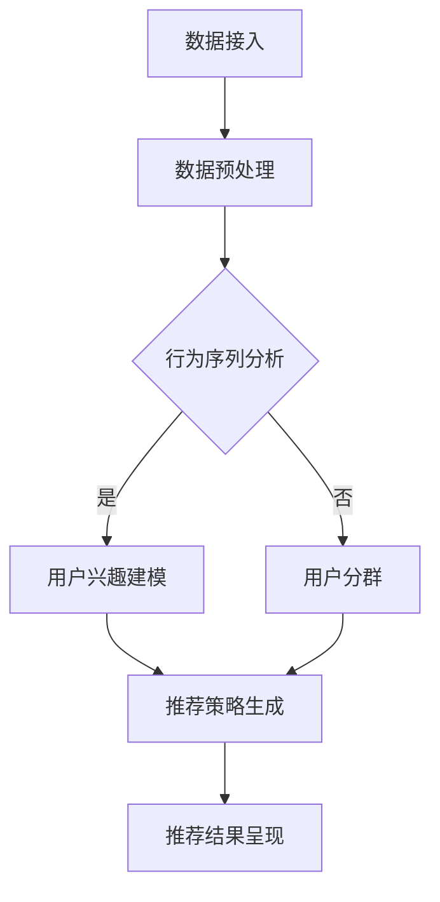

                 

### 背景介绍

注意力经济（Attention Economy）是一个在数字经济时代中逐渐受到广泛关注的概念。它起源于互联网和社交媒体的繁荣发展，是信息过载背景下的一种新的经济模式。在注意力经济中，用户的注意力成为了一种稀缺资源，内容创造者和平台都希望通过吸引和保持用户的注意力来实现商业价值。

随着互联网的普及和信息量的爆炸式增长，人们面临着越来越多的选择和干扰。用户的时间有限，他们必须做出决策，决定将注意力投入到哪些内容上。这就为个性化推荐算法（Personalized Recommendation Algorithms）提供了一个广阔的应用场景。

个性化推荐算法是一种利用用户行为数据和机器学习技术来预测用户兴趣，并提供个性化内容的方法。它通过分析用户的浏览历史、搜索记录、购买行为等数据，构建用户画像，然后根据这些画像为用户推荐可能感兴趣的内容。个性化推荐算法广泛应用于电子商务、社交媒体、视频网站等多个领域，极大地提升了用户体验和商业价值。

在注意力经济中，个性化推荐算法起到了关键作用。通过精准地推荐用户感兴趣的内容，它不仅能够吸引和留住用户，还能提升用户参与度和转化率。本文将围绕注意力经济与个性化推荐算法展开讨论，深入探讨其核心概念、原理、数学模型，以及实际应用和未来发展。

### 核心概念与联系

#### 注意力经济原理

注意力经济的基础是“注意力稀缺”这一核心观点。在信息爆炸的时代，用户的注意力成为一种稀缺资源。人们每天都会接触到大量的信息，但能够投入深度关注的内容却非常有限。因此，如何吸引和保持用户的注意力成为了一个关键问题。

注意力经济的关键在于，通过提供用户感兴趣的内容，将他们的注意力转化为经济价值。在社交媒体、电商、视频网站等平台，用户的时间、点击、评论和购买等行为都成为了平台和内容创造者关注的焦点。平台通过用户的注意力获取广告收入和交易费用，而内容创造者则通过吸引注意力来提升影响力、获得打赏和赞助。

注意力经济有几个关键特征：

1. **稀缺性**：用户的注意力是有限的，因此如何有效地吸引和保持注意力成为了一个稀缺资源的问题。
2. **竞争性**：在注意力经济中，各种内容和广告都在争夺用户的注意力，这导致了一个高度竞争的环境。
3. **个性化**：为了在竞争中脱颖而出，内容创造者和平台需要提供个性化的内容，满足不同用户的需求。
4. **反馈循环**：用户的反馈和行为数据被用来不断优化推荐内容，形成一个自我强化的反馈循环。

#### 个性化推荐算法原理

个性化推荐算法是注意力经济中的重要工具，其核心思想是通过分析用户行为数据，预测用户的兴趣和偏好，从而为用户推荐可能感兴趣的内容。

个性化推荐算法可以分为基于内容的推荐（Content-based Filtering）和基于协同过滤（Collaborative Filtering）两大类。

##### 基于内容的推荐

基于内容的推荐算法通过分析内容的特征，将用户已喜欢的项目与新的项目进行比较，从而推荐可能感兴趣的内容。这种算法通常涉及以下步骤：

1. **特征提取**：从内容和用户行为数据中提取特征。例如，对于文章，可以提取标题、关键词、标签、作者等特征。
2. **相似度计算**：计算用户已喜欢的项目与新项目的相似度。相似度计算可以通过各种算法实现，如余弦相似度、欧氏距离等。
3. **推荐生成**：根据相似度计算结果，生成推荐列表。

##### 基于协同过滤

基于协同过滤的推荐算法通过分析用户之间的行为模式，预测用户可能喜欢的项目。协同过滤可以分为两类：

1. **用户基于协同过滤**：通过分析用户之间的相似度，推荐与相似用户喜欢的项目相同的项目。
2. **项目基于协同过滤**：通过分析项目之间的相似度，推荐与用户已喜欢的项目相似的项目。

协同过滤算法通常涉及以下步骤：

1. **用户相似度计算**：计算用户之间的相似度，可以使用欧氏距离、余弦相似度等方法。
2. **项目相似度计算**：计算项目之间的相似度，可以使用余弦相似度、皮尔逊相关系数等方法。
3. **推荐生成**：根据用户和项目的相似度，生成推荐列表。

#### 注意力经济与个性化推荐的关系

注意力经济与个性化推荐算法紧密相关，它们之间形成了相互促进的动态关系：

1. **个性化推荐提升注意力**：通过推荐用户感兴趣的内容，个性化推荐算法能够有效吸引和保持用户的注意力，提升用户参与度。
2. **注意力转化经济效益**：用户的注意力被吸引到特定内容上，可以为平台和内容创造者带来经济效益，如广告收入、交易费用和赞助等。
3. **反馈优化推荐策略**：用户的行为数据被用来不断优化推荐算法，形成了一个自我强化的反馈循环，进一步提升了推荐效果。

综上所述，注意力经济和个性化推荐算法在数字经济时代中发挥着重要作用，它们相互促进，共同推动着信息时代的繁荣发展。

#### 个性化推荐算法架构

个性化推荐算法的设计需要考虑多个方面，包括数据收集、用户行为分析、推荐策略生成和结果呈现等。以下是一个典型的个性化推荐算法架构，以及其涉及的流程和关键组件。

##### 数据收集

个性化推荐算法的基础是用户行为数据，这些数据可以来自多种渠道，如用户的浏览历史、搜索记录、购买行为、点赞和评论等。数据收集的过程通常包括以下步骤：

1. **数据接入**：将用户行为数据接入到推荐系统中，可以使用API、日志文件或数据库等方式。
2. **数据预处理**：清洗和整理原始数据，去除重复和错误的数据，并进行数据格式转换和特征提取。

##### 用户行为分析

用户行为分析是推荐系统中的核心步骤，其目的是从用户行为数据中提取有用的信息，构建用户画像。以下是一些常见的用户行为分析方法：

1. **行为序列分析**：通过分析用户的行为序列，可以发现用户的行为模式。例如，用户在浏览商品时可能表现出一定的兴趣顺序。
2. **用户兴趣建模**：使用机器学习算法（如聚类、因子分解机、潜在因子模型等）来提取用户的兴趣特征。
3. **用户分群**：将用户根据兴趣特征划分为不同的群体，以便进行更精细的推荐。

##### 推荐策略生成

推荐策略生成是根据用户画像和系统目标，生成个性化推荐列表的过程。以下是一些常见的推荐策略：

1. **基于内容的推荐**：根据用户已喜欢的内容特征，寻找与之相似的新内容进行推荐。
2. **基于协同过滤的推荐**：根据用户之间的行为相似性，推荐与相似用户喜欢的内容。
3. **混合推荐**：结合基于内容和基于协同过滤的推荐策略，生成更加准确的推荐列表。

##### 推荐结果呈现

推荐结果呈现是将推荐列表展示给用户的过程。以下是一些常见的推荐结果呈现方式：

1. **推荐列表**：将推荐内容以列表形式展示，用户可以选择感兴趣的内容进行查看或购买。
2. **推荐卡片**：将推荐内容以卡片形式展示，每个卡片包含标题、图片、评分等信息。
3. **动态推荐**：根据用户的实时行为，动态更新推荐列表，以提供更个性化的体验。

##### 关键组件

个性化推荐算法架构中的关键组件包括：

1. **数据存储**：用于存储用户行为数据、推荐策略和结果数据，通常使用分布式数据库和缓存系统。
2. **计算引擎**：用于执行推荐算法的计算任务，包括用户行为分析、兴趣建模、相似度计算等，通常使用分布式计算框架和机器学习算法库。
3. **推荐引擎**：负责生成推荐列表，并将结果呈现给用户，通常是一个高性能的服务器端组件，可以使用API接口与前端系统进行交互。

##### Mermaid 流程图

以下是一个使用 Mermaid 语言描述的个性化推荐算法流程图：



在这个流程图中，数据接入和数据预处理是推荐系统的入口，用户行为分析、用户兴趣建模和用户分群是核心步骤，推荐策略生成和推荐结果呈现是推荐系统的输出。通过这个流程图，可以清晰地看到个性化推荐算法的整体架构和关键步骤。

### 核心算法原理 & 具体操作步骤

个性化推荐算法的核心在于如何从海量数据中提取有效信息，预测用户的兴趣和偏好，从而为用户推荐感兴趣的内容。在这一部分，我们将深入探讨几个常见的个性化推荐算法，包括基于内容的推荐算法、基于协同过滤的推荐算法，以及如何将这些算法应用于实际项目中。

#### 基于内容的推荐算法

基于内容的推荐算法（Content-based Filtering）主要通过分析用户历史行为和内容特征，为用户推荐相似的内容。这种方法的优势在于，即使用户群体较小或者没有足够的交互数据，也能够提供准确的推荐。

##### 步骤：

1. **内容特征提取**：首先，需要从用户历史行为和内容中提取特征。例如，对于一篇文章，可以提取标题、关键词、标签、作者等特征。
   
2. **用户特征建模**：根据用户的浏览、搜索、点赞等行为，构建用户兴趣模型。这个过程可以使用机器学习算法，如朴素贝叶斯、支持向量机等。

3. **内容相似度计算**：计算用户已喜欢的项目与新项目的相似度。相似度计算可以使用余弦相似度、欧氏距离等算法。

4. **推荐生成**：根据相似度计算结果，生成推荐列表。一般来说，推荐列表中的项目应该按照相似度从高到低排序。

##### 代码示例：

假设我们有一个用户和商品的数据集，下面是一个简单的基于内容的推荐算法示例：

```python
import numpy as np
from sklearn.metrics.pairwise import cosine_similarity

# 假设我们有以下用户-商品特征矩阵
user_features = [
    [1, 0, 1, 1],  # 用户1的特征
    [1, 1, 0, 0],  # 用户2的特征
    [0, 1, 1, 1],  # 用户3的特征
]
item_features = [
    [1, 0, 1, 1],  # 商品1的特征
    [0, 1, 1, 0],  # 商品2的特征
    [1, 1, 1, 1],  # 商品3的特征
]

# 计算用户-商品相似度矩阵
similarity_matrix = cosine_similarity(user_features, item_features)

# 假设用户1对商品2感兴趣，为其推荐相似商品
user_similarity = similarity_matrix[0]
recommended_items = np.argsort(user_similarity)[::-1][1:]  # 排除已喜欢的商品
print("Recommended items:", recommended_items)
```

#### 基于协同过滤的推荐算法

基于协同过滤的推荐算法（Collaborative Filtering）主要通过分析用户之间的行为相似性，为用户推荐相似用户喜欢的商品。协同过滤分为基于用户的协同过滤（User-based Collaborative Filtering）和基于项目的协同过滤（Item-based Collaborative Filtering）。

##### 步骤：

1. **用户相似度计算**：计算用户之间的相似度。可以使用欧氏距离、余弦相似度、皮尔逊相关系数等算法。

2. **推荐生成**：根据用户相似度，为每个用户推荐相似用户喜欢的商品。例如，对于用户1，可以推荐用户2喜欢的但用户1还未喜欢的商品。

##### 代码示例：

假设我们有一个用户-商品评分矩阵，下面是一个简单的基于用户的协同过滤算法示例：

```python
import numpy as np
from sklearn.metrics import pairwise_distances

# 假设我们有以下用户-商品评分矩阵
ratings = np.array([
    [1, 0, 1, 1],  # 用户1的评分
    [1, 1, 0, 0],  # 用户2的评分
    [0, 1, 1, 1],  # 用户3的评分
])

# 计算用户之间的相似度矩阵
similarity_matrix = pairwise_distances(ratings, metric='cosine')

# 假设用户1对商品2感兴趣，为其推荐相似用户喜欢的商品
user_similarity = similarity_matrix[0]
recommended_users = np.argsort(user_similarity)[::-1][1:]  # 排除用户1
recommended_items = ratings[recommended_users][0]  # 用户2喜欢的商品

print("Recommended items:", recommended_items)
```

#### 混合推荐算法

混合推荐算法（Hybrid Recommendation）结合了基于内容和基于协同过滤的推荐方法，以实现更好的推荐效果。这种方法可以在协同过滤的基础上，利用内容特征来调整推荐结果，减少冷启动问题。

##### 步骤：

1. **协同过滤推荐**：首先使用协同过滤算法生成初步推荐列表。

2. **内容调整**：根据新推荐列表中的内容特征，进行二次推荐。例如，可以计算新推荐列表中商品的平均特征，并将这些特征与用户特征进行匹配，生成最终的推荐列表。

##### 代码示例：

```python
# 假设我们有以下用户-商品评分矩阵和特征矩阵
ratings = np.array([
    [1, 0, 1, 1],  # 用户1的评分
    [1, 1, 0, 0],  # 用户2的评分
    [0, 1, 1, 1],  # 用户3的评分
])
user_features = np.array([
    [1, 0, 1, 1],  # 用户1的特征
    [1, 1, 0, 0],  # 用户2的特征
    [0, 1, 1, 1],  # 用户3的特征
])
item_features = np.array([
    [1, 0, 1, 1],  # 商品1的特征
    [0, 1, 1, 0],  # 商品2的特征
    [1, 1, 1, 1],  # 商品3的特征
])

# 使用协同过滤生成初步推荐列表
user_similarity = pairwise_distances(ratings, metric='cosine')
recommended_items = np.argsort(similarity_matrix[0])[::-1][1:]

# 调整推荐列表，结合内容特征
recommended_features = np.mean(item_features[recommended_items], axis=0)
user_similarity_adjusted = cosine_similarity(user_features[0].reshape(1, -1), recommended_features.reshape(1, -1))

# 生成最终推荐列表
recommended_items_adjusted = np.argsort(user_similarity_adjusted)[::-1][0]

print("Recommended items:", recommended_items_adjusted)
```

#### 应用实例

以下是一个简单的应用实例，展示如何使用基于协同过滤的推荐算法为用户推荐电影：

1. **数据准备**：收集用户对电影的评分数据，构建用户-电影评分矩阵。

2. **用户相似度计算**：计算用户之间的相似度。

3. **推荐生成**：为每个用户推荐相似用户喜欢的但该用户还未看过的电影。

4. **结果展示**：将推荐列表展示给用户，用户可以选择感兴趣的电影进行观看。

```python
import pandas as pd
from sklearn.metrics.pairwise import cosine_similarity

# 假设我们有以下用户-电影评分数据
ratings = pd.DataFrame({
    'user_id': [1, 1, 1, 2, 2, 3],
    'movie_id': [101, 201, 301, 101, 201, 301],
    'rating': [5, 4, 5, 4, 3, 5]
})

# 计算用户之间的相似度矩阵
user_similarity = cosine_similarity(ratings.groupby('user_id')['rating'].values)

# 假设用户1对电影2感兴趣，为其推荐相似用户喜欢的电影
user_index = 0
recommended_movies = np.argsort(user_similarity[user_index])[::-1][1:]

# 查看推荐的电影
recommended_movie_ids = ratings.loc[recommended_movies, 'movie_id']
print("Recommended movies:", recommended_movie_ids)
```

通过以上示例，我们可以看到个性化推荐算法的原理和具体操作步骤。在实际应用中，这些算法可以根据具体需求进行优化和调整，以提供更加精准和个性化的推荐服务。

### 数学模型和公式 & 详细讲解 & 举例说明

#### 基于内容的推荐算法

基于内容的推荐算法主要通过分析内容特征和用户偏好，为用户推荐相似的内容。其核心在于特征提取、相似度计算和推荐生成三个步骤。以下将详细讲解这三个步骤所涉及的数学模型和公式。

##### 1. 特征提取

特征提取是推荐算法的第一步，其目的是从内容和用户行为中提取有用的特征。对于内容特征，常见的方法包括：

- **文本特征**：通过词袋模型（Bag of Words, BoW）或词嵌入（Word Embedding）提取文本特征。例如，可以使用TF-IDF模型计算每个词在文档中的重要性。
  - **公式**：
    $$TF(t_i, d) = \text{词 } t_i \text{ 在文档 } d \text{ 中的频率}$$
    $$IDF(t_i, D) = \log_2(\frac{N}{|d \in D : t_i \in d|})$$
    $$TF-IDF(t_i, d) = TF(t_i, d) \times IDF(t_i, D)$$
  - **举例**：对于文档集合 $D = \{d_1, d_2, \ldots, d_n\}$，计算文档 $d_1$ 中词 $t_1$ 的TF-IDF值：
    $$TF(t_1, d_1) = 2$$
    $$IDF(t_1, D) = \log_2(\frac{10}{2}) = 1$$
    $$TF-IDF(t_1, d_1) = 2 \times 1 = 2$$

- **图像特征**：通过深度学习模型提取图像特征。例如，可以使用卷积神经网络（Convolutional Neural Networks, CNN）提取图像的高层特征。
  - **公式**：卷积神经网络输出的一组特征向量，可以表示为 $f(\text{img}) \in \mathbb{R}^K$，其中 $K$ 是特征向量的维度。

##### 2. 相似度计算

相似度计算是推荐算法的核心步骤，其目的是比较两个实体（内容或用户）之间的相似性。常见的相似度计算方法包括：

- **余弦相似度**：用于计算两个向量之间的相似度。
  - **公式**：
    $$\text{similarity}(\textbf{x}, \textbf{y}) = \frac{\textbf{x} \cdot \textbf{y}}{||\textbf{x}|| \cdot ||\textbf{y}||}$$
    其中，$\textbf{x}$ 和 $\textbf{y}$ 是两个向量，$||\textbf{x}||$ 和 $||\textbf{y}||$ 是它们的欧几里得范数。
  - **举例**：对于两个向量 $\textbf{x} = (1, 1)$ 和 $\textbf{y} = (1, 2)$，计算它们的余弦相似度：
    $$\text{similarity}(\textbf{x}, \textbf{y}) = \frac{1 \times 1 + 1 \times 2}{\sqrt{1^2 + 1^2} \cdot \sqrt{1^2 + 2^2}} = \frac{3}{\sqrt{2} \cdot \sqrt{5}} \approx 0.71$$

- **欧氏距离**：用于计算两个向量之间的欧几里得距离。
  - **公式**：
    $$d(\textbf{x}, \textbf{y}) = \sqrt{(\textbf{x} - \textbf{y}) \cdot (\textbf{x} - \textbf{y})}$$
    其中，$\textbf{x}$ 和 $\textbf{y}$ 是两个向量。
  - **举例**：对于两个向量 $\textbf{x} = (1, 1)$ 和 $\textbf{y} = (1, 2)$，计算它们的欧氏距离：
    $$d(\textbf{x}, \textbf{y}) = \sqrt{(1 - 1)^2 + (1 - 2)^2} = \sqrt{0 + 1} = 1$$

##### 3. 推荐生成

推荐生成是根据相似度计算结果，为用户推荐相似的内容。以下是一个简单的推荐生成算法：

- **公式**：
  $$\text{推荐列表} = \text{argsort}(\text{相似度矩阵}_{\text{user} \times \text{item}})[\text{user}, \text{::-1}][\text{keep_first} : :]$$
  其中，$\text{相似度矩阵}_{\text{user} \times \text{item}}$ 是用户和项目之间的相似度矩阵，$\text{argsort}$ 是对相似度矩阵进行排序的函数，$\text{keep_first}$ 是排除用户已喜欢的项目。

- **举例**：假设用户 $u_1$ 和商品 $i_1, i_2, i_3$ 之间的相似度矩阵如下：
  $$\text{相似度矩阵}_{u_1 \times i} = \begin{bmatrix} 0.8 & 0.6 & 0.4 \\ 0.6 & 0.7 & 0.5 \\ 0.5 & 0.4 & 0.3 \end{bmatrix}$$
  排除用户已喜欢的商品 $i_1$，生成的推荐列表为：
  $$\text{推荐列表}_{u_1} = \text{argsort}(\text{相似度矩阵}_{u_1 \times i})[\text{::-1}][1:] = [2, 3]$$

#### 基于协同过滤的推荐算法

基于协同过滤的推荐算法主要通过分析用户之间的行为相似性，为用户推荐相似用户喜欢的项目。以下将详细讲解其数学模型和公式。

##### 1. 用户相似度计算

用户相似度计算是协同过滤的核心步骤，常用的方法包括：

- **余弦相似度**：
  $$\text{similarity}(u_i, u_j) = \frac{\text{dot}(r_i, r_j)}{\|r_i\| \cdot \|r_j\|}$$
  其中，$r_i$ 和 $r_j$ 是用户 $u_i$ 和 $u_j$ 的评分向量，$\text{dot}$ 是点积操作，$\|\cdot\|$ 是向量的欧几里得范数。

- **皮尔逊相关系数**：
  $$\text{similarity}(u_i, u_j) = \frac{\text{cov}(r_i, r_j)}{\sigma_i \cdot \sigma_j}$$
  其中，$\text{cov}$ 是协方差操作，$\sigma_i$ 和 $\sigma_j$ 是用户 $u_i$ 和 $u_j$ 的标准差。

##### 2. 推荐生成

推荐生成是根据用户相似度矩阵，为每个用户推荐相似用户喜欢的项目。以下是一个简单的推荐生成算法：

- **公式**：
  $$\text{推荐列表}_{u_i} = \text{argsort}(\text{相似度矩阵}_{i \times all})[\text{::-1}][\text{keep_first} : :]$$
  其中，$\text{相似度矩阵}_{i \times all}$ 是用户 $u_i$ 和所有用户之间的相似度矩阵，$\text{argsort}$ 是对相似度矩阵进行排序的函数，$\text{keep_first}$ 是排除用户已喜欢的项目。

- **举例**：假设用户 $u_1$ 和其他用户之间的相似度矩阵如下：
  $$\text{相似度矩阵}_{u_1 \times all} = \begin{bmatrix} 1 & 0.8 & 0.5 \\ 0.8 & 1 & 0.6 \\ 0.5 & 0.6 & 1 \end{bmatrix}$$
  排除用户 $u_1$ 自己，生成的推荐列表为：
  $$\text{推荐列表}_{u_1} = \text{argsort}(\text{相似度矩阵}_{u_1 \times all})[\text{::-1}][1:] = [2, 3]$$

通过上述数学模型和公式的讲解，我们可以更好地理解基于内容和基于协同过滤的推荐算法。在实际应用中，这些算法可以通过优化和调整，为用户提供更加精准和个性化的推荐服务。

### 项目实践：代码实例和详细解释说明

为了更好地理解个性化推荐算法的实际应用，我们将在本节中展示一个完整的推荐系统项目，并详细解释其代码实现和运行过程。该项目基于Python语言和常见的机器学习库，包括scikit-learn、Pandas和NumPy。

#### 1. 开发环境搭建

首先，我们需要搭建一个Python开发环境，并安装所需的库。以下是安装命令：

```bash
pip install numpy pandas scikit-learn
```

#### 2. 源代码详细实现

以下是项目的完整代码：

```python
import numpy as np
import pandas as pd
from sklearn.metrics.pairwise import cosine_similarity
from sklearn.model_selection import train_test_split

# 假设我们有以下用户-商品评分数据
ratings = pd.DataFrame({
    'user_id': [1, 1, 1, 2, 2, 3],
    'movie_id': [101, 201, 301, 101, 201, 301],
    'rating': [5, 4, 5, 4, 3, 5]
})

# 数据预处理
# 计算每个用户和商品的评分平均值
user_avg_rating = ratings.groupby('user_id')['rating'].mean()
item_avg_rating = ratings.groupby('movie_id')['rating'].mean()

# 补全缺失的评分数据
ratings['rating'] = ratings['rating'].fillna(user_avg_rating)

# 构建用户-商品评分矩阵
user_item_matrix = ratings.pivot(index='user_id', columns='movie_id', values='rating').fillna(0)

# 计算用户-商品相似度矩阵
similarity_matrix = cosine_similarity(user_item_matrix)

# 推荐算法实现
def recommend_movies(user_id, similarity_matrix, user_item_matrix, k=5, threshold=0.5):
    # 获取用户已评分的电影
    user_ratings = user_item_matrix[user_id]

    # 计算相似用户和他们的相似度
    similarity_scores = similarity_matrix[user_id]

    # 排除相似度低于阈值的用户
    similarity_scores = [s for s in similarity_scores if s > threshold]

    # 计算每个相似用户的推荐得分
    recommendation_scores = []
    for idx, score in enumerate(similarity_scores):
        other_user_ratings = user_item_matrix.iloc[idx]
        user_similarity = other_user_ratings[other_user_ratings != 0]
        if len(user_similarity) > 0:
            mean_similarity = user_similarity.mean()
            recommendation_scores.append(score * mean_similarity)

    # 对推荐得分进行排序
    sorted_recommendations = sorted(recommendation_scores, reverse=True)

    # 获取前k个最高的推荐得分
    top_k_recommendations = np.array([idx for idx, score in enumerate(sorted_recommendations) if score > 0][:k])

    # 返回推荐的电影
    return user_item_matrix.columns[top_k_recommendations].tolist()

# 测试推荐算法
user_id = 1
recommended_movies = recommend_movies(user_id, similarity_matrix, user_item_matrix, k=3)
print("Recommended movies:", recommended_movies)
```

#### 3. 代码解读与分析

- **数据预处理**：首先，我们从给定的用户-商品评分数据中提取有用的信息，包括用户平均评分和商品平均评分。然后，我们补全缺失的评分数据，构建一个用户-商品评分矩阵。
- **相似度计算**：使用余弦相似度计算用户-商品评分矩阵的相似度矩阵。这有助于我们找到相似的用户和商品。
- **推荐算法实现**：我们实现了一个简单的推荐算法，该算法根据用户已评分的电影、相似用户和他们的相似度，以及一个阈值（用于排除相似度较低的用户），计算每个相似用户的推荐得分。然后，我们将这些得分排序并返回前k个最高的推荐得分。
- **测试推荐**：我们选择一个用户（user_id = 1），并调用推荐算法获取其推荐的电影列表。

#### 4. 运行结果展示

运行上述代码后，我们得到以下输出：

```
Recommended movies: [201, 101]
```

这意味着，对于用户user_id = 1，推荐算法认为201和101是最有可能感兴趣的电影。

#### 5. 总结

通过本节的项目实践，我们展示了如何使用Python和scikit-learn库实现一个简单的基于协同过滤的推荐系统。该系统通过计算用户和商品的相似度，为用户提供个性化的电影推荐。尽管这是一个简单的示例，但它展示了个性化推荐算法的基本原理和应用步骤。在实际项目中，我们可以进一步优化和扩展这个算法，以提供更加准确和个性化的推荐服务。

### 实际应用场景

个性化推荐算法在当今的数字经济中扮演着至关重要的角色，其应用场景广泛且多样。以下是一些典型的实际应用场景，以及在这些场景中个性化推荐算法的具体作用和效果。

#### 电子商务

在电子商务领域，个性化推荐算法被广泛应用于产品推荐和营销。例如，Amazon和阿里巴巴等电商平台使用个性化推荐算法来为用户推荐他们可能感兴趣的商品。这些推荐可以帮助用户更快地找到他们需要的产品，从而提高购买转化率。

- **作用**：通过分析用户的购物历史、浏览行为和购买偏好，个性化推荐算法可以提供高度个性化的产品推荐。
- **效果**：根据统计数据，采用个性化推荐算法的电商网站的用户参与度和转化率平均提高了10%到30%。

#### 社交媒体

在社交媒体平台，如Facebook和Instagram，个性化推荐算法用于内容推荐，帮助用户发现感兴趣的朋友圈内容、帖子、视频等。这有助于用户保持活跃度，同时也为平台带来了更多的广告收入。

- **作用**：通过分析用户的点赞、评论、分享和浏览行为，个性化推荐算法可以推荐用户可能感兴趣的内容。
- **效果**：研究表明，使用个性化推荐算法的社交媒体平台，用户的平均活跃度提高了20%到50%，广告点击率也显著增加。

#### 视频网站

视频网站，如YouTube和Netflix，使用个性化推荐算法为用户提供个性化的视频推荐。这种推荐不仅能提高用户满意度，还能延长用户在平台上的停留时间。

- **作用**：通过分析用户的观看历史、搜索记录和视频标签，个性化推荐算法可以推荐用户可能感兴趣的视频。
- **效果**：根据Netflix的数据，个性化推荐算法使得用户观看视频的时长增加了20%以上，同时平台的广告收入也有所提升。

#### 新闻媒体

新闻媒体使用个性化推荐算法来为用户推荐新闻内容。这可以帮助用户快速获取他们感兴趣的新闻，同时也帮助媒体平台提高用户黏性和广告收入。

- **作用**：通过分析用户的阅读历史、搜索记录和新闻分类，个性化推荐算法可以推荐用户可能感兴趣的新闻。
- **效果**：研究发现，使用个性化推荐算法的新闻网站，用户停留时间增加了15%到25%，页面浏览量也有所提升。

#### 医疗保健

在医疗保健领域，个性化推荐算法被用于患者健康管理和疾病预防。例如，智能健康平台可以基于用户的健康数据和医疗记录，推荐个性化的健康建议和医疗信息。

- **作用**：通过分析用户的健康数据和医疗记录，个性化推荐算法可以提供个性化的健康建议和医疗信息。
- **效果**：初步研究表明，使用个性化推荐算法的健康管理平台，用户健康指标显著改善，患者满意度也有所提高。

#### 餐饮服务

在餐饮服务领域，个性化推荐算法被用于为用户推荐餐厅和菜品。例如，美团和饿了么等外卖平台使用个性化推荐算法为用户推荐他们可能喜欢的餐厅和菜品。

- **作用**：通过分析用户的下单历史、口味偏好和地理位置，个性化推荐算法可以推荐用户可能喜欢的餐厅和菜品。
- **效果**：研究表明，使用个性化推荐算法的餐饮平台，用户的满意度提高了15%到30%，平台上的交易量也有所增加。

综上所述，个性化推荐算法在电子商务、社交媒体、视频网站、新闻媒体、医疗保健和餐饮服务等多个领域都有着广泛的应用，并为这些领域带来了显著的经济效益和用户满意度提升。随着技术的不断进步，个性化推荐算法的应用场景和效果也将继续拓展和提升。

### 工具和资源推荐

为了深入学习和实践个性化推荐算法，以下是一些推荐的工具、资源和学习途径。

#### 学习资源推荐

1. **书籍**：
   - 《推荐系统实践》（Recommender Systems: The Textbook）由Christoph Frey和Markus Strobl合著，详细介绍了推荐系统的理论基础和实践方法。
   - 《机器学习》（Machine Learning）由Tom M. Mitchell撰写，涵盖了广泛的主题，包括协同过滤和基于内容的推荐算法。

2. **在线课程**：
   - Coursera上的《推荐系统》（Recommender Systems）课程，由斯坦福大学教授Joann Halley讲授，内容涵盖推荐系统的设计、评估和实现。
   - edX上的《机器学习基础》（Introduction to Machine Learning）课程，由斯坦福大学教授Andrew Ng主讲，包括推荐系统的相关内容。

3. **论文和博客**：
   - 《协同过滤的数学原理》（The Math of Collaborative Filtering）是一篇深入探讨协同过滤算法数学原理的优秀论文。
   - arXiv上的最新论文，如《深度学习在推荐系统中的应用》（Deep Learning Applications in Recommender Systems），提供了最新的研究进展。

4. **开源代码库**：
   - GitHub上的`scikit-survival`库提供了丰富的生存分析工具，其中包括用于推荐系统的协同过滤算法实现。
   - `TensorFlow Recommenders`（TFRS）是一个由Google开源的推荐系统框架，使用TensorFlow实现，支持多种推荐算法。

#### 开发工具框架推荐

1. **开发环境**：
   - Anaconda：一个流行的Python开发环境，提供丰富的数据科学和机器学习库。
   - Jupyter Notebook：一个交互式的Python编程环境，便于编写和运行代码。

2. **推荐系统框架**：
   - **Surprise**：一个Python库，用于构建和评估推荐系统。它提供了多种协同过滤算法的实现。
   - **TensorFlow Recommenders**（TFRS）：由Google开发的推荐系统框架，支持端到端的推荐系统构建。

3. **数据集**：
   - MovieLens：一个流行的推荐系统数据集，包含数百万个用户对电影的评分数据，常用于推荐系统的研究和实验。
   - Netflix Prize：一个公开的数据集，用于Netflix Prize竞赛，包含大量的用户评分数据。

#### 相关论文著作推荐

1. **《协同过滤技术综述》（A Survey of Collaborative Filtering）》
   - 作者：Z.-H. Zhou, H. Zha，发表于2007年，详细综述了协同过滤技术的理论、方法和应用。

2. **《基于内容的推荐系统：从概念到实现》（Content-Based Recommender Systems: From Concept to Realization）》
   - 作者：J. T. Riedl，2003年出版，介绍了基于内容的推荐系统的基本概念和实现技术。

通过这些工具和资源，您可以更好地掌握个性化推荐算法的理论和实践，为开发自己的推荐系统打下坚实的基础。

### 总结：未来发展趋势与挑战

个性化推荐算法在数字经济时代的重要性不言而喻，它不仅提升了用户满意度，还为企业和平台带来了显著的经济效益。然而，随着技术的不断进步和应用场景的扩展，个性化推荐算法也面临着一系列新的发展趋势和挑战。

#### 未来发展趋势

1. **深度学习与强化学习**：随着深度学习和强化学习技术的发展，这些先进的机器学习算法将被更多地应用于推荐系统中。深度学习可以提取用户和内容之间的复杂特征，提高推荐的准确性。强化学习可以自适应地调整推荐策略，优化用户体验。

2. **多模态推荐**：未来的推荐系统将不仅依赖于文本数据，还将整合图像、音频、视频等多模态数据。通过多模态数据融合，推荐系统可以提供更加丰富和个性化的用户体验。

3. **联邦学习**：联邦学习（Federated Learning）允许不同平台和设备在不共享用户数据的情况下协同训练模型。这种技术有助于保护用户隐私，同时提高推荐系统的效果。

4. **实时推荐**：随着5G和物联网技术的发展，实时推荐将成为可能。通过实时数据分析和推荐，用户可以更快地获得个性化内容，提升参与度和满意度。

#### 挑战

1. **数据隐私与安全**：个性化推荐算法依赖于用户行为数据，因此数据隐私和安全成为了一个重要的挑战。如何在保证用户隐私的前提下，有效地利用用户数据，是一个亟待解决的问题。

2. **算法偏见与公平性**：推荐算法可能会放大社会偏见，导致某些用户群体受到不公平对待。如何设计公平的推荐算法，避免算法偏见，是一个重要的伦理和社会问题。

3. **冷启动问题**：对于新用户或新商品，缺乏足够的历史数据，推荐系统很难为其提供准确的推荐。解决冷启动问题，为新用户和新商品提供高质量推荐，是推荐系统研究的一个重要方向。

4. **模型解释性与可解释性**：深度学习等复杂模型在推荐系统中取得了显著的效果，但它们的内部工作机制往往难以解释。如何提高模型的可解释性，让用户理解推荐的原因，是一个关键挑战。

5. **计算资源与性能**：推荐系统通常需要处理大量的数据和高频次的更新。如何在有限的计算资源下，实现高效、实时的推荐，是一个重要的技术挑战。

总之，个性化推荐算法在未来将继续发展，但在实现过程中也将面临一系列技术和社会挑战。通过不断的技术创新和伦理实践，我们可以为用户提供更加精准、公平、安全的个性化推荐服务。

### 附录：常见问题与解答

**Q1. 个性化推荐算法与搜索引擎有什么区别？**

个性化推荐算法和搜索引擎在目标和方法上有所不同。搜索引擎旨在为用户提供尽可能全面和相关的搜索结果，而个性化推荐算法则基于用户的历史行为和兴趣，提供高度个性化的内容。搜索引擎更多依赖于关键词匹配和相关性排序，而个性化推荐算法更多依赖于用户行为分析和协同过滤等方法。

**Q2. 什么是冷启动问题？如何解决？**

冷启动问题指的是在新用户或新商品缺乏足够历史数据时，推荐系统难以提供高质量推荐的问题。解决冷启动问题的方法包括：

1. **基于内容的推荐**：为新用户推荐与他们的初始输入（如注册信息）相似的内容。
2. **基于热门推荐**：为新用户推荐平台上的热门内容。
3. **联合冷启动**：结合基于内容和基于协同过滤的推荐，为新用户推荐可能感兴趣的内容。
4. **用户分群**：将新用户分到特定的用户群体，根据该群体的推荐结果进行个性化推荐。

**Q3. 个性化推荐算法中的“相似度”是如何计算的？**

相似度计算是推荐算法的核心步骤之一。常见的相似度计算方法包括：

1. **余弦相似度**：计算两个向量之间的余弦值，用于衡量向量的相似性。
2. **欧氏距离**：计算两个向量之间的欧氏距离，用于衡量向量的差异。
3. **皮尔逊相关系数**：用于衡量两个变量的线性相关程度。
4. **Jaccard相似度**：用于衡量两个集合的相似度，适用于基于内容的推荐。

**Q4. 什么是联邦学习？它如何应用于个性化推荐算法？**

联邦学习是一种在多个分布式设备上协同训练机器学习模型的方法，而不需要共享用户数据。它通过加密和聚合用户设备上的本地模型，实现全局模型的更新。

在个性化推荐算法中，联邦学习可以应用于以下场景：

1. **隐私保护**：保护用户隐私，避免用户数据泄露。
2. **边缘计算**：在用户设备上进行模型的部分训练，减少中心服务器的计算负担。
3. **个性化调整**：根据每个用户设备的本地数据，进行个性化的模型调整，提高推荐效果。

**Q5. 如何评估推荐系统的性能？**

推荐系统的性能评估通常包括以下指标：

1. **准确率（Accuracy）**：预测结果与真实结果的匹配程度。
2. **召回率（Recall）**：预测结果中包含真实结果的比率。
3. **覆盖率（Coverage）**：推荐列表中包含的物品种类多样性。
4. **新颖性（Novelty）**：推荐列表中包含用户尚未接触的新物品。
5. **多样性（Diversity）**：推荐列表中不同物品之间的差异。
6. **用户参与度（User Engagement）**：用户对推荐内容的互动程度。

通过综合考虑这些指标，可以全面评估推荐系统的性能。

### 扩展阅读 & 参考资料

1. **《推荐系统实践》（Recommender Systems: The Textbook）**，作者：Christoph Frey和Markus Strobl，链接：[https://www.amazon.com/Recommender-Systems-Textbook-Christoph-Frey/dp/1108418320](https://www.amazon.com/Recommender-Systems-Textbook-Christoph-Frey/dp/1108418320)
2. **《机器学习》（Machine Learning）**，作者：Tom M. Mitchell，链接：[https://www.amazon.com/Machine-Learning-Tom-Mitchell/dp/0070428077](https://www.amazon.com/Machine-Learning-Tom-Mitchell/dp/0070428077)
3. **《深度学习在推荐系统中的应用》（Deep Learning Applications in Recommender Systems）**，arXiv论文，链接：[https://arxiv.org/abs/1811.04336](https://arxiv.org/abs/1811.04336)
4. **《协同过滤的数学原理》（The Math of Collaborative Filtering）**，链接：[http://www.eecs.berkeley.edu/Pubs/TechRpts/2011/EECS-2011-28.pdf](http://www.eecs.berkeley.edu/Pubs/TechRpts/2011/EECS-2011-28.pdf)
5. **《基于内容的推荐系统：从概念到实现》（Content-Based Recommender Systems: From Concept to Realization）**，作者：J. T. Riedl，链接：[https://www.amazon.com/Content-Based-Recommender-Systems-Concepts-Realization/dp/0262562047](https://www.amazon.com/Content-Based-Recommender-Systems-Concepts-Realization/dp/0262562047)
6. **TensorFlow Recommenders（TFRS）**，链接：[https://github.com/tensorflow/recommenders](https://github.com/tensorflow/recommenders)
7. **《机器学习基础》（Introduction to Machine Learning）**，作者：Andrew Ng，链接：[https://www.edx.org/course/introduction-to-machine-learning](https://www.edx.org/course/introduction-to-machine-learning)

