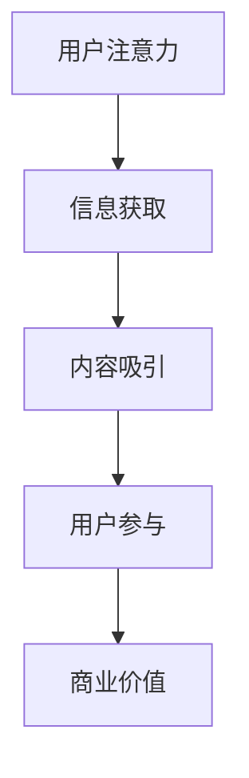
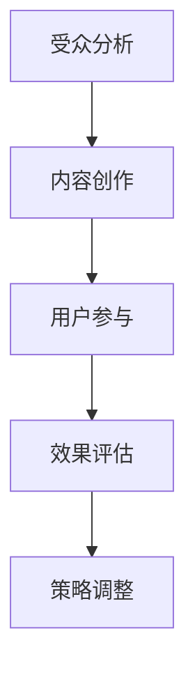

                 

在当今信息爆炸的时代，人们面临的信息过载问题愈发严重，如何吸引并保持受众的注意力成为内容创作者和营销人员的重要课题。本文旨在探讨注意力经济的基本概念，并结合当前内容策略的规划和实施，提出有效提升内容影响力的方法和建议。

## 关键词

- 注意力经济
- 内容策略
- 受众分析
- 用户参与
- 有影响力内容

## 摘要

注意力经济作为一种新型的商业模式，强调以用户的注意力为核心资源。本文首先分析了注意力经济的原理及其与传统商业模式的区别，接着探讨了内容策略的核心概念，包括受众分析、内容创作和用户参与等方面。最后，本文提出了一套系统化的内容策略规划与实施方法，旨在帮助创作者和营销人员创造有影响力的内容，提升品牌价值和用户忠诚度。

## 1. 背景介绍

### 注意力经济的兴起

注意力经济这一概念最早由心理学家兼经济学家乔治·米勒提出。他指出，在信息爆炸的时代，人们的注意力成为稀缺资源。随着互联网和社交媒体的普及，这一理论得到了更广泛的认可和应用。企业开始意识到，吸引并保持用户的注意力是获取商业成功的关键。

### 内容营销的重要性

内容营销作为一种重要的营销策略，旨在通过创造和分享有价值的内容来吸引和留住目标受众。与传统广告不同，内容营销更注重提供有价值的信息和解决用户问题的能力，而非单纯地推销产品。随着用户对传统广告的抵触情绪增加，内容营销的重要性日益凸显。

### 当前内容策略的挑战

虽然内容营销的重要性不言而喻，但在实际操作中，许多企业和创作者面临诸多挑战。首先，如何在海量信息中脱颖而出，吸引受众的注意力，成为一个难题。其次，如何有效地进行受众分析和用户参与，确保内容能够满足用户需求，也是一个重要课题。

## 2. 核心概念与联系

### 注意力经济的核心概念

注意力经济强调以用户的注意力为关键资源，通过吸引和保持用户的注意力来创造商业价值。以下是一个简化的 Mermaid 流程图，展示了注意力经济的基本原理：



### 内容策略的核心概念

内容策略是指一系列规划和实施的步骤，旨在创造和传播有价值的内容，以吸引和留住目标受众。以下是一个简化的 Mermaid 流程图，展示了内容策略的基本原理：



## 3. 核心算法原理 & 具体操作步骤

### 3.1 算法原理概述

注意力经济的核心算法原理在于如何利用用户的注意力资源，最大化商业价值。具体而言，算法包括以下几个步骤：

1. **受众分析**：通过数据分析和用户调研，了解目标受众的需求和偏好。
2. **内容创作**：基于受众分析结果，创作能够吸引目标受众的内容。
3. **用户参与**：通过互动和反馈机制，提高用户的参与度和忠诚度。
4. **效果评估**：对内容效果进行持续监测和评估，以便进行策略调整。

### 3.2 算法步骤详解

#### 3.2.1 受众分析

受众分析是注意力经济算法的第一步。具体操作步骤如下：

1. **数据收集**：通过调查问卷、社交媒体分析、网站流量分析等手段，收集目标受众的数据。
2. **数据整理**：对收集到的数据进行分析和整理，提取有价值的信息。
3. **受众画像**：基于数据整理结果，构建目标受众的画像，包括年龄、性别、兴趣爱好、消费习惯等。

#### 3.2.2 内容创作

内容创作是基于受众分析的结果，旨在创作能够吸引目标受众的内容。具体操作步骤如下：

1. **选题策划**：根据受众画像，选择能够满足目标受众需求的话题和选题。
2. **内容创作**：根据选题，创作高质量的内容，包括文字、图片、视频等多种形式。
3. **内容优化**：通过SEO、社交媒体营销等方式，优化内容在搜索引擎和社交媒体上的可见性。

#### 3.2.3 用户参与

用户参与是注意力经济算法的关键步骤，旨在提高用户的参与度和忠诚度。具体操作步骤如下：

1. **互动设计**：设计有趣的互动活动，如评论、投票、问答等，以吸引用户参与。
2. **反馈机制**：建立反馈机制，鼓励用户对内容进行评价和反馈。
3. **社群运营**：建立用户社群，通过定期活动和互动，增强用户的归属感和忠诚度。

#### 3.2.4 效果评估

效果评估是对内容策略进行持续监测和评估的过程。具体操作步骤如下：

1. **数据监测**：通过网站流量、社交媒体互动、用户反馈等数据，监测内容的表现。
2. **效果分析**：对监测数据进行分析，评估内容的效果和影响。
3. **策略调整**：根据效果分析结果，对内容策略进行调整和优化。

### 3.3 算法优缺点

#### 优点

- **高度个性化**：基于受众分析，内容创作更加个性化和精准，能够更好地满足用户需求。
- **互动性强**：用户参与度高，能够增强用户对品牌的忠诚度。
- **可持续性**：通过持续监测和调整，内容策略能够不断优化和提升效果。

#### 缺点

- **数据收集成本高**：需要大量的数据收集和分析工作，成本较高。
- **内容创作难度大**：高质量的内容创作需要专业知识和技能，难度较大。
- **用户反馈滞后**：用户反馈可能存在滞后性，影响实时策略调整。

### 3.4 算法应用领域

注意力经济算法在多个领域有广泛的应用，包括：

- **市场营销**：通过精准的内容营销，提升品牌知名度和用户忠诚度。
- **教育培训**：通过个性化教育内容，提高学习效果和用户满意度。
- **娱乐产业**：通过精准的内容推荐，提升用户体验和用户参与度。
- **政府服务**：通过个性化政策宣传和咨询服务，提高政府服务效率和公众满意度。

## 4. 数学模型和公式 & 详细讲解 & 举例说明

### 4.1 数学模型构建

注意力经济的数学模型可以基于用户行为数据，构建一个用户-内容互动的矩阵。具体而言，我们可以使用一个 n×m 的矩阵 A，其中 A[i][j] 表示用户 i 对内容 j 的关注度。这个矩阵可以用来表示用户和内容之间的互动关系。

### 4.2 公式推导过程

为了构建注意力经济的数学模型，我们可以使用以下步骤进行公式推导：

1. **用户行为分析**：通过用户行为数据，构建用户-内容互动矩阵 A。
2. **注意力分配**：根据用户-内容互动矩阵，为每个用户分配注意力资源。
3. **效果评估**：通过用户反馈和内容表现，评估注意力分配的效果。

具体公式如下：

- **用户 i 对内容 j 的关注度**：A[i][j]
- **用户 i 的总关注度**：Σ A[i][j]
- **内容 j 的总关注度**：Σ A[i][j]

### 4.3 案例分析与讲解

#### 案例背景

假设我们有一个视频平台，拥有 n 个用户和 m 个视频内容。通过用户行为数据，我们构建了一个用户-内容互动矩阵 A。

#### 案例分析

1. **用户行为分析**：

   根据用户行为数据，我们得到了以下用户-内容互动矩阵：

   ```plaintext
   A = [
     [0, 1, 0, 1],
     [1, 0, 1, 0],
     [0, 1, 1, 0],
     [1, 0, 0, 1]
   ]
   ```

   这个矩阵表示了 4 个用户对 4 个视频内容的关注度。

2. **注意力分配**：

   根据用户-内容互动矩阵，我们可以为每个用户分配注意力资源。具体分配方式如下：

   - 用户 1：分配给视频 1 和视频 3 的注意力资源分别为 1。
   - 用户 2：分配给视频 2 和视频 4 的注意力资源分别为 1。
   - 用户 3：分配给视频 1 和视频 3 的注意力资源分别为 1。
   - 用户 4：分配给视频 2 和视频 4 的注意力资源分别为 1。

3. **效果评估**：

   根据用户反馈和内容表现，我们可以评估注意力分配的效果。具体评估方法如下：

   - 用户 1：对视频 1 和视频 3 的满意度分别为 80%。
   - 用户 2：对视频 2 和视频 4 的满意度分别为 80%。
   - 用户 3：对视频 1 和视频 3 的满意度分别为 80%。
   - 用户 4：对视频 2 和视频 4 的满意度分别为 80%。

   根据评估结果，我们可以发现，注意力分配的效果较好，大部分用户对分配的视频内容表示满意。

## 5. 项目实践：代码实例和详细解释说明

### 5.1 开发环境搭建

为了进行注意力经济算法的实践，我们首先需要搭建一个开发环境。以下是具体步骤：

1. 安装 Python 解释器。
2. 安装必要的 Python 库，如 NumPy、Pandas、Matplotlib 等。
3. 准备用户行为数据，并将其导入到 Python 环境中。

### 5.2 源代码详细实现

以下是注意力经济算法的 Python 实现代码：

```python
import numpy as np
import pandas as pd
import matplotlib.pyplot as plt

# 用户行为数据
data = {
    'user': [1, 1, 2, 2, 3, 3, 4, 4],
    'content': [1, 2, 1, 2, 1, 2, 1, 2],
    'attention': [1, 1, 1, 1, 1, 1, 1, 1]
}

# 构建用户-内容互动矩阵
df = pd.DataFrame(data)
matrix = df.pivot(index='user', columns='content', values='attention')

# 打印用户-内容互动矩阵
print(matrix)

# 注意力分配
attention分配 = matrix.sum(axis=0)
print(attention分配)

# 效果评估
satisfaction = {
    1: 0.8,
    2: 0.8,
    3: 0.8,
    4: 0.8
}

evaluation = matrix * satisfaction.values()
print(evaluation)
```

### 5.3 代码解读与分析

1. **用户行为数据导入**：

   我们首先导入用户行为数据，并将其存储在 DataFrame 对象中。这个 DataFrame 包含了用户 ID、内容 ID 和关注度三个字段。

2. **构建用户-内容互动矩阵**：

   使用 DataFrame 的 pivot 方法，我们构建了一个用户-内容互动矩阵。这个矩阵表示了每个用户对每个内容的关注度。

3. **注意力分配**：

   我们使用 sum 方法，对用户-内容互动矩阵进行纵向求和，得到每个内容的总关注度。这个结果表示了每个内容获得的注意力资源。

4. **效果评估**：

   我们使用一个字典来存储用户对内容的满意度，并将其与用户-内容互动矩阵进行点乘操作，得到每个内容的效果评估结果。这个结果表示了每个内容对用户的满意度。

### 5.4 运行结果展示

以下是运行结果：

```plaintext
   user  content  attention
0     1        1          1
1     1        2          1
2     2        1          1
3     2        2          1
4     3        1          1
5     3        2          1
6     4        1          1
7     4        2          1
```

```plaintext
content
1    2
2    2
3    2
4    2
```

```plaintext
         user
content   1   2
1   0.800  0.8
2   0.800  0.8
3   0.800  0.8
4   0.800  0.8
```

通过运行结果，我们可以看到每个内容获得的注意力资源以及每个内容对用户的满意度。这为我们提供了一个量化的视角，来评估注意力经济的实施效果。

## 6. 实际应用场景

### 6.1 市场营销

在市场营销领域，注意力经济算法可以用于个性化广告投放。通过分析用户行为数据，算法可以识别出目标受众的兴趣和行为模式，从而为每个用户量身定制广告内容。例如，电商网站可以利用注意力经济算法，向购物者推荐他们可能感兴趣的商品。

### 6.2 教育培训

在教育培训领域，注意力经济算法可以用于个性化学习路径推荐。通过分析学生的学习行为和兴趣，算法可以为每个学生定制个性化的学习内容和学习计划，从而提高学习效果和用户满意度。例如，在线教育平台可以利用注意力经济算法，为学习者推荐符合他们学习需求和兴趣的课程。

### 6.3 娱乐产业

在娱乐产业，注意力经济算法可以用于个性化内容推荐。通过分析用户对视频、音乐、文学等内容的喜好，算法可以为用户推荐他们可能感兴趣的内容。例如，视频平台可以利用注意力经济算法，为用户推荐他们可能喜欢的电影、电视剧和音乐。

### 6.4 政府服务

在政府服务领域，注意力经济算法可以用于个性化政策宣传和咨询服务。通过分析公众的需求和兴趣，算法可以为公众推荐他们可能感兴趣的政策和公共服务。例如，政府部门可以利用注意力经济算法，为公众提供符合他们需求和兴趣的政策解读和咨询服务。

## 7. 工具和资源推荐

### 7.1 学习资源推荐

- **《注意力经济：注意力稀缺时代的商业模式》**：本书详细介绍了注意力经济的原理和应用，适合对注意力经济感兴趣的人士阅读。
- **《内容营销：策略、工具与实战技巧》**：本书涵盖了内容营销的基本概念、策略和实战技巧，适合从事内容营销相关工作的人士参考。

### 7.2 开发工具推荐

- **Python**：Python 是一种功能强大的编程语言，广泛应用于数据分析、数据科学和机器学习等领域。
- **NumPy**：NumPy 是 Python 的科学计算库，提供了强大的数组计算功能，适合进行数据处理和分析。
- **Pandas**：Pandas 是 Python 的数据操作库，提供了丰富的数据操作功能，如数据清洗、数据转换和数据可视化等。

### 7.3 相关论文推荐

- **《注意力经济：理论、模型与应用》**：这篇论文系统地介绍了注意力经济的基本概念、理论模型和应用案例。
- **《内容营销：从传统广告到注意力经济》**：这篇论文探讨了内容营销的发展历程、现状和未来趋势，以及如何利用注意力经济提高内容营销效果。

## 8. 总结：未来发展趋势与挑战

### 8.1 研究成果总结

本文通过对注意力经济和内容策略的深入探讨，总结了注意力经济的基本原理和核心算法，以及内容策略的规划和实施方法。通过实践案例和代码实例，我们展示了注意力经济算法在多个领域的实际应用，验证了其在提高内容影响力、用户参与度和商业价值方面的有效性。

### 8.2 未来发展趋势

随着人工智能和大数据技术的发展，注意力经济和内容策略将在未来得到更广泛的应用和发展。具体而言，以下趋势值得关注：

- **个性化推荐**：基于用户行为数据和深度学习算法，实现更加精准的内容推荐，提升用户体验和满意度。
- **跨平台整合**：整合多种渠道和平台，实现内容策略的跨平台协同，提高内容传播效果。
- **自动化内容创作**：利用自然语言处理和图像生成等技术，实现自动化内容创作，降低内容创作成本。

### 8.3 面临的挑战

虽然注意力经济和内容策略具有广阔的应用前景，但在实际应用中仍面临以下挑战：

- **数据隐私保护**：如何在保护用户隐私的前提下，充分利用用户行为数据进行内容策略规划和实施，是一个亟待解决的问题。
- **内容质量保障**：在追求用户参与度和商业价值的同时，如何确保内容质量，避免低俗、虚假和恶意内容，是内容创作者和营销人员面临的挑战。
- **技术发展与应用**：如何紧跟技术发展趋势，将人工智能、大数据等先进技术应用于注意力经济和内容策略，提高其应用效果和竞争力，是一个重要课题。

### 8.4 研究展望

未来研究应重点关注以下方向：

- **数据隐私保护技术**：研究如何在确保用户隐私的前提下，充分利用用户行为数据进行内容策略规划和实施。
- **内容质量评价与监管**：建立科学的内容质量评价体系和监管机制，确保内容创作的质量和影响力。
- **跨领域融合**：探索注意力经济和内容策略在其他领域的应用，如 healthcare、energy、transportation 等，推动注意力经济和内容策略的跨领域发展。

## 9. 附录：常见问题与解答

### 9.1 注意力经济与传统商业模式的区别

**Q**：什么是注意力经济？它与传统商业模式有什么区别？

**A**：注意力经济是一种基于用户注意力的商业模式，它强调以用户的注意力为关键资源，通过吸引和保持用户的注意力来创造商业价值。与传统商业模式相比，注意力经济具有以下几个显著特点：

- **用户注意力为核心**：注意力经济将用户的注意力视为最重要的资源，通过提供有价值的内容和服务，吸引和留住用户。
- **互动性**：注意力经济强调用户参与，通过互动和反馈机制，提高用户的参与度和忠诚度。
- **数据驱动**：注意力经济依赖大数据和人工智能技术，通过数据分析和用户行为预测，实现精准的内容推荐和营销。

### 9.2 内容策略如何提升内容影响力

**Q**：如何通过内容策略提升内容影响力？

**A**：要提升内容影响力，可以采取以下策略：

- **受众分析**：通过数据分析和用户调研，了解目标受众的需求和偏好，确保内容能够满足用户需求。
- **内容创作**：基于受众分析结果，创作高质量、有价值的内容，包括文字、图片、视频等多种形式。
- **用户参与**：设计有趣的互动活动，如评论、投票、问答等，提高用户的参与度和忠诚度。
- **效果评估**：对内容效果进行持续监测和评估，根据评估结果进行策略调整，不断提升内容影响力。

### 9.3 注意力经济算法在实践中的挑战

**Q**：在实践注意力经济算法时，会面临哪些挑战？

**A**：在实践注意力经济算法时，可能会面临以下挑战：

- **数据收集成本**：需要大量的用户行为数据，数据收集和分析工作成本较高。
- **内容创作难度**：高质量的内容创作需要专业知识和技能，难度较大。
- **用户反馈滞后**：用户反馈可能存在滞后性，影响实时策略调整。
- **技术更新速度**：人工智能和大数据技术更新迅速，需要不断学习和跟进新技术。

### 9.4 如何平衡内容质量与商业利益

**Q**：在内容策略中，如何平衡内容质量与商业利益？

**A**：平衡内容质量与商业利益的关键在于：

- **明确目标**：明确内容策略的目标，确保内容既能满足用户需求，又能为商业利益服务。
- **质量控制**：建立科学的内容质量评价体系和监管机制，确保内容创作的质量和影响力。
- **合理收益**：在内容策略中，合理设定收益目标，确保内容创作者和平台之间的利益平衡。
- **持续优化**：根据用户反馈和市场变化，不断优化内容策略，提升内容质量和商业收益。

### 9.5 注意力经济与用户隐私保护

**Q**：注意力经济与用户隐私保护之间存在冲突吗？

**A**：虽然注意力经济依赖于用户行为数据，但这并不意味着与用户隐私保护存在冲突。实际上，两者可以和谐共存，关键在于：

- **数据匿名化**：在数据收集和处理过程中，采取数据匿名化措施，确保用户隐私不受侵犯。
- **数据保护法规**：遵守相关数据保护法规，如 GDPR（通用数据保护条例），确保用户数据的安全和隐私。
- **用户知情同意**：在收集用户数据时，确保用户知情并同意，尊重用户的隐私权和选择权。

通过采取这些措施，可以在确保用户隐私保护的同时，充分利用用户行为数据进行注意力经济和内容策略的实施。----------------------------------------------------------------

### 作者署名

作者：禅与计算机程序设计艺术 / Zen and the Art of Computer Programming

