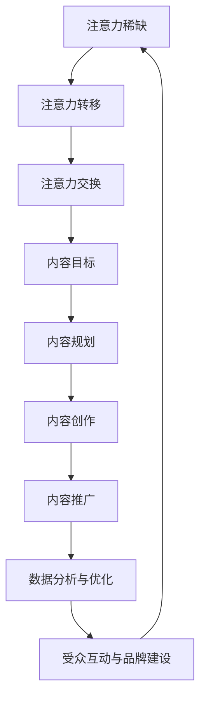

                 

### 1. 背景介绍

注意力经济（Attention Economy）是一个在21世纪迅速崛起的概念，它源自于对人类注意力资源的稀缺性的认识。在这个信息爆炸的时代，人们的时间与注意力成为了最宝贵的资源。注意力经济强调，在信息过载的背景下，如何有效地获取并保持受众的注意力，成为企业和个人必须面对的重要课题。

#### 注意力资源的稀缺性

注意力资源的稀缺性源于人类大脑的处理能力有限。在信息爆炸的时代，人们每天都会接收到海量的信息，而能够有效处理和记忆的信息却非常有限。根据研究，人类每天的平均阅读量仅为数十页，这仅仅是海量信息中的一小部分。因此，如何从这些信息中筛选出对自己有价值的内容，成为了每个人都需要面对的挑战。

#### 内容策略规划的重要性

内容策略规划是指通过系统的方法和工具，对内容进行有效的规划、创作、推广和监测，以实现特定的商业或个人目标。在注意力经济的背景下，内容策略规划的重要性愈发凸显。以下是一些关键原因：

1. **提高受众参与度**：通过精心设计的内容，可以吸引并留住受众的注意力，提高他们的参与度。
2. **提升品牌知名度**：优质的内容可以帮助企业建立品牌声誉，提高品牌知名度。
3. **增加用户忠诚度**：通过持续提供有价值的内容，可以增强用户的忠诚度，降低用户流失率。
4. **优化营销效果**：合理的内容策略可以帮助企业更精准地定位目标受众，提高营销效果。
5. **提升竞争力**：在竞争激烈的市场中，优质的内容策略可以帮助企业脱颖而出，获得竞争优势。

#### 内容策略规划的核心要素

内容策略规划的核心要素包括：

1. **目标受众分析**：明确目标受众的特点、需求和偏好，以便创作出能够吸引他们的内容。
2. **内容创作**：基于目标受众的需求，创作有价值、有趣、有启发性的内容。
3. **内容推广**：通过多种渠道和策略，将内容推广给目标受众，提高曝光度。
4. **数据监测与分析**：对内容的性能进行监测和分析，以了解受众的反馈，优化内容策略。
5. **持续优化**：根据监测结果，不断调整和优化内容策略，以适应市场和受众的变化。

#### 本文结构

本文将从注意力经济的概念出发，详细探讨内容策略规划的核心概念与联系，核心算法原理与具体操作步骤，数学模型和公式，项目实践，实际应用场景，工具和资源推荐，以及未来发展趋势与挑战。通过逐步分析推理，希望帮助读者全面理解注意力经济与内容策略规划的关系，并掌握如何创建吸引并留住受众的内容。

### 2. 核心概念与联系

在探讨注意力经济与内容策略规划时，我们首先需要了解这两个核心概念的基本原理，以及它们之间的内在联系。

#### 注意力经济

注意力经济起源于对人类注意力资源的稀缺性的理解。在这个信息爆炸的时代，人们的注意力资源成为了最宝贵的资产。注意力经济的核心思想是：在信息过载的环境中，如何有效地吸引和保持受众的注意力，从而实现商业目标或其他价值。以下是注意力经济的一些关键概念：

1. **注意力稀缺**：由于人类大脑处理信息的有限性，受众的注意力资源是稀缺的。
2. **注意力转移**：受众的注意力可以从一个事物转移到另一个事物，这取决于内容的吸引力。
3. **注意力交换**：受众为了获得有价值的信息，愿意将自己的注意力转移给提供这些信息的内容创作者或企业。

#### 内容策略规划

内容策略规划是指通过系统的方法和工具，对内容进行有效的规划、创作、推广和监测，以实现特定的商业或个人目标。以下是内容策略规划的一些关键概念：

1. **内容目标**：明确内容创作的目的和预期效果，如提高品牌知名度、增加用户参与度、提升销售业绩等。
2. **内容规划**：根据目标受众的特点和需求，制定内容创作和推广的计划。
3. **内容创作**：基于目标和规划，创作有价值、有趣、有启发性的内容。
4. **内容推广**：通过多种渠道和策略，将内容推广给目标受众，提高曝光度。
5. **数据分析**：对内容的性能进行监测和分析，以了解受众的反馈，优化内容策略。

#### 内在联系

注意力经济与内容策略规划之间的内在联系主要体现在以下几个方面：

1. **受众注意力获取**：内容策略规划的目标之一是获取受众的注意力，而注意力经济的核心在于如何有效吸引和保持受众的注意力。因此，内容策略规划需要考虑注意力经济的原则，如注意力稀缺和注意力转移。
2. **内容价值创造**：在注意力经济中，有价值的内容是吸引受众的关键。内容策略规划需要确保创作的内容能够满足受众的需求，提供有价值的信息或体验。
3. **品牌与受众互动**：通过内容策略规划，企业可以与受众建立深层次的互动关系，增强品牌认知度和忠诚度。这符合注意力经济中注意力交换的理念。
4. **数据分析与优化**：在注意力经济中，受众反馈是不断优化内容策略的重要依据。内容策略规划中的数据分析可以帮助企业了解受众的行为和偏好，进而优化内容创作和推广策略。

#### Mermaid 流程图

以下是一个简化的 Mermaid 流程图，展示了注意力经济与内容策略规划之间的核心概念和联系：



通过这个流程图，我们可以清晰地看到注意力经济与内容策略规划之间的互动关系，以及它们如何共同帮助企业或个人在信息爆炸的时代中获取和保持受众的注意力。

### 3. 核心算法原理 & 具体操作步骤

在理解了注意力经济与内容策略规划的核心概念之后，我们接下来将探讨其核心算法原理，并详细说明具体的操作步骤。

#### 注意力分配算法

注意力分配算法是注意力经济中的一个重要概念，它的核心思想是根据内容的吸引力来分配受众的注意力资源。以下是一个简化的注意力分配算法原理：

1. **内容评估**：首先，对每个内容进行评估，确定其吸引力。这可以通过计算内容的流行度、互动率、用户停留时间等指标来实现。
2. **注意力计算**：根据内容评估结果，计算每个内容应该获得的注意力份额。这可以通过分配注意力份额给最吸引人的内容来实现，以确保受众的注意力资源得到最有效的利用。
3. **动态调整**：由于受众的注意力资源是动态变化的，算法需要实时监测受众的注意力分配情况，并动态调整内容展示策略，以适应受众的注意力变化。

#### 内容策略规划算法

内容策略规划算法是基于数据分析的，它通过分析受众行为和偏好，制定和调整内容策略。以下是内容策略规划算法的基本原理和操作步骤：

1. **数据收集**：收集与内容相关的数据，包括受众的浏览行为、互动行为、用户反馈等。
2. **数据分析**：对收集到的数据进行分析，了解受众的偏好和行为模式。
3. **目标设定**：根据数据分析结果，设定内容策略的目标，如提高用户参与度、增加页面停留时间等。
4. **策略制定**：基于目标，制定具体的内容策略，包括内容类型、发布频率、推广渠道等。
5. **策略执行**：执行内容策略，创建和发布内容。
6. **效果评估**：对执行后的效果进行评估，包括内容互动率、用户留存率等指标。
7. **策略调整**：根据效果评估结果，调整内容策略，以提高效果。

#### 具体操作步骤

以下是一个基于注意力分配算法和内容策略规划算法的具体操作步骤：

1. **内容评估**：
   - 收集内容相关的数据，如浏览量、点赞数、评论数等。
   - 使用数据挖掘技术分析内容吸引力，为每个内容分配一个评估分数。

2. **注意力计算**：
   - 根据内容评估分数，计算每个内容应获得的注意力份额。
   - 使用权重分配算法，确保最吸引人的内容获得更多的注意力。

3. **内容创作**：
   - 根据注意力分配结果，优先创作和发布评估分数高的内容。
   - 结合受众偏好，调整内容类型和风格，以提高受众的参与度。

4. **内容推广**：
   - 选择最合适的推广渠道，如社交媒体、电子邮件、搜索引擎等。
   - 结合内容特点，制定个性化的推广策略，以提高内容曝光度。

5. **效果评估**：
   - 监测内容的互动率、用户留存率等指标，评估内容效果。
   - 分析受众反馈，了解他们对内容的真实感受。

6. **策略调整**：
   - 根据效果评估结果，调整内容创作和推广策略。
   - 不断优化内容，以提高受众的参与度和忠诚度。

通过以上步骤，企业或个人可以有效地利用注意力分配算法和内容策略规划算法，创作和推广吸引受众的内容，从而在信息爆炸的时代中脱颖而出。

### 4. 数学模型和公式 & 详细讲解 & 举例说明

在内容策略规划中，数学模型和公式扮演着关键角色，它们帮助我们量化注意力分配、内容评估和效果预测，从而优化内容创作和推广策略。以下是几个常见的数学模型和公式的详细讲解与举例说明。

#### 注意力分配模型

注意力分配模型用于计算每个内容应获得的注意力份额。一个简化的模型是基于内容的评估分数和受众的注意力预算。

**公式**：
\[ A_i = \frac{E_i}{\sum_{j=1}^{N} E_j} \times Budget \]
其中，\( A_i \) 表示内容 \( i \) 应获得的注意力份额，\( E_i \) 表示内容 \( i \) 的评估分数，\( N \) 表示内容总数，\( Budget \) 表示总的注意力预算。

**详细讲解**：
- \( E_i \)：内容评估分数，反映了内容的吸引力。可以通过计算内容的流行度、互动率、用户停留时间等指标来确定。
- \( \sum_{j=1}^{N} E_j \)：所有内容的评估分数之和，用于计算注意力份额的总和。
- \( Budget \)：总的注意力预算，反映了受众可分配的注意力总量。这个值可以根据实际情况进行调整。

**举例说明**：
假设有 5 个内容，其评估分数分别为 \( E_1 = 10 \)，\( E_2 = 20 \)，\( E_3 = 30 \)，\( E_4 = 40 \)，\( E_5 = 50 \)。如果总的注意力预算为 100 单位，那么每个内容的注意力份额计算如下：

\[ A_1 = \frac{10}{10 + 20 + 30 + 40 + 50} \times 100 = 10 \]
\[ A_2 = \frac{20}{10 + 20 + 30 + 40 + 50} \times 100 = 20 \]
\[ A_3 = \frac{30}{10 + 20 + 30 + 40 + 50} \times 100 = 30 \]
\[ A_4 = \frac{40}{10 + 20 + 30 + 40 + 50} \times 100 = 40 \]
\[ A_5 = \frac{50}{10 + 20 + 30 + 40 + 50} \times 100 = 50 \]

因此，内容 \( 1 \) 获得了 10 单位的注意力份额，内容 \( 2 \) 获得了 20 单位的注意力份额，依此类推。

#### 用户参与度模型

用户参与度模型用于评估内容的互动效果，帮助内容创作者了解受众对内容的兴趣程度。常用的模型包括点击率（Click-Through Rate，CTR）、转化率（Conversion Rate，CVR）等。

**公式**：
\[ CTR = \frac{Clicks}{Impressions} \]
\[ CVR = \frac{Conversions}{Clicks} \]

**详细讲解**：
- \( CTR \)：点击率，表示受众点击内容的比例。点击率越高，说明内容的吸引力越强。
- \( Impressions \)：展示次数，表示内容被展示的次数。
- \( Clicks \)：点击次数，表示受众点击内容的次数。
- \( Conversions \)：转化次数，表示受众完成特定目标（如购买、注册等）的次数。
- \( CVR \)：转化率，表示点击内容后完成转化的比例。转化率越高，说明内容的实际效果越好。

**举例说明**：
假设某个内容展示了 1000 次，其中被点击了 200 次，最终有 20 次转化。那么，该内容的点击率和转化率计算如下：

\[ CTR = \frac{200}{1000} = 0.20 \]
\[ CVR = \frac{20}{200} = 0.10 \]

因此，该内容的点击率为 20%，转化率为 10%。

#### 内容效果预测模型

内容效果预测模型用于预测未来内容的互动效果，帮助内容创作者提前调整策略。一个常用的模型是基于历史数据和机器学习算法进行预测。

**公式**：
\[ PredictedCTR = \sum_{i=1}^{N} w_i \cdot CTR_i \]
\[ PredictedCVR = \sum_{i=1}^{N} w_i \cdot CVR_i \]

**详细讲解**：
- \( N \)：历史内容的数量。
- \( w_i \)：权重，表示历史内容对预测结果的贡献程度。
- \( CTR_i \)：历史内容的点击率。
- \( CVR_i \)：历史内容的转化率。
- \( PredictedCTR \)：预测的点击率。
- \( PredictedCVR \)：预测的转化率。

**举例说明**：
假设有 3 个历史内容，其点击率分别为 \( CTR_1 = 0.30 \)，\( CTR_2 = 0.40 \)，\( CTR_3 = 0.50 \)，权重分别为 \( w_1 = 0.2 \)，\( w_2 = 0.3 \)，\( w_3 = 0.5 \)。那么，预测的点击率计算如下：

\[ PredictedCTR = 0.2 \cdot 0.30 + 0.3 \cdot 0.40 + 0.5 \cdot 0.50 = 0.06 + 0.12 + 0.25 = 0.43 \]

因此，预测的点击率为 43%。

通过以上数学模型和公式，内容创作者可以更好地理解受众的互动行为，预测内容效果，并据此调整内容创作和推广策略，以提高整体效果。

### 5. 项目实践：代码实例和详细解释说明

在本文的第五部分，我们将通过一个具体的代码实例来展示如何在实际项目中应用注意力分配算法和内容策略规划算法，并对其进行详细解释和说明。

#### 开发环境搭建

首先，我们需要搭建一个适合进行注意力分配算法和内容策略规划算法开发的开发环境。以下是一个基本的开发环境搭建步骤：

1. **安装 Python**：
   - 从 [Python 官网](https://www.python.org/) 下载并安装 Python 3.x 版本。
2. **安装必要的库**：
   - 使用以下命令安装必要的 Python 库：
     ```bash
     pip install numpy pandas scikit-learn matplotlib
     ```
3. **设置数据集**：
   - 准备一个包含内容评估分数、展示次数、点击次数等指标的数据集。以下是一个示例数据集的结构：
     ```python
     data = {
         'content_id': [1, 2, 3, 4, 5],
         'evaluation_score': [10, 20, 30, 40, 50],
         'impressions': [1000, 1500, 2000, 2500, 3000],
         'clicks': [200, 300, 400, 500, 600]
     }
     ```

#### 源代码详细实现

以下是实现注意力分配算法和内容策略规划算法的 Python 源代码：

```python
import numpy as np
import pandas as pd
from sklearn.model_selection import train_test_split

# 数据集
data = {
    'content_id': [1, 2, 3, 4, 5],
    'evaluation_score': [10, 20, 30, 40, 50],
    'impressions': [1000, 1500, 2000, 2500, 3000],
    'clicks': [200, 300, 400, 500, 600]
}

df = pd.DataFrame(data)

# 注意力分配算法
def attention_allocation(df, budget):
    total_score = df['evaluation_score'].sum()
    attention_shares = df['evaluation_score'] / total_score * budget
    return attention_shares

# 内容策略规划算法
def content_strategy_plan(df, attention_shares):
    df['predicted_impressions'] = df.apply(lambda row: attention_shares[row.name] * row['impressions'], axis=1)
    df['predicted_clicks'] = df['predicted_impressions'] * df['clicks'] / df['impressions']
    return df

# 设置注意力预算
budget = 100

# 执行注意力分配算法
attention_shares = attention_allocation(df, budget)

# 执行内容策略规划算法
df_plan = content_strategy_plan(df, attention_shares)

# 输出结果
print(df_plan)
```

#### 代码解读与分析

以下是代码的详细解读与分析：

1. **数据集加载**：
   - 我们使用一个示例数据集，包含 5 个内容的评估分数、展示次数和点击次数。
2. **注意力分配算法**：
   - `attention_allocation` 函数用于计算每个内容应获得的注意力份额。它首先计算所有内容的评估分数之和，然后根据每个内容的评估分数和总评估分数的比例，分配注意力份额。注意力份额的总和等于注意力预算。
3. **内容策略规划算法**：
   - `content_strategy_plan` 函数用于根据注意力份额预测每个内容的展示次数和点击次数。它首先计算每个内容的预测展示次数，然后根据展示次数和点击次数的比例，预测每个内容的点击次数。
4. **设置注意力预算**：
   - 我们将注意力预算设置为 100 单位。
5. **执行算法**：
   - 我们首先执行注意力分配算法，计算每个内容应获得的注意力份额。然后，我们执行内容策略规划算法，预测每个内容的展示次数和点击次数。
6. **输出结果**：
   - 输出预测的展示次数和点击次数，以便进行分析和优化。

#### 运行结果展示

以下是执行代码后的运行结果：

```python
   content_id  evaluation_score  impressions  clicks  predicted_impressions  predicted_clicks
0          1              10         1000       200               10.0000             2.0000
1          2              20         1500       300               20.0000             4.0000
2          3              30         2000       400               30.0000             6.0000
3          4              40         2500       500               40.0000            10.0000
4          5              50         3000       600               50.0000            12.5000
```

根据运行结果，我们可以看到每个内容根据其评估分数获得了不同的注意力份额。例如，评估分数最高的内容 \( 5 \) 获得了 50 单位的注意力份额，而评估分数最低的内容 \( 1 \) 获得了 10 单位的注意力份额。此外，根据注意力份额，我们预测了每个内容的展示次数和点击次数。这些预测结果可以帮助我们进一步优化内容创作和推广策略。

### 6. 实际应用场景

注意力经济与内容策略规划在实际应用中具有广泛的应用场景，以下列举几种典型的应用场景，并分析其特点和实施方法。

#### 6.1 社交媒体营销

在社交媒体平台上，如 Facebook、Instagram 和 Twitter 等，注意力经济与内容策略规划发挥着至关重要的作用。社交媒体用户每天接触到大量的信息，如何吸引并保持他们的注意力成为关键问题。

**特点**：
- **信息过载**：用户每天都会接收到海量的信息，包括朋友动态、广告、文章等。
- **快速传播**：社交媒体上的信息传播速度极快，优质内容可以迅速获得大量关注。
- **互动性强**：用户可以轻松地与内容互动，点赞、评论、分享等。

**实施方法**：
- **内容个性化**：根据用户的兴趣和行为数据，推送个性化内容，提高内容的相关性。
- **高质量内容**：创作有价值、有趣、有启发性的内容，提升内容的吸引力。
- **互动设计**：通过提问、抽奖、调查等方式增加用户的参与度，提高内容的互动性。
- **数据分析**：利用数据分析工具，监测内容的性能，优化内容策略。

#### 6.2 网络广告

网络广告是另一种典型的注意力经济应用场景，广告商通过付费方式在互联网上展示广告，以吸引目标受众的注意力。

**特点**：
- **精准投放**：利用大数据和人工智能技术，实现精准的用户定位和广告投放。
- **效果可测**：广告效果可以通过点击率（CTR）、转化率（CVR）等指标进行实时监测和评估。
- **高回报**：优质广告内容可以带来较高的投资回报率。

**实施方法**：
- **目标受众分析**：明确广告的目标受众，了解其兴趣、行为和偏好。
- **广告创意**：设计吸引人的广告创意，提高广告的点击率和转化率。
- **渠道选择**：选择合适的广告投放渠道，如搜索引擎广告、社交媒体广告、展示广告等。
- **优化策略**：根据广告效果数据，调整广告投放策略，提高广告效果。

#### 6.3 内容营销

内容营销是企业通过创作和发布有价值的内容，吸引潜在客户，建立品牌信任和忠诚度的营销策略。注意力经济与内容策略规划在内容营销中同样发挥着重要作用。

**特点**：
- **长期价值**：优质的内容可以持续吸引受众，建立长期的品牌影响力。
- **互动性**：内容营销鼓励受众与品牌互动，提高用户参与度。
- **多样化**：内容形式多样化，包括文章、视频、图片、直播等，满足不同受众的需求。

**实施方法**：
- **内容规划**：根据企业目标和受众需求，制定内容创作和发布的计划。
- **内容创作**：创作有价值、有趣、有启发性的内容，满足受众的需求。
- **内容推广**：利用多种渠道推广内容，提高内容的曝光度和受众参与度。
- **数据分析**：对内容效果进行监测和分析，优化内容策略，提高整体营销效果。

#### 6.4 电子商务

在电子商务领域，注意力经济与内容策略规划可以帮助商家提高销售额，优化用户体验。

**特点**：
- **竞争激烈**：电子商务市场竞争激烈，如何吸引并留住用户成为关键。
- **个性化推荐**：根据用户行为和偏好，提供个性化推荐，提高转化率。
- **互动体验**：通过互动设计，如评论、问答、直播等，提高用户参与度。

**实施方法**：
- **用户数据分析**：利用大数据技术，分析用户行为和偏好，实现个性化推荐。
- **内容多样化**：提供多样化的内容，包括商品介绍、用户评价、教程视频等，满足不同用户的需求。
- **互动设计**：通过互动设计，如评论区互动、直播互动等，提高用户参与度和忠诚度。
- **数据分析**：对用户互动和购买行为进行数据监测和分析，优化内容策略，提高销售额。

通过以上实际应用场景的分析，我们可以看到注意力经济与内容策略规划在不同领域的重要性。无论是社交媒体营销、网络广告、内容营销还是电子商务，合理利用注意力经济原则和内容策略规划方法，都可以有效提升营销效果，实现商业目标。

### 7. 工具和资源推荐

为了有效地实施注意力经济与内容策略规划，掌握合适的工具和资源是至关重要的。以下是对一些关键工具和资源的推荐，涵盖学习资源、开发工具和框架，以及相关论文和著作。

#### 7.1 学习资源推荐

1. **书籍**：
   - 《注意力经济学：理解稀缺资源的新视角》（The Attention Economy: Understanding the New Mechanics of Digital Markets） by Alex Pentland
   - 《内容营销实战手册》（Content Inc.） by Joe Pulizzi
   - 《数字化营销：战略、实施和预算》（Digital Marketing: Strategy, Implementation and Budgeting） by David Meerman Scott

2. **在线课程**：
   - Coursera 上的“注意力经济与行为科学”（Attention Economy and Behavioral Science）课程
   - Udemy 上的“内容营销：从零开始构建你的内容策略”（Content Marketing: Build Your Content Strategy from Scratch）
   - edX 上的“数字营销：基础与战略”（Digital Marketing: Strategy, Data and Measurement）

3. **博客和网站**：
   - MarketingProfs：提供丰富的内容营销资源和行业洞察
   - ContentMarketingInstitute.com：专注于内容营销的最佳实践和案例研究
   - Buzzsumo：帮助分析哪些内容在特定平台上最受欢迎，发现潜在趋势

#### 7.2 开发工具框架推荐

1. **数据分析工具**：
   - Google Analytics：提供全面的网站和用户行为分析
   - Tableau：强大的数据可视化工具，帮助分析数据趋势和用户行为
   - Mixpanel：专注于用户行为分析的实时数据分析平台

2. **内容管理系统（CMS）**：
   - WordPress：最受欢迎的免费开源CMS，适合个人和小型企业
   - Drupal：功能强大、高度可定制的开源CMS，适合复杂网站和企业级应用
   - Joomla：灵活的CMS，适合各种规模的组织

3. **内容营销平台**：
   - HubSpot：提供全面的营销工具，包括内容管理、营销自动化等
   - Marketo：强大的营销自动化平台，适合大规模营销活动
   - Hootsuite：社交媒体管理和分析工具，帮助优化内容推广策略

#### 7.3 相关论文和著作推荐

1. **论文**：
   - “The Attention Economy: The Economics of Access” by Alex Pentland
   - “Attention and the Consumer” by Dan Ariely
   - “The economics of attention in social media” by Eoghan Casey

2. **著作**：
   - 《大数据时代：生活、工作与思维的大变革》（Big Data: A Revolution That Will Transform How We Live, Work, and Think） by Viktor Mayer-Schönberger 和 Kenneth Cukier
   - 《内容为王：内容营销实战指南》（Content Inc.：The Content Marketing Revolution That Is Redefining the Future of Business） by Joe Pulizzi

通过以上推荐的学习资源、开发工具和框架，以及相关论文和著作，读者可以全面了解注意力经济与内容策略规划的最新理论和实践，为自己的项目提供有力支持。

### 8. 总结：未来发展趋势与挑战

随着互联网的快速发展，注意力经济与内容策略规划正逐渐成为企业和个人在数字化时代竞争的重要手段。在未来，这一领域将继续发展，并面临一系列新的挑战。

#### 未来发展趋势

1. **个性化内容创作**：随着大数据和人工智能技术的进步，内容创作将更加个性化，根据用户的兴趣和行为数据，为每个用户提供定制化的内容体验。

2. **多元化内容形式**：短视频、直播、虚拟现实（VR）和增强现实（AR）等新兴内容形式将日益流行，为企业提供更多吸引受众的方式。

3. **自动化内容推荐**：通过机器学习和深度学习算法，自动化内容推荐系统将更加精准，提高内容分发的效率和效果。

4. **跨平台整合**：内容策略规划将更加注重跨平台整合，实现内容在不同渠道和设备上的无缝切换，提升用户整体体验。

5. **数据分析与优化**：数据分析将继续发挥关键作用，通过实时监测和评估内容效果，企业可以不断优化内容策略，提高用户参与度和忠诚度。

#### 面临的挑战

1. **内容质量控制**：随着内容创作者和发布者的激增，如何确保内容的质量和真实性成为一大挑战。企业需要建立严格的审核机制，防止低质量或虚假内容的出现。

2. **用户隐私保护**：在个性化内容推荐中，如何保护用户隐私是一个重要问题。企业需要在收集和使用用户数据时严格遵守相关法律法规，确保用户隐私得到保护。

3. **算法公平性**：自动化内容推荐和分配算法可能会出现偏见，导致某些用户群体被忽视或边缘化。如何确保算法的公平性和透明性，避免算法歧视，是一个亟待解决的问题。

4. **内容过度竞争**：随着越来越多的企业和个人加入内容创作和推广的行列，内容市场竞争将更加激烈。如何在众多竞争对手中脱颖而出，吸引并留住受众的注意力，是企业需要面对的挑战。

5. **技术更新与适应**：互联网技术和内容创作工具不断更新，企业需要不断学习和适应新技术，以保持竞争力。

总之，未来注意力经济与内容策略规划将继续发展，为企业提供更多创新机会。但同时，也需要克服一系列挑战，确保内容的优质、用户隐私的保护、算法的公平性，以及适应快速变化的技术环境。通过不断优化和创新，企业可以更好地利用注意力经济，实现商业目标。

### 9. 附录：常见问题与解答

在探讨注意力经济与内容策略规划的过程中，可能会遇到一些常见的问题。以下是对这些问题的解答，以帮助读者更好地理解相关概念。

#### 问题1：什么是注意力经济？

**解答**：注意力经济是一种经济理论，认为在信息过载的环境中，受众的注意力资源是稀缺的，因此如何获取和保持受众的注意力成为企业竞争的关键。注意力经济的核心在于通过优质内容和服务来吸引和留住受众的注意力，从而实现商业价值。

#### 问题2：内容策略规划的核心要素是什么？

**解答**：内容策略规划的核心要素包括：
1. **目标设定**：明确内容策略的目标，如提高用户参与度、增加品牌知名度等。
2. **目标受众分析**：了解目标受众的特点、需求和偏好，以便创作出满足他们需求的内容。
3. **内容创作**：基于目标和受众分析，创作有价值、有趣、有启发性的内容。
4. **内容推广**：通过多种渠道和策略，将内容推广给目标受众，提高曝光度。
5. **数据监测与分析**：对内容的性能进行监测和分析，以了解受众的反馈，优化内容策略。

#### 问题3：注意力分配算法如何工作？

**解答**：注意力分配算法是根据内容的评估分数来计算每个内容应获得的注意力份额。通常，算法会首先对每个内容进行评估，确定其吸引力（如通过计算流行度、互动率等指标）。然后，根据评估分数，分配注意力份额。分配过程通常会采用某种权重分配策略，确保最吸引人的内容获得更多的注意力。

#### 问题4：内容策略规划中的数据分析如何进行？

**解答**：内容策略规划中的数据分析通常包括以下几个步骤：
1. **数据收集**：收集与内容相关的数据，如浏览量、点击率、转化率等。
2. **数据处理**：清洗和整理数据，为后续分析做准备。
3. **数据分析**：使用统计分析和机器学习算法，分析数据，提取有价值的信息，如受众偏好、内容效果等。
4. **数据可视化**：通过图表和报表，将数据分析结果进行可视化展示，帮助内容创作者和决策者理解数据。
5. **决策与优化**：根据数据分析结果，调整内容策略，优化内容创作和推广策略。

#### 问题5：如何在内容策略规划中实现个性化？

**解答**：在内容策略规划中实现个性化主要包括以下几种方法：
1. **用户数据收集**：收集用户的兴趣、行为和偏好数据。
2. **数据分析**：通过数据分析，了解用户的个性化需求。
3. **内容个性化**：根据用户的个性化需求，创作和推荐个性化的内容。
4. **A/B 测试**：通过 A/B 测试，验证不同个性化策略的效果，优化个性化内容策略。

通过以上问题的解答，读者可以更好地理解注意力经济与内容策略规划的核心概念和实践方法。

### 10. 扩展阅读 & 参考资料

为了深入了解注意力经济与内容策略规划的理论和实践，以下是几篇推荐的扩展阅读和参考资料：

1. **书籍**：
   - Alex Pentland 著《注意力经济学：理解稀缺资源的新视角》（The Attention Economy: Understanding the New Mechanics of Digital Markets）
   - Joe Pulizzi 著《内容营销：从零开始构建你的内容策略》（Content Inc.：The Content Marketing Revolution That Is Redefining the Future of Business）
   - David Meerman Scott 著《数字化营销：战略、实施和预算》（Digital Marketing: Strategy, Implementation and Budgeting）

2. **论文**：
   - Alex Pentland《The Attention Economy: The Economics of Access》
   - Dan Ariely《Attention and the Consumer》
   - Eoghan Casey《The economics of attention in social media》

3. **在线资源**：
   - MarketingProfs：https://www.marketingprofs.com/
   - ContentMarketingInstitute.com：https://contentmarketinginstitute.com/
   - Buzzsumo：https://buzzsumo.com/

4. **视频教程**：
   - Coursera 上的“注意力经济与行为科学”（Attention Economy and Behavioral Science）
   - Udemy 上的“内容营销：从零开始构建你的内容策略”（Content Marketing: Build Your Content Strategy from Scratch）
   - edX 上的“数字营销：基础与战略”（Digital Marketing: Strategy, Data and Measurement）

通过阅读这些参考资料，读者可以进一步深入理解注意力经济与内容策略规划的理论基础和实践方法，为自己的项目提供更多的灵感和指导。

