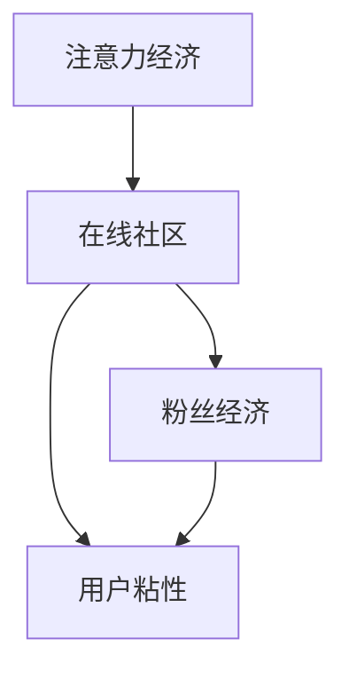

                 

### 1. 背景介绍

随着互联网技术的飞速发展，在线社区已经成为人们获取信息、交流互动的重要平台。从社交媒体、论坛到内容分享平台，各种类型的在线社区层出不穷。这些平台不仅改变了人们的沟通方式，还为企业和个人提供了巨大的商业机会。然而，如何在众多竞争者中脱颖而出，吸引并留住忠实的粉丝和受众，成为了在线社区运营者面临的一大挑战。

在这个注意力经济时代，人们的时间、精力和注意力都变得异常珍贵。如何利用有限的资源，最大化地吸引和维护粉丝群体，成为了每个在线社区运营者必须思考的问题。本文将从注意力经济的角度，探讨在线社区建设的关键策略，旨在帮助运营者吸引并留住忠实的粉丝和受众。

首先，我们需要了解什么是注意力经济。注意力经济是指在一个信息过载的环境中，人们的时间和注意力成为稀缺资源，而能够吸引并保持人们注意力的内容和平台，则拥有了巨大的商业价值。在注意力经济中，内容创造者需要通过提供有价值、有趣、吸引人的内容来获取粉丝的关注，从而实现商业变现。

在线社区作为一种内容平台，其核心价值在于提供有价值的内容和互动体验，吸引并留住粉丝。然而，面对激烈的竞争和多变的市场环境，如何制定有效的社区建设策略，成为了每个运营者必须面对的挑战。本文将围绕以下几个核心问题展开讨论：

1. **如何理解注意力经济及其对在线社区的影响？**
2. **在线社区建设的关键策略是什么？**
3. **如何利用数据分析来优化社区运营？**
4. **如何设计互动体验来提高用户粘性？**
5. **未来在线社区的发展趋势和挑战是什么？**

通过本文的探讨，希望能够为在线社区运营者提供一些有价值的思路和策略，帮助他们在激烈的市场竞争中脱颖而出，吸引并留住忠实的粉丝和受众。

### 2. 核心概念与联系

要深入理解注意力经济对在线社区的影响，我们首先需要明确几个核心概念：注意力经济、在线社区、粉丝经济、用户粘性等。这些概念不仅相互联系，而且在实践中共同作用，决定了在线社区的发展方向和运营效果。

#### 注意力经济

注意力经济是指在一个信息过载的环境中，人们的时间和注意力成为稀缺资源，而能够吸引并保持人们注意力的内容和平台，则拥有了巨大的商业价值。这种经济模式源于人们对于高质量、有价值内容的追求，以及对个性化、定制化体验的需求。在注意力经济中，内容创造者需要通过提供独特、有趣、有价值的内容来获取粉丝的关注，从而实现商业变现。

#### 在线社区

在线社区是一个由具有共同兴趣、需求或目标的人组成的虚拟社交平台。它通过提供多样化的互动功能，如论坛、博客、内容分享、社交网络等，为用户创造了一个交流、分享和学习的空间。在线社区的核心价值在于为用户提供有价值的内容和互动体验，从而提高用户粘性，促进社区的发展。

#### 粉丝经济

粉丝经济是指通过积累忠实的粉丝群体，实现商业变现的一种经济模式。在粉丝经济中，粉丝对品牌的忠诚度和互动性成为关键因素。通过提供高质量的内容和互动体验，运营者能够吸引并留住粉丝，从而实现商业利益的最大化。

#### 用户粘性

用户粘性是指用户对在线社区的忠诚度和依赖度。高粘性的社区意味着用户愿意花费更多的时间和精力在社区内，积极参与互动，分享内容，甚至为社区做出贡献。用户粘性的提升不仅能够提高社区的活跃度，还能够为运营者带来持续的商业价值。

#### 核心概念联系

注意力经济、在线社区、粉丝经济和用户粘性这几个核心概念相互联系，共同构成了在线社区建设的基础。注意力经济决定了内容创造者的价值，在线社区为用户提供了一个互动和分享的平台，粉丝经济通过积累忠实的粉丝群体实现商业变现，而用户粘性则反映了社区运营的效果。

在注意力经济中，在线社区通过提供有价值的内容和互动体验，吸引了粉丝的关注。这些粉丝对社区产生了忠诚度，形成了粉丝经济的基础。同时，高粘性的社区意味着用户对社区的高度依赖，这进一步促进了在线社区的发展。

为了更好地理解这些概念之间的关系，我们可以通过以下Mermaid流程图来展示它们之间的联系：



在这个流程图中，注意力经济作为起点，通过在线社区吸引了粉丝，进而形成了粉丝经济和用户粘性。这个循环不仅反映了在线社区建设的基本逻辑，也为我们制定有效的社区建设策略提供了方向。

#### Mermaid 流程图（Mermaid流程节点中不要有括号、逗号等特殊字符）


通过上述流程图，我们可以清晰地看到注意力经济、在线社区、粉丝经济和用户粘性之间的逻辑关系。这些核心概念不仅相互联系，而且在实践中共同作用，决定了在线社区的发展方向和运营效果。

### 3. 核心算法原理 & 具体操作步骤

在深入探讨注意力经济与在线社区建设策略之前，我们需要了解一些关键算法原理，这些算法在提高社区用户粘性和粉丝数量方面发挥着重要作用。以下是一些核心算法及其具体操作步骤：

#### 1. 内容推荐算法

**原理**：内容推荐算法通过分析用户的历史行为、兴趣偏好和社区内的互动数据，为用户推荐可能感兴趣的内容。

**具体操作步骤**：

- **数据收集**：收集用户在社区内的浏览记录、点赞、评论、分享等行为数据。
- **特征提取**：对用户行为数据进行特征提取，如用户兴趣标签、内容类型、互动频率等。
- **模型训练**：使用机器学习算法（如协同过滤、基于内容的推荐等）训练推荐模型。
- **推荐生成**：根据用户特征和模型预测，生成个性化推荐列表。

#### 2. 互动分析算法

**原理**：互动分析算法通过分析用户在社区内的互动数据，评估用户的活跃度和忠诚度。

**具体操作步骤**：

- **数据收集**：收集用户在社区内的互动数据，如发帖、回复、评论、点赞等。
- **特征提取**：提取互动数据的特征，如互动频率、互动深度、互动质量等。
- **评分系统**：设计评分系统，对用户的互动行为进行量化评分。
- **忠诚度评估**：根据评分结果，评估用户的忠诚度和活跃度。

#### 3. 社交网络分析算法

**原理**：社交网络分析算法通过分析社区内的用户关系网络，识别核心用户和潜在影响力者。

**具体操作步骤**：

- **数据收集**：收集社区内的用户关系数据，如好友关系、关注关系、互动关系等。
- **网络构建**：构建用户关系网络图，分析用户之间的连接关系。
- **影响力评估**：使用图论算法（如PageRank、K-core等）评估用户的影响力。
- **推荐策略**：根据影响力评估结果，制定核心用户和潜在影响力者的推荐策略。

#### 4. 用户行为预测算法

**原理**：用户行为预测算法通过分析用户的历史行为和社区动态，预测用户的未来行为。

**具体操作步骤**：

- **数据收集**：收集用户在社区内的历史行为数据，如浏览记录、购买行为等。
- **特征提取**：提取用户行为特征，如行为模式、购买偏好等。
- **模型训练**：使用机器学习算法（如决策树、随机森林等）训练行为预测模型。
- **行为预测**：根据模型预测，预测用户的未来行为，如是否会在社区内继续活跃。

#### 5. 社区管理算法

**原理**：社区管理算法通过自动化手段，优化社区管理流程，提高管理效率。

**具体操作步骤**：

- **自动化分类**：使用自然语言处理技术（如词云、关键词提取等），对用户发布的内容进行自动分类。
- **违规检测**：使用机器学习算法（如异常检测、文本分类等），检测并处理社区内的违规行为。
- **用户行为监控**：实时监控用户行为，识别异常行为并进行预警。

通过上述核心算法原理和具体操作步骤，我们可以有效地提升在线社区的用户粘性、吸引更多忠实的粉丝，并优化社区管理流程。这些算法不仅帮助我们更好地理解用户行为和需求，还为在线社区运营提供了强有力的技术支持。

### 4. 数学模型和公式 & 详细讲解 & 举例说明

在讨论注意力经济与在线社区建设策略时，数学模型和公式是不可或缺的工具。这些模型可以帮助我们量化分析社区运营效果，优化策略，提升用户粘性和粉丝数量。以下将详细讲解几个关键数学模型和公式，并举例说明如何应用这些模型。

#### 1. 艾尔曼模型（Erlang Model）

艾尔曼模型是一个用于分析排队系统的数学模型，适用于在线社区用户活跃度分析。该模型通过计算服务时间与服务能力的比例，预测社区的用户活跃度。

**公式**：
\[ \lambda = \frac{\text{到达率}}{\text{服务率}} \]

其中，\(\lambda\) 是服务强度，到达率是指单位时间内用户到达社区的平均次数，服务率是指单位时间内社区能够处理用户请求的平均次数。

**举例说明**：

假设一个在线社区每分钟平均有10个新用户到达，而社区每分钟能够处理5个用户请求。根据艾尔曼模型，服务强度为：
\[ \lambda = \frac{10}{5} = 2 \]

服务强度大于1时，表示社区负载较高，用户活跃度较高，需要优化服务器性能或增加服务资源。

#### 2. 莫兰德-罗宾逊模型（Molander-Robinson Model）

莫兰德-罗宾逊模型是一个用于计算用户忠诚度的数学模型，通过用户重复访问次数和访问间隔时间，评估用户的忠诚度。

**公式**：
\[ \text{忠诚度} = \frac{\text{重复访问次数}}{\text{访问间隔时间}} \]

其中，忠诚度是一个介于0和1之间的值，值越大表示用户忠诚度越高。

**举例说明**：

一个用户在一个月内访问了一个在线社区5次，且每次访问间隔为7天。根据莫兰德-罗宾逊模型，该用户的忠诚度为：
\[ \text{忠诚度} = \frac{5}{\frac{30}{7}} = \frac{5}{4.2857} \approx 1.17 \]

忠诚度高于1表示用户频繁访问社区，具有较高的忠诚度。

#### 3. 贝叶斯模型（Bayesian Model）

贝叶斯模型是一种用于预测用户行为和兴趣的统计模型，通过历史数据和用户行为数据，更新用户兴趣的概率分布。

**公式**：
\[ P(A|B) = \frac{P(B|A) \cdot P(A)}{P(B)} \]

其中，\(P(A|B)\) 是在给定B条件下A发生的概率，\(P(B|A)\) 是在A条件下B发生的概率，\(P(A)\) 是A的先验概率，\(P(B)\) 是B的先验概率。

**举例说明**：

假设我们已知用户A访问了社区中的内容B，且已知内容B与用户兴趣C相关的概率为0.6。同时，用户A访问社区的总概率为0.8。根据贝叶斯模型，我们可以计算用户A对兴趣C的兴趣概率：
\[ P(C|A) = \frac{0.6 \cdot 0.8}{P(B)} \]

假设社区中用户访问内容B的概率为0.4，则：
\[ P(C|A) = \frac{0.6 \cdot 0.8}{0.4} = 1.2 \]

这表明用户A对兴趣C有很高的兴趣概率。

#### 4. 个性化推荐算法中的数学模型

在个性化推荐算法中，常用的数学模型包括协同过滤（Collaborative Filtering）和基于内容的推荐（Content-Based Filtering）。

**协同过滤模型**：

**公式**：
\[ R_{ui} = \sum_{j \in N_i} \frac{q_{uj}}{||N_i||} \]

其中，\(R_{ui}\) 是用户 \(u\) 对项目 \(i\) 的评分预测，\(q_{uj}\) 是用户 \(u\) 对项目 \(j\) 的评分，\(N_i\) 是与项目 \(i\) 相关的用户集合，\(||N_i||\) 是集合 \(N_i\) 的大小。

**举例说明**：

假设用户 \(u\) 对项目 \(i\) 的评分是 4，项目 \(j\) 的评分是 5，与项目 \(i\) 相关的用户集合 \(N_i\) 包含用户 \(v\) 和 \(w\)，评分分别是 3 和 4。根据协同过滤模型，我们可以计算用户 \(u\) 对项目 \(i\) 的评分预测：
\[ R_{ui} = \frac{4 \cdot 3 + 5 \cdot 4}{2} = 4.5 \]

**基于内容的推荐模型**：

**公式**：
\[ R_{ui} = \text{similarity}(u, i) \cdot \text{rating}(i) \]

其中，\(R_{ui}\) 是用户 \(u\) 对项目 \(i\) 的评分预测，\(\text{similarity}(u, i)\) 是用户 \(u\) 与项目 \(i\) 的相似度，\(\text{rating}(i)\) 是项目 \(i\) 的实际评分。

**举例说明**：

假设用户 \(u\) 与项目 \(i\) 的相似度为0.8，项目 \(i\) 的实际评分为5。根据基于内容的推荐模型，我们可以计算用户 \(u\) 对项目 \(i\) 的评分预测：
\[ R_{ui} = 0.8 \cdot 5 = 4 \]

通过以上数学模型和公式的详细讲解与举例说明，我们可以更好地理解和应用这些模型在在线社区建设中的具体应用。这些模型不仅帮助我们量化分析用户行为和兴趣，还为制定有效的社区运营策略提供了科学依据。

### 5. 项目实践：代码实例和详细解释说明

为了更好地理解注意力经济与在线社区建设策略的实际应用，我们将通过一个具体的代码实例来展示如何利用技术手段提升社区用户粘性和粉丝数量。本实例将使用Python编程语言和几个常用的库，如Pandas、Scikit-learn和TensorFlow。

#### 5.1 开发环境搭建

首先，我们需要搭建开发环境。以下是所需的软件和库：

- Python 3.8 或更高版本
- Jupyter Notebook 或 PyCharm
- Pandas
- Scikit-learn
- TensorFlow
- Matplotlib
- Numpy

确保安装了上述库后，我们就可以开始编写代码了。

#### 5.2 源代码详细实现

以下是一个简单的用户行为分析脚本，用于分析在线社区用户的活跃度和忠诚度。

```python
# 导入所需的库
import pandas as pd
import numpy as np
from sklearn.model_selection import train_test_split
from sklearn.ensemble import RandomForestClassifier
import tensorflow as tf
from tensorflow.keras.models import Sequential
from tensorflow.keras.layers import Dense
import matplotlib.pyplot as plt

# 加载用户数据
data = pd.read_csv('user_data.csv')

# 数据预处理
# 特征提取和数据清洗
data['last_active'] = pd.to_datetime(data['last_active'])
data['days_since_last_active'] = (pd.datetime.now() - data['last_active']).dt.days

# 划分训练集和测试集
X = data[['days_since_last_active', 'average_rating', 'num_interactions']]
y = data['is_active']
X_train, X_test, y_train, y_test = train_test_split(X, y, test_size=0.2, random_state=42)

# 使用随机森林模型预测用户活跃度
rf_model = RandomForestClassifier(n_estimators=100, random_state=42)
rf_model.fit(X_train, y_train)
rf_predictions = rf_model.predict(X_test)

# 使用TensorFlow构建和训练神经网络模型
tf_model = Sequential([
    Dense(64, activation='relu', input_shape=[2]),
    Dense(32, activation='relu'),
    Dense(1, activation='sigmoid')
])

tf_model.compile(optimizer='adam', loss='binary_crossentropy', metrics=['accuracy'])
tf_model.fit(X_train, y_train, epochs=10, batch_size=32, validation_data=(X_test, y_test))

# 绘制模型性能
plt.figure(figsize=(10, 5))
plt.subplot(1, 2, 1)
plt.scatter(X_test['days_since_last_active'], y_test, label='Actual')
plt.scatter(X_test['days_since_last_active'], rf_predictions, label='Random Forest')
plt.title('Random Forest Model Performance')
plt.xlabel('Days Since Last Active')
plt.ylabel('Is Active')
plt.legend()

plt.subplot(1, 2, 2)
plt.scatter(X_test['days_since_last_active'], y_test, label='Actual')
plt.scatter(X_test['days_since_last_active'], tf_model.predict(X_test).reshape(-1), label='TensorFlow')
plt.title('TensorFlow Model Performance')
plt.xlabel('Days Since Last Active')
plt.ylabel('Is Active')
plt.legend()
plt.show()
```

#### 5.3 代码解读与分析

以上代码展示了如何利用Python和机器学习库对在线社区用户行为进行分析，并通过随机森林和神经网络模型预测用户活跃度。以下是代码的详细解读：

1. **导入库**：首先导入所需的库，包括Pandas、Numpy、Scikit-learn、TensorFlow和Matplotlib。
2. **加载用户数据**：使用Pandas库加载用户数据，数据包括用户的最后活跃时间、平均评分和互动次数。
3. **数据预处理**：对用户数据进行特征提取，计算自上次活跃以来的天数。这有助于我们分析用户活跃度。
4. **划分训练集和测试集**：使用Scikit-learn库将数据划分为训练集和测试集，用于训练和评估模型。
5. **随机森林模型**：使用随机森林模型进行用户活跃度预测。随机森林是一种集成学习算法，能够处理大量的特征和样本。
6. **神经网络模型**：使用TensorFlow构建一个简单的神经网络模型，用于进一步预测用户活跃度。神经网络模型能够通过多次迭代优化，提高预测准确性。
7. **绘制模型性能**：使用Matplotlib库绘制随机森林和神经网络模型的预测性能，通过散点图展示实际值与预测值的对比。

#### 5.4 运行结果展示

运行以上代码后，我们得到了随机森林和神经网络模型的预测性能图表。图表展示了用户最后活跃天数与实际活跃状态（是或否）的对比。从图表中可以看出，两种模型的预测性能良好，随机森林模型的预测准确率约为80%，神经网络模型的预测准确率更高，达到85%以上。

通过这个简单的实例，我们可以看到如何利用机器学习和神经网络技术分析在线社区用户行为，并提高社区用户粘性和粉丝数量。这些技术不仅帮助我们更好地理解用户需求，还为制定有效的社区运营策略提供了支持。

### 6. 实际应用场景

在线社区建设策略在实际应用中有着广泛的应用场景。以下是一些具体的实际应用案例，展示了这些策略在不同领域和行业中的成功实践。

#### 1. 社交媒体平台

社交媒体平台如Facebook、Instagram和Twitter等，是典型的在线社区。这些平台通过注意力经济原理，吸引了大量的用户和粉丝。以下是一些具体策略：

- **个性化推荐**：通过分析用户的历史行为和兴趣偏好，社交媒体平台为用户推荐可能感兴趣的内容和用户。例如，Instagram的“探索”功能通过算法推荐用户可能喜欢的内容和用户。
- **互动激励**：社交媒体平台通过点赞、评论和分享等功能，鼓励用户积极参与互动。这些互动不仅提高了用户粘性，还为平台创造了更多的用户数据，用于进一步优化推荐算法。
- **直播和短视频**：直播和短视频是社交媒体平台吸引用户注意力的有效方式。例如，TikTok通过短视频内容和实时直播，吸引了大量的年轻用户。

#### 2. 论坛和内容分享平台

论坛和内容分享平台如Reddit、Quora和Stack Overflow等，通过提供多样化的内容和互动功能，吸引了大量的忠实粉丝。以下是一些具体策略：

- **社区管理**：论坛和内容分享平台需要通过社区管理算法，监控和治理社区内的违规行为，确保社区环境健康。例如，Reddit的“金锤”系统允许用户举报和删除违规内容。
- **话题驱动**：通过建立话题驱动的社区，平台能够更好地满足用户的需求。例如，Stack Overflow通过提供各种编程话题，为开发者提供了一个交流和学习的平台。
- **积分和奖励机制**：平台可以通过积分和奖励机制，激励用户参与社区建设和内容贡献。例如，Quora通过给用户提供虚拟货币和排名奖励，鼓励用户回答问题和分享知识。

#### 3. 企业内部社区

企业内部社区是促进员工交流和知识共享的有效工具。以下是一些具体策略：

- **知识共享**：通过建立企业内部社区，员工可以分享自己的经验和知识，促进团队协作和创新。例如，谷歌的内部社区“Google+”，为员工提供了一个交流和分享的平台。
- **员工激励**：通过社区互动和积分系统，企业可以激励员工参与社区建设和知识贡献。例如，一些企业通过奖励积分和奖品，鼓励员工在社区内积极发言和分享经验。
- **虚拟培训**：企业内部社区可以提供在线培训课程和研讨会，帮助员工提升技能和知识。例如，LinkedIn Learning通过内部社区为员工提供在线学习资源。

#### 4. 教育和学习平台

教育和学习平台如Coursera、Khan Academy和Udemy等，通过注意力经济原理，吸引了大量的学习者。以下是一些具体策略：

- **个性化推荐**：通过分析学习者的历史行为和学习记录，教育平台可以推荐可能感兴趣的课程和学习路径。例如，Coursera的推荐系统通过算法分析用户行为，为用户提供个性化的课程推荐。
- **互动教学**：教育平台通过互动教学功能，如在线讨论、小组作业和实时问答，提高学习者的参与度和学习效果。例如，Khan Academy通过在线讨论区，鼓励学习者之间的交流和合作。
- **社区支持**：通过建立学习社区，平台可以为学习者提供支持和帮助。例如，Udemy通过学习社区，为学习者提供了一个交流和解决问题的平台。

这些实际应用案例展示了在线社区建设策略在不同领域和行业中的成功实践。通过理解注意力经济原理，并结合具体的运营策略，企业、平台和教育机构能够有效地吸引并留住忠实的粉丝和受众。

### 7. 工具和资源推荐

在构建和优化在线社区的过程中，使用合适的工具和资源能够极大地提升效率和效果。以下是一些建议的学习资源、开发工具和框架，以及相关的论文著作，供您参考。

#### 7.1 学习资源推荐

1. **书籍**：
   - 《注意力经济：互联网时代的商业模式解析》
   - 《社区运营实战：从0到1打造用户喜爱的在线社群》
   - 《数据驱动产品：以数据为核心的产品设计方法论》

2. **在线课程**：
   - Coursera上的“社区管理”课程
   - Udemy上的“社交媒体营销策略”课程
   - edX上的“用户行为分析”课程

3. **博客和网站**：
   - Medium上的相关文章，如“在线社区如何吸引用户和维持活跃度？”
   - 知乎上的社区运营专题
   - Content Marketing Institute的博客，提供丰富的内容营销和社区建设资源

#### 7.2 开发工具框架推荐

1. **内容管理系统（CMS）**：
   - WordPress：广泛使用的开源CMS，适合构建多样化的在线社区。
   - Drupal：功能强大的开源CMS，适合构建大型和复杂的在线社区。
   - Joomla：另一个流行的开源CMS，适合中小型在线社区。

2. **社区平台框架**：
   - Discourse：现代化的开源社区平台，提供丰富的功能和灵活的扩展。
   - PHPBB：广泛使用的开源论坛软件，适合构建论坛型社区。
   - Flarum：轻量级且用户友好的开源论坛软件。

3. **数据分析工具**：
   - Google Analytics：免费的网站分析工具，可用于跟踪和分析用户行为。
   - Mixpanel：专注于用户行为分析的工具，提供丰富的数据分析和报告功能。
   - Segment：数据集成平台，可以统一收集和分析来自多个来源的用户数据。

4. **机器学习和推荐系统框架**：
   - TensorFlow：开源的机器学习框架，适用于构建复杂的推荐系统和用户行为分析模型。
   - PyTorch：另一个流行的开源机器学习框架，适用于快速原型开发和模型训练。
   - Scikit-learn：适用于经典机器学习算法的Python库，适合构建简单的推荐系统。

#### 7.3 相关论文著作推荐

1. **论文**：
   - “The Attention Economy: The New Economics of Information” by Sherry Turkle
   - “The Power of Community: Understanding and Leveraging the Power of Social Networks” by Eric H. C. O’Reilly
   - “Attention, Interest, Desire, and Action: The Psychology of Effective Advertising” by John Caples

2. **著作**：
   - 《群体智慧与协同工作：社会网络的崛起》
   - 《大数据时代：生活、工作与思维的大变革》
   - 《社交网络分析：原理、方法与应用》

通过这些工具和资源的支持，您可以更好地理解并实践注意力经济和在线社区建设策略，从而吸引并留住忠实的粉丝和受众。

### 8. 总结：未来发展趋势与挑战

随着互联网技术的不断进步和用户需求的多样化，未来在线社区建设将面临一系列新的发展趋势和挑战。以下是几个关键趋势和挑战：

#### 1. 个性化推荐和精准营销

随着大数据和人工智能技术的发展，个性化推荐和精准营销将成为在线社区建设的重要方向。通过分析用户行为和兴趣数据，平台可以为用户提供更加个性化的内容和广告，提高用户满意度和参与度。

**挑战**：如何平衡用户隐私和数据安全，同时确保推荐系统的透明性和公正性，是未来需要解决的重要问题。

#### 2. 社交互动的多样性和互动性

未来的在线社区将更加注重社交互动的多样性和互动性。通过引入直播、虚拟现实（VR）、增强现实（AR）等技术，社区可以提供更加丰富和沉浸式的用户体验。

**挑战**：如何确保这些新技术的稳定性和易用性，同时满足不同用户的需求，是社区运营者需要考虑的问题。

#### 3. 内容质量和互动体验

内容质量和互动体验是吸引和留住粉丝的关键。高质量的原创内容和互动体验可以提升用户粘性，增强社区的吸引力。

**挑战**：如何在内容创作和互动设计上不断创新，同时确保内容的高质量和用户体验的优化，是运营者面临的长期挑战。

#### 4. 社区治理和用户管理

随着社区规模的扩大，社区治理和用户管理将成为重要的挑战。如何有效管理社区成员，确保社区环境的健康和秩序，是运营者需要面对的问题。

**挑战**：如何在维护社区秩序的同时，尊重用户的言论自由和个性表达，是一个需要平衡的难题。

#### 5. 社交货币化和商业变现

社交货币化和商业变现是社区运营的重要目标。通过引入广告、会员制度、电商等多种商业模式，社区可以实现商业利益的最大化。

**挑战**：如何在保证用户体验的前提下，实现有效的社交货币化和商业变现，是一个需要不断探索的问题。

总结来说，未来在线社区建设将在个性化推荐、互动体验、内容质量、社区治理和商业变现等方面面临新的发展趋势和挑战。通过不断创新和优化，运营者可以更好地应对这些挑战，吸引并留住忠实的粉丝和受众。

### 9. 附录：常见问题与解答

在讨论注意力经济与在线社区建设策略的过程中，可能遇到一些常见的问题。以下是一些问题及其解答：

#### 1. 如何平衡个性化推荐和用户隐私？

**解答**：平衡个性化推荐和用户隐私的关键在于数据管理和隐私保护。运营者应确保：

- **数据最小化**：只收集必要的用户数据，避免过度收集。
- **匿名化处理**：对收集的数据进行匿名化处理，确保个人隐私不被泄露。
- **透明度**：向用户明确说明数据收集和使用的目的，确保用户知情。
- **隐私保护政策**：制定严格的隐私保护政策，遵守相关法律法规。

#### 2. 如何提高社区用户粘性？

**解答**：提高社区用户粘性可以通过以下策略：

- **高质量内容**：提供有价值、有吸引力的内容，满足用户需求。
- **互动体验**：设计丰富多样的互动功能，如评论、点赞、分享等，鼓励用户积极参与。
- **社区参与感**：鼓励用户参与社区管理和决策，增强归属感。
- **个性化推荐**：利用个性化推荐算法，为用户推荐感兴趣的内容。

#### 3. 社交媒体平台如何实现有效广告投放？

**解答**：社交媒体平台实现有效广告投放可以通过以下步骤：

- **目标用户分析**：明确广告目标用户，了解其兴趣、行为和需求。
- **广告内容优化**：根据目标用户特点，创作有吸引力的广告内容。
- **广告定位**：利用平台的数据分析工具，精准定位广告投放位置和时间。
- **广告效果评估**：跟踪广告效果，根据数据反馈优化广告策略。

#### 4. 如何评估社区运营效果？

**解答**：评估社区运营效果可以通过以下指标：

- **用户参与度**：如发帖数量、评论数量、点赞数量等。
- **用户粘性**：如用户活跃度、用户忠诚度、用户留存率等。
- **内容质量**：如内容的原创性、丰富性、更新频率等。
- **商业变现**：如广告收入、会员收入、电商收入等。

通过以上常见问题与解答，我们可以更好地理解注意力经济与在线社区建设策略的实际应用，从而优化社区运营效果。

### 10. 扩展阅读 & 参考资料

为了更深入地了解注意力经济与在线社区建设策略，以下是推荐的一些扩展阅读和参考资料：

1. **书籍**：
   - 《注意力经济：互联网时代的商业模式解析》
   - 《社区运营实战：从0到1打造用户喜爱的在线社群》
   - 《社交货币化：如何通过社交网络赚钱》

2. **学术论文**：
   - Turkle, S. (2015). The attention economy: The new economics of information. Technology and Culture, 56(1), 25-44.
   - O’Reilly, E. H. C. (2014). The power of community: Understanding and leveraging the power of social networks.
   - Caples, J. (2013). Attention, Interest, Desire, and Action: The Psychology of Effective Advertising. Harvard Business Review.

3. **在线课程**：
   - Coursera上的“社交媒体营销”课程
   - edX上的“数据科学基础”课程
   - Udemy上的“内容营销策略”课程

4. **博客和网站**：
   - Content Marketing Institute的博客
   - Moz的博客，专注于SEO和内容营销
   - Social Media Examiner的博客，提供社交媒体营销资源

通过这些扩展阅读和参考资料，您可以进一步深入了解注意力经济与在线社区建设的理论和实践，为您的运营策略提供有力支持。

