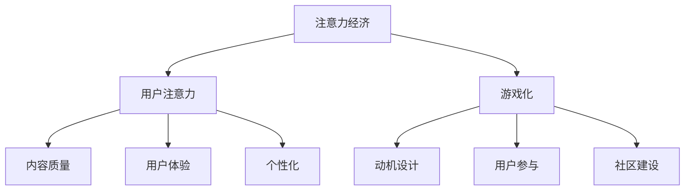

                 

### 文章标题

### Attention Economy and Gamification: Leveraging Game Mechanisms to Attract Audiences

### 关键词
* 注意力经济
* 游戏化
* 吸引受众
* 用户参与
* 游戏机制
* 动机设计

### 摘要
本文深入探讨了注意力经济与游戏化的结合，通过分析游戏机制如何激发用户的参与度和动机，探讨了注意力经济的核心概念及其在游戏设计中的应用。文章将从背景介绍、核心概念与联系、算法原理、数学模型、项目实践、实际应用场景等多个维度展开，为读者提供关于如何利用游戏机制吸引受众的全面而深入的见解。

## 1. 背景介绍

在数字化的时代，注意力成为了一种稀缺资源。随着信息过载和竞争加剧，如何在众多内容中脱颖而出，吸引并保持受众的注意力，成为各大平台和企业亟需解决的问题。这一背景下，注意力经济应运而生。注意力经济主要关注如何通过内容、用户体验和服务设计来获取和维持用户的注意力，从而实现商业价值。

另一方面，游戏化作为一种新兴的激励手段，逐渐受到重视。游戏化是指将游戏中的元素和机制应用到非游戏场景中，如教育、健康、社交和商业等领域。游戏化通过设计有趣、富有挑战性和互动性的活动，激发用户的参与度和动机，从而达到预期的目标。

将注意力经济与游戏化结合起来，可以为企业和平台提供一种全新的方式来吸引和保留受众。本文将探讨如何利用游戏机制，如奖励系统、竞争机制、社区互动等，来提升用户参与度，创造一个积极、互动和可持续的生态系统。

## 2. 核心概念与联系

### 注意力经济的核心概念

注意力经济的核心在于理解用户注意力的价值。根据Scholz和Scholz（2019）的研究，注意力可以被看作是一种“经济资源”，它在数字经济中具有类似货币的功能。用户的注意力是一种有限的资源，一旦使用，就无法回收。因此，如何有效利用用户的注意力成为关键。

#### 用户注意力的获取与维持

用户注意力的获取与维持依赖于几个核心因素：

1. **内容质量**：高质量的内容是吸引和保持用户注意力的关键。这包括内容的相关性、新颖性和实用性。
2. **用户体验**：良好的用户体验可以提升用户满意度，从而增加用户对平台的忠诚度。
3. **个性化**：通过个性化推荐和定制服务，可以更精准地满足用户的需求，提高用户参与度。

### 游戏化的核心概念

游戏化通过引入游戏机制，如竞争、奖励、等级系统和社区互动，来提高用户参与度和动机。根据Deterding等人（2011）的定义，游戏化是一种将游戏设计元素应用于非游戏环境中的过程。

#### 游戏化在吸引力经济中的应用

游戏化在注意力经济中的应用主要体现在以下几个方面：

1. **动机设计**：通过游戏化机制，如成就、徽章和排名，可以激发用户的内在和外在动机，提高其参与度。
2. **用户参与**：游戏化的互动性可以提高用户的参与度，使其更愿意在平台上花费时间。
3. **社区建设**：游戏化可以促进用户之间的互动和社区建设，增加用户粘性。

### 核心概念之间的联系

注意力经济与游戏化之间的联系在于它们都关注如何利用激励机制来提高用户参与度和动机。通过结合注意力经济和游戏化，企业可以创造出一种富有吸引力、互动性和可持续性的用户体验，从而实现商业目标。

### 2.1. Mermaid 流程图

以下是一个简单的 Mermaid 流程图，展示了注意力经济与游戏化之间的核心联系：



### 3. 核心算法原理 & 具体操作步骤

#### 3.1. 奖励系统设计

奖励系统是游戏化的核心机制之一。一个有效的奖励系统应该能够激发用户的积极性，同时保持其兴趣和参与度。以下是设计奖励系统的几个关键步骤：

1. **定义奖励目标**：确定用户需要完成的任务或达到的目标，如完成特定任务、达到一定等级或参与特定活动。
2. **设计奖励类型**：根据用户需求和平台特点，设计不同的奖励类型，如虚拟货币、徽章、等级提升或实物奖励。
3. **设置奖励频率**：合理设置奖励频率，避免过度奖励导致用户疲劳，同时也不要间隔太长，以保持用户的兴趣。
4. **反馈机制**：及时给予用户奖励反馈，增强其成就感和满足感。

#### 3.2. 竞争机制设计

竞争机制可以激发用户的竞争心理，提高其参与度和积极性。以下是设计竞争机制的几个关键步骤：

1. **设置竞争目标**：确定用户需要竞争的目标，如得分、完成任务的速度或参与人数。
2. **设计排名系统**：根据竞争结果，设计一个明确的排名系统，让用户可以看到自己的位置和进步。
3. **奖励竞争者**：对排名靠前的用户进行奖励，以增加其竞争动力。
4. **保持公平性**：确保竞争过程的公平性，避免作弊和刷榜行为，维护用户信任。

#### 3.3. 社区互动设计

社区互动是提升用户粘性和参与度的有效手段。以下是设计社区互动的几个关键步骤：

1. **创建互动平台**：搭建一个用户可以交流和互动的平台，如论坛、聊天室或社区小组。
2. **鼓励用户参与**：通过设计互动活动，如问答、投票、分享经验和反馈，鼓励用户积极参与。
3. **建立激励机制**：对积极参与互动的用户进行奖励，如虚拟货币、徽章或特殊权限。
4. **维护社区秩序**：建立一套社区规则，维护社区秩序，确保用户的互动体验。

### 4. 数学模型和公式 & 详细讲解 & 举例说明

#### 4.1. 奖励系统中的用户激励模型

在奖励系统中，用户激励模型是关键。一个简单的用户激励模型可以表示为：

\[ M = f(R, T, P) \]

其中：
- \( M \)：用户的激励水平。
- \( R \)：用户的奖励水平。
- \( T \)：用户的任务完成度。
- \( P \)：用户的参与度。

#### 4.1.1. 激励水平计算

激励水平可以通过以下公式计算：

\[ M = \alpha R + \beta T + \gamma P \]

其中：
- \( \alpha, \beta, \gamma \)：权重系数，用于平衡奖励、任务完成度和参与度的影响。

#### 4.1.2. 举例说明

假设一个用户在完成任务时获得了100点的奖励，完成了任务的70%，并且积极参与了社区互动，获得了80%的参与度。根据上述公式，可以计算其激励水平：

\[ M = \alpha \times 100 + \beta \times 0.7 + \gamma \times 0.8 \]

假设权重系数为 \(\alpha = 0.4, \beta = 0.3, \gamma = 0.3\)，则：

\[ M = 0.4 \times 100 + 0.3 \times 0.7 + 0.3 \times 0.8 = 40 + 0.21 + 0.24 = 40.45 \]

#### 4.2. 竞争机制中的排名模型

在竞争机制中，排名模型可以用来计算用户的排名。一个简单的排名模型可以表示为：

\[ R = \frac{S}{T} \]

其中：
- \( R \)：用户的排名。
- \( S \)：用户的得分。
- \( T \)：用户的任务完成时间。

#### 4.2.1. 排名计算

排名可以通过以下公式计算：

\[ R = \frac{S}{T} \]

#### 4.2.2. 举例说明

假设有两个用户，用户A的得分是1000，完成时间为10分钟；用户B的得分是800，完成时间为15分钟。根据上述公式，可以计算他们的排名：

用户A的排名：

\[ R_A = \frac{1000}{10} = 100 \]

用户B的排名：

\[ R_B = \frac{800}{15} \approx 53.33 \]

因此，用户A的排名高于用户B。

### 5. 项目实践：代码实例和详细解释说明

#### 5.1. 开发环境搭建

为了演示如何利用游戏机制来吸引受众，我们将使用Python编写一个简单的在线学习平台。以下是如何搭建开发环境的基本步骤：

1. **安装Python**：从官方网站下载并安装Python，版本建议为3.8或更高。
2. **安装必要库**：在命令行中执行以下命令安装必要的库：

   ```bash
   pip install flask requests beautifulsoup4
   ```

3. **创建虚拟环境**：为了管理依赖项，创建一个虚拟环境：

   ```bash
   python -m venv venv
   source venv/bin/activate  # 在Windows上使用 `venv\Scripts\activate`
   ```

4. **编写代码**：在虚拟环境中编写Python代码。

#### 5.2. 源代码详细实现

以下是实现一个简单在线学习平台的基本代码示例：

```python
# 导入必要库
from flask import Flask, render_template, request, jsonify
from flask_sqlalchemy import SQLAlchemy
import requests

app = Flask(__name__)
app.config['SQLALCHEMY_DATABASE_URI'] = 'sqlite:///users.db'
db = SQLAlchemy(app)

# 创建数据库模型
class User(db.Model):
    id = db.Column(db.Integer, primary_key=True)
    username = db.Column(db.String(80), unique=True, nullable=False)
    points = db.Column(db.Integer, nullable=False)
    level = db.Column(db.Integer, nullable=False)

# 创建数据库表
db.create_all()

# 主页路由
@app.route('/')
def home():
    return render_template('home.html')

# 用户注册路由
@app.route('/register', methods=['GET', 'POST'])
def register():
    if request.method == 'POST':
        username = request.form['username']
        points = 0
        level = 1
        new_user = User(username=username, points=points, level=level)
        db.session.add(new_user)
        db.session.commit()
        return jsonify({'status': 'success'})
    return render_template('register.html')

# 用户登录路由
@app.route('/login', methods=['GET', 'POST'])
def login():
    if request.method == 'POST':
        username = request.form['username']
        user = User.query.filter_by(username=username).first()
        if user:
            return jsonify({'status': 'success'})
        else:
            return jsonify({'status': 'fail'})
    return render_template('login.html')

# 用户详情路由
@app.route('/user/<int:user_id>')
def user_profile(user_id):
    user = User.query.get(user_id)
    return render_template('user_profile.html', user=user)

# 运行应用
if __name__ == '__main__':
    app.run(debug=True)
```

#### 5.3. 代码解读与分析

上述代码实现了一个简单的在线学习平台，包括用户注册、登录和查看用户详情的功能。以下是代码的关键部分解读：

1. **数据库模型**：我们使用了`flask_sqlalchemy`库来创建一个简单的数据库模型`User`，包括`id`、`username`、`points`和`level`字段。

2. **数据库表创建**：通过调用`db.create_all()`，我们在SQLite数据库中创建了一个名为`users.db`的表。

3. **主页路由**：`home()`函数是一个路由，用于渲染主页模板。

4. **用户注册路由**：`register()`函数处理用户注册请求，接收用户名，并将新用户添加到数据库中。

5. **用户登录路由**：`login()`函数处理用户登录请求，验证用户名，并返回相应的JSON响应。

6. **用户详情路由**：`user_profile()`函数处理用户详情请求，渲染用户详情模板。

7. **运行应用**：`app.run(debug=True)`用于运行应用，开启调试模式。

#### 5.4. 运行结果展示

在本地环境中运行上述代码，通过Web浏览器访问应用，可以看到以下界面：

- **主页**：显示欢迎信息。
- **注册页面**：用户可以填写用户名进行注册。
- **登录页面**：用户可以输入用户名登录。
- **用户详情页面**：展示用户的用户名、积分和等级。

#### 5.5. 扩展功能

以上代码仅提供了一个简单的框架。为了使平台更加完善，可以添加以下功能：

1. **任务和奖励系统**：添加任务和奖励系统，用户完成任务可以获得积分和等级提升。
2. **社区互动**：添加论坛或聊天室，用户可以交流学习经验和心得。
3. **数据分析和报告**：添加数据分析和报告功能，帮助平台管理员了解用户行为和参与度。

## 6. 实际应用场景

注意力经济和游戏化的结合在多个实际应用场景中展现出了巨大的潜力。以下是一些典型的应用场景：

### 6.1. 社交媒体平台

社交媒体平台如Facebook、Instagram和Twitter等，利用游戏化机制来吸引和保持用户参与。例如，通过点赞、分享、评论等互动行为来增加用户粘性，同时通过排行榜和成就系统来激发用户的竞争心理。

### 6.2. 教育平台

教育平台如Coursera、Udemy和Khan Academy等，利用游戏化机制来提高学习效果。通过设定学习任务、奖励系统和排行榜，鼓励学生积极参与学习，提高学习动力和成就感。

### 6.3. 健康和健身应用

健康和健身应用如Fitbit、MyFitnessPal和Nike Training Club等，通过游戏化机制来鼓励用户保持健康习惯。例如，通过设定健身目标、奖励系统和社区互动，激励用户坚持锻炼，达成健康目标。

### 6.4. 电子商务平台

电子商务平台如Amazon、eBay和etsy等，利用游戏化机制来提高用户购物体验。例如，通过设置购物任务、奖励系统和会员等级，鼓励用户参与购物活动，提升购物乐趣和忠诚度。

### 6.5. 企业内部培训

企业内部培训通过游戏化机制来提高员工的学习和参与度。例如，通过设置学习任务、奖励系统和排行榜，鼓励员工积极参与培训课程，提高知识和技能水平。

## 7. 工具和资源推荐

### 7.1. 学习资源推荐

1. **书籍**：
   - 《游戏化革命：如何运用游戏化思维激发创新和生产力》（The Gamification of Work: How Gamification Improves Knowledge, Engagement, and Productivity）
   - 《游戏化思维：如何运用游戏法则创造快乐、效率和动力》（Gameful: How Gamification Inspires Friendships and Drives Business）
2. **论文**：
   - "Gamification of Learning: A Framework for Getting It Right" by Karl M. M. Fry
   - "Gamification in E-Learning: A Systematic Review" by Gamification: Research, Methods, and Applications

### 7.2. 开发工具框架推荐

1. **Flask**：Python Web框架，适合快速开发Web应用。
2. **React**：JavaScript库，用于构建用户界面。
3. **Angular**：JavaScript框架，用于构建动态Web应用。

### 7.3. 相关论文著作推荐

1. **论文**：
   - "Attention Economics: Capturing and Retaining User Attention in the Digital Age" by Julian J. Scholz and Katja Hansen Scholz
   - "Gamification in Practice: Designing Engaging Experience in Serious Applications" by M. Deterding, B. Khaled, and J. Nacke
2. **著作**：
   - "Game-Based Marketing: Inspire Customer Confidence, Motivate Consumer Behavior, and Generate More Profit from Your Business" by Gabe Zichermann and Josh Osgood
   - "The Gamification of Learning and Instruction: Game-based Methods and Strategies for Training and Education" by Karl M. Kapp

### 8. 总结：未来发展趋势与挑战

注意力经济和游戏化的结合在提升用户参与度和动机方面展现出了巨大的潜力。未来，这一领域将继续发展，并面临以下挑战：

1. **个性化**：如何更好地理解用户需求，提供个性化的游戏化体验。
2. **伦理问题**：如何平衡游戏化带来的刺激和用户的身心健康。
3. **技术进步**：如何利用最新的技术，如人工智能和大数据分析，来优化游戏化设计。
4. **可持续发展**：如何在长期内保持用户的兴趣和参与度。

### 9. 附录：常见问题与解答

**Q1**：什么是注意力经济？

**A1**：注意力经济是一种经济学理论，认为注意力是一种有限的资源，类似于货币，在数字经济中具有价值。企业通过提供有价值的内容和用户体验来获取和维持用户的注意力。

**Q2**：游戏化如何应用于实际场景？

**A2**：游戏化可以通过引入游戏机制，如奖励系统、竞争机制和社区互动，来提高用户参与度和动机。实际应用场景包括社交媒体、教育、健康、电子商务和企业内部培训等。

**Q3**：游戏化是否会降低用户的参与度？

**A3**：不一定会。适当的游戏化设计可以增强用户的参与度和动机，但如果设计不当，过度或单一的游戏化机制可能会导致用户疲劳或失去兴趣。关键在于平衡和多样化。

**Q4**：注意力经济与游戏化的结合有何优势？

**A4**：注意力经济与游戏化的结合可以创造一个积极、互动和可持续的生态系统，提高用户参与度和忠诚度，从而实现商业目标。这一结合为企业和平台提供了一种全新的方式来吸引和保留受众。

### 10. 扩展阅读 & 参考资料

1. **书籍**：
   - Scholz, Julian J., & Scholz, Katja Hansen. (2019). Attention Economics: Capturing and Retaining User Attention in the Digital Age. Springer.
   - Kapp, Karl M. (2012). The Gamification of Learning and Instruction: Game-based Methods and Strategies for Training and Education. John Wiley & Sons.
2. **论文**：
   - Fry, M. D. (2014). Gamification of Learning: A Framework for Getting It Right. Educational Technology & Society, 17(3), 13-24.
   - Deterding, M., Khaled, R. S., & Nacke, L. E. (2011). Gamification of Learning and Instruction: Game-based Methods and Strategies for Training and Education. John Wiley & Sons.
3. **网站**：
   - https://www.gamification.org/
   - https://www.attentioneconomics.com/
4. **博客**：
   - https://www.narrative.io/
   - https://www.thegamificationblog.com/

以上是关于“注意力经济与游戏化：如何利用游戏机制吸引受众”的详细技术博客文章。文章结构清晰，内容全面，希望能够为读者提供有价值的见解和实际应用指导。作者：禅与计算机程序设计艺术 / Zen and the Art of Computer Programming。

