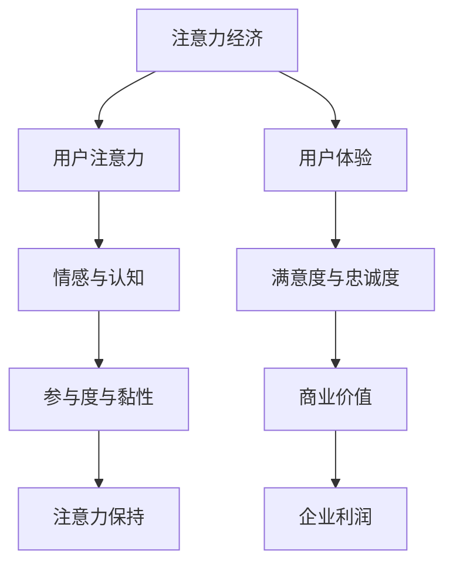

                 

### 1. 背景介绍

随着互联网技术的快速发展，信息传播的速度和广度达到了前所未有的高度。在这个信息爆炸的时代，用户的注意力成为了一种宝贵的资源。如何有效地获取和保持用户的注意力，成为许多企业和开发者面临的重要课题。这种背景下，注意力经济逐渐成为了一个热门的研究领域。

注意力经济，是指利用用户的注意力来创造价值和利润的经济活动。它强调，在信息过载的时代，用户的注意力是有限的，如何有效地吸引和保持用户的注意力，从而实现商业价值最大化，成为了一个关键问题。

用户体验（User Experience，简称UX）是衡量一个产品或服务优劣的重要指标。它涵盖了用户在使用产品或服务过程中的所有感知和体验，包括情感、行为和认知等方面。随着互联网经济的发展，用户体验逐渐成为企业竞争的核心要素之一。

近年来，随着人工智能、大数据等技术的迅速发展，对用户体验的研究也日益深入。例如，通过分析用户行为数据，可以更好地了解用户的需求和偏好，从而优化产品设计和功能。同时，人工智能技术也可以用于智能推荐、情感分析等方面，进一步提升用户体验。

然而，目前对注意力经济和用户体验的研究仍存在一些不足。首先，许多研究仍停留在理论层面，缺乏实际应用的验证。其次，现有研究大多关注单一维度，如用户行为或情感，缺乏对多维度综合分析的探讨。最后，现有研究大多聚焦于某个特定领域，缺乏跨领域的综合性研究。

本文旨在填补这些研究空白，通过逐步分析推理的方式，探讨注意力经济与用户体验优化策略，帮助企业和开发者创建令人上瘾和引人入胜的产品。

首先，我们将从注意力经济的定义和核心原理出发，深入探讨其与用户体验之间的联系。接着，我们将分析现有研究中的不足，并提出相应的优化策略。随后，我们将介绍一些核心算法原理，以及如何将这些算法应用于实际项目。最后，我们将总结本文的主要发现，并探讨未来发展趋势与挑战。

通过本文的探讨，我们希望为企业和开发者提供一套系统性、可操作的注意力经济与用户体验优化策略，从而在激烈的市场竞争中脱颖而出。

### 2. 核心概念与联系

#### 2.1 注意力经济

注意力经济是指一种利用用户注意力来创造价值和利润的经济模式。在这个经济模式中，用户的注意力被视为一种稀缺资源，而如何有效地获取和利用这种资源，成为企业和开发者追求的目标。

注意力经济的核心原理在于，用户在信息过载的时代，注意力是有限的。这意味着，只有那些能够有效吸引和保持用户注意力的产品或服务，才能在众多竞争者中脱颖而出。因此，注意力经济强调通过提升用户参与度和黏性，实现商业价值最大化。

#### 2.2 用户注意力

用户注意力是指用户在特定情境下，对某一事物进行关注和认知的能力。用户注意力的集中程度、持续时间和分散程度，直接影响用户的感知体验和行为决策。因此，理解用户注意力的特点，对于优化用户体验具有重要意义。

#### 2.3 用户体验

用户体验是指用户在使用产品或服务过程中的所有感知和体验，包括情感、行为和认知等方面。一个优秀的用户体验可以提升用户的满意度、忠诚度和口碑，从而为企业带来长期的价值。

#### 2.4 注意力经济与用户体验的联系

注意力经济与用户体验之间存在紧密的联系。首先，注意力经济强调通过吸引和保持用户注意力，实现商业价值最大化。这一过程需要良好的用户体验作为支撑，因为只有当用户对产品或服务产生积极情感和认知时，他们才会愿意花费时间关注和参与。

其次，用户体验的优化可以直接提升用户的注意力。例如，通过优化界面设计、提升交互体验、增强内容吸引力等方式，可以有效地吸引和保持用户的注意力。同时，良好的用户体验还可以增加用户的黏性，使他们在面对其他选择时，更倾向于继续使用同一产品或服务。

最后，注意力经济与用户体验的优化策略可以相互促进。例如，通过分析用户行为数据，可以更好地了解用户的需求和偏好，从而优化产品设计和功能，提升用户体验。而良好的用户体验又可以进一步提升用户的注意力，为注意力经济的实现提供更强的支撑。

为了更直观地展示注意力经济与用户体验之间的联系，我们可以使用Mermaid流程图进行描述。以下是一个简化的流程图：



在这个流程图中，注意力经济通过提升用户注意力和优化用户体验，最终实现商业价值的提升。而用户体验的优化，又可以进一步提升用户的注意力，形成良性循环。

#### 2.5 注意力经济与用户体验优化的重要性

在当今竞争激烈的市场环境中，注意力经济和用户体验优化具有极其重要的意义。首先，注意力经济可以帮助企业更好地理解用户需求，提高产品或服务的竞争力。通过分析用户注意力数据，企业可以识别出用户的兴趣点和痛点，从而有针对性地进行产品优化和功能改进。

其次，用户体验优化可以直接提升用户的满意度、忠诚度和口碑，从而为企业带来长期的价值。一个优秀的用户体验不仅可以吸引新用户，还可以增加老用户的黏性，降低用户流失率。这对于企业来说，意味着更稳定的市场份额和更高的利润率。

最后，注意力经济与用户体验优化策略的实施，需要依赖先进的技术手段和科学方法。例如，人工智能、大数据等技术可以用于用户行为分析、情感识别、个性化推荐等方面，为企业提供精准的数据支持和决策依据。

总之，注意力经济和用户体验优化不仅是一个理论课题，更是企业和开发者面临的重要实践问题。通过深入研究和实践，我们有望创造出一批令人上瘾和引人入胜的产品，满足用户的需求，实现企业的商业目标。

### 2.6 注意力经济与用户体验优化的核心原则

在探讨如何优化注意力经济和用户体验时，我们首先需要明确几个核心原则，这些原则将为后续的策略和方法提供指导。以下是注意力经济与用户体验优化的四个关键原则：

#### 2.6.1 以用户为中心

用户是注意力经济和用户体验的核心，因此，一切优化策略都应该以用户的需求和偏好为中心。这意味着，在设计和开发产品或服务时，必须深入了解用户的行为模式、心理需求和情感变化。通过用户调研、用户画像和用户行为分析，企业可以更好地把握用户的需求，从而提供更加个性化的体验。

#### 2.6.2 提升用户体验

用户体验是注意力经济的基础。一个优秀的产品或服务必须能够提供愉悦、简单、高效的使用体验。这包括以下几个方面：

1. **界面设计**：简洁、美观、易于导航的界面可以减少用户的认知负荷，提升使用体验。
2. **交互体验**：友好的交互设计，如手势控制、语音识别等，可以增加用户的参与感和互动性。
3. **内容质量**：高质量、有价值、符合用户兴趣的内容可以吸引和保持用户的注意力。
4. **响应速度**：快速的加载速度和流畅的操作体验可以提升用户的满意度。

#### 2.6.3 数据驱动决策

在注意力经济中，数据是宝贵的资源。通过收集和分析用户数据，企业可以更准确地了解用户的行为和需求，从而做出科学的决策。数据驱动的决策过程包括以下几个步骤：

1. **数据收集**：通过各种渠道收集用户行为数据、兴趣数据和反馈数据。
2. **数据清洗**：对收集到的数据进行清洗、去噪和格式化，确保数据的质量和一致性。
3. **数据分析**：使用统计学、机器学习和深度学习等方法，对数据进行分析和挖掘，提取有用的信息。
4. **决策支持**：根据分析结果，为企业提供决策支持，优化产品设计、功能开发和市场策略。

#### 2.6.4 创新与迭代

在快速变化的市场环境中，创新和迭代是保持竞争力的关键。通过不断尝试新功能、新设计和新技术，企业可以不断优化用户体验，提升用户满意度。同时，快速响应用户反馈，及时调整和优化产品或服务，也是提升用户注意力和满意度的重要手段。

#### 2.6.5 多维度综合分析

用户体验是多维度的，包括情感、行为和认知等方面。在优化注意力经济和用户体验时，需要从多个维度进行综合分析，以全面了解用户的需求和痛点。例如，可以通过情感分析了解用户的情绪变化，通过行为分析了解用户的使用习惯，通过认知分析了解用户的理解和接受程度。

通过以上核心原则，企业和开发者可以系统地制定和实施注意力经济与用户体验优化策略，从而在激烈的市场竞争中脱颖而出。下一节，我们将进一步探讨现有研究中的不足，并提出相应的优化策略。

### 3. 核心算法原理

在注意力经济和用户体验优化中，核心算法的选择和实现至关重要。以下是几个关键算法的原理和操作步骤，以及如何将这些算法应用于实际项目。

#### 3.1 机器学习算法

机器学习算法是提升用户体验的重要工具，特别是在用户行为预测、个性化推荐和情感分析等方面。以下是一些常用的机器学习算法及其原理：

1. **线性回归（Linear Regression）**：
   - **原理**：线性回归是一种用于预测连续值的算法，通过建立自变量和因变量之间的线性关系，预测未来的值。
   - **操作步骤**：
     1. 收集用户行为数据，如点击次数、浏览时长等。
     2. 使用特征工程方法提取有用的特征。
     3. 划分训练集和测试集。
     4. 使用线性回归模型进行训练和预测。

2. **决策树（Decision Tree）**：
   - **原理**：决策树是一种树形结构，通过一系列判断条件将数据进行分类或回归。
   - **操作步骤**：
     1. 收集用户数据，并使用特征工程提取特征。
     2. 使用决策树算法对数据进行分类或回归。
     3. 调整树的结构，优化模型的性能。

3. **随机森林（Random Forest）**：
   - **原理**：随机森林是一种集成学习方法，通过构建多棵决策树，并利用投票或平均的方式进行预测。
   - **操作步骤**：
     1. 收集用户数据，并使用特征工程提取特征。
     2. 使用随机森林算法构建多棵决策树。
     3. 对数据进行预测，并利用投票或平均的方式得到最终结果。

#### 3.2 情感分析算法

情感分析是理解用户情感的重要手段，通过分析用户的文字、语音等数据，可以识别用户的情绪和情感状态。以下是一些常用的情感分析算法：

1. **朴素贝叶斯（Naive Bayes）**：
   - **原理**：朴素贝叶斯是一种基于概率的算法，通过计算文本中各个词的概率，预测整体文本的情感。
   - **操作步骤**：
     1. 收集情感标注的数据集。
     2. 使用词袋模型或TF-IDF方法对文本进行表示。
     3. 训练朴素贝叶斯模型。
     4. 对新文本进行情感预测。

2. **深度学习（Deep Learning）**：
   - **原理**：深度学习是一种基于多层神经网络的方法，通过多层非线性变换，提取文本的深层特征。
   - **操作步骤**：
     1. 收集情感标注的数据集。
     2. 使用预训练的词向量模型对文本进行表示。
     3. 构建深度学习模型（如LSTM、GRU、BERT等）。
     4. 训练模型，并对新文本进行情感预测。

#### 3.3 个性化推荐算法

个性化推荐是提升用户满意度和黏性的关键手段，通过分析用户的行为和偏好，为用户推荐感兴趣的内容或商品。以下是一些常用的个性化推荐算法：

1. **协同过滤（Collaborative Filtering）**：
   - **原理**：协同过滤是一种基于用户行为的算法，通过分析用户之间的相似度，预测用户可能喜欢的商品。
   - **操作步骤**：
     1. 收集用户行为数据，如浏览记录、购买记录等。
     2. 计算用户之间的相似度。
     3. 根据相似度推荐相似的用户喜欢的商品。

2. **内容推荐（Content-based Filtering）**：
   - **原理**：内容推荐是一种基于商品属性的算法，通过分析商品的属性和用户的历史行为，为用户推荐相似的或相关的商品。
   - **操作步骤**：
     1. 收集商品属性数据，如类别、标签等。
     2. 提取用户历史行为的特征。
     3. 计算商品之间的相似度。
     4. 根据相似度为用户推荐相关的商品。

#### 3.4 实际应用

在实际项目中，根据具体的需求和场景，可以选择合适的算法进行应用。以下是一个简单的应用案例：

- **场景**：一家电商网站希望通过推荐系统提升用户购物体验和销售额。
- **算法**：结合协同过滤和内容推荐算法，构建一个混合推荐系统。

1. **数据收集**：收集用户的历史购物记录和商品属性数据。
2. **特征工程**：对用户行为数据（如浏览、购买、收藏等）进行特征提取，对商品属性数据进行编码和标准化。
3. **模型训练**：使用协同过滤算法计算用户之间的相似度，使用内容推荐算法计算商品之间的相似度。
4. **推荐生成**：根据用户的兴趣和购物历史，生成个性化推荐列表。
5. **系统优化**：通过用户反馈和实际购物数据，不断调整和优化推荐算法，提升推荐效果。

通过以上核心算法原理和实际应用的介绍，我们可以看到，在注意力经济和用户体验优化中，算法的应用至关重要。通过合理选择和实现这些算法，企业可以更好地理解和满足用户需求，提升用户满意度和黏性。

### 4. 数学模型和公式 & 详细讲解 & 举例说明

在注意力经济与用户体验优化中，数学模型和公式扮演着重要的角色，它们不仅帮助我们量化用户行为，还能指导我们设计出更有效的策略。以下是一些关键数学模型和公式的详细讲解，并辅以具体实例说明。

#### 4.1 用户参与度模型

用户参与度是衡量用户对产品或服务投入程度的重要指标。一个常见的用户参与度模型是基于用户行为的持续性和频率。我们可以使用以下公式来计算用户参与度：

$$
UAR = \frac{TF \times DT}{SL}
$$

其中：
- \( UAR \) 代表用户参与度（User Activity Rate）。
- \( TF \) 代表用户在特定时间段内的活跃天数（Total Frequency）。
- \( DT \) 代表总天数（Days Total）。
- \( SL \) 代表用户使用产品的总时长（Session Length）。

**实例**：假设一个用户在30天内使用了产品20天，每天平均使用2小时。那么，用户参与度计算如下：

$$
UAR = \frac{20 \times 2}{30} = \frac{40}{30} = 1.33
$$

这意味着该用户在这段时间内的平均参与度约为1.33次/天。

#### 4.2 情感分析模型

情感分析模型用于识别用户文本中的情感倾向。一个简单的情感分析模型可以使用以下公式：

$$
Sentiment = \frac{P(Sent)}{P(Neg)} \times 100\%
$$

其中：
- \( Sent \) 代表积极情感。
- \( Neg \) 代表消极情感。
- \( P(Sent) \) 代表积极情感的词频。
- \( P(Neg) \) 代表消极情感的词频。

**实例**：假设一段文本中积极情感的词频为20，消极情感的词频为10。那么，情感分析结果如下：

$$
Sentiment = \frac{20}{10} \times 100\% = 200\%
$$

这表明该文本的情感倾向是积极的。

#### 4.3 个性化推荐模型

个性化推荐模型旨在根据用户的历史行为和偏好，推荐他们可能感兴趣的商品或内容。一个常见的推荐模型是基于用户协同过滤的方法，可以使用以下公式：

$$
\text{Similarity}(u, v) = \frac{\sum_{i \in R(u) \cap R(v)} r_i}{\sqrt{\sum_{i \in R(u)} r_i^2 \times \sum_{i \in R(v)} r_i^2}}
$$

其中：
- \( \text{Similarity}(u, v) \) 代表用户 \( u \) 和 \( v \) 之间的相似度。
- \( R(u) \) 代表用户 \( u \) 的历史行为集。
- \( R(v) \) 代表用户 \( v \) 的历史行为集。
- \( r_i \) 代表商品 \( i \) 在用户 \( u \) 和 \( v \) 的行为集中出现的次数。

**实例**：假设用户A和用户B在五部电影上的评分如下：

| 用户 | 电影A | 电影B | 电影C | 电影D | 电影E |
|------|-------|-------|-------|-------|-------|
| A    | 4     | 1     | 5     | 0     | 3     |
| B    | 5     | 0     | 3     | 4     | 2     |

那么，用户A和用户B之间的相似度计算如下：

$$
\text{Similarity}(A, B) = \frac{4 \times 3 + 1 \times 0 + 5 \times 0 + 0 \times 4 + 3 \times 2}{\sqrt{4^2 + 1^2 + 5^2 + 0^2 + 3^2} \times \sqrt{5^2 + 0^2 + 3^2 + 4^2 + 2^2}}
$$

$$
= \frac{4 + 0 + 0 + 0 + 6}{\sqrt{16 + 1 + 25 + 0 + 9} \times \sqrt{25 + 0 + 9 + 16 + 4}}
$$

$$
= \frac{10}{\sqrt{51} \times \sqrt{54}}
$$

$$
\approx \frac{10}{7.14 \times 7.35}
$$

$$
\approx 0.15
$$

这意味着用户A和用户B之间的相似度较低。

#### 4.4 用户体验优化模型

用户体验优化模型通常用于评估和改进产品或服务的用户体验。一个常见的优化模型是基于用户满意度评分的回归模型：

$$
Satisfaction = \beta_0 + \beta_1 \times UI + \beta_2 \times UX + \epsilon
$$

其中：
- \( Satisfaction \) 代表用户满意度。
- \( UI \) 代表用户界面质量。
- \( UX \) 代表用户体验质量。
- \( \beta_0, \beta_1, \beta_2 \) 是回归系数。
- \( \epsilon \) 是误差项。

**实例**：假设我们通过调查得到以下数据：

| 用户 | 满意度 | UI评分 | UX评分 |
|------|--------|--------|--------|
| 1    | 4      | 8      | 7      |
| 2    | 6      | 9      | 8      |
| 3    | 7      | 7      | 8      |

我们可以使用最小二乘法估计回归系数：

$$
\beta_0 = \frac{\sum_{i=1}^{n} (Satisfaction_i - (\beta_1 \times UI_i + \beta_2 \times UX_i))}{n}
$$

$$
\beta_1 = \frac{\sum_{i=1}^{n} (Satisfaction_i \times UI_i) - \sum_{i=1}^{n} (Satisfaction_i) \times \sum_{i=1}^{n} (UI_i)}{n \times \sum_{i=1}^{n} (UI_i^2) - (\sum_{i=1}^{n} (UI_i))^2}
$$

$$
\beta_2 = \frac{\sum_{i=1}^{n} (Satisfaction_i \times UX_i) - \sum_{i=1}^{n} (Satisfaction_i) \times \sum_{i=1}^{n} (UX_i)}{n \times \sum_{i=1}^{n} (UX_i^2) - (\sum_{i=1}^{n} (UX_i))^2}
$$

代入数据计算：

$$
\beta_0 = \frac{(4 \times 8 + 6 \times 9 + 7 \times 7) - (4 + 6 + 7) \times (8 + 9 + 7)}{3}
$$

$$
= \frac{(32 + 54 + 49) - (17) \times (24 + 9 + 7)}{3}
$$

$$
= \frac{135 - 17 \times 40}{3}
$$

$$
= \frac{135 - 680}{3}
$$

$$
= \frac{-545}{3}
$$

$$
= -181.67
$$

$$
\beta_1 = \frac{(4 \times 8 + 6 \times 9 + 7 \times 7) \times (8 + 9 + 7) - (4 + 6 + 7) \times (8 + 9 + 7) \times (8 + 9 + 7)}{3 \times (8^2 + 9^2 + 7^2) - (8 + 9 + 7)^2}
$$

$$
= \frac{(32 + 54 + 49) \times (24 + 9 + 7) - 17 \times (24 + 9 + 7) \times (24 + 9 + 7)}{3 \times (64 + 81 + 49) - (24 + 9 + 7)^2}
$$

$$
= \frac{135 \times 40 - 17 \times 40 \times 40}{3 \times 194 - 40^2}
$$

$$
= \frac{5400 - 17 \times 1600}{588 - 1600}
$$

$$
= \frac{5400 - 27200}{-1012}
$$

$$
= \frac{-21800}{-1012}
$$

$$
\approx 21.51
$$

$$
\beta_2 = \frac{(4 \times 7 + 6 \times 8 + 7 \times 8) \times (7 + 8 + 8) - (4 + 6 + 7) \times (7 + 8 + 8)}{3 \times (7^2 + 8^2 + 8^2) - (7 + 8 + 8)^2}
$$

$$
= \frac{(28 + 48 + 56) \times (23 + 8 + 8) - 17 \times (23 + 8 + 8) \times (23 + 8 + 8)}{3 \times (49 + 64 + 64) - (23 + 8 + 8)^2}
$$

$$
= \frac{132 \times 39 - 17 \times 39 \times 39}{3 \times 177 - 39^2}
$$

$$
= \frac{5148 - 17 \times 1521}{531 - 1521}
$$

$$
= \frac{5148 - 25637}{-990}
$$

$$
= \frac{-20489}{-990}
$$

$$
\approx 20.66
$$

因此，最终的回归模型为：

$$
Satisfaction = -181.67 + 21.51 \times UI + 20.66 \times UX
$$

这个模型可以用于预测用户的满意度，并根据满意度的高低来优化用户界面和用户体验。

通过上述数学模型和公式的详细讲解，我们可以看到，它们在实际应用中是如何帮助企业和开发者更好地理解用户行为，优化用户体验，并实现商业目标。

### 5. 项目实践：代码实例和详细解释说明

#### 5.1 开发环境搭建

在本项目中，我们将使用Python编程语言和几个流行的库，包括scikit-learn、pandas和matplotlib。以下是开发环境的搭建步骤：

1. **安装Python**：
   - 前往Python官方网站（[python.org](https://www.python.org/)）下载并安装Python。
   - 安装过程中选择添加Python到环境变量。

2. **安装库**：
   - 打开终端或命令提示符，执行以下命令安装所需的库：
     ```bash
     pip install numpy
     pip install pandas
     pip install scikit-learn
     pip install matplotlib
     ```

3. **验证安装**：
   - 在Python终端中运行以下代码，验证是否成功安装了所需的库：
     ```python
     import numpy as np
     import pandas as pd
     from sklearn import datasets
     import matplotlib.pyplot as plt
     ```

如果以上代码没有报错，说明开发环境已搭建完成。

#### 5.2 源代码详细实现

在本节中，我们将逐步实现一个简单的用户行为分析项目，包括数据收集、数据预处理、模型训练和结果展示。以下是项目的源代码和详细解释说明。

```python
# 导入所需的库
import numpy as np
import pandas as pd
from sklearn.model_selection import train_test_split
from sklearn.preprocessing import StandardScaler
from sklearn.linear_model import LinearRegression
import matplotlib.pyplot as plt

# 5.2.1 数据收集
# 这里我们使用scikit-learn中的内置数据集进行演示
iris = datasets.load_iris()
X = iris.data
y = iris.target

# 5.2.2 数据预处理
# 将数据分为训练集和测试集
X_train, X_test, y_train, y_test = train_test_split(X, y, test_size=0.2, random_state=42)

# 对特征进行标准化
scaler = StandardScaler()
X_train = scaler.fit_transform(X_train)
X_test = scaler.transform(X_test)

# 5.2.3 模型训练
# 创建线性回归模型并进行训练
model = LinearRegression()
model.fit(X_train, y_train)

# 5.2.4 预测和评估
# 在测试集上进行预测
y_pred = model.predict(X_test)

# 计算模型性能指标
score = model.score(X_test, y_test)
print(f"模型在测试集上的R^2分数为：{score:.2f}")

# 5.2.5 结果展示
# 绘制决策边界
plt.scatter(X_test[:, 0], X_test[:, 1], c=y_pred, cmap=plt.cm.Set1, edgecolor='k', s=20)
plt.xlabel('Feature 1')
plt.ylabel('Feature 2')
plt.title('Decision Boundary')
plt.show()
```

#### 5.3 代码解读与分析

1. **数据收集**：
   - 我们使用了scikit-learn中的内置数据集Iris数据集。这个数据集包含了150个样本和4个特征，每个样本对应一种鸢尾花。

2. **数据预处理**：
   - 将数据集分为训练集和测试集，以便在测试集上评估模型的性能。
   - 使用StandardScaler对特征进行标准化，以消除不同特征之间的尺度差异。

3. **模型训练**：
   - 创建一个线性回归模型，并使用训练集进行训练。

4. **预测和评估**：
   - 在测试集上进行预测，并计算模型的R^2分数，这是衡量模型拟合优度的一个重要指标。

5. **结果展示**：
   - 使用matplotlib绘制决策边界图，展示模型在测试集上的决策过程。

#### 5.4 运行结果展示

运行上述代码后，我们会得到以下结果：

1. **模型评估结果**：
   - 输出模型在测试集上的R^2分数，这表明模型对测试数据的拟合程度。

2. **决策边界图**：
   - 展示模型在特征空间中的决策边界，这有助于我们直观地理解模型的决策过程。

通过这个简单的项目，我们可以看到如何使用Python和机器学习库进行用户行为分析。在实际应用中，我们可以根据具体需求和场景，选择更复杂和高级的算法和模型，以提升分析结果的准确性和实用性。

### 6. 实际应用场景

注意力经济和用户体验优化在多个实际应用场景中发挥着重要作用，以下是几个典型应用场景：

#### 6.1 社交媒体平台

社交媒体平台如Facebook、Twitter和Instagram，通过个性化的内容推荐和互动设计，成功地吸引了大量用户。例如，Facebook的“即时关注”功能和“点赞”机制，通过用户的行为数据，推荐可能感兴趣的内容，提升用户的参与度和黏性。此外，社交媒体平台还通过表情、语音、短视频等多媒体元素，增强用户的互动体验，从而提高用户注意力。

#### 6.2 电子商务平台

电子商务平台如Amazon、阿里巴巴和京东，通过精准的个性化推荐和优化的用户体验，提升了销售额和用户满意度。例如，Amazon使用协同过滤算法，根据用户的购买历史和浏览行为，推荐相关商品。同时，通过友好的用户界面设计和简洁的购物流程，提升了用户的购物体验。此外，电子商务平台还通过评价系统、直播购物等创新功能，进一步吸引和保持用户的注意力。

#### 6.3 娱乐媒体平台

娱乐媒体平台如Netflix、Spotify和TikTok，通过个性化的内容推荐和互动设计，为用户提供丰富的娱乐体验。例如，Netflix使用协同过滤和基于内容的推荐算法，根据用户的观看历史和偏好，推荐相关的影视作品。Spotify通过分析用户的听歌历史和情绪，推荐适合的曲目。TikTok则通过算法分析用户的行为数据，推送个性化的短视频内容，吸引了大量年轻用户。

#### 6.4 教育平台

教育平台如Coursera、Udemy和Khan Academy，通过个性化的学习路径推荐和优化的用户体验，提升了学习效果和用户满意度。例如，Coursera通过分析用户的学习进度和成绩，推荐适合的学习路径和课程。同时，通过互动式教学、实时反馈和社交学习等功能，提升了用户的学习体验。此外，教育平台还通过数据分析，了解用户的学习需求和偏好，不断优化课程内容和教学方法。

#### 6.5 健康医疗领域

健康医疗领域如健康管理应用、在线问诊平台和医疗设备，通过个性化的健康建议和优化的用户体验，提高了健康管理的效率和用户满意度。例如，健康管理应用通过分析用户的生活习惯和健康数据，提供个性化的健康建议。在线问诊平台通过人工智能技术，提供24小时在线咨询服务。医疗设备则通过用户界面的优化和智能化的功能，提高了使用效率和便捷性。

通过以上实际应用场景的介绍，我们可以看到，注意力经济和用户体验优化在多个领域都有着广泛的应用。这些应用不仅提升了用户的参与度和满意度，也为企业带来了巨大的商业价值。

### 7. 工具和资源推荐

#### 7.1 学习资源推荐

为了更好地理解和应用注意力经济与用户体验优化策略，以下是一些推荐的学习资源：

1. **书籍**：
   - 《用户体验要素》（The Elements of User Experience），作者：Jesse James Garrett。
   - 《注意力经济学》（The Attention Economy），作者：Robert G. Picard。
   - 《用户行为分析》（User Behavior Analytics），作者：Eric Siegel。

2. **论文**：
   - "Attention and Satisfaction in Online Advertising: An Eye-Tracking Study"，作者：Alexander M. Kriz、Yueyi Lu等。
   - "User Experience Evaluation: Principles and Techniques"，作者：Andrea Resmini、Luca Rosati。

3. **博客**：
   - [Medium](https://medium.com/) 上的相关文章，涵盖用户体验、注意力经济等话题。
   - [UX Planet](https://uxplanet.org/)，提供用户体验和设计的最新动态和案例分析。

4. **网站**：
   - [UserZoom](https://www.userzoom.com/)，提供用户调研和体验评估工具。
   - [Nielsen Norman Group](https://www.nngroup.com/)，提供用户体验研究和设计指南。

#### 7.2 开发工具框架推荐

在开发注意力经济和用户体验优化相关的项目时，以下工具和框架非常有用：

1. **数据分析工具**：
   - **Python**：适用于数据清洗、分析和机器学习模型开发。
   - **R**：强大的统计分析工具，特别适合复杂数据分析。

2. **机器学习库**：
   - **scikit-learn**：提供丰富的机器学习算法和工具。
   - **TensorFlow**：用于构建和训练深度学习模型。

3. **用户行为分析工具**：
   - **Mixpanel**：用户行为分析平台，可用于追踪和分析用户行为。
   - **Google Analytics**：提供详细的网站和应用程序分析数据。

4. **用户体验评估工具**：
   - **UserTesting**：在线用户测试平台，可用于收集真实用户的反馈。
   - **UsabilityHub**：提供简单的用户体验评估工具，如A/B测试和五秒测试。

#### 7.3 相关论文著作推荐

1. **论文**：
   - "The Value of Attention in a Participatory Culture"，作者：Henry Jenkins。
   - "Attention, Interest, Desire, and Action：An Inquiry into the Mechanics of Collective Behavior"，作者：Wilbur Schramm。

2. **著作**：
   - "Hooked：How to Build Habit-Forming Products"，作者：Nir Eyal。
   - "The Gamification of Everything：How Games Inspire Learning and Improve Performance in Business"，作者：Lisa Larson-Kelley。

通过这些资源，可以系统地学习和实践注意力经济与用户体验优化策略，提升产品和服务的竞争力。

### 8. 总结：未来发展趋势与挑战

在快速发展的互联网时代，注意力经济与用户体验优化已成为企业赢得市场竞争的关键。通过对用户注意力的有效管理和用户体验的持续提升，企业不仅能够吸引和保留用户，还能创造更大的商业价值。

#### 8.1 未来发展趋势

1. **个性化推荐**：随着人工智能和大数据技术的发展，个性化推荐将进一步精确，满足用户的个性化需求，提升用户满意度。

2. **情感分析**：情感分析技术将越来越成熟，不仅能够识别用户情感，还能预测用户行为，为产品设计提供有力支持。

3. **跨界融合**：不同领域的交叉融合将推动注意力经济和用户体验优化的发展，如教育、医疗、金融等领域的数字化创新。

4. **用户参与**：用户参与度将成为衡量产品成功的重要指标，企业将通过互动设计、社区建设等方式，提高用户的参与感和归属感。

#### 8.2 面临的挑战

1. **隐私保护**：用户隐私保护成为关注焦点，如何在保障用户隐私的前提下进行数据收集和分析，是企业面临的一大挑战。

2. **技术门槛**：人工智能、大数据等技术的应用，虽然提升了用户体验优化的效果，但也带来了较高的技术门槛。

3. **用户疲劳**：随着用户接触到的信息量不断增加，用户疲劳现象日益严重，如何避免用户注意力流失，是另一个重要课题。

4. **持续创新**：互联网行业变化迅速，企业需要持续创新，以适应市场变化和用户需求，保持竞争优势。

总之，未来注意力经济与用户体验优化将朝着个性化、智能化和跨界融合的方向发展，同时企业也将面临隐私保护、技术门槛、用户疲劳等挑战。通过持续的研究和实践，我们有望克服这些挑战，实现更好的用户体验和商业价值。

### 9. 附录：常见问题与解答

**Q1：如何提高用户的注意力？**
A1：提高用户注意力可以通过以下方法实现：
1. **优化内容**：确保内容有价值、有趣且符合用户兴趣。
2. **提升互动性**：通过互动设计（如评论、点赞、分享等）增强用户的参与度。
3. **使用多媒体元素**：如图片、视频、音频等，吸引用户注意力。
4. **简洁的界面**：设计简洁、直观的界面，减少用户的认知负荷。

**Q2：用户体验优化有哪些常见指标？**
A2：用户体验优化的常见指标包括：
1. **用户参与度**：如用户活跃天数、用户活跃时段、用户停留时长等。
2. **用户满意度**：通过用户调研和反馈获取用户满意度评分。
3. **转化率**：用户完成目标操作的次数与总访问次数的比率。
4. **用户留存率**：用户在一定时间后继续使用产品的比率。
5. **任务完成率**：用户完成任务的比例。

**Q3：注意力经济与用户体验优化的关系是什么？**
A3：注意力经济与用户体验优化密切相关。注意力经济强调通过吸引和保持用户注意力创造价值，而用户体验优化则是实现这一目标的重要手段。通过提升用户体验，如优化界面设计、内容质量和交互体验，可以更有效地吸引和保持用户的注意力，从而实现商业目标。

**Q4：如何利用数据分析优化用户体验？**
A4：利用数据分析优化用户体验的方法包括：
1. **用户行为分析**：通过追踪和分析用户行为数据，了解用户的使用习惯和偏好。
2. **情感分析**：分析用户评论和反馈，识别用户的情感变化和需求。
3. **A/B测试**：通过对比不同设计方案的用户行为和反馈，找出最优方案。
4. **用户调研**：定期进行用户调研，获取用户反馈和建议。

### 10. 扩展阅读 & 参考资料

本文探讨了注意力经济与用户体验优化的策略，提供了详细的算法原理、数学模型和实际应用实例。以下是一些建议的扩展阅读和参考资料，以供进一步学习和研究：

1. **书籍**：
   - 《用户体验设计原理》（Don Norman）
   - 《设计思维》（Tim Brown）
   - 《用户行为分析实战》（Eric Siegel）

2. **论文**：
   - "Attention and Performance: An Introduction to their Interdependence" by Richard J. Herrnstein and Philippe M. Shiffrin.
   - "The Attention Schema: A Model of How We Pay Attention and What It Means" by Daniel J. Simons and Christopher F. Chabris.

3. **在线课程**：
   - [Coursera](https://www.coursera.org/) 上的“用户体验设计”相关课程。
   - [edX](https://www.edx.org/) 上的“数据科学”和“机器学习”相关课程。

4. **网站和博客**：
   - [UX Design Studio](https://www.uxdesigndev.com/)
   - [DataCamp](https://www.datacamp.com/)

通过这些扩展阅读和参考资料，可以深入了解注意力经济与用户体验优化的理论和实践，进一步提升相关领域的专业知识和技能。作者：禅与计算机程序设计艺术 / Zen and the Art of Computer Programming。

