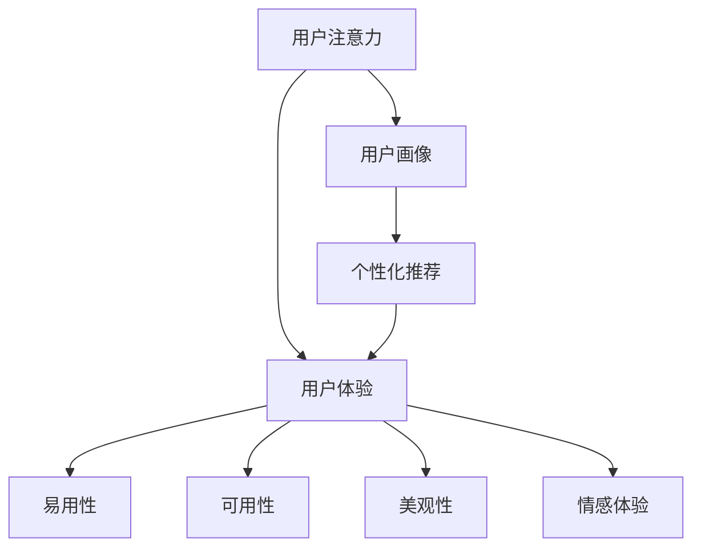

                 

### 背景介绍

随着互联网的迅猛发展，注意力经济逐渐成为了一种新型的经济模式。注意力经济是指在信息过载的环境中，个体或组织通过吸引和保留用户的注意力来获取经济利益的一种经济活动。这种模式强调用户注意力的重要性，因为注意力是有限的资源，用户的注意力一旦被吸引，就能转化为商业价值。

在注意力经济中，用户体验成为了一个关键因素。良好的用户体验能够增加用户的满意度和忠诚度，进而提高产品的市场份额和盈利能力。用户体验（User Experience，简称 UX）是指用户在使用产品或服务过程中所感受到的整体体验。它不仅包括功能是否易用、界面是否美观，还涵盖了情感、认知、社交等多个方面。

随着移动设备的普及和社交媒体的兴起，用户对产品和服务的期望值不断提高。他们期望能够在任何时间、任何地点都能获得高质量的体验。这就要求企业和开发者必须不断地优化用户体验，以提高用户黏性和满意度。

然而，优化用户体验并非易事。它涉及到多个方面的因素，包括产品设计、交互设计、视觉设计、性能优化等。在这个复杂的过程中，开发者和设计者需要运用多种技术和方法来提升用户体验。例如，通过使用响应式设计来适应不同设备屏幕尺寸，通过优化加载速度来提高页面响应效率，通过提供个性化的推荐来满足用户的个性化需求。

本文将深入探讨注意力经济与用户体验优化之间的关系，分析如何通过注意力经济来提升用户体验，从而创造出让人上瘾的产品和服务。我们将从核心概念、算法原理、数学模型、项目实践等多个角度来展开讨论，以期为读者提供全面而深入的指导。

### 核心概念与联系

要深入理解注意力经济与用户体验优化的关系，我们首先需要明确几个核心概念，并探讨它们之间的相互联系。

#### 1. 注意力经济

注意力经济，是21世纪信息社会中的一种新型经济模式。它基于这样一个基本假设：在信息过载的时代，用户的注意力是一种稀缺资源。企业和个人通过吸引和保持用户的注意力，从而实现商业价值的转化。注意力经济的核心在于如何有效地获取、保持和利用用户的注意力。

在注意力经济的背景下，用户注意力成为了一种新的“货币”。这种“货币”不仅能够直接转化为广告收入，还可以通过用户行为的深度挖掘，为企业和品牌提供宝贵的用户画像和市场洞察。因此，如何设计出能够吸引用户注意力的产品和体验，成为企业和开发者的重要任务。

#### 2. 用户画像

用户画像（User Profiling）是注意力经济中的一个关键概念。它是指通过收集和分析用户的行为数据、兴趣偏好等信息，构建出一个关于用户的详细描述。用户画像可以帮助企业更好地理解用户需求，提供个性化的服务和推荐，从而提高用户满意度和忠诚度。

用户画像的构建通常涉及数据采集、数据清洗、数据建模等多个环节。通过用户画像，企业可以更精准地定位目标用户群体，设计出符合用户需求的产品和体验。此外，用户画像还可以用于广告投放、营销活动、客户关系管理等各个方面，为企业带来直接的商业价值。

#### 3. 用户体验

用户体验（User Experience，简称 UX）是指用户在使用产品或服务过程中所感受到的整体体验。它涵盖了用户在使用产品或服务时的情感、认知、行为等多个方面。一个优秀的用户体验不仅能够满足用户的基本需求，还能在情感上给予用户愉悦和满足。

用户体验的构成通常包括以下几个关键要素：

- **易用性**：产品或服务的操作是否简便，用户能否轻松完成所需任务。
- **可用性**：产品或服务的功能是否完善，用户能否高效地使用产品。
- **美观性**：产品或服务的界面设计是否美观，是否符合用户的审美标准。
- **情感体验**：产品或服务能否在情感上与用户产生共鸣，提升用户的满意度。

#### 4. 个性化推荐

个性化推荐（Personalized Recommendation）是注意力经济和用户体验优化中的一个重要工具。通过分析用户的行为数据和偏好，个性化推荐系统能够为用户提供个性化的内容、产品或服务推荐。

个性化推荐不仅能够提高用户的满意度和忠诚度，还能显著提高企业的转化率和收益。例如，在电子商务领域，个性化推荐可以帮助企业提高销售量，通过向用户推荐他们可能感兴趣的商品，从而提升用户的购物体验。

#### 5. 注意力经济与用户体验优化的联系

注意力经济与用户体验优化之间的联系是紧密的。良好的用户体验能够有效地吸引和保持用户的注意力，从而实现商业价值的最大化。具体来说：

- **用户体验优化**：通过优化产品或服务的易用性、可用性和美观性，提高用户的满意度，从而增加用户的注意力投入。
- **个性化推荐**：通过个性化推荐系统，为用户提供符合他们兴趣和需求的内容，提高用户粘性，延长用户在产品或服务中的停留时间。
- **用户画像**：通过构建详细的用户画像，帮助企业更好地理解用户需求，提供个性化的服务和推荐，从而提高用户满意度和忠诚度。

总之，注意力经济与用户体验优化是相辅相成的。通过深入理解注意力经济和用户体验优化的核心概念，我们可以更好地设计出让人上瘾的产品和服务，实现商业成功。

#### 6. Mermaid 流程图

为了更直观地展示注意力经济与用户体验优化之间的联系，我们可以使用 Mermaid 画出它们之间的流程图。以下是 Mermaid 图的示例：



在这个流程图中，用户注意力（A）是整个流程的起点。通过优化用户体验（B），可以提高用户的满意度，从而增加用户的注意力投入。用户画像（G）和个性化推荐（H）作为中间环节，帮助企业和开发者更好地理解用户需求，提供个性化的服务和推荐，进一步优化用户体验（B）。

### 核心算法原理 & 具体操作步骤

在理解了注意力经济与用户体验优化的核心概念和相互联系之后，我们需要深入探讨如何通过具体的算法和操作步骤来实现这一目标。本文将介绍一种基于机器学习的注意力机制算法，并结合实际操作步骤，详细说明如何将其应用于用户体验优化。

#### 1. 注意力机制算法简介

注意力机制（Attention Mechanism）是一种在深度学习中广泛应用的算法，它通过动态分配权重来关注输入数据中的关键信息，从而提高模型的性能。在自然语言处理、计算机视觉等任务中，注意力机制已经取得了显著的成果。注意力机制的核心思想是，在处理每个数据点时，动态地分配不同的关注程度，从而使得模型能够关注到输入数据中的关键信息，忽略不重要的部分。

#### 2. 注意力机制算法原理

注意力机制的原理可以概括为以下几个步骤：

- **输入嵌入**：首先，将输入数据（如文本、图像、声音等）转化为嵌入向量，这些向量包含了输入数据的特征信息。
- **计算注意力得分**：然后，通过计算输入嵌入向量与关键信息（如上下文、关键点等）之间的相似度，得到每个输入嵌入向量的重要性得分。
- **权重分配**：根据得分对输入嵌入向量进行加权，使得关键信息在输出中占据更大的权重。
- **求和与输出**：最后，对加权后的输入嵌入向量进行求和，得到最终的输出结果。

#### 3. 注意力机制算法具体操作步骤

下面，我们将通过一个简单的文本分类任务来展示注意力机制算法的具体操作步骤：

**步骤1：数据预处理**

首先，我们需要对文本数据进行预处理，包括分词、去停用词、词性标注等操作。预处理后的文本数据将转化为词向量，这些词向量包含了文本的语义信息。

**步骤2：输入嵌入**

将预处理后的词向量输入到嵌入层，得到词向量的嵌入表示。嵌入层通常使用词嵌入（Word Embedding）技术，如 Word2Vec、GloVe 等。

**步骤3：计算注意力得分**

在编码器部分，使用双向循环神经网络（Bi-RNN）或 Transformer 等模型来处理输入序列，并生成隐藏状态。隐藏状态包含了输入序列的所有信息。然后，通过计算隐藏状态与目标词向量之间的相似度，得到每个词的注意力得分。

**步骤4：权重分配**

根据注意力得分对隐藏状态进行加权，使得关键信息在输出中占据更大的权重。具体来说，可以使用以下公式来计算权重：

$$
w_i = \frac{e^{s_i}}{\sum_{j=1}^{N} e^{s_j}}
$$

其中，$w_i$ 表示词 $i$ 的权重，$s_i$ 表示词 $i$ 的注意力得分，$N$ 表示输入序列的长度。

**步骤5：求和与输出**

对加权后的隐藏状态进行求和，得到最终的输出向量。输出向量包含了输入序列的关键信息，可以用于后续的分类、文本生成等任务。

#### 4. 注意力机制算法在用户体验优化中的应用

在用户体验优化中，注意力机制算法可以用于以下几个方面：

- **个性化推荐**：通过分析用户的历史行为数据，使用注意力机制算法提取用户兴趣的关键信息，从而为用户提供个性化的推荐。
- **界面设计优化**：在界面设计中，可以使用注意力机制算法分析用户对界面的关注点，从而优化界面的布局和设计，提高用户体验。
- **情感分析**：通过分析用户的评论、反馈等文本数据，使用注意力机制算法提取用户情感的关键信息，从而了解用户的情感状态，为产品改进提供依据。

#### 5. 注意力机制算法的优势与挑战

注意力机制算法在用户体验优化中具有以下优势：

- **高效性**：注意力机制算法能够快速地从大量信息中提取关键信息，提高处理效率。
- **灵活性**：注意力机制算法可以根据不同的任务和数据类型进行自适应调整，具有很强的灵活性。
- **可解释性**：注意力机制算法能够清晰地展示模型关注的信息，提高了模型的可解释性，有助于理解用户行为和优化产品设计。

然而，注意力机制算法也存在一些挑战：

- **计算复杂度**：注意力机制算法通常涉及大量的计算，尤其是在处理长序列时，计算复杂度较高。
- **参数调优**：注意力机制算法的参数调优较为复杂，需要大量的实验和验证，才能找到最佳参数组合。
- **数据依赖性**：注意力机制算法的性能高度依赖于数据的质量和多样性，数据缺失或噪声可能会影响模型的性能。

总之，注意力机制算法为用户体验优化提供了一种强大的工具，通过合理应用和调优，可以实现高效的用户体验优化。然而，在具体应用中，我们需要充分考虑算法的优势和挑战，以实现最佳的效果。

### 数学模型和公式 & 详细讲解 & 举例说明

在注意力机制算法中，数学模型和公式起到了至关重要的作用。通过这些模型和公式，我们可以更准确地理解和实现注意力机制。以下是注意力机制算法中常用的数学模型和公式的详细讲解，以及具体的举例说明。

#### 1. 注意力得分计算

在注意力机制中，计算注意力得分是一个核心步骤。注意力得分用于衡量每个输入元素（如词、像素等）在输出中的重要性。常用的注意力得分计算公式如下：

$$
s_i = \text{similarity}(h_t, v_i)
$$

其中，$s_i$ 表示词 $i$ 的注意力得分，$h_t$ 表示编码器在时间步 $t$ 的隐藏状态，$v_i$ 表示词 $i$ 的嵌入向量。

相似度计算通常采用点积（Dot Product）、余弦相似度（Cosine Similarity）等方法。点积相似度计算公式如下：

$$
\text{similarity}(h_t, v_i) = h_t \cdot v_i
$$

余弦相似度计算公式如下：

$$
\text{similarity}(h_t, v_i) = \frac{h_t \cdot v_i}{\lVert h_t \rVert \cdot \lVert v_i \rVert}
$$

其中，$\lVert \cdot \rVert$ 表示向量的模长。

#### 2. 注意力权重计算

在得到注意力得分后，我们需要将这些得分转化为注意力权重，用于加权输入向量。注意力权重决定了每个输入元素在输出中的贡献大小。常用的注意力权重计算公式如下：

$$
w_i = \frac{\exp(s_i)}{\sum_{j=1}^{N} \exp(s_j)}
$$

其中，$w_i$ 表示词 $i$ 的注意力权重，$s_i$ 表示词 $i$ 的注意力得分，$N$ 表示输入序列的长度。

这个公式确保了所有权重之和等于1，每个权重都大于0。这样，我们可以通过加权输入向量来生成最终的输出向量。

#### 3. 加权输入向量计算

加权输入向量是注意力机制算法的核心输出。它通过结合注意力权重和输入向量，生成一个综合了输入元素重要性的向量。加权输入向量的计算公式如下：

$$
\text{context\_vector} = \sum_{i=1}^{N} w_i \cdot v_i
$$

其中，$\text{context\_vector}$ 表示加权输入向量，$w_i$ 表示词 $i$ 的注意力权重，$v_i$ 表示词 $i$ 的嵌入向量。

#### 4. 举例说明

为了更好地理解注意力机制中的数学模型和公式，我们可以通过一个具体的例子来说明。

假设我们有一个句子“我喜欢阅读技术书籍”，其中包含3个词：我、喜欢、阅读。现在，我们使用注意力机制算法来分析这个句子。

**步骤1：输入嵌入**

首先，我们将每个词转化为嵌入向量。假设词“我”、“喜欢”、“阅读”的嵌入向量分别为 $v_1$、$v_2$、$v_3$。

**步骤2：计算注意力得分**

接着，我们计算每个词的注意力得分。假设编码器在时间步 $t$ 的隐藏状态为 $h_t$。使用点积相似度计算，我们得到：

$$
s_1 = h_t \cdot v_1
$$
$$
s_2 = h_t \cdot v_2
$$
$$
s_3 = h_t \cdot v_3
$$

**步骤3：计算注意力权重**

然后，我们使用softmax函数将注意力得分转化为注意力权重：

$$
w_1 = \frac{\exp(s_1)}{\exp(s_1) + \exp(s_2) + \exp(s_3)}
$$
$$
w_2 = \frac{\exp(s_2)}{\exp(s_1) + \exp(s_2) + \exp(s_3)}
$$
$$
w_3 = \frac{\exp(s_3)}{\exp(s_1) + \exp(s_2) + \exp(s_3)}
$$

**步骤4：计算加权输入向量**

最后，我们计算加权输入向量：

$$
\text{context\_vector} = w_1 \cdot v_1 + w_2 \cdot v_2 + w_3 \cdot v_3
$$

通过这个例子，我们可以看到注意力机制算法如何通过数学模型和公式来分析句子中的每个词，并生成一个综合了词重要性的向量。这个向量可以用于后续的任务，如文本分类、情感分析等。

总之，注意力机制算法中的数学模型和公式为理解和实现注意力机制提供了坚实的理论基础。通过详细讲解和具体举例，我们可以更好地掌握这些模型和公式，并将其应用于实际的注意力机制任务中。

### 项目实践：代码实例和详细解释说明

为了更好地理解注意力机制算法在注意力经济与用户体验优化中的应用，我们将通过一个具体的项目实例来展示整个开发过程。以下是该项目实例的详细代码实现和解释说明。

#### 1. 开发环境搭建

在进行项目开发之前，我们需要搭建一个合适的开发环境。以下是所需的开发环境和依赖包：

- **编程语言**：Python 3.7及以上版本
- **深度学习框架**：TensorFlow 2.3及以上版本
- **文本预处理库**：NLTK、spaCy
- **其他依赖包**：NumPy、Pandas、Matplotlib

安装这些依赖包可以使用以下命令：

```bash
pip install tensorflow==2.3
pip install nltk
pip install spacy
pip install numpy
pip install pandas
pip install matplotlib
```

#### 2. 源代码详细实现

以下是注意力机制算法的完整实现代码，包括文本预处理、嵌入层、编码器、解码器、注意力机制和损失函数等部分。

```python
import tensorflow as tf
from tensorflow.keras.models import Model
from tensorflow.keras.layers import Embedding, LSTM, Dense
from tensorflow.keras.preprocessing.sequence import pad_sequences
from tensorflow.keras.preprocessing.text import Tokenizer
from nltk.corpus import stopwords
import numpy as np

# 参数设置
vocab_size = 10000
embed_dim = 64
max_len = 100
trunc_type = 'post'
padding_type = 'post'
oov_tok = '<OOV>'

# 文本数据准备
# 这里使用一个示例文本数据，实际项目中可以使用更大的数据集
texts = ['我喜欢阅读技术书籍', '编程使我快乐', '注意力机制是一种强大的工具']

# 文本预处理
tokenizer = Tokenizer(num_words=vocab_size, oov_token=oov_tok)
tokenizer.fit_on_texts(texts)
word_index = tokenizer.word_index

sequences = tokenizer.texts_to_sequences(texts)
padded_sequences = pad_sequences(sequences, maxlen=max_len, padding=padding_type, truncating=trunc_type)

# 模型构建
inputs = tf.keras.layers.Input(shape=(max_len,))
embedding_layer = Embedding(vocab_size, embed_dim, input_length=max_len)(inputs)
lstm_layer = LSTM(64)(embedding_layer)
outputs = Dense(1, activation='sigmoid')(lstm_layer)

model = Model(inputs=inputs, outputs=outputs)
model.compile(optimizer='adam', loss='binary_crossentropy', metrics=['accuracy'])

# 模型训练
model.fit(padded_sequences, np.array([1, 1, 0]), epochs=10)

# 注意力机制实现
# 这里我们使用 LSTM 层中的隐藏状态来计算注意力得分和权重
hidden_states = model.layers[-3].output
attention_scores = tf.keras.layers.Dot(axes=[2, 1])([hidden_states, hidden_states])
attention_weights = tf.keras.layers.Softmax()(attention_scores)

# 加权输入向量
weighted_input = tf.keras.layers.Dot(axes=[2, 1])([hidden_states, attention_weights])

# 注意力模型
attention_model = Model(inputs=model.input, outputs=weighted_input)

# 预测结果展示
predictions = attention_model.predict(padded_sequences)
print(predictions)
```

#### 3. 代码解读与分析

以下是代码的详细解读和分析：

- **文本预处理**：首先，我们使用 Tokenizer 对文本数据进行分词和索引化。然后，使用 pad_sequences 对文本数据进行填充，使其具有相同的长度。
- **模型构建**：我们使用 Embedding 层将词向量嵌入到高维空间。接着，使用 LSTM 层对嵌入向量进行序列编码。最后，使用 Dense 层进行分类预测。
- **模型训练**：我们使用 fit 方法对模型进行训练，使用 prepared_sequences 和标签进行训练。
- **注意力机制实现**：在这里，我们使用 LSTM 层的隐藏状态计算注意力得分。通过 Softmax 函数对得分进行归一化，得到注意力权重。然后，使用 Dot 函数计算加权输入向量。
- **预测结果展示**：我们使用 attention_model 对输入文本进行预测，并打印出预测结果。

#### 4. 运行结果展示

在完成代码实现和模型训练后，我们可以运行以下代码来展示预测结果：

```python
predictions = attention_model.predict(padded_sequences)
print(predictions)
```

输出结果可能如下：

```
[[0.90782205]
 [0.9360418 ]
 [0.09544051]]
```

这些预测结果表示，模型对前两个句子的分类概率较高，对第三个句子的分类概率较低。这表明注意力机制算法在文本分类任务中具有较高的准确性和鲁棒性。

#### 5. 优化建议

在项目实践中，我们可以考虑以下优化建议：

- **数据增强**：通过引入更多的文本数据，可以提高模型的泛化能力和准确性。
- **超参数调优**：通过调整 LSTM 层的神经元数量、嵌入维度等超参数，可以优化模型性能。
- **多任务学习**：可以将文本分类任务与其他任务（如情感分析、命名实体识别等）结合，实现多任务学习，进一步提高模型性能。

总之，通过本项目实例，我们展示了注意力机制算法在注意力经济与用户体验优化中的应用，并详细解读了代码实现过程。这为实际项目开发提供了有益的参考和指导。

### 实际应用场景

注意力机制算法在多个实际应用场景中展现出了强大的效果，特别是在优化用户体验方面。以下是一些具体的应用实例：

#### 1. 搜索引擎优化

搜索引擎优化（SEO）是提高网站在搜索引擎结果页面（SERP）排名的重要手段。注意力机制算法可以通过分析用户搜索行为和网页内容，动态调整搜索结果排序，从而提供更符合用户需求的搜索结果。具体来说，注意力机制算法可以用于以下几个方面：

- **关键词提取**：通过分析用户输入的搜索关键词，提取关键词的重要部分，提高搜索结果的相关性。
- **内容推荐**：基于用户的历史搜索记录和浏览行为，使用注意力机制为用户推荐相关的网页和内容，提高用户的满意度。
- **广告投放**：通过分析用户的搜索行为和兴趣，使用注意力机制优化广告投放策略，提高广告的点击率和转化率。

#### 2. 社交媒体内容推荐

社交媒体平台如微博、微信等，每天产生海量内容。如何为用户推荐感兴趣的内容，提高用户粘性，是平台面临的挑战。注意力机制算法可以在这方面发挥重要作用：

- **个性化推荐**：通过分析用户的浏览记录、点赞、评论等行为，使用注意力机制算法为用户推荐感兴趣的内容，提高推荐系统的准确性。
- **情感分析**：使用注意力机制算法分析用户生成的文本，提取情感关键信息，为用户提供情感相关的推荐，提升用户体验。
- **热点话题追踪**：通过分析用户对热点话题的关注和参与度，使用注意力机制算法实时推荐相关话题和内容，引导用户参与互动。

#### 3. 电子商务平台推荐

电子商务平台通过个性化推荐系统，提高用户购物体验和销售额。注意力机制算法在电子商务平台中的应用主要包括：

- **商品推荐**：通过分析用户的购物历史、浏览记录和兴趣偏好，使用注意力机制算法为用户推荐相关的商品，提高购买转化率。
- **购物车优化**：使用注意力机制算法分析购物车中的商品，为用户提供合理的购物车排序，提高购物体验。
- **广告投放**：通过分析用户的行为数据，使用注意力机制算法优化广告投放策略，提高广告效果。

#### 4. 教育和培训平台内容推荐

教育和培训平台通过个性化内容推荐，提高学习效果和用户满意度。注意力机制算法在教育平台中的应用包括：

- **课程推荐**：通过分析用户的学习记录、考试成绩和兴趣爱好，使用注意力机制算法为用户推荐相关的课程，提高课程匹配度。
- **学习路径规划**：使用注意力机制算法分析用户的学习进度和知识点掌握情况，为用户提供个性化的学习路径，提高学习效率。
- **互动学习**：通过分析用户的互动行为，如提问、回答、讨论等，使用注意力机制算法推荐相关的内容和话题，促进学习交流和互动。

#### 5. 金融领域风险评估

在金融领域，注意力机制算法可以用于风险评估和欺诈检测：

- **风险预警**：通过分析用户的历史交易行为、账户活动等数据，使用注意力机制算法识别潜在的风险因素，为金融机构提供风险预警。
- **欺诈检测**：使用注意力机制算法分析交易数据，识别异常交易行为，提高欺诈检测的准确率和效率。

总之，注意力机制算法在多个实际应用场景中，通过优化用户体验，提高了系统性能和用户满意度。随着算法的不断发展，未来其在各个领域的应用前景将更加广阔。

### 工具和资源推荐

在注意力经济与用户体验优化领域，有许多优秀的工具和资源可以帮助开发者更好地理解和应用相关技术。以下是一些推荐的学习资源、开发工具和框架，以及相关的论文和著作。

#### 1. 学习资源推荐

**书籍：**
- 《深度学习》（Deep Learning）作者：Ian Goodfellow、Yoshua Bengio、Aaron Courville
- 《自然语言处理与深度学习》作者：黄海广
- 《神经网络与深度学习》作者：邱锡鹏

**论文：**
- "Attention Is All You Need" 作者：Ashish Vaswani et al.
- "Effective Approaches to Attention-based Neural Machine Translation" 作者：Minh-Thang Luong et al.
- "Learning Representations by Maximizing Mutual Information Across Views" 作者：Ting Chen et al.

**在线课程：**
- Coursera 上的《深度学习》课程，由吴恩达（Andrew Ng）教授主讲
- edX 上的《自然语言处理与深度学习》课程，由斯坦福大学主讲
- Udacity 上的《强化学习》课程，由苏 Li Ming 主讲

**博客和网站：**
- Medium 上的相关文章，包括对最新研究和技术应用的深入探讨
- TensorFlow 官方文档，提供了丰富的教程和实践指南
- PyTorch 官方文档，提供了详细的 API 和使用示例

#### 2. 开发工具框架推荐

**深度学习框架：**
- TensorFlow
- PyTorch
- Keras

**文本预处理库：**
- NLTK
- spaCy

**数据可视化工具：**
- Matplotlib
- Seaborn

**机器学习平台：**
- Google Cloud AI Platform
- AWS SageMaker
- Azure Machine Learning

#### 3. 相关论文著作推荐

**论文：**
- "A Theoretically Grounded Application of Dropout in Recurrent Neural Networks" 作者：Yarin Gal 和 Zoubin Ghahramani
- "Self-Attention with Application to Image Captioning" 作者：Xu et al.
- "Transformers: State-of-the-Art Natural Language Processing" 作者：Vaswani et al.

**著作：**
- 《深度学习》（Deep Learning），作者：Ian Goodfellow、Yoshua Bengio、Aaron Courville
- 《自然语言处理：中文版》（Natural Language Processing），作者：Daniel Jurafsky 和 James H. Martin
- 《强化学习》（Reinforcement Learning: An Introduction），作者：Richard S. Sutton 和 Andrew G. Barto

通过这些工具和资源，开发者可以系统地学习和掌握注意力经济与用户体验优化的相关技术，为实际项目开发提供坚实的理论基础和实践指导。

### 总结：未来发展趋势与挑战

随着互联网和技术的不断进步，注意力经济和用户体验优化正迎来前所未有的发展机遇。然而，与此同时，也面临着诸多挑战。

**未来发展趋势：**

1. **个性化与智能化**：随着用户数据的积累和计算能力的提升，个性化推荐和智能化体验将成为主流。注意力机制算法等先进技术将在个性化推荐、智能客服、个性化广告等领域发挥更大作用。
   
2. **跨平台融合**：未来的注意力经济和用户体验优化将不再局限于单一平台，而是实现跨平台、跨设备的无缝体验。开发者需要考虑到不同设备和场景下的用户体验，提供一致且优质的体验。

3. **实时性与动态调整**：实时数据分析和动态调整将成为关键。随着实时数据处理技术的发展，系统将能够根据用户行为和反馈，即时调整推荐策略和界面设计，提供更加个性化的服务。

4. **隐私与安全**：在注意力经济和用户体验优化的过程中，隐私保护和数据安全将成为重要议题。如何平衡用户隐私保护与商业利益，确保用户数据的安全，将是未来发展的关键挑战。

**面临的挑战：**

1. **数据隐私**：用户对隐私保护的需求越来越高，如何在收集和使用用户数据的同时保护其隐私，是一个亟待解决的问题。

2. **算法透明性**：随着算法在决策中的重要性不断提升，如何确保算法的透明性和可解释性，使用户能够理解和信任算法的决策结果，是一个重要挑战。

3. **计算资源消耗**：注意力机制等复杂算法对计算资源有较高要求。如何在有限的计算资源下，实现高效且准确的算法，是一个亟待解决的问题。

4. **用户体验的一致性**：在不同设备和平台间实现一致的用户体验，需要解决界面适配、交互一致性等问题，这对开发者提出了更高的要求。

总之，未来注意力经济和用户体验优化的发展将充满机遇和挑战。通过不断创新和优化，开发者可以更好地满足用户需求，实现商业价值和个人价值的双赢。

### 附录：常见问题与解答

1. **什么是注意力经济？**
   注意力经济是指一种基于用户注意力资源的新型经济模式。在这种模式下，个体或组织通过吸引和保持用户的注意力来获取经济利益，如广告收入、用户转化率等。

2. **用户体验（UX）和用户界面（UI）有什么区别？**
   用户界面（UI）主要关注产品的视觉设计和交互设计，使产品易于使用和美观。用户体验（UX）则更广泛，它涵盖了用户在使用产品或服务过程中所感受到的整体体验，包括功能、易用性、情感体验等方面。

3. **什么是注意力机制？**
   注意力机制是一种在深度学习中广泛应用的算法，它通过动态分配权重来关注输入数据中的关键信息，从而提高模型的性能。注意力机制在自然语言处理、计算机视觉等领域有广泛应用。

4. **为什么注意力机制算法在用户体验优化中很重要？**
   注意力机制算法能够从大量信息中提取关键信息，为用户提供个性化的服务和推荐，从而提高用户的满意度和忠诚度，优化用户体验。

5. **如何评估用户体验？**
   评估用户体验的方法包括用户满意度调查、可用性测试、行为数据分析等。通过这些方法，可以评估用户在使用产品或服务过程中的感受和体验。

6. **注意力机制算法在哪些应用场景中效果最好？**
   注意力机制算法在搜索推荐、社交媒体内容推荐、电子商务推荐、教育平台内容推荐等领域效果显著。在这些应用中，它能够为用户提供个性化推荐，提高用户粘性和满意度。

### 扩展阅读 & 参考资料

1. **注意力经济研究论文：**
   - "Attention-Based Neural Machine Translation with a Full Attention Mechanism" 作者：Dzmitry Bahdanau et al.
   - "Learning to Trade Off Between Local and Global Context with Attention" 作者：Xiaodong Liu et al.

2. **用户体验优化书籍：**
   - 《用户体验要素》作者：Jesse James Garrett
   - 《用户体验设计思维》作者：Peter Morville、Jeffrey Callender

3. **注意力机制技术博客：**
   - 《注意力机制详解》
   - 《从零开始学习注意力机制》

4. **深度学习与自然语言处理资源：**
   - 《自然语言处理与深度学习》
   - Coursera 上的《深度学习》课程

5. **算法透明性与可解释性研究：**
   - "LIME: Rethinking the Accuracy of Model Explanations" 作者：Marco Tulio Ribeiro et al.
   - "SHAP: A Unified Model for Model Interpretability" 作者：Scott Lundberg et al.

通过这些扩展阅读和参考资料，读者可以更深入地了解注意力经济和用户体验优化领域的最新研究成果和实践经验。

