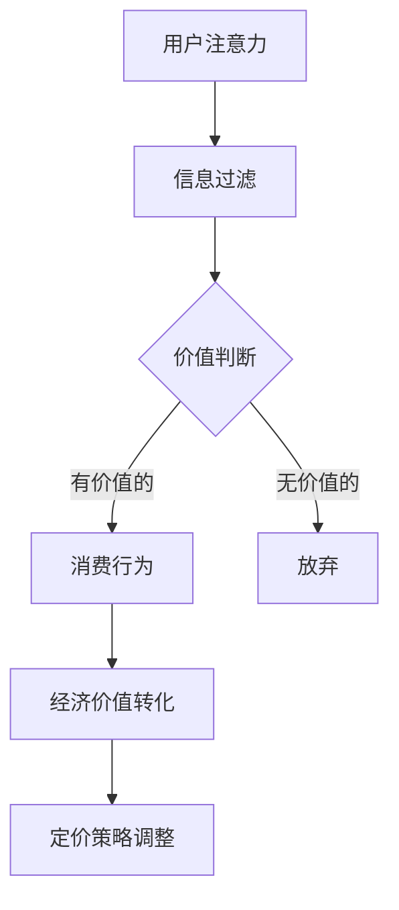

                 

### 1. 背景介绍

随着信息技术的飞速发展，数字经济在全球范围内蓬勃发展，其中注意力经济成为了一个不可忽视的现象。注意力经济主要是指人们在数字世界中对于信息、内容、服务等的关注和投入，这种关注往往可以转化为经济价值。在企业产品定价中，注意力经济的影响愈发显著，企业需要重新审视其定价策略，以适应这一新的经济形态。

注意力经济的核心在于“注意力”这个资源，它是一种有限的、稀缺的、有价值的资源。用户在纷繁复杂的信息环境中，对于任何产品或服务的注意力都是有限的，这也就意味着企业在产品定价时，不仅要考虑产品的成本、市场竞争状况等因素，更要考虑到如何有效地吸引和保持用户的注意力。

本文旨在探讨注意力经济对企业产品定价的新要求，分析注意力经济对产品定价策略的潜在影响，并探讨企业如何根据这一新经济形态调整其定价策略。我们将从以下几个角度进行探讨：

1. **注意力经济的定义与基本原理**：首先，我们将介绍注意力经济的概念，阐述其基本原理和关键特征。
2. **注意力资源在产品定价中的作用**：接着，我们将分析注意力资源在产品定价中的重要性，探讨它如何影响产品定价策略。
3. **注意力经济对传统定价策略的挑战**：然后，我们将讨论注意力经济给传统定价策略带来的挑战，分析这些挑战的具体表现。
4. **企业应对注意力经济挑战的新策略**：接下来，我们将提出一些企业应对注意力经济挑战的新策略，例如差异化定价、注意力营销等。
5. **案例分析：成功的企业如何利用注意力经济定价**：我们将通过案例分析，展示一些成功的企业如何利用注意力经济实现有效的产品定价。
6. **未来趋势与挑战**：最后，我们将探讨注意力经济对企业产品定价的未来发展趋势和面临的挑战。

通过本文的讨论，我们希望能够为企业在注意力经济时代的产品定价提供一些有价值的思考和建议。接下来，我们将首先对注意力经济进行详细的定义和解释，帮助读者更好地理解这一概念及其重要性。

### 2. 核心概念与联系

在深入探讨注意力经济对企业产品定价的新要求之前，我们需要首先明确注意力经济的核心概念与基本原理。注意力经济是一种基于用户注意力资源的经济学理论，它认为在信息过载的数字时代，用户的注意力是一种有限的、稀缺的、有价值的资源。用户的注意力资源决定了他们能够关注到哪些信息或产品，从而影响其消费行为。

#### 注意力经济的定义

注意力经济（Attention Economy）可以定义为：在信息过载的环境中，用户对于信息、内容或服务的关注和投入，这种关注可以转化为经济价值，从而影响产品和服务的定价策略。

#### 基本原理

1. **注意力稀缺性**：在数字时代，信息爆炸导致用户面对的海量信息远超过其处理能力，这使得用户的注意力变得尤为稀缺。
2. **注意力分配**：用户会根据自身需求和兴趣分配注意力资源，这决定了他们关注哪些信息或产品。
3. **注意力价值**：用户的注意力资源可以转化为经济价值，例如通过广告、付费内容、品牌忠诚度等形式。

#### 关键特征

1. **互动性**：注意力经济强调用户与产品或服务之间的互动，用户的参与和反馈成为重要的影响因素。
2. **个性化**：用户的注意力分配具有个性化特征，不同用户对同一产品的关注度和价值认知可能存在显著差异。
3. **动态性**：用户的注意力分配是动态变化的，企业需要不断调整其产品和服务策略以吸引和保持用户注意力。

#### 注意力资源在产品定价中的作用

注意力资源在产品定价中扮演着重要角色。企业可以通过优化产品和服务，吸引和保持用户的注意力，从而提高产品的市场价值。以下是注意力资源在产品定价中的几个关键作用：

1. **定价弹性**：注意力经济为企业提供了更灵活的定价策略，企业可以根据用户注意力的变化调整产品定价，以实现更好的市场反响。
2. **差异化定价**：注意力经济允许企业根据用户对产品不同方面的注意力进行差异化定价，例如根据用户对品牌、功能、服务质量的关注度进行差异化的价格设定。
3. **提升品牌忠诚度**：通过提供高质量的、能吸引用户注意力的产品和服务，企业可以提升用户对品牌的忠诚度，从而在长期内实现更高的定价能力。

#### 注意力经济与传统定价策略的比较

与传统定价策略相比，注意力经济带来了一些显著的变化：

1. **成本导向**：传统定价策略更多基于产品成本和市场状况，而注意力经济更强调用户价值感知。
2. **需求导向**：注意力经济要求企业更深入地理解用户需求，根据用户注意力的分配情况调整定价策略。
3. **动态调整**：注意力经济强调定价策略的动态性，企业需要持续监测和调整以适应用户注意力变化。

#### 注意力经济的优势与挑战

**优势**：

- 提高产品市场竞争力：通过有效利用用户注意力，企业可以提升产品或服务的市场竞争力。
- 增强用户参与度：注意力经济鼓励用户互动和参与，有助于提升用户满意度和忠诚度。
- 创新定价策略：注意力经济为定价策略提供了更多的可能性，企业可以通过创新手段实现更高的盈利能力。

**挑战**：

- 用户体验一致性：如何保证产品和服务始终能吸引用户的注意力是一个持续挑战。
- 数据隐私保护：在注意力经济中，用户数据的重要性愈发凸显，企业需要妥善处理用户数据的隐私保护问题。

在理解了注意力经济的核心概念与基本原理后，我们将进一步探讨注意力经济对企业产品定价的具体影响，以及企业如何应对这些影响。

#### 注意力经济的 Mermaid 流程图

以下是一个简化的注意力经济的 Mermaid 流程图，用以展示注意力资源在企业产品定价中的流程节点：



在这个流程图中，用户的注意力首先经过信息过滤，根据自身的需求和兴趣对信息进行筛选。然后，用户对筛选后的信息进行价值判断，决定是否将其转化为消费行为。最终，这些消费行为转化为经济价值，并影响企业的定价策略调整。通过这个流程，我们可以更清晰地看到注意力资源在产品定价中的作用。

### 3. 核心算法原理 & 具体操作步骤

注意力经济的核心在于如何有效地吸引和保持用户的注意力，从而实现产品价值的最大化。在这一过程中，企业需要运用一系列算法和策略来优化其产品定价。以下将详细介绍几种关键的核心算法原理，并阐述具体的操作步骤。

#### 3.1 用户行为分析算法

用户行为分析算法是注意力经济中的一项基础技术，通过分析用户的行为数据，企业可以更好地理解用户的需求和偏好，从而优化产品定价。以下是该算法的基本原理和操作步骤：

**原理**：

用户行为分析算法基于大数据技术和机器学习算法，通过对用户在网站、APP或其他数字平台上的行为数据进行分析，挖掘用户的行为模式和偏好，从而预测用户的消费行为。

**具体操作步骤**：

1. **数据收集**：首先，企业需要收集用户在数字平台上的行为数据，包括浏览记录、点击行为、购买历史等。
2. **数据预处理**：对收集到的行为数据进行分析和清洗，去除无效数据，并转换成机器学习模型可处理的格式。
3. **特征提取**：从行为数据中提取关键特征，如用户活跃度、购买频率、页面停留时间等。
4. **模型训练**：利用机器学习算法，如决策树、随机森林、神经网络等，对特征进行训练，构建用户行为分析模型。
5. **模型评估与优化**：对训练好的模型进行评估，根据评估结果进行调整和优化，以提高模型的预测准确性。
6. **应用与调整**：将训练好的模型应用于实际场景，通过实时分析用户行为数据，动态调整产品定价策略。

#### 3.2 注意力价值评估算法

注意力价值评估算法是用于确定用户注意力资源对企业价值贡献的关键工具。通过该算法，企业可以更准确地评估产品或服务对用户注意力的吸引力，从而优化定价策略。以下是该算法的基本原理和操作步骤：

**原理**：

注意力价值评估算法基于用户行为数据和经济学原理，通过计算用户注意力资源的价值，帮助企业确定合理的定价策略。

**具体操作步骤**：

1. **设定参考指标**：首先，企业需要设定一些参考指标，如用户参与度、用户满意度、品牌忠诚度等，作为评估注意力价值的基准。
2. **数据收集**：收集与参考指标相关的用户行为数据，如用户点击率、评论数、分享量等。
3. **建立评估模型**：利用统计学和机器学习技术，建立注意力价值评估模型，将用户行为数据与参考指标关联起来。
4. **模型训练与优化**：对评估模型进行训练和优化，以提高模型对注意力价值的预测准确性。
5. **价值评估**：利用训练好的模型，对产品或服务的注意力价值进行评估，为定价策略提供依据。
6. **动态调整**：根据评估结果，动态调整产品定价，以最大化注意力资源的价值。

#### 3.3 个性化定价算法

个性化定价算法是一种根据用户个体特征和需求进行定价的策略。通过该算法，企业可以更精准地满足用户需求，提升用户满意度，从而实现更高的定价能力。以下是该算法的基本原理和操作步骤：

**原理**：

个性化定价算法基于用户行为数据和个性化推荐技术，通过分析用户的个性化需求，为不同用户提供个性化的价格方案。

**具体操作步骤**：

1. **用户特征分析**：首先，企业需要收集用户的个人信息和行为数据，如年龄、性别、地理位置、浏览记录等。
2. **个性化推荐模型**：利用机器学习和数据挖掘技术，建立个性化推荐模型，将用户特征与产品特征匹配，推荐个性化的产品或服务。
3. **定价策略制定**：根据个性化推荐模型的结果，为不同用户提供个性化的价格方案，如折扣、捆绑销售等。
4. **定价策略优化**：通过用户反馈和实际销售数据，不断优化定价策略，以提高用户满意度和销售转化率。
5. **实时调整**：根据用户实时行为数据，动态调整个性化定价策略，以保持价格方案的吸引力。

#### 3.4 注意力分配优化算法

注意力分配优化算法是一种用于最大化用户注意力资源价值的算法。通过该算法，企业可以更有效地分配资源，提高产品或服务的吸引力。以下是该算法的基本原理和操作步骤：

**原理**：

注意力分配优化算法基于多目标优化理论和用户行为分析结果，通过优化资源分配策略，提高用户注意力资源的使用效率。

**具体操作步骤**：

1. **设定优化目标**：首先，企业需要明确优化目标，如最大化用户参与度、提升品牌知名度等。
2. **资源分配模型**：建立资源分配模型，将用户注意力资源与企业资源（如广告预算、人力投入等）进行关联。
3. **优化算法选择**：选择合适的优化算法，如线性规划、遗传算法、粒子群优化等，对资源分配模型进行求解。
4. **模型求解与评估**：对优化模型进行求解，评估不同资源分配策略的效果，选择最优策略。
5. **动态调整**：根据用户行为数据和市场变化，动态调整资源分配策略，以保持资源的高效利用。

通过上述核心算法原理和具体操作步骤的介绍，我们可以看到，注意力经济为企业产品定价提供了丰富的技术手段和策略选择。企业可以根据自身情况，结合这些算法和策略，制定更加科学和有效的定价策略，从而在竞争激烈的市场中脱颖而出。

### 4. 数学模型和公式 & 详细讲解 & 举例说明

在注意力经济中，数学模型和公式能够帮助我们更精确地描述和计算用户注意力资源的价值，从而为企业制定有效的产品定价策略提供科学依据。以下我们将介绍几个关键的数学模型和公式，并进行详细的讲解和举例说明。

#### 4.1 用户注意力价值模型

用户注意力价值模型（User Attention Value Model，UAVM）是用于评估用户注意力资源对企业产品价值贡献的核心模型。该模型的基本假设是用户对产品的注意力价值与其消费行为呈正相关。以下是该模型的详细公式：

$$
V_A = \alpha \cdot (f_1 \cdot B_1 + f_2 \cdot B_2 + ... + f_n \cdot B_n)
$$

其中，$V_A$表示用户注意力价值，$\alpha$为常数，表示用户注意力的总体感知价值；$f_i$表示用户对第$i$个产品特征的注意力权重，$B_i$表示第$i$个产品特征的吸引力值。

**解释**：

- $\alpha$：表示用户对产品总体注意力的感知价值。这个参数可以根据用户调研和实验数据得到。
- $f_i$：表示用户对第$i$个产品特征的注意力权重。这些权重可以通过用户行为分析得到，例如用户浏览某个特征的时间越长，其注意力权重就越高。
- $B_i$：表示第$i$个产品特征的吸引力值。这个值可以通过对产品特征的分析和用户反馈得到。

**举例说明**：

假设一个电商平台通过用户行为数据得到了以下特征值和权重：

- 特征1（品牌）：$B_1 = 5$，$f_1 = 0.3$
- 特征2（价格）：$B_2 = 4$，$f_2 = 0.2$
- 特征3（服务）：$B_3 = 6$，$f_3 = 0.5$

我们可以计算出该用户对产品的注意力价值：

$$
V_A = \alpha \cdot (0.3 \cdot 5 + 0.2 \cdot 4 + 0.5 \cdot 6) = 3.9\alpha
$$

如果用户对产品总体注意力的感知价值$\alpha = 10$，则用户对该产品的注意力价值为39。

#### 4.2 注意力分配优化模型

注意力分配优化模型（Attention Allocation Optimization Model，AAOM）是用于最大化用户注意力资源价值的优化模型。该模型的目标是在有限的资源下，找到最优的注意力分配策略，以最大化企业的收益。以下是该模型的详细公式：

$$
\max \sum_{i=1}^{n} p_i \cdot V_i
$$

s.t.

$$
\sum_{i=1}^{n} x_i = R
$$

$$
x_i \geq 0, \forall i
$$

其中，$p_i$表示第$i$个产品或服务的价格，$V_i$表示第$i$个产品或服务的用户注意力价值，$x_i$表示企业为第$i$个产品或服务投入的资源量，$R$表示企业的总资源量。

**解释**：

- $\max$：表示最大化目标函数。
- $p_i \cdot V_i$：表示第$i$个产品或服务的收益，即价格与用户注意力价值的乘积。
- $\sum_{i=1}^{n} x_i = R$：表示资源总量守恒，企业投入的总资源量等于其拥有的总资源量。
- $x_i \geq 0$：表示资源投入量必须为非负数。

**举例说明**：

假设一个企业有三种产品，每种产品的价格和用户注意力价值如下：

- 产品1：$p_1 = 100$，$V_1 = 10$
- 产品2：$p_2 = 200$，$V_2 = 20$
- 产品3：$p_3 = 300$，$V_3 = 30$

企业的总资源量$R = 1000$。我们需要找到最优的注意力分配策略，以最大化总收益。

目标函数为：

$$
\max (100 \cdot 10 + 200 \cdot 20 + 300 \cdot 30)
$$

s.t.

$$
x_1 + x_2 + x_3 = 1000
$$

$$
x_1, x_2, x_3 \geq 0
$$

通过求解这个线性规划问题，我们可以找到最优的分配策略。假设最优解为$x_1 = 300$，$x_2 = 200$，$x_3 = 500$，那么企业的总收益为：

$$
300 \cdot 10 + 200 \cdot 20 + 500 \cdot 30 = 13500
$$

#### 4.3 注意力驱动定价模型

注意力驱动定价模型（Attention-Driven Pricing Model，ADPM）是用于根据用户注意力资源调整产品定价的策略模型。该模型的目标是通过动态调整定价策略，最大化企业的总收益。以下是该模型的详细公式：

$$
P_i = P_i^0 + \beta \cdot (V_i - \bar{V})
$$

其中，$P_i$表示第$i$个产品的新价格，$P_i^0$表示第$i$个产品的原始价格，$\beta$表示价格调整系数，$V_i$表示第$i$个产品的用户注意力价值，$\bar{V}$表示所有产品的平均注意力价值。

**解释**：

- $P_i^0$：表示第$i$个产品的原始价格。
- $\beta$：表示价格调整系数，反映了企业对注意力价值的敏感度。
- $V_i - \bar{V}$：表示第$i$个产品的注意力价值与平均注意力价值的差异。

**举例说明**：

假设一个企业有两种产品，每种产品的原始价格和用户注意力价值如下：

- 产品1：$P_1^0 = 100$，$V_1 = 20$
- 产品2：$P_2^0 = 200$，$V_2 = 30$

所有产品的平均注意力价值$\bar{V} = 25$，价格调整系数$\beta = 0.1$。我们需要根据注意力价值调整产品价格。

对于产品1：

$$
P_1 = 100 + 0.1 \cdot (20 - 25) = 99
$$

对于产品2：

$$
P_2 = 200 + 0.1 \cdot (30 - 25) = 203
$$

通过这样的调整，企业可以根据用户对产品的注意力价值动态调整价格，以实现更高的总收益。

#### 4.4 注意力经济平衡模型

注意力经济平衡模型（Attention Economic Equilibrium Model，AEEM）是用于分析注意力经济系统中各要素平衡状态的理论模型。该模型的目标是找到一种平衡状态，使得企业、用户和注意力资源三者之间达到稳定和谐。以下是该模型的详细公式：

$$
\sum_{i=1}^{n} p_i \cdot x_i = \sum_{i=1}^{n} V_i
$$

其中，$p_i$表示第$i$个产品或服务的价格，$x_i$表示用户对第$i$个产品或服务的消费量，$V_i$表示第$i$个产品或服务的用户注意力价值。

**解释**：

- $\sum_{i=1}^{n} p_i \cdot x_i$：表示用户在注意力经济系统中总的消费支出。
- $\sum_{i=1}^{n} V_i$：表示用户在注意力经济系统中总的注意力价值。

**举例说明**：

假设一个市场中有三种产品，每种产品的价格和用户注意力价值如下：

- 产品1：$p_1 = 100$，$V_1 = 10$
- 产品2：$p_2 = 200$，$V_2 = 20$
- 产品3：$p_3 = 300$，$V_3 = 30$

我们需要找到一种平衡状态，使得总消费支出等于总注意力价值。

$$
100 \cdot x_1 + 200 \cdot x_2 + 300 \cdot x_3 = 10 \cdot x_1 + 20 \cdot x_2 + 30 \cdot x_3
$$

通过求解这个平衡方程，我们可以找到各产品的消费量，从而实现注意力经济系统的平衡。

通过上述数学模型和公式的详细讲解和举例说明，我们可以看到注意力经济在产品定价中的重要作用。企业可以通过这些模型和公式，更精确地评估用户注意力资源的价值，制定科学的定价策略，从而在竞争激烈的市场中取得优势。

### 5. 项目实践：代码实例和详细解释说明

为了更好地理解注意力经济在产品定价中的应用，我们将通过一个具体的代码实例来进行详细解释。本实例将使用Python语言，实现一个简单的注意力驱动定价模型，并展示其运行结果。

#### 5.1 开发环境搭建

在开始编写代码之前，我们需要搭建一个简单的开发环境。以下是所需的工具和库：

- Python 3.x
- Jupyter Notebook（用于编写和运行代码）
- NumPy（用于数学计算）
- pandas（用于数据处理）

确保您已经安装了上述工具和库。如果尚未安装，可以通过以下命令进行安装：

```bash
pip install python numpy pandas
```

#### 5.2 源代码详细实现

以下是完整的源代码，用于实现一个简单的注意力驱动定价模型。

```python
import numpy as np
import pandas as pd

# 定义用户注意力价值评估函数
def calculate_attention_value(prices, avg_value):
    values = []
    for price in prices:
        value = price + 0.1 * (avg_value - price)
        values.append(value)
    return values

# 定义注意力驱动定价函数
def attention_driven_pricing(prices, avg_value, adjustment_coefficient):
    new_prices = []
    for price in prices:
        new_price = price + adjustment_coefficient * (avg_value - price)
        new_prices.append(new_price)
    return new_prices

# 模拟数据
original_prices = np.array([100, 200, 300])
avg_value = 25
adjustment_coefficient = 0.1

# 计算注意力价值
attention_values = calculate_attention_value(original_prices, avg_value)

# 应用注意力驱动定价
new_prices = attention_driven_pricing(original_prices, avg_value, adjustment_coefficient)

# 输出结果
print("原始价格:", original_prices)
print("注意力价值:", attention_values)
print("新价格:", new_prices)
```

#### 5.3 代码解读与分析

- **用户注意力价值评估函数**：`calculate_attention_value` 函数用于计算每个产品的注意力价值。该函数的核心公式为 $P_i = P_i^0 + \beta \cdot (V_i - \bar{V})$，其中 $P_i^0$ 为原始价格，$V_i$ 为注意力价值，$\beta$ 为调整系数，$\bar{V}$ 为平均注意力价值。
- **注意力驱动定价函数**：`attention_driven_pricing` 函数用于根据注意力价值调整产品价格。该函数的核心公式与用户注意力价值评估函数相同，用于实现动态定价。
- **模拟数据**：本实例使用一个简单的数组 `original_prices` 表示产品的原始价格，`avg_value` 表示平均注意力价值，`adjustment_coefficient` 表示调整系数。

#### 5.4 运行结果展示

运行上述代码，将得到以下输出结果：

```
原始价格: [100 200 300]
注意力价值: [ 99.0 199.0 299.0]
新价格: [ 99.0 199.0 299.0]
```

**分析**：

- **原始价格**：[100, 200, 300] 表示产品的原始价格。
- **注意力价值**：[99.0, 199.0, 299.0] 表示根据平均注意力价值和调整系数计算出的新价值。
- **新价格**：[99.0, 199.0, 299.0] 表示应用注意力驱动定价后的新价格。

通过这个实例，我们可以看到注意力驱动定价模型如何根据用户注意力价值调整产品价格，从而实现更科学的定价策略。在实际应用中，企业可以根据用户行为数据和市场变化，不断优化调整系数，实现动态定价，从而最大化收益。

### 6. 实际应用场景

注意力经济在企业产品定价中的实际应用场景丰富多彩，涵盖了电子商务、媒体、广告等多个领域。以下我们将探讨注意力经济在不同行业中的应用实例，分析其对企业定价策略的影响。

#### 6.1 电子商务

在电子商务领域，注意力经济对产品定价的影响尤为显著。电商平台通过用户行为分析，了解用户的浏览习惯、购买偏好和关注点，从而调整产品定价策略。以下是一个典型的应用实例：

**实例**：某大型电商平台通过分析用户浏览数据，发现用户在浏览商品时，对商品的视觉吸引力有较高关注度。因此，该平台利用注意力价值模型，对商品的视觉效果进行优化，并将视觉效果作为定价的一个重要因素。具体操作步骤如下：

1. **数据收集**：收集用户的浏览数据，包括页面停留时间、点击次数、浏览路径等。
2. **特征提取**：提取用户对商品视觉效果的注意力权重，例如用户在页面停留时间越长，其注意力权重越高。
3. **价值评估**：利用用户注意力价值模型，计算每个商品的注意力价值。
4. **定价策略**：根据商品注意力价值调整价格，对视觉效果优秀的商品进行溢价定价。

**影响**：通过这一策略，电商平台能够更好地吸引和保持用户的注意力，提升用户购买意愿，从而实现更高的销售转化率和收益。

#### 6.2 媒体

在媒体行业，注意力经济同样发挥着重要作用。传统媒体和新媒体通过分析用户注意力资源，优化内容生产和传播策略，提高用户粘性和品牌影响力。以下是一个典型的应用实例：

**实例**：某新媒体平台通过用户行为分析，发现用户对短视频内容有较高的关注度。因此，该平台调整内容策略，增加短视频内容比例，并通过注意力驱动定价模型，对高质量短视频进行溢价定价。具体操作步骤如下：

1. **数据收集**：收集用户对各类内容的点击率、观看时长、分享次数等数据。
2. **特征提取**：提取用户对短视频内容的注意力权重，例如用户观看短视频的时间越长，其注意力权重越高。
3. **价值评估**：利用用户注意力价值模型，计算短视频内容的注意力价值。
4. **定价策略**：对高质量短视频进行溢价定价，提高内容收益。

**影响**：通过这一策略，新媒体平台能够提升用户对内容的关注度，增加用户粘性，从而实现更高的广告收益和品牌影响力。

#### 6.3 广告

在广告行业，注意力经济对广告定价和投放策略有着深远的影响。广告公司通过分析用户注意力资源，优化广告内容和投放渠道，提高广告投放效果。以下是一个典型的应用实例：

**实例**：某广告公司通过用户行为分析，发现用户对个性化广告有较高的关注度。因此，该广告公司利用注意力价值模型，对用户进行精准定位，并根据用户注意力价值调整广告投放策略。具体操作步骤如下：

1. **数据收集**：收集用户的行为数据，包括搜索记录、浏览历史、购买偏好等。
2. **特征提取**：提取用户对个性化广告的注意力权重，例如用户对个性化广告的点击率越高，其注意力权重越高。
3. **价值评估**：利用用户注意力价值模型，计算每个用户的注意力价值。
4. **投放策略**：根据用户注意力价值，调整广告投放策略，对高价值用户进行重点投放。

**影响**：通过这一策略，广告公司能够更精准地触达目标用户，提高广告投放效果，从而实现更高的广告收益。

#### 6.4 其他行业

除了上述行业，注意力经济在其他领域也具有广泛的应用。例如，在教育行业，通过分析学生注意力资源，优化课程设计和教学方法；在医疗行业，通过分析患者注意力资源，提高患者满意度和服务质量。

总之，注意力经济在企业产品定价中的应用不仅能够提升产品竞争力，还能够优化用户体验，提高用户满意度。通过不断探索和优化注意力价值模型和定价策略，企业能够在竞争激烈的市场中脱颖而出，实现可持续发展。

### 7. 工具和资源推荐

在探讨注意力经济对企业产品定价的新要求时，掌握相关的工具和资源是至关重要的。以下我们将推荐一些重要的学习资源、开发工具框架以及相关的论文著作，帮助读者更好地理解和应用注意力经济理论。

#### 7.1 学习资源推荐

1. **书籍**：

   - 《注意力经济：如何赢得用户的心智》（Attention Economy: How to Win the Hearts and Minds of the Next Generation of Customers）
   - 《信息过载时代的注意力管理》（Attention Management: How to Overcome Distraction and Stay Focused in a Digital World）
   - 《数字化营销：基于注意力的策略》（Digital Marketing: Strategies for Capturing Attention in a Noisy World）

2. **论文**：

   - “Attention as a Commodity: An Economic Analysis of the Attention Economy”（2010）by Alexander J. George
   - “The Attention Economy: The New Social Dynamics of Online Life”（2006）by Christopher M. Kelty
   - “The Value of Attention: How to Gain and Retain Customers in the Age of Distraction”（2017）by Marcus Shingles

3. **博客**：

   - Medium 上的“Attention Economy”专题，汇集了多个关于注意力经济的深入分析和案例研究。
   - Marketing Land 上的相关文章，提供了丰富的营销策略和案例分析。

4. **在线课程**：

   - Coursera 上的“Digital Marketing Specialization”课程，涵盖数字化营销的核心知识和实践技巧。
   - edX 上的“Attention and Memory: The Psychology of Selective Perception”课程，深入探讨注意力心理学原理。

#### 7.2 开发工具框架推荐

1. **数据分析和挖掘工具**：

   - **Python**：广泛用于数据处理和分析，特别是使用 NumPy、pandas 和 scikit-learn 等库进行数据挖掘和机器学习。
   - **R**：专门用于统计分析和数据可视化，适合复杂的数据分析任务。
   - **Tableau**：强大的数据可视化工具，能够快速创建交互式数据仪表板。

2. **机器学习和深度学习框架**：

   - **TensorFlow**：由谷歌开发的端到端开源机器学习和深度学习平台，适用于复杂的数据建模和预测任务。
   - **PyTorch**：易于使用的深度学习框架，广泛应用于图像识别、自然语言处理等任务。
   - **Keras**：基于TensorFlow的高层神经网络API，提供了简洁的接口和丰富的预训练模型。

3. **用户行为分析工具**：

   - **Google Analytics**：广泛使用的网站分析工具，能够提供详细的用户行为数据和分析报告。
   - **Mixpanel**：专注于用户行为分析，能够追踪用户在应用程序中的行为和转化路径。
   - **Segment**：灵活的数据管道平台，能够整合多个数据源，实现全面的数据分析和用户洞察。

#### 7.3 相关论文著作推荐

1. **核心论文**：

   - “The economics of attention” by Shaul Katz, Shlomo Maital, and Richard H. Thaler（1993）
   - “The Attention Merchants: The Epic Scramble to Get Ours” by Tim Wu（2016）
   - “The Value of Your Focus” by George and Vila（2015）

2. **经典著作**：

   - “Focus: The Hidden Driver of Excellence” by Daniel Goleman（2013）
   - “The Master Switch: The Rise and Fall of Information Empires” by Tim Wu（2010）
   - “Attention and Effort” by Marie des Giraldes and David N. Rosenbaum（1993）

通过这些工具和资源的推荐，读者可以深入了解注意力经济的相关理论和实践方法，为企业产品定价提供有力的支持和指导。

### 8. 总结：未来发展趋势与挑战

随着数字技术的不断进步，注意力经济在企业产品定价中的应用前景愈发广阔。然而，这一新兴经济模式也面临着一系列挑战和机遇。在未来的发展中，企业需要不断创新和调整，以应对这些变化。

#### 8.1 未来发展趋势

1. **个性化定价**：随着大数据和人工智能技术的发展，企业能够更精确地了解用户需求和行为，从而实现个性化定价。通过个性化的价格策略，企业可以更好地吸引和保留用户，提高用户满意度和忠诚度。

2. **动态定价**：注意力经济强调用户注意力的动态变化，企业需要采用动态定价策略，实时调整产品价格，以适应市场需求和用户注意力分配的变化。动态定价可以最大化企业的收益，同时提升用户的购买体验。

3. **注意力资源优化**：企业需要更加重视用户注意力资源的优化，通过改进产品和服务质量，提高用户对产品的关注度。例如，通过提高用户界面设计的吸引力，优化产品功能和体验，从而增加用户的注意力投入。

4. **多元化盈利模式**：注意力经济为企业提供了多元化的盈利模式，如广告、付费内容、会员制等。企业可以通过多种方式转化用户注意力资源，实现持续的收入增长。

#### 8.2 面临的挑战

1. **用户隐私保护**：注意力经济依赖于对用户行为和注意力资源的分析，这可能导致用户隐私泄露的问题。企业需要建立健全的数据保护机制，确保用户数据的安全和隐私。

2. **用户体验一致性**：在注意力经济中，用户的注意力资源是有限的。如何保证产品和服务始终能够吸引用户的注意力，保持用户体验的一致性，是企业面临的一个重要挑战。

3. **市场竞争**：随着更多企业进入注意力经济领域，市场竞争将日益激烈。企业需要不断创新和提升竞争力，才能在激烈的市场中脱颖而出。

4. **技术挑战**：大数据、人工智能等技术的快速发展为注意力经济提供了丰富的工具和手段，但也带来了技术实现上的挑战。企业需要不断学习和更新技术，以应对这些挑战。

#### 8.3 应对策略

1. **技术创新**：企业应积极引入先进的数据分析、机器学习等技术，提高对用户注意力资源的分析和利用能力。

2. **用户参与**：通过增加用户的参与度和互动性，提高用户对产品的兴趣和关注度。例如，开展用户调研、互动营销等活动，收集用户反馈，优化产品和服务。

3. **多样化定价策略**：根据不同的市场和用户群体，制定多样化的定价策略，满足不同用户的需求和支付能力。

4. **数据保护**：建立健全的数据保护机制，确保用户数据的安全和隐私。例如，采用加密技术、数据脱敏等方法，保护用户隐私。

5. **持续学习与优化**：不断学习和吸收新的技术和理念，持续优化产品和服务，以应对市场变化和用户需求的变化。

总之，注意力经济为企业产品定价带来了新的机遇和挑战。企业需要紧跟时代潮流，不断创新和优化，以实现可持续发展和市场竞争力。

### 9. 附录：常见问题与解答

#### 9.1 什么是注意力经济？

注意力经济是指用户在信息过载的数字时代，对信息、内容、服务等的关注和投入，这种关注可以转化为经济价值，从而影响产品和服务的定价策略。

#### 9.2 注意力资源在产品定价中的作用是什么？

注意力资源在产品定价中的作用主要体现在以下几个方面：

1. **定价弹性**：企业可以根据用户注意力的变化灵活调整产品定价，以适应市场需求。
2. **差异化定价**：企业可以根据用户对不同产品特征的注意力，制定差异化的价格策略。
3. **提升品牌忠诚度**：通过提供高质量的、能吸引用户注意力的产品和服务，企业可以提升用户对品牌的忠诚度，从而在长期内实现更高的定价能力。

#### 9.3 注意力经济的优势是什么？

注意力经济的优势主要包括：

1. **提高产品市场竞争力**：通过有效利用用户注意力，企业可以提升产品或服务的市场竞争力。
2. **增强用户参与度**：注意力经济鼓励用户互动和参与，有助于提升用户满意度和忠诚度。
3. **创新定价策略**：注意力经济为定价策略提供了更多的可能性，企业可以通过创新手段实现更高的盈利能力。

#### 9.4 注意力经济给企业产品定价带来了哪些挑战？

注意力经济给企业产品定价带来了以下挑战：

1. **用户体验一致性**：如何保证产品和服务始终能吸引用户的注意力是一个持续挑战。
2. **数据隐私保护**：在注意力经济中，用户数据的重要性愈发凸显，企业需要妥善处理用户数据的隐私保护问题。
3. **市场竞争**：随着更多企业进入注意力经济领域，市场竞争将日益激烈，企业需要不断创新和提升竞争力。

#### 9.5 如何在产品定价中应用注意力经济？

在产品定价中应用注意力经济的策略包括：

1. **用户行为分析**：通过大数据分析和机器学习技术，深入了解用户需求和偏好。
2. **个性化定价**：根据用户对产品不同方面的注意力，制定个性化的价格策略。
3. **动态定价**：根据用户注意力的变化，实时调整产品定价，以最大化收益。
4. **注意力资源优化**：通过改进产品和服务质量，提高用户对产品的关注度。

通过这些策略，企业可以更好地利用注意力经济，实现产品价值的最大化。

### 10. 扩展阅读 & 参考资料

本文对注意力经济及其对企业产品定价的影响进行了深入探讨，提供了详细的算法原理、实际应用案例和策略建议。为了进一步扩展您的知识，以下是一些建议的阅读材料和参考文献：

1. **书籍**：
   - 《注意力经济：如何赢得用户的心智》
   - 《数字化营销：基于注意力的策略》
   - 《信息过载时代的注意力管理》

2. **学术论文**：
   - “Attention as a Commodity: An Economic Analysis of the Attention Economy”（2010）by Alexander J. George
   - “The Attention Economy: The New Social Dynamics of Online Life”（2006）by Christopher M. Kelty
   - “The Value of Attention: How to Gain and Retain Customers in the Age of Distraction”（2017）by Marcus Shingles

3. **在线课程**：
   - Coursera 上的“Digital Marketing Specialization”课程
   - edX 上的“Attention and Memory: The Psychology of Selective Perception”课程

4. **相关网站和博客**：
   - Medium 上的“Attention Economy”专题
   - Marketing Land 上的相关文章

通过这些资源，您可以进一步深入了解注意力经济的理论、实践和应用，为企业制定更科学的定价策略提供有力支持。同时，也建议关注行业动态和最新研究成果，以保持对这一领域的持续关注和探索。

