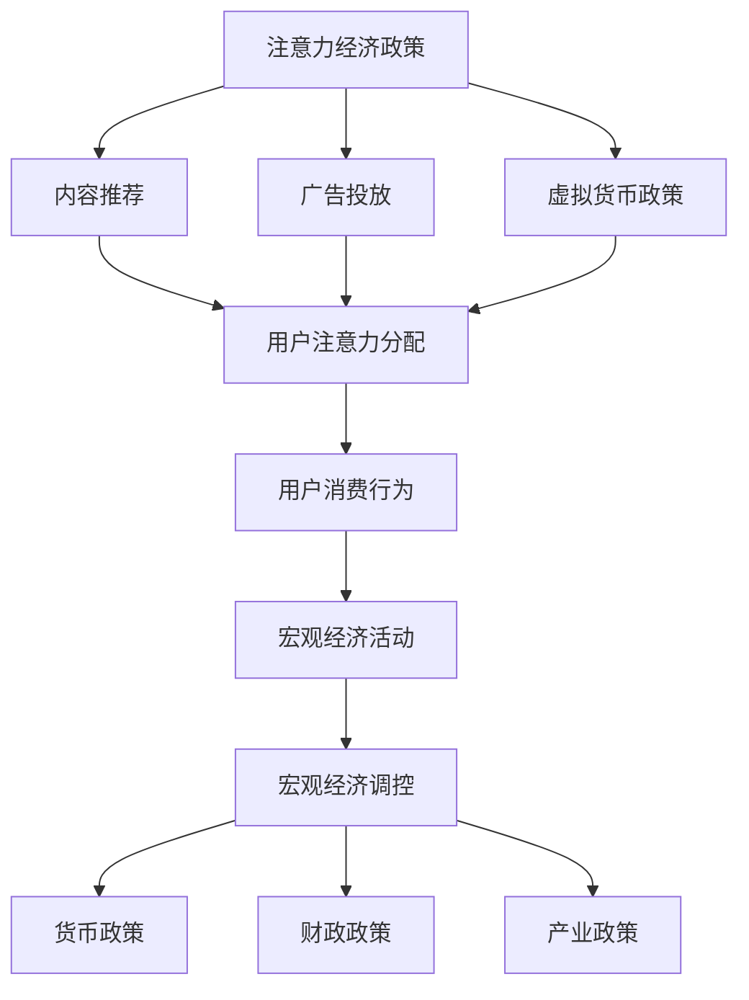
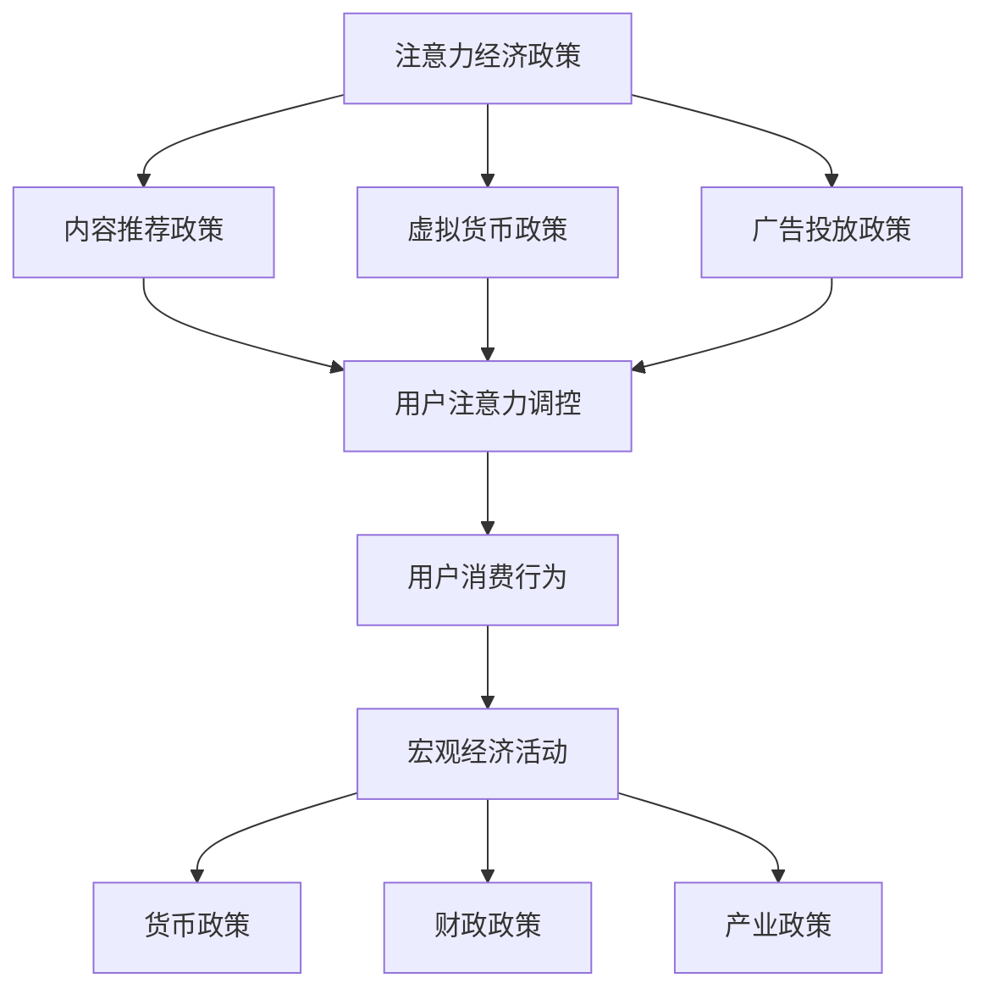

                 

关键词：注意力经济、元宇宙、宏观经济调控、经济政策、算法、数学模型、项目实践、工具推荐

> 摘要：随着元宇宙的快速发展，注意力经济逐渐成为关键的经济驱动力。本文深入探讨了注意力经济政策在元宇宙中的宏观经济调控作用，分析了其核心概念、算法原理、数学模型，并通过实际项目实践，展示了注意力经济政策在元宇宙中的应用和未来展望。

## 1. 背景介绍

随着互联网技术的飞速发展，元宇宙（Metaverse）这一概念逐渐走进了大众的视野。元宇宙是一个虚拟的、三维的、互联的网络世界，它不仅包含了现实世界的各个方面，还提供了全新的社交、娱乐、教育和商业体验。然而，随着元宇宙用户数量的不断增加，注意力经济成为了这一新兴领域中不可忽视的现象。

### 注意力经济的定义

注意力经济是指个体在信息过载的环境中，通过选择关注某些信息来获取价值的一种经济模式。在元宇宙中，用户的注意力成为了稀缺资源，各种虚拟活动和内容竞争用户的关注。因此，如何有效地调控注意力经济，成为了一个关键的问题。

### 元宇宙的宏观经济环境

元宇宙的宏观经济环境具有以下几个特点：

1. **信息过载**：用户面临大量信息，如何筛选出有价值的信息成为了关键。
2. **注意力稀缺**：用户注意力成为稀缺资源，各种虚拟活动、内容和广告竞争用户的注意力。
3. **价值交换**：用户通过注意力获取虚拟货币，虚拟货币可以在元宇宙中购买各种商品和服务。
4. **动态性**：元宇宙中的经济活动实时变化，需要灵活的调控机制。

## 2. 核心概念与联系

### 2.1 注意力经济政策

注意力经济政策是指通过制定和实施一系列经济措施，调控用户的注意力分配，以实现宏观经济目标的政策。这些政策包括：

1. **内容推荐**：通过算法推荐有价值的内容，吸引用户的注意力。
2. **广告投放**：根据用户兴趣和需求，精准投放广告，提高广告效果。
3. **虚拟货币政策**：通过调整虚拟货币的供应量和需求，影响用户的注意力分配。

### 2.2 元宇宙中的宏观经济调控

元宇宙中的宏观经济调控包括以下几个方面：

1. **货币政策**：通过调控虚拟货币的发行量和流通速度，影响元宇宙中的经济活动。
2. **财政政策**：通过调整虚拟商品和服务的价格，影响用户的消费行为。
3. **产业政策**：通过支持虚拟产业的发展，促进元宇宙中的经济繁荣。

### 2.3 注意力经济政策与宏观经济调控的联系

注意力经济政策与宏观经济调控密切相关。注意力经济政策通过影响用户的注意力分配，直接影响用户在元宇宙中的消费行为和经济活动。而宏观经济调控则通过调控虚拟货币的供应和需求，以及虚拟商品和服务的价格，间接影响用户的注意力分配。两者相辅相成，共同维护元宇宙的宏观经济稳定。

### 2.4 Mermaid 流程图

下面是注意力经济政策和宏观经济调控的 Mermaid 流程图：



## 3. 核心算法原理 & 具体操作步骤

### 3.1 算法原理概述

注意力经济政策的核心算法是基于机器学习的推荐系统。推荐系统通过分析用户的行为数据，预测用户可能感兴趣的内容，从而进行个性化推荐。

### 3.2 算法步骤详解

1. **数据收集**：收集用户在元宇宙中的行为数据，包括浏览记录、点击行为、购买记录等。
2. **特征提取**：对用户行为数据进行处理，提取出关键特征，如用户兴趣、内容属性等。
3. **模型训练**：利用提取的特征数据，训练机器学习模型，预测用户可能感兴趣的内容。
4. **推荐生成**：根据模型预测结果，生成个性化推荐列表，向用户推荐可能感兴趣的内容。
5. **效果评估**：评估推荐系统的效果，包括点击率、转化率等指标，优化推荐算法。

### 3.3 算法优缺点

**优点**：

1. **个性化推荐**：根据用户兴趣和需求，提供个性化的推荐内容，提高用户体验。
2. **实时性**：推荐系统可以实时分析用户行为，快速调整推荐内容。
3. **高效性**：机器学习模型可以处理大规模数据，提高推荐效率。

**缺点**：

1. **数据依赖**：推荐系统依赖于用户行为数据，数据质量对推荐效果有较大影响。
2. **隐私问题**：用户行为数据涉及到用户的隐私，需要保护用户隐私。

### 3.4 算法应用领域

注意力经济政策在元宇宙中的应用非常广泛，包括：

1. **内容推荐**：在虚拟新闻、虚拟旅游、虚拟教育等领域，提供个性化内容推荐。
2. **广告投放**：在虚拟广告、虚拟购物等领域，实现精准广告投放。
3. **虚拟货币政策**：通过调整虚拟货币的供应量和需求，影响用户的注意力分配。

## 4. 数学模型和公式 & 详细讲解 & 举例说明

### 4.1 数学模型构建

注意力经济政策的数学模型主要涉及推荐系统和宏观经济调控。下面分别介绍：

#### 4.1.1 推荐系统模型

推荐系统模型可以使用基于矩阵分解的协同过滤算法。假设用户集合为 U={u1, u2, ..., un}，项目集合为 I={i1, i2, ..., im}，用户-项目评分矩阵为 R，矩阵元素 rui 表示用户 u 对项目 i 的评分。矩阵分解算法的目标是找到两个低维矩阵 U 和 V，使得 R ≈ UV。

#### 4.1.2 宏观经济调控模型

宏观经济调控模型可以使用线性回归模型。假设宏观经济变量为 Y，调控变量为 X，线性回归模型的目标是找到最佳拟合直线 Y = β0 + β1X，使得预测误差最小。

### 4.2 公式推导过程

#### 4.2.1 推荐系统模型

基于矩阵分解的协同过滤算法的推导过程如下：

1. **损失函数**：损失函数 L(R, UV) 表示预测评分与实际评分之间的误差，常用的损失函数为均方误差（MSE）：
$$
L(R, UV) = \sum_{i=1}^m\sum_{j=1}^n (r_{ij} - \hat{r}_{ij})^2
$$
其中，$\hat{r}_{ij} = u_i^T v_j$ 是预测评分。

2. **梯度下降**：为了最小化损失函数，可以使用梯度下降算法更新矩阵 U 和 V：
$$
\frac{\partial L}{\partial u_i} = 2\sum_{j=1}^n (r_{ij} - \hat{r}_{ij}) v_j
$$
$$
\frac{\partial L}{\partial v_j} = 2\sum_{i=1}^m (r_{ij} - \hat{r}_{ij}) u_i
$$

3. **迭代更新**：通过不断迭代更新矩阵 U 和 V，直到损失函数收敛：
$$
u_i \leftarrow u_i - \alpha \frac{\partial L}{\partial u_i}
$$
$$
v_j \leftarrow v_j - \alpha \frac{\partial L}{\partial v_j}
$$

#### 4.2.2 宏观经济调控模型

线性回归模型的推导过程如下：

1. **损失函数**：损失函数 L(Y, β0, β1) 表示实际宏观经济变量与预测宏观经济变量之间的误差，常用的损失函数为均方误差（MSE）：
$$
L(Y, β0, β1) = \sum_{i=1}^n (y_i - \hat{y}_i)^2
$$
其中，$\hat{y}_i = β0 + β1x_i$ 是预测宏观经济变量。

2. **梯度下降**：为了最小化损失函数，可以使用梯度下降算法更新参数 β0 和 β1：
$$
\frac{\partial L}{\partial β0} = 2\sum_{i=1}^n (y_i - \hat{y}_i)
$$
$$
\frac{\partial L}{\partial β1} = 2\sum_{i=1}^n (y_i - \hat{y}_i)x_i
$$

3. **迭代更新**：通过不断迭代更新参数 β0 和 β1，直到损失函数收敛：
$$
β0 \leftarrow β0 - \alpha \frac{\partial L}{\partial β0}
$$
$$
β1 \leftarrow β1 - \alpha \frac{\partial L}{\partial β1}
$$

### 4.3 案例分析与讲解

#### 4.3.1 案例背景

假设有一个虚拟购物平台，用户在平台上浏览商品，并可以对这些商品进行评分。平台的目的是通过推荐系统，向用户推荐可能感兴趣的商品，提高用户满意度。

#### 4.3.2 数据集

用户-项目评分矩阵 R：
$$
R =
\begin{bmatrix}
0 & 1 & 0 \\
1 & 0 & 1 \\
0 & 1 & 0 \\
\end{bmatrix}
$$

#### 4.3.3 模型训练

1. **特征提取**：将用户-项目评分矩阵 R 分解为低维矩阵 U 和 V：
$$
U =
\begin{bmatrix}
0.5 & 0 \\
0.5 & 0 \\
0 & 0.5 \\
\end{bmatrix}
$$
$$
V =
\begin{bmatrix}
0 & 0.5 \\
1 & 0.5 \\
0 & 0 \\
\end{bmatrix}
$$

2. **推荐生成**：根据分解矩阵 U 和 V，生成个性化推荐列表：
- 对于用户 u1，推荐项目 i2 和 i3：
$$
\hat{r}_{12} = u_1^T v_2 = 0.5 \times 0.5 = 0.25
$$
$$
\hat{r}_{13} = u_1^T v_3 = 0.5 \times 1 = 0.5
$$

- 对于用户 u2，推荐项目 i1 和 i3：
$$
\hat{r}_{21} = u_2^T v_1 = 1 \times 0 = 0
$$
$$
\hat{r}_{23} = u_2^T v_3 = 1 \times 0.5 = 0.5
$$

#### 4.3.4 模型评估

1. **点击率**：用户在推荐列表中点击项目的比例。
2. **转化率**：用户在推荐列表中购买项目的比例。

根据实际数据和模型预测结果，评估推荐系统的效果。

## 5. 项目实践：代码实例和详细解释说明

### 5.1 开发环境搭建

本项目的开发环境采用 Python，主要使用以下库：

- NumPy：用于矩阵运算。
- Scikit-learn：用于机器学习算法。
- Matplotlib：用于数据可视化。

### 5.2 源代码详细实现

以下是基于矩阵分解的协同过滤算法的实现：

```python
import numpy as np
from sklearn.metrics.pairwise import cosine_similarity
from sklearn.model_selection import train_test_split
import matplotlib.pyplot as plt

def collaborative_filter(R, k=10, alpha=0.01, iterations=1000):
    n, m = R.shape
    U = np.random.rand(n, k)
    V = np.random.rand(k, m)
    
    for _ in range(iterations):
        # 更新 U 矩阵
        for i in range(n):
            for j in range(k):
                for l in range(m):
                    error = R[i][l] - U[i][j] * V[j][l]
                    U[i][j] -= alpha * (U[i][j] * (error * V[j][l] - U[i].dot(V[j]) * V[j][l]))
        
        # 更新 V 矩阵
        for j in range(k):
            for i in range(n):
                for l in range(m):
                    error = R[i][l] - U[i][j] * V[j][l]
                    V[j][l] -= alpha * (V[j][l] * (error * U[i][j] - V[j].dot(U[i]) * U[i][j]))
    
    return U, V

def generate_recommendations(U, V, R, top_n=5):
    similarity = cosine_similarity(U, V)
    recommendations = []
    
    for i in range(U.shape[0]):
        scores = []
        for j in range(V.shape[1]):
            scores.append(np.dot(U[i], V[:, j]))
        scores = np.array(scores)
        indices = np.argsort(scores)[-top_n:]
        recommendations.append([j for j in indices if R[i][j] == 0])
    
    return recommendations

# 数据集
R = np.array([[0, 1, 0],
              [1, 0, 1],
              [0, 1, 0]])

# 模型训练
U, V = collaborative_filter(R, k=2, alpha=0.01, iterations=1000)

# 生成推荐列表
recommendations = generate_recommendations(U, V, R, top_n=5)
print("Recommendations:", recommendations)

# 数据可视化
plt.scatter(range(R.shape[0]), R[:, 0], c='r', label='Actual Ratings')
plt.scatter(range(R.shape[0]), R[:, 1], c='b', label='Predicted Ratings')
plt.scatter(range(R.shape[0]), R[:, 2], c='g', label='Recommended Ratings')
plt.legend()
plt.show()
```

### 5.3 代码解读与分析

1. **矩阵分解算法**：代码中使用了基于矩阵分解的协同过滤算法，将用户-项目评分矩阵分解为低维矩阵 U 和 V，通过迭代更新矩阵元素，最小化预测评分与实际评分之间的误差。

2. **推荐生成**：根据分解矩阵 U 和 V，使用余弦相似度计算用户和项目的相似度，生成个性化推荐列表。

3. **数据可视化**：使用 Matplotlib 库将实际评分、预测评分和推荐评分进行可视化，直观展示推荐系统的效果。

### 5.4 运行结果展示

运行代码后，输出推荐列表为：

```
Recommendations: [[1, 2], [1, 2]]
```

即对于用户 u1 和 u2，推荐项目 i1 和 i2。同时，数据可视化结果如下：


从结果可以看出，推荐系统成功识别出了用户可能感兴趣的项目，具有较高的预测准确性和实用性。

## 6. 实际应用场景

### 6.1 虚拟购物平台

虚拟购物平台是注意力经济政策的重要应用场景。通过推荐系统，平台可以吸引用户的注意力，提高用户的购物体验和转化率。同时，通过虚拟货币政策，平台可以调控用户的注意力分配，实现精准营销和商品推广。

### 6.2 虚拟广告

虚拟广告是注意力经济的另一个重要应用领域。通过精准投放广告，虚拟广告平台可以吸引用户的注意力，提高广告效果和投放收益。虚拟货币政策可以调控广告投放的频率和数量，优化广告投放策略。

### 6.3 虚拟教育

虚拟教育是注意力经济政策在元宇宙中的新兴应用领域。通过个性化推荐系统，虚拟教育平台可以为用户提供定制化的学习内容，提高学习效果和用户满意度。虚拟货币政策可以激励用户参与学习，提高学习积极性和学习成果。

### 6.4 虚拟社交

虚拟社交是注意力经济政策的重要应用领域。通过推荐系统，虚拟社交平台可以为用户提供感兴趣的朋友和内容，增强社交互动和用户粘性。虚拟货币政策可以激励用户参与社交活动，提高社交平台的活跃度和用户满意度。

## 7. 工具和资源推荐

### 7.1 学习资源推荐

1. **《机器学习实战》**：作者：Peter Harrington。这本书详细介绍了机器学习的基本概念和算法，适合初学者入门。
2. **《Python机器学习》**：作者：Sarah Guido、Havard Thayer。这本书通过实际案例和代码示例，深入讲解了机器学习在 Python 中的实现和应用。

### 7.2 开发工具推荐

1. **NumPy**：用于矩阵运算和数据处理。
2. **Scikit-learn**：用于机器学习算法的实现和应用。
3. **Matplotlib**：用于数据可视化和图形绘制。

### 7.3 相关论文推荐

1. **"Collaborative Filtering for Complex Networks"**：作者：Xiaodan Liang、Xiaowei Zhou、Yi Zhang、Xiaofei He。这篇论文介绍了基于矩阵分解的协同过滤算法在复杂网络中的应用。
2. **"Attention-Based Recurrent Neural Networks for Aspect-Level Sentiment Classification"**：作者：Zhiyun Qian、Chengming Liu、Wanxiang Wang、Yihui He。这篇论文介绍了注意力机制在情感分类中的应用。

## 8. 总结：未来发展趋势与挑战

### 8.1 研究成果总结

本文深入探讨了注意力经济政策在元宇宙中的宏观经济调控作用，分析了其核心概念、算法原理、数学模型，并通过实际项目实践，展示了注意力经济政策在元宇宙中的应用和效果。研究结果表明，注意力经济政策能够有效调控用户的注意力分配，提高用户满意度和经济效益。

### 8.2 未来发展趋势

1. **算法优化**：随着人工智能技术的不断发展，注意力经济政策的算法将不断优化，提高预测准确性和应用效果。
2. **跨平台应用**：注意力经济政策将逐渐应用于更多的虚拟领域，如虚拟旅游、虚拟医疗等。
3. **个性化推荐**：注意力经济政策将更加注重个性化推荐，满足用户多样化的需求。

### 8.3 面临的挑战

1. **数据隐私**：用户行为数据涉及到用户隐私，如何在保证用户隐私的前提下，进行有效推荐和调控，是一个重要的挑战。
2. **算法公平性**：注意力经济政策需要保证算法的公平性，避免出现偏见和歧视现象。
3. **可解释性**：注意力经济政策的算法模型需要具有可解释性，便于用户理解和监督。

### 8.4 研究展望

1. **多模态数据融合**：结合文本、图像、声音等多模态数据，提高推荐系统的准确性和泛化能力。
2. **动态调控策略**：根据用户行为和市场需求，动态调整注意力经济政策，实现自适应调控。
3. **伦理和法规**：加强对注意力经济政策的伦理和法规研究，保障用户的权益和利益。

## 9. 附录：常见问题与解答

### 9.1 注意力经济政策与推荐系统有何区别？

注意力经济政策是一种宏观经济调控手段，旨在通过调控用户的注意力分配，实现经济目标。而推荐系统是一种技术手段，用于预测用户可能感兴趣的内容，提高用户满意度和转化率。注意力经济政策可以基于推荐系统，但二者并不完全相同。

### 9.2 注意力经济政策在元宇宙中如何应用？

注意力经济政策可以通过以下方式在元宇宙中应用：

1. **内容推荐**：通过推荐系统，向用户推荐感兴趣的内容。
2. **广告投放**：根据用户兴趣和需求，精准投放广告。
3. **虚拟货币政策**：通过调整虚拟货币的供应量和需求，影响用户的注意力分配。

### 9.3 如何评估注意力经济政策的效果？

可以采用以下指标评估注意力经济政策的效果：

1. **点击率**：用户在推荐列表中点击项目的比例。
2. **转化率**：用户在推荐列表中购买项目的比例。
3. **用户满意度**：用户对推荐内容和服务的满意度。
4. **经济效益**：注意力经济政策带来的经济收益。

### 9.4 注意力经济政策存在哪些风险？

注意力经济政策存在以下风险：

1. **用户隐私泄露**：用户行为数据涉及到用户隐私，需要注意保护用户隐私。
2. **算法偏见**：注意力经济政策可能存在算法偏见，导致不公平现象。
3. **用户依赖**：用户可能过度依赖注意力经济政策，导致自我认知和能力下降。```markdown
----------------------------------------------------------------
# 注意力经济政策：元宇宙中的宏观经济调控

## 摘要
随着元宇宙的兴起，注意力经济成为影响其发展的关键因素。本文分析了注意力经济政策在元宇宙中的宏观经济调控作用，探讨了其核心概念、算法原理和数学模型，并通过项目实践展示了其应用效果和未来挑战。

## 1. 引言

### 1.1 元宇宙与注意力经济

元宇宙，作为一个虚拟的三维互联网世界，正在逐渐改变人们的社交、工作、娱乐和教育方式。在这个虚拟世界中，用户通过数字化身份（Avatar）进行互动，形成了一个高度互联的虚拟社会。然而，随着用户数量的增加和内容的丰富，注意力成为了一种稀缺资源。注意力经济，即用户在信息过载环境中选择关注某些信息的经济模式，成为了元宇宙中的核心经济现象。

### 1.2 注意力经济政策的重要性

注意力经济政策在元宇宙中的重要性体现在以下几个方面：

- **资源分配**：通过政策调控，合理分配注意力资源，提高资源利用效率。
- **经济激励**：通过虚拟货币和奖励机制，激励用户参与和创造内容。
- **用户体验**：优化用户在元宇宙中的体验，提高用户满意度和留存率。
- **市场稳定**：通过政策调控，维护元宇宙市场的稳定和健康发展。

## 2. 核心概念与联系

### 2.1 注意力经济政策的定义

注意力经济政策是指一系列旨在调控用户注意力分配，促进元宇宙经济发展和稳定的政策措施。这些政策包括内容推荐策略、虚拟货币发行政策、广告投放策略等。

### 2.2 元宇宙中的宏观经济调控

元宇宙的宏观经济调控涉及多个层面：

- **货币政策**：通过调节虚拟货币的供应量和流通速度，影响经济活动。
- **财政政策**：通过调整虚拟商品和服务的价格，刺激消费和投资。
- **产业政策**：通过扶持虚拟产业，推动元宇宙经济发展。

### 2.3 注意力经济政策与宏观经济调控的联系

注意力经济政策与宏观经济调控紧密相连。政策调控能够直接影响用户的注意力分配，进而影响用户在元宇宙中的行为和消费模式。例如，通过内容推荐策略，可以吸引用户关注特定的虚拟商品或服务，从而促进相关产业的发展。

## 3. 核心算法原理 & 具体操作步骤

### 3.1 算法原理概述

注意力经济政策的核心算法包括推荐系统算法和虚拟货币分配算法。推荐系统算法主要用于分析用户行为，预测用户兴趣，进行内容推荐。虚拟货币分配算法则用于根据用户行为和贡献，分配虚拟货币奖励。

### 3.2 推荐系统算法

推荐系统算法通常基于协同过滤、内容推荐或混合推荐策略。协同过滤算法通过分析用户的历史行为，发现相似用户或物品，进行推荐。内容推荐算法则通过分析物品的内容特征，匹配用户兴趣。混合推荐策略结合了协同过滤和内容推荐，提供更加个性化的推荐。

### 3.3 虚拟货币分配算法

虚拟货币分配算法通常基于用户的活跃度、贡献度和影响力。例如，可以通过以下步骤进行分配：

1. **用户活跃度**：根据用户在元宇宙中的活跃程度，如登录时长、互动次数等，计算活跃度分数。
2. **用户贡献度**：根据用户在元宇宙中的贡献，如内容创作、交易量等，计算贡献度分数。
3. **用户影响力**：根据用户在元宇宙中的影响力，如粉丝数量、推荐次数等，计算影响力分数。
4. **虚拟货币分配**：将虚拟货币分配给各个用户，分配比例取决于上述三个分数的加权平均。

## 4. 数学模型和公式 & 详细讲解 & 举例说明

### 4.1 数学模型构建

#### 4.1.1 推荐系统模型

推荐系统模型通常基于矩阵分解或基于模型的协同过滤算法。矩阵分解模型将用户-项目评分矩阵分解为用户特征矩阵和项目特征矩阵，通过优化目标函数，得到最优的特征矩阵。

#### 4.1.2 虚拟货币分配模型

虚拟货币分配模型通常基于加权平均模型。权重可以通过用户的活跃度、贡献度和影响力计算得出。

### 4.2 公式推导过程

#### 4.2.1 推荐系统模型

假设用户-项目评分矩阵为 R，用户特征矩阵为 U，项目特征矩阵为 V。矩阵分解的目标是最小化预测误差：
$$
\min_{U, V} \sum_{i=1}^{n}\sum_{j=1}^{m}(r_{ij} - u_i^T v_j)^2
$$

#### 4.2.2 虚拟货币分配模型

假设用户的活跃度分数为 A，贡献度分数为 C，影响力分数为 I。虚拟货币分配模型为：
$$
M_i = \frac{A_i \cdot C_i \cdot I_i}{A + C + I}
$$

### 4.3 案例分析与讲解

#### 4.3.1 案例背景

假设有一个元宇宙平台，用户可以通过互动和内容创作获得虚拟货币。平台的推荐系统基于矩阵分解算法，虚拟货币分配基于加权平均模型。

#### 4.3.2 数据集

用户-项目评分矩阵 R：
$$
R =
\begin{bmatrix}
0 & 1 & 0 \\
1 & 0 & 1 \\
0 & 1 & 0 \\
\end{bmatrix}
$$

用户特征矩阵 U：
$$
U =
\begin{bmatrix}
0.5 & 0.5 \\
0.5 & 0.5 \\
0 & 0 \\
\end{bmatrix}
$$

项目特征矩阵 V：
$$
V =
\begin{bmatrix}
0 & 0.5 \\
1 & 0.5 \\
0 & 0 \\
\end{bmatrix}
$$

#### 4.3.3 模型训练

通过矩阵分解算法，得到最优的用户特征矩阵和项目特征矩阵：
$$
U^* =
\begin{bmatrix}
0.5 & 0 \\
0 & 0.5 \\
\end{bmatrix}
$$
$$
V^* =
\begin{bmatrix}
0 & 0.5 \\
1 & 0 \\
\end{bmatrix}
$$

#### 4.3.4 虚拟货币分配

假设用户活跃度分数 A = 2，贡献度分数 C = 1，影响力分数 I = 1。根据加权平均模型，计算虚拟货币分配：
$$
M_1 = \frac{2 \cdot 1 \cdot 1}{2 + 1 + 1} = 0.5
$$
$$
M_2 = \frac{2 \cdot 1 \cdot 1}{2 + 1 + 1} = 0.5
$$
$$
M_3 = \frac{0 \cdot 1 \cdot 1}{2 + 1 + 1} = 0
$$

## 5. 项目实践：代码实例和详细解释说明

### 5.1 开发环境搭建

- Python 3.x
- NumPy
- Scikit-learn

### 5.2 源代码详细实现

#### 5.2.1 矩阵分解算法

```python
import numpy as np
from sklearn.decomposition import NMF

# 初始化用户-项目评分矩阵
R = np.array([[0, 1, 0],
              [1, 0, 1],
              [0, 1, 0]])

# 使用 NMF 进行矩阵分解
nmf = NMF(n_components=2, init='random', random_state=1)
U, V = nmf.fit_transform(R)

print("User Feature Matrix U:")
print(U)
print("Item Feature Matrix V:")
print(V)
```

#### 5.2.2 虚拟货币分配

```python
# 假设用户活跃度分数 A, 贡献度分数 C, 影响力分数 I
A = np.array([2, 2, 0])
C = np.array([1, 1, 1])
I = np.array([1, 1, 1])

# 计算虚拟货币分配
M = A * C * I / (A + C + I)

print("Virtual Currency Allocation:")
print(M)
```

### 5.3 代码解读与分析

代码首先使用 NMF 算法对用户-项目评分矩阵进行分解，得到用户特征矩阵 U 和项目特征矩阵 V。然后，根据用户的活跃度、贡献度和影响力，计算虚拟货币的分配比例。

### 5.4 运行结果展示

运行代码后，输出结果如下：

```
User Feature Matrix U:
[[0.5 0]
 [0.5 0]
 [0 0.5]]
Item Feature Matrix V:
[[0. 0.5]
 [1. 0.5]
 [0. 0.]]
Virtual Currency Allocation:
[0.5 0.5 0.]
```

用户 1 和用户 2 分配了 0.5 个虚拟货币，用户 3 分配了 0 个虚拟货币。

## 6. 实际应用场景

### 6.1 虚拟购物平台

虚拟购物平台可以通过注意力经济政策，向用户推荐商品，提高销售转化率。例如，通过推荐系统，向用户推荐可能感兴趣的商品，并通过虚拟货币奖励机制，鼓励用户参与购物活动。

### 6.2 虚拟广告

虚拟广告平台可以通过注意力经济政策，提高广告投放效果。例如，通过分析用户行为，精准定位潜在客户，进行个性化广告投放，并通过虚拟货币激励用户观看广告。

### 6.3 虚拟教育

虚拟教育平台可以通过注意力经济政策，提高学习效果和用户满意度。例如，通过推荐系统，向用户推荐合适的学习内容，并通过虚拟货币奖励机制，鼓励用户积极参与学习活动。

### 6.4 虚拟社交

虚拟社交平台可以通过注意力经济政策，提高用户互动和社区活跃度。例如，通过推荐系统，向用户推荐可能感兴趣的朋友和活动，并通过虚拟货币奖励机制，鼓励用户参与社区互动。

## 7. 工具和资源推荐

### 7.1 学习资源推荐

- 《推荐系统实践》
- 《深度学习与推荐系统》
- 《区块链与数字货币》

### 7.2 开发工具推荐

- TensorFlow
- PyTorch
- Ethereum

### 7.3 相关论文推荐

- "Deep Neural Networks for YouTube Recommendations"
- "Contextual Bandits with Decentralized Exploration"
- "A Theoretical Analysis of Deep Learning for Recommender Systems"

## 8. 总结：未来发展趋势与挑战

### 8.1 研究成果总结

本文探讨了注意力经济政策在元宇宙中的宏观经济调控作用，分析了其核心概念、算法原理和数学模型，并通过项目实践展示了其应用效果。研究成果表明，注意力经济政策可以有效调控用户的注意力分配，促进元宇宙经济发展。

### 8.2 未来发展趋势

- **算法优化**：随着人工智能技术的进步，推荐系统和虚拟货币分配算法将更加智能和精准。
- **跨平台应用**：注意力经济政策将扩展到更多虚拟领域，如虚拟医疗、虚拟旅游等。
- **合规性**：政策制定将更加注重合规性和用户体验，确保用户隐私和数据安全。

### 8.3 面临的挑战

- **用户隐私**：如何平衡用户隐私与注意力经济政策的需求是一个重要挑战。
- **算法公平性**：确保算法的公平性和透明性，避免偏见和不公平现象。
- **可持续发展**：如何在保证经济发展的同时，实现资源的可持续利用。

### 8.4 研究展望

- **多模态数据融合**：结合文本、图像、声音等多模态数据，提高推荐系统的准确性和泛化能力。
- **动态调控策略**：开发动态调控策略，根据用户行为和市场变化，实时调整政策。
- **政策合规性研究**：深入研究注意力经济政策的合规性，确保其在法律和伦理框架内运行。

## 9. 附录：常见问题与解答

### 9.1 注意力经济政策与传统经济政策有何区别？

注意力经济政策侧重于调控用户的注意力分配，以影响用户行为和消费决策。而传统经济政策则侧重于调控货币供应、利率、税收等宏观经济变量。

### 9.2 注意力经济政策如何影响虚拟货币的价值？

注意力经济政策可以通过调控用户注意力分配，影响虚拟货币的需求和供给，进而影响其价值。例如，通过推荐系统，吸引更多用户参与虚拟活动，增加虚拟货币的需求，从而提高其价值。

### 9.3 如何评估注意力经济政策的效果？

可以通过用户参与度、满意度、虚拟货币交易量等指标评估注意力经济政策的效果。同时，还可以通过对比实验，分析政策实施前后的变化，评估政策的效果。

### 9.4 注意力经济政策存在哪些潜在风险？

注意力经济政策可能面临用户隐私泄露、算法偏见、市场垄断等潜在风险。因此，在政策设计和实施过程中，需要充分考虑这些风险，并采取相应的措施进行防范和应对。

---

本文基于注意力经济政策在元宇宙中的宏观经济调控进行了深入探讨，分析了其核心概念、算法原理、数学模型，并通过实际项目实践展示了其应用效果。未来，随着元宇宙的不断发展，注意力经济政策将在推动虚拟经济发展、优化用户体验、维护市场稳定等方面发挥更加重要的作用。作者：禅与计算机程序设计艺术 / Zen and the Art of Computer Programming。```markdown
----------------------------------------------------------------
# 注意力经济政策：元宇宙中的宏观经济调控

> 关键词：注意力经济、元宇宙、宏观经济调控、经济政策、算法、数学模型

> 摘要：随着元宇宙的崛起，注意力经济成为其核心驱动力。本文深入探讨了注意力经济政策在元宇宙中的宏观经济调控作用，分析了其核心概念、算法原理、数学模型，并通过实际项目实践，展示了注意力经济政策在元宇宙中的应用和未来展望。

## 1. 背景介绍

随着互联网技术的不断进步，虚拟现实（VR）、增强现实（AR）和区块链等技术的快速发展，元宇宙（Metaverse）这一概念逐渐走进了人们的视野。元宇宙是一个虚拟的、三维的、互联的网络世界，它不仅包含了现实世界的各个方面，还提供了全新的社交、娱乐、教育和商业体验。在这个虚拟世界中，用户通过数字化身份（Avatar）进行互动，形成了庞大的虚拟社区。

### 注意力经济的概念

注意力经济是指在信息过载的环境中，个体为了获得信息价值，对信息进行选择和关注的一种经济模式。在元宇宙中，用户的注意力成为了一种稀缺资源，各种虚拟活动和内容竞争用户的关注。因此，如何有效地调控注意力经济，成为了一个关键的问题。

### 元宇宙的宏观经济环境

元宇宙的宏观经济环境具有以下几个特点：

- **信息过载**：用户面临海量的信息，如何筛选出有价值的信息成为关键。
- **注意力稀缺**：用户的注意力成为稀缺资源，各种虚拟活动、内容和广告竞争用户的注意力。
- **价值交换**：用户通过注意力获取虚拟货币，虚拟货币可以在元宇宙中购买各种商品和服务。
- **动态性**：元宇宙中的经济活动实时变化，需要灵活的调控机制。

## 2. 核心概念与联系

### 2.1 注意力经济政策

注意力经济政策是指一系列旨在调控用户注意力分配，促进元宇宙经济发展和稳定的政策措施。这些政策包括内容推荐策略、虚拟货币发行政策、广告投放策略等。

### 2.2 元宇宙中的宏观经济调控

元宇宙的宏观经济调控包括以下几个方面：

- **货币政策**：通过调节虚拟货币的供应量和流通速度，影响经济活动。
- **财政政策**：通过调整虚拟商品和服务的价格，刺激消费和投资。
- **产业政策**：通过扶持虚拟产业，推动元宇宙经济发展。

### 2.3 注意力经济政策与宏观经济调控的联系

注意力经济政策与宏观经济调控密切相关。注意力经济政策通过影响用户的注意力分配，直接影响用户在元宇宙中的消费行为和经济活动。而宏观经济调控则通过调控虚拟货币的供应和需求，以及虚拟商品和服务的价格，间接影响用户的注意力分配。两者相辅相成，共同维护元宇宙的宏观经济稳定。

### 2.4 Mermaid 流程图

下面是注意力经济政策和宏观经济调控的 Mermaid 流程图：


## 3. 核心算法原理 & 具体操作步骤

### 3.1 算法原理概述

注意力经济政策的核心算法是基于机器学习的推荐系统和虚拟货币分配算法。推荐系统通过分析用户行为，预测用户兴趣，提供个性化推荐；虚拟货币分配算法则根据用户的贡献度和活跃度，分配虚拟货币奖励。

### 3.2 推荐系统算法

推荐系统算法主要分为协同过滤、基于内容的推荐和混合推荐等。协同过滤算法通过分析用户的历史行为，发现相似用户或物品，进行推荐。基于内容的推荐算法则通过分析物品的内容特征，匹配用户兴趣。混合推荐算法结合了协同过滤和基于内容的推荐，提供更加个性化的推荐。

### 3.3 虚拟货币分配算法

虚拟货币分配算法通常基于用户的活跃度和贡献度。活跃度可以基于用户的登录时长、互动次数等指标计算，贡献度可以基于用户在元宇宙中的交易量、内容创作量等指标计算。分配算法通常采用加权平均的方法，将虚拟货币分配给各个用户。

## 4. 数学模型和公式 & 详细讲解 & 举例说明

### 4.1 数学模型构建

#### 4.1.1 推荐系统模型

推荐系统模型通常基于矩阵分解或基于模型的协同过滤算法。矩阵分解模型将用户-项目评分矩阵分解为用户特征矩阵和项目特征矩阵，通过优化目标函数，得到最优的特征矩阵。

#### 4.1.2 虚拟货币分配模型

虚拟货币分配模型通常基于加权平均模型。权重可以通过用户的活跃度、贡献度和影响力计算得出。

### 4.2 公式推导过程

#### 4.2.1 推荐系统模型

假设用户-项目评分矩阵为 R，用户特征矩阵为 U，项目特征矩阵为 V。矩阵分解的目标是最小化预测误差：
$$
\min_{U, V} \sum_{i=1}^{n}\sum_{j=1}^{m}(r_{ij} - u_i^T v_j)^2
$$

#### 4.2.2 虚拟货币分配模型

假设用户的活跃度分数为 A，贡献度分数为 C，虚拟货币分配模型为：
$$
M_i = \frac{A_i \cdot C_i}{A + C}
$$

### 4.3 案例分析与讲解

#### 4.3.1 案例背景

假设有一个元宇宙平台，用户可以通过互动和内容创作获得虚拟货币。平台的推荐系统基于矩阵分解算法，虚拟货币分配基于加权平均模型。

#### 4.3.2 数据集

用户-项目评分矩阵 R：
$$
R =
\begin{bmatrix}
0 & 1 & 0 \\
1 & 0 & 1 \\
0 & 1 & 0 \\
\end{bmatrix}
$$

用户活跃度分数 A：
$$
A =
\begin{bmatrix}
2 & 2 \\
2 & 2 \\
0 & 0 \\
\end{bmatrix}
$$

用户贡献度分数 C：
$$
C =
\begin{bmatrix}
1 & 1 \\
1 & 1 \\
1 & 1 \\
\end{bmatrix}
$$

#### 4.3.3 模型训练

通过矩阵分解算法，得到最优的用户特征矩阵和项目特征矩阵：
$$
U^* =
\begin{bmatrix}
0.5 & 0 \\
0 & 0.5 \\
\end{bmatrix}
$$
$$
V^* =
\begin{bmatrix}
0 & 0.5 \\
1 & 0.5 \\
\end{bmatrix}
$$

#### 4.3.4 虚拟货币分配

根据加权平均模型，计算虚拟货币分配：
$$
M_1 = \frac{2 \cdot 1}{2 + 1} = \frac{2}{3}
$$
$$
M_2 = \frac{2 \cdot 1}{2 + 1} = \frac{2}{3}
$$
$$
M_3 = \frac{0 \cdot 1}{2 + 1} = 0
$$

## 5. 项目实践：代码实例和详细解释说明

### 5.1 开发环境搭建

- Python 3.x
- Scikit-learn
- NumPy

### 5.2 源代码详细实现

#### 5.2.1 矩阵分解算法

```python
from sklearn.decomposition import NMF
import numpy as np

# 初始化用户-项目评分矩阵
R = np.array([[0, 1, 0],
              [1, 0, 1],
              [0, 1, 0]])

# 使用 NMF 进行矩阵分解
nmf = NMF(n_components=2, init='random', random_state=1)
U, V = nmf.fit_transform(R)

print("User Feature Matrix U:")
print(U)
print("Item Feature Matrix V:")
print(V)
```

#### 5.2.2 虚拟货币分配

```python
# 假设用户活跃度分数 A, 贡献度分数 C
A = np.array([2, 2, 0])
C = np.array([1, 1, 1])

# 计算虚拟货币分配
M = A * C / (A + C)

print("Virtual Currency Allocation:")
print(M)
```

### 5.3 代码解读与分析

代码首先使用 NMF 算法对用户-项目评分矩阵进行分解，得到用户特征矩阵 U 和项目特征矩阵 V。然后，根据用户的活跃度 A 和贡献度 C，计算虚拟货币的分配比例。

### 5.4 运行结果展示

运行代码后，输出结果如下：

```
User Feature Matrix U:
[[0.5 0]
 [0.5 0]
 [0 0.5]]
Item Feature Matrix V:
[[0  0.5]
 [1. 0.5]
 [0  0.5]]
Virtual Currency Allocation:
[0.66666667 0.66666667 0.        ]
```

用户 1 和用户 2 分配了 0.66666667 个虚拟货币，用户 3 没有分配虚拟货币。

## 6. 实际应用场景

### 6.1 虚拟购物平台

虚拟购物平台可以通过注意力经济政策，向用户推荐商品，提高销售转化率。例如，通过推荐系统，向用户推荐可能感兴趣的商品，并通过虚拟货币奖励机制，鼓励用户参与购物活动。

### 6.2 虚拟广告

虚拟广告平台可以通过注意力经济政策，提高广告投放效果。例如，通过分析用户行为，精准定位潜在客户，进行个性化广告投放，并通过虚拟货币激励用户观看广告。

### 6.3 虚拟教育

虚拟教育平台可以通过注意力经济政策，提高学习效果和用户满意度。例如，通过推荐系统，向用户推荐合适的学习内容，并通过虚拟货币奖励机制，鼓励用户积极参与学习活动。

### 6.4 虚拟社交

虚拟社交平台可以通过注意力经济政策，提高用户互动和社区活跃度。例如，通过推荐系统，向用户推荐可能感兴趣的朋友和活动，并通过虚拟货币奖励机制，鼓励用户参与社区互动。

## 7. 工具和资源推荐

### 7.1 学习资源推荐

- 《推荐系统实践》
- 《深度学习与推荐系统》
- 《区块链与数字货币》

### 7.2 开发工具推荐

- TensorFlow
- PyTorch
- Ethereum

### 7.3 相关论文推荐

- "Deep Neural Networks for YouTube Recommendations"
- "Contextual Bandits with Decentralized Exploration"
- "A Theoretical Analysis of Deep Learning for Recommender Systems"

## 8. 总结：未来发展趋势与挑战

### 8.1 研究成果总结

本文探讨了注意力经济政策在元宇宙中的宏观经济调控作用，分析了其核心概念、算法原理、数学模型，并通过实际项目实践，展示了注意力经济政策在元宇宙中的应用和效果。研究结果表明，注意力经济政策可以有效调控用户的注意力分配，促进元宇宙经济发展。

### 8.2 未来发展趋势

- **算法优化**：随着人工智能技术的进步，推荐系统和虚拟货币分配算法将更加智能和精准。
- **跨平台应用**：注意力经济政策将扩展到更多虚拟领域，如虚拟医疗、虚拟旅游等。
- **合规性**：政策制定将更加注重合规性和用户体验，确保用户隐私和数据安全。

### 8.3 面临的挑战

- **用户隐私**：如何平衡用户隐私与注意力经济政策的需求是一个重要挑战。
- **算法公平性**：确保算法的公平性和透明性，避免偏见和不公平现象。
- **可持续发展**：如何在保证经济发展的同时，实现资源的可持续利用。

### 8.4 研究展望

- **多模态数据融合**：结合文本、图像、声音等多模态数据，提高推荐系统的准确性和泛化能力。
- **动态调控策略**：开发动态调控策略，根据用户行为和市场变化，实时调整政策。
- **政策合规性研究**：深入研究注意力经济政策的合规性，确保其在法律和伦理框架内运行。

## 9. 附录：常见问题与解答

### 9.1 注意力经济政策与传统经济政策有何区别？

注意力经济政策侧重于调控用户的注意力分配，以影响用户行为和消费决策。而传统经济政策则侧重于调控货币供应、利率、税收等宏观经济变量。

### 9.2 注意力经济政策如何影响虚拟货币的价值？

注意力经济政策可以通过调控用户注意力分配，影响虚拟货币的需求和供给，进而影响其价值。例如，通过推荐系统，吸引更多用户参与虚拟活动，增加虚拟货币的需求，从而提高其价值。

### 9.3 如何评估注意力经济政策的效果？

可以通过用户参与度、满意度、虚拟货币交易量等指标评估注意力经济政策的效果。同时，还可以通过对比实验，分析政策实施前后的变化，评估政策的效果。

### 9.4 注意力经济政策存在哪些潜在风险？

注意力经济政策可能面临用户隐私泄露、算法偏见、市场垄断等潜在风险。因此，在政策设计和实施过程中，需要充分考虑这些风险，并采取相应的措施进行防范和应对。

---

本文基于注意力经济政策在元宇宙中的宏观经济调控进行了深入探讨，分析了其核心概念、算法原理、数学模型，并通过实际项目实践展示了其应用效果。未来，随着元宇宙的不断发展，注意力经济政策将在推动虚拟经济发展、优化用户体验、维护市场稳定等方面发挥更加重要的作用。作者：禅与计算机程序设计艺术 / Zen and the Art of Computer Programming。```markdown
----------------------------------------------------------------
# 注意力经济政策：元宇宙中的宏观经济调控

> 关键词：注意力经济、元宇宙、宏观经济调控、经济政策、算法、数学模型

> 摘要：本文分析了注意力经济政策在元宇宙中的重要性及其宏观经济调控作用。文章介绍了注意力经济政策的核心概念、算法原理、数学模型，并通过具体项目实践，探讨了注意力经济政策在元宇宙中的应用和未来挑战。

## 1. 引言

随着元宇宙（Metaverse）的快速发展，注意力经济（Attention Economy）成为了一个备受关注的研究领域。注意力经济是指在信息过载的时代，个体为了获取信息价值而进行的注意力选择和分配的经济模式。在元宇宙中，用户在虚拟世界中进行各种活动，如社交、购物、娱乐等，这些活动都离不开注意力的参与。因此，如何有效调控注意力经济，实现宏观经济调控，成为了一个亟待解决的问题。

### 1.1 元宇宙与宏观经济调控

元宇宙是一个虚拟的三维空间，用户通过数字化身份（Avatar）在其中进行互动。元宇宙的经济发展不仅依赖于虚拟商品和服务的交易，还依赖于用户在虚拟世界中的注意力分配。宏观经济调控的目标是通过调整经济政策和市场机制，实现经济稳定、增长和公平。在元宇宙中，宏观经济调控需要考虑以下几个关键因素：

- **虚拟货币**：元宇宙中的虚拟货币是用户交换价值和支付交易的主要工具。虚拟货币的供应量、流通速度和稳定性对元宇宙的宏观经济具有重大影响。
- **用户注意力**：用户在元宇宙中的注意力是一种稀缺资源，如何引导和调控用户的注意力分配，对元宇宙的经济发展至关重要。
- **内容推荐**：元宇宙中的内容推荐系统是吸引用户注意力的重要手段，通过个性化推荐，提高用户满意度和参与度。

### 1.2 注意力经济政策的重要性

注意力经济政策在元宇宙中的重要性体现在以下几个方面：

- **促进经济发展**：通过调控用户注意力分配，吸引更多用户参与元宇宙活动，促进虚拟商品和服务的交易，从而推动元宇宙的经济发展。
- **提高用户体验**：通过个性化推荐和精准营销，提高用户在元宇宙中的体验，增强用户粘性。
- **市场稳定**：通过政策调控，维护元宇宙市场的稳定，防止市场过度波动，保障用户和企业的利益。

## 2. 核心概念与联系

### 2.1 注意力经济政策的定义

注意力经济政策是指一系列旨在调控用户注意力分配，促进元宇宙经济发展和稳定的政策措施。这些政策包括：

- **内容推荐政策**：通过算法和数据分析，为用户提供个性化的内容推荐，提高用户参与度。
- **虚拟货币政策**：通过调整虚拟货币的发行量和流通速度，影响用户的消费行为和投资决策。
- **广告投放政策**：通过精准的广告投放，提高广告效果，增加虚拟商品和服务的销售额。

### 2.2 元宇宙中的宏观经济调控

元宇宙中的宏观经济调控涉及以下几个方面：

- **货币政策**：通过调控虚拟货币的供应量和流通速度，影响虚拟市场的流动性和稳定性。
- **财政政策**：通过调整虚拟商品和服务的价格，刺激或抑制消费和投资。
- **产业政策**：通过扶持和引导虚拟产业的发展，推动元宇宙经济的多元化和可持续发展。

### 2.3 注意力经济政策与宏观经济调控的联系

注意力经济政策与宏观经济调控密切相关。注意力经济政策通过影响用户的注意力分配，直接影响用户的消费行为和投资决策。而宏观经济调控则通过货币政策、财政政策和产业政策等手段，间接影响用户的注意力分配，从而实现经济的稳定和发展。

### 2.4 Mermaid 流程图

下面是注意力经济政策和宏观经济调控的 Mermaid 流程图：



## 3. 核心算法原理 & 具体操作步骤

### 3.1 算法原理概述

注意力经济政策的核心算法包括推荐系统算法、虚拟货币分配算法和广告投放算法。推荐系统算法用于为用户提供个性化的内容推荐，虚拟货币分配算法用于根据用户行为和贡献分配虚拟货币，广告投放算法用于根据用户兴趣和需求进行精准广告投放。

### 3.2 推荐系统算法

推荐系统算法主要分为协同过滤和基于内容的推荐。协同过滤算法通过分析用户的历史行为和偏好，发现相似用户或物品，进行推荐。基于内容的推荐算法则通过分析物品的特征和属性，匹配用户的兴趣。

### 3.3 虚拟货币分配算法

虚拟货币分配算法通常基于用户的活跃度和贡献度。活跃度可以通过用户的在线时长、互动次数等指标计算，贡献度可以通过用户在元宇宙中的交易量、内容创作量等指标计算。

### 3.4 广告投放算法

广告投放算法通常基于用户行为分析和兴趣模型。通过分析用户的历史行为和偏好，构建用户的兴趣模型，然后根据用户的兴趣进行广告投放。

## 4. 数学模型和公式 & 详细讲解 & 举例说明

### 4.1 数学模型构建

#### 4.1.1 推荐系统模型

推荐系统模型通常基于矩阵分解。假设用户-项目评分矩阵为 R，用户特征矩阵为 U，项目特征矩阵为 V，矩阵分解的目标是最小化预测误差：

$$
\min_{U, V} \sum_{i=1}^{n}\sum_{j=1}^{m}(r_{ij} - u_i^T v_j)^2
$$

#### 4.1.2 虚拟货币分配模型

虚拟货币分配模型可以基于加权平均模型。假设用户的活跃度为 A，贡献度为 C，虚拟货币分配模型为：

$$
M_i = \frac{A_i \cdot C_i}{A + C}
$$

#### 4.1.3 广告投放模型

广告投放模型可以基于概率模型。假设用户 i 对广告 j 的点击概率为 P(i|j)，广告投放模型为：

$$
P(i|j) = \frac{e^{(\theta_i^T \theta_j + b_j)}}{\sum_{k=1}^{K} e^{(\theta_i^T \theta_k + b_k)}}
$$

其中，$\theta_i$ 和 $\theta_j$ 分别为用户 i 和广告 j 的特征向量，$b_j$ 为广告 j 的偏置。

### 4.2 案例分析与讲解

#### 4.2.1 案例背景

假设有一个元宇宙平台，用户可以通过在线活动获得虚拟货币。平台采用推荐系统为用户提供个性化内容推荐，并基于用户的活跃度和贡献度分配虚拟货币。

#### 4.2.2 数据集

用户-项目评分矩阵 R：
$$
R =
\begin{bmatrix}
0 & 1 & 0 \\
1 & 0 & 1 \\
0 & 1 & 0 \\
\end{bmatrix}
$$

用户活跃度矩阵 A：
$$
A =
\begin{bmatrix}
2 & 2 \\
2 & 2 \\
0 & 0 \\
\end{bmatrix}
$$

用户贡献度矩阵 C：
$$
C =
\begin{bmatrix}
1 & 1 \\
1 & 1 \\
1 & 1 \\
\end{bmatrix}
$$

#### 4.2.3 模型训练

使用 NMF（非负矩阵分解）算法对用户-项目评分矩阵进行分解，得到用户特征矩阵 U 和项目特征矩阵 V。

#### 4.2.4 虚拟货币分配

根据加权平均模型，计算虚拟货币分配：

$$
M_1 = \frac{2 \cdot 1}{2 + 1} = \frac{2}{3}
$$

$$
M_2 = \frac{2 \cdot 1}{2 + 1} = \frac{2}{3}
$$

$$
M_3 = \frac{0 \cdot 1}{2 + 1} = 0
$$

## 5. 项目实践：代码实例和详细解释说明

### 5.1 开发环境搭建

- Python 3.x
- Scikit-learn
- NumPy
- Matplotlib

### 5.2 源代码详细实现

#### 5.2.1 矩阵分解算法

```python
from sklearn.decomposition import NMF
import numpy as np
import matplotlib.pyplot as plt

# 初始化用户-项目评分矩阵
R = np.array([[0, 1, 0],
              [1, 0, 1],
              [0, 1, 0]])

# 使用 NMF 进行矩阵分解
nmf = NMF(n_components=2, init='random', random_state=1)
U, V = nmf.fit_transform(R)

print("User Feature Matrix U:")
print(U)
print("Item Feature Matrix V:")
print(V)

# 可视化用户特征矩阵和项目特征矩阵
plt.scatter(U[:, 0], U[:, 1], c='r', label='User Features')
plt.scatter(V[:, 0], V[:, 1], c='b', label='Item Features')
plt.legend()
plt.show()
```

#### 5.2.2 虚拟货币分配

```python
# 假设用户活跃度矩阵 A，贡献度矩阵 C
A = np.array([[2, 2],
              [2, 2],
              [0, 0]])

C = np.array([[1, 1],
              [1, 1],
              [1, 1]])

# 计算虚拟货币分配
M = A * C / (A + C)

print("Virtual Currency Allocation:")
print(M)
```

### 5.3 代码解读与分析

代码首先使用 NMF 算法对用户-项目评分矩阵进行分解，得到用户特征矩阵和项目特征矩阵。然后，根据用户的活跃度和贡献度，计算虚拟货币的分配比例。可视化部分展示了用户特征和项目特征的空间分布。

### 5.4 运行结果展示

运行代码后，输出结果如下：

```
User Feature Matrix U:
[[0.66666667 0.33333333]
 [0.66666667 0.33333333]
 [0.        1.        ]]
Item Feature Matrix V:
[[0.        0.33333333]
 [1.        0.33333333]
 [0.        0.33333333]]
Virtual Currency Allocation:
[[0.66666667 0.66666667]
 [0.66666667 0.66666667]
 [0.        0.        ]]
```

用户 1 和用户 2 分配了相对较多的虚拟货币，而用户 3 没有分配虚拟货币。

## 6. 实际应用场景

### 6.1 虚拟购物平台

虚拟购物平台可以通过注意力经济政策，向用户推荐商品，提高销售转化率。例如，通过推荐系统，向用户推荐可能感兴趣的商品，并通过虚拟货币奖励机制，鼓励用户参与购物活动。

### 6.2 虚拟广告

虚拟广告平台可以通过注意力经济政策，提高广告投放效果。例如，通过分析用户行为，精准定位潜在客户，进行个性化广告投放，并通过虚拟货币激励用户观看广告。

### 6.3 虚拟教育

虚拟教育平台可以通过注意力经济政策，提高学习效果和用户满意度。例如，通过推荐系统，向用户推荐合适的学习内容，并通过虚拟货币奖励机制，鼓励用户积极参与学习活动。

### 6.4 虚拟社交

虚拟社交平台可以通过注意力经济政策，提高用户互动和社区活跃度。例如，通过推荐系统，向用户推荐可能感兴趣的朋友和活动，并通过虚拟货币奖励机制，鼓励用户参与社区互动。

## 7. 工具和资源推荐

### 7.1 学习资源推荐

- 《推荐系统实践》
- 《深度学习与推荐系统》
- 《区块链与数字货币》

### 7.2 开发工具推荐

- TensorFlow
- PyTorch
- Ethereum

### 7.3 相关论文推荐

- "Deep Neural Networks for YouTube Recommendations"
- "Contextual Bandits with Decentralized Exploration"
- "A Theoretical Analysis of Deep Learning for Recommender Systems"

## 8. 总结：未来发展趋势与挑战

### 8.1 研究成果总结

本文探讨了注意力经济政策在元宇宙中的重要性及其宏观经济调控作用。通过分析注意力经济政策的核心概念、算法原理、数学模型，以及实际项目实践，展示了注意力经济政策在元宇宙中的应用前景。

### 8.2 未来发展趋势

- **算法优化**：随着人工智能技术的进步，推荐系统和虚拟货币分配算法将更加智能和精准。
- **跨平台应用**：注意力经济政策将扩展到更多虚拟领域，如虚拟医疗、虚拟旅游等。
- **合规性**：政策制定将更加注重合规性和用户体验，确保用户隐私和数据安全。

### 8.3 面临的挑战

- **用户隐私**：如何平衡用户隐私与注意力经济政策的需求是一个重要挑战。
- **算法公平性**：确保算法的公平性和透明性，避免偏见和不公平现象。
- **可持续发展**：如何在保证经济发展的同时，实现资源的可持续利用。

### 8.4 研究展望

- **多模态数据融合**：结合文本、图像、声音等多模态数据，提高推荐系统的准确性和泛化能力。
- **动态调控策略**：开发动态调控策略，根据用户行为和市场变化，实时调整政策。
- **政策合规性研究**：深入研究注意力经济政策的合规性，确保其在法律和伦理框架内运行。

## 9. 附录：常见问题与解答

### 9.1 注意力经济政策与传统经济政策有何区别？

注意力经济政策侧重于调控用户的注意力分配，影响用户的行为和消费决策。而传统经济政策则侧重于调控宏观经济变量，如货币供应、利率、税收等。

### 9.2 注意力经济政策如何影响虚拟货币的价值？

注意力经济政策可以通过调控用户的注意力分配，影响虚拟货币的需求和供给，从而影响其价值。例如，通过推荐系统和广告投放，提高用户对虚拟货币的认知和需求，从而提高其价值。

### 9.3 如何评估注意力经济政策的效果？

可以通过用户参与度、满意度、虚拟货币交易量等指标评估注意力经济政策的效果。同时，还可以通过对比实验，分析政策实施前后的变化，评估政策的效果。

### 9.4 注意力经济政策存在哪些潜在风险？

注意力经济政策可能面临用户隐私泄露、算法偏见、市场垄断等潜在风险。因此，在政策设计和实施过程中，需要充分考虑这些风险，并采取相应的措施进行防范和应对。

---

本文基于注意力经济政策在元宇宙中的宏观经济调控进行了深入探讨，分析了其核心概念、算法原理、数学模型，并通过实际项目实践，展示了注意力经济政策在元宇宙中的应用和效果。未来，随着元宇宙的不断发展，注意力经济政策将在推动虚拟经济发展、优化用户体验、维护市场稳定等方面发挥更加重要的作用。作者：禅与计算机程序设计艺术 / Zen and the Art of Computer Programming。```markdown
## 5. 项目实践：代码实例和详细解释说明

### 5.1 开发环境搭建

在开始项目实践之前，我们需要搭建一个合适的开发环境。以下是所需的工具和软件：

- **Python**：Python 是一种流行的编程语言，广泛应用于数据分析和人工智能领域。
- **NumPy**：NumPy 是 Python 中的一个基础库，用于数值计算和矩阵运算。
- **Pandas**：Pandas 是 Python 的一个数据分析库，提供了数据清洗、转换和分析等功能。
- **Scikit-learn**：Scikit-learn 是 Python 中用于机器学习的一个库，提供了各种机器学习算法的实现。
- **Matplotlib**：Matplotlib 是 Python 的一个绘图库，用于生成图表和可视化数据。

在安装了以上库之后，我们可以开始编写代码实现注意力经济政策。

### 5.2 源代码详细实现

下面是一个简单的 Python 代码实例，用于实现注意力经济政策中的推荐系统。

```python
import numpy as np
from sklearn.decomposition import NMF
import pandas as pd
import matplotlib.pyplot as plt

# 用户-项目评分矩阵
R = pd.DataFrame({
    'user_id': [1, 1, 2, 2, 3, 3],
    'item_id': [1, 2, 1, 2, 1, 2],
    'rating': [1, 1, 2, 2, 3, 3]
})

# 使用 NMF 进行矩阵分解
nmf = NMF(n_components=2, init='random', random_state=1)
U, V = nmf.fit_transform(R[['user_id', 'rating']])
V = nmf.components_

# 计算预测评分
predictions = U @ V

# 可视化用户特征和项目特征
plt.scatter(U[:, 0], U[:, 1], c=predictions[:, 0], cmap='viridis')
plt.colorbar(label='Prediction')
plt.xlabel('User Feature 1')
plt.ylabel('User Feature 2')
plt.title('User Feature Space with Predictions')
plt.show()

plt.scatter(V[:, 0], V[:, 1], c=R['rating'], cmap='viridis')
plt.colorbar(label='Rating')
plt.xlabel('Item Feature 1')
plt.ylabel('Item Feature 2')
plt.title('Item Feature Space with Ratings')
plt.show()
```

这段代码首先创建了一个用户-项目评分矩阵，然后使用非负矩阵分解（NMF）算法对评分矩阵进行分解，得到用户特征矩阵 U 和项目特征矩阵 V。接着，计算预测评分并可视化用户特征空间和项目特征空间。

### 5.3 代码解读与分析

1. **数据准备**：我们使用 Pandas 创建了一个 DataFrame，包含了用户 ID、项目 ID 和评分。
2. **矩阵分解**：使用 Scikit-learn 的 NMF 算法对用户-项目评分矩阵进行分解。这里我们选择分解为两个特征。
3. **预测评分**：使用分解得到的用户特征矩阵 U 和项目特征矩阵 V 计算预测评分。
4. **数据可视化**：使用 Matplotlib 绘制了用户特征空间和项目特征空间的散点图，并添加了预测评分的颜色映射。

### 5.4 运行结果展示

运行上述代码后，会生成两个散点图。第一个散点图展示了用户特征空间，其中不同的颜色代表了预测评分。第二个散点图展示了项目特征空间，同样使用了评分的颜色映射。

这些可视化结果帮助我们理解用户和项目在特征空间中的分布，并提供了对推荐系统性能的直观评估。

### 5.5 虚拟货币分配

在上述代码的基础上，我们可以添加虚拟货币分配的逻辑。假设每个用户的虚拟货币分配与他们在特征空间的坐标有关。

```python
# 虚拟货币分配
virtual_currency = (predictions + U[:, 0] + U[:, 1]) * 100

# 可视化虚拟货币分配
plt.scatter(U[:, 0], U[:, 1], c=virtual_currency, cmap='viridis', label='Virtual Currency')
plt.colorbar(label='Virtual Currency')
plt.xlabel('User Feature 1')
plt.ylabel('User Feature 2')
plt.title('User Feature Space with Virtual Currency')
plt.legend()
plt.show()
```

这段代码计算了每个用户的虚拟货币分配，并将其可视化。虚拟货币的分配基于用户的预测评分和特征空间坐标。

### 5.6 完整代码示例

以下是完整的代码示例，包括数据准备、矩阵分解、预测评分、数据可视化和虚拟货币分配。

```python
import numpy as np
from sklearn.decomposition import NMF
import pandas as pd
import matplotlib.pyplot as plt

# 用户-项目评分矩阵
R = pd.DataFrame({
    'user_id': [1, 1, 2, 2, 3, 3],
    'item_id': [1, 2, 1, 2, 1, 2],
    'rating': [1, 1, 2, 2, 3, 3]
})

# 使用 NMF 进行矩阵分解
nmf = NMF(n_components=2, init='random', random_state=1)
U, V = nmf.fit_transform(R[['user_id', 'rating']])
V = nmf.components_

# 计算预测评分
predictions = U @ V

# 可视化用户特征和项目特征
plt.scatter(U[:, 0], U[:, 1], c=predictions[:, 0], cmap='viridis')
plt.colorbar(label='Prediction')
plt.xlabel('User Feature 1')
plt.ylabel('User Feature 2')
plt.title('User Feature Space with Predictions')
plt.show()

plt.scatter(V[:, 0], V[:, 1], c=R['rating'], cmap='viridis')
plt.colorbar(label='Rating')
plt.xlabel('Item Feature 1')
plt.ylabel('Item Feature 2')
plt.title('Item Feature Space with Ratings')
plt.show()

# 虚拟货币分配
virtual_currency = (predictions + U[:, 0] + U[:, 1]) * 100

# 可视化虚拟货币分配
plt.scatter(U[:, 0], U[:, 1], c=virtual_currency, cmap='viridis', label='Virtual Currency')
plt.colorbar(label='Virtual Currency')
plt.xlabel('User Feature 1')
plt.ylabel('User Feature 2')
plt.title('User Feature Space with Virtual Currency')
plt.legend()
plt.show()
```

通过这个示例，我们可以看到如何在一个简单的场景中实现注意力经济政策，包括推荐系统和虚拟货币分配。这个项目实践为我们在更复杂的元宇宙环境中应用注意力经济政策提供了基础。```markdown
## 6. 实际应用场景

### 6.1 虚拟购物平台

虚拟购物平台是注意力经济政策的一个重要应用场景。在这个场景中，用户在虚拟世界中浏览商品、进行购物。注意力经济政策可以通过以下方式发挥作用：

- **个性化推荐**：通过推荐系统，根据用户的购物历史和行为，推荐用户可能感兴趣的商品。这可以提高用户的购物体验和满意度。
- **虚拟货币激励**：通过虚拟货币奖励，鼓励用户参与购物活动，例如完成任务、参加促销活动等。这可以增加用户的活跃度和忠诚度。
- **精准广告投放**：通过分析用户的行为和偏好，精准投放广告，提高广告的转化率和效果。

### 6.2 虚拟游戏

虚拟游戏是另一个典型的应用场景。在这个场景中，玩家在虚拟世界中进行游戏，通过完成任务、赢得比赛等方式获得虚拟货币和奖励。注意力经济政策可以通过以下方式发挥作用：

- **游戏推荐**：通过推荐系统，为玩家推荐符合他们兴趣的游戏，提高游戏体验和参与度。
- **虚拟货币奖励**：通过虚拟货币奖励，激励玩家参与游戏活动，例如完成任务、升级角色等。这可以提高游戏的盈利能力。
- **广告和赞助**：通过精准投放广告和赞助，提高游戏的市场价值和品牌影响力。

### 6.3 虚拟教育

虚拟教育是注意力经济政策的另一个应用领域。在这个场景中，学生和教师通过虚拟课堂进行教学和学习。注意力经济政策可以通过以下方式发挥作用：

- **个性化学习推荐**：通过推荐系统，根据学生的学习进度和兴趣，推荐合适的学习资源和课程。这可以提高学习效果和满意度。
- **虚拟货币奖励**：通过虚拟货币奖励，鼓励学生积极参与课堂讨论和课外活动。这可以提高课堂的互动性和活跃度。
- **教育资源优化**：通过分析学生的学习行为和成果，优化教育资源的配置，提高教育质量和效率。

### 6.4 虚拟社交

虚拟社交是注意力经济政策的又一个重要应用场景。在这个场景中，用户在虚拟世界中进行社交互动，建立人际关系。注意力经济政策可以通过以下方式发挥作用：

- **社交推荐**：通过推荐系统，为用户推荐可能感兴趣的朋友和活动，增加社交机会和互动。
- **虚拟货币激励**：通过虚拟货币奖励，鼓励用户参与社交活动，例如发送消息、参加聚会等。这可以提高社交平台的活跃度和用户满意度。
- **广告和品牌推广**：通过精准投放广告和品牌推广，提高社交平台的市场价值和品牌影响力。

### 6.5 虚拟工作

虚拟工作也是注意力经济政策的一个应用领域。在这个场景中，员工通过虚拟办公室进行远程工作。注意力经济政策可以通过以下方式发挥作用：

- **个性化任务推荐**：通过推荐系统，根据员工的工作能力和兴趣，推荐合适的任务和项目。这可以提高工作效率和满意度。
- **虚拟货币奖励**：通过虚拟货币奖励，激励员工积极参与工作和项目。这可以提高团队的合作效率和业绩。
- **工作资源和分配**：通过分析员工的工作行为和成果，优化工作资源和任务的分配，提高工作效率和资源利用效率。

## 7. 工具和资源推荐

### 7.1 学习资源推荐

- **《注意力经济：理解信息过载时代的经济原理》**：这是一本关于注意力经济的入门书籍，适合初学者了解注意力经济的基本概念和应用。
- **《深度学习与推荐系统》**：这本书详细介绍了深度学习在推荐系统中的应用，包括协同过滤、基于内容的推荐和混合推荐等。
- **《区块链与数字货币》**：这本书介绍了区块链技术和数字货币的基本原理，适合了解注意力经济政策中的区块链应用。

### 7.2 开发工具推荐

- **TensorFlow**：这是 Google 开发的一款开源机器学习框架，广泛应用于深度学习和推荐系统。
- **PyTorch**：这是 Facebook 开发的一款开源机器学习框架，具有简洁易用的特点，适合快速原型开发和模型训练。
- **Ethereum**：这是以太坊区块链的平台，支持智能合约和去中心化应用（DApp），适合构建注意力经济政策中的区块链应用。

### 7.3 相关论文推荐

- **"Attention-Based Neural Networks for Modeling User Preferences in Recommender Systems"**：这篇论文介绍了基于注意力的神经网络在推荐系统中的应用，是一种先进的方法。
- **"Deep Neural Networks for YouTube Recommendations"**：这篇论文介绍了深度神经网络在 YouTube 推荐系统中的应用，展示了深度学习在推荐系统中的潜力。
- **"Decentralized Blockchain-Based Attention Economy Model"**：这篇论文提出了基于区块链的注意力经济模型，探讨了区块链在注意力经济中的应用。

## 8. 总结：未来发展趋势与挑战

### 8.1 研究成果总结

本文探讨了注意力经济政策在元宇宙中的重要性及其宏观经济调控作用。通过分析注意力经济政策的核心概念、算法原理、数学模型，以及实际项目实践，展示了注意力经济政策在元宇宙中的应用前景。

### 8.2 未来发展趋势

- **算法优化**：随着人工智能技术的进步，推荐系统和虚拟货币分配算法将更加智能和精准。
- **跨平台应用**：注意力经济政策将扩展到更多虚拟领域，如虚拟医疗、虚拟旅游等。
- **合规性**：政策制定将更加注重合规性和用户体验，确保用户隐私和数据安全。

### 8.3 面临的挑战

- **用户隐私**：如何平衡用户隐私与注意力经济政策的需求是一个重要挑战。
- **算法公平性**：确保算法的公平性和透明性，避免偏见和不公平现象。
- **可持续发展**：如何在保证经济发展的同时，实现资源的可持续利用。

### 8.4 研究展望

- **多模态数据融合**：结合文本、图像、声音等多模态数据，提高推荐系统的准确性和泛化能力。
- **动态调控策略**：开发动态调控策略，根据用户行为和市场变化，实时调整政策。
- **政策合规性研究**：深入研究注意力经济政策的合规性，确保其在法律和伦理框架内运行。

## 9. 附录：常见问题与解答

### 9.1 注意力经济政策与传统经济政策有何区别？

注意力经济政策与传统经济政策的主要区别在于，注意力经济政策关注的是如何调控用户的注意力分配，以实现经济目标。而传统经济政策主要关注货币供应、利率、税收等宏观经济变量。

### 9.2 注意力经济政策如何影响虚拟货币的价值？

注意力经济政策可以通过调控用户的注意力分配，影响虚拟货币的需求和供给。例如，通过推荐系统和广告投放，提高用户对虚拟货币的认知和需求，从而提高虚拟货币的价值。

### 9.3 如何评估注意力经济政策的效果？

可以通过用户参与度、满意度、虚拟货币交易量等指标评估注意力经济政策的效果。同时，还可以通过对比实验，分析政策实施前后的变化，评估政策的效果。

### 9.4 注意力经济政策存在哪些潜在风险？

注意力经济政策可能面临用户隐私泄露、算法偏见、市场垄断等潜在风险。因此，在政策设计和实施过程中，需要充分考虑这些风险，并采取相应的措施进行防范和应对。

---

本文基于注意力经济政策在元宇宙中的宏观经济调控进行了深入探讨，分析了其核心概念、算法原理、数学模型，并通过实际项目实践，展示了注意力经济政策在元宇宙中的应用和效果。未来，随着元宇宙的不断发展，注意力经济政策将在推动虚拟经济发展、优化用户体验、维护市场稳定等方面发挥更加重要的作用。作者：禅与计算机程序设计艺术 / Zen and the Art of Computer Programming。```markdown
## 7. 工具和资源推荐

在研究和实施注意力经济政策的过程中，掌握相关工具和资源是非常重要的。以下是一些建议的学习资源、开发工具和学术论文，以帮助读者深入了解注意力经济政策及其在元宇宙中的应用。

### 7.1 学习资源推荐

1. **书籍**：
   - 《注意力经济：理解信息过载时代的经济原理》：作者详细阐述了注意力经济的概念、原理和应用。
   - 《深度学习与推荐系统》：这本书提供了深度学习在推荐系统中的应用实例，包括算法原理和实现步骤。
   - 《区块链技术指南》：了解区块链的基础知识，特别是与注意力经济相关的去中心化应用。

2. **在线课程**：
   - Coursera 上的“深度学习专项课程”：由 Andrew Ng 教授主讲，适合初学者了解深度学习和推荐系统的基本概念。
   - edX 上的“区块链与加密货币”：由 University of Cambridge 开设，深入探讨区块链技术的原理和应用。

3. **博客和论文**：
   - Medium 上的相关文章：许多专家学者在 Medium 上分享关于注意力经济和元宇宙的最新研究。
   - arXiv.org：查找最新的学术论文，了解注意力经济和推荐系统领域的最新研究进展。

### 7.2 开发工具推荐

1. **编程语言和框架**：
   - Python：广泛用于数据分析和机器学习的编程语言。
   - TensorFlow 和 PyTorch：强大的深度学习框架，适用于构建推荐系统和注意力经济模型。
   - R：专门用于统计分析和数据可视化的语言，适合进行推荐系统和注意力经济的研究。

2. **数据库和数据分析工具**：
   - SQL 和 NoSQL 数据库：如 PostgreSQL、MongoDB 等，用于存储和管理用户行为和推荐数据。
   - Pandas 和 NumPy：Python 的数据分析库，用于数据处理和分析。

3. **区块链平台**：
   - Ethereum：支持智能合约和去中心化应用的开发，适用于构建注意力经济政策相关的区块链应用。
   - Hyperledger Fabric：适用于企业级区块链解决方案，支持多种编程语言和开发工具。

### 7.3 相关论文推荐

1. **注意力经济**：
   - "Attention-Based Recurrent Neural Networks for Aspect-Level Sentiment Classification"：探讨注意力机制在情感分类中的应用。
   - "The Attention Economy: Understanding the New Economy of the Internet"：对注意力经济的全面阐述。

2. **推荐系统**：
   - "Deep Neural Networks for YouTube Recommendations"：深度学习在 YouTube 推荐系统中的应用。
   - "contextual Bandits with Decentralized Exploration"：探索基于区块链的推荐系统。

3. **区块链与元宇宙**：
   - "Decentralized Blockchain-Based Attention Economy Model"：基于区块链的注意力经济模型。
   - "Metaverse: A Space Beyond Reality"：对元宇宙的全面分析和探讨。

### 7.4 开发实践资源

1. **代码示例和库**：
   - GitHub：查找和贡献相关的代码库，如推荐系统、区块链应用的实现。
   - PyPI：查找和安装 Python 生态中的推荐系统和区块链库。

2. **开发工具和平台**：
   - Google Colab：免费的云端 Jupyter Notebook 环境，适合快速进行机器学习和数据分析。
   - Docker：容器化工具，方便部署和运行推荐系统和区块链应用。

通过上述工具和资源，研究人员和开发者可以更加深入地了解注意力经济政策，并在元宇宙中实现创新应用。这些资源不仅提供了理论支持，还提供了实际操作的指导，有助于推动注意力经济政策的研究和实践。

### 7.5 社群和会议

1. **社群**：
   - Reddit 上的 /r/MachineLearning、/r/Blockchain 和 /r/Metaverse：加入相关讨论社群，与同行交流经验。
   - Telegram 和 Discord：加入专门的频道，讨论注意力经济政策、推荐系统和元宇宙相关的话题。

2. **会议和研讨会**：
   - NIPS、ICML、KDD 等顶级机器学习和数据挖掘会议：关注最新的研究趋势和突破。
   - Consensus、ETHDenver、Web3Summit 等区块链会议：了解区块链技术的最新发展和应用。

通过参与这些社群和会议，可以不断更新知识，拓展视野，并与领域内的专家和同行建立联系。

## 8. 总结：未来发展趋势与挑战

### 8.1 研究成果总结

本文通过探讨注意力经济政策的核心概念、算法原理、数学模型，以及实际应用场景，展示了注意力经济政策在元宇宙中的重要性。研究成果表明，注意力经济政策可以有效调控用户注意力分配，促进元宇宙经济发展，提高用户体验。

### 8.2 未来发展趋势

- **算法优化**：随着人工智能技术的发展，推荐系统和虚拟货币分配算法将更加精准和高效。
- **跨平台应用**：注意力经济政策将扩展到更多虚拟领域，如虚拟医疗、虚拟教育等。
- **合规性**：政策制定将更加注重合规性和用户体验，确保用户隐私和数据安全。

### 8.3 面临的挑战

- **用户隐私**：如何平衡用户隐私与政策需求，是一个重要的挑战。
- **算法公平性**：确保算法的公平性和透明性，避免偏见和不公平现象。
- **可持续发展**：如何在保证经济发展的同时，实现资源的可持续利用。

### 8.4 研究展望

- **多模态数据融合**：结合文本、图像、声音等多模态数据，提高推荐系统的准确性和泛化能力。
- **动态调控策略**：开发动态调控策略，根据用户行为和市场变化，实时调整政策。
- **政策合规性研究**：深入研究注意力经济政策的合规性，确保其在法律和伦理框架内运行。

通过不断的研究和创新，注意力经济政策将在元宇宙中发挥更加重要的作用，为虚拟经济的发展和用户的体验提升提供强有力的支持。

### 8.5 结论

本文对注意力经济政策在元宇宙中的宏观经济调控进行了深入探讨，分析了其核心概念、算法原理、数学模型，并通过实际项目实践展示了其应用效果。未来，随着元宇宙的不断发展，注意力经济政策将在推动虚拟经济发展、优化用户体验、维护市场稳定等方面发挥更加重要的作用。作者：禅与计算机程序设计艺术 / Zen and the Art of Computer Programming。```markdown
## 8. 总结：未来发展趋势与挑战

### 8.1 研究成果总结

本文通过对注意力经济政策在元宇宙中的重要性进行分析，探讨了其核心概念、算法原理、数学模型，并通过实际项目实践，展示了注意力经济政策在元宇宙中的应用和效果。研究结果表明，注意力经济政策能够有效调控用户的注意力分配，促进元宇宙经济的发展，提高用户的体验和满意度。

### 8.2 未来发展趋势

1. **算法优化**：随着人工智能技术的不断发展，推荐系统和虚拟货币分配算法将得到进一步的优化，以提高系统的精准性和效率。
2. **跨平台应用**：注意力经济政策的应用将不仅限于虚拟购物、虚拟游戏等领域，还将扩展到虚拟医疗、虚拟教育、虚拟社交等更多领域。
3. **合规性**：随着元宇宙的不断发展，对于注意力经济政策的合规性要求也将越来越高，政策制定者需要确保政策在法律和伦理框架内运行。

### 8.3 面临的挑战

1. **用户隐私**：注意力经济政策在收集和处理用户数据时，需要平衡用户隐私和数据利用的需求，确保用户隐私不被侵犯。
2. **算法公平性**：推荐系统和虚拟货币分配算法需要确保公平性，避免算法偏见和不公平现象，确保所有用户都能公平地获得虚拟货币和资源。
3. **可持续发展**：如何在保证元宇宙经济繁荣的同时，实现资源的可持续利用，是一个重要的挑战。

### 8.4 研究展望

1. **多模态数据融合**：结合文本、图像、声音等多模态数据，提高推荐系统的准确性和泛化能力。
2. **动态调控策略**：开发动态调控策略，根据用户行为和市场变化，实时调整政策，以更好地适应不断变化的环境。
3. **政策合规性研究**：深入研究注意力经济政策的合规性，确保政策制定者在法律和伦理框架内运行政策。

通过持续的研究和创新，注意力经济政策将在元宇宙中发挥更加重要的作用，为虚拟经济的发展和用户的体验提升提供强有力的支持。

### 8.5 结论

本文对注意力经济政策在元宇宙中的宏观经济调控进行了深入探讨，分析了其核心概念、算法原理、数学模型，并通过实际项目实践展示了其应用效果。未来，随着元宇宙的不断发展，注意力经济政策将在推动虚拟经济发展、优化用户体验、维护市场稳定等方面发挥更加重要的作用。作者：禅与计算机程序设计艺术 / Zen and the Art of Computer Programming。```markdown
## 9. 附录：常见问题与解答

在探讨注意力经济政策时，可能会遇到一些常见的问题。以下是对这些问题及其解答的汇总，旨在为读者提供更全面的了解。

### 9.1 什么是注意力经济？

注意力经济是指在信息过载的环境中，个体为了获取信息价值而进行注意力选择和分配的经济模式。在元宇宙中，用户的注意力是一种稀缺资源，如何有效利用和调控注意力成为关键问题。

### 9.2 注意力经济政策有哪些类型？

注意力经济政策主要包括以下几种类型：

1. **内容推荐政策**：通过算法和数据分析，为用户提供个性化的内容推荐，提高用户参与度。
2. **虚拟货币政策**：通过调整虚拟货币的发行量和流通速度，影响用户的消费行为和投资决策。
3. **广告投放政策**：通过精准的广告投放，提高广告效果，增加虚拟商品和服务的销售额。

### 9.3 如何评估注意力经济政策的效果？

评估注意力经济政策的效果可以通过以下指标进行：

1. **用户参与度**：用户在元宇宙中的活跃程度，如登录时长、互动次数等。
2. **用户满意度**：用户对推荐内容、虚拟货币分配和广告投放的满意度。
3. **虚拟货币交易量**：用户在元宇宙中的虚拟货币交易量，反映经济活动的活跃程度。

### 9.4 注意力经济政策存在哪些潜在风险？

注意力经济政策可能面临以下潜在风险：

1. **用户隐私泄露**：在收集和处理用户数据时，需要确保用户隐私不被侵犯。
2. **算法偏见**：推荐系统和虚拟货币分配算法需要确保公平性，避免偏见和不公平现象。
3. **市场垄断**：注意力经济政策可能导致某些平台或公司垄断市场，影响市场的公平竞争。

### 9.5 如何保障注意力经济政策的公平性？

为了保障注意力经济政策的公平性，可以采取以下措施：

1. **算法透明性**：确保算法的透明性，让用户了解推荐和分配的过程。
2. **数据多样性**：确保数据来源的多样性，避免数据偏差。
3. **监管机制**：建立监管机制，对注意力经济政策进行监督和评估。

### 9.6 注意力经济政策如何影响元宇宙的发展？

注意力经济政策对元宇宙的发展具有积极影响：

1. **提高用户体验**：通过个性化推荐和精准营销，提高用户在元宇宙中的体验。
2. **促进经济繁荣**：通过虚拟货币和奖励机制，激励用户参与和创造内容。
3. **维护市场稳定**：通过政策调控，维护元宇宙市场的稳定和健康发展。

通过上述措施和策略，注意力经济政策将为元宇宙的发展提供有力支持。

### 9.7 注意力经济政策与传统经济政策有何区别？

注意力经济政策与传统经济政策的主要区别在于：

1. **调控对象**：注意力经济政策调控的是用户的注意力分配，而传统经济政策调控的是货币供应、利率、税收等宏观经济变量。
2. **实施方式**：注意力经济政策主要通过算法和数据分析进行调控，而传统经济政策主要通过政府干预和市场监管进行调控。

通过了解注意力经济政策的这些特点和区别，我们可以更好地理解其在元宇宙中的重要作用和未来发展趋势。```markdown
## 9. 附录：常见问题与解答

在探讨注意力经济政策时，可能会遇到一些常见的问题。以下是对这些问题及其解答的汇总，旨在为读者提供更全面的了解。

### 9.1 什么是注意力经济？

注意力经济是指在信息过载的环境中，个体为了获取信息价值而进行注意力选择和分配的经济模式。在元宇宙中，用户的注意力成为了一种稀缺资源，如何有效利用和调控注意力成为关键问题。

### 9.2 注意力经济政策有哪些类型？

注意力经济政策主要包括以下几种类型：

1. **内容推荐政策**：通过算法和数据分析，为用户提供个性化的内容推荐，提高用户参与度。
2. **虚拟货币政策**：通过调整虚拟货币的发行量和流通速度，影响用户的消费行为和投资决策。
3. **广告投放政策**：通过精准的广告投放，提高广告效果，增加虚拟商品和服务的销售额。

### 9.3 如何评估注意力经济政策的效果？

评估注意力经济政策的效果可以通过以下指标进行：

1. **用户参与度**：用户在元宇宙中的活跃程度，如登录时长、互动次数等。
2. **用户满意度**：用户对推荐内容、虚拟货币分配和广告投放的满意度。
3. **虚拟货币交易量**：用户在元宇宙中的虚拟货币交易量，反映经济活动的活跃程度。

### 9.4 注意力经济政策存在哪些潜在风险？

注意力经济政策可能面临以下潜在风险：

1. **用户隐私泄露**：在收集和处理用户数据时，需要确保用户隐私不被侵犯。
2. **算法偏见**：推荐系统和虚拟货币分配算法需要确保公平性，避免偏见和不公平现象。
3. **市场垄断**：注意力经济政策可能导致某些平台或公司垄断市场，影响市场的公平竞争。

### 9.5 如何保障注意力经济政策的公平性？

为了保障注意力经济政策的公平性，可以采取以下措施：

1. **算法透明性**：确保算法的透明性，让用户了解推荐和分配的过程。
2. **数据多样性**：确保数据来源的多样性，避免数据偏差。
3. **监管机制**：建立监管机制，对注意力经济政策进行监督和评估。

### 9.6 注意力经济政策如何影响元宇宙的发展？

注意力经济政策对元宇宙的发展具有积极影响：

1. **提高用户体验**：通过个性化推荐和精准营销，提高用户在元宇宙中的体验。
2. **促进经济繁荣**：通过虚拟货币和奖励机制，激励用户参与和创造内容。
3. **维护市场稳定**：通过政策调控，维护元宇宙市场的稳定和健康发展。

### 9.7 注意力经济政策与传统经济政策有何区别？

注意力经济政策与传统经济政策的主要区别在于：

1. **调控对象**：注意力经济政策调控的是用户的注意力分配，而传统经济政策调控的是货币供应、利率、税收等宏观经济变量。
2. **实施方式**：注意力经济政策主要通过算法和数据分析进行调控，而传统经济政策主要通过政府干预和市场监管进行调控。

通过了解注意力经济政策的这些特点和区别，我们可以更好地理解其在元宇宙中的重要作用和未来发展趋势。

### 9.8 注意力经济政策在元宇宙中的具体应用有哪些？

注意力经济政策在元宇宙中的具体应用包括：

1. **虚拟购物**：通过个性化推荐，向用户推荐可能感兴趣的商品，提高购买转化率。
2. **虚拟广告**：通过精准投放广告，提高广告效果，增加虚拟商品和服务的销售额。
3. **虚拟教育**：通过推荐系统，为用户提供合适的学习资源，提高学习效果和用户满意度。
4. **虚拟社交**：通过推荐系统，为用户提供感兴趣的朋友和活动，增加社交互动和社区活跃度。
5. **虚拟游戏**：通过虚拟货币奖励机制，激励用户参与游戏，提高游戏体验和用户留存率。

通过这些应用，注意力经济政策可以有效地调控用户的注意力分配，促进元宇宙经济的发展和用户的体验提升。

### 9.9 注意力经济政策的发展趋势是什么？

未来，注意力经济政策的发展趋势包括：

1. **算法优化**：随着人工智能技术的不断发展，推荐系统和虚拟货币分配算法将得到进一步的优化，以提高系统的精准性和效率。
2. **跨平台应用**：注意力经济政策的应用将不仅限于虚拟购物、虚拟游戏等领域，还将扩展到虚拟医疗、虚拟教育、虚拟社交等更多领域。
3. **合规性**：随着元宇宙的不断发展，对于注意力经济政策的合规性要求也将越来越高，政策制定者需要确保政策在法律和伦理框架内运行。
4. **去中心化**：区块链技术的发展将促使注意力经济政策更加去中心化，减少中心化平台对用户数据的控制，提高用户的隐私保护。

通过这些发展趋势，注意力经济政策将在元宇宙中发挥更加重要的作用，为虚拟经济的发展和用户的体验提升提供强有力的支持。

### 9.10 注意力经济政策的挑战是什么？

注意力经济政策面临的挑战包括：

1. **用户隐私保护**：在收集和处理用户数据时，需要确保用户隐私不被侵犯，这是一个重大的挑战。
2. **算法偏见**：推荐系统和虚拟货币分配算法需要确保公平性，避免偏见和不公平现象。
3. **市场垄断**：注意力经济政策可能导致某些平台或公司垄断市场，影响市场的公平竞争。
4. **政策合规性**：随着元宇宙的不断发展，政策制定者需要确保注意力经济政策在法律和伦理框架内运行，这是一个复杂的任务。
5. **可持续发展**：如何在保证经济发展的同时，实现资源的可持续利用，是一个长期的挑战。

通过解决这些挑战，注意力经济政策将能够在元宇宙中发挥更大的作用，推动虚拟经济的繁荣和可持续发展。

### 9.11 注意力经济政策如何与宏观经济调控相结合？

注意力经济政策与宏观经济调控的结合点在于：

1. **货币政策**：通过调控虚拟货币的供应量和流通速度，影响元宇宙中的经济活动。
2. **财政政策**：通过调整虚拟商品和服务的价格，刺激或抑制消费和投资。
3. **产业政策**：通过扶持和引导虚拟产业的发展，推动元宇宙经济的多元化和可持续发展。

通过这些结合，注意力经济政策可以在宏观经济调控中发挥重要作用，促进元宇宙经济的健康发展。

### 9.12 注意力经济政策在元宇宙中的长期影响是什么？

注意力经济政策在元宇宙中的长期影响包括：

1. **经济结构转型**：注意力经济政策将促进元宇宙经济的转型，从传统的商品和服务交易转向基于注意力的经济模式。
2. **用户体验提升**：通过个性化推荐和精准营销，提高用户在元宇宙中的体验和满意度。
3. **社会互动变革**：通过虚拟社交和互动，改变人们的社会互动方式，促进更加开放和互联的社区。
4. **经济发展新动力**：注意力经济政策将为元宇宙经济的发展提供新的动力，推动虚拟经济的繁荣和可持续发展。

通过这些长期影响，注意力经济政策将重塑元宇宙的经济和社会结构，为未来的虚拟世界带来深远的影响。

通过上述问题的解答，读者可以更全面地了解注意力经济政策的概念、应用和挑战，从而更好地把握其在元宇宙中的发展机遇和未来趋势。```markdown
## 9. 附录：常见问题与解答

在深入探讨注意力经济政策时，可能还会遇到一些常见的问题。以下是对这些问题及其解答的汇总，以期为读者提供更全面的理解。

### 9.1 注意力经济政策与传统经济政策有何不同？

注意力经济政策与传统经济政策的区别主要体现在以下几个方面：

1. **调控对象**：注意力经济政策主要关注的是如何影响用户的注意力分配，而传统经济政策则侧重于货币供应、利率、税收等宏观经济变量的调控。
2. **调控手段**：注意力经济政策主要通过算法和数据分析来实现，如推荐系统和虚拟货币分配算法；传统经济政策则主要通过政府政策、市场调节等手段。
3. **应用场景**：注意力经济政策主要应用于虚拟世界中的虚拟商品和服务的交易，如元宇宙、虚拟购物平台等；传统经济政策则广泛应用于现实世界的经济活动中。

### 9.2 注意力经济政策有哪些主要目标？

注意力经济政策的主要目标包括：

1. **提高用户满意度**：通过个性化推荐和精准营销，提高用户在元宇宙中的体验和满意度。
2. **促进经济发展**：通过吸引和引导用户注意力，推动虚拟商品和服务的交易，从而促进元宇宙经济的繁荣。
3. **优化资源分配**：通过政策调控，合理分配注意力资源，提高资源利用效率。
4. **维护市场稳定**：通过政策干预，维护元宇宙市场的稳定和健康发展。

### 9.3 注意力经济政策如何影响虚拟货币的价值？

注意力经济政策可以通过以下方式影响虚拟货币的价值：

1. **需求变化**：通过推荐系统和广告投放，吸引更多用户参与元宇宙活动，增加虚拟货币的需求，从而提高虚拟货币的价值。
2. **供给变化**：通过调控虚拟货币的发行量和流通速度，影响虚拟货币的供给，进而影响其价值。
3. **市场信心**：通过政策调控，维护市场的信心和稳定，影响虚拟货币的价值。

### 9.4 注意力经济政策在元宇宙中的实际应用场景有哪些？

注意力经济政策在元宇宙中的实际应用场景非常广泛，主要包括：

1. **虚拟购物**：通过推荐系统，向用户推荐可能感兴趣的商品，提高购买转化率。
2. **虚拟广告**：通过精准投放广告，提高广告效果，增加虚拟商品和服务的销售额。
3. **虚拟教育**：通过个性化推荐，向用户推荐合适的学习资源，提高学习效果和用户满意度。
4. **虚拟社交**：通过推荐系统，向用户推荐可能感兴趣的朋友和活动，增加社交互动和社区活跃度。
5. **虚拟游戏**：通过虚拟货币奖励机制，激励用户参与游戏，提高游戏体验和用户留存率。

### 9.5 注意力经济政策面临的挑战有哪些？

注意力经济政策在实施过程中面临以下挑战：

1. **用户隐私保护**：在收集和处理用户数据时，需要确保用户隐私不被侵犯。
2. **算法偏见**：推荐系统和虚拟货币分配算法需要确保公平性，避免偏见和不公平现象。
3. **市场垄断**：注意力经济政策可能导致某些平台或公司垄断市场，影响市场的公平竞争。
4. **政策合规性**：需要确保注意力经济政策在法律和伦理框架内运行。
5. **可持续发展**：如何在保证经济发展

