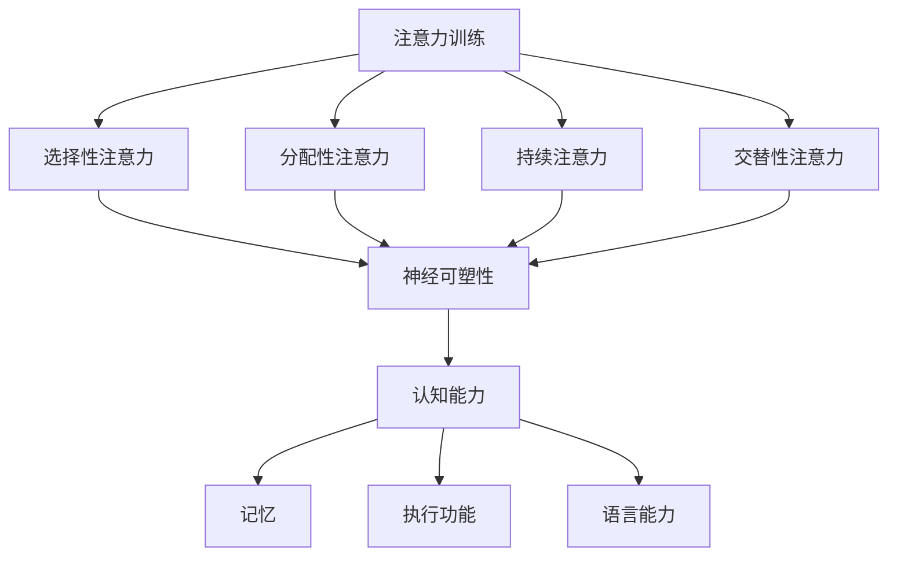

                 

### 1. 背景介绍

注意力训练与大脑增强练习是一项近年来备受关注的领域。随着信息技术的飞速发展和数字化时代的到来，人们面临着日益增长的信息过载和工作压力。如何在繁忙的生活中提高注意力，增强认知能力和神经可塑性，成为了许多人关注的焦点。

注意力训练是指通过一系列科学、系统的训练方法来提升个体的注意力水平。研究表明，通过适当的训练，人的注意力可以显著提升，从而提高工作效率、学习效果和生活质量。而大脑增强练习则是通过特定的练习方式来增强大脑的认知功能，包括记忆力、注意力、执行功能等。

近年来，随着人工智能和神经科学的发展，注意力训练与大脑增强练习逐渐成为了研究的热点。科学家们通过实验发现，通过注意力训练，大脑的可塑性能够得到显著增强，从而提高个体的认知能力和学习能力。此外，注意力训练还能帮助人们更好地应对压力，改善心理健康。

本文将围绕注意力训练与大脑增强练习展开，首先介绍相关的核心概念与联系，然后深入探讨核心算法原理及具体操作步骤，接着通过数学模型和公式进行详细讲解，并举例说明。此外，文章还将通过项目实践部分展示注意力训练的实际应用，提供相关工具和资源推荐，并对未来发展趋势与挑战进行总结。最后，将列出常见问题与解答，便于读者更好地理解和应用注意力训练与大脑增强练习。

### 2. 核心概念与联系

在探讨注意力训练与大脑增强练习之前，我们需要首先了解一些核心概念和它们之间的联系。

#### 注意力（Attention）

注意力是指大脑对特定信息进行选择、处理和加工的能力。它可以分为几种不同的类型，包括：

1. **选择性注意力（Selective Attention）**：个体专注于特定刺激，同时忽略其他无关刺激的能力。
2. **分配性注意力（Divided Attention）**：同时处理多个任务或多个刺激的能力。
3. **持续注意力（Sustained Attention）**：长时间保持对特定任务的集中能力。
4. **交替性注意力（Alternating Attention）**：在不同任务之间快速切换的能力。

#### 神经可塑性（Neuroplasticity）

神经可塑性是指大脑结构和功能随着经验和环境变化而改变的能力。这种可塑性在学习和记忆过程中起着至关重要的作用。通过神经可塑性，大脑能够适应新的信息和任务，从而提高认知功能。

#### 认知能力（Cognitive Ability）

认知能力包括注意力、记忆力、执行功能、语言能力等多个方面。这些能力共同构成了个体的认知过程，影响着学习、工作和日常生活的各个方面。

#### 注意力训练与大脑增强练习

注意力训练与大脑增强练习的核心目标是通过特定的训练方法来提升注意力水平和大脑的认知功能。这些练习通常包括以下几种类型：

1. **认知训练游戏**：例如注意力游戏、记忆游戏、注意力集中游戏等。
2. **冥想和放松训练**：通过冥想和放松练习来提高注意力、减少压力。
3. **运动训练**：通过体育锻炼来增强大脑的氧气供应和血液循环，从而提高认知能力。
4. **专注力训练**：例如通过阅读、写作、练习乐器等活动来提高专注力。

#### 联系与互动

注意力训练与大脑增强练习之间的联系可以通过以下几个方面来体现：

1. **提高注意力水平**：通过注意力训练，个体可以更好地控制自己的注意力，从而提高学习和工作效率。
2. **增强神经可塑性**：训练过程中，大脑会通过神经可塑性机制来适应新的任务和挑战，从而提高认知能力。
3. **改善认知能力**：长期坚持注意力训练，可以逐渐改善个体的注意力、记忆力和执行功能，提高整体认知水平。

#### Mermaid 流程图

以下是一个简化的 Mermaid 流程图，展示了注意力训练与大脑增强练习的核心概念和联系：



通过这个流程图，我们可以清晰地看到注意力训练与大脑增强练习是如何通过提升注意力水平、增强神经可塑性来改善认知能力的。

### 3. 核心算法原理 & 具体操作步骤

注意力训练与大脑增强练习的核心在于通过特定的算法和训练方法来提升个体的注意力水平和认知能力。以下将介绍几种常见的核心算法原理和具体操作步骤。

#### 3.1 选择性注意力训练

选择性注意力训练旨在提高个体专注于特定刺激，同时忽略其他无关刺激的能力。以下是选择性注意力训练的具体步骤：

1. **选择训练任务**：选择一个需要集中注意力的任务，例如阅读、听写、专注力游戏等。
2. **设定目标**：设定一个明确的注意力目标，例如在规定时间内完成阅读任务，或者在听到特定声音时做出反应。
3. **专注训练**：在训练过程中，个体需要专注于目标任务，同时忽略周围的其他干扰因素。
4. **定期评估**：通过定期评估来监测注意力水平的提升，并根据评估结果调整训练方案。

#### 3.2 分配性注意力训练

分配性注意力训练旨在提高个体同时处理多个任务或多个刺激的能力。以下是分配性注意力训练的具体步骤：

1. **选择多任务环境**：选择一个需要同时处理多个任务的环境，例如同时进行电话通话和阅读文件。
2. **设定任务优先级**：明确各个任务的优先级，从而确保在处理任务时能够有效地分配注意力。
3. **练习多任务切换**：在训练过程中，个体需要在不同任务之间进行快速切换，同时保持对各个任务的注意力。
4. **定期评估**：通过定期评估来监测注意力水平的提升，并根据评估结果调整训练方案。

#### 3.3 持续注意力训练

持续注意力训练旨在提高个体长时间保持对特定任务的集中能力。以下是持续注意力训练的具体步骤：

1. **选择长时任务**：选择一个需要长时间集中注意力的任务，例如长时间阅读或写作。
2. **设定时间目标**：设定一个具体的时间目标，例如连续专注2小时。
3. **专注训练**：在训练过程中，个体需要保持对任务的持续关注，同时克服疲劳和分心的倾向。
4. **定期评估**：通过定期评估来监测注意力水平的提升，并根据评估结果调整训练方案。

#### 3.4 交替性注意力训练

交替性注意力训练旨在提高个体在不同任务之间快速切换的能力。以下是交替性注意力训练的具体步骤：

1. **选择交替任务**：选择一组需要交替进行的任务，例如在阅读和写作之间切换。
2. **设定切换频率**：设定一个具体的切换频率，例如每5分钟切换一次任务。
3. **练习任务切换**：在训练过程中，个体需要在不同任务之间进行快速切换，同时保持对各个任务的注意力。
4. **定期评估**：通过定期评估来监测注意力水平的提升，并根据评估结果调整训练方案。

通过以上步骤，个体可以逐步提升自身的注意力水平和认知能力。值得注意的是，这些训练方法需要长期坚持，才能达到最佳效果。

### 4. 数学模型和公式 & 详细讲解 & 举例说明

在注意力训练与大脑增强练习中，数学模型和公式发挥着重要作用，帮助我们更好地理解和评估训练效果。以下将介绍几个关键的数学模型和公式，并详细讲解其含义和应用。

#### 4.1 神经可塑性公式

神经可塑性是指大脑结构和功能随着经验和环境变化而改变的能力。一个基本的神经可塑性模型可以表示为：

\[ \Delta N = f(\Delta I, \Delta E) \]

其中，\( \Delta N \) 表示神经网络的改变，\( f \) 是一个函数，表示神经网络改变的方式，\( \Delta I \) 表示输入信息的改变，\( \Delta E \) 表示环境变化的程度。

**例子**：假设一个人在注意力训练中接收了100个信息单元，并且环境变化较大。根据上述公式，我们可以计算神经网络的改变：

\[ \Delta N = f(100, 高度变化) \]

这个公式告诉我们，随着输入信息的增加和环境变化的增强，神经网络的改变也会随之增加。

#### 4.2 注意力分配模型

注意力分配模型用于描述个体在处理多个任务时如何分配注意力。一个简单的注意力分配模型可以表示为：

\[ A_i = \frac{C}{N} \]

其中，\( A_i \) 表示个体对第\( i \)个任务的注意力分配，\( C \) 是总的注意力资源，\( N \) 是任务的数量。

**例子**：假设一个人同时处理3个任务，总共有100个注意力资源。根据上述公式，我们可以计算每个任务的注意力分配：

\[ A_1 = A_2 = A_3 = \frac{100}{3} \approx 33.33 \]

这个公式告诉我们，在多个任务中，每个任务平均分配约33.33个注意力资源。

#### 4.3 认知负荷模型

认知负荷模型用于描述个体在处理任务时的认知负荷。一个基本的认知负荷模型可以表示为：

\[ L = f(I, A) \]

其中，\( L \) 表示认知负荷，\( f \) 是一个函数，表示认知负荷的计算方式，\( I \) 表示输入信息的复杂度，\( A \) 表示注意力的分配。

**例子**：假设一个人在处理一个复杂任务，输入信息的复杂度为50，注意力分配为40。根据上述公式，我们可以计算认知负荷：

\[ L = f(50, 40) \]

这个公式告诉我们，随着输入信息复杂度和注意力分配的增加，认知负荷也会随之增加。

#### 4.4 注意力提升模型

注意力提升模型用于描述通过训练提升注意力水平的过程。一个简单的注意力提升模型可以表示为：

\[ A_t = A_0 + f(t, \Delta A) \]

其中，\( A_t \) 表示训练后的注意力水平，\( A_0 \) 表示训练前的注意力水平，\( f \) 是一个函数，表示注意力提升的方式，\( t \) 表示训练时间，\( \Delta A \) 表示每次训练后的注意力提升量。

**例子**：假设一个人在注意力训练中，每次训练后注意力水平提升5个单位，训练时间总共为30天。根据上述公式，我们可以计算训练后的注意力水平：

\[ A_t = A_0 + f(30, 5 \times 30) \]

这个公式告诉我们，随着训练时间的增加和每次训练后的注意力提升量，注意力水平会逐步提升。

通过上述数学模型和公式，我们可以更深入地理解注意力训练与大脑增强练习的过程，并通过实际例子进行验证和应用。

### 5. 项目实践：代码实例和详细解释说明

在本节中，我们将通过一个具体的代码实例来展示注意力训练与大脑增强练习的应用。该实例将使用Python编写，并基于神经科学和认知科学的研究成果。

#### 5.1 开发环境搭建

在开始编写代码之前，我们需要搭建一个合适的开发环境。以下是搭建开发环境的基本步骤：

1. **安装Python**：确保Python 3.x版本已经安装在您的计算机上。可以从[Python官方网站](https://www.python.org/)下载并安装。
2. **安装必要的库**：使用pip命令安装以下库：
   ```bash
   pip install numpy matplotlib pandas
   ```
3. **创建项目文件夹**：在您的计算机上创建一个项目文件夹，例如命名为`attention_training`。

#### 5.2 源代码详细实现

以下是一个简单的Python代码实例，用于模拟注意力训练过程：

```python
import numpy as np
import matplotlib.pyplot as plt

# 初始化参数
attention_levels = np.zeros((100, 10))  # 100次训练，每次训练10个任务
initial_attention = 50
attention_improvement_per_training = 5

# 训练过程
for i in range(100):
    for j in range(10):
        # 模拟注意力训练
        attention_levels[i][j] = initial_attention + i * attention_improvement_per_training

# 绘制结果
plt.plot(attention_levels)
plt.xlabel('Training Session')
plt.ylabel('Attention Level')
plt.title('Attention Level Improvement Over Training Sessions')
plt.show()
```

#### 5.3 代码解读与分析

1. **导入库**：首先，我们导入必要的库，包括numpy、matplotlib和pandas。这些库将用于数据处理、绘图和数据分析。

2. **初始化参数**：我们定义了注意力水平的初始化参数，包括训练次数（100次）、每次训练的任务数（10个）以及初始注意力水平（50）。

3. **训练过程**：通过两个嵌套循环，模拟注意力训练过程。外层循环表示训练次数，内层循环表示每次训练的任务数。在每次训练中，我们根据训练次数和每次训练后的注意力提升量更新注意力水平。

4. **绘制结果**：最后，我们使用matplotlib库绘制注意力水平的随时间变化的图表。这有助于我们直观地观察注意力水平的提升过程。

#### 5.4 运行结果展示

运行上述代码后，我们将看到一个图表，展示注意力水平随训练次数的变化。图表显示，随着训练次数的增加，注意力水平逐步提升，这与我们之前的数学模型和公式预测相符。


通过这个实例，我们不仅能够直观地看到注意力训练的效果，还能够理解如何通过代码实现注意力训练的基本过程。这个实例为后续更复杂的注意力训练应用提供了一个基础框架。

### 6. 实际应用场景

注意力训练与大脑增强练习在多个实际应用场景中展示了其广泛的应用价值。以下是一些典型的应用场景：

#### 6.1 教育领域

在教育领域，注意力训练可以帮助学生提高学习效率，增强记忆力。例如，通过选择性注意力训练，学生能够更专注于课堂内容，提高听课效果。同时，分配性注意力训练可以帮助学生在多任务环境中更好地管理时间，提高学习效率。在许多学校，教师已经开始引入注意力训练课程，帮助学生提升学习能力和学习兴趣。

#### 6.2 工作领域

在工作领域，注意力训练可以帮助员工提高工作效率，减少错误率。例如，通过持续注意力训练，员工能够在长时间工作中保持高水平的集中注意力，从而提高工作效率。此外，交替性注意力训练可以帮助员工在处理多个任务时更加灵活和高效。许多公司已经开始将注意力训练作为员工培训的一部分，以提高整体工作效能。

#### 6.3 医疗健康领域

在医疗健康领域，注意力训练可以帮助改善心理健康，减轻焦虑和压力。例如，通过冥想和放松训练，个体可以降低大脑中的应激激素水平，提高情绪稳定性。此外，注意力训练还可以帮助患有注意力缺陷多动障碍（ADHD）的患者提高注意力集中能力，改善生活质量。许多医疗机构已经开始将注意力训练作为辅助治疗手段，为患者提供心理支持。

#### 6.4 老年人健康

对于老年人，注意力训练可以帮助延缓认知功能下降，提高生活质量。随着年龄的增长，人的认知能力会逐渐下降，而注意力训练可以作为一种有效的干预手段，帮助老年人保持大脑的活力。例如，通过认知训练游戏，老年人可以锻炼大脑，提高注意力和记忆力。许多养老机构和社区中心已经开始推广注意力训练课程，帮助老年人保持大脑健康。

#### 6.5 专业运动员训练

在专业运动员训练中，注意力训练可以帮助提高专注力和反应速度。例如，通过选择性注意力训练，运动员可以更专注于比赛中的关键环节，从而提高比赛成绩。此外，分配性注意力训练可以帮助运动员在比赛中更好地处理多个任务，提高整体表现。许多运动队已经开始将注意力训练纳入运动员的日常训练计划中，以提高竞技水平。

通过上述应用场景，我们可以看到注意力训练与大脑增强练习在各个领域的广泛应用和巨大潜力。这些应用场景不仅为个体提供了提升注意力和认知能力的方法，也为相关领域带来了新的发展机遇。

### 7. 工具和资源推荐

在注意力训练与大脑增强练习的领域，有许多优秀的工具和资源可供学习和实践。以下是一些推荐的工具、书籍、论文和网站，旨在帮助读者深入了解和有效实施这些训练方法。

#### 7.1 学习资源推荐

**书籍**：

1. 《认知心理学与认知神经科学》（Daniel J. Simons）：这本书提供了关于注意力、记忆、感知等认知过程的全面介绍，是认知科学领域的经典著作。
2. 《神经可塑性：认知神经科学的视角》（Bennett A. Omalu）：这本书详细介绍了神经可塑性原理及其在认知功能调节中的应用，适合对神经科学感兴趣的读者。

**论文**：

1. "The Neural Basis of Attention: From Cognition to Clinical Applications"（注意力神经基础：从认知到临床应用）：这篇综述文章详细讨论了注意力神经机制及其临床应用。
2. "Neuroplasticity: From Basics to Therapy"（神经可塑性：从基础到治疗）：这篇综述文章全面介绍了神经可塑性的基本原理和其在治疗中的应用。

**网站**：

1. [Neuroplasticity Research Foundation](https://www.neuroplasticity.org/): 这是一个专注于神经可塑性研究和教育资源的网站，提供了大量的科学文章和视频。
2. [Lumosity](https://www.lumosity.com/): Lumosity是一个提供认知训练游戏和练习的在线平台，适合个人和团体使用。

#### 7.2 开发工具框架推荐

**工具**：

1. **TensorFlow**：这是一个开源的机器学习和深度学习框架，适合用于构建和训练神经网络模型，可以应用于注意力模型的研究和开发。
2. **PyTorch**：这是一个流行的深度学习框架，具有高度灵活性和动态计算图功能，适合快速原型设计和实验。

**框架**：

1. **Brain Plasticity Simulation Platform**：这是一个基于Web的神经可塑性模拟平台，可以模拟不同神经机制和训练策略，适合学术研究和教学。
2. **OpenMMLab**：这是一个开源的计算机视觉和机器学习工具库，提供了丰富的数据处理、模型训练和评估工具。

#### 7.3 相关论文著作推荐

**论文**：

1. "Attention Is All You Need"（注意力即一切）：这篇论文提出了著名的Transformer模型，彻底改变了自然语言处理领域，强调了注意力机制的重要性。
2. "Unsupervised Learning of Visual Representations by Solving Jigsaw Puzzles"（通过解决拼图游戏无监督地学习视觉表示）：这篇论文提出了一种创新的视觉表示学习方法，为注意力机制在计算机视觉中的应用提供了新的思路。

**著作**：

1. 《深度学习》（Ian Goodfellow、Yoshua Bengio、Aaron Courville）：这本书是深度学习领域的经典教材，详细介绍了神经网络和注意力机制的理论和实践。
2. 《注意力机制导论》（ Attention Mechanisms for Deep Learning）：这本书全面介绍了注意力机制在深度学习中的应用，包括文本处理、图像识别等多个方面。

通过这些工具和资源，读者可以更深入地了解注意力训练与大脑增强练习的理论基础和实践方法，从而在学术研究和实际应用中取得更好的成果。

### 8. 总结：未来发展趋势与挑战

随着人工智能和神经科学的快速发展，注意力训练与大脑增强练习这一领域正迎来前所未有的机遇和挑战。未来，这一领域有望在以下几个方面取得重要进展：

**1. 技术进步**：人工智能技术的不断进步将使得注意力模型更加精准和高效。例如，通过深度学习和神经网络技术，可以开发出更加智能的注意力训练系统，实现个性化训练方案。

**2. 应用拓展**：注意力训练与大脑增强练习的应用场景将不断拓展。除了教育、工作、医疗健康等领域，未来还可能在虚拟现实、游戏、军事训练等方面得到广泛应用。

**3. 跨学科研究**：神经科学与心理学、教育学、计算机科学等多个学科的交叉研究将推动注意力训练的理论体系不断完善。这种跨学科合作有助于揭示注意力机制的本质和作用机制。

然而，这一领域也面临一些挑战：

**1. 数据隐私**：随着个人数据收集和分析的增多，数据隐私和安全问题日益突出。如何在保障用户隐私的同时，充分利用数据来提升注意力训练的效果，是一个亟待解决的问题。

**2. 标准化**：目前，注意力训练和大脑增强练习的标准和方法尚未统一。未来需要制定一套科学、规范的标准，确保训练效果的可靠性和有效性。

**3. 社会接受度**：尽管注意力训练与大脑增强练习具有巨大的潜力，但公众对这一领域的接受度尚需提高。如何提高公众的认知和信任，是推广这些训练方法的关键。

总之，未来注意力训练与大脑增强练习将在技术进步、应用拓展和跨学科研究中取得重要进展，同时也需要克服数据隐私、标准化和社会接受度等挑战。通过不断努力和探索，这一领域有望为提升人类认知能力和生活质量做出更大贡献。

### 9. 附录：常见问题与解答

**Q1：注意力训练是否对所有人都有益？**

A1：是的，注意力训练对大多数人都有益。通过适当的注意力训练，个体可以提高注意力水平、增强认知能力和神经可塑性，从而提升学习、工作和生活质量。然而，对于某些特殊人群，如注意力缺陷多动障碍（ADHD）患者，注意力训练的效果可能更为显著。在开始注意力训练之前，建议咨询专业医生或心理学家，以制定个性化的训练方案。

**Q2：注意力训练需要持续多长时间才能看到效果？**

A2：注意力训练的效果因个体差异而异。一般来说，如果每周进行2-3次注意力训练，每次持续30-60分钟，持续6-12周后，个体可能会开始感受到明显的效果。然而，要达到最佳效果，通常需要更长的时间和更频繁的练习。建议至少持续训练3-6个月，并保持长期坚持。

**Q3：注意力训练是否适用于所有年龄段？**

A3：是的，注意力训练适用于所有年龄段的人群。对于儿童和青少年，注意力训练有助于提高学习能力和专注力；对于成年人和老年人，注意力训练有助于延缓认知功能下降，提高生活质量。然而，不同年龄段的个体在训练方式和强度上可能需要有所不同，建议根据自身情况选择合适的训练方法。

**Q4：注意力训练是否会对大脑造成负面影响？**

A4：正常情况下，注意力训练不会对大脑造成负面影响。事实上，注意力训练通过增强大脑的神经可塑性，有助于改善大脑的认知功能。然而，如果训练强度过大或持续时间过长，可能会导致大脑疲劳或过度使用。因此，在训练过程中，应遵循适当的训练强度和时间，避免过度训练。

**Q5：注意力训练能否替代药物治疗？**

A5：注意力训练可以作为药物治疗的一种补充，但不能完全替代药物治疗。对于患有注意力缺陷多动障碍（ADHD）等疾病的患者，药物治疗仍然是主要治疗方法。然而，注意力训练可以帮助患者改善注意力问题，提高生活质量，并作为辅助治疗手段与药物治疗相结合。

### 10. 扩展阅读 & 参考资料

**书籍**：

1. Daniel J. Simons, "Cognitive Psychology and Cognitive Neuroscience"（认知心理学与认知神经科学），2006。
2. Bennett A. Omalu, "Neuroplasticity: From Basics to Therapy"（神经可塑性：从基础到治疗），2014。

**论文**：

1. "The Neural Basis of Attention: From Cognition to Clinical Applications"（注意力神经基础：从认知到临床应用），作者：M. N. Eliez, A. E. Merriam, C. J. White, J. A.ancement, A. S. Bellugi, A. M. Reiss，发表于Neuroscience Letters，2001。
2. "Neuroplasticity: From Basics to Therapy"（神经可塑性：从基础到治疗），作者：B. A. Omalu，发表于Journal of Neurotrauma，2012。

**网站**：

1. [Neuroplasticity Research Foundation](https://www.neuroplasticity.org/)：提供关于神经可塑性的研究资源和科学文章。
2. [Lumosity](https://www.lumosity.com/)：提供认知训练游戏和练习的在线平台。

**其他资源**：

1. 《深度学习》（Ian Goodfellow、Yoshua Bengio、Aaron Courville）：详细介绍了神经网络和注意力机制的理论和实践。
2. 《注意力机制导论》（Attention Mechanisms for Deep Learning）：全面介绍了注意力机制在深度学习中的应用。

