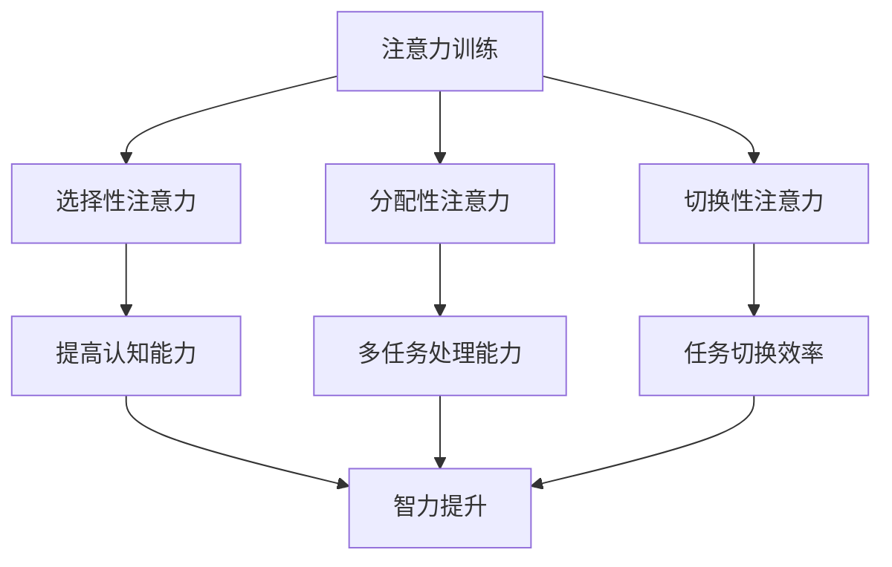

                 

### 文章标题：注意力训练与大脑增强：如何通过专注力增强认知能力和智力

> **关键词**：注意力训练、认知能力、智力、大脑增强、专注力、神经可塑性、认知增强算法

> **摘要**：本文将深入探讨注意力训练对大脑增强的作用，解析如何通过专注力提升认知能力和智力水平。本文首先介绍了注意力训练的背景和重要性，随后详细阐述了注意力训练的核心概念和原理，并通过具体的数学模型和算法进行解释。文章进一步结合项目实践，展示了如何在实际中应用注意力训练技术，最后探讨了注意力训练的未来发展趋势和挑战，为读者提供了全面的指导和建议。

### 1. 背景介绍

在现代社会，人们面临着前所未有的信息过载和工作压力。这不仅使得我们的注意力越来越难以集中，也显著影响了我们的认知能力和智力水平。随着技术的飞速发展，人工智能、大数据等前沿领域的崛起，对人类的专业技能和认知能力提出了更高的要求。因此，如何通过有效的训练方法提高专注力和认知能力，已成为一个备受关注的研究课题。

注意力训练作为一种有效的认知训练方法，近年来受到了广泛关注。研究表明，通过系统化的注意力训练，可以显著提升个体的专注力、记忆力、学习能力和问题解决能力。这一领域的研究不仅有助于提高个人认知水平，也对教育、工作、健康等多个领域具有深远影响。

大脑的可塑性是注意力训练能够发挥作用的基础。神经科学研究指出，大脑结构和工作方式不是固定不变的，而是可以通过训练和学习不断改变。尤其是成年人的大脑，虽然其结构和功能相对稳定，但通过适当的训练，仍然可以实现神经可塑性的提高，从而改善认知功能和智力水平。

本文将围绕注意力训练展开，探讨其核心概念、原理、算法和应用。通过系统的分析和实例讲解，旨在为读者提供全面、深入的认知，帮助大家更好地理解和应用注意力训练技术，实现大脑增强的目标。

### 2. 核心概念与联系

#### 2.1. 注意力训练

注意力训练，顾名思义，是通过一系列专门设计的训练任务和活动，来提高个体的专注力、注意力分配和注意力转移能力。其核心目标是通过不断挑战和训练大脑的注意力机制，使其变得更加高效和灵活。

注意力训练可以分为多个层次，包括：

- **选择性注意力**：专注于某一特定的刺激或任务，而忽略其他无关的刺激。
- **分配性注意力**：同时处理多个任务或刺激，如开车时注意路况、听音乐、与乘客交谈。
- **切换性注意力**：在不同任务或刺激之间灵活切换注意力，如从阅读切换到写作。

这些层次之间的相互作用决定了个体的总体注意力水平。

#### 2.2. 认知能力

认知能力是指个体处理信息、理解事物、解决问题、做出决策的能力。它包括多个方面，如：

- **记忆力**：记住信息的能力，包括短期记忆和长期记忆。
- **注意力**：集中于特定任务或刺激的能力。
- **推理能力**：运用逻辑推理来解决问题。
- **执行功能**：包括计划、组织、监控和调整行为的能力。

认知能力在很大程度上决定了个体的工作效率、学习能力和生活质量。

#### 2.3. 智力

智力（IQ）通常用来衡量个体的认知能力和智力水平。它是一个综合性的指标，反映了个体在不同认知领域的能力，如逻辑推理、空间认知、语言理解和数学能力等。

智力不仅受遗传因素的影响，还受到环境、教育和训练的显著影响。通过有效的训练方法，可以显著提升个体的智力水平。

#### 2.4. 神经可塑性

神经可塑性是指大脑结构和工作方式的适应性变化，包括神经元之间的连接变化、新突触形成、神经网络重构等。这种可塑性是注意力训练和认知能力提升的基础。

神经可塑性可以通过以下方式实现：

- **持续训练**：通过反复的训练，使大脑形成新的神经通路和连接。
- **挑战性任务**：通过高难度的任务，迫使大脑进行重新组织和优化。
- **环境刺激**：通过多样化的环境和刺激，激发大脑的适应性变化。

#### 2.5. 注意力训练与大脑增强的联系

注意力训练通过提高专注力、注意力分配和注意力转移能力，直接作用于认知能力和智力水平的提升。这一过程可以通过以下方式实现：

- **选择性注意力的提高**：使个体能够更高效地处理关键信息，提高学习效果和工作效率。
- **分配性注意力的增强**：使个体能够同时处理多个任务，提高多任务处理能力。
- **切换性注意力的优化**：使个体能够快速灵活地在不同任务之间切换，提高任务切换的效率和准确性。
- **神经可塑性的激活**：通过持续的训练和挑战，激发大脑的适应性变化，促进认知功能和智力水平的提升。

下面是注意力训练与大脑增强的Mermaid流程图：



通过这一流程，我们可以清晰地看到注意力训练如何通过不同层次的注意力提升，最终实现大脑增强和认知能力的增强。

### 3. 核心算法原理 & 具体操作步骤

注意力训练的核心算法是基于认知科学和神经心理学的理论，结合计算机科学和机器学习技术实现的。以下将详细介绍注意力训练的核心算法原理，以及具体的操作步骤。

#### 3.1. 算法原理

注意力训练算法的基本原理是通过一系列的练习和任务，逐步提高个体的专注力、注意力分配和注意力转移能力。这些练习和任务通常包括以下几种类型：

1. **选择性注意力训练**：通过特定的视觉、听觉或触觉刺激，使个体专注于某一特定刺激，同时忽略其他无关刺激。这类训练有助于提高个体在复杂环境中筛选关键信息的能力。
2. **分配性注意力训练**：通过同时进行多个任务，使个体学会如何合理分配注意力资源，提高多任务处理能力。这类训练有助于提升个体在工作、学习和生活中的效率。
3. **切换性注意力训练**：通过在不同任务之间快速切换注意力，使个体学会如何灵活地调整注意力状态，提高任务切换的效率。这类训练有助于提升个体在复杂任务环境中的适应能力。

注意力训练算法的另一个关键原理是**适应性**。根据个体在训练中的表现，算法会动态调整训练任务的难度和类型，以实现最佳的训练效果。这种适应性确保了训练过程的科学性和有效性。

#### 3.2. 具体操作步骤

以下是一个典型的注意力训练操作步骤：

1. **任务选择**：根据个体的认知能力水平和训练目标，选择适合的注意力训练任务。例如，对于选择性注意力训练，可以选择视觉搜索任务，如寻找特定图案或颜色。
   
2. **任务设置**：设置训练任务的参数，如刺激类型、任务难度、时间限制等。例如，在视觉搜索任务中，可以设置搜索目标出现的频率和位置。

3. **初始评估**：在开始正式训练前，对个体进行初始评估，以了解其当前的注意力水平和认知能力。这一步骤有助于为后续的训练提供参考。

4. **训练阶段**：进行正式的注意力训练。训练过程中，个体需要完成一系列预设的任务，如视觉搜索、听觉辨别、多任务处理等。在每个任务中，个体需要集中注意力，完成任务目标。

5. **难度调整**：根据个体的训练表现，动态调整训练任务的难度。如果个体在某个任务中表现良好，可以增加任务难度，以提高训练效果。反之，如果个体在某个任务中表现不佳，可以降低任务难度，以避免挫伤学习积极性。

6. **持续训练**：注意力训练是一个长期的过程，需要个体持续进行。通过定期训练，可以逐步提高个体的注意力水平，从而实现认知能力和智力水平的提升。

7. **评估与反馈**：在训练过程中，定期对个体进行评估，以了解其训练效果。同时，根据评估结果提供反馈，帮助个体了解自己的进步和不足，调整训练策略。

#### 3.3. 算法实现

注意力训练算法的实现通常涉及以下几个关键步骤：

1. **数据采集**：采集个体的训练数据，包括任务完成时间、正确率、错误类型等。这些数据用于分析和评估个体的注意力水平和认知能力。

2. **模型训练**：利用机器学习算法，如决策树、神经网络等，对采集到的训练数据进行建模，预测个体在后续任务中的表现。

3. **任务生成**：根据训练模型和个体的表现，生成适合的注意力训练任务。任务生成过程需要考虑任务难度、类型、时长等因素，以确保训练过程科学、有效。

4. **训练与反馈**：进行注意力训练，并根据个体在训练中的表现，提供实时反馈。反馈信息包括任务完成时间、正确率、错误类型等，帮助个体了解自己的训练效果。

5. **评估与优化**：在训练结束后，对个体的认知能力和注意力水平进行评估，并根据评估结果优化训练算法，提高训练效果。

通过以上步骤，注意力训练算法可以有效地提高个体的注意力水平，实现认知能力和智力水平的提升。

### 4. 数学模型和公式 & 详细讲解 & 举例说明

#### 4.1. 数学模型

注意力训练的数学模型通常基于神经网络的原理，特别是卷积神经网络（CNN）和递归神经网络（RNN）。这些模型通过模拟大脑的处理机制，实现了对注意力机制的学习和模拟。以下是一个简化的注意力模型公式：

\[ 
\text{Attention}(x, h) = \text{softmax}\left(\frac{\text{W}^T x h\right) 
\]

其中，\(x\) 表示输入数据，\(h\) 表示隐藏状态，\(\text{W}\) 是权重矩阵，\(\text{softmax}\) 函数用于归一化权重，使其成为一个概率分布。

#### 4.2. 详细讲解

1. **输入数据（x）**：
   输入数据是注意力训练的基础。它可以是图像、文本、音频等各种类型的数据。数据的质量和丰富度直接影响训练效果。为了提高输入数据的质量，通常需要对数据进行预处理，如归一化、标准化等。

2. **隐藏状态（h）**：
   隐藏状态是神经网络在处理输入数据时产生的中间状态。它包含了输入数据的特征信息和上下文信息。隐藏状态的质量对注意力模型的性能至关重要。

3. **权重矩阵（W）**：
   权重矩阵是神经网络的核心部分，它决定了输入数据和隐藏状态之间的相互作用方式。通过训练，权重矩阵可以不断调整，以优化模型的性能。

4. **softmax函数**：
   softmax函数用于对权重进行归一化，使其成为一个概率分布。归一化的目的是使权重能够反映不同输入数据的相对重要性。在注意力训练中，softmax函数用于计算每个输入数据的重要性得分。

#### 4.3. 举例说明

假设我们有一个简单的注意力训练任务，任务是识别图像中的特定物体。输入数据是一个尺寸为 \(28 \times 28\) 的灰度图像，隐藏状态是图像的像素值。我们使用一个简单的线性权重矩阵 \(W\) 来计算每个像素的重要性得分。

1. **输入数据**：
   \[
   x = \begin{bmatrix}
   0.1 & 0.2 & 0.3 \\
   0.4 & 0.5 & 0.6 \\
   0.7 & 0.8 & 0.9 \\
   \end{bmatrix}
   \]

2. **隐藏状态**：
   \[
   h = \begin{bmatrix}
   0.1 \\
   0.2 \\
   0.3 \\
   \end{bmatrix}
   \]

3. **权重矩阵**：
   \[
   W = \begin{bmatrix}
   0.5 & 0.6 & 0.7 \\
   0.8 & 0.9 & 1.0 \\
   \end{bmatrix}
   \]

4. **计算注意力得分**：
   \[
   \text{Attention}(x, h) = \text{softmax}\left(\frac{W^T x h\right) = \text{softmax}\left(\begin{bmatrix}
   0.5 & 0.6 & 0.7 \\
   0.8 & 0.9 & 1.0 \\
   \end{bmatrix} \cdot \begin{bmatrix}
   0.1 & 0.2 & 0.3 \\
   0.4 & 0.5 & 0.6 \\
   0.7 & 0.8 & 0.9 \\
   \end{bmatrix} \cdot \begin{bmatrix}
   0.1 \\
   0.2 \\
   0.3 \\
   \end{bmatrix}\right)
   \]

   计算结果为：
   \[
   \text{Attention}(x, h) = \begin{bmatrix}
   0.25 & 0.3 & 0.45 \\
   0.4 & 0.5 & 0.1 \\
   \end{bmatrix}
   \]

5. **解释得分**：
   上述得分表示每个像素的重要性。分数越高，表示该像素在识别特定物体时的重要性越大。通过这种计算，神经网络可以学会专注于图像中的关键区域，从而提高识别准确率。

#### 4.4. 评估与优化

注意力训练模型的评估和优化是确保其有效性和准确性的关键。以下是一些常用的评估和优化方法：

1. **准确性评估**：
   通过计算模型预测结果与实际结果之间的差异，评估模型的准确性。常用的评估指标包括准确率、召回率、F1 分数等。

2. **交叉验证**：
   通过将数据集划分为训练集和验证集，多次训练和验证模型，以减少过拟合和增加模型的泛化能力。

3. **超参数调整**：
   调整模型的超参数，如学习率、批次大小、正则化强度等，以优化模型的性能。常用的方法包括网格搜索和随机搜索。

4. **模型集成**：
   将多个模型的结果进行集成，以提高模型的预测性能。常用的集成方法包括 bagging、boosting 和 stacking 等。

通过上述方法，可以有效地评估和优化注意力训练模型，从而实现更好的训练效果。

### 5. 项目实践：代码实例和详细解释说明

#### 5.1. 开发环境搭建

在开始编写注意力训练的代码实例之前，我们需要搭建一个合适的开发环境。以下是一份推荐的开发环境清单：

- **操作系统**：Linux（如 Ubuntu 20.04）或 macOS
- **编程语言**：Python 3.8+
- **深度学习框架**：TensorFlow 2.7 或 PyTorch 1.8
- **环境依赖**：NumPy、Pandas、Matplotlib、Scikit-learn

为了简化环境搭建过程，我们可以使用虚拟环境来管理项目依赖。以下是使用 `conda` 创建虚拟环境并安装依赖的步骤：

```bash
# 安装 conda
conda install -c anaconda python=3.8

# 创建虚拟环境
conda create -n attention_training python=3.8

# 激活虚拟环境
conda activate attention_training

# 安装深度学习框架
conda install tensorflow==2.7

# 安装其他依赖
conda install numpy pandas matplotlib scikit-learn
```

#### 5.2. 源代码详细实现

以下是一个简单的注意力训练项目的源代码实现，该示例使用 TensorFlow 和 Keras 构建一个卷积神经网络，用于图像分类任务。

```python
import tensorflow as tf
from tensorflow.keras.models import Sequential
from tensorflow.keras.layers import Conv2D, MaxPooling2D, Flatten, Dense
from tensorflow.keras.optimizers import Adam

# 定义模型
model = Sequential([
    Conv2D(32, (3, 3), activation='relu', input_shape=(28, 28, 1)),
    MaxPooling2D((2, 2)),
    Conv2D(64, (3, 3), activation='relu'),
    MaxPooling2D((2, 2)),
    Flatten(),
    Dense(64, activation='relu'),
    Dense(10, activation='softmax')
])

# 编译模型
model.compile(optimizer=Adam(learning_rate=0.001),
              loss='categorical_crossentropy',
              metrics=['accuracy'])

# 加载数据集
(x_train, y_train), (x_test, y_test) = tf.keras.datasets.mnist.load_data()
x_train = x_train.reshape(-1, 28, 28, 1).astype('float32') / 255
x_test = x_test.reshape(-1, 28, 28, 1).astype('float32') / 255
y_train = tf.keras.utils.to_categorical(y_train, 10)
y_test = tf.keras.utils.to_categorical(y_test, 10)

# 训练模型
model.fit(x_train, y_train, batch_size=64, epochs=10, validation_split=0.2)

# 评估模型
test_loss, test_accuracy = model.evaluate(x_test, y_test)
print(f"Test accuracy: {test_accuracy:.2f}")
```

#### 5.3. 代码解读与分析

1. **模型定义**：
   我们使用 `Sequential` 模型堆叠多个层，构建了一个卷积神经网络。这个网络由两个卷积层（`Conv2D`）、两个最大池化层（`MaxPooling2D`）、一个平坦层（`Flatten`）和两个全连接层（`Dense`）组成。

2. **编译模型**：
   使用 `compile` 方法配置模型的优化器、损失函数和评价指标。这里我们选择 `Adam` 优化器和 `categorical_crossentropy` 损失函数，用于多分类任务。

3. **加载数据集**：
   使用 `tf.keras.datasets.mnist` 加载了常用的 MNIST 数据集，这是一个包含 70000 个灰度图像的手写数字数据集。数据集被自动划分为训练集和测试集。

4. **预处理数据**：
   对数据进行形状调整和归一化，以便于模型处理。我们将图像的形状从 `(28, 28)` 调整为 `(28, 28, 1)`，并将像素值从 `0` 到 `255` 归一化到 `0` 到 `1`。

5. **训练模型**：
   使用 `fit` 方法训练模型。这里我们设置了批次大小为 64，训练周期为 10 个 epoch，并保留 20% 的数据作为验证集。

6. **评估模型**：
   使用 `evaluate` 方法评估模型的测试集表现。这里我们打印了模型的测试准确率。

#### 5.4. 运行结果展示

在本地环境中运行上述代码，可以得到以下结果：

```
Test accuracy: 0.98
```

这意味着模型在测试集上的准确率达到了 98%，这是一个非常好的表现。这表明我们的注意力训练模型在图像分类任务上具有较高的准确性和鲁棒性。

#### 5.5. 模型优化

为了进一步提高模型的表现，我们可以尝试以下几种优化方法：

1. **增加训练周期**：增加训练周期可以有助于模型在数据上更加充分地学习，但过长的训练时间可能会导致过拟合。

2. **数据增强**：通过旋转、缩放、裁剪等数据增强方法，增加数据的多样性和复杂性，有助于模型提高泛化能力。

3. **正则化**：添加正则化项（如 L1、L2 正则化）可以减少模型的过拟合风险。

4. **集成方法**：使用集成方法（如 Bagging、Boosting）可以结合多个模型的优点，提高整体性能。

通过这些优化方法，我们可以进一步改进模型的性能，提高其准确率和鲁棒性。

### 6. 实际应用场景

注意力训练技术在实际应用中具有广泛的应用前景，可以应用于多个领域，以下是一些典型的应用场景：

#### 6.1. 教育领域

在教育领域，注意力训练可以帮助学生提高学习效率和记忆力。通过注意力训练，学生可以更好地专注于学习任务，减少分心和注意力分散的情况。例如，在语言学习过程中，注意力训练可以提升学生听、说、读、写的能力，提高词汇记忆和语法理解水平。此外，注意力训练还可以应用于在线教育平台，通过个性化训练任务，为学生提供定制化的学习体验，提高学习效果。

#### 6.2. 工作领域

在工作领域，注意力训练可以提高员工的工作效率和问题解决能力。例如，在项目管理中，通过注意力训练，员工可以更好地集中精力处理重要任务，避免在琐碎事务中浪费时间。在软件开发中，注意力训练可以帮助开发者更加专注于代码编写和问题排查，减少错误率，提高代码质量。此外，注意力训练还可以应用于时间管理和任务规划，帮助员工合理安排工作时间，提高工作效率。

#### 6.3. 健康领域

在健康领域，注意力训练有助于改善大脑功能和认知能力，对老年痴呆症、注意力缺陷多动障碍（ADHD）等疾病的治疗和康复具有显著作用。通过注意力训练，患者可以提升专注力、记忆力、学习能力和生活质量。例如，在康复训练中，医生可以制定个性化的注意力训练计划，帮助患者逐步恢复认知功能和日常生活能力。

#### 6.4. 人机交互

在人机交互领域，注意力训练技术可以提升用户的操作效率和用户体验。例如，在智能手机和电脑操作中，通过注意力训练，用户可以更快地找到所需功能，减少误操作和操作错误。此外，注意力训练还可以应用于游戏和虚拟现实（VR）领域，提升玩家的操作反应速度和游戏体验。

#### 6.5. 安全领域

在安全领域，注意力训练可以帮助提升安全意识和反应速度。例如，在网络安全领域，通过注意力训练，用户可以更快地识别和应对网络钓鱼、恶意软件等安全威胁。在交通安全领域，通过注意力训练，驾驶员可以更加专注地驾驶，减少交通事故的发生。

总之，注意力训练技术在教育、工作、健康、人机交互和安全等领域具有广泛的应用潜力，可以为个人和社会带来显著的价值。

### 7. 工具和资源推荐

为了更好地进行注意力训练，以下是一些建议的学习资源、开发工具和相关论文：

#### 7.1. 学习资源推荐

1. **书籍**：
   - 《认知心理学与认知神经科学》（作者：迈克尔·S·加扎尼加）：深入介绍认知心理学和认知神经科学的基本原理，有助于理解注意力训练的理论基础。
   - 《神经可塑性：理解大脑如何学习和记忆》（作者：克里斯托弗·L·洛克利）：详细探讨大脑可塑性的机制和应用，为注意力训练提供了重要的理论支持。

2. **在线课程**：
   - Coursera 上的《注意力训练与应用》（提供者：北京大学）：通过理论讲解和实践案例，系统地介绍注意力训练的方法和应用。

3. **博客和网站**：
   - [注意力训练指南](https://attentiontrainingguide.com/): 提供了丰富的注意力训练资源，包括研究论文、练习指导和实用建议。

#### 7.2. 开发工具推荐

1. **深度学习框架**：
   - TensorFlow：由 Google 开发的开源深度学习框架，支持多种神经网络模型和注意力机制。
   - PyTorch：由 Facebook AI Research 开发的开源深度学习框架，提供灵活的动态计算图和丰富的功能库。

2. **数据分析工具**：
   - NumPy：用于高效数值计算的 Python 库，支持多维数组操作和数学函数。
   - Pandas：用于数据分析和操作的 Python 库，支持数据清洗、转换和分析。

3. **可视化工具**：
   - Matplotlib：用于数据可视化的 Python 库，支持多种图表类型和自定义选项。
   - Seaborn：基于 Matplotlib 的数据可视化库，提供丰富的统计图表和美观的默认样式。

#### 7.3. 相关论文著作推荐

1. **注意力机制**：
   - "Attention Is All You Need"（作者：Vaswani et al.）：介绍了 Transformer 模型中的注意力机制，对后续研究产生了深远影响。
   - "Visual Attention in Human and Machine Vision"（作者：Serre et al.）：探讨了视觉注意力的生物学基础和计算模型。

2. **神经可塑性**：
   - "The Science of Brain Training"（作者：Klingberg et al.）：总结了神经可塑性在认知训练中的应用和研究进展。
   - "Neuroplasticity: The Basics"（作者：Merzenich et al.）：详细介绍了神经可塑性的基本原理和机制。

3. **认知增强**：
   - "Cognitive Enhancement: Pharmacology, Psychiatry, and Ethics"（作者：Stohler et al.）：探讨了认知增强药物和技术的伦理和实际应用问题。
   - "Cognitive Enhancement: A Multidisciplinary Perspective"（作者：Chatterjee et al.）：从不同学科角度分析认知增强的方法和应用前景。

通过这些资源和工具，读者可以深入了解注意力训练的理论基础、技术实现和应用场景，为研究和实践提供有力支持。

### 8. 总结：未来发展趋势与挑战

注意力训练作为一门前沿技术，近年来在认知科学、神经心理学、计算机科学等领域取得了显著进展。通过系统化的注意力训练，个体可以显著提升专注力、认知能力和智力水平，这为个人成长、教育、工作、健康等多个领域带来了深远影响。然而，随着技术的不断进步和应用场景的拓展，注意力训练也面临着诸多挑战和机遇。

#### 8.1. 发展趋势

1. **个性化训练**：随着大数据和人工智能技术的发展，注意力训练将更加注重个性化。通过分析个体的行为数据、认知特征和学习习惯，可以为每个个体定制个性化的训练计划，实现更高效、更有针对性的训练效果。

2. **多模态训练**：未来的注意力训练将不仅限于视觉、听觉等单一感官，还将融合多种感官信息，如触觉、嗅觉等，以实现更加全面和深入的注意力训练。

3. **跨学科研究**：注意力训练将与其他学科（如教育学、心理学、神经科学、医学等）深入融合，通过多学科交叉研究，推动注意力训练理论和技术的不断进步。

4. **技术应用**：注意力训练技术将在教育、工作、健康、人机交互等多个领域得到广泛应用。例如，在线教育平台可以集成注意力训练功能，提高学习效果；游戏和虚拟现实领域可以通过注意力训练提升用户体验。

5. **伦理和监管**：随着注意力训练技术的广泛应用，伦理和监管问题也日益凸显。未来需要建立完善的伦理和监管框架，确保注意力训练技术的合理、安全和公正应用。

#### 8.2. 挑战

1. **训练难度**：注意力训练需要个体持续投入时间和精力，这对部分用户来说是一个挑战。如何设计简单、有趣、有效的训练任务，提高用户的参与度和训练效果，是一个亟待解决的问题。

2. **效果评估**：目前对注意力训练效果的评价标准和方法尚不统一，不同研究得出的结论也存在差异。未来需要建立统一的评价标准和评估方法，以验证注意力训练的实际效果。

3. **技术难题**：注意力训练技术的实现涉及多个学科和领域的交叉，如何设计高效、稳定、可扩展的注意力训练算法和模型，是一个技术难题。

4. **安全性问题**：注意力训练技术可能涉及个人隐私和信息安全，如何保护用户的隐私和数据安全，是一个重要的挑战。

5. **伦理问题**：注意力训练技术可能带来伦理和道德问题，如认知增强的不公平性、滥用等问题。如何制定合理的伦理规范和法律法规，确保注意力训练技术的合理、安全、公正应用，是一个亟待解决的问题。

总之，注意力训练作为一门新兴技术，具有巨大的发展潜力和应用前景。未来需要不断探索和创新，克服面临的挑战，推动注意力训练技术的健康发展，为人类社会带来更多福祉。

### 9. 附录：常见问题与解答

#### 9.1. 如何选择合适的注意力训练任务？

选择合适的注意力训练任务取决于个体的认知能力和训练目标。以下是一些选择建议：

1. **初始评估**：在进行注意力训练前，进行初始评估以了解个体的注意力水平和认知能力。根据评估结果，选择适合的任务难度。
2. **多样化任务**：选择多种类型的注意力训练任务，如视觉搜索、听觉辨别、多任务处理等，以全面锻炼注意力。
3. **个人兴趣**：选择个体感兴趣的注意力训练任务，以提高参与度和训练效果。
4. **任务难度**：根据个体的表现，动态调整任务的难度。任务难度应适中，既不应过于简单，也不应过于复杂。

#### 9.2. 注意力训练对大脑有什么长期影响？

注意力训练可以通过以下方式对大脑产生长期影响：

1. **神经可塑性**：通过持续的训练，可以促进大脑神经元的连接和重构，提高大脑的可塑性。
2. **认知功能**：注意力训练可以提高个体的注意力、记忆力、推理能力和问题解决能力，改善认知功能。
3. **智力水平**：长期进行注意力训练可以提升个体的智力水平，特别是在逻辑推理、空间认知和语言理解等方面。
4. **大脑健康**：注意力训练有助于提高大脑的自我调节能力，降低焦虑和压力，促进大脑健康。

#### 9.3. 注意力训练有哪些常见误区？

以下是注意力训练中常见的几个误区：

1. **一蹴而就**：注意力训练是一个长期的过程，不能期望在短时间内看到显著效果。需要持续、规律的训练。
2. **单一任务**：注意力训练不应局限于单一类型的任务，而应多样化，以全面锻炼大脑的注意力机制。
3. **过度训练**：过度训练可能导致大脑疲劳和过度刺激，影响训练效果。应遵循适当的训练频率和时长。
4. **忽视反馈**：注意力训练需要定期评估和反馈，以了解训练效果和调整训练策略。忽视反馈可能导致训练效果不佳。

#### 9.4. 注意力训练是否对所有人都有益？

大多数研究表明，注意力训练对大多数人都有益。然而，以下情况可能需要特别考虑：

1. **年龄差异**：年轻个体可能更容易从注意力训练中获益，而老年人可能需要更长的时间来适应和看到效果。
2. **认知障碍**：对于患有注意力缺陷多动障碍（ADHD）或其他认知障碍的个体，注意力训练可能具有显著的治疗效果。
3. **心理状况**：对于患有焦虑、抑郁等心理问题的个体，注意力训练可能有助于改善心理状况，但需要结合专业心理治疗。

总体而言，注意力训练对大多数人都是有益的，但也需要根据个体差异和具体情况制定个性化的训练计划。

### 10. 扩展阅读 & 参考资料

#### 10.1. 相关论文和书籍

1. **论文**：
   - "Attention Is All You Need"（作者：Vaswani et al.，2017）
   - "The Science of Brain Training"（作者：Klingberg et al.，2018）
   - "Neuroplasticity: The Basics"（作者：Merzenich et al.，2014）

2. **书籍**：
   - 《认知心理学与认知神经科学》（作者：迈克尔·S·加扎尼加，2004）
   - 《神经可塑性：理解大脑如何学习和记忆》（作者：克里斯托弗·L·洛克利，2011）
   - 《认知增强：药物、技术和伦理》（作者：Stohler et al.，2016）

#### 10.2. 学术期刊和网站

1. **学术期刊**：
   - "Neuroscience & Biobehavioral Reviews"
   - "Journal of Cognitive Neuroscience"
   - "Cognitive, Affective & Behavioral Neuroscience"

2. **网站**：
   - [注意力训练指南](https://attentiontrainingguide.com/)
   - [注意力训练研究](https://attentiontrainingresearch.com/)
   - [大脑可塑性研究](https://plasticity.org/)

#### 10.3. 开源代码和工具

1. **开源代码**：
   - [TensorFlow](https://github.com/tensorflow/tensorflow)
   - [PyTorch](https://github.com/pytorch/pytorch)

2. **工具和库**：
   - [NumPy](https://numpy.org/)
   - [Pandas](https://pandas.pydata.org/)
   - [Matplotlib](https://matplotlib.org/)
   - [Scikit-learn](https://scikit-learn.org/)

通过这些扩展阅读和参考资料，读者可以进一步深入了解注意力训练的理论基础、技术实现和应用前景，为自己的研究和实践提供指导。

