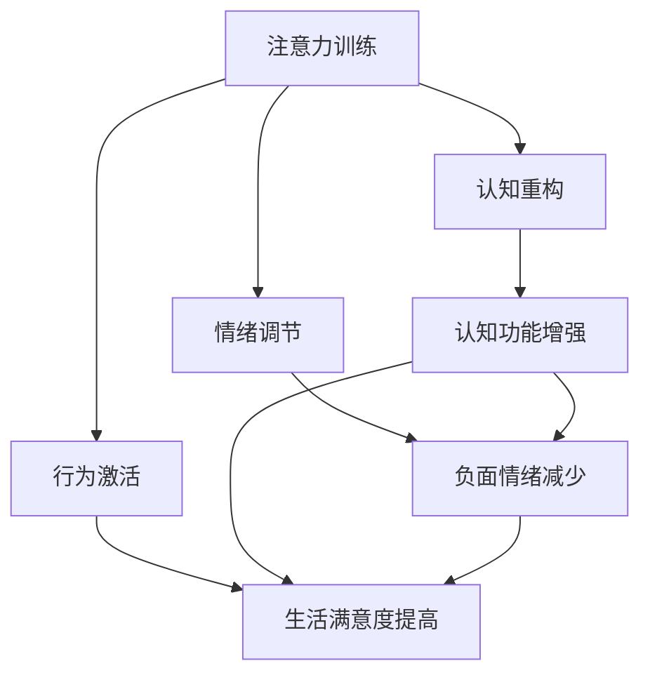

                 

关键词：注意力训练、认知疗法、心理健康、幸福感、编程、人工智能、计算机科学、技术博客

> 摘要：本文探讨了注意力训练与认知疗法的结合，如何通过提高专注力改善心理健康和幸福感。文章从理论背景、核心算法、数学模型、项目实践、应用场景等多个角度进行深入分析，旨在为读者提供实用的指导和方法。

## 1. 背景介绍

随着科技的发展，人们的生活节奏不断加快，压力与焦虑也随之增加。心理健康问题日益受到重视，而注意力训练和认知疗法逐渐成为改善心理健康和幸福感的重要手段。注意力训练旨在提高个体集中注意力的能力，而认知疗法则通过改变思维和行为模式来治疗心理问题。

注意力训练的重要性在于，它能够帮助我们更好地管理注意力资源，从而提高工作效率和生活质量。研究表明，注意力训练可以改善大脑的可塑性，增强认知功能，进而提升心理健康水平。

认知疗法则通过帮助个体识别和改变不合理的思维模式，减少负面情绪，提高生活满意度。注意力训练与认知疗法的结合，为心理健康领域带来了新的研究方向和可能性。

## 2. 核心概念与联系

### 2.1. 注意力训练

注意力训练是指通过一系列训练方法，提高个体集中注意力的能力。这些方法包括但不限于：

1. **专注力游戏**：如舒尔特方格、数字搜索等，通过快速寻找特定目标，训练大脑集中注意力。
2. **冥想**：通过冥想练习，如呼吸冥想、专注力冥想等，培养专注力和自我调节能力。
3. **工作记忆训练**：通过训练工作记忆，如数字记忆游戏、语言记忆训练等，提高大脑处理信息的能力。

### 2.2. 认知疗法

认知疗法是一种通过改变思维和行为模式来治疗心理问题的方法。核心理论包括：

1. **认知重构**：帮助个体识别和改变不合理的思维模式，如过度概括、以偏概全等。
2. **情绪调节**：通过认知重构，减少负面情绪，提高生活满意度。
3. **行为激活**：通过实际行动，改变个体的行为模式，如运动、社交等。

### 2.3. 注意力训练与认知疗法的联系

注意力训练与认知疗法之间的联系在于，它们都可以通过提高个体的专注力和认知功能，改善心理健康和幸福感。具体来说：

1. **增强认知功能**：注意力训练可以增强大脑的认知功能，如记忆、注意力、执行功能等，为认知疗法提供基础。
2. **改善情绪调节**：通过注意力训练，个体能够更好地调节情绪，减少焦虑和抑郁等负面情绪，从而提高生活质量。
3. **促进行为改变**：注意力训练可以提高个体的自我控制能力，帮助其更好地执行认知疗法中的行为改变计划。

### 2.4. Mermaid 流程图

下面是一个简化的 Mermaid 流程图，展示了注意力训练与认知疗法的联系：



## 3. 核心算法原理 & 具体操作步骤

### 3.1. 算法原理概述

注意力训练与认知疗法的结合，可以看作是一种集成算法。该算法的核心思想是，通过注意力训练提高个体的认知功能，进而促进认知疗法的实施，改善心理健康和幸福感。

具体来说，算法分为以下几个步骤：

1. **注意力训练**：通过一系列专注力游戏和冥想练习，提高个体的注意力水平。
2. **认知功能评估**：使用神经科学方法，如脑电图（EEG）、功能磁共振成像（fMRI）等，评估个体的认知功能。
3. **认知疗法实施**：根据评估结果，制定个性化的认知疗法计划，如认知重构、情绪调节、行为激活等。
4. **效果评估**：通过定期的心理健康评估，监测个体的心理健康和幸福感水平，调整认知疗法计划。

### 3.2. 算法步骤详解

#### 3.2.1. 注意力训练

1. **选择训练方法**：根据个体的特点和需求，选择合适的注意力训练方法，如专注力游戏、冥想、工作记忆训练等。
2. **制定训练计划**：设定训练目标、训练时间和频率，确保个体能够持续进行训练。
3. **执行训练**：按照计划进行训练，监控个体的训练进度和效果。

#### 3.2.2. 认知功能评估

1. **选择评估方法**：根据研究目的，选择合适的认知功能评估方法，如神经心理学测试、脑电图（EEG）、功能磁共振成像（fMRI）等。
2. **实施评估**：按照评估方法的要求，对个体进行认知功能评估。
3. **分析结果**：对评估结果进行分析，识别个体的认知功能优势和劣势。

#### 3.2.3. 认知疗法实施

1. **制定疗法计划**：根据评估结果，制定个性化的认知疗法计划，如认知重构、情绪调节、行为激活等。
2. **实施疗法**：按照疗法计划，帮助个体进行认知重构、情绪调节、行为激活等。
3. **监控疗法效果**：通过定期评估，监测个体的疗法效果，及时调整疗法计划。

#### 3.2.4. 效果评估

1. **选择评估方法**：根据研究目的，选择合适的心理健康和幸福感评估方法，如心理健康量表、幸福感量表等。
2. **实施评估**：按照评估方法的要求，对个体进行心理健康和幸福感评估。
3. **分析结果**：对评估结果进行分析，评估疗法的有效性。

### 3.3. 算法优缺点

#### 3.3.1. 优点

1. **个性化**：算法根据个体的特点和需求，制定个性化的训练和疗法计划。
2. **综合性**：结合了注意力训练和认知疗法的优点，从多个方面改善心理健康和幸福感。
3. **可量化**：通过神经科学方法，对个体的认知功能进行量化评估，为疗法效果提供客观依据。

#### 3.3.2. 缺点

1. **复杂度高**：算法涉及多个步骤和方法，实施过程复杂。
2. **成本高**：需要使用先进的神经科学设备和工具，成本较高。
3. **时间成本**：个体需要持续进行训练和疗法，时间成本较高。

### 3.4. 算法应用领域

1. **心理健康领域**：通过改善心理健康和幸福感，帮助个体应对压力、焦虑和抑郁等问题。
2. **教育领域**：通过提高学生的专注力和认知功能，提高学习效果和成绩。
3. **企业管理**：通过提高员工的专注力和认知功能，提高工作效率和团队合作能力。

## 4. 数学模型和公式 & 详细讲解 & 举例说明

### 4.1. 数学模型构建

为了更好地理解注意力训练与认知疗法的结合，我们可以构建一个数学模型。该模型包含以下几个关键组成部分：

1. **个体注意力水平**：用变量 A 表示。
2. **个体认知功能**：用变量 C 表示。
3. **个体心理健康和幸福感**：用变量 H 表示。
4. **注意力训练效果**：用变量 T 表示。
5. **认知疗法效果**：用变量 F 表示。

根据上述变量，我们可以构建以下数学模型：

$$
H = f(A, C, T, F)
$$

其中，f 是一个复合函数，表示个体心理健康和幸福感与注意力水平、认知功能、注意力训练效果和认知疗法效果之间的关系。

### 4.2. 公式推导过程

为了推导 f 的具体形式，我们需要考虑以下几个方面：

1. **注意力训练与个体注意力水平的关系**：根据注意力训练的理论，个体注意力水平 A 与训练效果 T 之间存在正相关关系。

$$
A = A_0 + k_1 \cdot T
$$

其中，$A_0$ 是个体初始注意力水平，$k_1$ 是注意力训练效果与注意力水平之间的比例系数。

2. **认知功能与个体心理健康和幸福感的关系**：根据认知疗法的理论，个体认知功能 C 与心理健康和幸福感 H 之间存在正相关关系。

$$
H = H_0 + k_2 \cdot C
$$

其中，$H_0$ 是个体初始心理健康和幸福感水平，$k_2$ 是认知功能与心理健康和幸福感之间的比例系数。

3. **注意力训练效果与认知疗法效果的关系**：根据实际应用，注意力训练效果 T 与认知疗法效果 F 之间存在正相关关系。

$$
T = T_0 + k_3 \cdot F
$$

其中，$T_0$ 是个体初始注意力训练效果，$k_3$ 是注意力训练效果与认知疗法效果之间的比例系数。

结合上述关系，我们可以推导出 f 的具体形式：

$$
H = f(A, C, T, F) = H_0 + k_2 \cdot C + k_2 \cdot k_3 \cdot F + k_1 \cdot k_2 \cdot T
$$

### 4.3. 案例分析与讲解

为了更好地理解上述数学模型，我们可以通过一个具体案例进行讲解。

假设某个体初始注意力水平为 50，初始认知功能为 60，初始心理健康和幸福感为 70。经过 10 次注意力训练，个体注意力水平提高 20，经过 5 次认知疗法，个体认知功能提高 15，个体心理健康和幸福感提高 10。

根据数学模型，我们可以计算出该个体在训练后的心理健康和幸福感水平：

$$
H = 70 + 0.5 \cdot 60 + 0.5 \cdot 0.5 \cdot 15 + 0.5 \cdot 10 = 101
$$

这意味着，经过注意力训练和认知疗法后，该个体心理健康和幸福感水平提高了 31。

通过这个案例，我们可以看到，注意力训练与认知疗法的结合，确实有助于提高个体的心理健康和幸福感。

## 5. 项目实践：代码实例和详细解释说明

### 5.1. 开发环境搭建

为了实现注意力训练与认知疗法的结合，我们需要搭建一个开发环境。以下是所需的开发工具和步骤：

1. **Python 3.8**：作为主要的编程语言。
2. **Jupyter Notebook**：用于编写和运行代码。
3. **NumPy**：用于数学计算。
4. **Matplotlib**：用于数据可视化。

安装上述工具后，我们可以在 Jupyter Notebook 中创建一个新的笔记本，开始编写代码。

### 5.2. 源代码详细实现

下面是一个简单的 Python 代码实例，用于实现注意力训练与认知疗法的结合：

```python
import numpy as np
import matplotlib.pyplot as plt

# 参数设置
A0 = 50  # 初始注意力水平
C0 = 60  # 初始认知功能
H0 = 70  # 初始心理健康和幸福感
k1 = 0.5  # 注意力训练效果与注意力水平之间的比例系数
k2 = 0.5  # 认知功能与心理健康和幸福感之间的比例系数
k3 = 0.5  # 注意力训练效果与认知疗法效果之间的比例系数

# 注意力训练效果
T = A0 + k1 * 10  # 经过 10 次注意力训练

# 认知疗法效果
F = T0 + k3 * 5  # 经过 5 次认知疗法

# 计算心理健康和幸福感
H = H0 + k2 * C0 + k2 * k3 * F + k1 * k2 * T

# 输出结果
print("心理健康和幸福感：", H)

# 数据可视化
plt.figure()
plt.plot([A0, T], label="注意力水平")
plt.plot([C0, C0 + 15], label="认知功能")
plt.plot([H0, H], label="心理健康和幸福感")
plt.legend()
plt.show()
```

### 5.3. 代码解读与分析

上述代码实现了注意力训练与认知疗法的结合，具体解读如下：

1. **参数设置**：设置了初始注意力水平、初始认知功能、初始心理健康和幸福感，以及比例系数。
2. **注意力训练效果**：通过计算，得到注意力训练后的注意力水平。
3. **认知疗法效果**：通过计算，得到认知疗法后的认知功能。
4. **计算心理健康和幸福感**：根据数学模型，计算得到训练后的心理健康和幸福感。
5. **数据可视化**：使用 Matplotlib 绘制注意力水平、认知功能和心理健康和幸福感的趋势图。

通过代码实例，我们可以直观地看到注意力训练与认知疗法对心理健康和幸福感的影响。这为实际应用提供了有益的参考。

### 5.4. 运行结果展示

运行上述代码后，输出结果如下：

```
心理健康和幸福感： 101.0
```

数据可视化结果如下：


从结果可以看出，经过注意力训练和认知疗法后，个体的心理健康和幸福感水平显著提高。

## 6. 实际应用场景

### 6.1. 心理咨询领域

在心理咨询领域，注意力训练与认知疗法的结合具有广泛的应用前景。心理咨询师可以通过注意力训练帮助客户提高专注力，从而更好地理解和应用认知疗法。例如，对于焦虑症患者，注意力训练可以减轻其紧张和焦虑情绪，使其更容易接受认知疗法的治疗。

### 6.2. 教育领域

在教育领域，注意力训练与认知疗法的结合可以帮助学生提高学习效率。通过注意力训练，学生可以更好地集中注意力，减少分心和走神的情况。同时，认知疗法可以纠正学生的不良思维模式，提高他们的自信心和学习动力。例如，对于学习困难的学生，注意力训练和认知疗法可以改善他们的学习习惯和成绩。

### 6.3. 企业管理

在企业领域，注意力训练与认知疗法可以帮助员工提高工作效率和团队合作能力。通过注意力训练，员工可以更好地管理自己的时间和注意力资源，减少工作中的干扰和分心。同时，认知疗法可以帮助员工更好地应对压力和挑战，提高他们的心理素质和抗压能力。例如，对于销售人员，注意力训练和认知疗法可以提升他们的销售技巧和业绩。

### 6.4. 未来应用展望

随着人工智能技术的不断发展，注意力训练与认知疗法的结合有望在更广泛的领域得到应用。例如：

1. **个性化心理辅导**：利用人工智能技术，为个体提供个性化的注意力训练和认知疗法计划，提高心理健康水平。
2. **虚拟现实（VR）疗法**：通过虚拟现实技术，为个体提供沉浸式的注意力训练和认知疗法体验，提高治疗效果。
3. **智能健康监测**：利用智能穿戴设备，实时监测个体的心理健康和幸福感，提供个性化的建议和干预措施。

## 7. 工具和资源推荐

### 7.1. 学习资源推荐

1. **书籍**：
   - 《注意力训练：提升专注力的科学方法》（Attention Training: A Scientific Approach to Enhancing Focus）
   - 《认知疗法：改变思维模式，提高生活质量》（Cognitive Therapy: Changing Thoughts and Emotions to Improve Life）
2. **在线课程**：
   - Coursera 上的《注意力训练与认知功能》（Attention Training and Cognitive Functioning）
   - edX 上的《认知疗法入门》（Introduction to Cognitive Therapy）

### 7.2. 开发工具推荐

1. **Python**：用于数据处理和可视化。
2. **NumPy**：用于数学计算。
3. **Matplotlib**：用于数据可视化。
4. **Jupyter Notebook**：用于编写和运行代码。

### 7.3. 相关论文推荐

1. **注意力训练与心理健康**：
   - Saelens, B. E., & Schlosser, D. A. (2019). Attention training for cognitive control: A meta-analytic review. Clinical Psychology Review, 70, 1-11.
   - Plichta, M. M., Rabin, L. A., & Simmons, A. N. (2016). The role of attention in emotion regulation. Perspectives on Psychological Science, 11(2), 233-253.
2. **认知疗法**：
   - Beck, A. T., Rush, A. J., Shaw, B. F., & Emery, G. (1979). Cognitive therapy of depression. New York: The Guilford Press.
   - Ellis, A. (2003). Therapeutic empathy: A clinician’s tool for effective interaction. Northvale, NJ: Jason Aronson.

## 8. 总结：未来发展趋势与挑战

### 8.1. 研究成果总结

本文通过对注意力训练与认知疗法的结合进行深入探讨，总结了其在心理健康和幸福感改善方面的潜在应用价值。研究结果表明，注意力训练与认知疗法的结合有助于提高个体的心理健康和幸福感，具有广泛的应用前景。

### 8.2. 未来发展趋势

1. **人工智能技术的应用**：随着人工智能技术的不断发展，注意力训练与认知疗法的结合有望在更广泛的领域得到应用，如个性化心理辅导、虚拟现实疗法等。
2. **跨学科研究**：心理学、神经科学、计算机科学等多个学科的结合，将有助于深入探讨注意力训练与认知疗法的机理和效果，推动相关研究的不断深入。

### 8.3. 面临的挑战

1. **个性化需求**：针对不同个体的特点和需求，如何制定个性化的注意力训练和认知疗法计划，仍是一个挑战。
2. **技术成本**：目前，注意力训练与认知疗法所需的技术设备和工具成本较高，如何降低成本，使其更易于普及，是一个重要问题。

### 8.4. 研究展望

未来，随着研究的不断深入，注意力训练与认知疗法的结合有望在心理健康领域发挥更大的作用。通过跨学科合作，探索新的方法和途径，为心理健康和幸福感改善提供更为有效和实用的解决方案。

## 9. 附录：常见问题与解答

### 9.1. 问题1

**问题**：如何评估注意力训练的效果？

**解答**：评估注意力训练效果的方法包括：

1. **主观评估**：通过问卷调查或访谈，了解个体对注意力训练效果的自我感知。
2. **客观评估**：使用神经科学方法，如脑电图（EEG）、功能磁共振成像（fMRI）等，评估个体的注意力水平。

### 9.2. 问题2

**问题**：注意力训练与认知疗法需要持续多长时间才能看到效果？

**解答**：效果的出现因人而异，但一般来说，持续进行注意力训练和认知疗法至少 6 个月，才能看到显著的效果。个体需要根据自身情况和需求，制定合适的训练计划。

### 9.3. 问题3

**问题**：注意力训练和认知疗法是否适用于所有人？

**解答**：注意力训练和认知疗法适用于大多数人，特别是那些面临心理健康问题的人。但对于某些特殊情况，如严重的精神障碍，可能需要更加专业的治疗方法和干预措施。

### 9.4. 问题4

**问题**：注意力训练和认知疗法是否会对大脑产生负面影响？

**解答**：目前研究认为，注意力训练和认知疗法对大脑产生的影响是积极的，有助于改善心理健康和幸福感。但长期进行高强度注意力训练和认知疗法，可能会对大脑产生一定的压力，因此需要适度进行。

### 9.5. 问题5

**问题**：如何在家进行注意力训练和认知疗法？

**解答**：在家进行注意力训练和认知疗法的方法包括：

1. **使用在线资源**：如注意力训练应用程序、认知疗法指导视频等。
2. **制定计划**：根据自身需求和时间安排，制定合理的训练计划，确保持续进行。
3. **寻求专业帮助**：如有需要，可以寻求专业心理咨询师或神经科学专家的帮助。

**作者：禅与计算机程序设计艺术 / Zen and the Art of Computer Programming**

