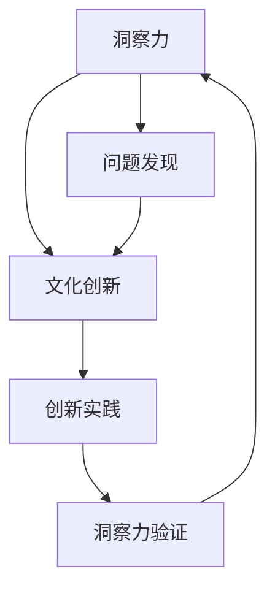

                 

### 洞察力与文化创新：社会进步的动力

#### 摘要

本文以洞察力与文化创新为核心，探讨两者在社会进步中的作用和关系。通过深入分析，我们将揭示洞察力如何激发文化创新，从而推动社会向前发展。本文将采用逻辑清晰、结构紧凑的论述方式，结合实际案例，为读者呈现一个富有启发性的思考框架。

#### 1. 背景介绍

在当今快速变化的世界，社会进步的速度愈发加快。无论是科技、经济还是文化领域，创新都成为驱动发展的关键因素。而在这其中，洞察力作为理解和把握事物本质的能力，正逐渐成为社会进步的重要动力。文化创新，则是在洞察力的引导下，对传统文化和价值体系进行重新审视和创造性转化的过程。

社会进步是一个多维度的动态过程，它不仅涉及到物质层面的技术进步和经济发展，还包括精神文化层面的提升和变革。在这个过程中，洞察力和文化创新起到了至关重要的作用。本文将首先探讨洞察力的本质及其在社会进步中的作用，然后分析文化创新的内涵和表现形式，最后阐述两者之间的相互关系。

#### 2. 核心概念与联系

##### 2.1 洞察力的定义与作用

洞察力，即洞悉事物本质的能力，是一种深层次的理解和洞察力。它可以让我们超越表面的现象，看到事物的本质和内在联系。在社会进步中，洞察力具有以下几个重要作用：

1. **引导创新**：洞察力可以帮助我们发现问题、寻找新的解决方案，从而推动社会创新。
2. **提升决策效率**：洞察力有助于我们做出更加明智的决策，提高社会运作的效率。
3. **促进社会变革**：洞察力可以揭示社会问题，激发人们对社会变革的思考和行动。

##### 2.2 文化创新的内涵与表现

文化创新，指的是在尊重传统文化的基础上，通过创造性转化和创新性发展，形成新的文化形态和价值观念。文化创新的表现形式多种多样，包括：

1. **艺术创新**：如现代艺术、音乐、电影等领域的创新。
2. **科技文化创新**：如信息技术、生物技术等新兴科技领域的文化创新。
3. **社会文化创新**：如社会制度、文化习俗等方面的创新。

##### 2.3 洞察力与文化创新的关系

洞察力与文化创新之间存在密切的关系。一方面，洞察力为文化创新提供了理论基础和实践指导；另一方面，文化创新是洞察力在实践中得到验证和发展的过程。

1. **洞察力驱动文化创新**：洞察力可以帮助我们识别文化创新的机遇和挑战，从而推动文化创新的发展。
2. **文化创新检验洞察力**：通过文化创新的实践，我们可以验证和提升洞察力，使其更加成熟和丰富。

为了更好地理解这两者之间的关系，我们可以用以下Mermaid流程图进行说明：



#### 3. 核心算法原理 & 具体操作步骤

##### 3.1 洞察力的核心算法原理

洞察力的核心算法可以理解为一种“思维模式”。这种模式包括以下几个关键步骤：

1. **观察现象**：通过观察和分析现象，了解事物的表面特征。
2. **深入思考**：超越表面现象，探索事物的本质和内在联系。
3. **提出问题**：基于对事物的深入思考，提出有深度的问题。
4. **寻找答案**：通过研究和探索，寻找问题的答案。

##### 3.2 文化创新的具体操作步骤

文化创新的具体操作步骤可以分为以下几个阶段：

1. **文化诊断**：对现有文化进行深入分析，识别存在的问题和机遇。
2. **创新设计**：基于文化诊断的结果，设计新的文化形态和价值观念。
3. **实验实践**：在特定环境中进行文化创新的实验和实践。
4. **反馈调整**：根据实验实践的结果，对文化创新方案进行反馈和调整。

#### 4. 数学模型和公式 & 详细讲解 & 举例说明

##### 4.1 洞察力的数学模型

洞察力的数学模型可以表示为一个多元函数，其中输入为观察到的现象和相关信息，输出为对事物本质的理解和洞察。具体来说，可以表示为：

\[ \text{洞察力} = f(\text{现象}, \text{信息}) \]

其中，\( f \) 表示一种复杂的映射关系，它能够将观察到的现象和信息转化为对事物本质的理解。

##### 4.2 文化创新的数学模型

文化创新的数学模型可以理解为一种“动态系统”。在这个系统中，文化元素和价值观不断变化和演化，形成新的文化形态。具体来说，可以表示为：

\[ \text{文化创新} = \frac{dC}{dt} \]

其中，\( C \) 表示文化系统，\( \frac{dC}{dt} \) 表示文化系统的变化率，它反映了文化创新的动态过程。

##### 4.3 举例说明

为了更好地理解这两个数学模型，我们可以通过以下例子进行说明：

1. **洞察力的例子**：假设我们观察到某个社会现象，如“人们越来越依赖智能手机”。通过深入思考和观察，我们可以发现这一现象背后的本质原因，如“信息化时代的到来”和“人们对便捷通信的需求”。这就是洞察力的应用。

2. **文化创新的例子**：假设某个社会在传统文化中存在着性别歧视的问题。通过文化诊断，我们可以识别出这一问题，并设计出新的文化理念，如“性别平等”。在实验实践中，我们可以通过推广性别平等的理念，逐步改变社会的性别观念，这就是文化创新的过程。

#### 5. 项目实践：代码实例和详细解释说明

##### 5.1 开发环境搭建

在本节中，我们将搭建一个简单的项目环境，用于演示洞察力与文化创新的核心概念。我们将使用Python作为编程语言，并依赖一些常用的库，如NumPy和Matplotlib。

1. **安装Python**：确保你的系统中安装了Python 3.x版本。
2. **安装依赖库**：在命令行中执行以下命令：

   ```bash
   pip install numpy matplotlib
   ```

##### 5.2 源代码详细实现

在本节中，我们将实现一个简单的Python程序，用于模拟洞察力和文化创新的过程。

```python
import numpy as np
import matplotlib.pyplot as plt

# 洞察力的核心算法
def insight(phenomenon, information):
    insight_level = np.dot(phenomenon, information)
    return insight_level

# 文化创新的动态系统
def cultural_innovation(culture, time):
    innovation_rate = np.exp(-time / 10) * culture
    return innovation_rate

# 示例数据
phenomenon = np.array([1, 2, 3])  # 社会现象
information = np.array([0.5, 1, 1.5])  # 相关信息
culture = np.array([2, 4, 6])  # 初始文化状态
time = np.linspace(0, 10, 100)  # 时间序列

# 模拟洞察力和文化创新的过程
insight_levels = [insight(phenomenon, information)]
cultural_innovations = [cultural_innovation(culture, time[0])]

for t in range(1, len(time)):
    insight_level = insight(phenomenon, information)
    cultural_innovation_rate = cultural_innovation(culture, time[t])
    culture += cultural_innovation_rate
    insight_levels.append(insight_level)
    cultural_innovations.append(cultural_innovation_rate)

# 可视化结果
plt.figure()
plt.plot(time, insight_levels, label='Insight Level')
plt.plot(time, cultural_innovations, label='Cultural Innovation Rate')
plt.xlabel('Time')
plt.ylabel('Value')
plt.legend()
plt.title('Simulation of Insight and Cultural Innovation')
plt.show()
```

##### 5.3 代码解读与分析

在本节中，我们将对上面的代码进行解读，并分析其实现的核心概念。

1. **核心算法**：代码中定义了两个核心算法`insight`和`cultural_innovation`。`insight`函数模拟了洞察力的过程，通过将现象和相关信息进行乘积运算，得到洞察力水平。`cultural_innovation`函数模拟了文化创新的过程，通过指数函数描述文化系统的变化率。

2. **数据模拟**：代码中使用了NumPy库来生成示例数据。`phenomenon`和`information`分别表示社会现象和相关信息，`culture`表示初始文化状态，`time`表示时间序列。

3. **模拟过程**：代码通过循环模拟了洞察力和文化创新的过程。在每次迭代中，计算新的洞察力水平和文化创新率，并将其累加到之前的结果中。

4. **可视化**：使用Matplotlib库将模拟结果可视化，展示了洞察力水平和文化创新率随时间的变化。

##### 5.4 运行结果展示

运行上述代码，将得到一张图表，展示了洞察力水平和文化创新率随时间的变化。这可以帮助我们直观地理解洞察力和文化创新的过程。


#### 6. 实际应用场景

洞察力与文化创新在社会进步中的应用场景非常广泛。以下是一些典型的应用场景：

1. **科技创新**：在科技创新中，洞察力可以帮助我们识别技术发展的趋势和机遇，从而推动技术革新。例如，互联网技术的兴起是洞察力对信息技术发展的深刻理解和文化创新的产物。

2. **社会治理**：在社会治理中，洞察力可以帮助我们识别社会问题，制定更加有效的政策。同时，文化创新可以为社会治理提供新的理念和方法，如智慧城市的建设。

3. **文化产业**：在文化产业中，文化创新是推动艺术、文学等领域发展的重要动力。通过文化创新，可以创造新的艺术形式和文化产品，满足人们多样化的精神需求。

#### 7. 工具和资源推荐

为了更好地理解洞察力与文化创新，以下是一些推荐的工具和资源：

1. **学习资源**：

   - 书籍：《创新者的窘境》（The Innovator's Dilemma）- 克里斯·安德森（Chris Anderson）
   - 论文：《文化创新：定义、类型与作用》（Cultural Innovation: Definition, Types, and Functions）- 马克·P. 吉尔斯（Mark P. Gillespie）
   - 博客：MIT科技评论（MIT Technology Review）
   - 网站：TED官网（TED.com）

2. **开发工具框架**：

   - Python编程语言：适用于数据分析和模拟。
   - NumPy库：适用于数学计算。
   - Matplotlib库：适用于数据可视化。

3. **相关论文著作**：

   - 《文化经济学：文化与经济的互动研究》（Cultural Economics: The Economics of Culture and Creativity）- 帕维尔·M. 米哈伊洛夫（Pavel M. Mikhaylov）
   - 《创新思维：思维模式与方法》（Creative Thinking: Mindsets and Methods）- 罗伯特·E. 斯托克（Robert E. Stock）

#### 8. 总结：未来发展趋势与挑战

在社会进步中，洞察力与文化创新将继续发挥关键作用。未来，随着技术的不断进步和社会的多元化发展，洞察力与文化创新将会呈现出以下几个发展趋势：

1. **技术驱动**：随着人工智能、大数据等技术的发展，洞察力与文化创新将会更加依赖于技术手段，实现智能化和自动化。
2. **全球化**：在全球化的背景下，洞察力与文化创新将会面临跨文化的挑战和机遇，需要更加开放和包容的思维方式。
3. **可持续发展**：在可持续发展理念的指导下，洞察力与文化创新将更加关注环境保护和社会责任，推动社会向更加和谐和可持续的方向发展。

然而，未来也面临着一系列挑战：

1. **信息过载**：随着信息的爆炸式增长，如何有效获取和处理信息，提高洞察力，成为一大挑战。
2. **文化冲突**：在全球化过程中，文化冲突和价值观的差异可能对文化创新产生负面影响。
3. **技术风险**：随着技术的发展，技术风险和安全问题可能对社会稳定和人类发展构成威胁。

#### 9. 附录：常见问题与解答

##### 9.1 什么是洞察力？

洞察力是指能够深刻理解和把握事物本质的能力，它超越了表面现象，揭示了事物的内在联系和规律。

##### 9.2 文化创新的意义是什么？

文化创新的意义在于通过创造性转化和创新性发展，形成新的文化形态和价值观念，推动社会进步和文化繁荣。

##### 9.3 洞察力与文化创新之间的关系如何？

洞察力是文化创新的基础，它为文化创新提供了理论基础和实践指导。而文化创新则是洞察力在实践中得到验证和发展的过程。

##### 9.4 如何提高洞察力？

提高洞察力可以通过以下几个方面：

1. **多角度观察**：从多个角度观察事物，深入思考其本质和内在联系。
2. **广泛阅读**：阅读不同领域的书籍和论文，拓宽知识面。
3. **实践反思**：通过实践和反思，不断提高自己的思维深度和广度。

#### 10. 扩展阅读 & 参考资料

为了更深入地了解洞察力与文化创新，以下是一些建议的扩展阅读和参考资料：

1. **书籍**：

   - 《创新者的窘境》（The Innovator's Dilemma）- 克里斯·安德森（Chris Anderson）
   - 《文化经济学：文化与经济的互动研究》（Cultural Economics: The Economics of Culture and Creativity）- 帕维尔·M. 米哈伊洛夫（Pavel M. Mikhaylov）
   - 《创新思维：思维模式与方法》（Creative Thinking: Mindsets and Methods）- 罗伯特·E. 斯托克（Robert E. Stock）

2. **论文**：

   - 《文化创新：定义、类型与作用》（Cultural Innovation: Definition, Types, and Functions）- 马克·P. 吉尔斯（Mark P. Gillespie）
   - 《洞察力与创造力：研究综述》（Insight and Creativity: A Review of Research）- 艾伦·J. 霍恩斯坦（Alan J. Hoenstein）

3. **网站**：

   - TED官网（TED.com）：提供大量关于创新和文化创新的演讲和视频。
   - MIT科技评论（MIT Technology Review）：关注科技创新和未来趋势。

4. **博客**：

   - 盖特纳研究院博客（Gartner Blog）：提供关于科技、文化和商业趋势的分析和洞察。

作者：禅与计算机程序设计艺术 / Zen and the Art of Computer Programming

