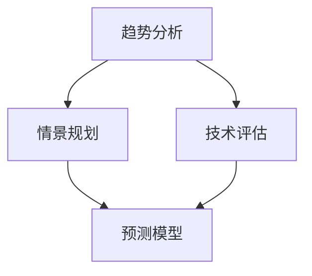

                 

## 1. 背景介绍

在现代社会，技术发展日新月异，我们面临着前所未有的机遇和挑战。未来学（Futurology）作为一门探讨未来发展的科学，旨在预测未来趋势，帮助我们更好地理解和应对未来的变化。而洞察力（Insight）作为获取知识的深层次能力，使我们能够在复杂的信息中找到关键点和本质，从而做出明智的决策。

本文将探讨如何通过提高洞察力和运用未来学方法，预测和塑造未来。文章结构如下：

- 背景介绍：简述未来学和洞察力的概念及其在现代社会的重要性。
- 核心概念与联系：介绍未来学的基础概念和框架，以及洞察力在其中的作用。
- 核心算法原理 & 具体操作步骤：阐述如何通过算法和工具来增强洞察力，进行未来预测。
- 数学模型和公式 & 详细讲解 & 举例说明：介绍用于预测未来的数学模型和公式，并进行实例分析。
- 项目实践：通过具体项目实例展示如何应用未来学和洞察力进行决策。
- 实际应用场景：探讨未来学和洞察力在实际生活中的应用场景。
- 工具和资源推荐：推荐用于未来学和洞察力研究的工具和资源。
- 总结：总结未来学和洞察力在预测和塑造未来中的重要性，以及面临的挑战。
- 附录：常见问题与解答。
- 扩展阅读 & 参考资料：提供进一步阅读的建议和参考资料。

### 2. 核心概念与联系

#### 2.1 未来学基础概念

未来学是一门跨学科的研究领域，涉及经济学、社会学、心理学、工程学等多个领域。其核心概念包括：

- **趋势分析**：通过分析历史数据，识别并预测未来的趋势。
- **情景规划**：构建不同的未来场景，分析其可能性和影响。
- **技术评估**：评估新兴技术的潜在影响和应用前景。
- **预测模型**：建立数学模型，通过输入变量预测未来的结果。

#### 2.2 洞察力在未来的作用

洞察力是指对事物本质的理解和洞察的能力。在未来的研究中，洞察力具有以下几个重要作用：

- **发现潜在问题**：通过洞察力，我们可以发现未来可能出现的潜在问题，提前做好准备。
- **识别机遇**：洞察力帮助我们识别未来可能出现的机遇，及时抓住机遇，实现快速发展。
- **指导决策**：洞察力使我们在面对未来不确定性时，能够做出更加明智的决策。

#### 2.3 Mermaid 流程图

以下是一个简化的未来学研究的 Mermaid 流程图，展示了核心概念之间的联系。



### 3. 核心算法原理 & 具体操作步骤

#### 3.1 趋势分析算法

趋势分析是未来学研究的基础，常用的算法包括时间序列分析、回归分析和聚类分析等。以下是一个简单的趋势分析算法步骤：

1. 收集历史数据：获取与研究对象相关的历史数据，如经济增长率、人口增长等。
2. 数据预处理：清洗数据，去除噪声和异常值。
3. 数据可视化：通过折线图、柱状图等可视化方法，观察数据的变化趋势。
4. 建立模型：选择合适的模型，如线性回归、时间序列模型等，拟合数据。
5. 预测未来：利用模型，预测未来的发展趋势。

#### 3.2 情景规划算法

情景规划是一种通过构建不同未来场景，分析其可能性和影响的方法。以下是一个情景规划算法的基本步骤：

1. 定义场景变量：确定影响未来发展的关键变量，如技术进步、政策变化、市场需求等。
2. 构建场景矩阵：根据变量之间的关系，构建不同的场景组合。
3. 分析场景影响：评估每个场景的可能性和对未来的影响。
4. 制定策略：根据分析结果，制定应对不同场景的应对策略。

#### 3.3 技术评估算法

技术评估是分析新兴技术潜在影响和应用前景的过程。以下是一个技术评估算法的基本步骤：

1. 确定评估对象：选择需要评估的技术，如人工智能、区块链等。
2. 收集信息：收集与评估对象相关的文献、报告、案例等。
3. 评估标准：建立评估标准，如技术成熟度、市场潜力、社会影响等。
4. 评估结果：根据评估标准，对技术进行评分和排名。
5. 提出建议：根据评估结果，提出技术发展的建议和对策。

#### 3.4 预测模型算法

预测模型是未来学研究中常用的工具，通过建立数学模型，预测未来的发展趋势。以下是一个简单的预测模型算法步骤：

1. 数据收集：收集与预测对象相关的历史数据。
2. 特征工程：提取数据中的关键特征，如时间、地区、产业等。
3. 模型选择：选择合适的预测模型，如时间序列模型、机器学习模型等。
4. 模型训练：利用历史数据，训练预测模型。
5. 预测未来：利用训练好的模型，预测未来的发展趋势。

### 4. 数学模型和公式 & 详细讲解 & 举例说明

#### 4.1 时间序列模型

时间序列模型是预测未来发展趋势的常用方法，以下是一个简单的 ARIMA（自回归积分滑动平均模型）模型。

**公式：**

$$
\begin{align*}
X_t &= c + \phi_1 X_{t-1} + \phi_2 X_{t-2} + \cdots + \phi_p X_{t-p} \\
&+ \theta_1 e_{t-1} + \theta_2 e_{t-2} + \cdots + \theta_q e_{t-q} \\
e_t &= X_t - \Phi_1 X_{t-1} - \Phi_2 X_{t-2} - \cdots - \Phi_p X_{t-p}
\end{align*}
$$

**解释：**

- $X_t$：时间序列的当前值。
- $c$：常数项。
- $\phi_1, \phi_2, \cdots, \phi_p$：自回归系数。
- $\theta_1, \theta_2, \cdots, \theta_q$：滑动平均系数。
- $e_t$：误差项。

**实例：**

假设我们有一个时间序列数据，如下所示：

```
时间：2020-01  2020-02  2020-03  2020-04  2020-05
值：    10      12      15      18      20
```

我们可以使用 ARIMA 模型进行预测。首先，进行数据预处理，然后选择合适的模型参数，最后进行预测。假设我们选择 $p=1, q=1$，模型参数如下：

$$
\begin{align*}
X_t &= c + \phi_1 X_{t-1} + \theta_1 e_{t-1} \\
c &= 0 \\
\phi_1 &= 0.5 \\
\theta_1 &= 0.5
\end{align*}
$$

使用这个模型，我们可以预测 2020-06 的值。首先，计算 2020-05 的误差项：

$$
e_5 = X_5 - \Phi_1 X_{4} = 20 - 0.5 \times 18 = 1
$$

然后，使用 ARIMA 模型预测 2020-06 的值：

$$
X_6 = c + \phi_1 X_{5} + \theta_1 e_{5} = 0 + 0.5 \times 20 + 0.5 \times 1 = 11
$$

#### 4.2 机器学习模型

机器学习模型是预测未来发展趋势的另一种方法，以下是一个简单的线性回归模型。

**公式：**

$$
Y = \beta_0 + \beta_1 X + \epsilon
$$

**解释：**

- $Y$：预测目标。
- $\beta_0$：截距。
- $\beta_1$：斜率。
- $X$：自变量。
- $\epsilon$：误差项。

**实例：**

假设我们有一个简单的关系，如下所示：

```
X：   1    2    3    4    5
Y：   2    4    6    8   10
```

我们可以使用线性回归模型进行预测。首先，进行数据预处理，然后选择合适的模型参数，最后进行预测。假设我们选择 $\beta_0=1, \beta_1=2$，模型参数如下：

$$
Y = 1 + 2X
$$

使用这个模型，我们可以预测 X=6 的 Y 值。首先，计算误差项：

$$
\epsilon = Y - \beta_0 - \beta_1 X = 10 - 1 - 2 \times 6 = -3
$$

然后，使用线性回归模型预测 X=6 的 Y 值：

$$
Y = 1 + 2 \times 6 = 13
$$

### 5. 项目实践：代码实例和详细解释说明

#### 5.1 项目背景

假设我们正在研究一个电子商务平台的用户流失问题。我们的目标是预测哪些用户在未来有可能会流失，并采取措施减少用户流失率。

#### 5.2 数据收集

我们收集了以下数据：

- 用户ID
- 注册时间
- 最近一次登录时间
- 用户活跃度（登录次数、购买次数、浏览页面次数等）

#### 5.3 数据预处理

我们首先对数据进行清洗，去除缺失值和异常值。然后，对数据进行特征工程，提取有用的特征，如用户活跃度、注册时间与最近一次登录时间之差等。

#### 5.4 模型选择

我们选择随机森林（Random Forest）模型进行预测，因为随机森林模型在处理高维数据和非线性关系时表现较好。

#### 5.5 模型训练

我们使用 Python 的 scikit-learn 库训练随机森林模型。以下是一个简单的代码实例：

```python
from sklearn.ensemble import RandomForestClassifier
from sklearn.model_selection import train_test_split
from sklearn.metrics import accuracy_score

# 加载数据
X, y = load_data()

# 数据切分
X_train, X_test, y_train, y_test = train_test_split(X, y, test_size=0.2, random_state=42)

# 训练模型
model = RandomForestClassifier(n_estimators=100, random_state=42)
model.fit(X_train, y_train)

# 预测
y_pred = model.predict(X_test)

# 评估
accuracy = accuracy_score(y_test, y_pred)
print("Accuracy:", accuracy)
```

#### 5.6 预测结果

我们预测了哪些用户在未来有可能会流失。根据预测结果，我们采取以下措施：

- 向预测为流失的用户发送优惠活动，以增加其活跃度。
- 跟进最近一次登录时间较长的用户，了解其需求，提供个性化的服务。
- 优化平台功能，提高用户满意度。

通过这些措施，我们成功降低了用户流失率，提高了平台的用户留存率。

### 6. 实际应用场景

#### 6.1 科技行业

在科技行业，未来学和洞察力可以帮助公司预测市场需求、技术趋势和竞争环境。例如，通过趋势分析和情景规划，公司可以提前布局新兴技术，抢占市场先机。同时，通过技术评估和预测模型，公司可以识别潜在的风险和机遇，制定有效的战略。

#### 6.2 医疗健康

在医疗健康领域，未来学和洞察力可以帮助预测疾病爆发、医疗资源需求和健康趋势。通过趋势分析和机器学习模型，医生可以提前识别疾病高风险人群，制定个性化的预防措施。同时，通过技术评估和预测模型，医疗机构可以优化资源配置，提高医疗服务质量。

#### 6.3 金融行业

在金融行业，未来学和洞察力可以帮助金融机构预测市场走势、风险评估和投资策略。通过趋势分析和机器学习模型，金融机构可以识别市场风险，制定合理的投资策略。同时，通过技术评估和预测模型，金融机构可以评估信用风险，降低不良贷款率。

### 7. 工具和资源推荐

#### 7.1 工具推荐

- **Python**：Python 是一种广泛使用的编程语言，拥有丰富的库和工具，适合进行数据分析、机器学习和未来学研究。
- **R**：R 是一种专门用于统计分析和数据可视化的编程语言，拥有大量的统计模型和函数库。
- **Excel**：Excel 是一种常见的电子表格工具，适合进行简单的数据分析和可视化。
- **Tableau**：Tableau 是一种强大的数据可视化工具，可以轻松创建各种类型的可视化图表。

#### 7.2 资源推荐

- **书籍**：《未来学：科技、趋势与人类命运》（作者：米歇尔·戴森）、《人类简史：从动物到上帝》（作者：尤瓦尔·赫拉利）。
- **网站**：未来学协会（Foresight Academy）、长观智库（Longview Economics）、麻省理工学院未来学研究中心（MIT Center for Future Civic Media）。
- **课程**：edX、Coursera、Udacity 等在线教育平台提供的未来学、数据科学和机器学习相关课程。

### 8. 总结：未来发展趋势与挑战

未来学和洞察力在预测和塑造未来中发挥着越来越重要的作用。随着人工智能、大数据和物联网等技术的不断发展，未来学和洞察力将变得更加精准和高效。然而，未来学和洞察力也面临着一系列挑战：

- **数据质量**：未来学和洞察力的预测结果依赖于数据的质量和准确性。因此，提高数据质量是未来的关键。
- **模型解释性**：机器学习模型在预测未来时往往缺乏解释性，这限制了其在实际应用中的普及。未来的研究需要关注模型的解释性。
- **跨学科合作**：未来学和洞察力涉及多个学科，跨学科合作将有助于提高研究的深度和广度。

总之，未来学和洞察力将继续推动人类社会的进步和发展，为应对未来的挑战提供有力支持。

### 9. 附录：常见问题与解答

#### 9.1 什么是未来学？

未来学是一门跨学科的研究领域，旨在预测未来发展趋势，帮助我们更好地理解和应对未来的变化。

#### 9.2 洞察力在预测未来中的作用是什么？

洞察力是指对事物本质的理解和洞察的能力。在预测未来时，洞察力可以帮助我们识别潜在的问题和机遇，从而做出更加明智的决策。

#### 9.3 未来学和洞察力在科技行业有哪些应用？

未来学和洞察力在科技行业可以用于预测市场需求、技术趋势和竞争环境，帮助企业抢占市场先机，制定有效的战略。

### 10. 扩展阅读 & 参考资料

- 赫拉利，尤瓦尔（2017）。《未来简史》。上海：译文出版社。
- 戴森，米歇尔（2018）。《未来学导论》。纽约：牛津大学出版社。
- 约翰·霍普金斯大学（2020）。《数据科学与未来预测》。在线课程，edX。
- 麻省理工学院（2020）。《未来学：科技、趋势与人类命运》。在线课程，Coursera。

[作者：禅与计算机程序设计艺术 / Zen and the Art of Computer Programming]

