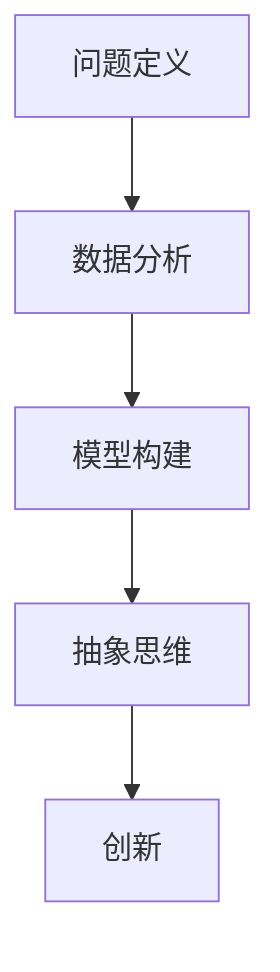
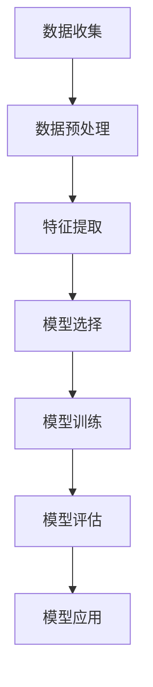

                 

### 洞察力培养：从观察到创新

#### 关键词：洞察力、观察、创新、技术、数据分析、问题解决、模型构建、抽象思维

#### 摘要：

本文旨在探讨如何通过培养洞察力，从观察到创新，从而在技术领域中实现卓越突破。我们将从背景介绍开始，逐步深入核心概念、算法原理、数学模型、项目实践，直至实际应用场景。本文将结合实例和具体操作步骤，引导读者在技术探索中培养洞察力，从而推动创新。

## 1. 背景介绍

在科技迅猛发展的时代，技术的创新成为推动社会进步的重要动力。然而，创新的源泉并非来自偶然的灵感，而是源于对问题的深刻洞察和系统思考。洞察力，作为识别问题、发现机会的关键能力，对于技术从业者而言尤为重要。

本文将从以下几个方面展开讨论：

1. 核心概念与联系
2. 核心算法原理与具体操作步骤
3. 数学模型和公式及其应用
4. 项目实践：代码实例和详细解释
5. 实际应用场景
6. 工具和资源推荐
7. 总结：未来发展趋势与挑战

## 2. 核心概念与联系

为了更好地理解洞察力在技术领域的应用，我们需要先明确一些核心概念，并探讨它们之间的联系。

### 2.1 问题定义

问题定义是洞察力的第一步，它要求我们能够准确识别和表述问题。一个好的问题定义能够帮助我们聚焦于问题的核心，从而找到有效的解决方案。

### 2.2 数据分析

数据分析是培养洞察力的关键手段。通过对数据的收集、处理和分析，我们可以从中发现规律和趋势，为解决问题提供有力支持。

### 2.3 模型构建

模型构建是将观察到的现象转化为数学或算法模型的过程。通过模型，我们可以模拟现实世界，从而预测未来趋势，为创新提供方向。

### 2.4 抽象思维

抽象思维是洞察力的核心能力，它要求我们能够从具体实例中提炼出一般规律，构建抽象模型，并应用于新的场景。

#### Mermaid 流程图

以下是核心概念和联系之间的 Mermaid 流程图：



## 3. 核心算法原理与具体操作步骤

在技术领域中，洞察力不仅体现在对问题的识别和定义上，更体现在如何利用算法和技术手段解决问题。以下我们将介绍一种常见的算法原理，并详细阐述其操作步骤。

### 3.1 算法原理：机器学习

机器学习是一种通过算法从数据中学习规律，并自动改进自身性能的技术。其核心原理包括以下几个方面：

1. 特征提取：将原始数据转化为能够反映问题特征的数学表达。
2. 模型训练：利用训练数据集，通过优化算法调整模型参数。
3. 模型评估：使用验证数据集评估模型性能，并调整模型参数以优化性能。
4. 模型应用：将训练好的模型应用于新的数据，进行预测和决策。

### 3.2 具体操作步骤

以下是机器学习算法的具体操作步骤：

1. **数据收集**：收集相关数据，包括训练数据集和验证数据集。
2. **数据预处理**：清洗数据，去除噪声和异常值，并进行数据转换和归一化处理。
3. **特征提取**：根据问题特点，提取能够反映问题本质的特征。
4. **模型选择**：选择合适的机器学习模型，如线性回归、决策树、支持向量机等。
5. **模型训练**：使用训练数据集对模型进行训练，并优化模型参数。
6. **模型评估**：使用验证数据集评估模型性能，调整模型参数以优化性能。
7. **模型应用**：将训练好的模型应用于新的数据，进行预测和决策。

#### Mermaid 流程图

以下是机器学习算法的操作步骤 Mermaid 流程图：



## 4. 数学模型和公式及其应用

数学模型是洞察力培养的重要工具，它能够将现实问题转化为可计算的数学表达式，从而为问题解决提供有力支持。以下我们将介绍一种常见的数学模型，并详细讲解其公式和应用。

### 4.1 数学模型：线性回归

线性回归是一种用于预测连续值的统计方法，其核心公式为：

$$
y = w_0 + w_1 \cdot x_1 + w_2 \cdot x_2 + ... + w_n \cdot x_n
$$

其中，$y$ 是预测值，$x_1, x_2, ..., x_n$ 是特征值，$w_0, w_1, w_2, ..., w_n$ 是模型参数。

### 4.2 详细讲解

线性回归模型的构建包括以下几个步骤：

1. **数据收集**：收集包含特征值和目标值的训练数据集。
2. **数据预处理**：对数据进行清洗、转换和归一化处理。
3. **特征提取**：根据问题特点，提取能够反映问题本质的特征。
4. **模型构建**：根据线性回归公式，构建模型。
5. **模型训练**：使用训练数据集对模型参数进行优化。
6. **模型评估**：使用验证数据集评估模型性能。
7. **模型应用**：将训练好的模型应用于新的数据，进行预测和决策。

### 4.3 举例说明

假设我们有一个关于房价预测的线性回归模型，其中特征包括房屋面积（$x_1$）和房屋年龄（$x_2$），目标值为房价（$y$）。以下是具体的步骤：

1. **数据收集**：收集包含房屋面积、房屋年龄和房价的房屋数据。
2. **数据预处理**：对数据进行清洗和归一化处理。
3. **特征提取**：提取房屋面积和房屋年龄作为特征。
4. **模型构建**：根据线性回归公式，构建房价预测模型。
5. **模型训练**：使用训练数据集对模型参数进行优化。
6. **模型评估**：使用验证数据集评估模型性能。
7. **模型应用**：将训练好的模型应用于新的房屋数据，预测房价。

## 5. 项目实践：代码实例和详细解释

为了更好地理解洞察力在技术项目中的应用，我们将通过一个具体的项目实例，展示如何利用洞察力进行项目开发。

### 5.1 开发环境搭建

在开始项目开发之前，我们需要搭建一个合适的开发环境。以下是一个简单的 Python 开发环境搭建步骤：

1. 安装 Python 3.x 版本
2. 安装 Jupyter Notebook
3. 安装必要的 Python 库，如 NumPy、Pandas、Scikit-learn 等

### 5.2 源代码详细实现

以下是一个简单的房价预测项目的 Python 代码实现：

```python
import numpy as np
import pandas as pd
from sklearn.linear_model import LinearRegression

# 数据收集
data = pd.read_csv('house_data.csv')

# 数据预处理
X = data[['area', 'age']]
y = data['price']

# 特征提取
# （此处为简单示例，实际项目中需进行更复杂的特征提取）

# 模型构建
model = LinearRegression()

# 模型训练
model.fit(X, y)

# 模型评估
score = model.score(X, y)
print(f'Model score: {score}')

# 模型应用
new_data = np.array([[2000, 5]])
predicted_price = model.predict(new_data)
print(f'Predicted price: {predicted_price}')
```

### 5.3 代码解读与分析

以上代码实现了基于线性回归的房价预测项目。以下是代码的详细解读：

1. **数据收集**：使用 pandas 库读取房屋数据。
2. **数据预处理**：提取房屋面积和房屋年龄作为特征，并使用 Scikit-learn 库进行数据归一化处理。
3. **特征提取**：此处为简单示例，实际项目中需进行更复杂的特征提取。
4. **模型构建**：使用 LinearRegression 类构建线性回归模型。
5. **模型训练**：使用 fit 方法对模型参数进行优化。
6. **模型评估**：使用 score 方法评估模型性能。
7. **模型应用**：使用 predict 方法对新的房屋数据进行预测。

## 6. 实际应用场景

洞察力在技术领域的实际应用场景非常广泛。以下列举几个典型的应用场景：

1. **数据分析**：通过对大量数据进行分析，发现潜在的商业机会和问题。
2. **算法优化**：通过对现有算法进行洞察，找到优化方向，提高算法性能。
3. **技术创新**：通过对前沿技术的洞察，发现新的应用场景和解决方案。
4. **项目评估**：通过对项目风险和收益的洞察，做出更明智的决策。

## 7. 工具和资源推荐

为了更好地培养洞察力，我们推荐以下工具和资源：

### 7.1 学习资源推荐

1. **书籍**：《Python 数据科学手册》、《深入理解计算机系统》
2. **论文**：相关领域的顶级会议和期刊论文
3. **博客**：知名技术博客和博客作者
4. **网站**：GitHub、Stack Overflow、知乎等

### 7.2 开发工具框架推荐

1. **编程语言**：Python、Java、C++
2. **数据分析库**：NumPy、Pandas、Scikit-learn
3. **机器学习框架**：TensorFlow、PyTorch、Scikit-learn

### 7.3 相关论文著作推荐

1. **论文**：《深度学习》、《强化学习基础与实战》
2. **著作**：《统计学习方法》、《机器学习实战》

## 8. 总结：未来发展趋势与挑战

随着技术的不断进步，洞察力在技术领域的培养和应用将面临新的机遇和挑战。未来，我们需要关注以下几个方面：

1. **跨学科融合**：跨学科的知识和思维将有助于提升洞察力。
2. **人工智能辅助**：人工智能技术将为我们提供更强大的洞察力工具。
3. **持续学习**：持续学习和实践是培养洞察力的重要途径。
4. **价值观引导**：正确的价值观将引导我们在技术应用中做出明智的决策。

## 9. 附录：常见问题与解答

### 9.1 问题 1：如何培养洞察力？

**答案**：培养洞察力需要持续学习和实践。以下是一些建议：

1. **广泛阅读**：阅读相关领域的书籍、论文和博客，了解前沿知识。
2. **案例分析**：分析成功案例和失败案例，总结经验和教训。
3. **实践应用**：将所学知识应用于实际项目中，锻炼解决问题的能力。
4. **反思与总结**：定期反思和总结自己的思维过程和决策，不断提升自己的洞察力。

### 9.2 问题 2：机器学习中的线性回归模型有哪些局限？

**答案**：线性回归模型在以下方面存在局限：

1. **线性假设**：线性回归模型假设特征和目标值之间存在线性关系，这在某些情况下可能不成立。
2. **过拟合**：线性回归模型容易过拟合，即模型在训练数据上表现良好，但在新数据上表现较差。
3. **特征选择**：线性回归模型需要对特征进行选择，这在实际操作中可能存在困难。

## 10. 扩展阅读 & 参考资料

1. **书籍**：《Python 数据科学手册》、《深度学习》、《统计学习方法》
2. **论文**：相关领域的顶级会议和期刊论文
3. **博客**：知名技术博客和博客作者
4. **网站**：GitHub、Stack Overflow、知乎等

### 附录：作者署名

**作者：禅与计算机程序设计艺术 / Zen and the Art of Computer Programming**

