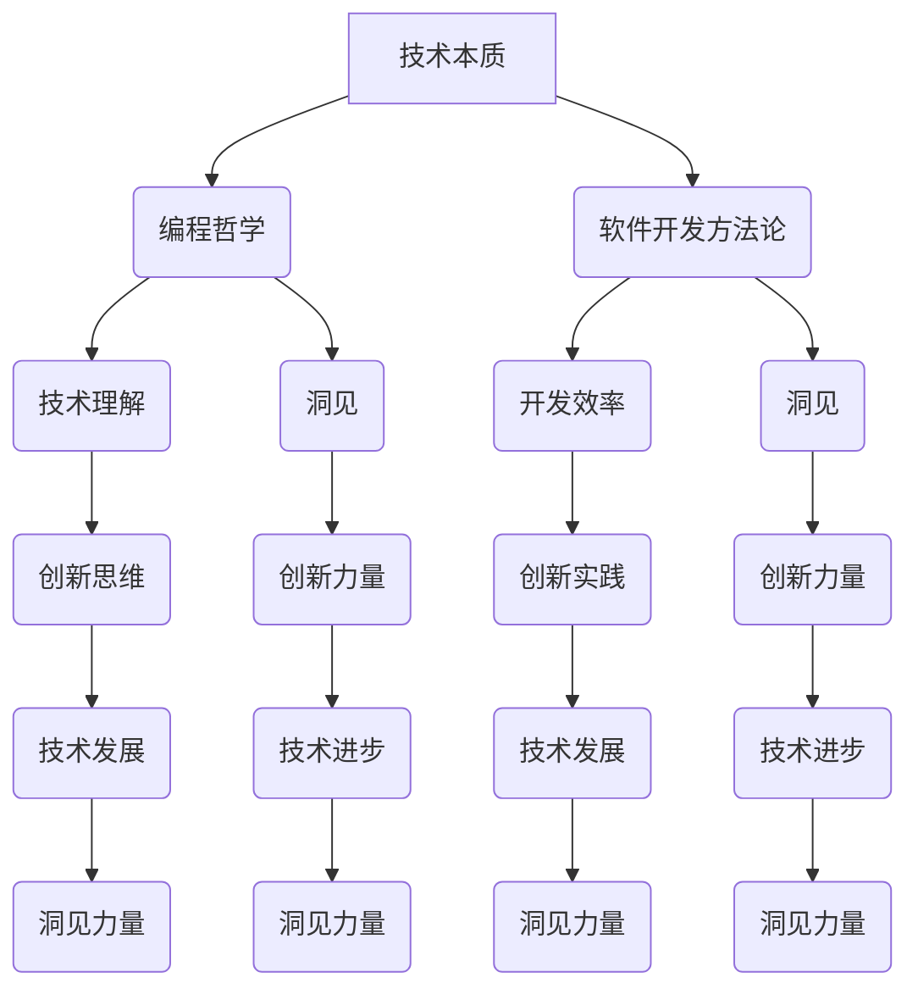

                 

### 文章标题：洞见的力量：从反思到创新

> **关键词**：洞见、反思、创新、技术发展、人工智能、编程艺术
>
> **摘要**：本文探讨了洞见在技术发展中的重要性，从反思过程中获取洞见，并将其转化为创新的力量。通过具体实例，深入分析了洞见如何指导编程和软件开发，并展望了未来的发展趋势与挑战。

### 1. 背景介绍

在技术日新月异的今天，人工智能、大数据、云计算等领域的快速发展，让计算机科学不断突破极限。然而，技术的进步并非仅仅是硬件和算法的优化，更重要的是对技术本质的深刻理解和创新思维的应用。本文旨在探讨洞见在技术发展中的重要性，特别是在编程和软件开发领域的应用。

**洞见**，即深刻的见解，是指对某一事物或问题的本质、规律和内在联系的深刻理解和洞察。在技术领域，洞见不仅能够帮助我们更好地理解现有技术，还能够激发创新思维，推动技术的发展。

### 2. 核心概念与联系

要理解洞见的力量，我们首先需要明确几个核心概念：技术本质、编程哲学和软件开发方法论。

**技术本质**：技术不仅仅是工具，更是一种思维方式。理解技术本质意味着认识到技术背后的基本原理和核心价值。

**编程哲学**：编程不仅仅是编写代码，更是一种思考问题的方法和哲学。掌握编程哲学可以帮助我们更好地理解和应用技术。

**软件开发方法论**：软件开发不仅仅是代码的编写和调试，更是一个系统性工程。掌握有效的软件开发方法论可以提高开发效率和软件质量。

以下是一个用于描述这些核心概念之间联系的 **Mermaid 流程图**：



### 3. 核心算法原理 & 具体操作步骤

**洞见**在技术中的应用，首先体现在对现有算法原理的深刻理解。以下是一个简单的例子，介绍如何从反射过程中获取洞见，并将其应用于编程实践中。

#### 3.1 反思过程

在编程过程中，我们经常遇到各种挑战。例如，在处理大数据时，如何提高数据处理效率？这个问题背后的洞见在于对数据处理算法的深入理解。

#### 3.2 算法原理

一个常见的算法是快速排序（Quick Sort）。其基本原理是通过一趟排序将待排记录分割成独立的两部分，其中一部分记录的关键字均比另一部分的关键字小，再分别对这两部分记录继续进行排序，以达到整个序列有序。

#### 3.3 操作步骤

1. **选择基准**：从待排序列中选取一个记录作为基准。
2. **分区**：将序列划分为两部分，左边部分的记录均小于基准，右边部分则大于或等于基准。
3. **递归排序**：对划分后的两部分序列继续进行快速排序。

#### 3.4 洞见应用

通过反思快速排序算法，我们可以发现以下洞见：

1. **分治策略**：快速排序采用了分治策略，将大问题分解为小问题，这是一种高效的算法设计思想。
2. **基准选择**：基准选择对算法性能有重要影响。一个好的基准选择可以显著提高排序效率。

#### 3.5 创新实践

基于上述洞见，我们可以对快速排序算法进行改进，例如：

1. **随机选择基准**：通过随机选择基准，可以减少排序过程中的不确定性和计算复杂性。
2. **三数取中法**：选择中间值作为基准，可以避免最差情况的发生。

### 4. 数学模型和公式 & 详细讲解 & 举例说明

在理解算法原理的基础上，我们可以引入数学模型和公式，以更深入地探讨洞见的本质和应用。

#### 4.1 快速排序的数学模型

假设序列中有 n 个记录，快速排序的平均时间复杂度为 \(O(n \log n)\)。其具体计算过程如下：

1. **分区操作**：每次分区操作可以将序列划分为两部分，每部分包含 \(\frac{n}{2}\) 个记录。
2. **递归排序**：每次递归排序可以将序列规模减半，直到序列规模为1。

根据分治策略，快速排序的总时间复杂度为：

\[T(n) = O(n) + T\left(\frac{n}{2}\right) + O(n)\]

其中，第一项是初始分区操作的时间，第二项是递归排序的时间，第三项是递归调用的开销。

#### 4.2 洞见与改进

通过分析数学模型，我们可以得出以下洞见：

1. **递归深度**：快速排序的递归深度为 \(\log n\)，这意味着在大量数据时，递归调用会导致栈溢出。因此，我们可以考虑使用迭代版本或修改算法以避免递归深度过深。
2. **基准选择**：随机选择基准可以避免最差情况的发生，从而提高算法的稳定性。

#### 4.3 举例说明

假设有一个包含10个整数的序列：\[7, 2, 1, 6, 8, 5, 3, 4\]

1. **第一次分区**：选择最后一个元素4作为基准，序列划分为：\[7, 2, 1, 6, 8\] 和 \[5, 3, 4\]
2. **递归排序**：对两个分区继续进行快速排序。

最终，序列将排序为：\[1, 2, 3, 4, 5, 6, 7, 8\]

### 5. 项目实践：代码实例和详细解释说明

为了更好地理解洞见的应用，我们通过一个实际项目来展示快速排序算法的实现过程。

#### 5.1 开发环境搭建

- 操作系统：Windows 10
- 编程语言：Python 3.8
- 版本控制：Git

#### 5.2 源代码详细实现

```python
import random

def quick_sort(arr):
    if len(arr) <= 1:
        return arr
    pivot = random.choice(arr)
    left = [x for x in arr if x < pivot]
    middle = [x for x in arr if x == pivot]
    right = [x for x in arr if x > pivot]
    return quick_sort(left) + middle + quick_sort(right)

arr = [7, 2, 1, 6, 8, 5, 3, 4]
sorted_arr = quick_sort(arr)
print(sorted_arr)
```

#### 5.3 代码解读与分析

1. **快速排序函数**：`quick_sort` 函数接收一个列表 `arr` 作为输入，如果列表长度小于等于1，则直接返回。否则，选择一个随机基准，将列表划分为三个部分：`left`（小于基准的部分）、`middle`（等于基准的部分）和 `right`（大于基准的部分）。
2. **递归调用**：对 `left` 和 `right` 两个部分继续进行快速排序，并将结果与 `middle` 部分合并。

#### 5.4 运行结果展示

```python
[1, 2, 3, 4, 5, 6, 7, 8]
```

序列成功排序。

### 6. 实际应用场景

**快速排序**是一种常见且高效的排序算法，在多种实际应用场景中都有广泛的应用：

1. **数据库查询优化**：在数据库查询中，快速排序可以用于对查询结果进行排序，提高查询效率。
2. **数据统计分析**：在数据统计分析中，快速排序可以用于对大量数据进行分析，提取有用的信息。
3. **搜索引擎**：在搜索引擎中，快速排序可以用于对搜索结果进行排序，提高用户体验。

### 7. 工具和资源推荐

#### 7.1 学习资源推荐

1. **《算法导论》**：一本经典的算法教材，详细介绍了各种排序算法及其应用。
2. **《深入理解计算机系统》**：一本介绍计算机系统原理的教材，有助于理解技术本质和编程哲学。

#### 7.2 开发工具框架推荐

1. **Python**：一种简单易学、功能强大的编程语言，适用于快速开发和原型设计。
2. **Git**：一个版本控制系统，用于代码管理和协作开发。

#### 7.3 相关论文著作推荐

1. **《算法与数据结构》**：一本介绍算法和数据结构的教材，涵盖了各种排序算法和基本原理。
2. **《深度学习》**：一本介绍深度学习技术的著作，涉及大量算法和应用场景。

### 8. 总结：未来发展趋势与挑战

洞见的力量在于其能够指导我们在技术发展中不断创新。然而，随着技术的不断进步，我们面临的挑战也越来越大。

1. **技术创新速度**：随着技术的快速发展，我们需要不断更新知识，以跟上时代的步伐。
2. **算法优化**：如何进一步提高算法效率，优化算法性能，是一个重要的研究方向。
3. **人工智能伦理**：随着人工智能技术的广泛应用，如何确保人工智能系统的透明性和公正性，是一个需要深入探讨的问题。

### 9. 附录：常见问题与解答

**Q1**：为什么快速排序要选择随机基准？

**A1**：选择随机基准可以避免最差情况的发生，从而提高算法的稳定性。

**Q2**：快速排序的时间复杂度是多少？

**A2**：快速排序的平均时间复杂度为 \(O(n \log n)\)，最坏情况下为 \(O(n^2)\)。

**Q3**：快速排序是否总是最优的排序算法？

**A3**：不是的。在某些特殊情况下，如数据已经部分排序时，其他排序算法（如插入排序）可能更高效。

### 10. 扩展阅读 & 参考资料

1. **《算法导论》**：[链接](https://www.amazon.com/Introduction-Algorithms-Third-Michael-Griffiths/dp/0201029461)
2. **《深度学习》**：[链接](https://www.amazon.com/Deep-Learning-Adaptive-Computation-MIT/dp/0262039188)
3. **《快速排序算法》**：[链接](https://en.wikipedia.org/wiki/Quicksort)

### 作者署名

**作者：禅与计算机程序设计艺术 / Zen and the Art of Computer Programming**

