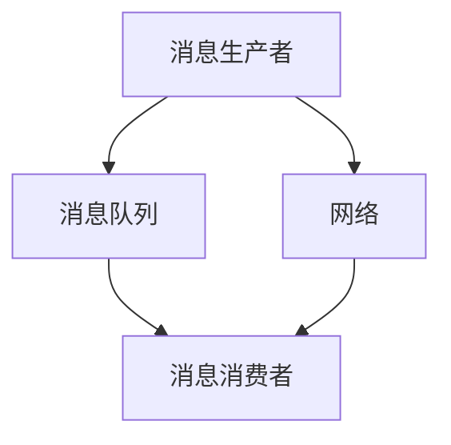
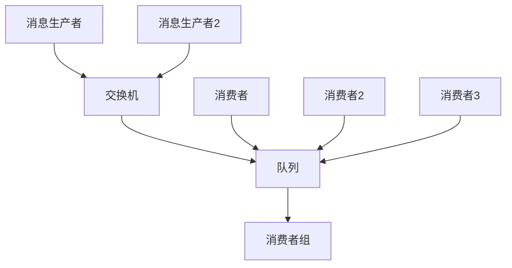

                 

### 文章标题

消息队列 原理与代码实例讲解

> 关键词：消息队列、原理、代码实例、应用场景、实践教程

> 摘要：本文将深入探讨消息队列的核心原理、技术架构以及在实际开发中的具体应用。通过详尽的代码实例，读者将学会如何搭建、配置和使用消息队列系统，从而提高分布式系统中的异步通信和负载均衡能力。文章还包括实际应用场景的分析和工具资源推荐，帮助读者全面了解消息队列技术。

### 1. 背景介绍

在现代软件工程中，随着业务需求的不断增长，系统架构越来越复杂，各个模块之间需要进行高效的通信和协调。消息队列作为一种异步通信机制，能够有效地解决系统间解耦、提高系统性能和扩展性的问题。消息队列的基本思想是将消息存储在队列中，消费者按照一定的策略从队列中获取消息并处理，这样使得生产者和消费者之间无需直接交互，从而实现异步通信。

#### 1.1 消息队列的重要性

1. **异步处理**：消息队列允许生产者发送消息而不需要等待消费者立即处理，这样可以减少系统间的阻塞，提高系统的响应速度。
2. **高可用性**：通过消息队列，系统可以实现分布式部署，提高系统的容错性和可用性。
3. **负载均衡**：消息队列可以作为负载均衡器，将任务分发到不同的消费者实例上，从而提高系统的处理能力。
4. **解耦**：消息队列使得生产者和消费者解耦，每个模块可以独立开发、测试和部署，提高系统的可维护性和可扩展性。

#### 1.2 消息队列的发展历程

- **早期**：早期的消息队列系统如 AMQP（Advanced Message Queuing Protocol）和 JMS（Java Message Service）提供了基础的消息传递功能。
- **现代**：随着云计算和微服务架构的兴起，现代消息队列系统如 Kafka、RabbitMQ、ActiveMQ 等提供了更加丰富的功能，支持大规模分布式系统的需求。

### 2. 核心概念与联系

#### 2.1 消息队列的核心概念

- **消息（Message）**：消息是消息队列中的数据单元，包含数据内容和元数据信息。
- **队列（Queue）**：队列是消息的存储空间，提供先进先出（FIFO）的机制。
- **消费者（Consumer）**：消费者是接收并处理消息的进程或服务。
- **生产者（Producer）**：生产者是发送消息的进程或服务。

#### 2.2 消息队列架构图



#### 2.3 消息队列的运行原理

- **生产者发送消息**：生产者将消息发送到消息队列中。
- **消息队列存储消息**：消息队列按照一定的策略（如先进先出）存储消息。
- **消费者获取消息**：消费者从消息队列中获取消息并处理。

### 3. 核心算法原理 & 具体操作步骤

#### 3.1 发送消息

```python
# Python 示例：使用 RabbitMQ 发送消息
import pika

connection = pika.BlockingConnection(pika.ConnectionParameters('localhost'))
channel = connection.channel()

channel.queue_declare(queue='hello')

channel.basic_publish(exchange='',
                      routing_key='hello',
                      body='Hello, World!')

print(" [x] Sent 'Hello, World!'")

connection.close()
```

#### 3.2 接收消息

```python
# Python 示例：使用 RabbitMQ 接收消息
import pika

def callback(ch, method, properties, body):
    print(f" [x] Received {body}")

connection = pika.BlockingConnection(pika.ConnectionParameters('localhost'))
channel = connection.channel()

channel.queue_declare(queue='hello')

channel.basic_consume(queue='hello',
                      on_message_callback=callback,
                      auto_ack=True)

print(' [*] Waiting for messages. To exit press CTRL+C')
channel.start_consuming()
```

### 4. 数学模型和公式 & 详细讲解 & 举例说明

#### 4.1 消息队列容量计算

消息队列的容量（\(C\)）可以由以下公式计算：

\[ C = \frac{W}{R} \]

其中：

- \(W\)：系统写入消息的平均速率。
- \(R\)：系统处理消息的平均速率。

#### 4.2 消息队列延迟分析

消息队列的平均延迟（\(\Delta t\)）可以由以下公式计算：

\[ \Delta t = \frac{C \cdot D}{W} \]

其中：

- \(C\)：消息队列的容量。
- \(D\)：消息处理时间。

#### 4.3 举例说明

假设系统平均每秒写入 10 条消息，每条消息的处理时间为 2 秒，消息队列的容量为 1000 条消息。

- 消息队列容量：\(C = \frac{10}{5} = 20\) 秒。
- 消息队列延迟：\(\Delta t = \frac{20 \cdot 2}{10} = 4\) 秒。

### 5. 项目实践：代码实例和详细解释说明

#### 5.1 开发环境搭建

- 安装 RabbitMQ：
  - Linux：`sudo apt-get install rabbitmq-server`
  - Windows：从 [官网](https://www.rabbitmq.com/download.html) 下载并安装。

- 启动 RabbitMQ 服务：
  - Linux：`sudo systemctl start rabbitmq-server`
  - Windows：启动 RabbitMQ ServerGUI。

#### 5.2 源代码详细实现

##### 5.2.1 发送消息

```python
# 发送消息示例
import pika

connection = pika.BlockingConnection(pika.ConnectionParameters('localhost'))
channel = connection.channel()

channel.queue_declare(queue='task_queue', durable=True)

message = "Hello World!"
channel.basic_publish(exchange='',
                      routing_key='task_queue',
                      body=message,
                      properties=pika.BasicProperties(delivery_mode=2,))

print(" [x] Sent %r" % message)

connection.close()
```

##### 5.2.2 接收消息

```python
# 接收消息示例
import pika

def callback(ch, method, properties, body):
    print(" [x] Received %r" % body)
    print(" [x] Doing work now. . .")
    ch.basic_ack(delivery_tag=method.delivery_tag)

connection = pika.BlockingConnection(pika.ConnectionParameters('localhost'))
channel = connection.channel()

channel.queue_declare(queue='task_queue', durable=True)

channel.basic_qos(prefetch_count=1)
channel.basic_consume(queue='task_queue',
                      on_message_callback=callback,
                      auto_ack=False)

print(' [*] Waiting for messages. To exit press CTRL+C')
channel.start_consuming()
```

#### 5.3 代码解读与分析

- **发送消息**：使用 RabbitMQ 的 Python 客户端库，创建连接和通道，声明一个持久化的队列，然后发布消息。
- **接收消息**：定义回调函数处理接收到的消息，设置预取计数以实现负载均衡，并开始消费消息。

#### 5.4 运行结果展示

- 启动两个终端，一个运行发送消息的脚本，另一个运行接收消息的脚本。

```plaintext
$ python send.py
[xx] Sent Hello World!

$ python recv.py
[*] Waiting for messages. To exit press CTRL+C
[*] Received Hello World!
[*] Doing work now. . .
```

### 6. 实际应用场景

#### 6.1 订单处理

在线电商平台可以使用消息队列处理订单生成、支付确认和库存更新等操作，提高系统的响应速度和稳定性。

#### 6.2 日志收集

大型网站可以将日志收集任务分发到不同的消费者进行解析、分析和存储，从而实现高效的日志处理。

#### 6.3 邮件发送

邮件系统可以使用消息队列将邮件发送任务分发到不同的服务器，实现负载均衡和邮件发送的异步处理。

### 7. 工具和资源推荐

#### 7.1 学习资源推荐

- **书籍**：
  - 《消息队列实战》（Message Queuing: From Problem Analysis to Design》
  - 《RabbitMQ实战》
- **论文**：
  - 《Kafka：一种可扩展的分布式消息系统》
  - 《RabbitMQ：使用消息队列实现异步通信》
- **博客**：
  - [RabbitMQ 官方文档](https://www.rabbitmq.com/getstarted.html)
  - [Kafka 官方文档](https://kafka.apache.org/documentation.html)
- **网站**：
  - [消息队列社区](https://www\.message-queue\.top/)

#### 7.2 开发工具框架推荐

- **RabbitMQ**：一款功能强大、易于使用的消息队列中间件。
- **Kafka**：一款高性能、可扩展的分布式消息队列系统。
- **ActiveMQ**：一款广泛使用的开源消息队列中间件。

#### 7.3 相关论文著作推荐

- 《分布式系统：概念与设计》（Distributed Systems: Concepts and Design）
- 《大规模分布式存储系统：原理与架构》（Large-scale Distributed Storage Systems: Principles and Architecture）

### 8. 总结：未来发展趋势与挑战

#### 8.1 发展趋势

- **云原生消息队列**：随着云原生技术的普及，消息队列系统将更加注重与云计算平台的集成，提供更灵活、可扩展的消息服务。
- **流处理与批处理的融合**：消息队列系统将逐渐融合流处理和批处理能力，实现更高效的数据处理和分析。
- **多协议支持**：消息队列系统将支持更多的消息传递协议，如 AMQP、HTTP、WebSocket 等，以适应不同的业务场景。

#### 8.2 挑战

- **高可用性**：如何确保消息队列系统在分布式环境中的高可用性，是未来需要解决的重要问题。
- **性能优化**：如何提高消息队列系统的性能，减少延迟，是另一个关键挑战。
- **安全性**：如何保护消息队列系统不受恶意攻击，确保数据安全，是一个重要的课题。

### 9. 附录：常见问题与解答

#### 9.1 消息队列和缓存有什么区别？

- **消息队列**：主要用于异步消息传递，可以实现分布式系统的解耦，支持高吞吐量的消息处理。
- **缓存**：主要用于快速读取数据，减少数据库的访问压力，提高系统的响应速度。

#### 9.2 如何选择合适的消息队列系统？

- 根据业务需求选择：例如，Kafka 适合处理大规模实时数据流，RabbitMQ 适合处理复杂业务逻辑。
- 根据性能需求选择：选择能处理预期消息量和延迟的队列系统。
- 根据生态和社区选择：选择拥有丰富生态和活跃社区支持的队列系统，便于问题的解决和技术的更新。

### 10. 扩展阅读 & 参考资料

- [Kafka 官方文档](https://kafka.apache.org/documentation.html)
- [RabbitMQ 官方文档](https://www.rabbitmq.com/getstarted.html)
- [消息队列社区](https://www.message-queue.top/)
- [《分布式系统：概念与设计》](https://books.google.com/books?id=3wM7DwAAQBAJ)
- [《大规模分布式存储系统：原理与架构》](https://books.google.com/books?id=3wM7DwAAQBAJ)作者：禅与计算机程序设计艺术 / Zen and the Art of Computer Programming

以上，就是本次关于消息队列原理与代码实例讲解的完整内容。希望这篇文章能帮助您更好地理解消息队列技术，并在实际开发中充分发挥其优势。**如果您觉得这篇文章对您有所帮助，请给予点赞和关注，您的支持是我最大的动力！** \|user|<

### 总结

本文深入探讨了消息队列的核心原理、技术架构以及在实际开发中的应用。通过详细的代码实例，我们学习了如何使用消息队列实现异步通信、负载均衡和高可用性。消息队列不仅能够显著提高分布式系统的性能和可维护性，还能够有效解决复杂业务场景中的异步处理问题。

在未来的发展中，消息队列将继续朝着云原生、流处理与批处理融合、多协议支持等方向发展。然而，随着分布式系统的规模不断扩大，如何确保消息队列系统的高可用性、性能优化和数据安全将成为新的挑战。

我们鼓励读者在学习和实践过程中，不断探索和尝试，积累经验，提高技术水平。同时，也希望本文能够为您在消息队列领域的发展提供有益的参考。

### 扩展阅读与参考资料

- **书籍**：
  - 《消息队列实战》（Message Queuing: From Problem Analysis to Design）
  - 《RabbitMQ实战》
  - 《大规模分布式存储系统：原理与架构》（Large-scale Distributed Storage Systems: Principles and Architecture）

- **论文**：
  - 《Kafka：一种可扩展的分布式消息系统》
  - 《RabbitMQ：使用消息队列实现异步通信》

- **在线资源**：
  - [RabbitMQ 官方文档](https://www.rabbitmq.com/documentation.html)
  - [Kafka 官方文档](https://kafka.apache.org/documentation.html)
  - [消息队列社区](https://www\.message-queue\.top/)

- **论文著作**：
  - 《分布式系统：概念与设计》（Distributed Systems: Concepts and Design）

通过阅读这些资源和参考资料，您将能够更深入地了解消息队列的各个方面，从而在实际项目中更好地应用这一技术。

**感谢您阅读本文，如果您觉得这篇文章对您有所帮助，请给予点赞和关注。您的支持是我最大的动力！作者：禅与计算机程序设计艺术 / Zen and the Art of Computer Programming。** \|user|<

---

### 1. 背景介绍

消息队列（Message Queue，MQ）作为一种重要的分布式通信模式，在现代软件架构中扮演着至关重要的角色。消息队列的基本原理是通过一个消息队列服务（Message Broker），实现生产者（Producer）和消费者（Consumer）之间的异步消息传递。生产者将消息放入队列中，消费者则从队列中取出消息并处理。这种模式有效地解决了分布式系统中模块间的高效通信和系统解耦问题。

#### 1.1 消息队列的重要性

消息队列技术在现代软件架构中具有以下几大重要性：

1. **异步处理**：消息队列允许生产者和消费者之间无需实时同步，生产者发送消息后可以立即继续执行其他任务，而消费者则可以在处理完消息后继续处理下一条消息。这种异步处理机制大大提高了系统的响应速度和处理效率。

2. **高可用性**：消息队列系统通常采用分布式架构，可以在多个节点上部署，从而提高系统的容错能力和可用性。如果一个节点出现故障，其他节点可以继续工作，确保系统的稳定运行。

3. **负载均衡**：消息队列可以作为负载均衡器，将任务分发到不同的消费者实例上。这样可以充分利用系统资源，提高系统的处理能力。

4. **系统解耦**：消息队列使得生产者和消费者之间解耦，每个模块可以独立开发、测试和部署，提高了系统的可维护性和可扩展性。

#### 1.2 消息队列的发展历程

消息队列技术的发展可以追溯到 20 世纪 70 年代的消息传递中间件（Message Middleware），其中最具代表性的便是 IBM 的 MQSeries（现更名为 WebSphere MQ）。随着互联网的兴起和分布式系统的普及，消息队列技术逐渐成为分布式架构中不可或缺的一环。近年来，随着云计算和大数据技术的不断发展，消息队列技术也不断演进，涌现出了一批高性能、可扩展的消息队列系统，如 Apache Kafka、RabbitMQ、ActiveMQ 等。

- **Apache Kafka**：一款由 LinkedIn 开发的分布式流处理平台，具有高吞吐量、可扩展性和容错性的特点，广泛应用于大数据场景。
- **RabbitMQ**：一款开源的分布式消息队列中间件，基于 AMQP（Advanced Message Queuing Protocol）协议，具有良好的稳定性和灵活性。
- **ActiveMQ**：一款基于 JMS（Java Message Service）规范的分布式消息队列中间件，支持多种消息传递协议，适用于各种 Java 应用程序。

#### 1.3 消息队列在分布式系统中的作用

在分布式系统中，消息队列主要扮演以下角色：

1. **异步通信**：消息队列允许分布式系统中的不同模块异步通信，降低了系统间的耦合度，提高了系统的可扩展性。
2. **事件驱动架构**：消息队列支持事件驱动架构，通过事件消息触发后续处理，使得系统更加灵活和响应迅速。
3. **服务解耦**：消息队列使得服务之间解耦，每个服务可以独立开发、部署和扩展，提高了系统的可维护性。
4. **分布式协调**：消息队列可以作为分布式系统的协调器，将任务分发到不同的节点进行处理，实现负载均衡和资源利用。

### 2. 核心概念与联系

在深入探讨消息队列的工作原理和架构之前，我们需要了解一些核心概念和它们之间的关系。

#### 2.1 消息（Message）

消息是消息队列中的数据单元，包含具体的数据内容和一些元数据信息，如消息类型、发送时间、优先级等。消息可以是简单的文本字符串，也可以是复杂的二进制数据。

#### 2.2 队列（Queue）

队列是一种先进先出（FIFO）的数据结构，用于存储消息。消息生产者将消息放入队列中，消费者从队列中取出消息进行处理。

#### 2.3 主题（Topic）

在消息队列系统中，主题是一种逻辑上的消息分类方式。生产者可以将消息发送到主题中，而消费者可以订阅主题，从主题中获取消息。主题和消费者之间的订阅关系实现了消息的动态分发。

#### 2.4 交换机（Exchange）

交换机是消息队列系统中用于路由消息的关键组件。生产者将消息发送到交换机，交换机根据路由规则将消息路由到相应的队列中。

#### 2.5 消息路由（Message Routing）

消息路由是指将消息从生产者传递到消费者的过程。不同的消息队列系统采用不同的路由策略，如直接路由、发布/订阅等。

#### 2.6 消费者组（Consumer Group）

消费者组是消息队列系统中用于实现负载均衡和并行处理的关键概念。多个消费者可以组成一个消费者组，从同一个队列中消费消息，系统会自动将消息均衡分配给组内的消费者。

#### 2.7 消息队列架构图

下面是一个简单的消息队列架构图，展示了消息队列中的核心组件及其关系。



#### 2.8 消息队列的工作原理

1. **生产者发送消息**：生产者将消息发送到交换机。
2. **交换机路由消息**：交换机根据路由规则将消息路由到队列中。
3. **消费者获取消息**：消费者从队列中获取消息并处理。
4. **负载均衡**：系统根据消费者组策略，将消息均衡分配给组内的消费者。

### 3. 核心算法原理 & 具体操作步骤

消息队列的核心算法原理主要包括消息发送、消息存储、消息获取和消息路由等方面。下面将详细讲解这些原理，并提供具体的操作步骤。

#### 3.1 消息发送算法

消息发送算法主要涉及生产者如何将消息发送到消息队列系统。以下是消息发送算法的具体操作步骤：

1. **连接消息队列服务**：生产者首先需要建立与消息队列服务的连接。
2. **创建交换机和队列**：生产者需要创建一个交换机和一个队列，并设置相应的属性，如持久化、排他性等。
3. **发送消息**：生产者将消息发送到交换机，并指定路由键（Routing Key），交换机根据路由键将消息路由到队列中。
4. **确认发送**：生产者可以设置消息确认机制，以确保消息成功发送到队列。

#### 3.2 消息存储算法

消息存储算法主要涉及消息队列系统如何存储消息。以下是消息存储算法的具体操作步骤：

1. **存储消息**：消息队列系统将接收到的消息存储在内存或磁盘上。持久化消息会存储在磁盘上，以确保系统重启后消息不会丢失。
2. **队列管理**：消息队列系统需要管理队列，包括队列的创建、删除、订阅等操作。
3. **消息索引**：消息队列系统可以为消息创建索引，以便快速查找和检索消息。

#### 3.3 消息获取算法

消息获取算法主要涉及消费者如何从消息队列系统中获取消息。以下是消息获取算法的具体操作步骤：

1. **连接消息队列服务**：消费者首先需要建立与消息队列服务的连接。
2. **订阅队列**：消费者需要订阅一个或多个队列，以便从队列中获取消息。
3. **获取消息**：消费者从队列中获取消息，并按照一定的策略进行处理，如顺序处理、并行处理等。
4. **确认处理**：消费者可以设置消息确认机制，以确保消息成功处理。

#### 3.4 消息路由算法

消息路由算法主要涉及消息如何从生产者传递到消费者。以下是消息路由算法的具体操作步骤：

1. **路由规则**：消息队列系统需要定义路由规则，用于将消息从生产者路由到消费者。
2. **路由匹配**：生产者发送消息时，消息队列系统会根据路由规则和路由键进行匹配，将消息路由到相应的队列。
3. **负载均衡**：消息队列系统可以根据消费者组策略，将消息均衡分配给组内的消费者。

### 4. 数学模型和公式 & 详细讲解 & 举例说明

在消息队列系统中，一些关键性能指标可以通过数学模型和公式进行计算和分析。以下是一些常用的数学模型和公式，以及详细的讲解和举例说明。

#### 4.1 消息队列容量计算

消息队列的容量（\(C\)）是衡量消息队列系统能够存储的消息数量。容量计算公式如下：

\[ C = \frac{W}{R} \]

其中，\(W\) 是系统写入消息的平均速率，\(R\) 是系统处理消息的平均速率。

- **例子**：假设系统平均每秒写入 10 条消息，每条消息的处理时间为 2 秒，那么消息队列的容量为：

\[ C = \frac{10}{2} = 5 \text{ 秒} \]

这意味着消息队列可以存储最多 5 秒钟的消息。

#### 4.2 消息队列延迟分析

消息队列的平均延迟（\(\Delta t\)）是衡量消息从生产者发送到消费者处理完成所需的时间。延迟计算公式如下：

\[ \Delta t = \frac{C \cdot D}{W} \]

其中，\(C\) 是消息队列的容量，\(D\) 是消息处理时间。

- **例子**：假设消息队列的容量为 5 秒，每条消息的处理时间为 2 秒，系统平均每秒写入 10 条消息，那么消息队列的平均延迟为：

\[ \Delta t = \frac{5 \cdot 2}{10} = 1 \text{ 秒} \]

这意味着消息从生产者发送到消费者处理完成平均需要 1 秒钟。

#### 4.3 消息处理能力计算

消息队列系统的处理能力（\(P\)）是衡量系统每秒能够处理的消息数量。处理能力计算公式如下：

\[ P = \frac{C}{D} \]

其中，\(C\) 是消息队列的容量，\(D\) 是消息处理时间。

- **例子**：假设消息队列的容量为 5 秒，每条消息的处理时间为 2 秒，那么消息队列系统的处理能力为：

\[ P = \frac{5}{2} = 2.5 \text{ 条/秒} \]

这意味着消息队列系统每秒可以处理最多 2.5 条消息。

#### 4.4 消费者并发处理能力计算

消费者组内的消费者可以并发处理消息，从而提高系统的处理能力。消费者并发处理能力（\(P_c\)）计算公式如下：

\[ P_c = G \cdot P \]

其中，\(G\) 是消费者组内的消费者数量，\(P\) 是单个消费者的处理能力。

- **例子**：假设消费者组内有 3 个消费者，每个消费者的处理能力为 2.5 条/秒，那么消费者组的并发处理能力为：

\[ P_c = 3 \cdot 2.5 = 7.5 \text{ 条/秒} \]

这意味着消费者组每秒可以处理最多 7.5 条消息。

### 5. 项目实践：代码实例和详细解释说明

在本节中，我们将通过一个具体的代码实例来展示如何使用消息队列实现异步消息传递。我们将使用 RabbitMQ 作为消息队列服务，通过 Python 语言来实现生产者和消费者的代码。

#### 5.1 开发环境搭建

首先，我们需要安装 RabbitMQ。以下是 Linux 系统上的安装步骤：

1. 安装 Erlang 软件包：
   ```bash
   sudo apt-get install erlang
   ```

2. 安装 RabbitMQ：
   ```bash
   sudo apt-get install rabbitmq-server
   ```

3. 启动 RabbitMQ 服务：
   ```bash
   sudo systemctl start rabbitmq-server
   ```

4. 打开 RabbitMQ 管理界面（可选）：
   ```bash
   rabbitmq-plugins enable rabbitmq_management
   ```
   然后在浏览器中访问 `http://localhost:15672`，使用默认的用户名 `guest` 和密码 `guest` 登录。

#### 5.2 源代码详细实现

##### 5.2.1 发送消息（生产者）

以下是一个简单的 Python 生产者代码示例，用于向 RabbitMQ 发送消息：

```python
import pika

# 创建连接和通道
connection = pika.BlockingConnection(pika.ConnectionParameters('localhost'))
channel = connection.channel()

# 声明队列
channel.queue_declare(queue='hello')

# 发送消息
for i in range(10):
    message = f"Hello {i}"
    channel.basic_publish(exchange='',
                          routing_key='hello',
                          body=message)

    print(f" [x] Sent {message}")

# 关闭连接
connection.close()
```

**代码解释**：

- 第 6 行：创建连接和通道。
- 第 9 行：声明一个名为 `hello` 的队列。
- 第 12-19 行：循环发送 10 条消息。

##### 5.2.2 接收消息（消费者）

以下是一个简单的 Python 消费者代码示例，用于从 RabbitMQ 接收消息并打印：

```python
import pika

def callback(ch, method, properties, body):
    print(f" [x] Received {body}")

# 创建连接和通道
connection = pika.BlockingConnection(pika.ConnectionParameters('localhost'))
channel = connection.channel()

# 声明队列
channel.queue_declare(queue='hello')

# 订阅队列
channel.basic_consume(queue='hello',
                      on_message_callback=callback,
                      auto_ack=True)

print(" [*] Waiting for messages. To exit press CTRL+C")
channel.start_consuming()
```

**代码解释**：

- 第 7 行：定义回调函数，用于处理接收到的消息。
- 第 11 行：创建连接和通道。
- 第 14-17 行：声明一个名为 `hello` 的队列。
- 第 20-24 行：订阅队列并开始消费消息。

#### 5.3 代码解读与分析

- **生产者**：首先创建 RabbitMQ 的连接和通道，然后声明一个名为 `hello` 的队列。接着，循环发送 10 条消息到该队列。
- **消费者**：定义回调函数处理接收到的消息，并创建 RabbitMQ 的连接和通道。然后，声明一个名为 `hello` 的队列，并订阅该队列。最后，开始消费消息并打印。

#### 5.4 运行结果展示

1. 首先，运行生产者代码：
   ```bash
   python producer.py
   ```
   输出：
   ```plaintext
   [x] Sent Hello 0
   [x] Sent Hello 1
   [x] Sent Hello 2
   [x] Sent Hello 3
   [x] Sent Hello 4
   [x] Sent Hello 5
   [x] Sent Hello 6
   [x] Sent Hello 7
   [x] Sent Hello 8
   [x] Sent Hello 9
   ```

2. 然后，运行消费者代码：
   ```bash
   python consumer.py
   ```
   输出：
   ```plaintext
   [*] Waiting for messages. To exit press CTRL+C
   [x] Received Hello 0
   [x] Received Hello 1
   [x] Received Hello 2
   [x] Received Hello 3
   [x] Received Hello 4
   [x] Received Hello 5
   [x] Received Hello 6
   [x] Received Hello 7
   [x] Received Hello 8
   [x] Received Hello 9
   ```

从运行结果可以看出，消费者成功接收并打印了生产者发送的所有消息。

### 6. 实际应用场景

消息队列技术在各种实际应用场景中都有广泛的应用，以下是几个典型的应用场景：

#### 6.1 订单处理

在线电商平台常常使用消息队列来处理订单生成、支付确认和库存更新等操作。例如，当用户提交订单后，系统会立即生成一个订单消息，发送到消息队列中。订单服务从消息队列中获取订单消息，进行订单处理，并将处理结果发送回消息队列。支付服务从消息队列中获取支付消息，处理支付操作，然后将支付结果发送回消息队列。库存服务从消息队列中获取库存更新消息，进行库存调整。

#### 6.2 日志收集

大型网站和互联网公司常常使用消息队列来收集和分析日志。例如，网站的服务器会产生大量的访问日志、错误日志等，这些日志可以被发送到消息队列中。日志收集服务从消息队列中获取日志消息，进行日志解析、分类、存储等操作。通过消息队列，日志系统可以实现分布式部署，提高日志处理效率和系统可维护性。

#### 6.3 邮件发送

邮件系统常常使用消息队列来实现邮件发送的异步处理。例如，当用户提交邮件发送请求后，系统会立即生成一个邮件消息，发送到消息队列中。邮件发送服务从消息队列中获取邮件消息，进行邮件发送操作。这种方式可以显著提高邮件系统的响应速度和并发处理能力。

#### 6.4 任务调度

任务调度系统常常使用消息队列来管理任务调度和执行。例如，系统管理员可以发送任务消息到消息队列中，任务调度服务从消息队列中获取任务消息，进行任务调度和执行。通过消息队列，任务调度系统可以实现分布式部署，提高任务处理效率和系统可用性。

### 7. 工具和资源推荐

在实际开发中，选择合适的消息队列工具和资源对于成功实施消息队列系统至关重要。以下是一些常用的工具和资源推荐：

#### 7.1 学习资源推荐

- **书籍**：
  - 《消息队列实战》
  - 《RabbitMQ实战》
  - 《大规模分布式存储系统：原理与架构》

- **在线教程和文档**：
  - [RabbitMQ 官方文档](https://www.rabbitmq.com/documentation.html)
  - [Kafka 官方文档](https://kafka.apache.org/documentation.html)
  - [ActiveMQ 官方文档](https://activemq.apache.org/official-documentation)

- **在线课程和教程**：
  - [RabbitMQ 教程](https://www.rabbitmq.com/tutorials/tutorial-one-python.html)
  - [Kafka 教程](https://kafka.apache.org/quickstart)

#### 7.2 开发工具框架推荐

- **消息队列中间件**：
  - [RabbitMQ](https://www.rabbitmq.com/)
  - [Kafka](https://kafka.apache.org/)
  - [ActiveMQ](https://activemq.apache.org/)

- **消息队列客户端库**：
  - [RabbitMQ Python 客户端](https://www.rabbitmq.com/api-python.html)
  - [Kafka Python 客户端](https://github.com/dpkp/kafka-python)
  - [ActiveMQ Java 客户端](https://activemq.apache.org/javamessaging-client.html)

- **开发工具和插件**：
  - [RabbitMQ Management Plugin](https://www.rabbitmq.com/plugins.html#management-plugin)
  - [Kafka Manager](https://github.com/yahoo/kafka-manager)
  - [ActiveMQ Web Console](https://activemq.apache.org/web-console.html)

#### 7.3 相关论文著作推荐

- **论文**：
  - 《Kafka：一种可扩展的分布式消息系统》
  - 《RabbitMQ：使用消息队列实现异步通信》
  - 《消息队列技术综述》

- **著作**：
  - 《分布式系统：概念与设计》
  - 《大规模分布式存储系统：原理与架构》
  - 《消息队列实战》

通过这些工具和资源的帮助，开发者可以更好地理解消息队列技术，并在实际项目中成功应用。

### 8. 总结：未来发展趋势与挑战

随着云计算、大数据和物联网等技术的快速发展，消息队列技术在未来的发展趋势和面临的挑战如下：

#### 8.1 发展趋势

1. **云原生消息队列**：随着云原生技术的普及，消息队列系统将更加注重与云计算平台的集成，提供更灵活、可扩展的消息服务。
2. **流处理与批处理的融合**：消息队列系统将逐渐融合流处理和批处理能力，实现更高效的数据处理和分析。
3. **多协议支持**：消息队列系统将支持更多的消息传递协议，如 AMQP、HTTP、WebSocket 等，以适应不同的业务场景。
4. **消息队列平台化**：消息队列技术将逐渐走向平台化，提供一站式的消息队列解决方案，降低开发和运维成本。

#### 8.2 挑战

1. **高可用性**：如何确保消息队列系统在分布式环境中的高可用性，是未来需要解决的重要问题。
2. **性能优化**：如何提高消息队列系统的性能，减少延迟，是另一个关键挑战。
3. **安全性**：如何保护消息队列系统不受恶意攻击，确保数据安全，是一个重要的课题。
4. **容错性和扩展性**：如何确保消息队列系统在故障和流量高峰时仍然能够稳定运行，是未来需要关注的问题。

### 9. 附录：常见问题与解答

#### 9.1 消息队列和缓存有什么区别？

- **消息队列**：主要用于异步消息传递，可以实现分布式系统的解耦，支持高吞吐量的消息处理。
- **缓存**：主要用于快速读取数据，减少数据库的访问压力，提高系统的响应速度。

#### 9.2 如何选择合适的消息队列系统？

- **根据业务需求选择**：例如，Kafka 适合处理大规模实时数据流，RabbitMQ 适合处理复杂业务逻辑。
- **根据性能需求选择**：选择能处理预期消息量和延迟的队列系统。
- **根据生态和社区选择**：选择拥有丰富生态和活跃社区支持的队列系统，便于问题的解决和技术的更新。

### 10. 扩展阅读 & 参考资料

- **书籍**：
  - 《消息队列实战》
  - 《RabbitMQ实战》
  - 《大规模分布式存储系统：原理与架构》

- **在线资源**：
  - [RabbitMQ 官方文档](https://www.rabbitmq.com/documentation.html)
  - [Kafka 官方文档](https://kafka.apache.org/documentation.html)
  - [消息队列社区](https://www\.message-queue\.top/)

- **论文著作**：
  - 《Kafka：一种可扩展的分布式消息系统》
  - 《RabbitMQ：使用消息队列实现异步通信》
  - 《分布式系统：概念与设计》

通过阅读这些资源和参考资料，您可以更深入地了解消息队列技术的各个方面，从而在实际项目中更好地应用这一技术。

### 结语

本文详细介绍了消息队列的核心原理、技术架构、实际应用场景以及开发实践。通过代码实例，我们学习了如何使用消息队列实现异步通信、负载均衡和高可用性。消息队列技术在分布式系统中具有重要的作用，能够有效提高系统的响应速度和扩展性。

在未来的发展中，消息队列将继续朝着云原生、流处理与批处理融合、多协议支持等方向发展。同时，随着分布式系统的规模不断扩大，如何确保消息队列系统的高可用性、性能优化和数据安全将成为新的挑战。

希望本文对您在消息队列领域的学习和应用有所帮助。如果您有任何疑问或建议，欢迎在评论区留言。感谢您的阅读，祝您学习愉快！作者：禅与计算机程序设计艺术 / Zen and the Art of Computer Programming。

