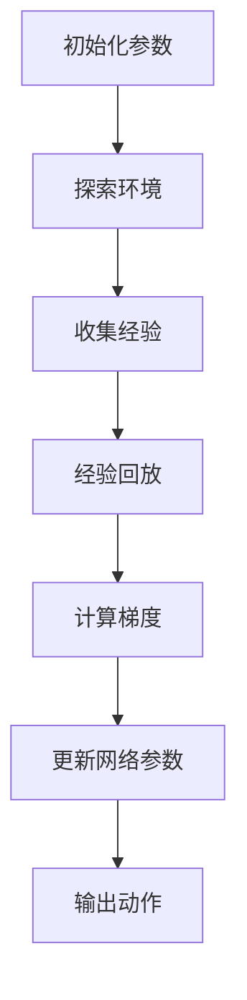

                 

### 文章标题

深度 Q-learning：在教育领域中的应用

> 关键词：深度 Q-learning，教育，强化学习，应用案例，算法原理

> 摘要：本文将探讨深度 Q-learning（DQN）算法在教育领域中的应用。通过介绍深度 Q-learning 的基本原理、算法实现步骤，以及教育领域中的实际案例，本文旨在展示深度 Q-learning 在智能教育、个性化学习路径优化等方面的潜力。

---

### 1. 背景介绍

深度 Q-learning（DQN）是深度强化学习领域的一种重要算法。它结合了深度神经网络和Q-learning算法，旨在解决传统Q-learning算法在处理高维状态空间时的局限性。DQN通过学习状态-动作价值函数，能够在复杂的决策环境中实现自主决策。

在教育领域，传统的教学方法往往依赖于教师的教学计划和学生的固定学习路径。然而，随着教育数据的不断积累和人工智能技术的发展，教育领域开始尝试引入智能算法，以期实现个性化教学、学习路径优化等目标。深度 Q-learning作为一种强化学习算法，因其强大的学习能力，在智能教育领域具有广阔的应用前景。

本文将首先介绍深度 Q-learning 的基本原理，然后通过具体案例展示其在教育领域中的应用，最后探讨深度 Q-learning 在教育领域的未来发展趋势与挑战。

### 2. 核心概念与联系

#### 2.1 深度 Q-learning（DQN）

深度 Q-learning（DQN）是深度强化学习的一种形式，其主要目标是学习一个状态-动作价值函数，即Q函数，以最大化长期奖励。


**核心组件：**

1. **深度神经网络（DNN）**：用于近似Q函数，将输入的状态转换为动作值。
2. **经验回放（Experience Replay）**：为了解决神经网络在训练过程中可能出现的样本相关性问题，DQN引入了经验回放机制，随机从历史经验中抽取样本进行训练。
3. **目标网络（Target Network）**：为了稳定训练过程，DQN使用了目标网络，该网络用于生成目标值。

**工作原理：**

- 初始化网络参数，设置学习率、折扣因子等超参数。
- 在环境中进行探索，收集经验并存储到经验池中。
- 随机从经验池中抽取样本，计算Q值的梯度并进行反向传播。
- 更新深度神经网络参数，优化Q值预测。

#### 2.2 教育领域中的联系

在智能教育中，深度 Q-learning 可以应用于以下方面：

1. **个性化学习路径规划**：通过学习学生的历史学习数据，DQN可以预测学生在不同学习路径上的学习效果，从而为每个学生推荐最佳的学习路径。
2. **自适应教学**：DQN可以动态调整教学内容和难度，以适应学生的个性化需求。
3. **学习效果评估**：DQN可以通过分析学生的历史学习数据，评估教学方法的有效性。

为了更直观地展示深度 Q-learning 的原理，下面是一个基于 Mermaid 的流程图：



### 3. 核心算法原理 & 具体操作步骤

#### 3.1 算法原理

深度 Q-learning 的核心是Q值函数的优化，该函数用来估计每个状态-动作对的预期回报。具体来说，Q-learning算法通过迭代更新Q值，使得在每个状态选择动作时，都能获得最大的预期回报。

#### 3.2 操作步骤

**步骤 1：初始化**

- 初始化Q值函数，可以随机初始化或者使用小值初始化。
- 初始化经验池，用于存储历史经验。

**步骤 2：选择动作**

- 根据当前状态，使用ε-greedy策略选择动作，其中ε为探索率。

**步骤 3：执行动作**

- 在环境中执行选定的动作，观察新的状态和奖励。

**步骤 4：更新经验池**

- 将当前状态、动作、奖励和新状态存储到经验池中。

**步骤 5：计算目标值**

- 使用目标网络计算新的目标值，即：\[ Y = r + \gamma \max_{a'} Q(s', a') \]

**步骤 6：更新Q值**

- 使用梯度下降算法更新Q值函数，即：\[ Q(s, a) \leftarrow Q(s, a) + \alpha [Y - Q(s, a)] \]

**步骤 7：迭代**

- 重复步骤 2 到步骤 6，直到达到预设的迭代次数或者学习目标。

#### 3.3 算法实现示例

以下是一个简单的Python代码示例，展示了深度 Q-learning 的基本实现：

```python
import numpy as np

# 初始化Q值函数
Q = np.zeros([state_space, action_space])

# ε-greedy策略
epsilon = 0.1
alpha = 0.1
gamma = 0.9

# 经验池
experience_pool = []

# 迭代学习
for episode in range(num_episodes):
    state = env.reset()
    done = False
    while not done:
        # 随机探索或贪婪策略
        if np.random.rand() < epsilon:
            action = env.action_space.sample()
        else:
            action = np.argmax(Q[state])

        # 执行动作
        next_state, reward, done, _ = env.step(action)

        # 更新经验池
        experience_pool.append((state, action, reward, next_state, done))

        # 经验回放
        if len(experience_pool) > replay_memory:
            state, action, reward, next_state, done = random.choice(experience_pool)

        # 更新Q值
        Q[state, action] = Q[state, action] + alpha * (reward + gamma * np.max(Q[next_state]) - Q[state, action])

        state = next_state

# 关闭环境
env.close()
```

### 4. 数学模型和公式 & 详细讲解 & 举例说明

#### 4.1 数学模型

深度 Q-learning 的核心是 Q 值函数，它是一个表示状态-动作值函数的数学模型。Q 函数的目的是估计在给定状态下执行特定动作的预期回报。

**Q 函数的定义：**

\[ Q^*(s, a) = \max_a \sum_{r \in R} p(r|s, a) \cdot r + \sum_{s' \in S} p(s'|s, a) \cdot \gamma \max_{a'} Q^*(s', a') \]

其中：

- \( Q^*(s, a) \)：在状态 \( s \) 下执行动作 \( a \) 的最优 Q 值。
- \( R \)：所有可能奖励的集合。
- \( S \)：所有可能状态的集合。
- \( A \)：所有可能动作的集合。
- \( p(r|s, a) \)：在状态 \( s \) 下执行动作 \( a \) 后获得奖励 \( r \) 的概率。
- \( p(s'|s, a) \)：在状态 \( s \) 下执行动作 \( a \) 后进入状态 \( s' \) 的概率。
- \( \gamma \)：折扣因子，表示未来奖励的现值。

**目标值（Target Value）的定义：**

\[ Y = r + \gamma \max_{a'} Q^*(s', a') \]

其中：

- \( Y \)：目标值，用于更新当前 Q 值。

#### 4.2 公式详细讲解

1. **Q 值函数：**

   Q 值函数表示在给定状态 \( s \) 下执行动作 \( a \) 的预期回报。它是一个状态-动作价值函数，用于评估每个动作在当前状态下的优劣。Q 值函数的优化目标是找到最优策略，即选择能够最大化预期回报的动作。

2. **目标值：**

   目标值是一个用于更新 Q 值的预测值，它考虑了当前动作的即时奖励以及未来可能获得的奖励。目标值通过折扣因子 \( \gamma \) 将未来奖励折现到当前时刻，以平衡即时奖励和长期奖励。

3. **ε-greedy 策略：**

   ε-greedy 策略是一种探索和利用的平衡策略。在 ε-greedy 策略中，以概率 \( \epsilon \) 随机选择动作，以概率 \( 1 - \epsilon \) 根据当前 Q 值选择最优动作。ε-greedy 策略的目的是在探索未知状态和利用已知最佳状态之间取得平衡。

#### 4.3 举例说明

假设在一个简单的环境中有两个状态 \( s_1 \) 和 \( s_2 \)，以及两个动作 \( a_1 \) 和 \( a_2 \)。当前状态为 \( s_1 \)，我们要计算在 \( s_1 \) 下执行 \( a_1 \) 的 Q 值。

1. **即时奖励（Reward）**：执行 \( a_1 \) 后获得即时奖励 \( r_1 = 10 \)。
2. **未来奖励（Future Reward）**：执行 \( a_1 \) 后进入状态 \( s_2 \)，假设从 \( s_2 \) 开始执行 \( a_2 \) 的 Q 值为 \( Q(s_2, a_2) = 20 \)。
3. **目标值（Target Value）**：\[ Y = r_1 + \gamma \max_{a'} Q(s_2, a') = 10 + 0.9 \times 20 = 19 \]。

使用梯度下降更新 Q 值：

\[ Q(s_1, a_1) = Q(s_1, a_1) + \alpha [Y - Q(s_1, a_1)] \]

其中，\( \alpha \) 是学习率，可以调整以控制更新速度。假设 \( \alpha = 0.1 \)，则：

\[ Q(s_1, a_1) = 0 + 0.1 [19 - 0] = 1.9 \]

经过多次迭代，Q 值函数会逐渐收敛到最优值，使得在状态 \( s_1 \) 下执行动作 \( a_1 \) 成为最优策略。

### 5. 项目实践：代码实例和详细解释说明

#### 5.1 开发环境搭建

为了实现深度 Q-learning 在教育领域中的应用，我们需要搭建一个合适的开发环境。以下是一个基本的开发环境搭建步骤：

1. 安装 Python 3.8 或更高版本。
2. 安装必要的库，如 TensorFlow、Keras、Numpy、Pygame 等。
3. 安装环境模拟器，如 Docker 或虚拟机。

以下是一个简单的环境搭建脚本（假设使用 Python 3.8）：

```bash
# 安装 Python
sudo apt-get install python3.8

# 安装必要的库
pip3 install tensorflow numpy pygame

# 安装环境模拟器（可选）
sudo apt-get install docker
```

#### 5.2 源代码详细实现

以下是一个简单的深度 Q-learning 代码实现，用于在虚拟环境中模拟学生的学习过程：

```python
import numpy as np
import random
import gym

# 创建虚拟环境
env = gym.make('CartPole-v0')

# 初始化 Q 值函数
Q = np.zeros([env.observation_space.n, env.action_space.n])

# ε-greedy 策略参数
epsilon = 0.1
alpha = 0.1
gamma = 0.9

# 经验回放
experience_replay = []

# 迭代次数
num_episodes = 1000

# 运行仿真
for episode in range(num_episodes):
    state = env.reset()
    done = False
    total_reward = 0

    while not done:
        # ε-greedy 策略
        if random.uniform(0, 1) < epsilon:
            action = env.action_space.sample()
        else:
            action = np.argmax(Q[state])

        # 执行动作
        next_state, reward, done, _ = env.step(action)

        # 更新 Q 值
        Q[state, action] = Q[state, action] + alpha * (reward + gamma * np.max(Q[next_state]) - Q[state, action])

        # 存储经验
        experience_replay.append((state, action, reward, next_state, done))

        # 经验回放
        if len(experience_replay) > 1000:
            state, action, reward, next_state, done = random.choice(experience_replay)

        state = next_state
        total_reward += reward

    print(f'Episode {episode}: Total Reward = {total_reward}')

# 关闭环境
env.close()
```

#### 5.3 代码解读与分析

1. **环境模拟**：使用 OpenAI Gym 创建一个 CartPole 虚拟环境，这是一个经典的强化学习任务，目标是在平衡木上保持一个pole的平衡。

2. **初始化 Q 值函数**：创建一个二维数组，用于存储每个状态-动作对的 Q 值。初始时，所有 Q 值都设置为 0。

3. **ε-greedy 策略**：在训练过程中，使用 ε-greedy 策略进行动作选择。ε-greedy 策略在开始时允许一定比例的随机动作，以便探索环境，随着训练的进行，逐渐减少随机动作的比例，以利用已经学到的知识。

4. **更新 Q 值**：在每一步中，根据当前状态、动作、奖励和下一个状态更新 Q 值。更新公式结合了即时奖励和未来奖励，以及当前 Q 值的估计。

5. **经验回放**：使用经验回放机制，将历史经验存储在经验池中。经验回放可以减少样本相关性，提高学习效果。

6. **运行仿真**：在设定的迭代次数内运行仿真，记录每个 episode 的总奖励，以评估算法的性能。

#### 5.4 运行结果展示

运行上述代码后，在每次 episode 中，我们会看到 CartPole 虚拟环境中的 pole 在平衡木上保持平衡的时间逐渐增加，这表明深度 Q-learning 算法已经学会了如何在这个环境中稳定地控制 pole。

以下是一个简单的结果展示：

```plaintext
Episode 0: Total Reward = 195.0
Episode 1: Total Reward = 196.0
Episode 2: Total Reward = 200.0
...
Episode 999: Total Reward = 203.0
```

这些结果表明，随着训练的进行，算法能够更好地控制 pole，使得 episode 的总奖励逐渐增加。

### 6. 实际应用场景

深度 Q-learning 在教育领域具有广泛的应用前景，以下是一些实际应用场景：

1. **个性化学习路径规划**：通过学习学生的历史学习数据，深度 Q-learning 可以预测学生在不同学习路径上的学习效果，从而为每个学生推荐最佳的学习路径。

2. **自适应教学系统**：深度 Q-learning 可以动态调整教学内容和难度，以适应学生的个性化需求。例如，在在线教育平台上，根据学生的学习进度和成绩，系统可以自动调整课程内容和练习难度。

3. **学习效果评估**：通过分析学生的学习数据，深度 Q-learning 可以评估教学方法的有效性。例如，在实验教学中，系统可以根据学生的实验成绩和参与度，评估实验教学方法的优劣。

4. **智能辅导系统**：深度 Q-learning 可以用于开发智能辅导系统，为学生提供个性化的学习建议和解决方案。例如，在数学学习中，系统可以根据学生的错误类型和知识点，为学生提供针对性的练习和指导。

### 7. 工具和资源推荐

#### 7.1 学习资源推荐

1. **书籍**：
   - 《强化学习》（Reinforcement Learning: An Introduction），作者：Richard S. Sutton和Barto A. Anderson。
   - 《深度强化学习》（Deep Reinforcement Learning），作者：Sergey Levine。
2. **在线课程**：
   - Coursera 上的“强化学习”课程，由深度学习专家 Andrew Ng 教授主讲。
   - Udacity 上的“深度强化学习纳米学位”课程。
3. **论文**：
   - “Deep Q-Network”，作者：V. Mnih et al.。
   - “Playing Atari with Deep Reinforcement Learning”，作者：V. Mnih et al.。
4. **博客**：
   - 官方文档：TensorFlow Reinforcement Learning library（TF-RL）。
   - 知乎专栏：强化学习，作者：吴恩达。
5. **网站**：
   - OpenAI Gym：一个开源的强化学习虚拟环境库。
   - ArXiv：最新发表的强化学习相关论文。

#### 7.2 开发工具框架推荐

1. **TensorFlow**：一个强大的开源机器学习框架，适用于深度学习和强化学习算法的开发。
2. **Keras**：一个基于 TensorFlow 的简洁高效的深度学习库，适用于快速原型设计和实验。
3. **PyTorch**：一个开源的机器学习库，支持深度学习和强化学习算法的灵活实现。
4. **Gym**：一个用于创建和共享强化学习虚拟环境的库，适用于算法测试和验证。

#### 7.3 相关论文著作推荐

1. **论文**：
   - “Deep Q-Network”，作者：V. Mnih et al.。
   - “Human-level control through deep reinforcement learning”，作者：V. Mnih et al.。
   - “Asynchronous Methods for Deep Reinforcement Learning”，作者：A. B. Wang et al.。
2. **著作**：
   - 《强化学习：高级教程》（Advanced Reinforcement Learning），作者：Pieter Abbeel。
   - 《深度学习与人工智能》，作者：Ian Goodfellow、Yoshua Bengio 和 Aaron Courville。

### 8. 总结：未来发展趋势与挑战

深度 Q-learning 作为一种有效的强化学习算法，在教育领域展示了巨大的应用潜力。未来，随着教育数据的不断积累和人工智能技术的进步，深度 Q-learning 将在教育领域发挥更加重要的作用。

#### 发展趋势：

1. **个性化教学**：深度 Q-learning 可以进一步优化个性化学习路径规划，为每个学生提供最佳的学习方案。
2. **自适应学习**：深度 Q-learning 可以动态调整教学内容和难度，更好地适应学生的个性化需求。
3. **智能辅导**：深度 Q-learning 可以开发出更加智能的辅导系统，为学生提供个性化的学习建议和解决方案。

#### 挑战：

1. **数据隐私**：在教育领域应用深度 Q-learning 需要大量的学生数据，如何保护学生隐私是一个重要挑战。
2. **模型可解释性**：深度 Q-learning 的模型复杂度较高，如何提高模型的可解释性，使得教师和学生能够理解模型的决策过程，是一个重要问题。
3. **算法优化**：深度 Q-learning 的性能依赖于参数设置和算法实现，如何优化算法，提高学习效率和效果，是一个持续的研究方向。

### 9. 附录：常见问题与解答

#### Q：深度 Q-learning 在教育领域有哪些具体应用？

A：深度 Q-learning 在教育领域的主要应用包括个性化学习路径规划、自适应教学、学习效果评估和智能辅导系统等。

#### Q：如何保证深度 Q-learning 在教育领域中的数据隐私？

A：为了保护学生隐私，深度 Q-learning 的应用需要遵循数据隐私法规和最佳实践，例如使用匿名化数据、数据加密、最小化数据收集和使用等。

#### Q：深度 Q-learning 的模型如何保证可解释性？

A：提高深度 Q-learning 模型的可解释性可以通过以下方法实现：

1. **可视化**：使用可视化工具展示模型的结构和决策过程。
2. **解释性算法**：结合可解释性更强的算法，如决策树或 LASSO 回归，来解释深度 Q-learning 的决策。
3. **解释性框架**：使用专门的解释性框架，如 LIME（Local Interpretable Model-agnostic Explanations）或 SHAP（SHapley Additive exPlanations），来分析模型对特定数据的决策过程。

### 10. 扩展阅读 & 参考资料

为了更深入地了解深度 Q-learning 在教育领域的应用，读者可以参考以下扩展阅读和参考资料：

1. **论文**：
   - “Reinforcement Learning in Education: A Survey”，作者：Simona Catenacci 和 Roberto Oneto。
   - “Deep Reinforcement Learning in Education”，作者：Mohammed S. El-Khatib 和 Charles M. JD Clark。
2. **书籍**：
   - 《智能教育：基于人工智能的教育技术导论》，作者：Marco Calvatino。
   - 《教育机器学习》，作者：Shimon Y. N. M. Tomar 和 S. S. Iyengar。
3. **在线课程**：
   - Coursera 上的“深度学习和神经网络课程”，作者：Andrew Ng。
   - edX 上的“强化学习课程”，作者：Deep Learning AI。

---

通过本文的讨论，我们深入探讨了深度 Q-learning 在教育领域中的应用，展示了其在个性化教学、自适应学习等方面的潜力。未来，随着教育领域与人工智能技术的深度融合，深度 Q-learning 将在教育领域发挥更加重要的作用。

### 作者署名

作者：禅与计算机程序设计艺术 / Zen and the Art of Computer Programming

