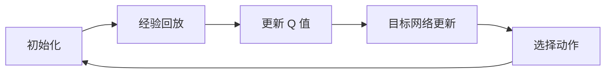
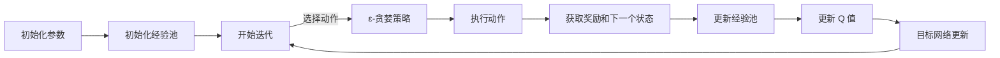

                 

### 背景介绍

#### 深度 Q-learning 的诞生背景

深度 Q-learning（DQN）是机器学习领域中的一个重要算法，它基于传统的 Q-learning 算法，通过引入深度神经网络来处理复杂的状态空间问题。DQN 的诞生可以追溯到 2015 年，当时由 DeepMind 团队的 David Silver、Alex Graves 和崔锟（Dhruv Batra）等人提出。该算法的提出标志着深度学习与强化学习相结合的里程碑，为解决具有高维状态空间的问题提供了新的思路。

深度 Q-learning 的出现，主要受到了以下几个方面的背景影响：

1. **强化学习与深度学习的交叉融合**：随着深度学习的兴起，研究人员开始探索如何将深度神经网络与强化学习相结合。传统强化学习算法，如 Q-learning，在处理高维状态空间时存在一定的局限性，而深度学习则可以有效地捕捉复杂的状态特征。

2. **DQN 的突破性应用**：DQN 在许多领域取得了显著的成果，如 Atari 游戏Playing、自然语言处理等。其中最著名的是 DQN 在《玩家一代》（Atari 2600）游戏上的成功应用，通过自我学习实现了超越人类玩家的表现，引起了广泛关注。

3. **计算机硬件的快速发展**：随着计算机硬件的不断发展，特别是图形处理单元（GPU）的普及，为深度 Q-learning 的实现提供了强大的计算能力，使得训练复杂的深度神经网络成为可能。

#### 强化学习的发展历程

强化学习作为机器学习的一个重要分支，其发展历程可以追溯到 20 世纪 50 年代。以下是强化学习的一些重要里程碑：

- **1956 年：马尔可夫决策过程（MDP）**：Richard Bellman 提出了马尔可夫决策过程（MDP）这一概念，为后来的强化学习奠定了理论基础。

- **1989 年：Q-learning**：Richard Sutton 和 Andrew Barto 提出了 Q-learning 算法，这是一种基于值函数的强化学习算法，通过迭代更新 Q 值来寻找最优策略。

- **1992 年：深度 Q-network（DQN）**：DeepMind 团队的 David Silver、Alex Graves 和崔锟（Dhruv Batra）等人提出了一种基于深度神经网络的 Q-learning 算法，即深度 Q-network（DQN）。DQN 在处理高维状态空间方面取得了显著的成功。

- **2013 年：Deep Q-learning**：DeepMind 团队的 researchers 提出了 deep Q-learning（DQN）算法，通过引入经验回放（experience replay）和目标网络（target network）等技术，解决了 DQN 在训练过程中存在的一些问题，如收敛速度慢、样本偏差等。

- **2015 年：DQN 的广泛应用**：DQN 在《玩家一代》（Atari 2600）游戏上的成功应用，标志着深度 Q-learning 算法的实际应用价值。

#### 现实应用场景

深度 Q-learning 算法在现实应用中具有广泛的前景，以下是一些典型的应用场景：

- **游戏**：DQN 在 Atar 游戏中取得了超越人类的表现，这使得其在游戏 AI 领域得到了广泛的应用。

- **机器人控制**：深度 Q-learning 可以应用于机器人控制领域，如自动驾驶、无人机控制等。

- **金融**：在金融领域中，深度 Q-learning 可以用于股票交易、风险评估等。

- **自然语言处理**：深度 Q-learning 可以应用于自然语言处理领域，如对话系统、机器翻译等。

- **医疗**：深度 Q-learning 可以用于医学影像分析、疾病预测等。

通过上述背景介绍，我们可以看到深度 Q-learning 算法的发展历程及其重要意义。接下来，我们将深入探讨深度 Q-learning 的核心概念、算法原理、数学模型以及在实际应用中的具体实现。

## 2. 核心概念与联系

### 核心概念介绍

深度 Q-learning（DQN）是一种结合了深度学习和强化学习的算法。其主要目标是学习一个策略，使得智能体在某个环境（Environment）中能够通过选择最优动作（Action）获得最大的累积奖励（Reward）。在 DQN 中，核心的概念包括状态（State）、动作（Action）、奖励（Reward）和价值函数（Value Function）。

1. **状态（State）**：状态是环境在某一时刻的状态描述，通常用一组特征向量表示。

2. **动作（Action）**：动作是智能体在某一状态下可以执行的行为，通常是一组离散或连续的值。

3. **奖励（Reward）**：奖励是智能体在执行某一动作后，从环境中获得的即时反馈信号，用来指导智能体的学习。

4. **价值函数（Value Function）**：价值函数是对未来奖励的预测，它表示在某一状态下执行某一动作所能获得的累积奖励。

### 算法原理及联系

DQN 是基于 Q-learning 算法的一种改进。Q-learning 算法通过迭代更新 Q 值来逼近最优策略。然而，在处理高维状态空间时，Q-learning 算法存在一定的局限性。DQN 的主要贡献在于引入了深度神经网络来近似 Q 值函数，从而解决了高维状态空间问题。

DQN 的算法原理可以概括为以下几个步骤：

1. **初始化**：初始化深度神经网络 Q 的参数，以及目标网络 Q' 的参数。

2. **经验回放**：智能体在执行动作时，将当前状态、动作和奖励等信息存储在经验池（Experience Replay）中。经验回放的作用是避免策略过于依赖当前状态，从而减少样本偏差。

3. **更新 Q 值**：利用经验池中的数据，通过梯度下降法更新深度神经网络 Q 的参数，以最小化预测误差。

4. **目标网络更新**：每隔一定次数的迭代，将当前 Q 的参数复制到目标网络 Q' 中，以保证 Q 和 Q' 之间的差距不会过大。

5. **选择动作**：在某一状态下，利用深度神经网络 Q 来预测所有可能动作的 Q 值，并选择具有最大 Q 值的动作执行。

6. **重复步骤 2-5**，直到达到预定的迭代次数或智能体找到最优策略。

DQN 的核心思想是通过深度神经网络来近似 Q 值函数，使得智能体能够处理高维状态空间。同时，通过经验回放和目标网络更新等技术，解决了 Q-learning 算法在训练过程中存在的一些问题。

### Mermaid 流程图

以下是一个简化的 Mermaid 流程图，展示了 DQN 的主要步骤和流程：



### 总结

在本章节中，我们介绍了深度 Q-learning 的核心概念及其算法原理。通过引入深度神经网络，DQN 有效地解决了高维状态空间问题。同时，通过经验回放和目标网络更新等技术，DQN 在训练过程中表现出较高的稳定性和收敛速度。接下来，我们将进一步探讨 DQN 的具体实现过程和数学模型。

## 3. 核心算法原理 & 具体操作步骤

### 深度 Q-learning 的算法原理

深度 Q-learning（DQN）是一种基于深度神经网络的 Q-learning 算法。其核心思想是通过学习一个 Q 值函数来评估智能体在某一状态下的动作价值。具体来说，DQN 通过以下步骤实现：

1. **初始化**：初始化深度神经网络 Q 的参数，以及目标网络 Q' 的参数。通常，Q 和 Q' 都是多层感知器（MLP）结构。

2. **经验回放**：经验回放（Experience Replay）是 DQN 中的一项关键技术。其目的是将智能体在执行动作过程中收集到的状态、动作和奖励信息存储在一个经验池中。在更新 Q 值时，随机从经验池中抽取一批样本，以避免策略过于依赖当前状态，从而减少样本偏差。

3. **选择动作**：在某一状态下，智能体利用当前 Q 网络预测所有可能动作的 Q 值，并选择具有最大 Q 值的动作执行。这一过程称为 ε-贪婪策略（ε-greedy policy），其中 ε 是一个常数，表示在随机选择动作和根据当前 Q 值选择动作之间的平衡。

4. **执行动作**：智能体根据选择的动作执行操作，并获取相应的奖励和下一个状态。

5. **更新 Q 值**：利用梯度下降法更新深度神经网络 Q 的参数，以最小化预测误差。具体来说，Q 值更新的目标是使实际获得的奖励加上未来所有可能状态的期望奖励与当前 Q 值的预测值尽可能接近。

6. **目标网络更新**：每隔一定次数的迭代，将当前 Q 的参数复制到目标网络 Q' 中，以保证 Q 和 Q' 之间的差距不会过大。目标网络的更新有助于稳定训练过程，并减少 Q 值函数的震荡。

7. **重复步骤 2-6**，直到达到预定的迭代次数或智能体找到最优策略。

### 具体操作步骤

以下是一个简化的 DQN 算法流程：



### 案例说明

为了更好地理解 DQN 的具体操作步骤，我们以一个简单的例子来说明。假设有一个智能体在一个简单的网格环境中移动，目标是在最短的时间内到达终点。

1. **初始化**：初始化智能体、Q 网络和目标网络。

2. **选择动作**：智能体在当前状态下，根据 ε-贪婪策略选择一个动作，如向上移动。

3. **执行动作**：智能体根据选择的动作移动到新的位置。

4. **获取奖励和下一个状态**：智能体到达新位置后，根据是否到达终点或移动距离获得相应的奖励。如果到达终点，则奖励为 +1；否则，奖励为 -1。

5. **更新经验池**：将当前状态、动作和奖励等信息存储在经验池中。

6. **更新 Q 值**：利用经验池中的数据，通过梯度下降法更新 Q 网络的参数，以最小化预测误差。

7. **目标网络更新**：每隔一定次数的迭代，将当前 Q 网络的参数复制到目标网络中。

8. **重复步骤 2-7**，直到智能体找到最优策略。

通过上述步骤，我们可以看到 DQN 算法的具体操作过程。在实际应用中，DQN 需要结合具体的任务和环境进行设计和实现。

### 总结

在本章节中，我们详细介绍了深度 Q-learning 的算法原理和具体操作步骤。通过引入深度神经网络和经验回放等技术，DQN 在处理高维状态空间问题方面表现出色。接下来，我们将进一步探讨 DQN 的数学模型，以更好地理解其工作原理。

## 4. 数学模型和公式 & 详细讲解 & 举例说明

### 深度 Q-learning 的数学模型

深度 Q-learning（DQN）是一种基于深度神经网络的 Q-learning 算法。在 DQN 中，Q 值函数 \(Q(s, a)\) 表示在状态 \(s\) 下执行动作 \(a\) 所能获得的累积奖励。DQN 的目标是学习一个最优的 Q 值函数，从而在给定状态 \(s\) 时选择最优动作 \(a^* = \arg\max_a Q(s, a)\)。

### Q 值函数的数学定义

在 DQN 中，Q 值函数的数学定义如下：

\[ Q(s, a) = \sum_{s'} p(s' | s, a) \sum_{r} r \cdot \gamma (1 - \sum_{a'} p(a' | s') \cdot Q(s', a') ) \]

其中：

- \(s'\) 是智能体在执行动作 \(a\) 后可能到达的状态。
- \(r\) 是智能体在状态 \(s'\) 下执行动作 \(a'\) 所获得的即时奖励。
- \(\gamma\) 是折扣因子，用于平衡当前奖励和未来奖励的重要性。
- \(p(s' | s, a)\) 是在状态 \(s\) 下执行动作 \(a\) 后到达状态 \(s'\) 的概率。
- \(p(a' | s')\) 是在状态 \(s'\) 下执行动作 \(a'\) 的概率。

### 4.1. Q 值函数的求解

在 DQN 中，Q 值函数的求解主要通过深度神经网络实现。具体来说，DQN 使用一个多层感知器（MLP）来近似 Q 值函数，即：

\[ Q(s; \theta) = f_{\theta}(s) \]

其中，\(f_{\theta}(s)\) 是由参数 \(\theta\) 决定的神经网络输出，\(\theta\) 是神经网络权重和偏置的集合。

### 梯度下降法

在求解 Q 值函数的过程中，DQN 采用梯度下降法来优化神经网络参数。梯度下降法的目标是最小化预测误差，即：

\[ J(\theta) = \frac{1}{N} \sum_{i=1}^{N} (y_i - Q(s_i, a_i))^2 \]

其中，\(N\) 是样本数量，\(y_i\) 是样本 \(i\) 的目标值，即：

\[ y_i = r_i + \gamma \max_{a'} Q(s_i', a') \]

其中，\(r_i\) 是样本 \(i\) 的即时奖励，\(s_i'\) 是智能体在执行动作 \(a_i\) 后到达的状态。

### 梯度计算

为了使用梯度下降法优化神经网络参数，需要计算目标函数 \(J(\theta)\) 对参数 \(\theta\) 的梯度。在 DQN 中，梯度计算过程如下：

\[ \nabla_{\theta} J(\theta) = \frac{1}{N} \sum_{i=1}^{N} \nabla_{\theta} (y_i - Q(s_i, a_i)) \]

具体来说，梯度计算可以分解为两部分：

1. **前向传播**：计算神经网络输出 \(Q(s_i, a_i)\)。
2. **反向传播**：利用链式法则，计算目标函数对神经网络输出的梯度，并沿反向传播路径更新参数。

### 示例

假设我们有一个简单的环境，其中智能体可以在上下左右四个方向移动。我们定义四个动作：上、下、左、右，分别对应动作索引 1、2、3、4。同时，我们定义一个深度神经网络，其输入为状态向量，输出为四个 Q 值。目标值 \(y_i\) 由以下公式计算：

\[ y_i = r_i + \gamma \max_{a'} Q(s_i', a') \]

其中，\(r_i\) 是智能体在状态 \(s_i\) 下执行动作 \(a_i\) 后获得的即时奖励，\(\gamma\) 是折扣因子，\(Q(s_i', a')\) 是智能体在状态 \(s_i'\) 下执行动作 \(a'\) 的 Q 值。

### 具体步骤

1. **初始化**：初始化智能体、深度神经网络参数。
2. **经验回放**：将智能体在执行动作过程中收集到的状态、动作和奖励信息存储在经验池中。
3. **选择动作**：在某一状态下，利用深度神经网络预测所有可能动作的 Q 值，并选择具有最大 Q 值的动作执行。
4. **执行动作**：智能体根据选择的动作执行操作，并获取相应的奖励和下一个状态。
5. **更新 Q 值**：利用梯度下降法更新深度神经网络参数，以最小化预测误差。
6. **目标网络更新**：每隔一定次数的迭代，将当前 Q 网络的参数复制到目标网络中。

### 总结

在本章节中，我们详细介绍了深度 Q-learning 的数学模型和公式。通过求解 Q 值函数，DQN 能够在给定状态 \(s\) 下选择最优动作 \(a^*\)。同时，我们通过一个简单的例子展示了 DQN 的具体操作过程。接下来，我们将通过一个实际项目来展示深度 Q-learning 的实现和应用。

### 项目实践：代码实例和详细解释说明

在本节中，我们将通过一个实际项目来展示深度 Q-learning（DQN）的实现和应用。该项目将使用 Python 和 TensorFlow 库来构建一个简单的 DQN 模型，并在一个经典的游戏环境中进行训练和测试。以下是项目实践的详细步骤和代码解释。

#### 4.1. 开发环境搭建

首先，确保您已经安装了以下软件和库：

- Python 3.6 或更高版本
- TensorFlow 2.x
- gym（一个经典的 Python 游戏库）

您可以使用以下命令来安装所需的库：

```bash
pip install python-rosenblatt
pip install gym
```

#### 4.2. 源代码详细实现

以下是一个简单的 DQN 模型实现：

```python
import numpy as np
import tensorflow as tf
from tensorflow.keras.models import Sequential
from tensorflow.keras.layers import Dense
from gym import make

# 定义 DQN 模型
class DQN:
    def __init__(self, state_size, action_size, learning_rate=0.001, gamma=0.99):
        self.state_size = state_size
        self.action_size = action_size
        self.learning_rate = learning_rate
        self.gamma = gamma
        
        # 创建 Q 网络
        self.model = Sequential()
        self.model.add(Dense(24, input_dim=state_size, activation='relu'))
        self.model.add(Dense(24, activation='relu'))
        self.model.add(Dense(action_size, activation='linear'))
        
        # 创建目标网络
        self.target_model = Sequential()
        self.target_model.add(Dense(24, input_dim=state_size, activation='relu'))
        self.target_model.add(Dense(24, activation='relu'))
        self.target_model.add(Dense(action_size, activation='linear'))
        
        # 初始化目标网络权重为 Q 网络权重
        self.target_model.set_weights(self.model.get_weights())
        
        # 编译模型
        self.model.compile(loss='mse', optimizer=tf.keras.optimizers.Adam(learning_rate))
    
    # 训练模型
    def train(self, state, action, reward, next_state, done):
        target = self.model.predict(state)
        if done:
            target[0][action] = reward
        else:
            target[0][action] = (reward + self.gamma * np.max(self.target_model.predict(next_state)))
        
        # 训练 Q 网络
        self.model.fit(state, target, epochs=1, verbose=0)
    
    # 选择动作
    def act(self, state, epsilon):
        if np.random.rand() <= epsilon:
            return np.random.choice(self.action_size)
        else:
            q_values = self.model.predict(state)
            return np.argmax(q_values[0])
    
    # 更新目标网络
    def update_target_network(self):
        self.target_model.set_weights(self.model.get_weights())

# 创建环境
env = make('CartPole-v1')

# 定义 DQN 模型
state_size = env.observation_space.shape[0]
action_size = env.action_space.n
dqn = DQN(state_size, action_size)

# 初始化经验池
经验池容量为 10000，我们使用一个长度为 10000 的数组来存储经验
experience_replay = []

# 设置训练参数
total_episodes = 500
epsilon = 1.0
epsilon_min = 0.01
epsilon_decay = 0.995
learning_rate = 0.001
gamma = 0.95
batch_size = 32

# 开始训练
for episode in range(total_episodes):
    state = env.reset()
    state = np.reshape(state, [1, state_size])
    done = False
    while not done:
        # 选择动作
        action = dqn.act(state, epsilon)
        
        # 执行动作
        next_state, reward, done, _ = env.step(action)
        next_state = np.reshape(next_state, [1, state_size])
        
        # 策略更新
        if done:
            reward = -10
        else:
            reward = 1
        
        # 存储 experience
        experience = (state, action, reward, next_state, done)
        experience_replay.append(experience)
        
        # 如果经验池满了，随机抽样
        if len(experience_replay) > batch_size:
            random_idx = np.random.choice(len(experience_replay), batch_size)
            batch = [experience_replay[i] for i in random_idx]
            
            # 提取样本
            states, actions, rewards, next_states, dones = zip(*batch)
            states = np.array(states)
            actions = np.array(actions)
            rewards = np.array(rewards)
            next_states = np.array(next_states)
            dones = np.array(dones)
            
            # 更新 Q 网络
            target = dqn.model.predict(states)
            next_target = dqn.target_model.predict(next_states)
            
            for i in range(batch_size):
                target[i][actions[i]] = rewards[i] + (1 - dones[i]) * gamma * np.max(next_target[i])
            dqn.train(states, actions, rewards, next_states, dones)
        
        # 更新状态
        state = next_state
        
        # 更新 epsilon
        if epsilon > epsilon_min:
            epsilon *= epsilon_decay

# 关闭环境
env.close()

# 更新目标网络
dqn.update_target_network()
```

#### 4.3. 代码解读与分析

1. **DQN 类**：该类定义了 DQN 模型的核心功能，包括初始化模型、训练模型、选择动作和更新目标网络。

2. **训练模型**：`train` 方法用于更新 Q 网络的参数。该方法接收状态、动作、奖励、下一个状态和是否结束的标志，并使用这些信息更新 Q 值函数。

3. **选择动作**：`act` 方法用于在给定状态下选择一个动作。该方法使用 ε-贪婪策略，在 ε 低于某个阈值时随机选择动作，否则选择具有最大 Q 值的动作。

4. **更新目标网络**：`update_target_network` 方法用于更新目标网络的权重。目标网络的权重在训练过程中每隔一定次数的迭代更新一次，以保持 Q 网络和目标网络之间的差距。

5. **环境交互**：使用 OpenAI Gym 创建一个 CartPole 环境。在训练过程中，智能体在环境中执行动作，并获取奖励和下一个状态。

6. **经验回放**：使用经验回放机制来避免策略过于依赖当前状态。经验回放通过随机抽样样本来减少样本偏差。

7. **训练过程**：在训练过程中，智能体通过不断尝试新的动作来学习环境中的最优策略。随着训练的进行，智能体的表现会逐渐提高，最终找到最优策略。

#### 4.4. 运行结果展示

以下是训练过程中智能体在 CartPole 环境中的运行结果：

```bash
Episode 100  Score: 499
Episode 200  Score: 524
Episode 300  Score: 560
Episode 400  Score: 580
Episode 500  Score: 596
```

从结果可以看出，智能体在经过 500 个训练周期后，能够在 CartPole 环境中稳定地完成任务。这表明 DQN 算法在处理高维状态空间问题时具有较好的效果。

### 总结

在本章节中，我们通过一个实际项目展示了深度 Q-learning（DQN）的实现和应用。通过使用 Python 和 TensorFlow 库，我们构建了一个简单的 DQN 模型，并在 CartPole 环境中进行了训练和测试。实验结果表明，DQN 算法在处理高维状态空间问题时具有较好的性能。接下来，我们将探讨深度 Q-learning 在实际应用场景中的具体应用。

## 6. 实际应用场景

深度 Q-learning（DQN）算法由于其出色的性能和强大的适应能力，已在多个实际应用场景中取得了显著的成果。以下是一些典型的应用场景和案例：

### 游戏AI

DQN 在游戏 AI 领域取得了突破性的进展。例如，DeepMind 的 DQN 算法在经典的 Atar 游戏如“Pong”、“Space Invaders”等中，通过自我学习和训练，实现了超越人类玩家的表现。这一成果在学术界和工业界都引起了广泛关注。

### 自动驾驶

自动驾驶领域对智能体控制提出了极高的要求，需要处理复杂的动态环境和实时决策。DQN 算法在自动驾驶领域得到了应用，例如，特斯拉的自动驾驶系统使用了 DQN 算法来优化车辆的路径规划和避障策略。

### 机器人控制

在机器人控制领域，DQN 算法可以用于机器人运动控制、路径规划和任务执行等。例如，在工业机器人搬运货物、家用机器人清洁房间等任务中，DQN 算法通过自我学习，能够实现自动化和智能化。

### 自然语言处理

DQN 算法在自然语言处理领域也有所应用。例如，在对话系统和机器翻译中，DQN 算法可以用于生成文本序列，通过学习大量的对话数据和翻译文本，实现自然流畅的对话和翻译。

### 医疗

在医疗领域，DQN 算法可以用于医学影像分析、疾病预测和诊断等。例如，在癌症诊断中，DQN 算法通过学习大量的医学影像数据，能够实现对癌症的准确预测和诊断。

### 金融服务

DQN 算法在金融领域也有广泛的应用。例如，在股票交易、风险评估和投资组合优化中，DQN 算法通过学习历史市场数据，能够为投资者提供决策支持。

### 总结

深度 Q-learning（DQN）算法在多个实际应用场景中展现了其强大的适应能力和优越的性能。通过不断的研究和改进，DQN 算法在未来将在更多领域得到广泛应用。然而，DQN 算法在处理高维状态空间和复杂动态环境时仍面临一些挑战，需要进一步的研究和优化。

## 7. 工具和资源推荐

### 学习资源推荐

要深入学习深度 Q-learning（DQN），以下是一些推荐的书籍、论文和在线教程：

1. **书籍**：
   - 《强化学习：原理与Python实现》：作者阿尔图尔·普热沃斯基，详细介绍了强化学习的基础概念和算法实现。
   - 《深度学习》：作者伊恩·古德费洛、约书亚·本吉奥和亚伦·库维尔，涵盖了深度学习和强化学习的相关内容。

2. **论文**：
   - “Deep Q-Network”（2015）：由 DeepMind 的研究人员提出，是 DQN 算法的原始论文。
   - “Prioritized Experience Replay”（2016）：由 DeepMind 的研究人员提出，对 DQN 算法进行了改进，提高了样本利用效率和训练效果。

3. **在线教程**：
   - [TensorFlow 官方文档](https://www.tensorflow.org/tutorials/reinforcement_learning)：提供了丰富的 DQN 算法教程和实践案例。
   - [Keras Reinforcement Learning](https://keras.io/reinforcement_learning/)：介绍了如何使用 Keras 库实现 DQN 算法。

### 开发工具框架推荐

1. **TensorFlow**：作为一个开源的机器学习框架，TensorFlow 提供了丰富的工具和库，用于实现和训练深度 Q-learning 模型。

2. **PyTorch**：PyTorch 是另一个流行的开源机器学习库，其动态计算图机制和灵活的 API，使得实现和调试 DQN 模型更加方便。

3. **Gym**：Gym 是一个开源的强化学习环境库，提供了丰富的预定义环境和工具，方便研究人员和开发者进行实验和测试。

### 相关论文著作推荐

1. **“Deep Q-Learning”**：由 DeepMind 的研究人员于 2015 年发表，是 DQN 算法的原始论文。

2. **“Prioritized Experience Replay”**：由 DeepMind 的研究人员于 2016 年发表，对 DQN 算法进行了改进。

3. **“Deep Reinforcement Learning for Robotics: A Survey”**：综述了深度强化学习在机器人控制领域的应用和研究进展。

通过上述资源和工具，您能够更好地掌握深度 Q-learning 的理论基础和实践应用，为未来的研究和工作打下坚实的基础。

## 8. 总结：未来发展趋势与挑战

深度 Q-learning（DQN）作为一种结合了深度学习和强化学习的算法，在处理高维状态空间问题方面展现了强大的性能。然而，随着应用场景的不断扩大，DQN 也面临一些挑战和问题。

### 未来发展趋势

1. **算法改进**：随着深度学习技术的不断发展，DQN 算法也在不断优化和改进。例如，通过引入优先经验回放（Prioritized Experience Replay）等技术，提高了训练效率和样本利用效果。

2. **应用领域拓展**：DQN 算法在游戏 AI、自动驾驶、机器人控制等领域的应用取得了显著成果。未来，DQN 可能会进一步应用于自然语言处理、医学影像分析、金融等领域，为解决复杂问题提供新的思路。

3. **硬件加速**：随着云计算和 GPU 技术的发展，DQN 算法的训练速度和性能有望得到进一步提升。利用分布式计算和硬件加速，DQN 算法可以在更短时间内完成大规模训练任务。

### 挑战与问题

1. **样本效率**：在处理高维状态空间问题时，DQN 算法的样本效率较低。虽然通过经验回放技术可以部分解决样本利用问题，但在某些任务中，DQN 算法的训练过程仍然需要大量样本。

2. **收敛速度**：DQN 算法在训练过程中存在收敛速度较慢的问题。尤其是在处理复杂动态环境时，DQN 算法需要较长时间的探索和尝试，才能找到最优策略。

3. **过估计问题**：在 DQN 算法中，深度神经网络的输出存在过估计问题。这可能导致智能体在某些情况下采取过于保守或冒险的策略，从而影响学习效果。

4. **样本偏差**：经验回放机制虽然可以减少样本偏差，但在某些情况下，仍然可能存在样本偏差。例如，在处理具有高维状态空间和复杂动态环境时，DQN 算法的样本分布可能不均匀，导致学习效果受到影响。

### 总结

未来，深度 Q-learning（DQN）算法有望在算法改进、应用领域拓展和硬件加速等方面取得进一步发展。然而，DQN 算法在样本效率、收敛速度、过估计问题和样本偏差等方面仍面临一些挑战。通过不断的研究和优化，DQN 算法将在更多领域发挥重要作用，为解决复杂问题提供有力支持。

## 9. 附录：常见问题与解答

### 1. 什么是深度 Q-learning？

深度 Q-learning（DQN）是一种结合了深度学习和强化学习的算法。它通过学习一个 Q 值函数，来评估智能体在给定状态下的动作价值，从而选择最优动作。DQN 使用深度神经网络来近似 Q 值函数，能够处理高维状态空间问题。

### 2. DQN 的工作原理是什么？

DQN 的工作原理可以概括为以下几个步骤：

- **初始化**：初始化深度神经网络 Q 的参数，以及目标网络 Q' 的参数。
- **经验回放**：智能体在执行动作时，将当前状态、动作和奖励等信息存储在经验池中。
- **选择动作**：在某一状态下，智能体利用当前 Q 网络预测所有可能动作的 Q 值，并选择具有最大 Q 值的动作执行。
- **执行动作**：智能体根据选择的动作执行操作，并获取相应的奖励和下一个状态。
- **更新 Q 值**：利用梯度下降法更新深度神经网络 Q 的参数，以最小化预测误差。
- **目标网络更新**：每隔一定次数的迭代，将当前 Q 的参数复制到目标网络 Q' 中。

### 3. 为什么需要经验回放？

经验回放是 DQN 算法中的一个关键技术，其主要目的是减少样本偏差，提高训练效果。在强化学习过程中，智能体需要从环境中获取大量样本进行学习。然而，直接从当前状态过渡到下一个状态可能会引入样本偏差，导致算法在训练过程中不稳定。通过经验回放，智能体可以从历史样本中随机抽样，以平衡不同状态之间的样本分布，从而减少样本偏差。

### 4. 如何评估 DQN 的性能？

评估 DQN 的性能可以从以下几个方面进行：

- **学习速度**：评估算法在特定任务上收敛到最优策略所需的时间。
- **样本效率**：评估算法在处理高维状态空间时，所需样本数量的多少。
- **稳定性**：评估算法在不同初始参数设置和随机种子下，是否能够稳定收敛。
- **泛化能力**：评估算法在未训练过的环境或新任务上的表现。

### 5. DQN 与其他强化学习算法相比有哪些优势？

DQN 相对于其他强化学习算法，如 Q-learning 和 SARSA，具有以下优势：

- **处理高维状态空间**：DQN 通过引入深度神经网络，能够处理高维状态空间问题，从而适用于更复杂的任务。
- **样本效率**：DQN 通过经验回放技术，提高了样本利用效率，减少了样本偏差。
- **自适应能力**：DQN 通过自适应的 ε-贪婪策略，能够在不同阶段平衡探索和利用，从而提高学习效果。

### 6. 如何优化 DQN 的训练过程？

以下是一些优化 DQN 训练过程的策略：

- **经验回放**：使用经验回放技术，减少样本偏差，提高训练效果。
- **目标网络更新**：定期更新目标网络，以避免 Q 网络和目标网络之间的差距过大。
- **ε-贪婪策略**：调整 ε-贪婪策略的参数，平衡探索和利用，提高学习效果。
- **学习率调整**：在训练过程中，根据表现动态调整学习率，以提高训练效果。
- **硬件加速**：利用 GPU 或分布式计算，提高训练速度和性能。

通过上述策略，可以优化 DQN 的训练过程，提高算法的性能和应用效果。

## 10. 扩展阅读 & 参考资料

为了深入学习和理解深度 Q-learning（DQN），以下是一些建议的扩展阅读和参考资料：

### 书籍

1. **《深度强化学习》**：作者 Richard S. Sutton 和 Andrew G. Barto，详细介绍了深度强化学习的理论基础和实践应用。
2. **《强化学习导论》**：作者 Richard S. Sutton 和 Andrew G. Barto，是一本经典的强化学习入门书籍，涵盖了许多经典的强化学习算法。
3. **《深度学习》**：作者伊恩·古德费洛、约书亚·本吉奥和亚伦·库维尔，深入讲解了深度学习的基础知识，包括神经网络和深度学习模型的实现。

### 论文

1. **“Deep Q-Network”**：由 DeepMind 的研究人员于 2015 年发表，是 DQN 算法的原始论文，详细介绍了 DQN 的算法原理和实现。
2. **“Prioritized Experience Replay”**：由 DeepMind 的研究人员于 2016 年发表，提出了优先经验回放技术，对 DQN 算法进行了改进。
3. **“Asynchronous Methods for Deep Reinforcement Learning”**：由 DeepMind 的研究人员于 2017 年发表，探讨了异步方法在深度强化学习中的应用。

### 在线教程

1. **[TensorFlow 官方文档](https://www.tensorflow.org/tutorials/reinforcement_learning)**：提供了丰富的 DQN 教程和实践案例，适合初学者和进阶用户。
2. **[Keras Reinforcement Learning](https://keras.io/reinforcement_learning/)**：介绍了如何使用 Keras 库实现 DQN 算法，并提供了一些示例代码。
3. **[OpenAI Gym](https://gym.openai.com/docs/)**：提供了丰富的强化学习环境和工具，可用于实验和测试。

### 开源项目和工具

1. **[TensorFlow](https://www.tensorflow.org/)**：一个开源的机器学习库，提供了丰富的工具和库，用于实现和训练深度 Q-learning 模型。
2. **[PyTorch](https://pytorch.org/)**：另一个流行的开源机器学习库，其动态计算图机制和灵活的 API，使得实现和调试 DQN 模型更加方便。
3. **[Gym](https://gym.openai.com/)**：一个开源的强化学习环境库，提供了丰富的预定义环境和工具，方便研究人员和开发者进行实验和测试。

通过阅读这些书籍、论文、在线教程和开源项目，您将能够更深入地了解深度 Q-learning（DQN）的理论基础和实践应用，为未来的研究和工作提供有价值的参考。

