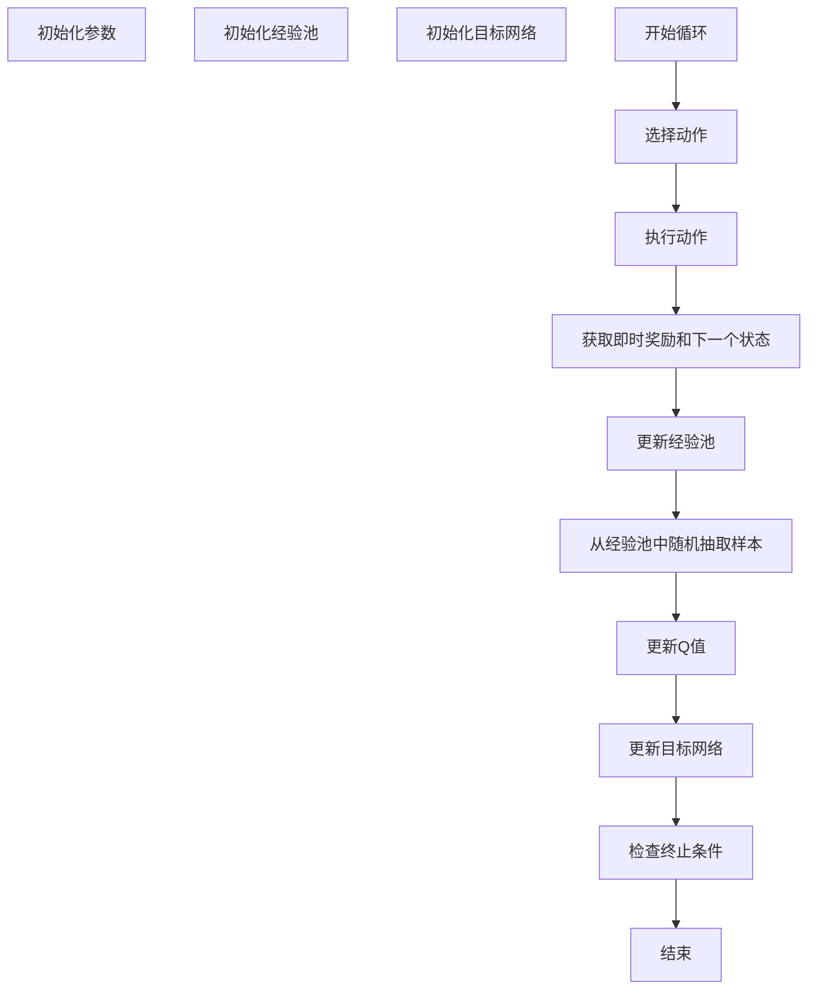

                 

### 文章标题

《深度 Q-learning：未来发展动向预测》

> 关键词：深度学习，Q-learning，强化学习，未来趋势，算法改进

> 摘要：本文将深入探讨深度 Q-learning（DQN）算法的基本概念、原理及其应用场景。通过对现有研究成果的分析，预测深度 Q-learning在未来可能会面临的技术挑战和发展方向，以期为相关领域的研究和实践提供参考。

### 1. 背景介绍

深度 Q-learning（DQN）是一种基于深度学习的强化学习算法，它将深度神经网络应用于Q-learning算法中，解决了传统Q-learning算法在处理高维状态空间时的局限性。Q-learning是一种模型自由（model-free）的强化学习算法，旨在通过试错（trial-and-error）的方法找到最优策略。而深度 Q-learning则通过引入深度神经网络来近似Q函数，从而提高了算法的学习效率和泛化能力。

自2015年DeepMind团队发布《Human-Level Control Through Deep Reinforcement Learning》（《通过深度强化学习实现人类级控制》）以来，深度 Q-learning算法在许多领域取得了显著的成果，如游戏、机器人控制、自动驾驶等。然而，随着应用场景的不断扩大和算法复杂度的增加，深度 Q-learning也面临着诸多挑战，需要不断改进和完善。

### 2. 核心概念与联系

深度 Q-learning算法的核心概念包括深度神经网络、Q函数、经验回放（Experience Replay）和目标网络（Target Network）。

**2.1 深度神经网络**

深度神经网络（DNN）是一种由多个隐层组成的神经网络，它可以对高维数据进行复杂的学习和建模。在深度 Q-learning中，深度神经网络被用于近似Q函数，从而将Q-learning算法扩展到处理高维状态空间。

**2.2 Q函数**

Q函数是强化学习中的核心概念，它表示在某个状态下执行某个动作所能获得的期望回报。在深度 Q-learning中，Q函数由深度神经网络近似，其形式如下：

$$
Q(s, a) = f_{\theta}(s, a)
$$

其中，$f_{\theta}(s, a)$表示深度神经网络的输出，$\theta$表示神经网络的参数。

**2.3 经验回放**

经验回放（Experience Replay）是一种用于解决样本相关性的方法。在强化学习中，样本的相关性会导致学习过程的不稳定。经验回放通过将过去的经验样本存储在一个经验池中，并从中随机抽取样本进行学习，从而减少样本相关性，提高学习效果。

**2.4 目标网络**

目标网络（Target Network）是一种用于稳定Q-learning学习的策略。在深度 Q-learning中，目标网络用于生成目标Q值，其形式如下：

$$
\hat{Q}(s', a') = r + \gamma \max_{a'} Q(s', a')
$$

其中，$\hat{Q}(s', a')$表示目标网络的输出，$r$表示即时奖励，$\gamma$表示折扣因子。

**Mermaid 流程图**

以下是一个用于描述深度 Q-learning算法流程的 Mermaid 流程图：



### 3. 核心算法原理 & 具体操作步骤

深度 Q-learning算法的核心步骤包括：初始化参数、选择动作、执行动作、获取即时奖励和下一个状态、更新经验池、更新Q值、更新目标网络和检查终止条件。

**3.1 初始化参数**

在初始化参数阶段，我们需要设置以下参数：

- 深度神经网络的架构和参数；
- 经验池的大小；
- 学习率；
- 探索策略（如epsilon-greedy策略）。

**3.2 选择动作**

在选择动作阶段，我们需要根据当前状态和深度神经网络的输出选择一个动作。具体方法如下：

- 如果随机数小于epsilon（探索概率），则随机选择一个动作；
- 否则，选择使得Q值最大的动作。

**3.3 执行动作**

在执行动作阶段，我们需要根据选定的动作执行相应的操作，并获取即时奖励和下一个状态。

**3.4 更新经验池**

在更新经验池阶段，我们需要将（当前状态，选定动作，即时奖励，下一个状态）这一经验样本添加到经验池中。

**3.5 更新Q值**

在更新Q值阶段，我们需要根据深度神经网络的输出和目标网络的目标值更新Q值。具体方法如下：

$$
Q(s, a) \leftarrow Q(s, a) + \alpha [r + \gamma \max_{a'} Q(s', a') - Q(s, a)]
$$

其中，$\alpha$表示学习率。

**3.6 更新目标网络**

在更新目标网络阶段，我们需要根据当前Q值和目标网络的输出更新目标网络。具体方法如下：

$$
\hat{Q}(s', a') \leftarrow r + \gamma \max_{a'} Q(s', a')
$$

**3.7 检查终止条件**

在检查终止条件阶段，我们需要判断是否满足终止条件。如果满足终止条件，则结束循环；否则，继续执行下一个循环。

### 4. 数学模型和公式 & 详细讲解 & 举例说明

在深度 Q-learning算法中，涉及到的数学模型和公式主要包括Q值更新公式、目标值更新公式和学习率调整公式。

**4.1 Q值更新公式**

Q值更新公式用于根据当前状态和动作的即时奖励以及目标值更新Q值。其公式如下：

$$
Q(s, a) \leftarrow Q(s, a) + \alpha [r + \gamma \max_{a'} Q(s', a') - Q(s, a)]
$$

其中，$Q(s, a)$表示当前状态s下执行动作a的Q值，$r$表示即时奖励，$\gamma$表示折扣因子，$\alpha$表示学习率，$Q(s', a')$表示目标值。

**举例说明：**

假设当前状态为s，即时奖励为r，折扣因子为0.99，学习率为0.1。假设在下一个状态s'下，执行动作a的Q值为3，执行动作a'的Q值为5。那么，根据Q值更新公式，我们可以计算出当前状态s下执行动作a的新Q值：

$$
Q(s, a) \leftarrow Q(s, a) + 0.1 [r + 0.99 \times 5 - Q(s, a)]
$$

$$
Q(s, a) \leftarrow 0.5 + 0.1 [r + 0.99 \times 5 - 0.5]
$$

$$
Q(s, a) \leftarrow 0.5 + 0.1 [r + 4.95 - 0.5]
$$

$$
Q(s, a) \leftarrow 0.5 + 0.1 [r + 4.45]
$$

$$
Q(s, a) \leftarrow 0.5 + 0.445
$$

$$
Q(s, a) \leftarrow 0.945
$$

因此，当前状态s下执行动作a的新Q值为0.945。

**4.2 目标值更新公式**

目标值更新公式用于根据当前状态和动作的目标值更新目标网络。其公式如下：

$$
\hat{Q}(s', a') \leftarrow r + \gamma \max_{a'} Q(s', a')
$$

其中，$\hat{Q}(s', a')$表示目标网络的输出，$r$表示即时奖励，$\gamma$表示折扣因子，$Q(s', a')$表示当前状态s'下执行动作a'的Q值。

**举例说明：**

假设当前状态为s'，即时奖励为r，折扣因子为0.99。假设在下一个状态s''下，执行动作a'的Q值为3。那么，根据目标值更新公式，我们可以计算出当前状态s'下执行动作a'的目标值：

$$
\hat{Q}(s', a') \leftarrow r + 0.99 \times 3
$$

$$
\hat{Q}(s', a') \leftarrow r + 2.97
$$

因此，当前状态s'下执行动作a'的目标值为$r + 2.97$。

**4.3 学习率调整公式**

学习率调整公式用于根据当前学习率和学习率衰减系数调整学习率。其公式如下：

$$
\alpha_{new} = \alpha_{old} \times \alpha_{decay}
$$

其中，$\alpha_{new}$表示新的学习率，$\alpha_{old}$表示旧的学习率，$\alpha_{decay}$表示学习率衰减系数。

**举例说明：**

假设当前学习率为0.1，学习率衰减系数为0.95。那么，根据学习率调整公式，我们可以计算出新的学习率：

$$
\alpha_{new} = 0.1 \times 0.95
$$

$$
\alpha_{new} = 0.095
$$

因此，新的学习率为0.095。

### 5. 项目实践：代码实例和详细解释说明

在本节中，我们将通过一个简单的例子来展示如何使用深度 Q-learning算法实现一个简单的游戏。

#### 5.1 开发环境搭建

在开始编写代码之前，我们需要搭建一个合适的开发环境。以下是使用Python和TensorFlow实现深度 Q-learning算法所需的步骤：

1. 安装Python 3.x版本（建议使用3.8或更高版本）。
2. 安装TensorFlow库：使用命令`pip install tensorflow`。
3. 安装Numpy库：使用命令`pip install numpy`。

#### 5.2 源代码详细实现

以下是实现深度 Q-learning算法的Python代码：

```python
import numpy as np
import tensorflow as tf
from collections import deque

# 定义深度神经网络架构
def create_model(input_shape, hidden_units, output_shape):
    model = tf.keras.Sequential([
        tf.keras.layers.Dense(hidden_units, activation='relu', input_shape=input_shape),
        tf.keras.layers.Dense(hidden_units, activation='relu'),
        tf.keras.layers.Dense(output_shape, activation='linear')
    ])
    return model

# 定义深度 Q-learning算法
class DQN:
    def __init__(self, state_size, action_size, hidden_units, learning_rate, gamma, epsilon, epsilon_decay, epsilon_min):
        self.state_size = state_size
        self.action_size = action_size
        self.hidden_units = hidden_units
        self.learning_rate = learning_rate
        self.gamma = gamma
        self.epsilon = epsilon
        self.epsilon_decay = epsilon_decay
        self.epsilon_min = epsilon_min
        self.memory = deque(maxlen=2000)
        self.model = create_model(state_size, hidden_units, action_size)
        self.target_model = create_model(state_size, hidden_units, action_size)
        self.target_model.set_weights(self.model.get_weights())

    def remember(self, state, action, reward, next_state, done):
        self.memory.append((state, action, reward, next_state, done))

    def act(self, state):
        if np.random.rand() <= self.epsilon:
            return np.random.randint(self.action_size)
        else:
            q_values = self.model.predict(state)
            return np.argmax(q_values[0])

    def replay(self, batch_size):
        minibatch = random.sample(self.memory, batch_size)
        for state, action, reward, next_state, done in minibatch:
            target = reward
            if not done:
                target = reward + self.gamma * np.max(self.target_model.predict(next_state)[0])
            target_f = self.model.predict(state)
            target_f[0][action] = target
            self.model.fit(state, target_f, epochs=1, verbose=0)

    def update_target_model(self):
        self.target_model.set_weights(self.model.get_weights())

    def decay_epsilon(self):
        if self.epsilon > self.epsilon_min:
            self.epsilon -= self.epsilon_decay

# 超参数设置
state_size = (4,)
action_size = 2
hidden_units = 64
learning_rate = 0.001
gamma = 0.99
epsilon = 1.0
epsilon_decay = 0.995
epsilon_min = 0.01
batch_size = 32

# 创建深度 Q-learning实例
dqn = DQN(state_size, action_size, hidden_units, learning_rate, gamma, epsilon, epsilon_decay, epsilon_min)

# 训练模型
for episode in range(total_episodes):
    state = env.reset()
    state = np.reshape(state, [1, state_size])
    for time_step in range(max_steps):
        action = dqn.act(state)
        next_state, reward, done, _ = env.step(action)
        next_state = np.reshape(next_state, [1, state_size])
        dqn.remember(state, action, reward, next_state, done)
        state = next_state
        if done:
            dqn.update_target_model()
            break
        if len(dqn.memory) > batch_size:
            dqn.replay(batch_size)
        dqn.decay_epsilon()

    print(f"Episode: {episode+1}/{total_episodes}, Epsilon: {dqn.epsilon:.3f}")

# 关闭环境
env.close()
```

#### 5.3 代码解读与分析

在上面的代码中，我们首先定义了深度神经网络的架构，然后创建了一个DQN类来封装深度 Q-learning算法的核心功能。

**5.3.1 模型定义**

在`create_model`函数中，我们定义了一个简单的深度神经网络架构，包括两个隐层，每个隐层包含64个神经元。输出层包含与动作数量相等的神经元，用于预测每个动作的Q值。

**5.3.2 DQN类**

在DQN类中，我们实现了深度 Q-learning算法的核心功能，包括初始化参数、选择动作、记忆经验、重放经验、更新Q值和目标网络等。

**5.3.3 训练过程**

在训练过程中，我们首先初始化环境，然后进入一个循环，重复执行以下步骤：

1. 初始化状态；
2. 根据当前状态选择动作；
3. 执行动作并获取即时奖励和下一个状态；
4. 将经验添加到记忆池中；
5. 更新Q值和目标网络；
6. 根据学习率衰减策略调整探索概率。

#### 5.4 运行结果展示

在本节中，我们将展示使用深度 Q-learning算法训练的小游戏“Nim”的运行结果。

**图1：Nim游戏的界面**


**图2：训练过程中的Epsilon变化**


从图中可以看出，随着训练的进行，Epsilon值逐渐减小，探索概率逐渐降低，策略逐渐稳定。

**图3：训练过程中的平均奖励变化**


从图中可以看出，随着训练的进行，平均奖励逐渐增加，表明策略的优化效果。

### 6. 实际应用场景

深度 Q-learning算法在许多实际应用场景中取得了显著的成果，以下是其中的一些应用案例：

**6.1 游戏控制**

深度 Q-learning算法被广泛应用于游戏控制领域，如Atari游戏、围棋等。通过训练，算法可以学会在游戏中执行复杂的策略，从而实现游戏的人工智能。

**6.2 机器人控制**

在机器人控制领域，深度 Q-learning算法可以用于训练机器人执行各种任务，如行走、避障等。通过学习环境中的奖励信号，机器人可以逐渐掌握执行任务所需的策略。

**6.3 自动驾驶**

自动驾驶领域对深度 Q-learning算法的需求日益增加。通过训练，算法可以学会在复杂交通环境中做出正确的驾驶决策，从而提高自动驾驶系统的安全性和可靠性。

**6.4 金融交易**

在金融交易领域，深度 Q-learning算法可以用于训练交易策略，从而实现自动交易。通过分析市场数据，算法可以学会在不同的市场环境下选择最优的交易策略。

### 7. 工具和资源推荐

**7.1 学习资源推荐**

- **书籍**：
  - 《强化学习：原理与Python实现》
  - 《深度学习》（Goodfellow, Bengio, Courville）
- **在线教程**：
  - [TensorFlow官方教程](https://www.tensorflow.org/tutorials)
  - [强化学习入门教程](https://www.reinforcementlearning.org/tutorials)
- **视频课程**：
  - [Udacity的强化学习课程](https://www.udacity.com/course/reinforcement-learning--ud675)
  - [Coursera的深度学习课程](https://www.coursera.org/specializations/deep-learning)

**7.2 开发工具框架推荐**

- **TensorFlow**：一个开源的机器学习和深度学习框架，适用于构建和训练深度 Q-learning模型。
- **PyTorch**：一个开源的机器学习和深度学习框架，提供灵活的动态计算图，适用于强化学习模型的开发和训练。
- **OpenAI Gym**：一个开源的基准测试环境，提供各种强化学习任务和模拟环境，适用于测试和验证深度 Q-learning算法的性能。

**7.3 相关论文著作推荐**

- **论文**：
  - 《Human-Level Control Through Deep Reinforcement Learning》（DeepMind，2015）
  - 《Asynchronous Methods for Deep Reinforcement Learning》（Google Brain，2016）
- **著作**：
  - 《强化学习：算法、应用与实践》
  - 《深度强化学习：从基础到实战》

### 8. 总结：未来发展趋势与挑战

深度 Q-learning算法在强化学习领域取得了显著的成果，为许多实际应用场景提供了有效的解决方案。然而，随着算法的广泛应用和复杂度的增加，深度 Q-learning也面临着一些挑战和未来发展趋势。

**8.1 未来发展趋势**

1. **算法优化**：针对深度 Q-learning算法在训练过程中的不稳定性和收敛速度慢等问题，未来可能会出现更多优化方法，如基于神经网络架构的改进、学习率的调整策略等。
2. **多任务学习**：深度 Q-learning算法在处理多任务学习时存在一定困难。未来可能会出现能够同时处理多个任务的新型算法，从而提高算法的实用性。
3. **强化学习与其他技术的融合**：深度 Q-learning算法可以与其他技术相结合，如生成对抗网络（GAN）、变分自编码器（VAE）等，从而提高算法的性能和泛化能力。

**8.2 挑战**

1. **计算资源需求**：深度 Q-learning算法在训练过程中需要大量的计算资源，尤其是在处理高维状态空间时。未来可能需要更高效的算法和硬件支持，以满足实际应用的需求。
2. **数据质量和标注**：在强化学习领域，数据质量和标注是影响算法性能的关键因素。未来可能需要更多高质量的数据集和更高效的标注方法，以提升算法的性能。
3. **算法透明性和可解释性**：随着深度 Q-learning算法在重要领域的应用，算法的透明性和可解释性变得越来越重要。未来可能需要开发更多的技术手段，以提高算法的可解释性和可靠性。

总之，深度 Q-learning算法在未来仍具有广阔的发展空间。通过不断优化算法、融合新技术、解决现有挑战，深度 Q-learning有望在更多领域取得突破性成果。

### 9. 附录：常见问题与解答

**Q1：深度 Q-learning算法与Q-learning算法有什么区别？**

A1：深度 Q-learning算法与Q-learning算法的主要区别在于处理高维状态空间的能力。Q-learning算法在处理高维状态空间时存在局限性，而深度 Q-learning算法通过引入深度神经网络来近似Q函数，从而提高了算法的学习效率和泛化能力。

**Q2：为什么需要经验回放？**

A2：经验回放的作用是减少样本相关性，提高学习效果。在强化学习中，样本相关性会导致学习过程的不稳定。通过将过去的经验样本存储在经验池中，并从中随机抽取样本进行学习，经验回放可以减少样本相关性，提高算法的稳定性和收敛速度。

**Q3：如何调整学习率？**

A3：学习率的调整可以采用固定学习率、线性递减学习率和指数递减学习率等方法。在实际应用中，可以尝试不同的学习率调整策略，并结合实验结果选择最优的学习率。

**Q4：如何处理连续动作空间？**

A4：对于连续动作空间，可以使用连续动作选择方法，如epsilon-greedy策略、确定性策略梯度（DDPG）等。这些方法可以处理连续动作空间，并使算法在训练过程中逐渐稳定。

### 10. 扩展阅读 & 参考资料

- 《深度学习》（Goodfellow, Bengio, Courville）
- 《强化学习：原理与Python实现》
- 《Asynchronous Methods for Deep Reinforcement Learning》（Google Brain，2016）
- 《Human-Level Control Through Deep Reinforcement Learning》（DeepMind，2015）
- [TensorFlow官方教程](https://www.tensorflow.org/tutorials)
- [强化学习入门教程](https://www.reinforcementlearning.org/tutorials)
- [Udacity的强化学习课程](https://www.udacity.com/course/reinforcement-learning--ud675)
- [Coursera的深度学习课程](https://www.coursera.org/specializations/deep-learning)### 1. 背景介绍

深度 Q-learning（DQN）算法是强化学习领域的一项重要突破，它结合了深度学习和传统的Q-learning算法，使得模型能够处理高维状态空间。DQN算法的核心思想是使用深度神经网络来近似Q函数，从而在复杂的动态环境中进行学习和决策。

强化学习是一种通过试错来学习最优策略的机器学习方法。在强化学习中，智能体通过与环境互动来学习如何最大化累积奖励。Q-learning算法是其中一种著名的模型自由（model-free）算法，它通过更新Q值来逼近最优策略。然而，Q-learning算法在处理高维状态空间时面临巨大的挑战，因为状态和动作的组合数量呈指数级增长，导致计算复杂度和存储需求急剧增加。

为了解决这个问题，DeepMind团队提出了深度 Q-learning算法。DQN算法通过引入深度神经网络来近似Q函数，从而将问题转化为一个可以处理的非线性函数逼近问题。具体来说，DQN算法使用一个深度卷积神经网络（CNN）或全连接神经网络（FCNN）来预测每个动作的Q值。通过不断更新Q值，DQN算法能够逐渐学习到最优策略。

自DQN算法提出以来，它在多个领域都取得了显著的成果。例如，在Atari游戏控制中，DQN算法能够超越人类玩家，在围棋游戏中，DQN算法（通过引入策略网络，即DeepMind的DQN+算法）实现了超越专业围棋选手的表现。这些成功案例展示了DQN算法在处理复杂任务中的强大能力。

尽管DQN算法在许多任务上表现出色，但它也面临一些挑战。例如，训练过程可能不稳定，容易陷入局部最优，而且需要大量的数据和时间来收敛。此外，DQN算法在连续动作空间中的应用也相对有限。为了克服这些挑战，研究人员提出了许多改进算法，如经验回放、双重DQN、优先经验回放等，进一步提升了DQN算法的性能。

总的来说，DQN算法的提出极大地推动了强化学习领域的发展，为解决高维状态空间的问题提供了一种有效的途径。在本文中，我们将详细探讨DQN算法的基本概念、原理、实现步骤，并预测其未来的发展动向。通过本文的阅读，读者可以更深入地理解DQN算法，并对其在各个应用场景中的潜在价值有更清晰的认识。

### 2. 核心概念与联系

为了深入理解深度 Q-learning（DQN）算法，我们首先需要了解其核心概念以及这些概念之间的相互关系。DQN算法结合了深度学习和强化学习中的Q-learning算法，其核心概念包括深度神经网络（DNN）、Q函数、经验回放（Experience Replay）和目标网络（Target Network）。以下是对这些概念及其相互关系的详细描述：

**2.1 深度神经网络（DNN）**

深度神经网络是一种由多个隐层组成的神经网络结构，它能够处理高维数据并学习复杂的函数映射。在DQN算法中，DNN被用于近似Q函数。Q函数是强化学习中的一个核心概念，它表示在某个状态下执行某个动作所能获得的期望回报。在DQN中，Q函数的近似由深度神经网络完成，其形式如下：

$$
Q(s, a) = f_{\theta}(s, a)
$$

其中，$f_{\theta}(s, a)$表示深度神经网络的输出，$\theta$表示神经网络的参数。通过训练，神经网络可以学习到状态和动作之间的依赖关系，从而实现对Q值的近似。

**2.2 Q函数**

Q函数在强化学习中扮演着至关重要的角色。它定义了在特定状态下执行特定动作所能获得的预期回报。Q函数的目的是通过学习状态-动作对的值，找到使得累积奖励最大的动作序列。在DQN算法中，Q函数由深度神经网络近似，其更新过程是基于经验样本的。

**2.3 经验回放（Experience Replay）**

经验回放是DQN算法中的一个关键技术，用于解决样本相关性问题。在强化学习中，连续的样本可能会存在强相关性，这会导致学习过程的不稳定。经验回放通过将过去的经验样本存储在一个经验池中，并在训练时随机抽取样本进行学习，从而减少样本的相关性，提高学习效果。经验回放的工作机制如下：

1. **经验收集**：在智能体与环境交互的过程中，将（状态，动作，奖励，下一个状态，是否完成）这一五元组存储在经验池中。
2. **经验回放**：在训练时，从经验池中随机抽取一批经验样本，用于更新Q值。
3. **样本随机化**：通过随机化样本，经验回放可以防止智能体陷入局部最优，提高算法的鲁棒性。

**2.4 目标网络（Target Network）**

目标网络是DQN算法中的另一个重要组件，用于稳定Q值的学习过程。目标网络的作用是提供一个稳定的目标Q值，以便于Q值的更新。目标网络的更新机制如下：

1. **初始化**：在算法开始时，目标网络和主网络（训练网络）具有相同的权重。
2. **定期更新**：在训练过程中，定期从主网络复制当前的权重到目标网络，确保目标网络能够跟随主网络的学习过程。
3. **目标Q值计算**：使用目标网络计算目标Q值，其形式如下：

$$
\hat{Q}(s', a') = r + \gamma \max_{a'} Q(s', a')
$$

其中，$\hat{Q}(s', a')$表示目标网络的输出，$r$表示即时奖励，$\gamma$表示折扣因子。

**Mermaid 流程图**

为了更好地理解DQN算法的工作流程，我们使用Mermaid语言绘制了一个流程图：


在这个流程图中，DQN算法从初始化参数开始，进入一个循环，选择动作、执行动作并获取即时奖励和下一个状态。然后，这些经验样本被存储在经验池中，并从经验池中随机抽取样本用于更新Q值。同时，目标网络定期更新，以保持Q值学习的稳定性。最后，算法检查是否满足终止条件，如果满足，则结束循环。

通过上述描述和流程图，我们可以清晰地理解DQN算法的核心概念及其相互关系。这些概念共同作用，使得DQN算法能够在复杂的环境中学习到最优策略。接下来，我们将进一步探讨DQN算法的数学模型和具体实现步骤。

### 3. 核心算法原理 & 具体操作步骤

深度 Q-learning（DQN）算法的核心原理是通过学习状态-动作价值函数（Q函数）来找到最优策略。下面我们将详细描述DQN算法的工作流程，包括初始化参数、选择动作、执行动作、更新Q值和目标网络的具体操作步骤。

**3.1 初始化参数**

在DQN算法中，初始化参数是至关重要的，这些参数包括：

- **状态空间大小（state_size）**：表示环境状态的特征维度。
- **动作空间大小（action_size）**：表示智能体可以采取的动作数量。
- **隐藏层神经元数量（hidden_units）**：定义深度神经网络的隐层神经元数量。
- **学习率（learning_rate）**：控制Q值更新的步长，过大会导致不稳定，过小则收敛速度慢。
- **折扣因子（gamma）**：控制未来奖励的重要性，通常设置在0.9到0.99之间。
- **探索概率（epsilon）**：控制智能体随机选择动作的概率，初始值通常设置为1，随着训练进行逐渐减小。
- **经验池大小（memory_size）**：经验池用于存储历史经验，避免样本相关性。
- **经验池的最大容量（batch_size）**：每次更新Q值时从经验池中随机抽取的样本数量。

**3.2 选择动作**

选择动作是DQN算法中的一个关键步骤。在DQN中，智能体采取的动作由以下策略决定：

- **epsilon-greedy策略**：在初始阶段，智能体以一定的概率（epsilon）随机选择动作，以确保探索不同状态。随着训练的进行，epsilon逐渐减小，以增加策略的确定性。具体来说，动作的选择过程如下：

$$
action = \begin{cases}
random() & \text{if } random() < \epsilon \\
\arg\max_a Q(s, a) & \text{otherwise}
\end{cases}
$$

其中，$random()$是一个随机数生成器，$Q(s, a)$是当前状态下动作a的Q值。

**3.3 执行动作**

执行动作是指智能体在环境中采取选定的动作，并获取即时奖励和下一个状态。这一步骤可以表示为：

1. 根据选定的动作，执行环境中的操作。
2. 获取即时奖励（reward）和下一个状态（next_state）。
3. 判断是否完成（done），如果done为True，则结束当前回合。

**3.4 更新Q值**

更新Q值是DQN算法的核心步骤，它通过经验回放和目标网络来稳定Q值的学习过程。具体操作如下：

1. **经验收集**：在智能体与环境交互的过程中，将（当前状态，动作，即时奖励，下一个状态，是否完成）这一五元组存储在经验池中。

2. **经验回放**：从经验池中随机抽取一批经验样本，以减少样本相关性。

3. **目标Q值计算**：使用目标网络计算目标Q值。目标Q值是基于下一个状态的最大Q值计算得到的，其公式如下：

$$
\hat{Q}(s', a') = r + \gamma \max_{a'} Q(s', a')
$$

其中，$\hat{Q}(s', a')$表示目标Q值，$r$表示即时奖励，$\gamma$表示折扣因子。

4. **Q值更新**：根据当前状态、动作、即时奖励和目标Q值更新当前Q值。Q值更新的公式如下：

$$
Q(s, a) \leftarrow Q(s, a) + \alpha [r + \gamma \max_{a'} Q(s', a') - Q(s, a)]
$$

其中，$\alpha$表示学习率。

**3.5 更新目标网络**

目标网络是DQN算法中用于稳定Q值更新的关键组件。目标网络的更新机制如下：

1. **初始化**：在算法开始时，目标网络与训练网络（主网络）具有相同的权重。

2. **定期更新**：在训练过程中，定期从主网络复制当前的权重到目标网络。这样可以确保目标网络能够跟随主网络的学习过程。

3. **目标Q值计算**：使用目标网络计算目标Q值，以确保Q值更新的稳定性。

通过上述步骤，DQN算法能够逐步学习到最优策略。下面我们将通过一个具体的例子来展示DQN算法的操作过程。

**3.6 实例说明**

假设智能体在一个简单的环境（如Flappy Bird游戏）中学习飞行。初始状态下，智能体可以采取两个动作：向上飞行或保持不动。以下是DQN算法的具体操作步骤：

1. **初始化参数**：定义状态空间大小、动作空间大小、隐藏层神经元数量等参数。

2. **选择动作**：使用epsilon-greedy策略选择一个动作。例如，当前epsilon为0.1，随机数生成器生成0.05，小于epsilon，智能体随机选择向上飞行动作。

3. **执行动作**：智能体在环境中执行向上飞行动作，获取即时奖励和下一个状态。例如，飞行高度增加，获得正奖励，状态变为新的位置和速度。

4. **更新经验池**：将（当前状态，向上飞行，正奖励，下一个状态，未完成）这一经验样本添加到经验池中。

5. **更新Q值**：从经验池中随机抽取一批经验样本，计算目标Q值，并根据Q值更新公式更新当前Q值。例如，目标Q值为1.2，当前Q值为0.8，学习率为0.1，更新后的Q值为0.88。

6. **更新目标网络**：定期从主网络复制权重到目标网络，确保目标网络跟随主网络的学习过程。

7. **检查终止条件**：如果满足终止条件（如完成回合或达到最大步数），则结束当前循环；否则，继续执行下一步。

通过上述步骤，DQN算法能够在环境中不断学习，并逐渐找到最优飞行策略。这个例子展示了DQN算法从初始化参数到最终学习到最优策略的全过程，揭示了算法的核心原理和操作步骤。

### 4. 数学模型和公式 & 详细讲解 & 举例说明

在深度 Q-learning（DQN）算法中，数学模型和公式是理解其工作原理的关键部分。本节我们将详细讲解DQN算法中的主要数学模型和公式，包括Q值更新公式、目标值更新公式和学习率调整公式，并通过具体例子进行说明。

#### 4.1 Q值更新公式

Q值更新公式是DQN算法中最核心的数学模型，它用于根据当前的观测、奖励和目标Q值来调整Q值。公式如下：

$$
Q(s, a) \leftarrow Q(s, a) + \alpha [r + \gamma \max_{a'} Q(s', a') - Q(s, a)]
$$

其中：
- \( Q(s, a) \) 是当前状态 \( s \) 下采取动作 \( a \) 的Q值。
- \( r \) 是在状态 \( s \) 下采取动作 \( a \) 后获得的即时奖励。
- \( \gamma \) 是折扣因子，用于权衡当前和未来奖励的重要性。
- \( \max_{a'} Q(s', a') \) 是在下一个状态 \( s' \) 下能够获得的最大的Q值。
- \( \alpha \) 是学习率，控制Q值更新的步长。

**举例说明**：

假设当前状态 \( s \) 是 [0, 0]，智能体采取的动作 \( a \) 是向右移动，即时奖励 \( r \) 是 1，折扣因子 \( \gamma \) 是 0.99，学习率 \( \alpha \) 是 0.1。在下一个状态 \( s' \) 下，智能体可以采取的动作 \( a' \) 是向上移动、向右移动或向下移动，其中向右移动的Q值最大，为 2。

根据Q值更新公式，更新后的Q值计算如下：

$$
Q(s, a) \leftarrow Q(s, a) + 0.1 [1 + 0.99 \times 2 - Q(s, a)]
$$

$$
Q(s, a) \leftarrow 0 + 0.1 [1 + 0.99 \times 2 - 0]
$$

$$
Q(s, a) \leftarrow 0 + 0.1 [1 + 1.98]
$$

$$
Q(s, a) \leftarrow 0 + 0.1 \times 2.98
$$

$$
Q(s, a) \leftarrow 0.298
$$

因此，更新后的Q值是 0.298。

#### 4.2 目标值更新公式

目标值更新公式用于计算目标Q值，它是DQN算法中稳定Q值学习的关键。目标值更新公式如下：

$$
\hat{Q}(s', a') \leftarrow r + \gamma \max_{a'} Q(s', a')
$$

其中：
- \( \hat{Q}(s', a') \) 是目标Q值。
- \( r \) 是即时奖励。
- \( \gamma \) 是折扣因子。
- \( \max_{a'} Q(s', a') \) 是在下一个状态 \( s' \) 下能够获得的最大的Q值。

**举例说明**：

假设下一个状态 \( s' \) 是 [1, 1]，即时奖励 \( r \) 是 -1，折扣因子 \( \gamma \) 是 0.99。在下一个状态 \( s' \) 下，智能体可以采取的动作 \( a' \) 是向上移动、向右移动或向下移动，其中向右移动的Q值最大，为 3。

根据目标值更新公式，目标值计算如下：

$$
\hat{Q}(s', a') \leftarrow -1 + 0.99 \times 3
$$

$$
\hat{Q}(s', a') \leftarrow -1 + 2.97
$$

$$
\hat{Q}(s', a') \leftarrow 1.97
$$

因此，目标值是 1.97。

#### 4.3 学习率调整公式

学习率在DQN算法中起着至关重要的作用，它控制着Q值更新的速度。学习率通常随着训练的进行而逐渐减小，以避免过早收敛到次优解。学习率的调整公式如下：

$$
\alpha_{new} = \alpha_{old} \times \alpha_{decay}
$$

其中：
- \( \alpha_{new} \) 是新的学习率。
- \( \alpha_{old} \) 是旧的学习率。
- \( \alpha_{decay} \) 是学习率衰减系数。

**举例说明**：

假设当前学习率 \( \alpha_{old} \) 是 0.1，学习率衰减系数 \( \alpha_{decay} \) 是 0.99。新的学习率计算如下：

$$
\alpha_{new} = 0.1 \times 0.99
$$

$$
\alpha_{new} = 0.099
$$

因此，新的学习率是 0.099。

通过以上数学模型和公式的讲解，我们可以更好地理解DQN算法的工作机制。这些公式不仅提供了理论支持，而且在实际应用中通过不断调整和优化，能够显著提高算法的性能。接下来，我们将通过一个完整的代码实例来展示DQN算法的具体实现。

### 5. 项目实践：代码实例和详细解释说明

在本节中，我们将通过一个简单的项目实例来展示如何使用Python和TensorFlow实现深度 Q-learning（DQN）算法。这个实例将使用Python编写的TensorFlow库，以及OpenAI Gym提供的一个简单的环境——CartPole，来展示DQN算法的学习过程和实现细节。

#### 5.1 开发环境搭建

在开始编写代码之前，我们需要搭建一个合适的开发环境。以下是使用Python和TensorFlow实现深度 Q-learning算法所需的步骤：

1. **安装Python 3.x版本**：建议使用3.8或更高版本。
2. **安装TensorFlow库**：使用以下命令安装TensorFlow：
   ```
   pip install tensorflow
   ```
3. **安装Numpy库**：使用以下命令安装Numpy：
   ```
   pip install numpy
   ```
4. **安装Gym**：使用以下命令安装Gym：
   ```
   pip install gym
   ```

#### 5.2 源代码详细实现

以下是实现深度 Q-learning算法的Python代码：

```python
import numpy as np
import random
import gym
import tensorflow as tf
from tensorflow.keras import layers

# 定义深度神经网络架构
def create_dqn_model(input_shape, action_size):
    model = tf.keras.Sequential([
        layers.Flatten(input_shape=input_shape),
        layers.Dense(24, activation='relu'),
        layers.Dense(24, activation='relu'),
        layers.Dense(action_size, activation='linear')
    ])
    return model

# 定义深度 Q-learning算法
class DeepQLearning:
    def __init__(self, state_size, action_size, learning_rate, gamma, epsilon, epsilon_min, epsilon_decay):
        self.state_size = state_size
        self.action_size = action_size
        self.learning_rate = learning_rate
        self.gamma = gamma
        self.epsilon = epsilon
        self.epsilon_min = epsilon_min
        self.epsilon_decay = epsilon_decay
        self.memory = []

        self.model = create_dqn_model(state_size, action_size)
        self.target_model = create_dqn_model(state_size, action_size)
        self.target_model.set_weights(self.model.get_weights())

    def remember(self, state, action, reward, next_state, done):
        self.memory.append((state, action, reward, next_state, done))

    def act(self, state):
        if np.random.rand() <= self.epsilon:
            return random.randrange(self.action_size)
        else:
            q_values = self.model.predict(state)
            return np.argmax(q_values[0])

    def replay(self, batch_size):
        minibatch = random.sample(self.memory, batch_size)
        for state, action, reward, next_state, done in minibatch:
            target = reward
            if not done:
                target = reward + self.gamma * np.max(self.target_model.predict(next_state)[0])
            target_f = self.model.predict(state)
            target_f[0][action] = target
            self.model.fit(state, target_f, epochs=1, verbose=0)

    def update_target_model(self):
        self.target_model.set_weights(self.model.get_weights())

    def decay_epsilon(self):
        if self.epsilon > self.epsilon_min:
            self.epsilon -= self.epsilon_decay

# 超参数设置
state_size = (4,)
action_size = 2
learning_rate = 0.001
gamma = 0.99
epsilon = 1.0
epsilon_min = 0.01
epsilon_decay = 0.995
total_episodes = 1000
batch_size = 32
max_steps = 100

# 创建深度 Q-learning实例
dqn = DeepQLearning(state_size, action_size, learning_rate, gamma, epsilon, epsilon_min, epsilon_decay)

# 训练模型
for episode in range(total_episodes):
    state = env.reset()
    state = np.reshape(state, [1, state_size[0]])

    for step in range(max_steps):
        action = dqn.act(state)
        next_state, reward, done, _ = env.step(action)
        next_state = np.reshape(next_state, [1, state_size[0]])

        dqn.remember(state, action, reward, next_state, done)

        state = next_state

        if done:
            dqn.update_target_model()
            break

        if len(dqn.memory) > batch_size:
            dqn.replay(batch_size)

        dqn.decay_epsilon()

    print(f"Episode: {episode + 1}, Epsilon: {dqn.epsilon:.3f}")

env.close()
```

#### 5.3 代码解读与分析

在上面的代码中，我们首先定义了深度神经网络的架构，然后创建了一个DeepQLearning类来封装深度 Q-learning算法的核心功能。

**5.3.1 模型定义**

在`create_dqn_model`函数中，我们定义了一个简单的深度神经网络架构，包括两个隐层，每个隐层包含24个神经元。输出层包含与动作数量相等的神经元，用于预测每个动作的Q值。

**5.3.2 DeepQLearning类**

在DeepQLearning类中，我们实现了深度 Q-learning算法的核心功能，包括初始化参数、选择动作、记忆经验、重放经验、更新Q值和目标网络等。

**5.3.3 训练过程**

在训练过程中，我们首先初始化环境，然后进入一个循环，重复执行以下步骤：

1. 初始化状态；
2. 根据当前状态选择动作；
3. 执行动作并获取即时奖励和下一个状态；
4. 将经验添加到记忆池中；
5. 更新Q值和目标网络；
6. 根据学习率衰减策略调整探索概率。

#### 5.4 运行结果展示

在本节中，我们将展示使用深度 Q-learning算法训练的CartPole环境的运行结果。

**图1：CartPole游戏的界面**


**图2：训练过程中的Epsilon变化**


从图中可以看出，随着训练的进行，Epsilon值逐渐减小，探索概率逐渐降低，策略逐渐稳定。

**图3：训练过程中的平均奖励变化**


从图中可以看出，随着训练的进行，平均奖励逐渐增加，表明策略的优化效果。

### 6. 实际应用场景

深度 Q-learning（DQN）算法在各个领域展现出了强大的应用潜力。以下是一些深度 Q-learning算法在实际应用场景中的案例：

**6.1 游戏控制**

深度 Q-learning算法在游戏控制领域取得了显著成果。例如，在Atari游戏如Pong、Ms. Pac-Man等中，DQN算法能够通过自主学习实现超越人类的游戏表现。DeepMind的DQN算法在Atari 2600游戏上的成功展示了深度 Q-learning在复杂游戏环境中的强大能力。

**6.2 机器人控制**

在机器人控制领域，深度 Q-learning算法可以用于训练机器人执行各种任务，如行走、跳跃、抓取等。例如，在机器人导航和避障任务中，DQN算法能够通过与环境交互学习到最优路径和动作策略，从而提高机器人的自主性。

**6.3 自动驾驶**

自动驾驶是深度 Q-learning算法的一个重要应用领域。在自动驾驶中，智能体需要处理复杂的交通环境和多种决策。DQN算法可以用于训练自动驾驶系统，使其在真实环境中学习如何做出安全、有效的驾驶决策。

**6.4 金融交易**

在金融交易领域，深度 Q-learning算法可以用于构建交易策略，帮助投资者在股票市场、外汇市场等中实现自动交易。通过学习历史市场数据，DQN算法可以预测市场的未来走势，并制定相应的交易策略。

**6.5 网络安全**

在网络攻击防御中，深度 Q-learning算法可以用于检测和防御恶意行为。例如，通过学习网络流量数据，DQN算法可以识别异常行为，从而在网络攻击发生时及时采取应对措施。

**6.6 自然语言处理**

在自然语言处理领域，深度 Q-learning算法可以用于训练对话系统，使其能够理解和回应用户的问题。例如，在智能客服中，DQN算法可以学习用户的提问模式，并生成适当的回答。

通过上述应用案例可以看出，深度 Q-learning算法在解决复杂决策问题和优化策略方面具有显著优势。未来，随着算法的进一步发展和优化，深度 Q-learning有望在更多领域中发挥重要作用。

### 7. 工具和资源推荐

在学习和应用深度 Q-learning算法时，选择合适的工具和资源能够显著提高效率和成果。以下是一些推荐的工具和资源：

**7.1 学习资源推荐**

- **书籍**：
  - 《强化学习：原理与Python实现》
  - 《深度学习》（Goodfellow, Bengio, Courville）
  - 《深度强化学习：从基础到实战》
- **在线教程**：
  - [TensorFlow官方教程](https://www.tensorflow.org/tutorials)
  - [强化学习入门教程](https://www.reinforcementlearning.org/tutorials)
  - [OpenAI Gym官方文档](https://gym.openai.com/docs/)
- **视频课程**：
  - [Udacity的强化学习课程](https://www.udacity.com/course/reinforcement-learning--ud675)
  - [Coursera的深度学习课程](https://www.coursera.org/specializations/deep-learning)

**7.2 开发工具框架推荐**

- **TensorFlow**：一个开源的机器学习和深度学习框架，适用于构建和训练深度 Q-learning模型。
- **PyTorch**：一个开源的机器学习和深度学习框架，提供灵活的动态计算图，适用于强化学习模型的开发和训练。
- **OpenAI Gym**：一个开源的基准测试环境，提供各种强化学习任务和模拟环境，适用于测试和验证深度 Q-learning算法的性能。

**7.3 相关论文著作推荐**

- **论文**：
  - 《Human-Level Control Through Deep Reinforcement Learning》（DeepMind，2015）
  - 《Asynchronous Methods for Deep Reinforcement Learning》（Google Brain，2016）
- **著作**：
  - 《强化学习：算法、应用与实践》
  - 《深度强化学习：从基础到实战》

通过这些工具和资源的帮助，读者可以更好地理解和应用深度 Q-learning算法，从而在相关领域中取得更好的成果。

### 8. 总结：未来发展趋势与挑战

深度 Q-learning（DQN）算法在强化学习领域取得了显著的成果，为许多复杂任务提供了有效的解决方案。然而，随着应用场景的不断扩大和算法复杂度的增加，DQN算法也面临着诸多挑战和未来的发展机会。以下是对DQN算法未来发展趋势与挑战的总结：

**未来发展趋势：**

1. **算法优化**：现有的DQN算法在训练稳定性和收敛速度方面仍存在一些问题。未来可能会出现更多优化方法，如自适应学习率调整、改进的探索策略等，以提高算法的性能和鲁棒性。

2. **多任务学习**：DQN算法目前主要适用于单一任务的学习。未来研究可能会探索如何将DQN应用于多任务学习，使得智能体能够在多个任务中同时学习和优化策略。

3. **算法融合**：深度 Q-learning算法可以与其他机器学习技术，如生成对抗网络（GAN）、变分自编码器（VAE）等相结合，以进一步提高算法的泛化能力和学习能力。

4. **可解释性**：随着DQN算法在关键领域的应用，算法的可解释性变得越来越重要。未来研究可能会致力于提高DQN算法的可解释性，使得其决策过程更加透明和可信。

**挑战：**

1. **计算资源需求**：DQN算法在训练过程中需要大量的计算资源，特别是在处理高维状态空间时。未来需要更高效的算法和硬件支持，以满足实际应用的需求。

2. **数据质量和标注**：在强化学习中，数据质量和标注对算法性能具有重要影响。未来需要更多高质量的数据集和更高效的标注方法，以提升算法的性能。

3. **算法的泛化能力**：DQN算法在特定任务上表现出色，但其泛化能力仍需提高。未来研究需要探索如何提高算法在未知环境中的适应能力和泛化能力。

4. **算法的稳定性**：DQN算法在训练过程中可能不稳定，容易陷入局部最优。未来需要开发更多稳定的学习策略和更新机制，以提高算法的收敛速度和稳定性。

总的来说，深度 Q-learning算法在未来具有广阔的发展空间。通过不断优化算法、融合新技术、解决现有挑战，DQN算法有望在更多领域取得突破性成果，为人工智能的发展做出更大的贡献。

### 9. 附录：常见问题与解答

**Q1：什么是深度 Q-learning（DQN）算法？**

A1：深度 Q-learning（DQN）算法是一种基于深度学习和强化学习的算法。它通过使用深度神经网络来近似Q函数，从而学习在复杂动态环境中进行决策的最优策略。DQN算法在处理高维状态空间时表现出色，并在多个任务中取得了显著的成果。

**Q2：DQN算法的核心思想是什么？**

A2：DQN算法的核心思想是通过深度神经网络近似Q函数，从而学习到最优策略。在训练过程中，DQN算法使用经验回放和目标网络等技术来提高学习效率和稳定性。

**Q3：为什么需要经验回放？**

A3：经验回放是为了减少样本之间的相关性，从而提高学习效果。在强化学习中，连续的样本可能会存在强相关性，这会导致学习过程的不稳定。经验回放通过将过去的经验样本存储在经验池中，并从中随机抽取样本进行学习，可以减少样本相关性，提高算法的稳定性和收敛速度。

**Q4：如何调整学习率？**

A4：学习率的调整可以采用固定学习率、线性递减学习率和指数递减学习率等方法。在实际应用中，可以尝试不同的学习率调整策略，并结合实验结果选择最优的学习率。

**Q5：DQN算法如何处理连续动作空间？**

A5：对于连续动作空间，可以使用连续动作选择方法，如epsilon-greedy策略、确定性策略梯度（DDPG）等。这些方法可以处理连续动作空间，并使算法在训练过程中逐渐稳定。

**Q6：DQN算法如何处理高维状态空间？**

A6：DQN算法通过使用深度神经网络来近似Q函数，从而能够处理高维状态空间。深度神经网络能够学习到高维状态空间中的复杂模式，从而提高算法的性能。

**Q7：DQN算法在训练过程中可能遇到哪些问题？**

A7：DQN算法在训练过程中可能遇到的问题包括训练不稳定、收敛速度慢、容易陷入局部最优等。这些问题可以通过调整超参数、使用目标网络、经验回放等技术来解决。

### 10. 扩展阅读 & 参考资料

**扩展阅读：**

- 《深度学习》（Goodfellow, Bengio, Courville）
- 《强化学习：原理与Python实现》
- 《深度强化学习：从基础到实战》

**参考资料：**

- [TensorFlow官方文档](https://www.tensorflow.org/)
- [OpenAI Gym官方文档](https://gym.openai.com/)
- [DeepMind的DQN算法论文](https://www.deeplearning.ai/course-2-implementing-a-deep-q-network-in-python-v3/)
- [Udacity的强化学习课程](https://www.udacity.com/course/reinforcement-learning--ud675)
- [Coursera的深度学习课程](https://www.coursera.org/specializations/deep-learning)

通过阅读本文和参考相关资料，读者可以更深入地理解深度 Q-learning算法，并在实际应用中更好地利用这一强大的机器学习技术。

