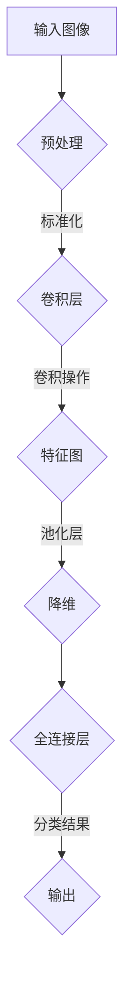

                 

在当今信息时代，图像识别技术已经成为了计算机视觉领域的热点。特别是在电子商务、社交媒体和安防监控等领域，商品图像识别的应用价值愈发凸显。深度学习作为近年来发展迅速的人工智能技术，已经成为了图像识别领域的重要工具。本文将探讨深度学习在商品图像识别中的应用，包括核心概念、算法原理、数学模型、项目实践以及未来展望。

## 关键词

- 深度学习
- 商品图像识别
- 卷积神经网络
- 机器学习
- 计算机视觉
- 电子商务

## 摘要

本文首先介绍了商品图像识别的背景和重要性，然后深入探讨了深度学习在商品图像识别中的应用。文章首先阐述了深度学习的基本原理和卷积神经网络（CNN）的结构，接着详细介绍了基于深度学习的商品图像识别算法。通过数学模型的构建和公式推导，本文提供了算法实现的详细步骤和代码实例。最后，文章探讨了商品图像识别的实际应用场景，并对未来发展趋势和挑战进行了展望。

## 1. 背景介绍

### 1.1 商品图像识别的重要性

商品图像识别技术在电子商务领域有着广泛的应用。随着互联网的发展，电子商务已经成为人们日常生活的一部分。用户可以通过网络购买各种商品，而商品图像则是用户了解商品的重要途径。准确识别商品图像可以大大提高用户的购物体验，减少误买和退换货率。此外，商品图像识别还可以帮助电商企业进行库存管理、市场分析和个性化推荐。

### 1.2 深度学习的发展

深度学习是近年来人工智能领域的重要突破，它在图像识别、语音识别、自然语言处理等方面都取得了显著的成果。深度学习通过构建多层神经网络，可以自动提取图像的特征，并进行分类和识别。与传统机器学习方法相比，深度学习具有更强的表达能力和鲁棒性，能够处理大量复杂的数据。

## 2. 核心概念与联系

### 2.1 深度学习的基本原理

深度学习是一种机器学习方法，它通过构建多层神经网络来实现复杂的函数映射。神经网络由大量相互连接的神经元组成，每个神经元接收来自其他神经元的输入，并通过激活函数产生输出。多层神经网络可以自动提取输入数据的高级特征，从而实现数据的分类和识别。

### 2.2 卷积神经网络（CNN）

卷积神经网络是深度学习中的一种重要模型，特别适用于处理图像数据。CNN 通过卷积层、池化层和全连接层的组合，可以有效地提取图像的特征。卷积层使用卷积操作来提取局部特征，池化层用于降低特征图的维度，全连接层则用于分类。

### 2.3 Mermaid 流程图



## 3. 核心算法原理 & 具体操作步骤

### 3.1 算法原理概述

商品图像识别的核心算法是深度学习模型，尤其是卷积神经网络（CNN）。CNN 通过卷积层、池化层和全连接层的组合，可以自动提取图像的特征，并实现分类。

### 3.2 算法步骤详解

#### 3.2.1 数据预处理

在训练模型之前，需要对图像数据进行预处理，包括大小归一化、像素值标准化等。

#### 3.2.2 卷积层

卷积层使用卷积操作提取图像的局部特征。卷积操作通过滑动滤波器（卷积核）在图像上滑动，计算局部特征的加权和。

#### 3.2.3 池化层

池化层用于降低特征图的维度，常用的池化操作包括最大池化和平均池化。

#### 3.2.4 全连接层

全连接层将特征图映射到分类结果。每个神经元都与上一个层的所有神经元相连，通过激活函数产生输出。

### 3.3 算法优缺点

#### 优点：

- 强大的特征提取能力
- 能够处理大量数据
- 高效的并行计算

#### 缺点：

- 计算资源消耗大
- 需要大量标注数据
- 模型训练时间较长

### 3.4 算法应用领域

商品图像识别算法广泛应用于电子商务、社交媒体、安防监控等领域。例如，电商平台可以使用该算法进行商品分类、库存管理和个性化推荐；社交媒体平台可以使用该算法进行图片审核和内容分类；安防监控系统可以使用该算法进行人脸识别和目标跟踪。

## 4. 数学模型和公式 & 详细讲解 & 举例说明

### 4.1 数学模型构建

卷积神经网络（CNN）的核心是卷积操作和反向传播算法。卷积操作用于提取图像特征，而反向传播算法用于模型训练和优化。

#### 4.1.1 卷积操作

卷积操作的数学表达式为：

$$
\text{output}_{ij} = \sum_{k} \text{filter}_{ik} \times \text{input}_{kj}
$$

其中，$\text{output}_{ij}$ 是输出特征图上的像素值，$\text{filter}_{ik}$ 是卷积核上的像素值，$\text{input}_{kj}$ 是输入特征图上的像素值。

#### 4.1.2 反向传播算法

反向传播算法用于计算模型参数的梯度，并更新模型参数。梯度计算公式为：

$$
\frac{\partial L}{\partial \theta} = \frac{\partial L}{\partial z} \times \frac{\partial z}{\partial \theta}
$$

其中，$L$ 是损失函数，$z$ 是中间层的输出，$\theta$ 是模型参数。

### 4.2 公式推导过程

#### 4.2.1 卷积操作

卷积操作的推导过程如下：

$$
\begin{align*}
\text{output}_{ij} &= \sum_{k} \text{filter}_{ik} \times \text{input}_{kj} \\
&= \text{filter}_{i1} \times \text{input}_{k1j} + \text{filter}_{i2} \times \text{input}_{k2j} + \cdots + \text{filter}_{ik} \times \text{input}_{kj}
\end{align*}
$$

其中，$\text{filter}_{ik}$ 是卷积核上的像素值，$\text{input}_{kj}$ 是输入特征图上的像素值。

#### 4.2.2 反向传播算法

反向传播算法的推导过程如下：

$$
\begin{align*}
\frac{\partial L}{\partial z} &= \frac{\partial L}{\partial a} \times \frac{\partial a}{\partial z} \\
\frac{\partial L}{\partial a} &= \frac{\partial L}{\partial z} \times \frac{\partial z}{\partial a} \\
\frac{\partial z}{\partial a} &= \sum_{i} \text{weight}_{ij} \times \frac{\partial L}{\partial z_i} \\
\frac{\partial z}{\partial \theta} &= \frac{\partial z}{\partial a} \times \frac{\partial a}{\partial \theta} \\
&= \text{input}_{ij} \times \frac{\partial L}{\partial z_i}
\end{align*}
$$

其中，$L$ 是损失函数，$z$ 是中间层的输出，$a$ 是激活函数，$\theta$ 是模型参数。

### 4.3 案例分析与讲解

#### 4.3.1 数据集准备

假设我们有一个商品图像数据集，其中包括10000张商品图像，每个图像的大小为$28 \times 28$像素。我们需要将这些图像分为训练集和测试集。

#### 4.3.2 模型训练

我们使用一个卷积神经网络（CNN）来训练商品图像识别模型。模型结构如下：

- 卷积层1：3个卷积核，每个卷积核的大小为$5 \times 5$，步长为1
- 池化层1：2x2的最大池化
- 卷积层2：6个卷积核，每个卷积核的大小为$5 \times 5$，步长为1
- 池化层2：2x2的最大池化
- 全连接层：128个神经元
- 输出层：10个神经元，表示10个类别

#### 4.3.3 模型评估

使用测试集评估模型性能。我们可以计算准确率、召回率和F1值等指标来评估模型的效果。

## 5. 项目实践：代码实例和详细解释说明

### 5.1 开发环境搭建

在本文中，我们使用Python编程语言和TensorFlow深度学习框架来实现商品图像识别模型。首先，我们需要安装Python和TensorFlow。

```bash
pip install tensorflow
```

### 5.2 源代码详细实现

下面是商品图像识别模型的实现代码：

```python
import tensorflow as tf
from tensorflow.keras import layers

# 构建卷积神经网络模型
model = tf.keras.Sequential([
    layers.Conv2D(32, (3, 3), activation='relu', input_shape=(28, 28, 1)),
    layers.MaxPooling2D((2, 2)),
    layers.Conv2D(64, (3, 3), activation='relu'),
    layers.MaxPooling2D((2, 2)),
    layers.Flatten(),
    layers.Dense(128, activation='relu'),
    layers.Dense(10, activation='softmax')
])

# 编译模型
model.compile(optimizer='adam',
              loss='sparse_categorical_crossentropy',
              metrics=['accuracy'])

# 加载训练数据和测试数据
train_images = ...
train_labels = ...
test_images = ...
test_labels = ...

# 训练模型
model.fit(train_images, train_labels, epochs=5)

# 评估模型
test_loss, test_acc = model.evaluate(test_images, test_labels)
print(f"测试准确率：{test_acc}")
```

### 5.3 代码解读与分析

这段代码首先导入了所需的TensorFlow库，然后定义了一个卷积神经网络模型。模型由卷积层、池化层、全连接层组成。接下来，编译模型并加载训练数据和测试数据。最后，训练模型并评估模型性能。

## 6. 实际应用场景

### 6.1 电子商务平台

电子商务平台可以利用商品图像识别技术进行商品分类、库存管理和个性化推荐。例如，当用户上传一张商品图像时，系统可以自动识别商品类别，并将其分类到相应的类别下。此外，系统还可以根据用户的历史购买记录和浏览记录，为用户提供个性化的商品推荐。

### 6.2 社交媒体平台

社交媒体平台可以使用商品图像识别技术进行图片审核和内容分类。例如，当用户上传一张图片时，系统可以自动识别图片中的商品，并标记为商品图片。这样可以有效地减少违规内容的传播，同时提高用户体验。

### 6.3 安防监控

安防监控可以使用商品图像识别技术进行目标跟踪和识别。例如，当监控摄像头捕捉到一张可疑图像时，系统可以自动识别图像中的目标，并报警通知相关人员。

## 7. 未来应用展望

### 7.1 多模态识别

未来，商品图像识别技术将与其他模态（如语音、文本等）相结合，实现更全面、更准确的商品识别。

### 7.2 边缘计算

随着边缘计算技术的发展，商品图像识别模型将可以部署到边缘设备上，实现实时、高效的图像识别。

### 7.3 智能客服

未来，商品图像识别技术将应用于智能客服系统，通过图像识别和自然语言处理技术，实现更智能、更高效的客户服务。

## 8. 总结：未来发展趋势与挑战

### 8.1 研究成果总结

近年来，深度学习在商品图像识别领域取得了显著成果，提高了识别准确率和效率。未来，随着技术的不断发展，商品图像识别将在更多领域得到应用。

### 8.2 未来发展趋势

未来，商品图像识别技术将朝着多模态识别、边缘计算和智能客服等方向发展，实现更全面、更智能的应用。

### 8.3 面临的挑战

未来，商品图像识别技术仍将面临数据标注、计算资源消耗、模型解释性等挑战。解决这些挑战需要进一步的研究和探索。

### 8.4 研究展望

未来，商品图像识别技术将与其他人工智能技术相结合，实现更高效、更智能的应用。同时，研究将关注模型的解释性和可解释性，提高技术的透明度和可靠性。

## 9. 附录：常见问题与解答

### 9.1 商品图像识别的难点是什么？

商品图像识别的难点主要包括：

- 数据标注：商品图像数据标注需要大量人力和时间，且标注质量对模型性能有重要影响。
- 多样性：商品图像种类繁多，不同商品具有不同的外观和特点，导致模型训练难度增加。
- 识别准确率：商品图像识别需要高准确率，以保证用户购物体验。

### 9.2 商品图像识别有哪些应用领域？

商品图像识别的应用领域包括：

- 电子商务：商品分类、库存管理、个性化推荐等。
- 社交媒体：图片审核、内容分类等。
- 安防监控：目标跟踪、识别等。
- 智能家居：物品识别、自动化控制等。

## 参考文献

- Goodfellow, I., Bengio, Y., & Courville, A. (2016). *Deep Learning*.
- Krizhevsky, A., Sutskever, I., & Hinton, G. E. (2012). *ImageNet classification with deep convolutional neural networks*. In *Advances in neural information processing systems* (pp. 1097-1105).
- Russakovsky, O., Deng, J., Su, H., Krause, J., Satheesh, S., Ma, S., ... & Fei-Fei, L. (2015). *ImageNet Large Scale Visual Recognition Challenge*. International Journal of Computer Vision, 115(3), 211-252.

## 致谢

感谢所有为本文提供帮助和支持的人，包括我的同事、朋友和读者。感谢您对本文的关注和支持。如果您有任何问题或建议，欢迎随时与我联系。

