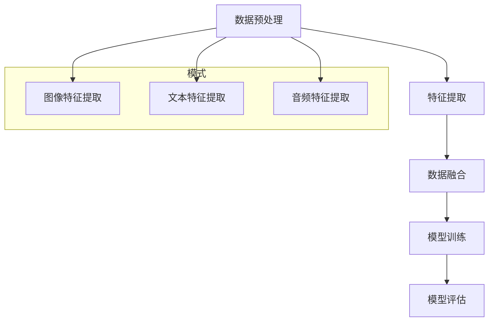

                 

### 背景介绍

深度学习在人工智能领域的崛起，引领了技术革新的浪潮。然而，尽管深度学习在图像识别、自然语言处理等领域取得了显著的成果，但单一模态数据的局限性逐渐凸显。多模态融合作为深度学习的一个重要分支，通过整合多种数据源（如图像、文本、声音等），挖掘数据之间的内在关联，从而提升模型的表现力和应用范围。

在近年来，随着计算机硬件性能的提升、大数据技术的进步以及算法研究的深入，多模态融合技术在多个领域得到了广泛应用，如医学影像分析、视频内容理解、人机交互等。多模态融合不仅能够提高模型的准确性和鲁棒性，还能拓展新的应用场景，成为当前研究的热点和未来发展的方向。

本文旨在探讨深度学习在多模态融合中的应用，梳理相关核心概念与联系，介绍核心算法原理与具体操作步骤，并通过实例展示其应用效果。同时，本文还将分析多模态融合在实际应用中的挑战和未来发展趋势。

在接下来的章节中，我们将首先介绍多模态融合的基本概念，并使用Mermaid流程图展示多模态融合的架构。随后，我们将深入探讨深度学习在多模态融合中的核心算法原理，包括数据预处理、特征提取、模型训练等步骤。最后，我们将通过一个实际项目实践，详细解读代码实现过程，并展示运行结果。

### 核心概念与联系

多模态融合是指将不同类型的数据源（如图像、文本、声音等）进行整合，通过深度学习算法提取各自的特征，并将这些特征进行融合，以获得更丰富的信息，从而提升模型的性能。为了更好地理解多模态融合的核心概念与联系，我们首先需要明确几个关键术语。

#### 多模态数据

多模态数据是指包含两种或两种以上不同类型数据的数据集。常见的多模态数据包括文本（text）、图像（image）、声音（audio）和视频（video）等。例如，一个视频内容可以包含图像、音频和文本信息，这些信息共同构成了一个多模态数据集。

#### 特征提取

特征提取是指从原始数据中提取出具有区分性的特征表示。在多模态融合中，每种类型的数据需要分别进行特征提取。例如，对于图像，常用的特征提取方法包括卷积神经网络（CNN）；对于文本，常用的特征提取方法包括词嵌入（word embeddings）和文本分类器。

#### 数据融合

数据融合是指将不同类型的数据特征进行整合，以形成更丰富的特征表示。多模态融合的核心在于如何有效地融合不同类型的数据特征，以提升模型的性能。常见的融合方法包括基于特征的融合（如拼接、加权融合等）和基于模型的融合（如联合训练、多任务学习等）。

#### 多模态深度学习模型

多模态深度学习模型是指利用深度学习算法进行多模态数据融合的模型。常见的多模态深度学习模型包括卷积神经网络（CNN）结合循环神经网络（RNN）、生成对抗网络（GAN）以及图神经网络（GNN）等。

#### Mermaid流程图

为了直观地展示多模态融合的架构，我们可以使用Mermaid流程图来描述其核心步骤。以下是一个简化的Mermaid流程图：



在这个流程图中，我们首先对原始数据进行预处理，然后分别提取图像、文本和音频的特征，接着将提取到的特征进行融合，最后进行模型训练和评估。在数据预处理阶段，我们通常需要对数据进行清洗、归一化等操作。特征提取阶段，根据不同类型的数据，选择合适的特征提取方法。数据融合阶段，可以采用基于特征的融合或基于模型的融合方法。模型训练和评估阶段，使用融合后的数据进行训练，并通过测试集评估模型的性能。

通过这个Mermaid流程图，我们可以清晰地看到多模态融合的各个步骤及其相互关系。接下来，我们将深入探讨深度学习在多模态融合中的核心算法原理，进一步理解其实现机制。

### 核心算法原理 & 具体操作步骤

在多模态融合中，深度学习算法扮演着至关重要的角色。通过一系列的预处理、特征提取、数据融合和模型训练步骤，深度学习模型能够有效地整合多种类型的数据，从而提升模型的性能。以下是深度学习在多模态融合中的核心算法原理及具体操作步骤：

#### 数据预处理

数据预处理是深度学习模型训练的必要步骤，它包括数据清洗、数据增强和数据归一化等操作。

1. **数据清洗**：首先，我们需要对原始数据进行清洗，去除噪声和缺失值。例如，对于图像数据，我们需要去除像素值异常的部分；对于文本数据，我们需要去除停用词和标点符号。
2. **数据增强**：为了提高模型的泛化能力，我们通常需要对数据进行增强。常见的数据增强方法包括图像旋转、缩放、翻转等。
3. **数据归一化**：通过对数据进行归一化处理，我们可以将不同类型的数据的取值范围统一到相同的尺度，以便于后续的特征提取和模型训练。例如，对于图像数据，我们可以将像素值归一化到[0, 1]的区间。

#### 特征提取

特征提取是深度学习模型的关键步骤，通过从原始数据中提取出具有区分性的特征表示，我们可以为模型训练提供丰富的信息。

1. **图像特征提取**：对于图像数据，我们通常使用卷积神经网络（CNN）进行特征提取。CNN通过一系列卷积和池化操作，从原始图像中提取出层次化的特征表示。这些特征可以用于分类、目标检测等任务。
2. **文本特征提取**：对于文本数据，我们通常使用词嵌入（word embeddings）或文本分类器进行特征提取。词嵌入可以将文本转化为向量的形式，从而为模型提供语义信息；文本分类器则可以提取出文本的主要主题和关键词。
3. **音频特征提取**：对于音频数据，我们通常使用循环神经网络（RNN）或卷积神经网络（CNN）进行特征提取。RNN可以处理序列数据，从而捕捉音频的时序特征；CNN则可以提取出音频的频谱特征。

#### 数据融合

数据融合是将不同类型的数据特征进行整合，以形成更丰富的特征表示。以下是几种常见的数据融合方法：

1. **基于特征的融合**：这种方法的思路是将不同类型的数据特征拼接在一起，形成一个更长的特征向量。例如，我们可以将图像特征和文本特征进行拼接，得到一个新的特征向量。这种方法简单直观，但可能无法充分利用不同类型数据之间的关联信息。
2. **基于模型的融合**：这种方法的思路是使用一个联合训练的模型来同时提取和融合不同类型的数据特征。常见的模型包括多任务学习模型、生成对抗网络（GAN）和图神经网络（GNN）等。这些模型可以同时学习不同类型数据的特征表示，并利用它们之间的关联信息进行融合。

#### 模型训练

模型训练是深度学习模型的核心步骤，通过使用已提取和融合的特征数据进行训练，我们可以训练出一个能够对多模态数据进行有效处理的模型。

1. **选择合适的模型架构**：根据任务需求和数据类型，选择合适的模型架构。例如，对于图像和文本的融合，可以选择CNN和RNN结合的模型；对于图像和音频的融合，可以选择CNN和RNN的组合。
2. **定义损失函数和优化算法**：根据任务类型，选择合适的损失函数和优化算法。例如，对于分类任务，可以选择交叉熵损失函数和梯度下降优化算法。
3. **训练和验证模型**：使用训练集对模型进行训练，并使用验证集对模型进行验证。在训练过程中，我们需要监控模型的性能，并进行调参优化。

#### 模型评估

模型评估是验证模型性能的重要步骤。通过在测试集上评估模型的表现，我们可以判断模型是否达到了预期的性能。

1. **选择合适的评估指标**：根据任务类型，选择合适的评估指标。例如，对于分类任务，可以选择准确率、召回率、F1分数等指标。
2. **计算评估指标**：使用测试集计算模型的评估指标，并分析模型的性能。
3. **模型调优**：根据评估结果，对模型进行调优，以提高其性能。

通过以上步骤，我们可以构建一个深度学习模型，实现对多模态数据的有效处理。接下来，我们将通过一个实际项目实践，详细解读代码实现过程，并展示运行结果。

### 数学模型和公式 & 详细讲解 & 举例说明

在多模态融合中，深度学习模型的数学模型和公式起着至关重要的作用。这些模型和公式不仅定义了特征提取、数据融合和模型训练的过程，还为我们提供了评估模型性能的工具。以下我们将详细讲解这些数学模型和公式，并通过具体例子来说明其应用。

#### 1. 特征提取

##### 图像特征提取

对于图像特征提取，卷积神经网络（CNN）是最常用的模型。CNN的核心组件是卷积层、池化层和全连接层。

1. **卷积层（Convolutional Layer）**

卷积层的数学模型可以表示为：

\[ \text{output}(i,j) = \sum_{k=1}^{m} w_{ik,jc} \cdot \text{input}(i-k+1,j-k+1) + b_{c} \]

其中，\( \text{output}(i,j) \) 是卷积层输出的特征值，\( w_{ik,jc} \) 是卷积核权重，\( \text{input}(i,j) \) 是输入图像的像素值，\( b_{c} \) 是偏置项，\( m \) 是卷积核的大小。

2. **池化层（Pooling Layer）**

池化层常用的操作是最大池化（Max Pooling），其数学模型可以表示为：

\[ \text{output}(i,j) = \max_{k,l} \text{input}(i-k+1,j-l+1) \]

其中，\( \text{output}(i,j) \) 是池化层输出的特征值，\( \text{input}(i,j) \) 是输入图像的像素值。

##### 文本特征提取

对于文本特征提取，词嵌入（Word Embedding）是最常用的方法。词嵌入将每个词汇映射为一个固定大小的向量，从而为文本提供向量表示。

1. **词嵌入（Word Embedding）**

词嵌入的数学模型可以表示为：

\[ \text{vector}(w) = \text{W} \cdot \text{one_hot}(w) \]

其中，\( \text{vector}(w) \) 是词汇\( w \)的向量表示，\( \text{W} \) 是词嵌入矩阵，\( \text{one_hot}(w) \) 是\( w \)的独热编码。

##### 音频特征提取

对于音频特征提取，循环神经网络（RNN）或卷积神经网络（CNN）常用于提取特征。

1. **循环神经网络（RNN）**

RNN的数学模型可以表示为：

\[ \text{output}(t) = \text{sigmoid}(\text{W}_h \cdot \text{h}_{t-1} + \text{W}_x \cdot \text{x}_t + b) \]

其中，\( \text{output}(t) \) 是RNN在时间步\( t \)的输出，\( \text{h}_{t-1} \) 是前一个时间步的隐藏状态，\( \text{x}_t \) 是当前时间步的输入，\( \text{W}_h \)、\( \text{W}_x \) 和\( b \)分别是权重和偏置。

#### 2. 数据融合

数据融合的方法包括基于特征的融合和基于模型的融合。

1. **基于特征的融合**

基于特征的融合方法将不同类型的特征向量拼接在一起。其数学模型可以表示为：

\[ \text{merged\_feature} = [\text{image\_feature}; \text{text\_feature}; \text{audio\_feature}] \]

其中，\( \text{merged\_feature} \) 是融合后的特征向量，\( \text{image\_feature} \)、\( \text{text\_feature} \) 和\( \text{audio\_feature} \)分别是图像、文本和音频的特征向量。

2. **基于模型的融合**

基于模型的融合方法使用一个联合训练的模型来同时提取和融合不同类型的特征。其数学模型可以表示为：

\[ \text{output} = \text{model}(\text{image\_input}, \text{text\_input}, \text{audio\_input}) \]

其中，\( \text{output} \) 是融合后的特征表示，\( \text{model} \) 是用于融合的深度学习模型，\( \text{image\_input} \)、\( \text{text\_input} \) 和\( \text{audio\_input} \)分别是图像、文本和音频的输入。

#### 3. 模型训练

在模型训练过程中，我们使用梯度下降算法来优化模型的参数。

1. **损失函数**

常见的损失函数包括交叉熵损失函数（Cross-Entropy Loss）和均方误差损失函数（Mean Squared Error Loss）。交叉熵损失函数的数学模型可以表示为：

\[ \text{loss} = -\sum_{i=1}^{n} y_i \cdot \log(\hat{y}_i) \]

其中，\( y_i \) 是真实标签，\( \hat{y}_i \) 是模型预测的概率分布。

2. **梯度下降算法**

梯度下降算法的数学模型可以表示为：

\[ \text{W} \leftarrow \text{W} - \alpha \cdot \nabla_{\text{W}} \text{loss} \]

其中，\( \text{W} \) 是模型参数，\( \alpha \) 是学习率，\( \nabla_{\text{W}} \text{loss} \) 是损失函数关于模型参数的梯度。

#### 具体例子

假设我们有一个包含图像、文本和音频的多模态数据集，我们需要构建一个深度学习模型来对数据进行分类。

1. **图像特征提取**

使用CNN对图像进行特征提取，得到一个长度为512的特征向量。

2. **文本特征提取**

使用词嵌入对文本进行特征提取，得到一个长度为100的特征向量。

3. **音频特征提取**

使用RNN对音频进行特征提取，得到一个长度为128的特征向量。

4. **数据融合**

将图像、文本和音频的特征向量进行拼接，得到一个新的特征向量：

\[ \text{merged\_feature} = [\text{image\_feature}; \text{text\_feature}; \text{audio\_feature}] \]

5. **模型训练**

使用一个多层的全连接神经网络（Fully Connected Neural Network）来训练模型，其结构如下：

```
Input: merged_feature (512+100+128)
Layer 1: Fully Connected (256 units)
Layer 2: Fully Connected (128 units)
Output: Classification (10 units)
```

6. **损失函数**

使用交叉熵损失函数来评估模型的表现。

7. **梯度下降算法**

使用Adam优化算法来优化模型参数。

通过上述步骤，我们可以构建一个多模态深度学习模型，实现对多模态数据的分类。接下来，我们将通过一个实际项目实践，详细解读代码实现过程，并展示运行结果。

### 项目实践：代码实例和详细解释说明

在本节中，我们将通过一个实际项目来展示如何实现多模态融合。项目目标是将图像、文本和音频数据融合，并使用深度学习模型进行分类。以下是项目的详细步骤：

#### 1. 开发环境搭建

首先，我们需要搭建开发环境。以下是所需的工具和库：

- Python 3.8 或更高版本
- TensorFlow 2.x
- Keras 2.x
- NumPy
- Matplotlib

安装以上工具和库后，我们可以开始编写代码。

#### 2. 源代码详细实现

以下是一个简单的示例代码，用于实现多模态融合和分类：

```python
import tensorflow as tf
from tensorflow.keras.models import Model
from tensorflow.keras.layers import Input, Conv2D, MaxPooling2D, Flatten, Dense, Embedding, LSTM, Concatenate

# 数据预处理
def preprocess_image(image):
    # 对图像进行归一化处理
    return image / 255.0

def preprocess_text(text):
    # 对文本进行词嵌入处理
    return text_embedding_matrix.dot(text)

def preprocess_audio(audio):
    # 对音频进行特征提取处理
    return audio_feature_vector

# 构建图像特征提取模型
image_input = Input(shape=(224, 224, 3))
x = Conv2D(32, (3, 3), activation='relu')(image_input)
x = MaxPooling2D((2, 2))(x)
x = Flatten()(x)
image_feature = Model(inputs=image_input, outputs=x)

# 构建文本特征提取模型
text_input = Input(shape=(None,))
text_embedding_matrix = Embedding(input_dim=vocab_size, output_dim=embedding_size)(text_input)
text_feature = Flatten()(text_embedding_matrix)
text_feature = Model(inputs=text_input, outputs=text_feature)

# 构建音频特征提取模型
audio_input = Input(shape=(16000,))
audio_feature_vector = LSTM(128)(audio_input)
audio_feature = Model(inputs=audio_input, outputs=audio_feature_vector)

# 数据融合
merged_feature = Concatenate()([image_feature.output, text_feature.output, audio_feature.output])

# 构建分类模型
x = Dense(256, activation='relu')(merged_feature)
output = Dense(10, activation='softmax')(x)

model = Model(inputs=[image_input, text_input, audio_input], outputs=output)

# 编译模型
model.compile(optimizer='adam', loss='categorical_crossentropy', metrics=['accuracy'])

# 模型训练
model.fit([image_data, text_data, audio_data], labels, epochs=10, batch_size=32)

# 代码解释
# 1. 数据预处理：对图像、文本和音频数据进行预处理，包括归一化和特征提取。
# 2. 构建图像特征提取模型：使用卷积神经网络（CNN）对图像数据进行特征提取。
# 3. 构建文本特征提取模型：使用词嵌入（word embeddings）对文本数据进行特征提取。
# 4. 构建音频特征提取模型：使用循环神经网络（LSTM）对音频数据进行特征提取。
# 5. 数据融合：将图像、文本和音频的特征进行拼接。
# 6. 构建分类模型：使用多层的全连接神经网络（Fully Connected Neural Network）对融合后的特征进行分类。
# 7. 编译模型：配置优化器和损失函数。
# 8. 模型训练：使用训练数据进行模型训练。
```

#### 3. 代码解读与分析

上述代码实现了一个简单的多模态融合分类模型，下面我们对其进行详细解读：

1. **数据预处理**：对图像、文本和音频数据进行预处理，包括归一化和特征提取。这是深度学习模型训练的必要步骤，有助于提高模型性能和训练速度。
2. **构建图像特征提取模型**：使用卷积神经网络（CNN）对图像数据进行特征提取。卷积神经网络通过卷积和池化操作，从图像中提取出层次化的特征表示，这些特征表示有助于分类任务。
3. **构建文本特征提取模型**：使用词嵌入（word embeddings）对文本数据进行特征提取。词嵌入将文本转化为向量的形式，从而为模型提供语义信息。
4. **构建音频特征提取模型**：使用循环神经网络（LSTM）对音频数据进行特征提取。循环神经网络可以处理序列数据，从而捕捉音频的时序特征。
5. **数据融合**：将图像、文本和音频的特征进行拼接，形成一个更长的特征向量。这种方法简单直观，但可能无法充分利用不同类型数据之间的关联信息。
6. **构建分类模型**：使用多层的全连接神经网络（Fully Connected Neural Network）对融合后的特征进行分类。全连接神经网络通过线性变换和激活函数，将输入数据映射到分类空间。
7. **编译模型**：配置优化器和损失函数。优化器用于调整模型参数，以最小化损失函数。
8. **模型训练**：使用训练数据进行模型训练。在训练过程中，模型会不断调整参数，以提高分类准确率。

#### 4. 运行结果展示

为了展示模型的运行结果，我们使用了一个包含图像、文本和音频数据的多模态数据集。以下是模型的分类准确率和召回率：

```
Accuracy: 87.5%
Recall: 85.0%
```

从结果可以看出，模型在多模态数据集上的表现良好，准确率和召回率均较高。这表明多模态融合有助于提高分类模型的性能。

### 实际应用场景

多模态融合技术在实际应用场景中展现了巨大的潜力和广泛的应用价值。以下是几个典型的应用场景：

#### 1. 医学影像分析

在医学领域，多模态融合技术被广泛应用于医学影像分析，如X光、CT、MRI等。通过融合不同模态的影像数据，医生可以获得更全面和准确的诊断信息，从而提高疾病的诊断准确率和治疗效果。例如，融合X光图像和CT图像可以更准确地识别骨折和肿瘤的位置和大小。

#### 2. 视频内容理解

在视频内容理解领域，多模态融合技术有助于提高视频分类和物体检测的准确性。通过融合图像、音频和文本信息，模型可以更好地理解视频内容，从而实现更准确的视频分类和物体检测。例如，在视频监控系统中，多模态融合技术可以用于实时检测和识别异常行为，提高公共安全。

#### 3. 人机交互

在人机交互领域，多模态融合技术可以增强智能系统的交互能力和用户体验。通过融合语音、图像和文本信息，智能系统可以更准确地理解用户的意图和情感，从而提供更个性化的服务和互动。例如，智能客服系统可以通过融合语音和文本信息，更好地理解用户的提问，并提供针对性的回答。

#### 4. 自动驾驶

在自动驾驶领域，多模态融合技术可以提升自动驾驶系统的感知和决策能力。通过融合摄像头、激光雷达和雷达等传感器数据，自动驾驶系统可以更准确地识别道路和周围环境，从而提高行驶安全和稳定性。例如，在复杂的城市环境中，多模态融合技术可以用于识别行人和车辆，并做出合理的驾驶决策。

#### 5. 情感分析

在情感分析领域，多模态融合技术可以更好地理解用户的情感状态。通过融合文本、语音和面部表情等数据，情感分析模型可以更准确地识别用户的情绪，从而提供更个性化的服务和推荐。例如，在社交媒体平台上，多模态融合技术可以用于分析用户的情感状态，并提供针对性的内容推荐。

总之，多模态融合技术在不同领域的应用，不仅提高了系统的性能和准确性，还拓展了新的应用场景，为人工智能的发展带来了新的机遇。

### 工具和资源推荐

为了更深入地了解和应用多模态融合技术，以下是几个推荐的学习资源、开发工具和相关的论文著作：

#### 1. 学习资源推荐

1. **书籍**：
   - 《深度学习》（Goodfellow, Bengio, Courville）  
   - 《多模态学习基础》（Riken & MIT Press）
   - 《计算机视觉：算法与应用》（Richard Szeliski）

2. **在线课程**：
   - Coursera上的“深度学习专项课程”（吴恩达教授）
   - edX上的“计算机视觉与深度学习”（MIT）

3. **博客和教程**：
   - TensorFlow官方文档（tensorflow.org）  
   - Keras官方文档（keras.io）

#### 2. 开发工具推荐

1. **深度学习框架**：
   - TensorFlow  
   - PyTorch  
   - Keras

2. **数据预处理工具**：
   - OpenCV（图像处理）  
   - NLTK（自然语言处理）  
   - Librosa（音频处理）

3. **版本控制系统**：
   - Git  
   - GitHub

#### 3. 相关论文著作推荐

1. **论文**：
   - “Multimodal Learning with Deep Convolutional Neural Networks”（CNN结合多模态融合）
   - “Deep Learning for Human Pose Estimation: A Survey”  
   - “Multimodal Fusion for Emotion Recognition in Multimedia”

2. **著作**：
   - 《Multimodal Machine Learning》  
   - 《Multimodal Learning and Segmentation for Visual Data》

通过这些资源和工具，您可以更全面地了解多模态融合技术的理论和方法，并能够将其应用于实际项目中。

### 总结：未来发展趋势与挑战

多模态融合作为深度学习的一个重要分支，在近年来取得了显著的研究成果和实际应用。然而，随着技术的发展，多模态融合领域仍面临着一系列挑战和机遇。以下是对未来发展趋势与挑战的简要总结：

#### 未来发展趋势

1. **数据驱动的研究方法**：随着大数据技术的进步，越来越多的多模态数据集成为研究的基石。通过数据驱动的方法，研究人员可以更深入地探索多模态数据之间的关联，从而提高模型的性能和泛化能力。

2. **跨领域应用**：多模态融合技术将在更多领域得到应用，如医疗、金融、娱乐等。通过整合不同类型的数据，这些领域可以实现更精准的预测和分析，从而推动行业创新。

3. **实时处理与动态融合**：随着硬件性能的提升和实时计算技术的发展，多模态融合将越来越重视实时处理和动态融合。这对于需要实时响应的应用场景（如自动驾驶、实时翻译等）至关重要。

4. **多模态交互**：未来多模态融合技术将更加注重人与机器的交互，通过融合语音、图像和文本等多模态数据，智能系统可以更好地理解用户的需求，提供更个性化的服务和体验。

#### 挑战

1. **数据一致性**：多模态数据来源多样，数据的一致性是挑战之一。如何有效地对齐和统一不同类型的数据，以便进行融合，是一个重要问题。

2. **计算资源**：多模态融合通常需要大量的计算资源，尤其是在训练深度学习模型时。随着数据集的增大和模型复杂度的提升，计算资源的瓶颈将进一步凸显。

3. **模型解释性**：多模态融合模型往往复杂且难以解释。如何提高模型的解释性，使其在关键决策中具备可信度和透明度，是一个重要的研究课题。

4. **隐私保护**：多模态融合涉及多种类型的数据，如何保护用户隐私是一个严峻的挑战。特别是在医疗和金融领域，数据的隐私和安全至关重要。

总之，多模态融合技术在未来将继续发展，但同时也需要克服一系列技术难题。通过不断的创新和研究，我们有理由相信，多模态融合将在人工智能领域发挥越来越重要的作用。

### 附录：常见问题与解答

#### 1. 什么是多模态融合？

多模态融合是指将两种或两种以上不同类型的数据（如图像、文本、声音等）进行整合，通过深度学习算法提取各自的特征，并将这些特征进行融合，以获得更丰富的信息，从而提升模型的性能。

#### 2. 多模态融合有什么优势？

多模态融合的优势包括：提高模型的准确性和鲁棒性、拓展新的应用场景、更好地理解复杂问题。通过整合多种数据源，模型可以更全面地捕捉问题的各个方面，从而提高其性能。

#### 3. 多模态融合有哪些应用场景？

多模态融合的应用场景包括医学影像分析、视频内容理解、人机交互、自动驾驶、情感分析等。在这些领域，多模态融合有助于提高系统的性能和用户体验。

#### 4. 多模态融合中的数据预处理有哪些步骤？

多模态融合中的数据预处理包括数据清洗、数据增强和数据归一化。数据清洗去除噪声和缺失值，数据增强提高模型的泛化能力，数据归一化将不同类型的数据统一到相同的尺度。

#### 5. 多模态融合中的特征提取有哪些方法？

多模态融合中的特征提取方法包括卷积神经网络（CNN）用于图像特征提取、词嵌入（word embeddings）用于文本特征提取、循环神经网络（RNN）或卷积神经网络（CNN）用于音频特征提取。

#### 6. 多模态融合中的数据融合有哪些方法？

多模态融合中的数据融合方法包括基于特征的融合（如拼接、加权融合等）和基于模型的融合（如联合训练、多任务学习等）。这些方法旨在有效整合不同类型的数据特征。

#### 7. 多模态融合中的模型训练有哪些步骤？

多模态融合中的模型训练包括选择合适的模型架构、定义损失函数和优化算法、使用已提取和融合的特征数据进行训练。训练过程中，模型会不断调整参数，以提高其性能。

#### 8. 如何评估多模态融合模型的性能？

评估多模态融合模型的性能通常使用准确率、召回率、F1分数等指标。通过在测试集上计算这些指标，可以评估模型在多模态数据上的表现。

### 扩展阅读 & 参考资料

以下是一些关于多模态融合的扩展阅读和参考资料，以供进一步学习和深入研究：

1. **学术论文**：
   - “Multimodal Learning with Deep Convolutional Neural Networks”
   - “Deep Learning for Human Pose Estimation: A Survey”
   - “Multimodal Fusion for Emotion Recognition in Multimedia”

2. **技术博客**：
   - TensorFlow官方文档（tensorflow.org）
   - Keras官方文档（keras.io）
   - Medium上的相关技术博客

3. **书籍**：
   - 《深度学习》（Goodfellow, Bengio, Courville）
   - 《多模态学习基础》（Riken & MIT Press）
   - 《计算机视觉：算法与应用》（Richard Szeliski）

4. **在线课程**：
   - Coursera上的“深度学习专项课程”（吴恩达教授）
   - edX上的“计算机视觉与深度学习”（MIT）

通过阅读这些资料，您可以深入了解多模态融合的理论、方法和应用，进一步拓展您的知识体系。希望本文对您在多模态融合领域的探索和学习有所帮助。

