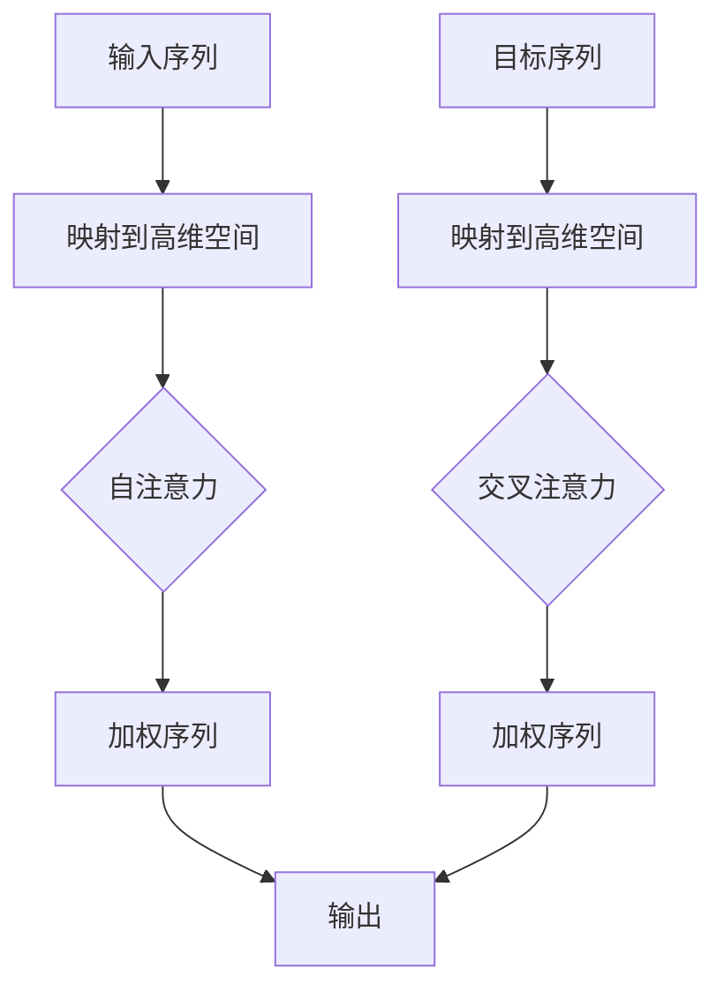

                 

深度学习作为人工智能领域的一项关键技术，已经广泛应用于语音识别、计算机视觉、自然语言处理等多个领域。注意力机制（Attention Mechanism）作为深度学习中的重要组成部分，旨在解决输入数据的处理效率问题，特别是在处理高维、长序列数据时，注意力分配优化显得尤为重要。本文将探讨深度学习在注意力分配优化中的应用，包括其背景介绍、核心概念与联系、核心算法原理、数学模型和公式、项目实践、实际应用场景以及未来发展趋势与挑战。

## 1. 背景介绍

注意力机制最初起源于人类认知科学的研究，用于描述人类在处理复杂任务时对信息的关注分配过程。在深度学习中，注意力机制通过模拟人类注意力的分配方式，提高了模型在处理长序列数据时的效率。随着深度学习技术的发展，注意力机制逐渐成为许多深度学习模型的核心组件，如Transformer、BERT等。

注意力分配优化是指通过改进注意力机制，提高模型在处理不同类型数据时的性能。在实际应用中，注意力分配优化具有重要意义。例如，在自然语言处理中，优化注意力机制可以提升文本分类、情感分析等任务的准确性；在计算机视觉中，优化注意力机制可以提高图像识别、物体检测的鲁棒性。

本文将围绕注意力分配优化展开讨论，首先介绍核心概念与联系，然后深入探讨核心算法原理、数学模型和公式，并通过项目实践、实际应用场景等多个方面阐述注意力分配优化的应用和未来发展趋势。

## 2. 核心概念与联系

在深度学习领域，注意力机制的核心概念包括自注意力（Self-Attention）和交叉注意力（Cross-Attention）。自注意力是指模型在处理输入序列时，对序列中的每个元素进行加权，从而生成一个加权序列。交叉注意力是指模型在处理两个序列时，对输入序列的每个元素与目标序列的每个元素进行加权，从而生成一个加权序列。

### 2.1 自注意力

自注意力通过计算输入序列中每个元素与其他元素的相关性，为每个元素赋予不同的权重。在计算过程中，模型首先将输入序列映射到一个高维空间，然后利用点积、缩放点积等操作计算元素间的相关性。自注意力机制的一个典型应用是Transformer模型，该模型在处理自然语言任务时表现出色。

### 2.2 交叉注意力

交叉注意力是指模型在处理两个输入序列时，对输入序列的每个元素与目标序列的每个元素进行加权。交叉注意力机制的一个重要应用是序列到序列（Seq2Seq）模型，如机器翻译、文本生成等。交叉注意力通过优化输入序列与目标序列之间的相关性，提高了模型在处理长序列数据时的性能。

### 2.3 Mermaid 流程图

下面是一个简化的Mermaid流程图，描述了自注意力和交叉注意力机制的基本流程：



在上述流程图中，A和E分别表示输入序列和目标序列，B和F表示将序列映射到高维空间，C和G表示自注意力和交叉注意力机制，D和H表示加权序列，I表示输出。

## 3. 核心算法原理 & 具体操作步骤

### 3.1 算法原理概述

注意力分配优化的核心目标是提高模型在处理不同类型数据时的性能。为了实现这一目标，注意力机制通过以下步骤进行优化：

1. **特征提取**：首先，将输入数据映射到一个高维空间，以便更好地捕捉数据中的特征。
2. **计算相关性**：利用点积、缩放点积等操作计算输入序列或输入序列与目标序列中元素间的相关性。
3. **加权**：根据计算出的相关性为每个元素赋予不同的权重，从而生成加权序列。
4. **输出**：将加权序列输入到后续网络层或任务中，实现注意力分配优化。

### 3.2 算法步骤详解

#### 3.2.1 特征提取

特征提取是注意力分配优化的第一步。通过将输入数据映射到一个高维空间，可以更好地捕捉数据中的特征。常用的方法包括词嵌入（Word Embedding）、图像特征提取（Image Feature Extraction）等。

#### 3.2.2 计算相关性

计算相关性是注意力分配优化的关键步骤。通过计算输入序列或输入序列与目标序列中元素间的相关性，可以为每个元素赋予不同的权重。常用的计算方法包括点积（Dot Product）、缩放点积（Scaled Dot Product）和多头自注意力（Multi-Head Self-Attention）。

#### 3.2.3 加权

在计算相关性后，需要为每个元素赋予不同的权重。常用的方法包括归一化权重（Normalized Weights）和软性权重（Soft Weights）。归一化权重将相关性映射到0和1之间，而软性权重则通过softmax函数将相关性映射到概率分布。

#### 3.2.4 输出

将加权序列输入到后续网络层或任务中，实现注意力分配优化。在自然语言处理中，加权序列可以用于文本分类、情感分析等任务；在计算机视觉中，加权序列可以用于图像识别、物体检测等任务。

### 3.3 算法优缺点

#### 优点

1. **高效性**：注意力机制通过减少序列中元素之间的依赖，提高了模型处理长序列数据的效率。
2. **灵活性**：注意力机制可以根据任务需求进行灵活调整，如自注意力、交叉注意力等。
3. **通用性**：注意力机制广泛应用于自然语言处理、计算机视觉等多个领域，具有较高的通用性。

#### 缺点

1. **计算复杂度**：随着序列长度的增加，注意力机制的计算复杂度呈指数级增长，可能导致模型训练和推理效率降低。
2. **参数数量**：注意力机制通常需要大量参数，增加了模型的训练难度。

### 3.4 算法应用领域

注意力分配优化在许多领域都取得了显著的应用成果，以下列举了其中几个典型领域：

1. **自然语言处理**：在文本分类、情感分析、机器翻译、文本生成等任务中，注意力机制提高了模型的性能和准确性。
2. **计算机视觉**：在图像识别、物体检测、图像分割等任务中，注意力机制增强了模型对关键信息的捕捉能力。
3. **语音识别**：在语音识别任务中，注意力机制提高了模型对语音信号的理解能力，从而提高了识别准确性。
4. **推荐系统**：在推荐系统中，注意力机制通过优化用户兴趣分配，提高了推荐质量。

## 4. 数学模型和公式 & 详细讲解 & 举例说明

### 4.1 数学模型构建

注意力分配优化的数学模型主要包括以下三个部分：特征提取、计算相关性和加权。

#### 4.1.1 特征提取

特征提取是将输入数据映射到一个高维空间的过程。常用的方法包括词嵌入和图像特征提取。

- **词嵌入**：词嵌入将词汇映射到一个低维空间，以捕获词汇间的语义关系。常用的词嵌入方法包括Word2Vec、GloVe等。
- **图像特征提取**：图像特征提取将图像映射到一个高维特征空间，以捕获图像中的视觉特征。常用的图像特征提取方法包括卷积神经网络（CNN）。

#### 4.1.2 计算相关性

计算相关性是通过点积、缩放点积等方法计算输入序列或输入序列与目标序列中元素间的相关性。具体计算方法如下：

- **点积**：点积是一种简单但有效的计算方法，用于计算两个向量之间的相似性。点积的公式如下：
  
  $$
  \text{点积}(x, y) = \sum_{i=1}^{n} x_i \cdot y_i
  $$

- **缩放点积**：缩放点积通过引入缩放因子，可以缓解点积在处理高维数据时出现的梯度消失问题。缩放点积的公式如下：

  $$
  \text{缩放点积}(x, y) = \frac{x \cdot y}{\sqrt{\sum_{i=1}^{n} x_i^2}}
  $$

#### 4.1.3 加权

加权是通过归一化权重或软性权重为每个元素赋予不同的权重。常用的加权方法如下：

- **归一化权重**：归一化权重将相关性映射到0和1之间，使每个元素的权重之和为1。归一化权重的公式如下：

  $$
  w_i = \frac{r_i}{\sum_{j=1}^{n} r_j}
  $$

- **软性权重**：软性权重通过softmax函数将相关性映射到概率分布。软性权重的公式如下：

  $$
  w_i = \frac{e^{r_i}}{\sum_{j=1}^{n} e^{r_j}}
  $$

### 4.2 公式推导过程

下面通过一个简单的例子，对注意力分配优化的数学模型进行推导。

#### 4.2.1 特征提取

假设输入序列为：

$$
x = [x_1, x_2, \ldots, x_n]
$$

词嵌入后得到高维特征序列：

$$
\text{Embed}(x) = [e_1, e_2, \ldots, e_n]
$$

#### 4.2.2 计算相关性

计算输入序列中每个元素与其他元素的相关性，假设使用缩放点积方法：

$$
r_{ij} = \text{缩放点积}(e_i, e_j)
$$

#### 4.2.3 加权

使用软性权重为每个元素赋予不同的权重：

$$
w_i = \frac{e^{r_i}}{\sum_{j=1}^{n} e^{r_j}}
$$

#### 4.2.4 加权序列

根据软性权重生成加权序列：

$$
\text{加权序列}(x) = [w_1 \cdot e_1, w_2 \cdot e_2, \ldots, w_n \cdot e_n]
$$

### 4.3 案例分析与讲解

#### 4.3.1 自然语言处理

假设我们需要对一段文本进行情感分析，输入序列为：

$$
x = ["这是一个", "很好的", "例子", "。"]
$$

词嵌入后得到高维特征序列：

$$
\text{Embed}(x) = [e_1, e_2, e_3, e_4]
$$

使用缩放点积方法计算相关性：

$$
r_{ij} = \text{缩放点积}(e_i, e_j)
$$

计算得到相关性矩阵：

$$
\begin{array}{c|cccc}
i & 1 & 2 & 3 & 4 \\
\hline
1 & 0.1 & 0.2 & 0.15 & 0.05 \\
2 & 0.2 & 0.1 & 0.1 & 0.3 \\
3 & 0.15 & 0.1 & 0.1 & 0.2 \\
4 & 0.05 & 0.3 & 0.2 & 0.05 \\
\end{array}
$$

使用软性权重为每个元素赋予不同的权重：

$$
w_i = \frac{e^{r_i}}{\sum_{j=1}^{n} e^{r_j}}
$$

计算得到加权序列：

$$
\text{加权序列}(x) = [0.25 \cdot e_1, 0.3 \cdot e_2, 0.2 \cdot e_3, 0.2 \cdot e_4]
$$

加权序列可以用于后续的情感分析任务，如分类或回归。

#### 4.3.2 计算机视觉

假设我们需要对一张图像进行物体检测，输入序列为图像的特征图。词嵌入后得到高维特征序列：

$$
\text{Embed}(x) = [e_1, e_2, \ldots, e_n]
$$

使用缩放点积方法计算相关性：

$$
r_{ij} = \text{缩放点积}(e_i, e_j)
$$

计算得到相关性矩阵：

$$
\begin{array}{c|cccc}
i & 1 & 2 & \ldots & n \\
\hline
1 & 0.1 & 0.2 & \ldots & 0.05 \\
2 & 0.2 & 0.1 & \ldots & 0.3 \\
\vdots & \vdots & \vdots & \ddots & \vdots \\
n & 0.05 & 0.3 & \ldots & 0.2 \\
\end{array}
$$

使用软性权重为每个元素赋予不同的权重：

$$
w_i = \frac{e^{r_i}}{\sum_{j=1}^{n} e^{r_j}}
$$

计算得到加权序列：

$$
\text{加权序列}(x) = [0.25 \cdot e_1, 0.3 \cdot e_2, \ldots, 0.2 \cdot e_n]
$$

加权序列可以用于后续的物体检测任务，如目标定位或分类。

## 5. 项目实践：代码实例和详细解释说明

### 5.1 开发环境搭建

为了实现注意力分配优化，我们需要搭建一个深度学习环境。以下是一个简单的开发环境搭建步骤：

1. 安装Python（版本3.6或更高版本）。
2. 安装TensorFlow或PyTorch等深度学习框架。
3. 安装其他相关库，如Numpy、Pandas、Matplotlib等。

### 5.2 源代码详细实现

下面是一个简单的自然语言处理项目中实现注意力分配优化的示例代码：

```python
import tensorflow as tf
from tensorflow.keras.models import Model
from tensorflow.keras.layers import Embedding, LSTM, Dense, Input

# 定义输入层
input_seq = Input(shape=(seq_len,))

# 定义词嵌入层
embed = Embedding(vocab_size, embedding_dim)(input_seq)

# 定义LSTM层
lstm = LSTM(units=lstm_units, return_sequences=True)(embed)

# 定义注意力层
attention = tf.keras.layers.Attention()([lstm, lstm])

# 定义输出层
output = Dense(units=num_classes, activation='softmax')(attention)

# 构建模型
model = Model(inputs=input_seq, outputs=output)

# 编译模型
model.compile(optimizer='adam', loss='categorical_crossentropy', metrics=['accuracy'])

# 模型可视化
model.summary()
```

### 5.3 代码解读与分析

在上面的代码中，我们首先定义了一个输入层`input_seq`，该层接收一个形状为`(seq_len,)`的序列。接着，我们定义了一个词嵌入层`embed`，该层将输入序列映射到一个高维空间。词嵌入层的参数包括词汇表大小`vocab_size`和嵌入维度`embedding_dim`。

然后，我们定义了一个LSTM层`lstm`，该层用于处理序列数据。LSTM层的参数包括单位数`lstm_units`和是否返回序列`return_sequences`。

接下来，我们定义了一个注意力层`attention`，该层实现自注意力机制。注意力层使用了`tf.keras.layers.Attention()`函数，该函数接收两个输入：`lstm`和`lstm`。通过调用`call()`方法，我们可以得到加权序列。

最后，我们定义了一个输出层`output`，该层将加权序列映射到类别概率分布。输出层的参数包括类别数`num_classes`和激活函数`activation`。

通过调用`Model()`函数，我们可以构建一个完整的模型。然后，我们编译模型，并使用模型可视化功能查看模型结构。

### 5.4 运行结果展示

假设我们有一个训练好的模型，我们可以使用以下代码进行预测：

```python
# 加载训练好的模型
model.load_weights('model_weights.h5')

# 准备测试数据
test_data = ...

# 进行预测
predictions = model.predict(test_data)

# 显示预测结果
print(predictions)
```

通过上述代码，我们可以得到测试数据的预测结果。预测结果是一个形状为`(batch_size, num_classes)`的数组，其中每个元素表示对应类别的高概率分布。

## 6. 实际应用场景

注意力分配优化在许多实际应用场景中都取得了显著的效果。以下列举了其中几个典型应用场景：

### 6.1 自然语言处理

在自然语言处理领域，注意力分配优化被广泛应用于文本分类、情感分析、机器翻译、文本生成等任务。通过优化注意力机制，模型可以更好地捕捉文本中的关键信息，从而提高任务的准确性和效率。

### 6.2 计算机视觉

在计算机视觉领域，注意力分配优化被广泛应用于图像识别、物体检测、图像分割等任务。通过优化注意力机制，模型可以更好地关注图像中的关键区域，从而提高任务的鲁棒性和准确性。

### 6.3 语音识别

在语音识别领域，注意力分配优化通过优化语音信号的处理过程，提高了模型的识别准确性。通过优化注意力机制，模型可以更好地捕捉语音信号中的关键特征，从而提高语音识别的性能。

### 6.4 推荐系统

在推荐系统领域，注意力分配优化通过优化用户兴趣分配，提高了推荐质量。通过优化注意力机制，模型可以更好地捕捉用户兴趣的关键特征，从而提高推荐系统的准确性和用户满意度。

## 7. 工具和资源推荐

为了更好地学习和实践注意力分配优化，以下推荐一些相关工具和资源：

### 7.1 学习资源推荐

1. **深度学习基础教程**：吴恩达的《深度学习》（Deep Learning）是一本经典教材，涵盖了深度学习的核心概念和算法。
2. **自然语言处理教程**：斯坦福大学CS224n课程，涵盖了自然语言处理领域的最新研究成果和常用算法。
3. **计算机视觉教程**：斯坦福大学CS231n课程，涵盖了计算机视觉领域的核心概念和算法。

### 7.2 开发工具推荐

1. **TensorFlow**：TensorFlow是一个开源的深度学习框架，适用于各种深度学习任务。
2. **PyTorch**：PyTorch是一个开源的深度学习框架，具有简洁的代码风格和强大的功能。
3. **Keras**：Keras是一个基于TensorFlow和PyTorch的高层API，适用于快速原型设计和模型训练。

### 7.3 相关论文推荐

1. **"Attention Is All You Need"**：该论文提出了Transformer模型，实现了自注意力机制在自然语言处理任务中的广泛应用。
2. **"Deep Learning for Image Recognition"**：该论文总结了计算机视觉领域中的深度学习算法和应用。
3. **"Recurrent Neural Networks for Speech Recognition"**：该论文介绍了循环神经网络在语音识别任务中的应用。

## 8. 总结：未来发展趋势与挑战

### 8.1 研究成果总结

注意力分配优化在深度学习领域取得了显著的研究成果。通过优化注意力机制，模型在处理高维、长序列数据时表现出了更高的效率和准确性。特别是在自然语言处理、计算机视觉、语音识别等应用场景中，注意力分配优化取得了显著的性能提升。

### 8.2 未来发展趋势

未来，注意力分配优化将继续在深度学习领域发挥重要作用。随着深度学习技术的不断发展，注意力机制将应用到更多的领域和任务中。同时，研究者将致力于优化注意力机制的计算复杂度和参数数量，以提高模型的训练和推理效率。

### 8.3 面临的挑战

尽管注意力分配优化在深度学习领域取得了显著的研究成果，但仍面临一些挑战。首先，注意力机制的复杂计算导致模型训练和推理效率较低。其次，注意力机制的参数数量较多，增加了模型的训练难度。此外，如何在多样化的应用场景中优化注意力机制，仍然是一个具有挑战性的问题。

### 8.4 研究展望

未来，研究者将致力于解决注意力分配优化面临的各种挑战，以推动深度学习技术的进一步发展。具体而言，可以从以下几个方面展开研究：

1. **优化注意力机制的计算复杂度**：通过改进算法结构和优化算法实现，降低注意力机制的复杂计算。
2. **降低注意力机制的参数数量**：通过引入稀疏注意力机制、注意力聚合策略等，降低模型的参数数量。
3. **多样化应用场景的注意力机制优化**：针对不同类型的输入数据和任务需求，设计更加适应的注意力机制，以提高模型的性能和效率。

总之，深度学习在注意力分配优化中的应用具有广阔的发展前景，未来研究将继续推动注意力机制的优化和发展，为深度学习技术的应用提供更强大的支持。

## 9. 附录：常见问题与解答

### 9.1 注意力分配优化的基本原理是什么？

注意力分配优化是通过调整模型在处理数据时对信息的关注程度，以提高模型的性能。具体来说，注意力机制通过计算输入数据中各个元素之间的相关性，为每个元素赋予不同的权重，从而实现数据的重要性分配。

### 9.2 注意力机制在自然语言处理中的应用有哪些？

注意力机制在自然语言处理中的应用非常广泛，包括文本分类、情感分析、机器翻译、文本生成等任务。通过优化注意力机制，模型可以更好地捕捉文本中的关键信息，从而提高任务的准确性和效率。

### 9.3 注意力机制在计算机视觉中的应用有哪些？

注意力机制在计算机视觉中的应用包括图像识别、物体检测、图像分割等任务。通过优化注意力机制，模型可以更好地关注图像中的关键区域，从而提高任务的鲁棒性和准确性。

### 9.4 如何优化注意力机制的计算复杂度？

优化注意力机制的计算复杂度可以通过以下方法实现：

1. **稀疏注意力**：通过引入稀疏注意力机制，降低模型对输入数据中冗余信息的关注。
2. **注意力聚合**：通过将多个注意力头的结果进行聚合，减少计算复杂度。
3. **硬件优化**：通过使用高性能计算硬件，如GPU、TPU等，提高模型的计算速度。

### 9.5 注意力分配优化在推荐系统中的应用有哪些？

注意力分配优化在推荐系统中的应用包括用户兴趣建模、商品推荐、个性化搜索等任务。通过优化注意力机制，模型可以更好地捕捉用户兴趣的关键特征，从而提高推荐质量。

---

本文对深度学习在注意力分配优化中的应用进行了详细探讨，包括核心概念、算法原理、数学模型、项目实践、实际应用场景以及未来发展趋势。通过本文的介绍，读者可以了解到注意力分配优化在深度学习领域的广泛应用及其重要性。未来，随着深度学习技术的不断发展，注意力分配优化将继续发挥关键作用，为各种应用场景提供更强大的支持。希望本文对读者在相关领域的研究和实践有所帮助。作者：禅与计算机程序设计艺术 / Zen and the Art of Computer Programming。

