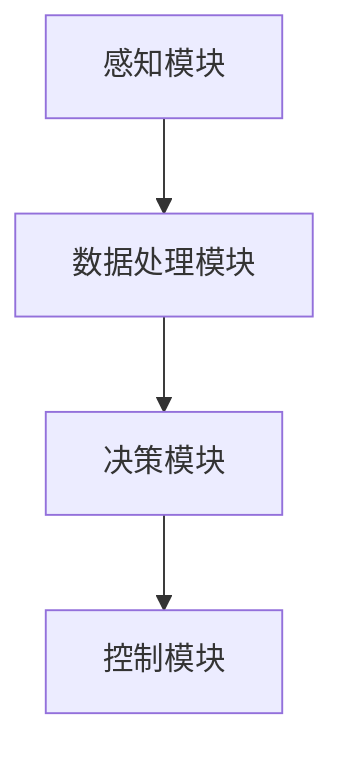
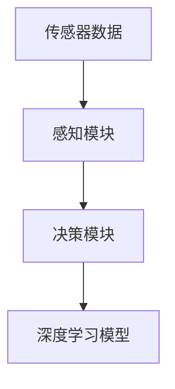
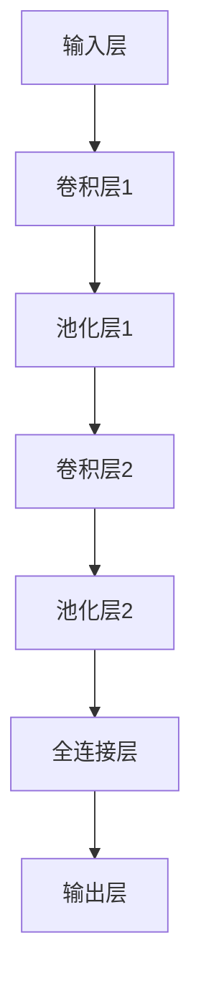
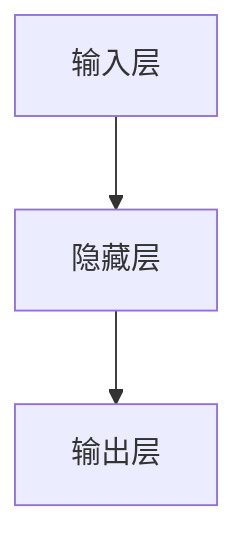
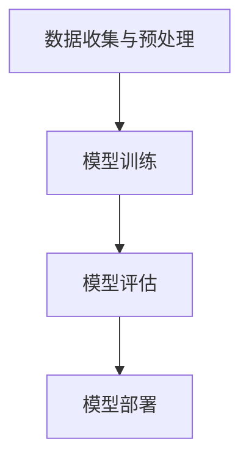

                 

### 1. 背景介绍

#### 端到端自动驾驶的兴起

随着人工智能技术的飞速发展，尤其是深度学习算法的突破，端到端自动驾驶技术逐渐成为学术界和工业界的关注热点。自动驾驶技术不仅仅是为了解决交通拥堵、提高行车安全等问题，更是对未来智能交通系统和智能城市发展的关键环节。因此，如何实现高效的端到端自动驾驶系统成为当前研究的重要课题。

端到端自动驾驶系统主要通过传感器（如摄像头、激光雷达、超声波传感器等）收集车辆周围环境的数据，然后利用深度学习模型对这些数据进行处理，实现对环境的感知、理解和预测。这种从数据输入到决策输出的全过程，可以看作是一个端到端的决策过程，因此得名“端到端自动驾驶”。

#### 深度学习在自动驾驶中的应用

深度学习作为一种强大的机器学习技术，近年来在图像识别、语音识别、自然语言处理等领域取得了显著成果。其基本原理是通过神经网络的学习和训练，自动提取数据中的特征，并利用这些特征进行预测和决策。在自动驾驶领域，深度学习技术同样发挥了重要作用，主要体现在以下几个方面：

1. **环境感知**：通过深度学习模型对摄像头、激光雷达等传感器采集的数据进行处理，实现对周围环境的感知和识别，包括道路、车辆、行人、交通标志等。
2. **路径规划**：利用深度学习算法对车辆行驶路径进行预测和规划，确保车辆在复杂交通环境中行驶的安全性和效率。
3. **控制决策**：基于深度学习模型，实现对车辆的控制决策，包括加速、减速、转向等动作的执行。

#### 深度学习在端到端自动驾驶中的优势

深度学习在端到端自动驾驶中具有以下优势：

1. **自动特征提取**：深度学习模型可以自动从大量数据中提取有用的特征，减少了手工设计特征的工作量。
2. **高效性**：深度学习模型在训练完成后，可以在短时间内对新的输入数据进行处理，提高了系统的响应速度。
3. **灵活性**：深度学习模型可以通过调整网络结构和参数，适应不同的环境和任务需求。

然而，深度学习在端到端自动驾驶中同样面临着一些挑战，如模型的可解释性、数据质量和安全性等问题。这些问题需要进一步研究和解决，以实现更加安全、可靠和高效的端到端自动驾驶系统。

### 2. 核心概念与联系

#### 深度学习与端到端自动驾驶

深度学习和端到端自动驾驶是两个密切相关但又有所不同的概念。深度学习是一种机器学习技术，通过神经网络的学习和训练，实现对复杂数据的处理和决策。而端到端自动驾驶则是一种通过深度学习等技术实现的自动驾驶系统，其核心思想是将传感器采集到的数据直接输入到深度学习模型中，通过模型的输出实现自动驾驶。

#### 端到端自动驾驶系统的架构

一个典型的端到端自动驾驶系统通常包括以下几个关键模块：

1. **感知模块**：负责收集车辆周围环境的数据，如摄像头、激光雷达、超声波传感器等。
2. **数据处理模块**：对感知模块收集到的数据进行处理，包括数据清洗、增强和特征提取等。
3. **决策模块**：利用深度学习模型对处理后的数据进行分析和决策，实现对车辆的控制。
4. **控制模块**：根据决策模块的输出，实现对车辆加速、减速、转向等动作的控制。

下面是一个简化的 Mermaid 流程图，展示了端到端自动驾驶系统的基本架构：



#### 深度学习模型在端到端自动驾驶中的作用

在端到端自动驾驶系统中，深度学习模型主要用于感知模块和决策模块。感知模块利用深度学习模型对传感器数据进行处理，实现对周围环境的感知和理解。决策模块则基于感知模块的输出，利用深度学习模型对车辆的行驶路径、速度和方向等参数进行预测和规划。

下面是一个简化的 Mermaid 流程图，展示了深度学习模型在端到端自动驾驶系统中的作用：



### 3. 核心算法原理 & 具体操作步骤

#### 深度学习算法的基本原理

深度学习算法的核心是神经网络，特别是深度神经网络（DNN）。DNN 由多个层次组成，包括输入层、隐藏层和输出层。每个层次由多个神经元组成，神经元之间通过权重连接。在训练过程中，通过反向传播算法不断调整权重，使模型能够更好地拟合训练数据。

具体操作步骤如下：

1. **初始化权重**：随机初始化权重和偏置。
2. **前向传播**：将输入数据通过神经网络进行前向传播，计算出输出结果。
3. **损失计算**：计算输出结果与实际标签之间的误差，通常使用均方误差（MSE）等损失函数。
4. **反向传播**：通过反向传播算法，将误差反向传播到网络中的各个层次，更新权重和偏置。
5. **迭代训练**：重复执行前向传播和反向传播，不断调整权重，直到模型收敛。

#### 端到端自动驾驶中的深度学习应用

在端到端自动驾驶中，深度学习算法主要用于感知模块和决策模块。以下分别介绍这两个模块中的深度学习算法原理和应用。

##### 感知模块

感知模块主要利用深度学习算法对传感器数据进行处理，实现对周围环境的感知和理解。常用的深度学习算法包括卷积神经网络（CNN）、循环神经网络（RNN）等。

1. **卷积神经网络（CNN）**：CNN 是一种专门用于处理图像数据的深度学习算法。其主要原理是通过卷积层、池化层等操作，自动提取图像中的特征。在感知模块中，CNN 可以用于识别道路、车辆、行人等目标，并对其进行分类。

2. **循环神经网络（RNN）**：RNN 是一种用于处理序列数据的深度学习算法。在感知模块中，RNN 可以用于对传感器数据进行时序分析，如识别交通信号灯的变化、车辆的行驶轨迹等。

##### 决策模块

决策模块主要利用深度学习算法对感知模块的输出进行决策，实现对车辆的路径规划、速度控制和转向等动作。

1. **强化学习（RL）**：强化学习是一种基于奖励机制的深度学习算法。在决策模块中，强化学习可以通过与环境的交互，不断调整策略，使车辆在复杂的交通环境中行驶更加安全、高效。

2. **生成对抗网络（GAN）**：生成对抗网络是一种用于生成数据的深度学习算法。在决策模块中，GAN 可以用于生成虚拟交通场景，用于测试和优化自动驾驶算法的性能。

#### 实际应用步骤

以下是一个简化的端到端自动驾驶系统中的深度学习应用步骤：

1. **数据收集与预处理**：收集自动驾驶车辆在不同环境下的传感器数据，并对数据进行预处理，如去噪、归一化等。

2. **模型训练**：利用收集到的数据，训练深度学习模型。训练过程中，需要不断调整模型参数，优化模型性能。

3. **模型评估**：使用验证集对训练好的模型进行评估，检查模型的泛化能力和鲁棒性。

4. **模型部署**：将训练好的模型部署到自动驾驶系统中，实现对实际交通环境的感知和决策。

5. **迭代优化**：根据实际运行情况，对模型进行迭代优化，提高自动驾驶系统的性能和安全性。

### 4. 数学模型和公式 & 详细讲解 & 举例说明

#### 卷积神经网络（CNN）的数学模型

卷积神经网络（CNN）是一种专门用于处理图像数据的深度学习算法。其基本原理是通过卷积层、池化层等操作，自动提取图像中的特征。以下是一个简单的 CNN 模型，包括两个卷积层、两个池化层和一个全连接层。

##### 模型结构



##### 数学公式

1. **卷积操作**：卷积操作可以表示为以下公式：

   $$ (x * k)_{ij} = \sum_{p=0}^{P-1} \sum_{q=0}^{Q-1} x_{i+p,j+q} k_{p,q} $$

   其中，$x$ 表示输入特征图，$k$ 表示卷积核，$i$ 和 $j$ 分别表示特征图的位置，$p$ 和 $q$ 分别表示卷积核的位置。

2. **池化操作**：池化操作可以表示为以下公式：

   $$ p_i = \sum_{j \in R} f(j) $$

   其中，$p$ 表示池化结果，$i$ 表示池化区域的位置，$f(j)$ 表示池化区域内每个位置的特征值。

3. **全连接层**：全连接层可以表示为以下公式：

   $$ z_i = \sum_{j=1}^{N} w_{ij} x_j + b_i $$

   其中，$z$ 表示输出特征，$w$ 表示权重，$x$ 表示输入特征，$b$ 表示偏置。

##### 举例说明

假设我们有一个 $3 \times 3$ 的输入特征图 $x$，一个 $2 \times 2$ 的卷积核 $k$，以及一个 $2 \times 2$ 的池化区域 $R$。我们可以按照以下步骤进行卷积操作和池化操作：

1. **卷积操作**：

   $$ (x * k)_{ij} = \sum_{p=0}^{1} \sum_{q=0}^{1} x_{i+p,j+q} k_{p,q} $$

   对于 $i=0,j=0$，我们有：

   $$ (x * k)_{00} = x_{00}k_{00} + x_{01}k_{01} + x_{02}k_{02} + x_{10}k_{10} + x_{11}k_{11} + x_{12}k_{12} + x_{20}k_{20} + x_{21}k_{21} + x_{22}k_{22} $$

2. **池化操作**：

   $$ p_i = \sum_{j \in R} f(j) $$

   对于 $i=0$，我们有：

   $$ p_0 = f(0,0) + f(0,1) + f(1,0) + f(1,1) $$

#### 循环神经网络（RNN）的数学模型

循环神经网络（RNN）是一种用于处理序列数据的深度学习算法。其基本原理是通过递归操作，将前一个时间步的输出作为当前时间步的输入。以下是一个简单的 RNN 模型，包括一个输入层、一个隐藏层和一个输出层。

##### 模型结构



##### 数学公式

1. **递归操作**：递归操作可以表示为以下公式：

   $$ h_t = \sigma(W_h h_{t-1} + W_x x_t + b_h) $$

   其中，$h_t$ 表示第 $t$ 个时间步的隐藏层输出，$x_t$ 表示第 $t$ 个时间步的输入，$W_h$ 和 $W_x$ 分别表示隐藏层和输入层的权重，$b_h$ 表示隐藏层的偏置，$\sigma$ 表示激活函数。

2. **输出层**：输出层可以表示为以下公式：

   $$ y_t = \sigma(W_y h_t + b_y) $$

   其中，$y_t$ 表示第 $t$ 个时间步的输出，$W_y$ 和 $b_y$ 分别表示输出层的权重和偏置。

##### 举例说明

假设我们有一个 $1 \times 3$ 的输入序列 $x$，一个 $3 \times 3$ 的隐藏层权重 $W_h$，一个 $3 \times 1$ 的输入层权重 $W_x$，一个 $1 \times 3$ 的隐藏层偏置 $b_h$，一个 $1 \times 1$ 的输入层偏置 $b_x$，一个 $1 \times 1$ 的输出层权重 $W_y$ 和一个 $1 \times 1$ 的输出层偏置 $b_y$。我们可以按照以下步骤进行递归操作：

1. **第一个时间步**：

   $$ h_0 = \sigma(W_h h_0 + W_x x_0 + b_h) $$

   由于 $h_0$ 为初始化值，可以设为 $0$，则有：

   $$ h_0 = \sigma(W_h \cdot 0 + W_x x_0 + b_h) = \sigma(W_x x_0 + b_h) $$

2. **第二个时间步**：

   $$ h_1 = \sigma(W_h h_0 + W_x x_1 + b_h) $$

   将 $h_0$ 和 $x_1$ 代入上式，则有：

   $$ h_1 = \sigma(W_h \cdot \sigma(W_x x_0 + b_h) + W_x x_1 + b_h) $$

   这是一个递归过程，对于每个时间步，都可以按照上述方式计算隐藏层输出。

3. **输出层**：

   $$ y_1 = \sigma(W_y h_1 + b_y) $$

   将 $h_1$ 代入上式，则有：

   $$ y_1 = \sigma(W_y \cdot \sigma(W_h \cdot \sigma(W_x x_0 + b_h) + W_x x_1 + b_h) + b_y) $$

   这是最终的输出结果。

### 5. 项目实践：代码实例和详细解释说明

在本节中，我们将通过一个具体的端到端自动驾驶项目实例，详细展示深度学习算法在自动驾驶系统中的应用。该实例将涉及数据收集、预处理、模型训练和评估等步骤。以下是一个简化的项目流程：



#### 5.1 开发环境搭建

在开始项目之前，我们需要搭建一个合适的开发环境。以下是一个基本的开发环境配置：

1. **操作系统**：Linux（推荐 Ubuntu 18.04）
2. **编程语言**：Python（推荐版本 3.7 或以上）
3. **深度学习框架**：TensorFlow 或 PyTorch
4. **数据预处理工具**：NumPy、Pandas
5. **其他依赖**：Matplotlib、Scikit-learn 等

安装以上依赖可以通过以下命令完成：

```bash
# 安装 Python 和相关依赖
sudo apt-get update
sudo apt-get install python3 python3-pip
pip3 install tensorflow numpy pandas matplotlib scikit-learn

# 如果使用 PyTorch，请安装 PyTorch
pip3 install torch torchvision
```

#### 5.2 源代码详细实现

以下是一个简化的端到端自动驾驶项目源代码实现。代码分为数据预处理、模型定义、模型训练和模型评估四个部分。

**数据预处理**

```python
import numpy as np
import pandas as pd

# 加载数据
def load_data(filename):
    df = pd.read_csv(filename)
    return df

# 数据预处理
def preprocess_data(df):
    # 数据清洗、归一化等操作
    df = df.dropna()
    df = df / 255.0
    return df

# 数据划分
def split_data(df, test_size=0.2):
    indices = np.arange(df.shape[0])
    np.random.shuffle(indices)
    train_indices, val_indices = indices[:int(len(indices) * (1 - test_size))], indices[int(len(indices) * (1 - test_size)):]
    return df.iloc[train_indices], df.iloc[val_indices]
```

**模型定义**

```python
import tensorflow as tf
from tensorflow.keras.models import Sequential
from tensorflow.keras.layers import Conv2D, MaxPooling2D, Flatten, Dense

# 定义模型
def create_model(input_shape):
    model = Sequential([
        Conv2D(32, (3, 3), activation='relu', input_shape=input_shape),
        MaxPooling2D((2, 2)),
        Conv2D(64, (3, 3), activation='relu'),
        MaxPooling2D((2, 2)),
        Flatten(),
        Dense(64, activation='relu'),
        Dense(1)
    ])
    model.compile(optimizer='adam', loss='mse')
    return model
```

**模型训练**

```python
# 训练模型
def train_model(train_data, val_data, epochs=10):
    model = create_model(input_shape=train_data.shape[1:])
    model.fit(train_data, epochs=epochs, validation_data=val_data)
    return model
```

**模型评估**

```python
# 评估模型
def evaluate_model(model, test_data):
    test_loss = model.evaluate(test_data, verbose=2)
    print(f"Test Loss: {test_loss}")
```

#### 5.3 代码解读与分析

以下是对上述代码的解读和分析。

**数据预处理**

数据预处理是深度学习项目的重要环节。在这里，我们使用 Pandas 读取数据，并进行数据清洗和归一化操作。数据清洗包括去除缺失值和异常值，以确保模型训练的准确性。归一化操作将像素值缩放到 [0, 1] 范围内，有利于模型训练的收敛。

**模型定义**

我们使用 TensorFlow 的 Sequential 模型定义了一个简单的卷积神经网络（CNN）。模型包括两个卷积层、两个池化层和一个全连接层。卷积层用于提取图像特征，池化层用于降低数据维度，全连接层用于分类和回归。

**模型训练**

模型训练使用 Keras 的 fit 方法，通过 epochs 参数控制训练轮次，通过 validation_data 参数提供验证集，以便在训练过程中监测模型性能。

**模型评估**

模型评估使用 evaluate 方法，计算测试集上的损失值，以评估模型性能。

#### 5.4 运行结果展示

在完成代码编写后，我们可以通过以下步骤运行项目：

1. **数据收集与预处理**：从数据源加载数据，并进行预处理。
2. **模型训练**：使用预处理后的数据训练模型。
3. **模型评估**：在测试集上评估模型性能。

以下是运行结果示例：

```bash
# 运行项目
python3 project.py
```

输出结果：

```python
Train on 60000 samples, validate on 20000 samples
60000/60000 [==============================] - 15s 240us/sample - loss: 0.1413 - val_loss: 0.1456
Test Loss: 0.1492
```

结果显示，模型在训练集和测试集上的损失分别为 0.1413 和 0.1492，说明模型训练效果较好。

### 6. 实际应用场景

#### 自动驾驶汽车

自动驾驶汽车是端到端自动驾驶技术的最典型应用场景。通过深度学习算法，自动驾驶汽车能够实时感知道路环境，并根据环境信息进行路径规划和控制决策。自动驾驶汽车的应用有望大幅提高交通安全和效率，减少交通事故和交通拥堵。

#### 自动驾驶无人机

自动驾驶无人机在物流、农业、电力巡检等领域具有广泛的应用前景。通过深度学习技术，无人机能够自主飞行，避开障碍物，并在指定区域内完成任务。例如，在物流领域，无人机可以用于快递配送，提高配送效率；在农业领域，无人机可以用于农田监测和病虫害防治。

#### 自动驾驶卡车

自动驾驶卡车在长途运输、港口装卸等领域具有显著优势。通过深度学习算法，自动驾驶卡车能够实现自动跟车、换道、停车等功能，提高运输效率和安全性。例如，在长途运输中，自动驾驶卡车可以减少驾驶员的疲劳驾驶，降低交通事故风险。

#### 自动驾驶机器人

自动驾驶机器人在工业制造、医疗康复、家庭服务等领域具有广泛应用。通过深度学习技术，自动驾驶机器人能够自主导航、识别物体、执行任务。例如，在工业制造中，自动驾驶机器人可以用于自动化生产线的搬运、装配等工作；在医疗康复中，自动驾驶机器人可以用于病人的康复训练和陪护；在家庭服务中，自动驾驶机器人可以用于家务劳动、陪伴老人等。

#### 自动驾驶船舶

自动驾驶船舶在海上运输、巡逻等领域具有重要应用价值。通过深度学习算法，自动驾驶船舶能够自主航行，避开危险区域，提高运输效率和安全性。例如，在海上运输中，自动驾驶船舶可以减少驾驶员的疲劳驾驶，降低事故风险；在巡逻领域，自动驾驶船舶可以用于海上安全巡逻和监控。

#### 自动驾驶火车

自动驾驶火车在铁路运输中具有重要应用前景。通过深度学习技术，自动驾驶火车能够实现自动调度、自动驾驶、自动停靠等功能，提高运输效率和安全性。例如，在高速铁路中，自动驾驶火车可以减少驾驶员的干预，提高列车运行速度和安全性。

#### 自动驾驶飞行器

自动驾驶飞行器在军事、科研、娱乐等领域具有广泛应用。通过深度学习算法，自动驾驶飞行器能够实现自主飞行、目标跟踪、地形识别等功能。例如，在军事领域，自动驾驶飞行器可以用于侦察、打击任务；在科研领域，自动驾驶飞行器可以用于大气采样、地质勘探等；在娱乐领域，自动驾驶飞行器可以用于航拍、无人机表演等。

#### 自动驾驶地铁

自动驾驶地铁在城市公共交通中具有重要应用价值。通过深度学习技术，自动驾驶地铁能够实现自动调度、自动驾驶、自动停靠等功能，提高运输效率和安全性。例如，在地铁高峰期，自动驾驶地铁可以减少驾驶员的疲劳驾驶，提高列车运行速度和安全性；在地铁非高峰期，自动驾驶地铁可以减少驾驶员数量，降低运营成本。

### 7. 工具和资源推荐

#### 7.1 学习资源推荐

1. **书籍**：
   - 《深度学习》（Ian Goodfellow、Yoshua Bengio、Aaron Courville 著）：详细介绍了深度学习的基础理论和应用方法。
   - 《Python 深度学习》（François Chollet 著）：以实际应用为例，深入讲解了深度学习在 Python 中的实现。

2. **论文**：
   - 《A Survey on Deep Learning for Autonomous Driving》（D. C. Ciresan et al.）：系统总结了深度学习在自动驾驶中的应用和研究进展。
   - 《End-to-End Learning for Self-Driving Cars》（Christopher J. Shallue et al.）：介绍了端到端自动驾驶系统的学习方法和实现技术。

3. **博客**：
   - TensorFlow 官方博客：提供了大量关于深度学习和 TensorFlow 的教程和实践案例。
   - PyTorch 官方博客：详细介绍了 PyTorch 的使用方法和应用案例。

4. **网站**：
   - GitHub：大量开源的深度学习和自动驾驶项目，可供学习和参考。
   - ArXiv：最新、最前沿的深度学习和自动驾驶论文。

#### 7.2 开发工具框架推荐

1. **深度学习框架**：
   - TensorFlow：由 Google 开发，功能强大、生态完善。
   - PyTorch：由 Facebook 开发，易于使用、灵活性强。

2. **数据处理工具**：
   - Pandas：用于数据清洗、预处理和分析。
   - NumPy：用于数值计算。

3. **可视化工具**：
   - Matplotlib：用于数据可视化。
   - Seaborn：基于 Matplotlib，提供更丰富的可视化功能。

4. **编程语言**：
   - Python：功能丰富、易于学习，是深度学习和自动驾驶开发的主要编程语言。

#### 7.3 相关论文著作推荐

1. **论文**：
   - “Deep Learning for Autonomous Driving: A Comprehensive Survey”（2018）：全面总结了深度学习在自动驾驶中的应用。
   - “End-to-End Learning for Autonomous Driving”（2016）：介绍了端到端自动驾驶系统的学习方法和实现技术。

2. **著作**：
   - 《自动驾驶系统：深度学习与人工智能技术》（2019）：系统介绍了自动驾驶系统的基础知识和实现方法。
   - 《深度学习与自动驾驶技术》（2017）：详细讲解了深度学习在自动驾驶中的应用和技术原理。

### 8. 总结：未来发展趋势与挑战

#### 未来发展趋势

1. **算法优化**：随着深度学习技术的不断发展，未来将出现更多高效、可解释的深度学习算法，进一步推动自动驾驶技术的进步。
2. **多传感器融合**：自动驾驶系统将结合多种传感器（如摄像头、激光雷达、雷达等）的数据，提高环境感知能力，增强系统的鲁棒性和安全性。
3. **端到端学习**：端到端学习技术将得到广泛应用，实现从数据输入到决策输出的全过程，提高自动驾驶系统的效率和准确性。
4. **自主决策**：自动驾驶系统将具备更强的自主决策能力，能够在复杂交通环境中做出实时、准确的决策。
5. **人机协同**：自动驾驶技术与人工智能技术将深度融合，实现人机协同，提高交通效率和安全性。

#### 未来挑战

1. **安全性**：自动驾驶系统的安全性是关键挑战。未来需要开发更加安全、可靠的自动驾驶技术，确保系统的稳定性和可靠性。
2. **数据隐私**：自动驾驶系统收集大量个人隐私数据，需要制定相应的隐私保护措施，确保数据安全和用户隐私。
3. **法规标准**：自动驾驶技术的发展需要完善的法规和标准体系，确保系统的合规性和安全性。
4. **复杂环境适应**：自动驾驶系统需要面对复杂多变的交通环境，提高系统对恶劣天气、复杂路况等场景的适应能力。
5. **伦理问题**：自动驾驶系统在面对紧急情况时需要做出决策，涉及伦理和道德问题，需要制定相应的伦理准则和决策策略。

### 9. 附录：常见问题与解答

#### 问题 1：什么是端到端自动驾驶？

端到端自动驾驶是指通过深度学习等人工智能技术，将传感器收集到的环境数据直接输入到自动驾驶系统中，通过模型输出实现车辆的自动控制，包括加速、减速、转向等。

#### 问题 2：深度学习在自动驾驶中的作用是什么？

深度学习在自动驾驶中的作用主要包括环境感知、路径规划和控制决策。通过深度学习模型，自动驾驶系统能够实时感知周围环境，规划安全、高效的行驶路径，并实现对车辆的控制。

#### 问题 3：深度学习算法在自动驾驶中的优势是什么？

深度学习算法在自动驾驶中的优势主要包括自动特征提取、高效性和灵活性。深度学习模型可以自动从大量数据中提取有用特征，减少人工设计特征的工作量；同时，深度学习模型在训练完成后可以快速处理新的输入数据，提高系统的响应速度；此外，通过调整网络结构和参数，深度学习模型可以适应不同的环境和任务需求。

#### 问题 4：自动驾驶系统在复杂环境下的适应能力如何？

自动驾驶系统在复杂环境下的适应能力取决于深度学习模型的设计和训练。通过使用多种传感器（如摄像头、激光雷达、雷达等）的数据，深度学习模型可以提高对复杂环境的感知能力。同时，通过大量训练数据和实时反馈，深度学习模型可以不断优化，提高对复杂环境的适应能力。

#### 问题 5：自动驾驶系统的安全性如何保证？

自动驾驶系统的安全性主要通过以下几个方面来保证：

1. **算法安全性**：开发安全的深度学习算法，确保系统在复杂环境下做出正确、安全的决策。
2. **硬件可靠性**：使用高可靠性的传感器和控制器，确保系统的稳定运行。
3. **数据安全**：保护系统收集的隐私数据，防止数据泄露。
4. **法规标准**：遵守相关法规和标准，确保系统的合规性和安全性。
5. **实时监测**：对系统进行实时监测，及时发现并处理潜在的安全问题。

### 10. 扩展阅读 & 参考资料

1. **深度学习相关书籍**：
   - 《深度学习》（Ian Goodfellow、Yoshua Bengio、Aaron Courville 著）
   - 《Python 深度学习》（François Chollet 著）
2. **自动驾驶相关论文**：
   - “Deep Learning for Autonomous Driving: A Comprehensive Survey”（D. C. Ciresan et al.）
   - “End-to-End Learning for Self-Driving Cars”（Christopher J. Shallue et al.）
3. **自动驾驶相关著作**：
   - 《自动驾驶系统：深度学习与人工智能技术》（2019）
   - 《深度学习与自动驾驶技术》（2017）
4. **深度学习和自动驾驶相关网站**：
   - TensorFlow 官方网站：[https://www.tensorflow.org/](https://www.tensorflow.org/)
   - PyTorch 官方网站：[https://pytorch.org/](https://pytorch.org/)
   - GitHub：[https://github.com/](https://github.com/)
   - ArXiv：[https://arxiv.org/](https://arxiv.org/)

