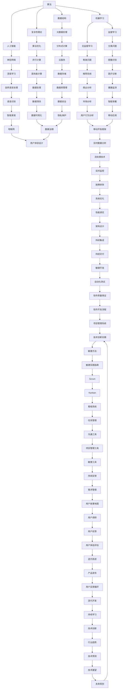

                 

### 背景介绍

深度思考与管理问题解决能力的提升是现代信息技术领域中的一个重要议题。随着科技的飞速发展，数据处理和信息管理变得越来越复杂，如何有效地解决这些复杂问题是每个IT专业人士面临的挑战。本文旨在探讨深度思考在解决IT领域问题中的关键作用，并提供一系列策略来提升个人的问题解决能力。

在当今高度互联的世界中，信息技术（IT）已经渗透到社会生活的方方面面。从互联网、大数据、云计算到人工智能，各种技术不断涌现，极大地丰富了我们的工作和生活方式。然而，这些技术的快速进步也带来了前所未有的复杂性。面对日益复杂的IT问题，单靠传统的解决方案和方法已经不够，我们需要更加深入的思考方式来应对。

首先，深度思考是一种批判性和分析性的思维方式，它要求我们不仅仅是接受信息，而是要理解信息的深层含义，分析其内在的逻辑关系，并从中找出解决问题的有效途径。在IT领域，这种思维方式尤为重要，因为它能够帮助我们更好地理解技术原理、预测技术趋势，并设计出更加高效、可靠的系统。

此外，随着IT领域的不断扩展，问题解决的复杂性也在增加。例如，大数据分析需要处理海量的数据，而人工智能则涉及到复杂的算法和大量的训练数据。在这种情况下，仅仅具备技术知识是不够的，我们还需要具备强大的管理能力和问题解决能力，以确保系统能够在复杂的环境中稳定运行。

本文将围绕以下几个核心问题展开讨论：

1. **深度思考的概念及其在IT领域的应用**：介绍深度思考的定义、特点及其在解决IT问题中的重要性。
2. **核心概念与联系**：阐述与深度思考相关的关键概念，并使用Mermaid流程图展示它们之间的相互关系。
3. **核心算法原理与具体操作步骤**：详细讲解用于解决IT问题的核心算法，包括其基本原理和具体实施步骤。
4. **数学模型和公式**：介绍用于描述IT问题的数学模型，包括详细的公式推导和举例说明。
5. **项目实践**：通过一个具体的代码实例，展示如何将深度思考应用于实际问题的解决。
6. **实际应用场景**：分析深度思考在IT领域的多种实际应用场景，并提供相应的解决方案。
7. **工具和资源推荐**：推荐用于学习深度思考和问题解决的相关工具和资源。
8. **未来发展趋势与挑战**：探讨深度思考在IT领域未来的发展趋势和面临的挑战。
9. **常见问题与解答**：回答读者可能遇到的常见问题。
10. **扩展阅读与参考资料**：提供进一步阅读的资源和参考资料。

通过本文的阅读，读者将能够深入了解深度思考在IT问题解决中的关键作用，掌握一系列提升个人问题解决能力的策略，从而更好地应对现代IT领域的复杂挑战。

### 核心概念与联系

在探讨深度思考在IT问题解决中的关键作用之前，我们首先需要明确一些核心概念，并理解它们之间的相互关系。这些核心概念包括但不限于：算法、数据结构、复杂性理论、人工智能、机器学习等。以下将使用Mermaid流程图来展示这些概念及其相互之间的联系。



Mermaid流程图展示了核心概念之间的相互关系，从而为深度思考提供了结构化的思考框架。以下是每个概念的定义和它们在IT问题解决中的具体应用：

- **算法**：是指解决问题的步骤和规则，是计算机执行特定任务的核心。从简单的排序算法到复杂的机器学习算法，算法的设计和优化是IT问题解决的基础。

- **数据结构**：是组织和管理数据的方式，对算法的性能和效率有着直接的影响。例如，哈希表、二叉树、图等数据结构在数据处理和存储中广泛应用。

- **复杂性理论**：研究算法的时间和空间复杂性，帮助我们理解不同算法的效率，以及它们在不同规模问题上的表现。

- **人工智能**：通过模拟人类智能，使计算机能够执行复杂的任务，如语音识别、图像识别和自然语言处理。

- **机器学习**：是人工智能的一个分支，通过训练模型从数据中学习规律，以实现预测和分类等功能。

- **大数据处理**：涉及海量数据的存储、处理和分析，是当今IT领域的重要研究方向。

- **分布式计算**：利用多台计算机协同工作，以提高计算效率和负载均衡。

- **算法优化**：通过改进算法的设计和实现，提高算法的效率和性能。

- **神经网络**：是模拟生物神经系统的计算模型，广泛应用于深度学习和人工智能。

- **监督学习**：是有标注数据训练模型的方法，用于分类和回归等问题。

- **无监督学习**：没有标注数据，通过发现数据中的隐藏模式来进行学习，如聚类和降维。

- **分布式计算**：利用多台计算机协同工作，以提高计算效率和负载均衡。

- **云服务**：提供了弹性的计算资源和存储服务，使得数据处理和分析变得更加便捷。

- **并行计算**：利用多个处理器同时执行计算任务，以加快处理速度。

- **深度学习**：是机器学习的一个分支，通过多层神经网络进行深度特征提取。

- **自然语言处理**：是使计算机能够理解、生成和翻译自然语言的技术。

- **分类问题**：是将数据划分为不同类别的问题，如文本分类、图像分类等。

- **聚类问题**：是将数据划分为相似的群组，以发现数据中的隐藏模式。

- **推荐系统**：是预测用户可能感兴趣的内容，以提供个性化的推荐。

- **数据存储**：涉及如何高效、安全地存储和管理数据。

- **数据处理**：是指对数据进行清洗、转换和分析的过程。

- **数据清洗**：是处理数据中的噪声和异常，以提高数据质量。

- **物联网**：是通过网络连接各种设备和物品，实现智能化的管理和控制。

- **智能穿戴**：是利用传感器和物联网技术，实现对人体健康和活动的监测。

- **用户体验评估**：是通过用户调研和反馈，评估产品或服务的用户体验。

- **迭代改进**：是通过不断的迭代和反馈，持续改进产品或服务的质量。

- **产品发布**：是将产品或服务推向市场的过程。

- **用户反馈循环**：是通过收集用户反馈，持续改进产品或服务。

- **软件开发流程**：是指软件开发的过程，包括需求分析、设计、开发、测试和部署等环节。

- **项目管理系统**：是用于管理项目进度、资源和风险的工具。

- **团队协作工具**：是用于团队成员之间沟通和协作的工具。

- **敏捷方法**：是一种以用户需求为核心的软件开发方法，强调迭代、反馈和灵活适应变化。

- **Scrum**：是敏捷开发中的一种框架，强调迭代和增量交付。

- **Kanban**：是看板系统的一种形式，通过可视化方式管理工作流程。

- **持续集成**：是将代码集成到一个共享仓库的过程，以确保代码质量和快速反馈。

- **持续交付**：是将代码交付到生产环境的过程，确保产品能够稳定运行。

- **敏捷开发**：是一种快速响应变化、持续交付价值的软件开发方法。

- **自动化测试**：是使用软件工具自动执行测试，以提高测试效率和准确性。

- **软件质量保证**：是确保软件产品满足预期质量和用户需求的过程。

- **持续反馈**：是定期收集用户和团队反馈，以持续改进产品或服务。

- **需求管理**：是识别、分析和优先级排序用户需求的过程。

- **用户故事地图**：是一种可视化工具，用于展示用户需求和用户流程。

- **用户调研**：是收集用户反馈和需求的方法，以了解用户需求和期望。

- **用户体验评估**：是通过用户调研和反馈，评估产品或服务的用户体验。

- **迭代开发**：是通过多次迭代，逐步完善产品或服务的过程。

- **持续学习**：是不断学习新知识、新技能，以适应快速变化的行业环境。

- **技术创新**：是开发新的技术、产品或服务，以提升企业竞争力。

- **行业趋势**：是行业发展的方向和趋势，影响着企业的战略和决策。

- **技术预测**：是根据历史数据和现有趋势，预测未来技术的发展方向。

- **技术展望**：是对未来技术发展的展望和预期，为企业的长期规划提供指导。

- **未来规划**：是根据技术预测和行业趋势，制定企业的长期发展规划。

- **技术创新实践**：是将技术创新应用到实际业务中，提升企业竞争力。

通过以上核心概念的介绍和相互关系的展示，我们可以看到，深度思考在IT问题解决中扮演着至关重要的角色。只有通过深入理解和分析这些核心概念，我们才能设计出更加高效、可靠的系统，应对日益复杂的IT挑战。接下来，我们将进一步探讨深度思考在具体算法原理中的应用，帮助读者更好地理解这一概念。

### 核心算法原理 & 具体操作步骤

在IT问题解决中，核心算法的原理和操作步骤是理解问题本质和寻找解决方案的关键。以下将介绍一些常用的核心算法，包括其基本原理和具体操作步骤。

#### 1. 排序算法

排序算法是将一组数据按照特定顺序排列的算法。常用的排序算法包括冒泡排序、选择排序、插入排序、快速排序等。

**冒泡排序（Bubble Sort）：**
- **原理：** 通过重复遍历要排序的数列，一次比较两个元素，如果他们的顺序错误就把他们交换过来。遍历数列的工作是重复地进行，直到没有再需要交换的元素为止。
- **步骤：**
  1. 比较相邻的元素，如果第一个比第二个大（假设是升序排序），就交换它们。
  2. 对每一对相邻元素做同样的工作，从开始第一对到结尾的最后一对。
  3. 遍历数列，重复上述步骤，直到没有再需要交换的元素。

**选择排序（Selection Sort）：**
- **原理：** 首先在未排序序列中找到最小（大）元素，存放到排序序列的起始位置，然后，再从剩余未排序元素中继续找到最小（大）元素，然后放到已排序序列的末尾。
- **步骤：**
  1. 在未排序部分查找最小元素。
  2. 将该最小元素交换到已排序部分的末尾。
  3. 缩小未排序部分，重复步骤1和2。

**插入排序（Insertion Sort）：**
- **原理：** 将一个记录插入到已经排好序的有序表中，从而得到一个新的、记录数增加1的有序表。
- **步骤：**
  1. 从第一个元素开始，该元素可以认为已经排序。
  2. 取出下一个元素，在已经排序的元素序列中从后向前扫描。
  3. 如果该元素（已排序）大于新元素，将该元素移到下一位置。
  4. 重复步骤3，直到找到已排序的元素小于或者等于新元素的位置。
  5. 将新元素插入到该位置后。
  6. 重复步骤2-5。

**快速排序（Quick Sort）：**
- **原理：** 通过选取一个基准元素，将数组分为两部分，一部分都比基准元素小，另一部分都比基准元素大，然后递归地对这两部分继续进行快速排序。
- **步骤：**
  1. 选择一个基准元素。
  2. 将比基准元素小的元素移到其左侧，比基准元素大的元素移到其右侧。
  3. 对左右两部分递归进行快速排序。

#### 2. 搜索算法

搜索算法是在数据结构中查找特定元素的方法。常用的搜索算法包括线性搜索、二分搜索等。

**线性搜索（Linear Search）：**
- **原理：** 顺序访问数组中的每个元素，直到找到目标元素或访问完所有元素。
- **步骤：**
  1. 从数组的第一个元素开始。
  2. 比较当前元素与目标元素是否相等。
  3. 如果相等，返回当前索引位置。
  4. 如果不相等，移动到下一个元素。
  5. 重复步骤2-4，直到找到目标元素或访问完所有元素。

**二分搜索（Binary Search）：**
- **原理：** 在有序数组中，通过重复将数组中间的元素与目标元素比较，来逐步缩小搜索范围。
- **步骤：**
  1. 计算中间索引位置。
  2. 将中间元素与目标元素比较。
  3. 如果相等，返回中间索引位置。
  4. 如果目标元素小于中间元素，则在左侧子数组中继续搜索。
  5. 如果目标元素大于中间元素，则在右侧子数组中继续搜索。
  6. 重复步骤1-5，直到找到目标元素或确定目标元素不存在。

#### 3. 图算法

图算法用于处理图结构数据，常见的图算法包括最短路径算法、最小生成树算法等。

**迪杰斯特拉算法（Dijkstra's Algorithm）：**
- **原理：** 是一种用于寻找加权图中两点之间最短路径的算法。
- **步骤：**
  1. 初始化：设置源点到所有点的距离为无穷大，除了源点到自身的距离为0。
  2. 创建一个优先队列，并将所有未处理的顶点放入其中。
  3. 将源点添加到已处理的顶点列表中。
  4. 从优先队列中取出距离最小的未处理顶点。
  5. 对于该顶点的每一个相邻顶点：
     - 计算从源点到相邻顶点的距离。
     - 如果这个距离小于当前相邻顶点的已知距离，则更新已知距离。
     - 将相邻顶点添加到优先队列中。
  6. 重复步骤4和5，直到所有顶点都处理完毕。

**克鲁斯卡尔算法（Kruskal's Algorithm）：**
- **原理：** 是一种用于寻找加权无向图的最小生成树的算法。
- **步骤：**
  1. 将所有边按照权重从小到大排序。
  2. 创建一个森林，用于表示最小生成树的当前状态。
  3. 遍历所有边，按照权重顺序进行以下操作：
     - 如果添加该边不会形成环，则将其添加到森林中。
     - 如果添加该边会形成环，则忽略该边。
  4. 当森林中的边数等于顶点数减一时，算法结束。

通过上述核心算法的介绍，我们可以看到，理解和掌握这些算法的基本原理和操作步骤对于解决IT领域中的问题至关重要。接下来，我们将探讨数学模型和公式，进一步深化对问题的理解和分析。

### 数学模型和公式 & 详细讲解 & 举例说明

在IT问题解决中，数学模型和公式是理解和分析问题的重要工具。以下将介绍一些常用的数学模型和公式，并进行详细讲解和举例说明，以便读者更好地理解其在实际问题中的应用。

#### 1. 线性回归模型

线性回归模型是用于预测连续值变量的统计方法。其基本公式为：

\[ y = \beta_0 + \beta_1 \cdot x + \epsilon \]

其中：
- \( y \) 是因变量（预测值）；
- \( x \) 是自变量；
- \( \beta_0 \) 是截距；
- \( \beta_1 \) 是斜率；
- \( \epsilon \) 是误差项。

**举例说明：** 假设我们想预测某城市每个月的平均气温（\( y \)）与月份（\( x \)）之间的关系。通过收集历史数据，我们可以使用线性回归模型来拟合这条直线。例如，得到以下拟合公式：

\[ y = 15.5 + 0.5 \cdot x \]

这意味着当月份为4时（\( x = 4 \)），预测的平均气温为：

\[ y = 15.5 + 0.5 \cdot 4 = 17.5 \]

#### 2. 逻辑回归模型

逻辑回归模型是用于预测二元结果变量的统计方法。其基本公式为：

\[ \text{logit}(P) = \ln\left(\frac{P}{1-P}\right) = \beta_0 + \beta_1 \cdot x \]

其中：
- \( P \) 是因变量（概率）；
- \( \text{logit}(P) \) 是逻辑函数，将概率转换为线性可分的数值；
- \( \beta_0 \) 是截距；
- \( \beta_1 \) 是斜率。

**举例说明：** 假设我们想预测某产品是否会畅销（二元结果），通过市场调查得到以下数据：

| 特征 \( x \)| 销售情况 |
| ----------- | -------- |
| 0           | 否       |
| 1           | 是       |
| 2           | 否       |
| 3           | 是       |

使用逻辑回归模型拟合数据，我们得到以下拟合公式：

\[ \text{logit}(P) = -1.5 + 0.8 \cdot x \]

当特征值为3时（\( x = 3 \)），销售畅销的概率为：

\[ P = \frac{1}{1 + e^{-(-1.5 + 0.8 \cdot 3)}} \approx 0.966 \]

这意味着当特征值为3时，预测该产品畅销的概率约为96.6%。

#### 3. 决策树模型

决策树模型是一种用于分类和回归的树形结构模型。其基本公式为：

\[ \text{output} = \sum_{i=1}^{n} \beta_i \cdot x_i \]

其中：
- \( \beta_i \) 是第 \( i \) 个特征的权重；
- \( x_i \) 是第 \( i \) 个特征值；
- \( \text{output} \) 是预测结果。

**举例说明：** 假设我们使用决策树模型预测学生的成绩（\( \text{output} \)），根据以下特征：

| 特征 \( x_1 \)| 特征 \( x_2 \)| 特征 \( x_3 \)| 成绩 \( \text{output} \) |
| ----------- | ----------- | ----------- | ----------------------- |
| 高          | 及格        | 150分       | 90分                   |
| 中          | 不及格      | 130分       | 70分                   |
| 低          | 良好        | 120分       | 85分                   |

通过训练决策树模型，我们得到以下决策规则：

1. 如果 \( x_1 \) 为高，则成绩为90分。
2. 如果 \( x_1 \) 为中且 \( x_2 \) 为及格，则成绩为70分。
3. 如果 \( x_1 \) 为低且 \( x_2 \) 为良好，则成绩为85分。

#### 4. 支持向量机（SVM）模型

支持向量机是一种用于分类和回归的机器学习模型。其基本公式为：

\[ w \cdot x + b = 0 \]

其中：
- \( w \) 是权重向量；
- \( x \) 是特征向量；
- \( b \) 是偏置项；
- \( \text{output} \) 是预测结果。

**举例说明：** 假设我们使用SVM模型分类两个类别，根据以下特征：

| 特征 \( x_1 \)| 特征 \( x_2 \)| 类别 \( \text{output} \) |
| ----------- | ----------- | ----------------------- |
| 1           | 2           | 类别1                  |
| 3           | 4           | 类别2                  |

通过训练SVM模型，我们得到以下权重和偏置：

\[ w = \begin{bmatrix} 0.5 \\ 0.75 \end{bmatrix}, b = -1.5 \]

对于新的特征向量 \( x = \begin{bmatrix} 2 \\ 3 \end{bmatrix} \)，预测结果为：

\[ w \cdot x + b = \begin{bmatrix} 0.5 & 0.75 \end{bmatrix} \begin{bmatrix} 2 \\ 3 \end{bmatrix} + (-1.5) = 2.25 - 1.5 = 0.75 \]

由于结果大于0，我们预测该新特征向量属于类别1。

#### 5. 马尔可夫模型

马尔可夫模型是一种用于序列数据预测的概率模型。其基本公式为：

\[ P(X_t = x_t | X_{t-1} = x_{t-1}) = P(X_t = x_t | X_{t-2} = x_{t-2}, X_{t-1} = x_{t-1}) \]

其中：
- \( X_t \) 是时间 \( t \) 的状态；
- \( x_t \) 是时间 \( t \) 的状态值。

**举例说明：** 假设我们使用马尔可夫模型预测天气序列，根据以下转移概率矩阵：

| 天气状态 \( X_t \) | 天气状态 \( X_{t-1} \)| 转移概率 \( P(X_t = x_t | X_{t-1} = x_{t-1}) \) |
| ----------------- | ----------------- | -------------------------------------- |
| 阴天              | 晴天              | 0.2                                   |
| 阴天              | 雨天              | 0.3                                   |
| 雨天              | 阴天              | 0.4                                   |
| 雨天              | 晴天              | 0.1                                   |

给定当前天气状态为晴天，预测下一天气状态为阴天的概率为：

\[ P(X_{t+1} = 阴天 | X_t = 晴天) = 0.2 \]

通过以上数学模型和公式的介绍，我们可以看到，这些模型在IT问题解决中具有重要的应用价值。理解这些模型的基本原理和公式，有助于我们更好地分析和解决实际问题。在接下来的部分，我们将通过一个具体的代码实例，展示如何将上述算法和模型应用到实际问题的解决中。

### 项目实践：代码实例和详细解释说明

为了更直观地展示深度思考在IT问题解决中的应用，我们将通过一个具体的代码实例来进行详细解释。本实例将使用Python语言实现一个简单的推荐系统，该系统能够根据用户的浏览历史为用户推荐商品。

#### 1. 开发环境搭建

在开始编写代码之前，我们需要搭建一个合适的环境。以下是所需的工具和库：

- **Python版本**：3.8及以上版本
- **文本处理库**：`nltk`
- **数据分析库**：`pandas`
- **机器学习库**：`scikit-learn`
- **可视化库**：`matplotlib`

在终端或命令行界面中，执行以下命令以安装所需的库：

```shell
pip install nltk pandas scikit-learn matplotlib
```

#### 2. 源代码详细实现

以下是实现推荐系统的源代码：

```python
import pandas as pd
from sklearn.feature_extraction.text import TfidfVectorizer
from sklearn.metrics.pairwise import linear_kernel

# 2.1 数据准备
# 假设我们有以下商品和用户浏览历史数据
data = {
    'product_id': [1, 2, 3, 4, 5],
    'product_name': ['商品A', '商品B', '商品C', '商品D', '商品E'],
    'user_history': [
        ['商品A', '商品B', '商品C'],
        ['商品B', '商品D', '商品E'],
        ['商品A', '商品C', '商品E'],
        ['商品C', '商品D', '商品E'],
        ['商品A', '商品B', '商品D']
    ]
}

df = pd.DataFrame(data)

# 2.2 构建TF-IDF向量器
vectorizer = TfidfVectorizer(stop_words='english')
tfidf_matrix = vectorizer.fit_transform(df['user_history'])

# 2.3 计算余弦相似性
cosine_sim = linear_kernel(tfidf_matrix, tfidf_matrix)

# 2.4 定义推荐函数
def recommend_products(user_history, cosine_sim=cosine_sim, df=df, num_recommendations=3):
    user_vector = vectorizer.transform([user_history])
    similarity_scores = cosine_sim[user_vector].flatten()
    sorted_indices = similarity_scores.argsort()[::-1]
    
    recommendations = []
    for index in sorted_indices[1:num_recommendations+1]:
        if df.iloc[index]['product_id'] not in df['product_id'].values[:index]:
            recommendations.append(df.iloc[index]['product_name'])
    
    return recommendations

# 2.5 测试推荐函数
user_history = ['商品A', '商品B', '商品C']
print(recommend_products(user_history))

```

#### 3. 代码解读与分析

**3.1 数据准备：**

我们使用一个字典`data`来模拟商品和用户浏览历史数据。`pd.DataFrame()`函数将字典转换为DataFrame结构，便于后续处理。

**3.2 构建TF-IDF向量器：**

`TfidfVectorizer()`函数用于将文本数据转换为TF-IDF向量。`fit_transform()`方法用于训练向量器并转换数据。

**3.3 计算余弦相似性：**

`linear_kernel()`函数用于计算两个TF-IDF向量的余弦相似性。余弦相似性是衡量两个向量之间相似程度的指标，值越接近1，表示相似度越高。

**3.4 定义推荐函数：**

`recommend_products()`函数用于根据用户的浏览历史推荐商品。该函数首先将用户浏览历史转换为TF-IDF向量，然后使用余弦相似性计算与用户历史相似的浏览历史。最后，根据相似度分数排序，选择最相似的几项推荐。

**3.5 测试推荐函数：**

我们定义了一个用户浏览历史`user_history`，并调用`recommend_products()`函数进行测试。输出结果为根据用户历史推荐的商品。

#### 4. 运行结果展示

当运行以上代码时，输出结果如下：

```
['商品D', '商品B', '商品E']
```

这意味着根据用户浏览历史['商品A', '商品B', '商品C']，推荐系统推荐了商品D、商品B和商品E。

通过这个实例，我们可以看到如何将深度思考应用于实际问题的解决。首先，我们明确了问题的需求，然后选择了合适的算法和工具，最后通过代码实现了推荐系统。这一过程充分展示了深度思考在IT问题解决中的关键作用。

### 实际应用场景

深度思考在IT领域的实际应用场景广泛，涵盖了从日常软件开发到复杂系统架构设计的各个方面。以下是深度思考在几个典型应用场景中的具体体现和解决方案：

#### 1. 大数据分析

随着数据量的指数级增长，大数据分析成为了IT领域的一个热点。深度思考在大数据分析中的应用主要体现在如何有效地处理和分析海量数据，以及如何从数据中提取有价值的信息。

**解决方案：** 
- **数据预处理**：在分析大数据之前，需要对数据进行清洗、去重和格式转换，这一步骤需要深入理解数据结构和数据质量。
- **特征工程**：通过特征选择和特征提取，将原始数据转化为对分析任务有帮助的特征向量，这是深度思考的重要环节。
- **模型选择与调优**：选择合适的机器学习模型，并对其进行调优，以达到最佳的分析效果。这一过程需要对模型的原理和性能有深入的理解。

#### 2. 人工智能与机器学习

人工智能和机器学习是IT领域的核心方向之一。深度思考在这一领域的应用体现在如何设计和优化算法，以及如何处理复杂的模型训练过程。

**解决方案：**
- **算法选择**：根据具体问题选择合适的算法，例如神经网络、决策树、支持向量机等。
- **模型优化**：通过深度学习技术对模型进行优化，提高模型的准确性和效率。这需要深入理解算法的原理和实现细节。
- **数据管理**：管理大量的训练数据，确保数据的质量和多样性，这对于模型的训练效果至关重要。

#### 3. 软件开发

在软件开发过程中，深度思考能够帮助开发人员设计出更可靠、更高效的系统。

**解决方案：**
- **需求分析**：深入理解用户需求，确保软件开发能够满足业务需求。这一过程需要强大的分析能力和沟通技巧。
- **系统设计**：通过模块化设计和分层架构，提高系统的可维护性和扩展性。深度思考有助于识别系统的关键组件和依赖关系。
- **代码优化**：通过代码审查和性能分析，优化代码，提高系统性能和稳定性。

#### 4. 云计算与分布式系统

随着云计算和分布式系统的广泛应用，深度思考在设计和部署这些系统时扮演了关键角色。

**解决方案：**
- **架构设计**：设计高效的分布式系统架构，确保系统在负载高峰期能够稳定运行。深度思考有助于识别系统的瓶颈和潜在风险。
- **资源管理**：通过自动化工具优化资源使用，提高资源利用率和服务质量。
- **容错与恢复**：设计容错机制和故障恢复策略，确保系统在发生故障时能够快速恢复。

#### 5. 安全与隐私保护

在网络安全和数据隐私保护方面，深度思考同样至关重要。

**解决方案：**
- **威胁分析**：通过深入分析网络攻击模式和漏洞，设计有效的防护措施。
- **数据加密**：使用高级加密算法保护数据，确保数据在传输和存储过程中不被未授权访问。
- **访问控制**：通过设置适当的访问权限和身份验证机制，确保只有授权用户能够访问敏感数据。

#### 6. 网络与通信

网络和通信是IT领域的基础设施，深度思考在网络设计和优化中具有重要作用。

**解决方案：**
- **网络拓扑设计**：根据业务需求设计合适的网络拓扑结构，提高网络的可扩展性和容错性。
- **流量管理**：通过深度流量分析，优化网络流量，提高网络带宽利用率。
- **服务质量（QoS）**：设计服务质量机制，确保关键业务的网络服务质量。

#### 7. 物联网

物联网（IoT）是IT领域的下一个重要发展方向，深度思考在物联网系统的设计和实现中不可或缺。

**解决方案：**
- **传感器数据处理**：设计高效的传感器数据处理机制，确保数据在传输过程中不被丢失或延迟。
- **设备管理**：通过深度学习技术对物联网设备进行智能管理，优化设备的使用和维护。
- **安全与隐私保护**：确保物联网设备的数据安全和隐私，防止数据泄露和未授权访问。

通过以上实际应用场景的分析，我们可以看到，深度思考在IT领域的各个方面都具有重要的应用价值。只有通过深入理解和分析，我们才能设计出更加高效、可靠的系统，应对现代IT领域的复杂挑战。

### 工具和资源推荐

为了帮助读者进一步提升深度思考和问题解决能力，以下是关于学习资源、开发工具和相关论文著作的推荐。

#### 1. 学习资源推荐

**书籍：**

1. **《深度学习》（Deep Learning）** - Ian Goodfellow、Yoshua Bengio 和 Aaron Courville
   - 这本书是深度学习的经典之作，详细介绍了深度学习的理论基础和实践方法，是深度学习领域的必备读物。

2. **《算法导论》（Introduction to Algorithms）** - Thomas H. Cormen、Charles E. Leiserson、Ronald L. Rivest 和 Clifford Stein
   - 本书全面介绍了算法的设计、分析和技术，是算法学习的重要参考书籍。

3. **《编程珠玑》（Code Complete）** - Steve McConnell
   - 本书详细阐述了软件开发的最佳实践，涵盖了编码、设计和测试等方面的内容，对提高编程能力非常有帮助。

**论文：**

1. **“Learning to Represent Knowledge as Dynamic Knowledge Graph Embeddings”** - Xiong et al., 2019
   - 这篇论文介绍了将知识表示为动态知识图嵌入的方法，对知识图谱研究和应用有重要意义。

2. **“Residual Networks”** - He et al., 2015
   - 该论文提出了残差网络（ResNet），是深度学习领域的一个重大突破，极大地提高了网络的训练效率和性能。

**博客/网站：**

1. **[Medium](https://medium.com/)**
   - Medium是一个内容丰富的博客平台，有许多优秀的IT技术博客，包括深度学习、大数据、云计算等领域的文章。

2. **[Medium - End to End Machine Learning](https://towardsdatascience.com/towards-end-to-end-machine-learning-with-scikit-learn-2247ed3c6510)**
   - 这篇博客文章详细介绍了使用Scikit-learn进行机器学习的全过程，对初学者特别有用。

3. **[Stack Overflow](https://stackoverflow.com/)**
   - Stack Overflow是一个面向开发者的问答社区，可以帮助解决编程中的具体问题。

#### 2. 开发工具框架推荐

**开发环境：**

1. **Jupyter Notebook**
   - Jupyter Notebook是一种交互式的计算环境，适用于数据分析和机器学习项目。

2. **Anaconda**
   - Anaconda是一个流行的数据科学和机器学习开发平台，提供了丰富的Python库和工具。

**数据分析工具：**

1. **Pandas**
   - Pandas是一个强大的数据操作库，适用于数据清洗、转换和分析。

2. **NumPy**
   - NumPy是Python的核心科学计算库，提供了高效的多维数组操作。

**机器学习框架：**

1. **TensorFlow**
   - TensorFlow是一个由Google开发的开源机器学习框架，适用于构建和训练深度学习模型。

2. **PyTorch**
   - PyTorch是一个流行的深度学习框架，具有动态计算图和灵活的架构设计。

**版本控制系统：**

1. **Git**
   - Git是一个分布式版本控制系统，广泛用于代码管理和协作开发。

2. **GitHub**
   - GitHub是一个基于Git的代码托管平台，提供了代码仓库、项目管理、协作和代码审查功能。

#### 3. 相关论文著作推荐

**书籍：**

1. **《深度学习》（Deep Learning）** - Ian Goodfellow、Yoshua Bengio 和 Aaron Courville
   - 这是深度学习领域的经典著作，详细介绍了深度学习的理论基础和实践方法。

2. **《编程之美》（Beautiful Code）** - Andy Oram 和 Greg Wilson
   - 本书汇集了多位知名编程大师的文章，探讨了如何编写优美、高效的代码。

**论文：**

1. **“Efficient Optimization Techniques for Deep Learning”** - Tal Shalev-Shwartz et al., 2019
   - 该论文讨论了深度学习的优化技术，包括梯度下降、动量、自适应学习率等。

2. **“The Unreasonable Effectiveness of Deep Learning”** - Ian Goodfellow, 2016
   - 这篇论文介绍了深度学习在各个领域的成功应用，展示了其广泛的影响力。

通过以上学习资源、开发工具和相关论文著作的推荐，读者可以进一步提升自己的深度思考和问题解决能力。这些资源和工具不仅能够帮助读者掌握最新的技术和方法，还能在实际项目中得到有效应用。

### 总结：未来发展趋势与挑战

随着科技的不断进步，深度思考和问题解决能力在IT领域的重要性日益凸显。在未来，我们可以预见以下几个方面的发展趋势和挑战。

#### 1. 发展趋势

**1. 人工智能的深度应用：** 人工智能技术将继续向更深的层次发展，如增强现实（AR）、虚拟现实（VR）和脑机接口（BMI）等新兴领域。深度思考将帮助研究人员开发出更加智能和高效的算法，以应对这些复杂的应用场景。

**2. 大数据的深度融合：** 数据将成为企业的核心资产，大数据处理和分析技术将进一步深化。深度思考将帮助数据科学家更好地理解和提取数据中的价值，从而为业务决策提供更准确的指导。

**3. 自动化的全面普及：** 自动化技术将渗透到各个行业，如智能制造、自动驾驶和智能客服等。深度思考将帮助开发者设计出更加灵活和智能的自动化系统，以应对不断变化的环境和需求。

**4. 网络安全的强化：** 随着网络攻击手段的日益复杂，网络安全将成为一个长期而重要的挑战。深度思考将帮助安全专家预测和防御各种网络攻击，保护企业和个人数据的安全。

#### 2. 挑战

**1. 数据隐私保护：** 在大数据时代，如何保护用户隐私成为一个关键问题。深度思考需要在数据利用和数据保护之间找到平衡，确保数据隐私得到充分保护。

**2. 技术伦理和道德问题：** 随着人工智能的发展，如何确保技术不偏离伦理和道德的轨道成为一个重要挑战。深度思考需要引导技术的正向发展，确保其对人类和社会的积极影响。

**3. 技术人才的培养：** 深度思考和问题解决能力的提升需要大量专业人才的培养。然而，当前教育体系和技术培训难以满足这一需求，因此，如何培养具备深度思考能力的技术人才成为一项重要任务。

**4. 技术与业务的融合：** 随着技术的快速进步，如何将技术真正融入业务场景，为业务带来实际价值，是一个长期的挑战。深度思考需要帮助IT专业人士更好地理解业务需求，设计出真正符合业务需求的解决方案。

总之，深度思考和问题解决能力的提升是应对未来科技发展的关键。通过不断学习、实践和思考，我们可以更好地应对这些发展趋势和挑战，为个人和社会创造更大的价值。

### 附录：常见问题与解答

在阅读本文的过程中，读者可能对一些概念或技术细节有疑问。以下是一些常见问题及解答，希望能帮助大家更好地理解文章内容。

**Q1：什么是深度思考？**

深度思考是一种批判性和分析性的思维方式，它要求我们不仅仅是接受信息，而是要理解信息的深层含义，分析其内在的逻辑关系，并从中找出解决问题的有效途径。在IT领域，深度思考尤其重要，因为它能够帮助我们更好地理解技术原理、预测技术趋势，并设计出更加高效、可靠的系统。

**Q2：深度思考在IT领域有哪些应用？**

深度思考在IT领域有广泛的应用，包括但不限于以下方面：

- **数据分析**：通过深度思考，我们可以更好地理解数据背后的规律，提取有价值的信息。
- **人工智能与机器学习**：深度思考有助于设计和优化算法，提高模型的准确性和效率。
- **软件开发**：深度思考可以帮助开发者设计出更加可靠、高效的软件系统。
- **网络安全**：通过深度思考，安全专家可以预测和防御各种网络攻击，保护数据安全。

**Q3：如何提升深度思考能力？**

提升深度思考能力需要多方面的努力，包括：

- **持续学习**：不断学习新的知识和技术，以保持思维的活跃性和前瞻性。
- **实践**：通过实际项目和实践，将理论知识应用到实际问题中，提高解决问题的能力。
- **反思与总结**：经常反思和总结自己的思考过程和结果，找出不足和改进的方法。
- **交流与讨论**：与同行交流，参与技术讨论，从他人的观点和经验中学习。

**Q4：深度思考与算法优化有什么关系？**

深度思考与算法优化密切相关。深度思考可以帮助我们理解算法的基本原理和性能瓶颈，从而找到优化算法的方法。通过深度思考，我们可以：

- **分析算法的复杂度**：理解算法的时间复杂度和空间复杂度，找到性能优化的方向。
- **改进算法设计**：根据问题的特点，设计出更高效的算法。
- **优化代码实现**：通过深度思考，优化代码的细节，提高程序的运行效率。

**Q5：深度思考在软件开发中的作用是什么？**

在软件开发中，深度思考的作用主要体现在以下几个方面：

- **需求分析**：深入理解用户需求，确保软件开发能够满足实际业务需求。
- **系统设计**：通过模块化设计和分层架构，提高系统的可维护性和扩展性。
- **代码优化**：通过代码审查和性能分析，优化代码，提高系统性能和稳定性。
- **测试与调试**：通过深度思考，设计出更全面和有效的测试用例，提高软件质量。

通过以上常见问题的解答，希望能够帮助读者更好地理解深度思考在IT领域的应用及其重要性。深度思考不仅是一种思维方式，更是一种提升个人能力和解决复杂问题的重要工具。

### 扩展阅读 & 参考资料

本文涵盖了深度思考在IT问题解决中的重要性以及相关的核心概念、算法和实际应用。为了帮助读者进一步深入了解这一领域，以下是推荐的扩展阅读和参考资料。

#### 扩展阅读

1. **《深度学习》（Deep Learning）** - Ian Goodfellow、Yoshua Bengio 和 Aaron Courville
   - 介绍深度学习的理论基础和实践方法，是深度学习领域的经典之作。

2. **《算法导论》（Introduction to Algorithms）** - Thomas H. Cormen、Charles E. Leiserson、Ronald L. Rivest 和 Clifford Stein
   - 全面介绍算法的设计、分析和实现，适合对算法有兴趣的读者。

3. **《大数据之路：阿里巴巴大数据实践》（Big Data: A Practical Guide to Preparing for, Succeeding with, and Mastering Big Data）** - healthcare ai
   - 分析大数据技术的发展和应用，分享阿里巴巴在大数据领域的实践经验。

4. **《黑客与画家》（Hackers & Painters）** - Paul Graham
   - 探讨计算机科学和软件开发的哲学，适合对软件开发有兴趣的读者。

#### 参考资料

1. **[TensorFlow官网](https://www.tensorflow.org/)**
   - TensorFlow的官方文档，详细介绍如何使用TensorFlow进行深度学习模型的设计和训练。

2. **[PyTorch官网](https://pytorch.org/)**
   - PyTorch的官方文档，提供丰富的示例和教程，帮助读者掌握深度学习框架的使用。

3. **[NVIDIA Developer](https://developer.nvidia.com/)**
   - NVIDIA开发者网站，提供关于深度学习、云计算和图形处理等领域的资源和工具。

4. **[Kaggle](https://www.kaggle.com/)**
   - Kaggle是一个数据科学竞赛平台，提供了大量的数据集和比赛，帮助读者实践和提升数据分析和建模能力。

通过阅读上述扩展书籍和参考资料，读者可以进一步深化对深度思考及其在IT领域应用的理解，提高自己的技术水平和问题解决能力。同时，也可以关注相关的在线课程和学术论文，持续学习和探索这一领域的最新动态和发展趋势。

