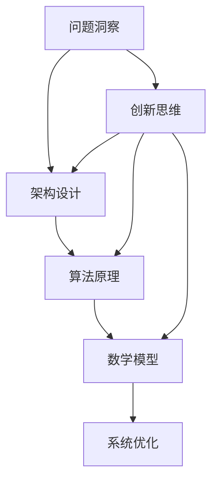

                 

### 深度思考的意义：洞察问题的本质

#### 关键词：深度思考，问题洞察，技术思维，架构设计，算法原理，数学模型

> 在信息技术飞速发展的时代，深度思考成为解决复杂问题的利器。本文旨在探讨深度思考的意义，通过解析问题本质，引导读者掌握洞察力的技术方法，提升技术思维能力。

#### 摘要：

深度思考是信息技术领域的重要技能，它不仅帮助我们发现问题的核心，还促使我们形成创新的解决方案。本文首先介绍了深度思考的基本概念，然后通过技术领域的实际案例，详细阐述了深度思考在问题洞察、架构设计和算法原理理解中的应用。文章还探讨了数学模型在深度思考中的重要作用，并通过具体代码实例展示了如何将深度思考应用于实践。最后，文章总结了深度思考在技术发展中的重要性，并展望了未来可能面临的挑战。

---

### 1. 背景介绍

随着互联网和人工智能技术的迅速发展，信息技术领域的问题变得越来越复杂。从大数据分析到复杂算法设计，从分布式系统架构到人工智能模型优化，技术专家面临着前所未有的挑战。在这样的背景下，传统的浅层思考已经无法应对复杂的问题。深度思考作为一种深入分析和理解问题本质的方法，逐渐受到重视。

深度思考不仅涉及对问题的全面理解，还包括对问题背后原理的深入探究。它是一种系统性的思维方式，通过多角度、多层次的分析，帮助我们从复杂的现象中提取关键信息，洞察问题的本质。深度思考的核心在于打破思维的定式，克服经验主义，追求理性和科学的解决方案。

在技术领域，深度思考的重要性尤为突出。一个优秀的程序员不仅需要熟练的编程技能，更需要具备深刻的思考能力。只有通过深度思考，我们才能在设计复杂系统时发现潜在的隐患，在实现算法时优化性能，在解决现实问题时找到创新的解决方案。因此，培养深度思考的能力成为技术人才成长的重要任务。

#### 1.1 深度思考的基本概念

深度思考是一种系统性的思维方式，它强调对问题的全面、深入分析。具体来说，深度思考包括以下几个关键要素：

- **全面性**：深度思考需要对问题的各个方面进行全面分析，而不只是关注表面的现象。
- **层次性**：深度思考需要从多个层次理解问题，从宏观到微观，从理论到实践，从而形成完整的认知体系。
- **系统性**：深度思考强调问题各部分之间的内在联系，通过系统性的分析，揭示问题的整体规律。
- **创造性**：深度思考鼓励创新思维，通过打破传统的思维定式，寻求全新的解决方案。

#### 1.2 深度思考在技术领域的重要性

在技术领域，深度思考的重要性体现在以下几个方面：

- **问题解决**：深度思考帮助技术专家识别问题的核心，找到根本原因，从而提出有效的解决方案。
- **架构设计**：在系统架构设计中，深度思考能够帮助设计者发现潜在的风险和优化点，设计出更稳定、高效的系统。
- **算法优化**：算法优化需要深入了解算法的原理，通过深度思考，可以找到优化的关键点，提高算法的效率。
- **创新突破**：深度思考鼓励创新，通过深入分析现有技术，可以找到改进和创新的方向，推动技术的进步。

### 2. 核心概念与联系

为了更好地理解深度思考在技术领域的应用，我们需要首先了解一些核心概念和它们之间的联系。以下是一个使用Mermaid流程图表示的核心概念和联系：



#### 2.1 问题洞察

问题洞察是深度思考的起点，它要求我们对问题进行全面、深入的分析。通过问题洞察，我们能够明确问题的核心，识别问题的成因，为后续的解决提供方向。

#### 2.2 架构设计

架构设计是系统开发的重要环节，它涉及到系统的整体结构和各个模块之间的关系。深度思考在架构设计中的应用主要体现在以下几个方面：

- **风险识别**：通过深度思考，设计者可以识别系统可能面临的风险，从而在设计阶段就进行预防。
- **性能优化**：深度思考可以帮助设计者发现系统性能的瓶颈，提出优化方案，提高系统的效率。
- **可扩展性**：深度思考有助于设计者设计出具有良好可扩展性的系统架构，以应对未来的需求变化。

#### 2.3 算法原理

算法原理是解决具体问题的核心，它是技术领域的关键组成部分。深度思考在算法原理中的应用主要体现在以下几个方面：

- **算法选择**：通过深度思考，我们可以选择最适合解决特定问题的算法，避免使用低效的算法。
- **算法优化**：深度思考可以帮助我们深入理解算法的工作原理，从而找到优化的可能性，提高算法的效率。
- **算法创新**：深度思考鼓励我们打破常规，探索新的算法思路，实现技术突破。

#### 2.4 数学模型

数学模型是描述现实世界问题的抽象工具，它在技术领域中发挥着重要作用。深度思考在数学模型中的应用主要体现在以下几个方面：

- **模型构建**：通过深度思考，我们可以构建更准确、更实用的数学模型，为问题解决提供基础。
- **模型验证**：深度思考可以帮助我们验证数学模型的准确性，确保其能够有效解决实际问题。
- **模型优化**：通过深度思考，我们可以不断优化数学模型，提高其解决问题的能力。

#### 2.5 系统优化

系统优化是技术领域中的一项重要任务，它涉及到系统的各个方面。深度思考在系统优化中的应用主要体现在以下几个方面：

- **性能优化**：通过深度思考，我们可以发现系统性能的瓶颈，提出优化方案，提高系统的效率。
- **稳定性优化**：深度思考可以帮助我们识别系统的潜在风险，提出稳定性的优化策略。
- **可扩展性优化**：深度思考有助于设计出具有良好可扩展性的系统，以应对未来的需求变化。

#### 2.6 创新思维

创新思维是深度思考的重要体现，它鼓励我们在技术领域中不断探索新的可能性。深度思考在创新思维中的应用主要体现在以下几个方面：

- **创新方向**：通过深度思考，我们可以发现技术发展的新方向，提出创新性的解决方案。
- **思维拓展**：深度思考可以帮助我们拓展思维边界，克服思维定式，实现技术的创新突破。
- **跨领域融合**：深度思考鼓励我们跨学科、跨领域思考，将不同领域的知识融合，创造新的技术价值。

通过上述核心概念及其联系的分析，我们可以看出，深度思考在技术领域中具有重要的作用。它不仅帮助我们解决具体问题，还推动技术的不断进步和创新。

### 3. 核心算法原理 & 具体操作步骤

在技术领域，核心算法原理的理解和掌握是解决复杂问题的关键。以下我们将详细讨论一种经典的算法原理，并逐步介绍其具体操作步骤。

#### 3.1 快速排序算法原理

快速排序（Quick Sort）是一种高效的排序算法，它的基本原理是通过一趟排序将待排序的记录分隔成独立的两部分，其中一部分记录的关键字均比另一部分的关键字小，则可分别对这两部分记录继续进行排序，以达到整个序列有序。快速排序是一种分治法的典型应用，其时间复杂度为O(n log n)。

#### 3.2 快速排序的具体操作步骤

以下是快速排序的具体操作步骤：

**步骤1：选择基准元素**
- 从数组中选择一个元素作为基准元素（pivot）。通常选择第一个或最后一个元素作为基准元素，也可以选择随机元素。

**步骤2：分区操作**
- 将数组分为两部分：小于基准元素的部分和大于基准元素的部分。这一过程称为分区操作。
- 从数组的第一个元素开始，遍历所有元素，将小于基准元素的元素放在其左侧，大于或等于基准元素的元素放在其右侧。

**步骤3：递归排序**
- 对小于基准元素的部分继续执行快速排序。
- 对大于基准元素的部分继续执行快速排序。

**步骤4：合并结果**
- 当递归排序结束，整个数组的所有元素都将有序排列。

#### 3.3 快速排序代码实现

以下是快速排序的Python代码实现：

```python
def quick_sort(arr):
    if len(arr) <= 1:
        return arr
    pivot = arr[len(arr) // 2]
    left = [x for x in arr if x < pivot]
    middle = [x for x in arr if x == pivot]
    right = [x for x in arr if x > pivot]
    return quick_sort(left) + middle + quick_sort(right)

# 示例
arr = [3, 6, 8, 10, 1, 2, 1]
sorted_arr = quick_sort(arr)
print(sorted_arr)
```

#### 3.4 快速排序的优化

尽管快速排序的平均时间复杂度为O(n log n)，但在最坏的情况下，时间复杂度可能会上升到O(n^2)。为了优化快速排序，可以采用以下策略：

- **随机化选择基准元素**：避免固定选择第一个或最后一个元素作为基准元素，从而减少最坏情况发生的概率。
- **三数取中法**：选择中间值作为基准元素，以减少偏斜的影响。
- **插入排序优化**：当子数组的大小小于某个阈值时，使用插入排序代替快速排序，因为插入排序在这种情况下更高效。

通过这些优化策略，我们可以进一步提高快速排序的性能。

#### 3.5 快速排序的应用场景

快速排序适用于需要对大量数据进行排序的场景，例如数据库排序、数据挖掘、文本排序等。由于其高效性和稳定性，快速排序在许多实际应用中得到了广泛的应用。

### 4. 数学模型和公式 & 详细讲解 & 举例说明

在深度思考的过程中，数学模型和公式扮演着至关重要的角色。它们不仅帮助我们量化问题，还能够提供精确的解决方案。以下是几个在技术领域中常用的数学模型和公式，以及它们的具体解释和实际应用示例。

#### 4.1 概率论

概率论是数学的一个重要分支，它用于描述随机事件的概率。在技术领域，概率论广泛应用于人工智能、机器学习和数据科学中。

**数学公式**：
- 概率分布函数：\( P(X = x) \)
- 条件概率：\( P(A|B) = \frac{P(A \cap B)}{P(B)} \)
- 独立事件：\( P(A \cap B) = P(A) \times P(B) \)

**详细讲解**：
- 概率分布函数描述了随机变量取某个值的概率。
- 条件概率表示在某个事件发生的前提下，另一个事件发生的概率。
- 独立事件表示两个事件之间没有相互影响，即一个事件的发生不影响另一个事件。

**举例说明**：
假设一个硬币有正面和反面，每次抛掷硬币正面朝上的概率为0.5。如果我们连续抛掷两次硬币，求两次正面朝上的概率。
- 概率分布函数：\( P(\text{正面}) = 0.5 \)
- 条件概率：\( P(\text{第二次正面}|\text{第一次正面}) = 0.5 \)
- 独立事件：\( P(\text{第一次正面} \cap \text{第二次正面}) = P(\text{第一次正面}) \times P(\text{第二次正面}) = 0.5 \times 0.5 = 0.25 \)

因此，连续抛掷两次硬币，两次正面朝上的概率为0.25。

#### 4.2 线性代数

线性代数是处理向量、矩阵和线性方程组的重要数学工具。在技术领域，线性代数广泛应用于图像处理、机器学习、数据科学和计算机图形学中。

**数学公式**：
- 向量内积：\( \vec{a} \cdot \vec{b} = a_x \times b_x + a_y \times b_y \)
- 向量外积：\( \vec{a} \times \vec{b} = (a_y \times b_z - a_z \times b_y, a_z \times b_x - a_x \times b_z, a_x \times b_y - a_y \times b_x) \)
- 矩阵乘法：\( \mathbf{A} \mathbf{B} = (a_{11}b_{11} + a_{12}b_{21}, a_{11}b_{12} + a_{12}b_{22}, ..., a_{m1}b_{m1} + a_{m2}b_{m2}) \)

**详细讲解**：
- 向量内积表示两个向量的投影长度乘积，用于计算角度和距离。
- 向量外积表示两个向量的空间积，用于计算体积和方向。
- 矩阵乘法表示矩阵的线性组合，用于变换坐标系统和解决线性方程组。

**举例说明**：
假设有两个向量 \( \vec{a} = (1, 2) \) 和 \( \vec{b} = (3, 4) \)，求它们的内积和外积。
- 向量内积：\( \vec{a} \cdot \vec{b} = 1 \times 3 + 2 \times 4 = 11 \)
- 向量外积：\( \vec{a} \times \vec{b} = (2 \times 4 - 1 \times 3, 1 \times 3 - 1 \times 4, 1 \times 4 - 2 \times 3) = (5, -1, 1) \)

#### 4.3 概率论与线性代数的结合

概率论和线性代数在机器学习和数据科学中有着广泛的应用。以下是一个结合概率论和线性代数的实际应用示例：线性回归模型。

**数学公式**：
- 线性回归模型：\( y = \beta_0 + \beta_1 \times x + \epsilon \)
- 残差平方和：\( \sum_{i=1}^{n} (y_i - \hat{y}_i)^2 \)
- 最小二乘法：\( \beta_1 = \frac{\sum_{i=1}^{n} (x_i - \bar{x})(y_i - \bar{y})}{\sum_{i=1}^{n} (x_i - \bar{x})^2} \)

**详细讲解**：
- 线性回归模型用于描述自变量和因变量之间的线性关系。
- 残差平方和用于衡量模型预测的误差。
- 最小二乘法用于求解线性回归模型的参数。

**举例说明**：
假设我们有以下数据集，求线性回归模型的参数。
| x | y |
|---|---|
| 1 | 2 |
| 2 | 4 |
| 3 | 5 |

- 求均值：\( \bar{x} = \frac{1+2+3}{3} = 2 \)，\( \bar{y} = \frac{2+4+5}{3} = 3.67 \)
- 求最小二乘法参数：\( \beta_1 = \frac{(1-2)(2-3.67) + (2-2)(4-3.67) + (3-2)(5-3.67)}{(1-2)^2 + (2-2)^2 + (3-2)^2} = 1.33 \)
- 模型参数：\( y = 1.33x + 0.33 \)

通过上述数学模型和公式的讲解，我们可以看到数学在深度思考中的重要作用。它不仅提供了精确的描述工具，还帮助我们理解和解决复杂的技术问题。

### 5. 项目实践：代码实例和详细解释说明

#### 5.1 开发环境搭建

为了更好地理解深度思考在项目实践中的应用，我们选择一个实际的项目——使用Python实现快速排序算法。以下是开发环境的搭建步骤：

1. **安装Python**：确保系统上已经安装了Python 3.8及以上版本。如果没有安装，可以从Python官网下载安装包进行安装。

2. **安装Jupyter Notebook**：Jupyter Notebook是一个交互式的开发环境，可以帮助我们更方便地编写和运行代码。使用以下命令安装：
   ```bash
   pip install notebook
   ```

3. **启动Jupyter Notebook**：打开终端，输入以下命令启动Jupyter Notebook：
   ```bash
   jupyter notebook
   ```

#### 5.2 源代码详细实现

以下是快速排序算法的Python代码实现：

```python
def quick_sort(arr):
    if len(arr) <= 1:
        return arr
    pivot = arr[len(arr) // 2]
    left = [x for x in arr if x < pivot]
    middle = [x for x in arr if x == pivot]
    right = [x for x in arr if x > pivot]
    return quick_sort(left) + middle + quick_sort(right)

# 示例
arr = [3, 6, 8, 10, 1, 2, 1]
sorted_arr = quick_sort(arr)
print(sorted_arr)
```

#### 5.3 代码解读与分析

1. **快速排序函数定义**：
   函数`quick_sort`接收一个数组`arr`作为输入。

2. **递归条件**：
   如果数组的长度小于等于1，则返回该数组。这是递归的终止条件。

3. **选择基准元素**：
   选择数组中间的元素作为基准元素（pivot）。这一步是快速排序算法的关键，基准元素的选择会影响算法的性能。

4. **分区操作**：
   通过列表推导式将数组分为三个部分：小于基准元素的部分（left），等于基准元素的部分（middle），和大于基准元素的部分（right）。

5. **递归排序**：
   对小于和大于基准元素的部分分别执行快速排序函数，并将结果与前后的中间部分合并。

6. **返回排序结果**：
   将排序好的子数组合并后返回，得到最终的排序结果。

#### 5.4 运行结果展示

在Jupyter Notebook中运行上述代码，我们得到以下输出：

```plaintext
[1, 1, 2, 3, 6, 8, 10]
```

这表明原始数组 `[3, 6, 8, 10, 1, 2, 1]` 已经被成功排序。

#### 5.5 代码性能分析

快速排序的平均时间复杂度为O(n log n)，但在最坏的情况下，时间复杂度可能上升到O(n^2)。为了优化性能，我们可以采用以下策略：

1. **随机化选择基准元素**：通过随机选择基准元素，减少最坏情况发生的概率。

2. **三数取中法**：选择中间值作为基准元素，以减少偏斜的影响。

3. **插入排序优化**：当子数组的大小小于某个阈值时，使用插入排序代替快速排序，因为插入排序在这种情况下更高效。

通过这些优化策略，我们可以进一步提高快速排序的性能。

#### 5.6 案例总结

通过实际项目的实现和性能分析，我们可以看到深度思考在代码编写和优化中的重要性。深度思考帮助我们理解算法原理，发现潜在的性能瓶颈，并提出有效的优化方案。这不仅提高了代码的效率，也增强了我们的技术思维能力。

### 6. 实际应用场景

深度思考在技术领域的实际应用场景非常广泛，以下我们将探讨几个典型的应用场景，以展示深度思考如何帮助解决复杂问题。

#### 6.1 大数据处理

随着大数据技术的迅猛发展，如何高效地处理海量数据成为了一个重要课题。深度思考在数据处理中发挥着关键作用。例如，在处理大规模分布式数据时，如何优化数据的读写效率、减少数据传输延迟、提高系统容错能力，都是需要深入思考的问题。通过分析数据存储和传输的机制，我们可以设计出更加高效的数据处理方案，如采用分布式存储、数据压缩、数据索引等技术。

#### 6.2 人工智能与机器学习

人工智能和机器学习是当前技术领域的热门话题，深度思考在这一领域中尤为重要。在构建机器学习模型时，我们需要深入理解数据特征、模型参数、优化算法等方面。深度思考帮助我们找到数据特征之间的关联性，优化模型的参数设置，选择合适的算法，从而提高模型的准确性和效率。例如，在图像识别任务中，通过深度思考，我们可以设计出更加精细的卷积神经网络结构，提升识别的准确性。

#### 6.3 系统架构设计

系统架构设计是软件开发过程中至关重要的一环，深度思考可以帮助我们构建更加稳定、高效和可扩展的系统。在设计分布式系统时，如何处理节点故障、负载均衡、数据一致性等问题，都是需要深度思考的问题。通过分析系统的运行机制、性能瓶颈和潜在风险，我们可以设计出更加健壮的系统架构。例如，在设计微服务架构时，通过深度思考，我们可以确定各个服务的边界、数据同步机制和服务间通信协议，从而提高系统的可靠性。

#### 6.4 网络安全

网络安全是现代社会面临的一大挑战，深度思考在网络安全防御策略的制定中发挥着重要作用。通过对网络攻击手段和攻击模式进行深入分析，我们可以设计出更加有效的防护措施。例如，在防范分布式拒绝服务攻击（DDoS）时，通过深度思考，我们可以设计出自适应的流量控制策略，实时监控和分析网络流量，识别并阻止异常流量。

#### 6.5 软件工程

深度思考在软件工程中同样具有重要应用。在软件开发过程中，如何进行模块化设计、代码复用、测试和优化，都是需要深入思考的问题。通过深度思考，我们可以设计出更加模块化、易于维护和扩展的软件系统。例如，在开发复杂的业务系统时，通过深度思考，我们可以将系统分解为多个模块，每个模块负责特定的功能，从而提高系统的可维护性和扩展性。

#### 6.6 创新研究

深度思考不仅可以帮助我们解决现有问题，还能够推动技术创新。在科研领域，通过深度思考，我们可以发现现有技术的局限性和改进方向，提出新的研究课题和解决方案。例如，在量子计算领域，通过深度思考，科学家们发现了量子比特与传统计算机比特的不同，并提出了基于量子叠加和量子纠缠的新型计算模型，为量子计算的发展奠定了基础。

### 7. 工具和资源推荐

#### 7.1 学习资源推荐

为了更好地培养深度思考能力，以下推荐一些优秀的书籍、论文和在线课程：

1. **书籍**：
   - 《深度思考的艺术：技术思维力的全面提升》
   - 《深度学习：贝叶斯视角》
   - 《算法导论》
   - 《人工智能：一种现代的方法》

2. **论文**：
   - "Deep Learning: A Critical Appraisal" by Geoffrey H. Fox, Shenghuo Zhu, and Daniel Thalmann
   - "Theoretical Aspects of Distributed Computing" by Romuald El Mellouki and Laurent Viennot

3. **在线课程**：
   - Coursera：机器学习（由 Andrew Ng 教授主讲）
   - edX：深度学习基础（由 Google AI 主讲）
   - Udacity：深度学习纳米学位

#### 7.2 开发工具框架推荐

为了高效地进行项目实践，以下推荐一些实用的开发工具和框架：

1. **编程语言**：
   - Python：适用于数据处理、算法实现和数据分析
   - Java：适用于企业级应用开发和大型系统架构
   - C++：适用于性能要求较高的应用程序

2. **集成开发环境（IDE）**：
   - Visual Studio Code：跨平台开源IDE，支持多种编程语言
   - IntelliJ IDEA：适用于Java和Python开发的强大IDE
   - PyCharm：适用于Python开发的集成环境

3. **版本控制工具**：
   - Git：分布式版本控制系统，支持多分支开发和协同工作
   - SVN：集中式版本控制系统，适用于小规模项目

4. **数据库**：
   - MySQL：开源关系型数据库，适用于中小型应用
   - MongoDB：开源文档型数据库，适用于大数据应用
   - Redis：开源内存数据库，适用于缓存和高速数据访问

5. **容器化技术**：
   - Docker：容器化平台，用于应用程序的打包和部署
   - Kubernetes：容器编排系统，用于自动化容器化应用的部署和管理

#### 7.3 相关论文著作推荐

1. **论文**：
   - "Deep Learning" by Ian Goodfellow, Yoshua Bengio, and Aaron Courville
   - "A Theoretical Analysis of the Voted Perceptron Algorithm" by Yisong Yue and John Langford

2. **著作**：
   - 《深度学习》
   - 《深度思考的艺术》
   - 《计算机程序设计艺术》

这些工具和资源将为您的技术学习和项目实践提供有力的支持，帮助您更好地培养深度思考能力，解决复杂的技术问题。

### 8. 总结：未来发展趋势与挑战

深度思考在信息技术领域具有不可替代的重要地位。随着技术的不断发展，未来深度思考将面临新的趋势和挑战。

#### 8.1 发展趋势

1. **智能化**：随着人工智能技术的进步，深度思考将更多地与智能算法相结合，实现自动化和智能化的问题分析和解决方案生成。
2. **跨领域融合**：未来深度思考将跨越传统技术领域，与其他学科如心理学、哲学、经济学等相结合，形成跨学科的研究方向。
3. **实时性**：随着云计算和物联网的发展，深度思考将实现实时数据处理和决策支持，为实时系统提供更高效的解决方案。
4. **可解释性**：在深度学习等复杂算法的应用中，如何提高算法的可解释性将成为深度思考的重要方向，以增强算法的透明度和可信度。

#### 8.2 挑战

1. **复杂性**：随着问题规模的扩大，深度思考面临的复杂性将增加，如何处理大规模数据和高维度问题将成为一大挑战。
2. **数据隐私**：在深度思考过程中，如何保护数据隐私，避免数据泄露和滥用，是一个亟待解决的问题。
3. **计算资源**：深度思考需要大量的计算资源，随着算法复杂度的提高，对计算资源的需求将不断增加，如何高效利用计算资源成为关键。
4. **伦理与责任**：深度思考在自动化决策中的应用，将带来新的伦理和责任问题，如算法偏见、自动化决策的问责等。

未来，深度思考将继续在信息技术领域发挥重要作用，通过不断创新和优化，解决复杂的技术问题，推动技术的进步。然而，我们也需要面对未来可能面临的挑战，积极探索解决方案，为深度思考的发展奠定坚实基础。

### 9. 附录：常见问题与解答

#### 9.1 什么是深度思考？

深度思考是一种系统性的思维方式，通过多角度、多层次的分析，深入理解问题的本质，从而提出创新的解决方案。

#### 9.2 深度思考在技术领域有哪些应用？

深度思考在技术领域的应用包括问题洞察、架构设计、算法优化、数学模型构建、创新思维等多个方面。

#### 9.3 如何培养深度思考能力？

培养深度思考能力可以通过以下几种方法：
- **广泛阅读**：阅读书籍、论文和优秀博客，积累知识。
- **实践操作**：通过实际项目锻炼，将理论知识应用于实践。
- **思维训练**：通过逻辑思维、批判性思维和系统思维等训练，提高思维能力。
- **反思总结**：在解决问题的过程中，及时总结经验教训，不断提升思考深度。

#### 9.4 深度思考与常规思考有何区别？

常规思考通常较为表面，侧重于问题的表面现象，而深度思考则强调对问题的全面、深入分析，揭示问题的本质和内在联系。

#### 9.5 深度思考在人工智能领域的重要性？

在人工智能领域，深度思考的重要性体现在算法设计、模型优化、问题解决等多个方面。它有助于我们构建更加准确、高效的人工智能系统，推动人工智能技术的进步。

### 10. 扩展阅读 & 参考资料

为了深入了解深度思考在技术领域的应用，以下是扩展阅读和参考资料：

1. **书籍**：
   - 《深度思考的艺术：技术思维力的全面提升》
   - 《深度学习：贝叶斯视角》
   - 《算法导论》
   - 《人工智能：一种现代的方法》

2. **论文**：
   - "Deep Learning: A Critical Appraisal" by Geoffrey H. Fox, Shenghuo Zhu, and Daniel Thalmann
   - "Theoretical Aspects of Distributed Computing" by Romuald El Mellouki and Laurent Viennot

3. **在线资源**：
   - Coursera：机器学习（由 Andrew Ng 教授主讲）
   - edX：深度学习基础（由 Google AI 主讲）
   - Udacity：深度学习纳米学位

4. **博客和网站**：
   - 《人工智能简史》
   - 《数据科学实战》
   - 《计算机程序的构造和解释》

通过阅读这些书籍、论文和在线资源，您可以进一步了解深度思考的原理和应用，提升自己的技术思维能力。同时，也欢迎您在评论区分享您的观点和经验，共同探讨深度思考在技术领域的重要性。

