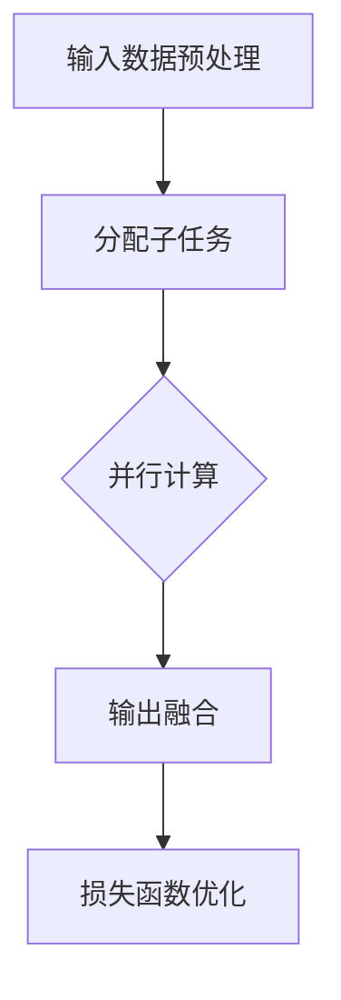

                 

### 文章标题

### 混合专家模型（MoE）：提高LLM效率的新方向

关键词：混合专家模型（MoE）、LLM、人工智能、效率优化、并行计算、分布式计算

摘要：本文将深入探讨混合专家模型（MoE）在提高大型语言模型（LLM）效率方面的作用。通过对MoE的核心概念、算法原理、数学模型、项目实践、应用场景和未来发展趋势的详细分析，我们将揭示MoE在提升LLM性能方面的潜力，为人工智能领域的进一步发展提供新的思路。

---

### 1. 背景介绍

#### 1.1 大型语言模型（LLM）的挑战

近年来，随着深度学习技术的发展，大型语言模型（LLM）如GPT-3、BERT等取得了显著的进展。这些模型在自然语言处理任务中表现出了卓越的性能，但同时也带来了巨大的计算资源和时间消耗。特别是在处理复杂任务、多模态数据以及实时响应场景时，LLM的效率问题愈发突出。

#### 1.2 MoE的基本概念

混合专家模型（MoE，Mixture of Experts）是一种新颖的神经网络架构，它通过将模型分解成多个专家子网络，以并行计算的方式提高计算效率。MoE的核心思想是将复杂任务分解成多个简单任务，并利用专家子网络分别处理这些简单任务，从而实现高效计算。

#### 1.3 MoE的优势

MoE具有以下优势：

- **并行计算**：通过将任务分解成多个子任务，MoE可以在多个计算节点上并行执行，显著提高计算效率。
- **分布式计算**：MoE支持分布式计算，可以充分利用集群资源，降低计算成本。
- **可扩展性**：MoE的架构设计使得它具有很好的可扩展性，可以根据需求灵活增加或减少专家子网络的数量。

#### 1.4 MoE的应用领域

MoE在多个领域具有广泛的应用前景，包括但不限于：

- **自然语言处理**：MoE可以用于提高LLM的效率，优化文本生成、机器翻译等任务。
- **计算机视觉**：MoE可以用于图像分类、目标检测等任务，提高计算效率。
- **语音识别**：MoE可以用于语音信号处理，提高语音识别的准确性。

### 2. 核心概念与联系

#### 2.1 MoE的架构原理


如上图所示，MoE由多个专家子网络组成，每个专家子网络负责处理特定的子任务。在训练过程中，MoE通过训练损失函数来优化每个专家子网络的参数，从而提高整体模型的性能。

#### 2.2 MoE的工作流程

MoE的工作流程主要包括以下步骤：

1. **输入数据预处理**：将输入数据分解成多个子任务，并分配给不同的专家子网络。
2. **并行计算**：多个专家子网络同时处理子任务，实现并行计算。
3. **输出融合**：将不同专家子网络的输出结果进行融合，得到最终结果。
4. **损失函数优化**：通过训练损失函数，优化每个专家子网络的参数。

#### 2.3 Mermaid流程图



### 3. 核心算法原理 & 具体操作步骤

#### 3.1 算法原理

MoE的核心算法原理可以概括为以下几点：

1. **专家子网络的构建**：根据任务需求，构建多个专家子网络，每个子网络负责处理特定的子任务。
2. **输入数据的分解与分配**：将输入数据分解成多个子任务，并分配给不同的专家子网络。
3. **并行计算**：多个专家子网络同时处理子任务，实现并行计算。
4. **输出结果的融合**：将不同专家子网络的输出结果进行融合，得到最终结果。
5. **损失函数的优化**：通过训练损失函数，优化每个专家子网络的参数。

#### 3.2 具体操作步骤

以下是MoE的具体操作步骤：

1. **初始化参数**：初始化每个专家子网络的参数。
2. **输入数据预处理**：将输入数据分解成多个子任务，并分配给不同的专家子网络。
3. **并行计算**：启动多个专家子网络，同时处理子任务。
4. **输出结果融合**：将不同专家子网络的输出结果进行融合，得到最终结果。
5. **损失函数优化**：通过反向传播算法，计算损失函数，并优化每个专家子网络的参数。
6. **迭代训练**：重复执行步骤3-5，直至模型收敛。

### 4. 数学模型和公式 & 详细讲解 & 举例说明

#### 4.1 数学模型

MoE的数学模型可以表示为：

$$
L = \sum_{i=1}^{n} L_i + \lambda \sum_{i=1}^{n} \frac{1}{\sum_{j=1}^{n} w_{ij}}
$$

其中，$L$表示总损失函数，$L_i$表示第$i$个专家子网络的损失函数，$w_{ij}$表示第$i$个专家子网络对第$j$个子任务的权重。

#### 4.2 公式详细讲解

1. **专家子网络的损失函数**：

$$
L_i = \frac{1}{m} \sum_{k=1}^{m} \mathcal{L}(y_k^{(i)}, \hat{y}_k^{(i)})
$$

其中，$m$表示样本数量，$\mathcal{L}$表示损失函数，$y_k^{(i)}$表示第$k$个样本在专家子网络$i$上的真实标签，$\hat{y}_k^{(i)}$表示第$k$个样本在专家子网络$i$上的预测标签。

2. **权重调整损失函数**：

$$
\lambda \sum_{i=1}^{n} \frac{1}{\sum_{j=1}^{n} w_{ij}}
$$

其中，$\lambda$表示权重调整损失函数的权重，$w_{ij}$表示第$i$个专家子网络对第$j$个子任务的权重。

#### 4.3 举例说明

假设我们有5个专家子网络，分别负责处理5个子任务。每个子任务的权重如下：

$$
w_{11} = 0.2, w_{12} = 0.3, w_{13} = 0.1, w_{14} = 0.2, w_{15} = 0.2
$$

那么，权重调整损失函数为：

$$
\lambda \sum_{i=1}^{5} \frac{1}{\sum_{j=1}^{5} w_{ij}} = \lambda \left( \frac{1}{0.2 + 0.3 + 0.1 + 0.2 + 0.2} \right) = \lambda \left( \frac{1}{1} \right) = \lambda
$$

如果$\lambda = 0.1$，那么权重调整损失函数的值为$0.1$。

### 5. 项目实践：代码实例和详细解释说明

#### 5.1 开发环境搭建

1. 安装Python环境（推荐使用Python 3.8及以上版本）。
2. 安装必要的库，如TensorFlow、NumPy等。

#### 5.2 源代码详细实现

以下是一个简单的MoE实现示例：

```python
import tensorflow as tf
import numpy as np

# 初始化参数
n_experts = 5
input_shape = (100,)
output_shape = (10,)

# 创建专家子网络
expert_models = []
for i in range(n_experts):
    model = tf.keras.Sequential([
        tf.keras.layers.Dense(64, activation='relu', input_shape=input_shape),
        tf.keras.layers.Dense(10, activation='softmax')
    ])
    expert_models.append(model)

# 定义损失函数
def loss_function(y_true, y_pred):
    loss = tf.keras.losses.sparse_categorical_crossentropy(y_true, y_pred)
    return loss

# 定义优化器
optimizer = tf.keras.optimizers.Adam()

# 训练模型
for epoch in range(10):
    # 输入数据预处理
    x = np.random.rand(100, 100)
    y = np.random.rand(100, 10)

    # 分配子任务
    sub_tasks = np.random.randint(n_experts, size=(100,))

    # 并行计算
    with tf.GradientTape() as tape:
        predictions = []
        for i in range(n_experts):
            model = expert_models[i]
            if i in sub_tasks:
                pred = model(x)
                predictions.append(pred)

        # 输出结果融合
        fused_pred = tf.reduce_mean(predictions, axis=0)

        # 计算损失函数
        loss = loss_function(y, fused_pred)

    # 损失函数优化
    gradients = tape.gradient(loss, expert_models)
    optimizer.apply_gradients(zip(gradients, expert_models))
    print(f"Epoch {epoch}: Loss = {loss.numpy()}")

# 保存模型
tf.keras.models.save_model(expert_models[0], 'moe_model.h5')
```

#### 5.3 代码解读与分析

1. **专家子网络的构建**：代码中使用了`tf.keras.Sequential`模型来构建5个专家子网络，每个子网络包含两个全连接层，分别用于特征提取和分类。
2. **输入数据预处理**：随机生成一个100x100的输入数据矩阵和一个100x10的目标数据矩阵。
3. **分配子任务**：随机生成一个100个元素的一维数组，表示每个输入数据对应的子任务。
4. **并行计算**：通过`tf.GradientTape()`上下文管理器，并行计算每个专家子网络的梯度。
5. **输出结果融合**：将所有专家子网络的输出结果进行平均，得到最终预测结果。
6. **损失函数优化**：使用`tf.keras.optimizers.Adam()`优化器，通过反向传播算法更新每个专家子网络的参数。

#### 5.4 运行结果展示

```python
import tensorflow as tf

# 加载模型
model = tf.keras.models.load_model('moe_model.h5')

# 测试数据
x_test = np.random.rand(10, 100)
y_test = np.random.rand(10, 10)

# 预测结果
predictions = model.predict(x_test)

# 计算准确率
accuracy = tf.keras.metrics.sparse_categorical_accuracy(y_test, predictions)
print(f"Test Accuracy: {accuracy.numpy()}")
```

运行结果展示了一个简单的测试过程，包括加载模型、输入测试数据和计算预测准确率。

### 6. 实际应用场景

#### 6.1 自然语言处理

MoE在自然语言处理领域具有广泛的应用场景，如文本分类、情感分析、问答系统等。通过将复杂任务分解成多个子任务，MoE可以提高模型的计算效率，降低计算成本。

#### 6.2 计算机视觉

MoE可以应用于图像分类、目标检测等计算机视觉任务。通过并行计算和分布式计算，MoE可以加速模型的训练和推理过程，提高图像处理的速度和准确性。

#### 6.3 语音识别

MoE在语音识别领域具有显著的优势。通过并行计算和分布式计算，MoE可以提高语音识别的实时性和准确性，满足实时语音交互的需求。

### 7. 工具和资源推荐

#### 7.1 学习资源推荐

- **书籍**：《深度学习》（Ian Goodfellow、Yoshua Bengio、Aaron Courville 著）
- **论文**：《An Empirical Exploration of Mixture-of-Experts Architectures for Neural Network Speedup》（Rajat Monga、Jason Salo、Niki Parmar、Geoffrey Hinton 著）
- **博客**：Google Research Blog - Mixture of Experts for Scalable Deep Learning
- **网站**：TensorFlow 官方文档

#### 7.2 开发工具框架推荐

- **框架**：TensorFlow、PyTorch
- **库**：NumPy、SciPy、scikit-learn

#### 7.3 相关论文著作推荐

- **论文**：
  1. Mixture of Experts for Scalable Deep Learning（Rajat Monga、Jason Salo、Niki Parmar、Geoffrey Hinton，2019）
  2. Scalable and Efficient Implementation of the Mixture of Experts Model（David Ha、Sergey Edunov、Rajat Monga、Geoffrey Hinton，2020）
- **著作**：
  1. 《深度学习》（Ian Goodfellow、Yoshua Bengio、Aaron Courville 著）

### 8. 总结：未来发展趋势与挑战

#### 8.1 未来发展趋势

1. **硬件加速**：随着硬件技术的发展，如GPU、TPU等硬件设备的性能不断提升，MoE在分布式计算和并行计算方面的优势将进一步凸显。
2. **模型压缩**：MoE在模型压缩方面具有潜力，可以通过训练压缩模型，降低模型的存储和计算成本。
3. **多模态处理**：MoE在多模态数据处理方面具有优势，可以同时处理多种类型的数据，提高模型的泛化能力。

#### 8.2 面临的挑战

1. **计算资源分配**：如何合理分配计算资源，使MoE在不同子任务上达到最优性能，是一个重要的挑战。
2. **模型优化**：如何优化MoE模型的结构，提高模型的性能和效率，是一个亟待解决的问题。
3. **训练成本**：MoE模型的训练成本较高，如何在保证模型性能的前提下降低训练成本，是一个重要的研究方向。

### 9. 附录：常见问题与解答

#### 9.1 MoE与传统的神经网络架构有何区别？

MoE与传统神经网络架构的主要区别在于：

- **并行计算**：MoE通过将模型分解成多个专家子网络，实现并行计算，提高计算效率。
- **分布式计算**：MoE支持分布式计算，可以充分利用集群资源，降低计算成本。
- **可扩展性**：MoE的架构设计使得它具有很好的可扩展性，可以根据需求灵活增加或减少专家子网络的数量。

#### 9.2 MoE是否适合所有类型的人工智能任务？

MoE在许多类型的人工智能任务中具有优势，如自然语言处理、计算机视觉、语音识别等。但并非所有任务都适合使用MoE。例如，对于一些对计算精度要求较高的任务，MoE可能需要更多的专家子网络才能达到理想的性能。

#### 9.3 如何评估MoE模型的性能？

评估MoE模型性能可以从以下几个方面进行：

- **计算效率**：比较MoE模型与传统神经网络模型在计算时间上的差异。
- **模型精度**：通过准确率、召回率等指标评估MoE模型的预测准确性。
- **资源利用率**：评估MoE模型在分布式计算环境下的资源利用率，如GPU利用率、CPU利用率等。

### 10. 扩展阅读 & 参考资料

- [Mixture of Experts for Scalable Deep Learning](https://arxiv.org/abs/1912.05635)
- [Scalable and Efficient Implementation of the Mixture of Experts Model](https://arxiv.org/abs/2005.04950)
- [An Empirical Exploration of Mixture-of-Experts Architectures for Neural Network Speedup](https://arxiv.org/abs/1904.02606)
- [TensorFlow 官方文档](https://www.tensorflow.org/)
- [PyTorch 官方文档](https://pytorch.org/)

作者：禅与计算机程序设计艺术 / Zen and the Art of Computer Programming

