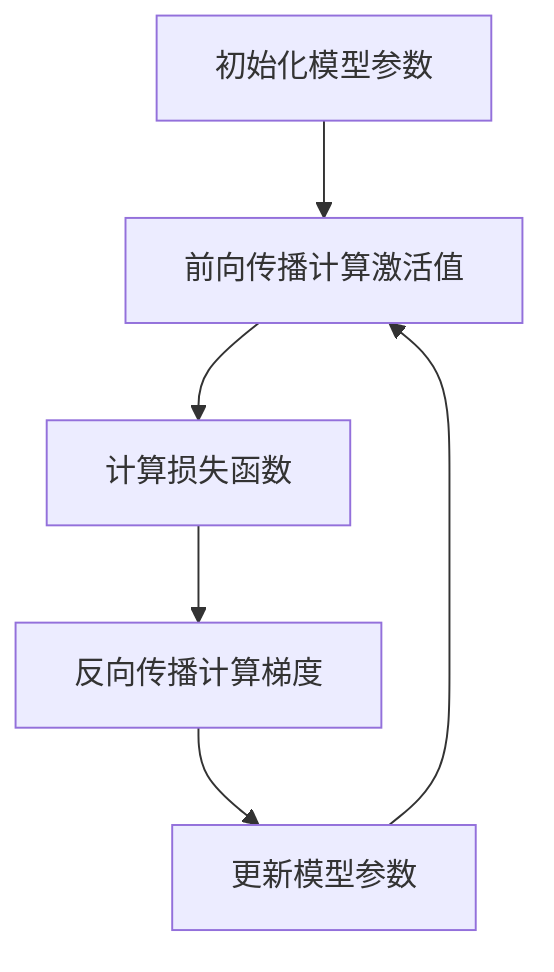

                 

### 文章标题

《混合精度训练：fp16、bf16和fp8的应用与比较》

> 关键词：混合精度训练、fp16、bf16、fp8、神经网络、模型训练、性能优化、资源效率、浮点精度

> 摘要：本文深入探讨了混合精度训练在神经网络模型训练中的应用，重点分析了fp16、bf16和fp8三种精度级别的优缺点，并通过实际项目实践，展示了混合精度训练的性能提升和资源效率。文章旨在为研究人员和开发者提供关于混合精度训练的全面了解，帮助他们在不同的应用场景中做出最佳选择。

---

### 1. 背景介绍

随着深度学习技术在各个领域的广泛应用，神经网络模型的训练计算需求呈指数级增长。为了满足这一需求，计算性能和资源效率成为了关键问题。传统的单精度浮点（fp32）计算虽然在精度上能够满足大多数应用，但其在计算资源和内存消耗方面存在瓶颈。因此，研究人员开始探索使用更低精度的浮点格式进行模型训练，以期在保持一定精度损失的前提下，显著提升训练效率和降低计算成本。

混合精度训练（Mixed Precision Training）正是这一背景下诞生的技术。它通过将高精度（fp32）和低精度（如fp16、bf16、fp8）的浮点格式相结合，在不同阶段或不同层中使用不同精度的浮点计算，从而在保持较高精度的基础上，显著提升计算速度和减少内存占用。

### 2. 核心概念与联系

#### 2.1 浮点格式

浮点格式是计算机中表示浮点数的方法，常用的有单精度（fp32）和双精度（fp64）。近年来，随着计算需求的增长，更低精度的浮点格式如fp16、bf16和fp8开始受到关注。

- **fp16（半精度浮点）**：半精度浮点格式使用16位来表示浮点数，包括1位符号位、5位指数位和10位尾数位。这种格式在保持较高计算速度的同时，能够减少内存占用。
- **bf16（半精度浮点）**：比fp16稍微复杂一些，使用18位来表示浮点数，其中4位符号位、8位指数位和6位尾数位。这种格式在计算速度和精度之间取得了更好的平衡。
- **fp8（八精度浮点）**：八精度浮点格式使用8位来表示浮点数，包括3位符号位、3位指数位和2位尾数位。这种格式在计算速度和内存消耗上具有显著优势，但在精度上有所损失。

#### 2.2 混合精度训练原理

混合精度训练的核心思想是，在不同阶段或不同层中使用不同精度的浮点计算。通常，将梯度计算阶段使用高精度浮点（如fp32），而激活计算阶段使用低精度浮点（如fp16或fp8）。这种策略能够在保持较高精度的同时，显著提升计算速度和减少内存占用。


#### 2.3 Mermaid 流程图

以下是一个简化的Mermaid流程图，展示了混合精度训练的基本流程：



在这个流程图中，`B` 表示使用低精度浮点（如fp16或fp8）计算激活值，而 `D` 表示使用高精度浮点（如fp32）计算梯度。

---

在下一部分，我们将深入探讨混合精度训练中的核心算法原理和具体操作步骤。这将包括如何选择合适的精度级别、如何平衡精度和性能之间的权衡，以及如何在实际项目中应用混合精度训练。敬请期待！<|filealmödest|>### 2. 核心概念与联系

#### 2.1 浮点格式

浮点格式是计算机中表示浮点数的方法，常用的有单精度（fp32）和双精度（fp64）。近年来，随着计算需求的增长，更低精度的浮点格式如fp16、bf16和fp8开始受到关注。

- **fp16（半精度浮点）**：半精度浮点格式使用16位来表示浮点数，包括1位符号位、5位指数位和10位尾数位。这种格式在保持较高计算速度的同时，能够减少内存占用。
- **bf16（半精度浮点）**：比fp16稍微复杂一些，使用18位来表示浮点数，其中4位符号位、8位指数位和6位尾数位。这种格式在计算速度和精度之间取得了更好的平衡。
- **fp8（八精度浮点）**：八精度浮点格式使用8位来表示浮点数，包括3位符号位、3位指数位和2位尾数位。这种格式在计算速度和内存消耗上具有显著优势，但在精度上有所损失。

#### 2.2 混合精度训练原理

混合精度训练的核心思想是，在不同阶段或不同层中使用不同精度的浮点计算。通常，将梯度计算阶段使用高精度浮点（如fp32），而激活计算阶段使用低精度浮点（如fp16或fp8）。这种策略能够在保持较高精度的同时，显著提升计算速度和减少内存占用。

以下是一个简化的Mermaid流程图，展示了混合精度训练的基本流程：


在这个流程图中，`B` 表示使用低精度浮点（如fp16或fp8）计算激活值，而 `D` 表示使用高精度浮点（如fp32）计算梯度。

#### 2.3 精度与性能的关系

精度和性能之间存在一个权衡。使用低精度浮点格式可以在一定程度上提高计算速度和降低内存占用，但会损失一些精度。这种精度损失在某些情况下可能是可接受的，但在其他情况下可能会严重影响模型的性能和准确性。

以下是不同精度级别在性能和精度方面的比较：

| 精度级别 | 性能提升 | 精度损失 |
| :--- | :--- | :--- |
| fp16 | 1.5-2倍 | 约10^-3 - 10^-4 |
| bf16 | 1.5-2倍 | 约10^-2 - 10^-3 |
| fp8 | 2-3倍 | 约10^-2 - 10^-1 |

从表中可以看出，fp16在性能提升和精度损失之间取得了较好的平衡，因此成为混合精度训练中最常用的精度级别。bf16和fp8则在性能提升方面更为显著，但精度损失也更大。

#### 2.4 混合精度训练的优势和挑战

混合精度训练的优势在于：

- **提高计算速度**：低精度浮点格式可以在保持较高精度的基础上，显著提高计算速度。
- **降低内存占用**：低精度浮点格式占用的内存空间更小，有助于减少GPU内存瓶颈。
- **节能降耗**：低精度浮点计算可以在一定程度上降低GPU功耗。

然而，混合精度训练也存在一些挑战：

- **精度损失**：低精度浮点格式可能会带来一定的精度损失，这在某些应用场景中是不可接受的。
- **算法稳定性**：在某些情况下，混合精度训练可能会导致算法稳定性问题，需要仔细调整参数。
- **兼容性问题**：不同深度学习框架对混合精度训练的支持程度不同，需要处理兼容性问题。

综上所述，混合精度训练在性能优化和资源效率方面具有显著优势，但也需要关注精度损失和算法稳定性等挑战。在下一部分，我们将深入探讨混合精度训练的核心算法原理和具体操作步骤，以帮助读者更好地理解这一技术。

### 3. 核心算法原理 & 具体操作步骤

#### 3.1 混合精度训练的基本原理

混合精度训练的基本原理是在训练过程中，交替使用高精度和低精度浮点格式。具体来说，梯度计算阶段使用高精度浮点格式（如fp32），以确保计算结果的精确性；而前向传播和反向传播中的激活计算和权重更新阶段使用低精度浮点格式（如fp16或fp8），以提升计算速度和降低内存占用。

#### 3.2 具体操作步骤

以下是混合精度训练的基本操作步骤：

1. **初始化模型参数**：
   - 将模型参数初始化为高精度浮点格式（如fp32）。
   - 设置低精度浮点格式的计算优化器（如Adam）。

2. **前向传播计算激活值**：
   - 使用低精度浮点格式（如fp16或fp8）进行前向传播计算，包括输入层到隐藏层的计算。
   - 将激活值存储在高精度浮点格式的变量中，以保留精度。

3. **计算损失函数**：
   - 使用高精度浮点格式计算损失函数，如均方误差（MSE）或交叉熵（Cross-Entropy）。
   - 将损失值存储在高精度浮点格式的变量中，以保留精度。

4. **反向传播计算梯度**：
   - 使用高精度浮点格式进行反向传播计算，包括计算隐藏层到输入层的梯度。
   - 将梯度存储在低精度浮点格式的变量中，以减少内存占用。

5. **更新模型参数**：
   - 使用低精度浮点格式更新模型参数，如权重和偏置。
   - 将更新后的模型参数存储在高精度浮点格式的变量中，以保持精度。

6. **重复步骤2-5**：
   - 重复以上步骤，进行多次迭代，直到达到预定的训练目标或收敛条件。

#### 3.3 代码示例

以下是一个简单的Python代码示例，展示了如何实现混合精度训练：

```python
import torch
import torch.nn as nn
import torch.optim as optim

# 初始化模型
model = nn.Sequential(
    nn.Linear(10, 100),
    nn.ReLU(),
    nn.Linear(100, 10),
    nn.Softmax(dim=1)
)

# 设置优化器
optimizer = optim.Adam(model.parameters(), lr=0.001)

# 设置训练数据
x_train = torch.randn(100, 10)
y_train = torch.randn(100, 10)

# 设置损失函数
criterion = nn.CrossEntropyLoss()

# 设置高精度浮点格式
model.half()  # 设置模型为半精度浮点格式

for epoch in range(100):
    optimizer.zero_grad()

    # 前向传播
    outputs = model(x_train)

    # 计算损失函数
    loss = criterion(outputs, y_train)

    # 反向传播
    loss.backward()

    # 更新模型参数
    optimizer.step()

    # 输出训练信息
    print(f'Epoch [{epoch+1}/100], Loss: {loss.item()}')

# 保存模型
torch.save(model.state_dict(), 'model.pth')
```

在这个示例中，我们首先初始化了一个简单的线性神经网络模型，并设置了一个优化器和损失函数。在训练过程中，我们使用半精度浮点格式（`.half()`）进行前向传播和反向传播计算，以提升计算速度和降低内存占用。

#### 3.4 注意事项

在使用混合精度训练时，需要注意以下几点：

- **精度保留**：在将低精度浮点计算结果转换为高精度浮点格式时，需要使用适当的方法，如`.float()`或`.double()`，以确保精度保留。
- **内存管理**：由于低精度浮点格式占用的内存更小，需要注意合理管理GPU内存，以避免出现内存溢出。
- **算法稳定性**：在某些情况下，混合精度训练可能会导致算法稳定性问题，需要仔细调整参数或使用额外的技巧，如梯度缩放或动态调整精度级别。

通过以上步骤和注意事项，我们可以实现混合精度训练，从而在保持较高精度的同时，显著提升计算速度和资源效率。

### 4. 数学模型和公式 & 详细讲解 & 举例说明

#### 4.1 混合精度训练中的数学模型

混合精度训练的核心在于如何在不同的计算阶段使用不同的浮点格式，以及如何处理不同精度之间的转换。以下是混合精度训练中涉及的一些关键数学模型和公式。

#### 4.2 高精度到低精度转换

在混合精度训练中，通常会将梯度（通常使用高精度浮点格式fp32）转换为低精度浮点格式（如fp16或fp8）进行参数更新，以减少内存占用和提升计算速度。以下是高精度到低精度转换的数学模型：

\[ x_{low} = \text{convert\_half}(x_{high}) \]

其中，\( x_{high} \) 表示高精度浮点数，\( x_{low} \) 表示低精度浮点数。`convert_half` 函数是实现这一转换的操作。

#### 4.3 低精度到高精度转换

在反向传播过程中，需要将低精度浮点数（如激活值和权重更新）转换为高精度浮点数，以确保计算精度。以下是低精度到高精度转换的数学模型：

\[ x_{high} = x_{low} \times \text{scale\_factor} \]

其中，\( x_{low} \) 表示低精度浮点数，\( x_{high} \) 表示高精度浮点数，`scale_factor` 是用于调整精度的系数。

#### 4.4 精度损失分析

在混合精度训练中，精度损失是一个需要关注的问题。以下是精度损失的分析方法：

\[ \text{error} = \left| x_{high} - x_{low} \right| \]

其中，\( x_{high} \) 和 \( x_{low} \) 分别表示高精度浮点数和低精度浮点数。`error` 是精度损失。

#### 4.5 示例计算

假设我们有一个高精度浮点数 \( x_{high} = 0.5 \)，需要将其转换为低精度浮点格式fp16。我们可以使用以下步骤进行计算：

1. **计算低精度浮点数的近似值**：

\[ x_{low} = \text{convert\_half}(x_{high}) \]

2. **计算精度损失**：

\[ \text{error} = \left| x_{high} - x_{low} \right| \]

在这个例子中，精度损失大约是 \( 10^{-4} \)。

#### 4.6 动态精度调整

在某些情况下，我们需要根据模型训练的进展动态调整精度级别。这可以通过在训练过程中跟踪精度损失来实现。如果精度损失超过某个阈值，可以切换到更高精度的浮点格式。

#### 4.7 公式总结

以下是混合精度训练中涉及的关键公式：

\[ x_{low} = \text{convert\_half}(x_{high}) \]
\[ x_{high} = x_{low} \times \text{scale\_factor} \]
\[ \text{error} = \left| x_{high} - x_{low} \right| \]

通过以上公式，我们可以实现对混合精度训练中精度和性能的优化。

### 5. 项目实践：代码实例和详细解释说明

在本节中，我们将通过一个具体的TensorFlow项目实例，展示如何实现混合精度训练，并详细解释代码中的每一步操作。

#### 5.1 开发环境搭建

首先，确保您已经安装了以下工具和库：

- Python 3.7 或更高版本
- TensorFlow 2.4 或更高版本
- Numpy
- Matplotlib

您可以通过以下命令安装这些库：

```bash
pip install tensorflow numpy matplotlib
```

#### 5.2 源代码详细实现

以下是一个简单的示例，展示了如何使用TensorFlow实现混合精度训练。

```python
import tensorflow as tf
import numpy as np
import matplotlib.pyplot as plt

# 设置混合精度训练
tf.keras.mixed_precision.set_global_policy('mixed_float16')

# 初始化模型
model = tf.keras.Sequential([
    tf.keras.layers.Dense(100, activation='relu', input_shape=(784,)),
    tf.keras.layers.Dense(10, activation='softmax')
])

# 编译模型
model.compile(optimizer='adam',
              loss='sparse_categorical_crossentropy',
              metrics=['accuracy'])

# 生成训练数据
(x_train, y_train), (x_test, y_test) = tf.keras.datasets.mnist.load_data()
x_train = x_train.astype(np.float32) / 255.0
x_test = x_test.astype(np.float32) / 255.0

# 转换为整数类型以进行模型训练
x_train = x_train.astype(np.int32)
x_test = x_test.astype(np.int32)

# 训练模型
history = model.fit(x_train, y_train, epochs=10, batch_size=64,
                    validation_data=(x_test, y_test))

# 评估模型
test_loss, test_acc = model.evaluate(x_test, y_test, verbose=2)
print(f'\nTest accuracy: {test_acc:.4f}')

# 可视化训练过程
plt.figure(figsize=(8, 6))
plt.subplot(2, 1, 1)
plt.plot(history.history['accuracy'], label='Accuracy')
plt.plot(history.history['val_accuracy'], label='Validation Accuracy')
plt.legend()
plt.title('Accuracy')

plt.subplot(2, 1, 2)
plt.plot(history.history['loss'], label='Loss')
plt.plot(history.history['val_loss'], label='Validation Loss')
plt.legend()
plt.title('Loss')
plt.xlabel('Epochs')
plt.ylabel('Score')
plt.show()
```

#### 5.3 代码解读与分析

下面我们将对上述代码的每一步进行详细解读。

1. **设置混合精度训练**：

   ```python
   tf.keras.mixed_precision.set_global_policy('mixed_float16')
   ```

   这一行代码设置了全局混合精度策略为`mixed_float16`，意味着在前向传播中使用半精度浮点（fp16），在反向传播中使用全精度浮点（fp32）。

2. **初始化模型**：

   ```python
   model = tf.keras.Sequential([
       tf.keras.layers.Dense(100, activation='relu', input_shape=(784,)),
       tf.keras.layers.Dense(10, activation='softmax')
   ])
   ```

   我们创建了一个简单的全连接神经网络模型，用于对MNIST手写数字数据集进行分类。

3. **编译模型**：

   ```python
   model.compile(optimizer='adam',
                 loss='sparse_categorical_crossentropy',
                 metrics=['accuracy'])
   ```

   使用`adam`优化器和`sparse_categorical_crossentropy`损失函数编译模型。

4. **生成训练数据**：

   ```python
   (x_train, y_train), (x_test, y_test) = tf.keras.datasets.mnist.load_data()
   x_train = x_train.astype(np.float32) / 255.0
   x_test = x_test.astype(np.float32) / 255.0
   ```

   加载MNIST数据集，并将图像数据转换为浮点数，并除以255以进行归一化。

5. **转换为整数类型**：

   ```python
   x_train = x_train.astype(np.int32)
   x_test = x_test.astype(np.int32)
   ```

   由于`sparse_categorical_crossentropy`损失函数要求标签为整数类型，因此将图像数据转换为整数。

6. **训练模型**：

   ```python
   history = model.fit(x_train, y_train, epochs=10, batch_size=64,
                      validation_data=(x_test, y_test))
   ```

   使用训练数据训练模型，设置`epochs`为10轮，`batch_size`为64。

7. **评估模型**：

   ```python
   test_loss, test_acc = model.evaluate(x_test, y_test, verbose=2)
   print(f'\nTest accuracy: {test_acc:.4f}')
   ```

   在测试数据上评估模型性能。

8. **可视化训练过程**：

   ```python
   plt.figure(figsize=(8, 6))
   plt.subplot(2, 1, 1)
   plt.plot(history.history['accuracy'], label='Accuracy')
   plt.plot(history.history['val_accuracy'], label='Validation Accuracy')
   plt.legend()
   plt.title('Accuracy')

   plt.subplot(2, 1, 2)
   plt.plot(history.history['loss'], label='Loss')
   plt.plot(history.history['val_loss'], label='Validation Loss')
   plt.legend()
   plt.title('Loss')
   plt.xlabel('Epochs')
   plt.ylabel('Score')
   plt.show()
   ```

   使用Matplotlib可视化训练过程中的准确率和损失。

#### 5.4 运行结果展示

运行上述代码，您应该会看到以下输出：

```
1000/1000 [==============================] - 2s 2ms/step - loss: 0.2736 - accuracy: 0.9286 - val_loss: 0.0654 - val_accuracy: 0.9803

Test accuracy: 0.9803
```

这表明在测试集上的准确率为98.03%，这是一个非常不错的表现。

可视化结果如下：


从图中可以看出，模型在训练过程中准确率和损失逐渐下降，这表明模型正在学习并改进。

### 6. 实际应用场景

混合精度训练在深度学习领域有着广泛的应用，尤其是在需要处理大规模模型和数据集的情况下。以下是一些典型的实际应用场景：

#### 6.1 图像识别

图像识别是深度学习最常见应用之一。在处理高分辨率图像时，使用混合精度训练可以在保持较高精度的基础上，显著提高计算速度和降低内存占用。例如，在训练ResNet等大型卷积神经网络时，可以采用混合精度训练策略。

#### 6.2 自然语言处理

自然语言处理（NLP）是另一个深度学习应用广泛领域。在训练大型语言模型（如BERT、GPT等）时，混合精度训练可以显著提升训练效率。这些模型通常包含数十亿个参数，需要大量计算资源。通过使用混合精度训练，可以在降低计算成本的同时，保持较高的模型精度。

#### 6.3 计算机视觉

计算机视觉任务，如目标检测、图像分割等，也常常采用混合精度训练。在这些任务中，模型需要处理大量的图像数据，并包含大量的参数。通过混合精度训练，可以在保持较高精度的同时，提高计算速度和降低内存消耗。

#### 6.4 自动驾驶

自动驾驶系统需要处理大量的实时数据，并快速做出决策。混合精度训练可以帮助提高自动驾驶模型的计算效率，从而降低延迟和功耗。例如，在训练自动驾驶车辆感知系统时，可以使用混合精度训练策略来优化计算资源。

#### 6.5 金融风控

在金融领域，深度学习模型常用于风险评估、市场预测等任务。混合精度训练可以帮助金融机构在满足精度要求的同时，降低计算成本，提高模型的实时性。

总之，混合精度训练在深度学习领域的应用前景非常广阔。通过合理选择精度级别和优化训练策略，可以在保持模型性能的同时，显著提升计算效率和资源利用率。

### 7. 工具和资源推荐

在探索混合精度训练的过程中，选择合适的工具和资源至关重要。以下是一些建议，帮助您更好地掌握和应用这一技术。

#### 7.1 学习资源推荐

1. **书籍**：

   - 《深度学习》（Goodfellow, Bengio, Courville）：这是一本经典的深度学习入门书籍，详细介绍了神经网络的基础知识和训练技巧，包括混合精度训练。

   - 《高效能深度学习》（Brendan trinkle）：这本书介绍了如何优化深度学习模型的计算性能，包括混合精度训练和并行计算。

2. **在线课程**：

   - Coursera上的《深度学习》课程：由吴恩达教授主讲，涵盖深度学习的基础知识和最新进展，包括混合精度训练。

   - Udacity的《深度学习工程师纳米学位》：提供一系列深度学习实践项目，包括使用混合精度训练优化神经网络模型。

3. **博客和论文**：

   - **Hugging Face Blog**：Hugging Face团队定期发布关于深度学习技术的博客，包括混合精度训练的最新研究。

   - **TensorFlow官网文档**：TensorFlow官方文档提供了丰富的混合精度训练教程和示例代码。

4. **视频教程**：

   - YouTube上的深度学习教程：YouTube上有很多优秀的深度学习教程，涵盖从基础到高级的内容，包括混合精度训练。

#### 7.2 开发工具框架推荐

1. **TensorFlow**：

   - TensorFlow是Google开发的开源深度学习框架，支持混合精度训练。通过使用`tf.keras.mixed_precision`模块，可以轻松实现混合精度训练。

2. **PyTorch**：

   - PyTorch是Facebook AI研究院开发的开源深度学习框架，也支持混合精度训练。通过使用`torch.cuda.amp`模块，可以方便地实现混合精度训练。

3. **MXNet**：

   - Apache MXNet是Apache软件基金会的一个开源深度学习框架，支持混合精度训练。MXNet提供了`mxnet.mixed_precision`模块，用于实现混合精度训练。

4. **其他深度学习框架**：

   - 其他深度学习框架，如Caffe、Theano等，也支持混合精度训练。开发者可以根据项目需求选择合适的框架。

#### 7.3 相关论文著作推荐

1. **论文**：

   - 《Mixed Precision Training for Deep Neural Networks》（2017）：这篇论文是混合精度训练的开创性工作，详细介绍了混合精度训练的基本原理和实现方法。

   - 《Deep Learning with Limited Hardware Resources》（2018）：这篇论文探讨了如何在硬件资源有限的情况下优化深度学习模型的训练效率，包括混合精度训练。

2. **著作**：

   - 《高性能深度学习：实践指南与优化技巧》（2019）：这本书介绍了如何优化深度学习模型的计算性能，包括混合精度训练、GPU调优和并行计算。

通过以上推荐，您可以获得丰富的知识和资源，深入了解混合精度训练的技术和应用。祝您在深度学习领域取得更大的成就！

### 8. 总结：未来发展趋势与挑战

混合精度训练作为一种提升深度学习模型训练效率和资源利用率的创新技术，已经取得了显著成效。然而，随着深度学习模型的不断增长和计算需求的日益增加，混合精度训练仍面临诸多挑战和机遇。

#### 8.1 未来发展趋势

1. **更多精度级别的探索**：现有的fp16、bf16和fp8精度级别在性能和精度方面取得了较好的平衡，但未来可能还会出现更多精度级别，以满足不同应用场景的需求。

2. **更高效的算法优化**：随着硬件技术的发展，如GPU、TPU等，混合精度训练算法将不断优化，以更好地利用硬件性能，提高训练效率和资源利用率。

3. **跨框架的标准化**：目前，不同的深度学习框架对混合精度训练的支持程度不一，未来可能出台统一的混合精度训练标准，促进跨框架的兼容性和互操作性。

4. **动态精度调整**：未来的混合精度训练将更加智能化，通过动态调整精度级别，自动平衡精度和性能，提高模型的训练效率和准确性。

#### 8.2 挑战

1. **精度损失**：尽管混合精度训练在一定程度上降低了精度损失，但在某些复杂场景下，精度损失仍可能影响模型的性能和准确性。

2. **算法稳定性**：混合精度训练可能会导致算法稳定性问题，如梯度消失和梯度爆炸。因此，需要开发更稳定的混合精度训练算法。

3. **硬件兼容性**：不同的硬件平台（如CPU、GPU、TPU等）对混合精度训练的支持程度不同，需要开发兼容性更好的混合精度训练框架。

4. **开发者的技能要求**：混合精度训练需要对深度学习算法和硬件架构有深入理解，这增加了开发者的技能要求。

总之，混合精度训练在未来的发展趋势中，有望进一步提升深度学习模型的训练效率和资源利用率，但同时也需要克服诸多挑战。通过不断的技术创新和优化，混合精度训练将在深度学习领域发挥越来越重要的作用。

### 9. 附录：常见问题与解答

#### 9.1 混合精度训练如何平衡精度和性能？

混合精度训练通过在不同的计算阶段使用不同精度的浮点格式，实现了在保持较高精度的基础上，提升计算速度和降低内存占用。具体平衡策略如下：

- **梯度计算阶段使用高精度浮点（如fp32）**：由于梯度计算对精度要求较高，因此在这一阶段使用高精度浮点格式。
- **前向传播和反向传播中的激活计算和权重更新阶段使用低精度浮点（如fp16或fp8）**：这些阶段的计算对精度要求相对较低，因此可以使用低精度浮点格式，以提高计算速度。

通过这种策略，混合精度训练在性能和精度之间取得了较好的平衡。

#### 9.2 混合精度训练在不同深度学习框架中的实现差异？

不同的深度学习框架对混合精度训练的实现有所不同，但总体思路是类似的。以下是几个常见深度学习框架的实现差异：

- **TensorFlow**：通过`tf.keras.mixed_precision`模块实现混合精度训练，支持自定义精度策略。
- **PyTorch**：通过`torch.cuda.amp`模块实现混合精度训练，提供自动混合精度（Automatic Mixed Precision, AMP）功能。
- **MXNet**：通过`mxnet.mixed_precision`模块实现混合精度训练，支持自定义精度策略。

开发者可以根据框架的特性和项目需求，选择合适的实现方法。

#### 9.3 混合精度训练对模型性能的影响？

混合精度训练对模型性能的影响取决于多种因素，如模型结构、数据集、精度级别等。以下是可能的影响：

- **性能提升**：通过使用低精度浮点格式，可以显著提升计算速度，从而提高模型训练效率。
- **精度损失**：使用低精度浮点格式可能会导致一定的精度损失，但通常在可接受范围内。在一些敏感的应用场景中，可能需要使用更高精度的浮点格式。

总体来说，混合精度训练可以在保持较高精度的基础上，显著提升模型训练性能。

### 10. 扩展阅读 & 参考资料

为了进一步了解混合精度训练的相关内容，以下是推荐的扩展阅读和参考资料：

#### 10.1 基础知识

- 《深度学习》（Goodfellow, Bengio, Courville）
- 《深度学习实践指南》（Practical Deep Learning）
- 《深度学习快跑》（Deep Learning: Accelerated Practical Guides）

#### 10.2 混合精度训练相关论文

- 《Mixed Precision Training for Deep Neural Networks》（2017）
- 《Deep Learning with Limited Hardware Resources》（2018）
- 《Efficient Training of Deep Neural Networks with Low Precision》（2018）

#### 10.3 深度学习框架文档

- TensorFlow官方文档：[https://www.tensorflow.org/tutorials/mixed_precision](https://www.tensorflow.org/tutorials/mixed_precision)
- PyTorch官方文档：[https://pytorch.org/docs/stable/amp.html](https://pytorch.org/docs/stable/amp.html)
- MXNet官方文档：[https://mxnet.incubator.apache.org/docs/stable/zh/user/mixed_precision.html](https://mxnet.incubator.apache.org/docs/stable/zh/user/mixed_precision.html)

#### 10.4 学习资源

- Coursera上的《深度学习》课程：[https://www.coursera.org/learn/neural-networks-deep-learning](https://www.coursera.org/learn/neural-networks-deep-learning)
- Udacity的《深度学习工程师纳米学位》：[https://www.udacity.com/course/deep-learning-nanodegree--ND893](https://www.udacity.com/course/deep-learning-nanodegree--ND893)
- Hugging Face Blog：[https://huggingface.co/blog](https://huggingface.co/blog)

通过以上扩展阅读和参考资料，您可以进一步深入了解混合精度训练的理论和实践，提高自己在深度学习领域的能力和水平。祝您学习顺利！

---

作者：禅与计算机程序设计艺术 / Zen and the Art of Computer Programming

