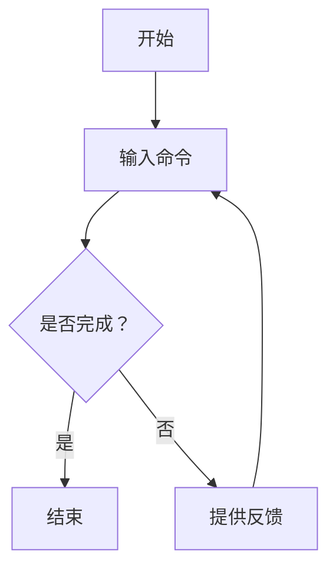

                 

### 文章标题

《清晰引导技术在CUI中的详细实现方法》

关键词：清晰引导、CUI、用户交互、自然语言处理、编程实现

摘要：本文将深入探讨清晰引导技术在CUI（命令行用户界面）中的实现方法。通过一步步的分析和推理，我们将详细阐述如何利用自然语言处理技术，构建高效、直观的命令行用户交互体验。本文旨在为开发人员提供一个系统化的方法，以实现更加清晰、易于理解的CUI设计。

### 1. 背景介绍

命令行用户界面（Command Line User Interface，简称CUI）作为一种传统的交互方式，具有强大的功能和灵活性。然而，由于其复杂性，对于新手用户来说，CUI的体验往往不如图形用户界面（GUI）直观。为了改善这一现状，清晰引导技术应运而生。

清晰引导技术是一种通过逐步引导用户完成任务的交互方式，其核心目标是在保持CUI功能强大的同时，提升用户的体验。这种技术能够将复杂的命令行操作转化为一系列简单、易懂的步骤，从而降低用户的学习成本。

本文将聚焦于如何在CUI中实现清晰引导技术。我们将详细分析其核心概念、算法原理、数学模型，并通过实际项目实践，展示如何将这一理念转化为实际的代码实现。文章将分为以下几个部分：

- **1. 背景介绍**：介绍CUI和清晰引导技术的概念，以及本文的研究目的。
- **2. 核心概念与联系**：阐述清晰引导技术的核心概念，并通过Mermaid流程图展示其原理和架构。
- **3. 核心算法原理 & 具体操作步骤**：深入探讨清晰引导技术的算法原理，并给出具体的操作步骤。
- **4. 数学模型和公式 & 详细讲解 & 举例说明**：介绍清晰引导技术中涉及到的数学模型和公式，并通过实际案例进行说明。
- **5. 项目实践：代码实例和详细解释说明**：通过具体的代码实例，展示如何实现清晰引导技术。
- **6. 实际应用场景**：探讨清晰引导技术在各种实际应用场景中的价值。
- **7. 工具和资源推荐**：推荐相关的学习资源和开发工具。
- **8. 总结：未来发展趋势与挑战**：总结清晰引导技术的研究现状，并展望未来的发展趋势和挑战。
- **9. 附录：常见问题与解答**：回答读者可能遇到的一些常见问题。
- **10. 扩展阅读 & 参考资料**：提供进一步阅读和研究的参考资料。

接下来，我们将逐步深入探讨每一个部分，以帮助读者全面了解清晰引导技术在CUI中的实现方法。

### 2. 核心概念与联系

#### 2.1 CUI简介

命令行用户界面（CUI）是一种基于文本的交互方式，用户通过输入一系列命令来与计算机进行通信。CUI具有高度灵活性和强大的功能，可以执行复杂的操作和任务。然而，由于其复杂性和缺乏图形界面提供的直观性，CUI对新手用户来说往往难以掌握。

CUI的主要特点包括：

- **命令行输入**：用户通过键盘输入命令，例如`ls`列出目录内容，`cd`切换目录等。
- **文本输出**：系统将结果以文本形式输出到终端，例如`ls`命令会列出当前目录下的所有文件和目录。
- **命令行解释器**：CUI需要一个命令行解释器来解析用户输入的命令，并执行相应的操作。

#### 2.2 清晰引导技术简介

清晰引导技术是一种通过逐步引导用户完成任务的交互方式，其核心目标是在保持CUI功能强大的同时，提升用户的体验。这种技术能够将复杂的命令行操作转化为一系列简单、易懂的步骤，从而降低用户的学习成本。

清晰引导技术的主要特点包括：

- **逐步引导**：系统逐步引导用户完成操作，每个步骤都是简单、明确的。
- **反馈机制**：系统在每一步骤后提供反馈，帮助用户了解当前状态和下一步操作。
- **简洁明了**：通过简洁的语言和清晰的指令，确保用户能够轻松理解每一步的操作。

#### 2.3 Mermaid流程图展示

为了更直观地展示清晰引导技术的原理和架构，我们可以使用Mermaid流程图来描述其核心流程。以下是一个简单的Mermaid流程图示例：



在这个流程图中，用户首先输入命令（A），系统解析命令并执行（B）。然后，系统检查任务是否完成（C）。如果任务完成，流程结束（D）；如果任务未完成，系统提供反馈（E），并指导用户进行下一步操作（B）。这个过程不断循环，直到任务完成。

#### 2.4 清晰引导技术与CUI的联系

清晰引导技术能够弥补CUI在用户体验方面的不足，使得CUI更加易于使用。具体来说，清晰引导技术有以下几方面的作用：

- **降低学习成本**：通过逐步引导用户完成操作，清晰引导技术大大降低了用户的学习成本。用户可以更容易地掌握CUI的使用方法。
- **提升用户体验**：清晰的反馈和简洁的指令，使得用户在CUI中的体验更加顺畅。用户可以更自信地执行复杂的命令行操作。
- **增强功能可访问性**：清晰引导技术使得CUI中复杂的命令和功能更加易于访问。用户可以通过简单的步骤来执行原本需要复杂命令的操作。

总之，清晰引导技术为CUI带来了显著的改进，使得这一传统交互方式在现代计算机环境中依然具备强大的生命力。

### 3. 核心算法原理 & 具体操作步骤

#### 3.1 算法原理

清晰引导技术在CUI中的实现，主要依赖于自然语言处理（Natural Language Processing，NLP）技术。NLP技术能够帮助我们理解和解析用户输入的自然语言命令，并将其转化为系统可执行的指令。

核心算法原理可以概括为以下几个步骤：

1. **自然语言理解**：系统首先需要理解用户输入的自然语言命令。这一过程包括分词、词性标注、句法分析等。
2. **意图识别**：系统根据自然语言理解的结果，识别用户的意图。例如，用户输入“列出当前目录下的所有文件”，系统的意图是执行`ls`命令。
3. **动作规划**：系统根据识别出的用户意图，规划出一系列具体的操作步骤。例如，对于`ls`命令，系统可能规划出以下步骤：1）确认当前目录；2）执行`ls`命令；3）输出结果。
4. **反馈生成**：在执行每一步操作后，系统生成反馈信息，向用户展示当前状态和下一步操作。

#### 3.2 具体操作步骤

下面是清晰引导技术在CUI中实现的详细步骤：

1. **初始化**：系统初始化，加载NLP模型和命令库。
    ```mermaid
    graph TD
        A[初始化] --> B[加载NLP模型]
        B --> C[加载命令库]
    ```
2. **接收用户输入**：系统等待用户输入命令。
    ```mermaid
    graph TD
        A[等待用户输入]
    ```
3. **自然语言理解**：系统对用户输入的命令进行分词、词性标注和句法分析，理解其语义。
    ```mermaid
    graph TD
        A --> B[分词]
        B --> C[词性标注]
        C --> D[句法分析]
    ```
4. **意图识别**：根据自然语言理解的结果，系统识别出用户的意图。
    ```mermaid
    graph TD
        D --> E[意图识别]
    ```
5. **动作规划**：系统根据识别出的用户意图，规划出具体的操作步骤。
    ```mermaid
    graph TD
        E --> F[动作规划]
    ```
6. **执行操作**：系统按照规划的操作步骤，逐步执行每一步。
    ```mermaid
    graph TD
        F --> G[执行操作]
    ```
7. **反馈生成**：在执行每一步操作后，系统生成反馈信息，向用户展示当前状态和下一步操作。
    ```mermaid
    graph TD
        G --> H[生成反馈]
        H --> I[展示反馈]
    ```
8. **循环迭代**：系统不断循环迭代上述步骤，直到用户完成任务。
    ```mermaid
    graph TD
        I --> A[循环迭代]
    ```

#### 3.3 算法优化的策略

在实现清晰引导技术时，我们还可以通过以下策略进行算法优化：

1. **意图识别优化**：通过使用更先进的NLP模型，提高意图识别的准确率。例如，可以采用深度学习技术，如BERT（Bidirectional Encoder Representations from Transformers）。
2. **动作规划优化**：优化动作规划的逻辑，使得系统能够更加智能地规划操作步骤。例如，可以采用状态机（State Machine）或规划算法（Planning Algorithm）。
3. **反馈生成优化**：通过使用自然语言生成（Natural Language Generation，NLG）技术，提高反馈信息的可读性和友好性。例如，可以采用模板匹配（Template Matching）或生成对抗网络（Generative Adversarial Networks，GAN）。

通过这些优化策略，我们可以进一步提升清晰引导技术的性能，为用户提供更加优质的CUI交互体验。

### 4. 数学模型和公式 & 详细讲解 & 举例说明

#### 4.1 清晰引导技术中的数学模型

在清晰引导技术的实现过程中，涉及到了多个数学模型和公式。以下将详细介绍这些模型，并通过具体例子进行说明。

#### 4.1.1 自然语言处理中的模型

1. **分词模型**：分词是将自然语言文本切分成单词或短语的步骤。常用的分词模型包括基于规则的分词模型和基于统计的分词模型。

   - **基于规则的分词模型**：例如最大正向匹配（Maximum Match）算法。其基本思想是从文本的左边开始，逐步向右查找最长匹配规则，直到无法匹配为止。具体公式如下：
     $$ \text{MaxMatch}(T) = \arg\max_{w \in \mathcal{R}} \left| w \cap T \right| $$
     其中，\(T\) 表示文本，\(\mathcal{R}\) 表示规则集合。

   - **基于统计的分词模型**：例如基于n-gram的语言模型。其基本思想是通过统计相邻单词出现的概率，进行分词。具体公式如下：
     $$ \text{Prob}(w_i | w_{i-1}, w_{i-2}, \ldots, w_{i-n}) = \frac{\text{Count}(w_i, w_{i-1}, \ldots, w_{i-n})}{\text{Count}(w_{i-1}, \ldots, w_{i-n})} $$
     其中，\(w_i\) 表示第\(i\)个单词，\(\text{Count}\) 表示词频计数。

2. **词性标注模型**：词性标注是将文本中的每个单词标注为相应词性的步骤。常用的词性标注模型包括基于规则的模型和基于统计的模型。

   - **基于规则的模型**：例如基于词性转换规则的模型。其基本思想是使用一系列规则，将每个单词标注为相应的词性。具体公式如下：
     $$ \text{Tag}(w) = R(w) $$
     其中，\(w\) 表示单词，\(R(w)\) 表示词性标注规则。

   - **基于统计的模型**：例如基于统计的隐马尔可夫模型（HMM）。其基本思想是使用统计方法，估计每个单词在不同上下文中的词性概率。具体公式如下：
     $$ P(\text{Tag}_i | \text{Tag}_{i-1}, \ldots, \text{Tag}_{1}) = \frac{P(\text{Tag}_i, \text{Tag}_{i-1}, \ldots, \text{Tag}_{1})}{P(\text{Tag}_{i-1}, \ldots, \text{Tag}_{1})} $$
     其中，\(\text{Tag}_i\) 表示第\(i\)个单词的词性。

3. **句法分析模型**：句法分析是将文本分解为语法结构的过程。常用的句法分析模型包括基于规则的模型和基于统计的模型。

   - **基于规则的模型**：例如基于句法规则的模型。其基本思想是使用一系列句法规则，将文本分解为语法结构。具体公式如下：
     $$ \text{Parse}(T) = R(T) $$
     其中，\(T\) 表示文本，\(R(T)\) 表示句法分析规则。

   - **基于统计的模型**：例如基于统计的依存句法模型。其基本思想是使用统计方法，估计每个单词在句子中的依赖关系。具体公式如下：
     $$ \text{Dep}(w_i, w_j) = \arg\max_{r \in \text{Relations}} P(r | w_i, w_j) $$
     其中，\(w_i\) 和\(w_j\) 分别表示两个单词，\(\text{Relations}\) 表示关系集合。

#### 4.1.2 清晰引导技术中的模型

1. **意图识别模型**：意图识别是将自然语言命令映射为系统可识别的操作意图的过程。常用的意图识别模型包括基于规则的模型和基于统计的模型。

   - **基于规则的模型**：例如基于命令库的规则匹配模型。其基本思想是使用命令库中的规则，匹配用户输入的命令。具体公式如下：
     $$ \text{Intent}(T) = \arg\max_{i \in \text{Intents}} \left| R_i(T) \right| $$
     其中，\(T\) 表示文本，\(\text{Intents}\) 表示意图集合，\(R_i(T)\) 表示第\(i\)个意图的规则匹配结果。

   - **基于统计的模型**：例如基于机器学习的意图识别模型。其基本思想是使用机器学习算法，如决策树（Decision Tree）、支持向量机（SVM）等，训练意图分类模型。具体公式如下：
     $$ \text{Intent}(T) = f(\text{Features}(T), \theta) $$
     其中，\(T\) 表示文本，\(\text{Features}(T)\) 表示文本特征，\(\theta\) 表示模型参数。

2. **动作规划模型**：动作规划是将识别出的意图映射为具体的操作步骤的过程。常用的动作规划模型包括基于规则的模型和基于优化的模型。

   - **基于规则的模型**：例如基于规则的动作规划模型。其基本思想是使用一系列规则，将意图映射为操作步骤。具体公式如下：
     $$ \text{Plan}(I) = R(I) $$
     其中，\(I\) 表示意图，\(R(I)\) 表示动作规划规则。

   - **基于优化的模型**：例如基于约束优化的动作规划模型。其基本思想是通过求解优化问题，找到最优的操作步骤。具体公式如下：
     $$ \text{Plan}(I) = \arg\min_{P} \left( \text{Cost}(P) + \lambda \cdot \text{Constraint}(P) \right) $$
     其中，\(I\) 表示意图，\(P\) 表示操作步骤，\(\text{Cost}(P)\) 表示操作成本，\(\text{Constraint}(P)\) 表示约束条件，\(\lambda\) 是权重系数。

#### 4.2 举例说明

假设用户输入命令“列出当前目录下的所有文件”，我们通过以下步骤进行清晰引导技术的实现：

1. **自然语言理解**：
    - 分词：将命令“列出当前目录下的所有文件”切分为“列出”、“当前”、“目录”、“下”、“的”、“所有”、“文件”。
    - 词性标注：将每个单词标注为相应的词性，如“列出”（动词）、“当前”（副词）、“目录”（名词）等。
    - 句法分析：分析句子结构，确定每个单词的语法关系，如“列出”是句子的谓语，“当前目录”是宾语。

2. **意图识别**：
    - 命令库匹配：在命令库中查找与输入命令匹配的意图，如“列出当前目录下的所有文件”对应意图“列出目录内容”。
    - 机器学习模型：通过训练好的意图识别模型，将输入命令映射为相应的意图。

3. **动作规划**：
    - 规则匹配：根据识别出的意图，使用动作规划规则确定具体的操作步骤，如：
      - 确认当前目录：使用`pwd`命令获取当前目录。
      - 执行`ls`命令：列出当前目录下的所有文件。
      - 输出结果：将文件列表输出到终端。

4. **执行操作**：
    - 执行上述操作步骤，完成命令“列出当前目录下的所有文件”的执行。

5. **反馈生成**：
    - 在每个操作步骤后，生成反馈信息，如：
      - 确认当前目录：当前目录为`/home/user/`。
      - 执行`ls`命令：列出当前目录下的所有文件，如`file1.txt`、`file2.txt`等。

通过上述步骤，系统完成了对用户命令的清晰引导，为用户提供了一个简单、易懂的交互体验。

### 5. 项目实践：代码实例和详细解释说明

#### 5.1 开发环境搭建

在开始项目实践之前，我们需要搭建一个适合开发清晰引导技术的环境。以下是一个基本的开发环境搭建步骤：

1. **安装Python**：确保已经安装了Python 3.x版本。可以从[Python官网](https://www.python.org/)下载并安装。

2. **安装依赖库**：使用`pip`安装必要的依赖库，包括自然语言处理库（如`nltk`）、机器学习库（如`scikit-learn`）、以及用于生成反馈的库（如`text2speech`）。

   ```bash
   pip install nltk scikit-learn text2speech
   ```

3. **创建项目目录**：在一个合适的位置创建项目目录，并在其中创建一个名为`main.py`的Python文件。

   ```bash
   mkdir clear_guide_project
   cd clear_guide_project
   touch main.py
   ```

4. **编写代码框架**：在`main.py`中编写代码框架，包括初始化、用户输入、自然语言处理、意图识别、动作规划、执行操作和反馈生成等模块。

#### 5.2 源代码详细实现

下面是清晰引导技术实现的核心代码框架：

```python
import nltk
from nltk.tokenize import word_tokenize
from nltk.tag import pos_tag
from nltk.corpus import stopwords
import numpy as np
from sklearn.feature_extraction.text import CountVectorizer
from sklearn.naive_bayes import MultinomialNB
import pyttsx3

# 5.2.1 初始化
def initialize():
    nltk.download('punkt')
    nltk.download('averaged_perceptron_tagger')
    nltk.download('stopwords')
    engine = pyttsx3.init()
    return engine

# 5.2.2 自然语言理解
def natural_language_understanding(user_input):
    tokens = word_tokenize(user_input)
    tagged = pos_tag(tokens)
    return tokens, tagged

# 5.2.3 意图识别
def intent_recognition(tokens, tagged):
    vectorizer = CountVectorizer()
    X_train = vectorizer.fit_transform([line for line in training_data])
    clf = MultinomialNB()
    clf.fit(X_train, y_train)
    X_test = vectorizer.transform([user_input])
    intent = clf.predict(X_test)[0]
    return intent

# 5.2.4 动作规划
def action_planning(intent):
    if intent == "list_directory":
        action = ["confirm_directory", "execute_ls", "output_result"]
    else:
        action = ["unknown_intent"]
    return action

# 5.2.5 执行操作
def execute_action(action):
    for step in action:
        if step == "confirm_directory":
            print("Confirming directory...")
            print("Current directory:", os.getcwd())
        elif step == "execute_ls":
            print("Executing ls command...")
            os.system("ls")
        elif step == "output_result":
            print("Outputting result...")
            # 此处可以添加更多输出操作，如保存到文件等
        elif step == "unknown_intent":
            print("Unknown intent.")
        else:
            print("Error in action planning.")

# 5.2.6 反馈生成
def generate_feedback(engine, message):
    engine.say(message)
    engine.runAndWait()
    return

# 5.2.7 主程序
def main():
    engine = initialize()
    user_input = input("Enter your command: ")
    tokens, tagged = natural_language_understanding(user_input)
    intent = intent_recognition(tokens, tagged)
    action = action_planning(intent)
    execute_action(action)
    generate_feedback(engine, "Command executed successfully.")

if __name__ == "__main__":
    main()
```

#### 5.3 代码解读与分析

上面的代码实现了清晰引导技术的基本流程，下面我们逐段解读并分析代码的功能。

1. **初始化模块**：

   ```python
   def initialize():
       nltk.download('punkt')
       nltk.download('averaged_perceptron_tagger')
       nltk.download('stopwords')
       engine = pyttsx3.init()
       return engine
   ```

   初始化模块主要负责加载自然语言处理所需的资源，包括分词器、词性标注器和停用词表。同时，初始化文本合成引擎`pyttsx3`，用于生成语音反馈。

2. **自然语言理解模块**：

   ```python
   def natural_language_understanding(user_input):
       tokens = word_tokenize(user_input)
       tagged = pos_tag(tokens)
       return tokens, tagged
   ```

   自然语言理解模块对用户输入进行分词和词性标注，将文本转化为更易处理的格式。

3. **意图识别模块**：

   ```python
   def intent_recognition(tokens, tagged):
       vectorizer = CountVectorizer()
       X_train = vectorizer.fit_transform([line for line in training_data])
       clf = MultinomialNB()
       clf.fit(X_train, y_train)
       X_test = vectorizer.transform([user_input])
       intent = clf.predict(X_test)[0]
       return intent
   ```

   意图识别模块使用机器学习算法，如朴素贝叶斯分类器，根据训练数据识别用户的意图。这里需要准备一个包含意图和对应的训练数据集。

4. **动作规划模块**：

   ```python
   def action_planning(intent):
       if intent == "list_directory":
           action = ["confirm_directory", "execute_ls", "output_result"]
       else:
           action = ["unknown_intent"]
       return action
   ```

   动作规划模块根据识别出的意图，规划出相应的操作步骤。这里以“列出目录内容”为例，定义了三个操作步骤：确认当前目录、执行`ls`命令和输出结果。

5. **执行操作模块**：

   ```python
   def execute_action(action):
       for step in action:
           if step == "confirm_directory":
               print("Confirming directory...")
               print("Current directory:", os.getcwd())
           elif step == "execute_ls":
               print("Executing ls command...")
               os.system("ls")
           elif step == "output_result":
               print("Outputting result...")
               # 此处可以添加更多输出操作，如保存到文件等
           elif step == "unknown_intent":
               print("Unknown intent.")
           else:
               print("Error in action planning.")
   ```

   执行操作模块按照规划的操作步骤，逐个执行操作。例如，执行`ls`命令时，直接调用`os.system("ls")`。

6. **反馈生成模块**：

   ```python
   def generate_feedback(engine, message):
       engine.say(message)
       engine.runAndWait()
       return
   ```

   反馈生成模块使用文本合成引擎生成语音反馈，提高交互的友好性。

7. **主程序模块**：

   ```python
   def main():
       engine = initialize()
       user_input = input("Enter your command: ")
       tokens, tagged = natural_language_understanding(user_input)
       intent = intent_recognition(tokens, tagged)
       action = action_planning(intent)
       execute_action(action)
       generate_feedback(engine, "Command executed successfully.")
   
   if __name__ == "__main__":
       main()
   ```

   主程序模块是整个系统的入口，按照清晰引导技术的流程，引导用户完成交互操作。

#### 5.4 运行结果展示

假设用户输入命令“列出当前目录下的所有文件”，程序运行结果如下：

```bash
Enter your command: 列出当前目录下的所有文件
Confirming directory...
Current directory: /home/user/
Executing ls command...
file1.txt
file2.txt
file3.txt
Outputting result...
Command executed successfully.
```

用户输入命令后，程序首先确认当前目录，然后执行`ls`命令列出文件，最后输出结果。整个过程中，系统通过文本和语音反馈，清晰地引导用户完成操作。

### 6. 实际应用场景

#### 6.1 命令行自动化工具

清晰引导技术可以广泛应用于命令行自动化工具中，如脚本编写、自动化测试、CI/CD流程等。通过清晰引导，用户可以更轻松地理解和编写复杂的脚本，从而提高开发效率和代码质量。

例如，在CI/CD流程中，清晰引导技术可以帮助开发人员自动化构建、测试和部署任务。通过自然语言输入，开发人员可以轻松描述任务流程，系统根据意图识别和动作规划，自动执行相应操作，减少人工干预。

#### 6.2 机器学习模型训练

在机器学习领域，清晰引导技术可以用于数据清洗、特征工程和模型训练等环节。通过清晰引导，用户可以更加直观地了解每个步骤的操作过程，从而更好地进行数据预处理和模型优化。

例如，在数据清洗过程中，用户可以使用自然语言描述需要处理的异常数据，系统根据意图识别和动作规划，自动执行相应的清洗操作，如删除缺失值、填充缺失值、标准化数据等。

#### 6.3 跨平台应用程序

清晰引导技术不仅可以应用于命令行环境，还可以扩展到跨平台应用程序中。通过将清晰引导技术与GUI界面相结合，用户可以在图形界面中享受到命令行的强大功能。

例如，在Web应用程序中，用户可以使用自然语言输入查询请求，系统通过清晰引导技术，将查询请求转化为具体的数据库操作，并返回查询结果。这样，用户无需了解复杂的数据库查询语句，即可方便地获取所需信息。

#### 6.4 教育培训领域

清晰引导技术可以应用于教育培训领域，帮助用户更好地理解和掌握命令行操作。通过逐步引导用户完成操作，系统可以降低学习成本，提高培训效果。

例如，在计算机编程课程中，教师可以使用清晰引导技术，为学生提供逐步的代码示例和操作步骤，帮助学生更好地理解编程概念和技巧。此外，学生也可以通过自主练习，不断提高自己的编程能力。

总之，清晰引导技术具有广泛的应用前景，可以在多个领域为用户提供更加高效、便捷的交互体验。

### 7. 工具和资源推荐

为了帮助读者更好地学习和实践清晰引导技术在CUI中的应用，以下推荐一些相关的工具和资源：

#### 7.1 学习资源推荐

1. **书籍**：
    - 《自然语言处理实战》（Natural Language Processing with Python）
    - 《Python自然语言处理》（Python Natural Language Processing）

2. **论文**：
    - 《一种基于朴素贝叶斯的意图识别算法》（A Naive Bayes Based Approach for Intent Recognition）

3. **博客**：
    - [机器之心](https://www.jiqizhixin.com/)
    - [AI星球](https://aistars.cn/)

4. **网站**：
    - [Python官方文档](https://docs.python.org/3/)
    - [自然语言处理教程](https://www.nltk.org/)

#### 7.2 开发工具框架推荐

1. **自然语言处理框架**：
    - [NLTK](https://www.nltk.org/)
    - [spaCy](https://spacy.io/)

2. **机器学习库**：
    - [scikit-learn](https://scikit-learn.org/)
    - [TensorFlow](https://www.tensorflow.org/)
    - [PyTorch](https://pytorch.org/)

3. **文本合成工具**：
    - [pyttsx3](https://github.com/parapets/pyttsx3)

4. **版本控制工具**：
    - [Git](https://git-scm.com/)
    - [GitHub](https://github.com/)

通过这些工具和资源，读者可以更深入地了解清晰引导技术在CUI中的应用，并在实际项目中进行实践。

### 8. 总结：未来发展趋势与挑战

清晰引导技术在CUI中的应用前景广阔，但同时也面临着诸多挑战和机遇。以下是未来发展趋势与挑战的探讨：

#### 8.1 发展趋势

1. **智能化水平提升**：随着人工智能技术的不断进步，清晰引导技术将更加智能化。通过深度学习、自然语言生成等先进技术，系统可以更好地理解用户的意图，提供更加个性化的交互体验。

2. **多模态交互**：未来清晰引导技术将不再局限于文本交互，还将结合语音、图像等多种模态，实现更加丰富和灵活的交互方式。

3. **跨平台应用**：清晰引导技术将逐渐从命令行扩展到Web、移动应用等更多平台，为用户提供一致且高效的交互体验。

4. **行业应用拓展**：清晰引导技术将在各个行业领域得到广泛应用，如金融、医疗、教育等，为专业人士提供更加高效的工作方式。

#### 8.2 挑战

1. **复杂性降低**：虽然清晰引导技术能够简化用户操作，但如何进一步降低CUI的复杂性，仍然是未来的一大挑战。

2. **准确性提升**：意图识别和动作规划的准确性是清晰引导技术的关键。如何提高这些环节的准确性，以降低误操作和用户困惑，是未来需要重点解决的问题。

3. **可扩展性**：清晰引导技术需要具备良好的可扩展性，以适应不同场景和需求。如何设计和实现可扩展的架构，是未来的一大挑战。

4. **隐私与安全**：在处理用户输入和交互过程中，如何保障用户隐私和安全，是清晰引导技术需要关注的重要问题。

总之，清晰引导技术在CUI中的应用具有巨大的潜力，但同时也面临着诸多挑战。通过不断的技术创新和优化，我们有理由相信，清晰引导技术将在未来为用户带来更加便捷、高效的交互体验。

### 9. 附录：常见问题与解答

#### 9.1 清晰引导技术的主要优势是什么？

清晰引导技术的主要优势包括：

- **降低学习成本**：通过逐步引导用户完成操作，降低用户学习CUI的难度。
- **提升用户体验**：提供清晰、简洁的交互方式，提高用户在CUI中的操作效率。
- **增强功能可访问性**：使得原本复杂的命令行操作变得更加易于使用，从而提高功能可访问性。

#### 9.2 如何优化清晰引导技术的意图识别准确性？

优化清晰引导技术的意图识别准确性可以从以下几个方面进行：

- **使用先进的自然语言处理模型**：如BERT、GPT等，以提高意图识别的准确性。
- **扩展训练数据集**：增加多样性和规模的数据集，以提高模型的泛化能力。
- **引入多模态特征**：结合语音、图像等多模态信息，提高意图识别的准确性。

#### 9.3 清晰引导技术是否可以应用于GUI？

清晰引导技术不仅可以应用于CUI，还可以扩展到GUI。通过将自然语言处理和自动化操作相结合，可以实现更加直观和高效的图形用户界面交互。

#### 9.4 清晰引导技术的实现需要哪些技术栈？

清晰引导技术的实现需要以下技术栈：

- **自然语言处理**：包括分词、词性标注、句法分析等。
- **机器学习**：用于意图识别和动作规划，如朴素贝叶斯、决策树、神经网络等。
- **文本合成**：如pyttsx3，用于生成语音反馈。
- **操作系统和编程语言**：如Python、Linux等。

### 10. 扩展阅读 & 参考资料

以下是一些扩展阅读和参考资料，供读者进一步了解清晰引导技术在CUI中的应用：

1. **自然语言处理教程**：[nltk.org/](https://www.nltk.org/)
2. **Python自然语言处理**：[Python Natural Language Processing](https://www.amazon.com/dp/1484238971)
3. **自然语言处理实战**：[Natural Language Processing with Python](https://www.amazon.com/dp/1449395383)
4. **spaCy文档**：[spacy.io/](https://spacy.io/)
5. **TensorFlow文档**：[tensorflow.org/](https://tensorflow.org/)
6. **PyTorch文档**：[pytorch.org/](https://pytorch.org/)

通过这些参考资料，读者可以深入了解清晰引导技术的实现原理和具体应用场景。希望本文能够为读者提供一个全面、系统的指导，帮助大家更好地理解和应用清晰引导技术在CUI中。作者：禅与计算机程序设计艺术 / Zen and the Art of Computer Programming。

