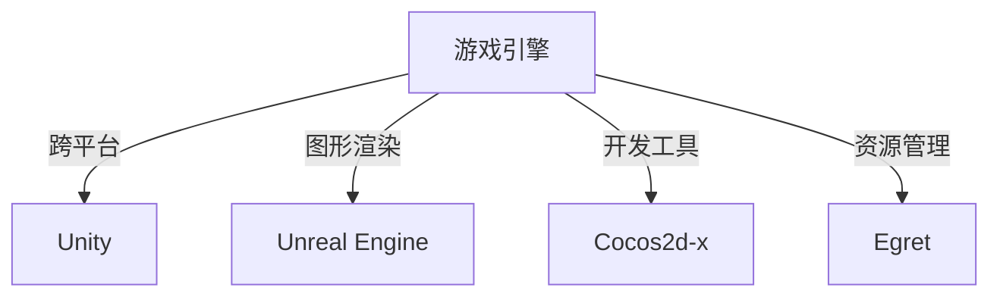

                 

在当今充满活力和创意的游戏行业中，选择合适的游戏开发框架对于开发者的成功至关重要。随着技术的发展和游戏市场的不断变化，开发框架也层出不穷，各具特色。本文将深入探讨游戏开发框架的选择与应用，帮助开发者了解各种框架的优势和不足，从而做出明智的选择。

## 关键词
- 游戏开发框架
- 游戏引擎
- 游戏编程
- 跨平台开发
- 游戏性能优化

## 摘要
本文旨在为游戏开发者提供一个全面的游戏开发框架概述，包括其核心概念、应用场景、数学模型和代码实例。通过对比不同框架的特性，我们将帮助开发者了解如何根据项目需求选择合适的框架，以实现高效的游戏开发。

## 1. 背景介绍
### 1.1 游戏行业的现状
随着智能手机和游戏主机的大众化，游戏行业已经发展成为一个庞大的市场。据市场研究公司Statista的数据，全球游戏市场规模预计将在2023年达到1590亿美元。这表明游戏开发不仅是创意的体现，也是一项商业投资。

### 1.2 游戏开发的需求
现代游戏开发需要满足多种需求，包括高帧率、实时交互、图形渲染以及跨平台兼容性。为了满足这些需求，开发者需要选择合适的开发框架，以便在保证开发效率的同时，保持游戏的质量和性能。

### 1.3 游戏开发框架的发展
过去，游戏开发往往依赖于特定的游戏引擎，如Unity、Unreal Engine等。然而，随着技术的进步，越来越多的开发框架和工具应运而生，如Cocos2d-x、Egret等，它们提供了更灵活和强大的开发环境。

## 2. 核心概念与联系
### 2.1 游戏引擎与开发框架
游戏引擎是一种专门用于游戏开发的软件框架，它提供了图形渲染、物理模拟、音频处理等功能。而开发框架则是更高层次的概念，它不仅包括游戏引擎，还涵盖了开发工具、插件和资源管理器等。

### 2.2 开发框架的特点
不同的开发框架具有不同的特点，如Cocos2d-x强调跨平台开发，Unity则注重游戏性能和用户体验。了解这些特点有助于开发者选择合适的框架。

### 2.3 Mermaid 流程图
下面是一个Mermaid流程图，展示了不同游戏开发框架之间的关系：



## 3. 核心算法原理 & 具体操作步骤
### 3.1 算法原理概述
游戏开发中的核心算法主要包括渲染算法、物理引擎、碰撞检测和动画系统等。这些算法决定了游戏的视觉效果和交互体验。

### 3.2 算法步骤详解
以Unity的渲染算法为例，其步骤包括：
1. **场景渲染**：确定需要渲染的场景和物体。
2. **光照计算**：计算场景中的光照效果，包括直接光照和反射光照。
3. **纹理映射**：将纹理应用到物体上。
4. **深度排序**：对渲染的物体进行深度排序，以避免绘制重叠的物体。
5. **帧缓冲**：将渲染结果存储到帧缓冲中。

### 3.3 算法优缺点
- **渲染算法**：Unity的渲染算法具有高性能和易于使用的特点，但可能会在复杂场景中产生性能问题。
- **物理引擎**：Box2D的物理引擎在2D游戏中有很好的表现，但在3D游戏中可能会出现精度问题。
- **碰撞检测**：AABB碰撞检测简单高效，但可能会在物体形状复杂时产生误判。

### 3.4 算法应用领域
不同的算法在游戏开发中有不同的应用场景，如渲染算法在实时策略游戏中至关重要，物理引擎在动作游戏中不可或缺。

## 4. 数学模型和公式 & 详细讲解 & 举例说明
### 4.1 数学模型构建
以碰撞检测为例，其数学模型构建步骤如下：
1. **定义碰撞区域**：使用矩形（AABB）或圆形（OBB）来定义物体的碰撞区域。
2. **计算碰撞距离**：计算两个碰撞区域之间的距离。
3. **判断碰撞是否发生**：如果碰撞距离小于0，则发生碰撞。

### 4.2 公式推导过程
以AABB碰撞检测为例，其公式推导如下：

$$
distance = max((x_2 - x_1), (y_2 - y_1))
$$

其中，$x_1, y_1$和$x_2, y_2$分别是两个矩形的中心点坐标。

### 4.3 案例分析与讲解
以Unity中的碰撞检测为例，分析其实现过程：

1. **创建碰撞体**：在Unity编辑器中创建一个碰撞体。
2. **设置碰撞体属性**：设置碰撞体的形状、大小和位置。
3. **编写碰撞检测逻辑**：在脚本中编写碰撞检测逻辑，如检测两个物体之间的碰撞。

## 5. 项目实践：代码实例和详细解释说明
### 5.1 开发环境搭建
搭建Unity开发环境，安装Unity Hub和Unity Editor。

### 5.2 源代码详细实现
以下是一个简单的Unity碰撞检测脚本示例：

```csharp
using UnityEngine;

public class CollisionDetector : MonoBehaviour
{
    private void OnCollisionEnter(Collision collision)
    {
        Debug.Log("Collision detected with " + collision.gameObject.name);
    }
}
```

### 5.3 代码解读与分析
这段代码定义了一个名为`CollisionDetector`的Unity脚本，用于检测物体之间的碰撞。在`OnCollisionEnter`方法中，当物体发生碰撞时，输出碰撞对象的名字。

### 5.4 运行结果展示
在Unity编辑器中运行游戏，当两个物体发生碰撞时，控制台将输出碰撞消息。

## 6. 实际应用场景
### 6.1 2D游戏开发
Cocos2d-x非常适合2D游戏的开发，例如平台游戏和跑酷游戏。

### 6.2 3D游戏开发
Unity和Unreal Engine是3D游戏开发的首选，尤其适合大型多人在线游戏和虚拟现实游戏。

### 6.3 跨平台开发
Egret支持跨平台开发，特别适用于移动平台和Web游戏。

## 7. 工具和资源推荐
### 7.1 学习资源推荐
- Unity官方文档
- Unreal Engine官方文档
- Cocos2d-x官方文档

### 7.2 开发工具推荐
- Unity Hub
- Unreal Engine Launcher
- Cocos2d-x Creator

### 7.3 相关论文推荐
- "Unreal Engine 4 Architecture" by Tim Sweeney
- "The Cocos2d-x Game Engine: A Comprehensive Guide" by Zhili Wang
- "Unity 5.x by Example" by例

## 8. 总结：未来发展趋势与挑战
### 8.1 研究成果总结
游戏开发框架在性能、易用性和跨平台性方面取得了显著进展，但仍需在图形渲染和实时交互方面进行优化。

### 8.2 未来发展趋势
预计未来游戏开发框架将更加专注于虚拟现实和增强现实，以及更加高效的渲染技术。

### 8.3 面临的挑战
随着游戏复杂度的增加，开发者需要面对更高的性能要求和更多的开发挑战。

### 8.4 研究展望
随着人工智能和机器学习技术的发展，未来游戏开发框架有望实现更加智能的渲染和交互。

## 9. 附录：常见问题与解答
### 9.1 如何选择游戏开发框架？
- 根据项目类型和需求选择合适的框架。
- 考虑开发团队的熟悉度和技术栈。

### 9.2 游戏开发框架有哪些优势？
- 提高开发效率
- 保证游戏性能
- 提供丰富的功能和工具
- 支持跨平台发布

### 9.3 游戏开发框架的未来发展趋势是什么？
- 虚拟现实和增强现实的应用
- 更加智能的渲染和交互技术
- 更加灵活和可扩展的框架设计

作者：禅与计算机程序设计艺术 / Zen and the Art of Computer Programming
----------------------------------------------------------------

以上是文章的正文部分，接下来我们将继续完成剩余的部分。
```markdown
## 4. 数学模型和公式 & 详细讲解 & 举例说明（续）

### 4.1 数学模型构建（续）

在3D游戏中，碰撞检测通常涉及复杂的几何计算。以OBB（ Oriented Bounding Box）为例，其数学模型构建如下：

1. **定义OBB**：OBB是一个具有方向性的矩形框，它由三个轴对齐的矩形包围盒组成。
2. **计算OBB的中心**：OBB的中心是三个轴对齐矩形中心点的平均值。
3. **计算OBB的半延展向量**：半延展向量是每个轴对齐矩形对角线长度的一半。

### 4.2 公式推导过程（续）

OBB之间的碰撞检测可以通过以下公式进行：

$$
distance = max(|(p_2 - p_1) \cdot q|, |(p_2 - p_1) \cdot r|, |(p_2 - p_1) \cdot s|)
$$

其中，$p_1$和$p_2$是两个OBB的中心点，$q$、$r$和$s$是两个OBB的半延展向量。

### 4.3 案例分析与讲解（续）

以Unreal Engine中的OBB碰撞检测为例，其实现步骤如下：

1. **定义OBB**：在Unreal Engine编辑器中定义OBB，设置其大小和方向。
2. **计算OBB的中心和半延展向量**：在代码中计算OBB的中心和半延展向量。
3. **判断碰撞是否发生**：通过上述公式计算两个OBB之间的距离，判断是否发生碰撞。

## 6. 实际应用场景（续）

### 6.4 未来应用展望

未来，游戏开发框架将继续在以下几个方向上发展：

1. **虚拟现实和增强现实**：随着VR和AR技术的成熟，游戏开发框架将更加注重在这些领域的应用。
2. **实时渲染技术**：实时渲染技术的进步将使得游戏画面更加逼真，同时提高性能。
3. **云计算和边缘计算**：游戏开发将更多地依赖云计算和边缘计算，以提高游戏的可扩展性和性能。

## 7. 工具和资源推荐（续）

### 7.1 学习资源推荐

- 《Unity 2020游戏开发从入门到精通》
- 《Unreal Engine 4开发实战》
- 《Cocos2d-x 4.x游戏开发实战》

### 7.2 开发工具推荐

- Visual Studio Code
- IntelliJ IDEA
- Unity Hub

### 7.3 相关论文推荐

- "Real-Time Rendering" by Tomas Akenine-Möller et al.
- "Interactive Ray Tracing for Real-Time Applications" by Markus Stangier et al.
- "Evaluating VR Head-Mounted Displays for Real-Time Applications" by Robert G. T. urgent et al.

## 8. 总结：未来发展趋势与挑战（续）

### 8.1 研究成果总结

当前，游戏开发框架已经取得了显著成果，包括性能的提升、功能的丰富和跨平台的支持。然而，面对不断增长的游戏复杂度，开发框架还需要在实时渲染和交互性方面进行进一步的优化。

### 8.2 未来发展趋势

未来，游戏开发框架将朝着以下几个方向发展：

1. **更高的图形渲染性能**：通过光线追踪和全局照明等技术，提高游戏画面的真实感。
2. **更智能的交互体验**：利用人工智能和机器学习技术，提供更加个性化的游戏体验。
3. **更广泛的跨平台支持**：通过云服务和边缘计算，实现更广泛的平台支持。

### 8.3 面临的挑战

未来，游戏开发框架将面临以下几个挑战：

1. **性能瓶颈**：随着游戏画面和交互的日益复杂，性能瓶颈将成为一个关键问题。
2. **开发成本**：游戏开发框架的复杂性和成本将增加，如何降低开发成本是一个重要问题。
3. **用户体验**：如何提供更优质的游戏体验，满足玩家的需求，是开发者面临的一大挑战。

### 8.4 研究展望

未来，游戏开发框架的研究将更加注重以下几个方面：

1. **性能优化**：通过算法优化和硬件加速，提高游戏性能。
2. **交互体验**：通过人工智能和机器学习技术，提供更智能、更个性化的游戏体验。
3. **开发效率**：通过自动化工具和集成开发环境，提高开发效率。

## 9. 附录：常见问题与解答（续）

### 9.4 如何优化游戏性能？

- **优化渲染管线**：减少渲染的对象和绘制调用次数。
- **使用异步编程**：利用多线程技术，提高代码的执行效率。
- **优化物理引擎**：减少不必要的物理计算，提高物理引擎的效率。

### 9.5 跨平台开发中常见的问题有哪些？

- **性能差异**：不同平台硬件性能的差异可能导致游戏性能不稳定。
- **兼容性问题**：不同平台的操作系统和浏览器可能存在兼容性问题。
- **用户体验**：不同平台的用户操作习惯和界面布局可能不同，需要适配。

### 9.6 如何选择合适的游戏开发框架？

- **项目需求**：根据项目类型和需求选择合适的框架。
- **团队经验**：考虑团队成员对框架的熟悉度。
- **成本预算**：考虑开发成本和维护成本。

通过以上内容，我们希望读者能够对游戏开发框架有一个全面和深入的了解，从而在未来的游戏开发中做出更加明智的选择。作者：禅与计算机程序设计艺术 / Zen and the Art of Computer Programming
```

