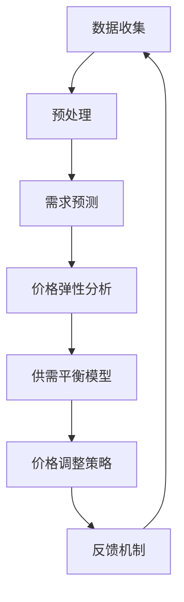
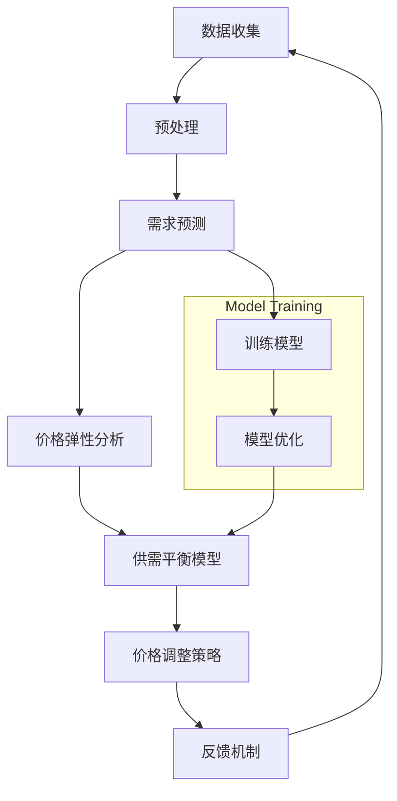
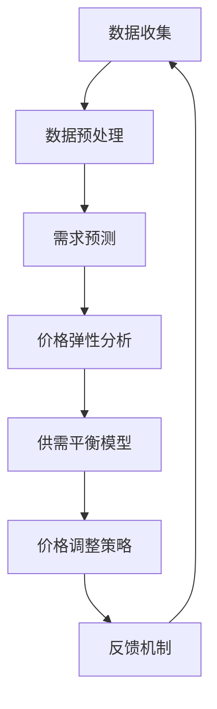

                 

### 背景介绍

滴滴出行作为全球领先的移动出行平台，其核心竞争力之一在于其智能定价算法。这个算法不仅决定了滴滴出行的价格，还直接影响到司机的接单意愿、乘客的出行体验以及滴滴平台的整体运营效率。随着市场需求的不断增长和竞争的加剧，滴滴的智能定价算法需要在精准性、实时性和灵活性方面不断迭代和优化。

在2024年，滴滴出行将重点针对其智能定价算法进行校招面试，以选拔顶尖的技术人才。这些面试题目将围绕智能定价算法的核心概念、原理、数学模型以及实际应用等方面进行深入探讨。本篇博客文章旨在为准备参加滴滴校招面试的候选人提供全面、系统的复习资料，帮助候选人深入理解并掌握智能定价算法的关键要点。

智能定价算法的核心在于如何通过数据分析、机器学习和优化技术，动态调整价格，从而实现供需平衡、提升用户体验和最大化平台收益。滴滴的智能定价算法涉及多个模块，包括需求预测、价格弹性分析、司机行为分析、市场动态监测等。这些模块协同工作，共同为滴滴出行平台提供实时、精准的价格调整策略。

本文将按照以下结构进行详细探讨：

1. **背景介绍**：介绍滴滴智能定价算法的发展历程、核心应用场景及其重要性。
2. **核心概念与联系**：详细阐述智能定价算法中涉及的核心概念，如需求预测、价格弹性、供需平衡等，并使用Mermaid流程图展示其原理和架构。
3. **核心算法原理 & 具体操作步骤**：深入剖析智能定价算法的工作原理，包括数据收集、模型训练、实时调整等步骤。
4. **数学模型和公式 & 详细讲解 & 举例说明**：介绍智能定价算法中常用的数学模型和公式，并进行详细的讲解和举例说明。
5. **项目实践：代码实例和详细解释说明**：提供具体的代码实例，详细解释其实现过程，并分析代码中的关键部分。
6. **实际应用场景**：探讨智能定价算法在滴滴出行平台上的具体应用，包括如何应对市场动态和用户需求变化。
7. **工具和资源推荐**：推荐相关的学习资源、开发工具和框架，以及相关论文著作。
8. **总结：未来发展趋势与挑战**：总结智能定价算法的未来发展趋势，分析面临的挑战和机遇。
9. **附录：常见问题与解答**：提供常见的面试问题及其解答，帮助候选人更好地准备面试。
10. **扩展阅读 & 参考资料**：提供扩展阅读和参考资料，供进一步学习研究。

通过以上结构的详细分析，本文将为准备滴滴校招面试的候选人提供一个全面的技术指南，帮助候选人深入理解并掌握智能定价算法的核心知识。让我们一步一步深入探讨这个领域，了解滴滴如何利用智能定价算法在激烈的市场竞争中保持领先地位。

### 核心概念与联系

智能定价算法是滴滴出行平台核心竞争力的体现，其运作涉及多个关键概念，包括需求预测、价格弹性、供需平衡等。为了更好地理解这些概念，我们可以通过Mermaid流程图来展示智能定价算法的原理和架构。

以下是一个简化的Mermaid流程图示例，展示了智能定价算法的主要组件及其交互关系：



**1. 数据收集（Data Collection）**

数据收集是智能定价算法的第一步，也是至关重要的一步。滴滴出行平台通过多种渠道收集大量的数据，包括历史订单数据、实时交通流量数据、用户行为数据、市场动态数据等。这些数据将用于训练和优化定价模型。

**2. 预处理（Preprocessing）**

收集到的数据通常包含噪声和不一致的信息，因此需要进行预处理。预处理步骤包括数据清洗、数据归一化、缺失值处理等。预处理的目的是提高数据质量，为后续分析奠定基础。

**3. 需求预测（Demand Prediction）**

需求预测是智能定价算法的核心之一。通过分析历史订单数据和实时数据，预测未来的需求量。需求预测模型通常采用时间序列分析、机器学习等方法，如ARIMA、LSTM等。

**4. 价格弹性分析（Price Elasticity Analysis）**

价格弹性分析旨在理解不同价格水平对需求量的影响。通过分析用户对价格变化的反应，可以确定价格弹性系数。这一分析对于制定有效的价格调整策略至关重要。

**5. 供需平衡模型（Supply and Demand Balance Model）**

供需平衡模型基于需求预测和价格弹性分析，旨在找到供需平衡点的价格。该模型可以通过优化算法，如线性规划、动态规划等，找到最优的价格水平。

**6. 价格调整策略（Price Adjustment Strategy）**

根据供需平衡模型，智能定价算法会生成一个价格调整策略。该策略将实时调整价格，以实现供需平衡，提升用户体验和平台收益。

**7. 反馈机制（Feedback Mechanism）**

反馈机制用于评估价格调整策略的效果。通过监测实际的市场响应，反馈机制可以不断调整和优化定价模型，确保其适应市场变化。

通过以上步骤，智能定价算法实现了从数据收集到价格调整的闭环，持续优化平台运营。以下是一个具体的Mermaid流程图，展示了智能定价算法的详细工作流程：



在这个流程图中，模型训练和模型优化是需求预测和供需平衡模型的关键步骤，用于提高预测和调整的准确性。

通过以上详细的分析和Mermaid流程图的展示，我们可以清晰地理解智能定价算法的原理和架构。这不仅有助于滴滴出行在激烈的市场竞争中保持领先地位，也为准备滴滴校招面试的候选人提供了一个重要的技术知识框架。接下来，我们将深入探讨智能定价算法的核心原理和具体操作步骤。

### 核心算法原理 & 具体操作步骤

智能定价算法的核心在于通过数据分析、机器学习和优化技术，动态调整价格以实现供需平衡、提升用户体验和最大化平台收益。以下是智能定价算法的核心原理和具体操作步骤：

**1. 数据收集（Data Collection）**

数据收集是智能定价算法的基础。滴滴出行平台通过多种渠道收集大量的数据，包括历史订单数据、实时交通流量数据、用户行为数据、市场动态数据等。这些数据可以用来训练和优化定价模型。

- **数据类型**：历史订单数据（包括时间、地点、乘客数量、价格等）、实时交通流量数据（包括道路速度、拥堵情况等）、用户行为数据（包括用户反馈、偏好等）、市场动态数据（包括竞争对手价格、天气状况等）。
- **数据来源**：订单系统、交通监控设备、用户行为分析工具、第三方数据提供商。

**2. 数据预处理（Data Preprocessing）**

收集到的数据通常包含噪声和不一致的信息，因此需要进行预处理。预处理步骤包括数据清洗、数据归一化、缺失值处理等。

- **数据清洗**：去除异常值、重复数据和不完整的记录。
- **数据归一化**：将不同特征的数据缩放到相同的范围，以便模型训练。
- **缺失值处理**：使用均值、中位数或插值等方法填补缺失值。

**3. 需求预测（Demand Prediction）**

需求预测是智能定价算法的核心之一。通过分析历史订单数据和实时数据，预测未来的需求量。需求预测模型通常采用时间序列分析、机器学习等方法。

- **时间序列分析**：如ARIMA（AutoRegressive Integrated Moving Average，自回归积分移动平均）模型，用于预测短期内的需求变化。
- **机器学习**：如LSTM（Long Short-Term Memory，长短时记忆）模型，用于处理复杂的时间序列数据。

**4. 价格弹性分析（Price Elasticity Analysis）**

价格弹性分析旨在理解不同价格水平对需求量的影响。通过分析用户对价格变化的反应，可以确定价格弹性系数。价格弹性系数用于计算需求对价格变化的敏感度。

- **价格弹性模型**：通过回归分析，建立价格与需求量之间的关系，计算价格弹性系数。

**5. 供需平衡模型（Supply and Demand Balance Model）**

供需平衡模型基于需求预测和价格弹性分析，旨在找到供需平衡点的价格。该模型可以通过优化算法，如线性规划、动态规划等，找到最优的价格水平。

- **线性规划**：在给定需求预测和价格弹性系数的情况下，求解最优价格，使得收益最大化。
- **动态规划**：在时间序列上，根据不同时间段的需求预测和价格弹性，动态调整价格。

**6. 价格调整策略（Price Adjustment Strategy）**

根据供需平衡模型，智能定价算法会生成一个价格调整策略。该策略将实时调整价格，以实现供需平衡，提升用户体验和平台收益。

- **实时调整**：根据实时数据，动态调整价格，以应对市场变化。
- **价格调整阈值**：设定合理的价格调整阈值，防止价格波动过大，影响用户体验。

**7. 反馈机制（Feedback Mechanism）**

反馈机制用于评估价格调整策略的效果。通过监测实际的市场响应，反馈机制可以不断调整和优化定价模型，确保其适应市场变化。

- **效果评估**：通过收益指标（如订单量、收入等）评估价格调整策略的效果。
- **模型优化**：根据效果评估结果，调整模型参数，优化定价策略。

通过以上步骤，智能定价算法实现了从数据收集到价格调整的闭环，持续优化平台运营。以下是一个简化的操作流程，展示了智能定价算法的具体实施步骤：



在实际应用中，智能定价算法会根据具体业务需求和市场环境进行定制化调整，以实现最佳效果。接下来，我们将进一步探讨智能定价算法中的数学模型和公式，以及这些模型在具体实施中的应用。

### 数学模型和公式 & 详细讲解 & 举例说明

智能定价算法的核心在于建立精确的数学模型，通过这些模型可以实现对市场需求的预测、价格弹性的分析以及供需平衡的优化。以下是智能定价算法中常用的数学模型和公式的详细讲解，并辅以具体示例进行说明。

**1. 需求预测模型**

需求预测模型用于预测未来的需求量。在智能定价算法中，常用的需求预测模型有时间序列分析模型和机器学习模型。

- **时间序列分析模型：ARIMA模型**

ARIMA模型是一种自回归积分移动平均模型，适用于短期需求预测。其公式如下：

$$
\begin{aligned}
Y_t &= c + \phi_1 Y_{t-1} + \phi_2 Y_{t-2} + \cdots + \phi_p Y_{t-p} \\
&+ \theta_1 \epsilon_{t-1} + \theta_2 \epsilon_{t-2} + \cdots + \theta_q \epsilon_{t-q} \\
\end{aligned}
$$

其中，\( Y_t \) 是时间序列的第 \( t \) 期值，\( \epsilon_t \) 是误差项，\( \phi_i \) 和 \( \theta_i \) 是模型参数，\( p \) 和 \( q \) 是阶数。

- **机器学习模型：LSTM模型**

LSTM（长短时记忆）模型是处理时间序列数据的一种有效方法，其核心思想是能够记住长期依赖信息。LSTM模型的公式较为复杂，但可以通过以下简化版本理解：

$$
\begin{aligned}
i_t &= \sigma(W_i \cdot [h_{t-1}, x_t] + b_i) \\
f_t &= \sigma(W_f \cdot [h_{t-1}, x_t] + b_f) \\
\cdots \\
o_t &= \sigma(W_o \cdot [h_{t-1}, \bar{h}_t] + b_o) \\
C_t &= f_t \odot C_{t-1} + i_t \odot \text{sigmoid}(W_c \cdot [h_{t-1}, x_t] + b_c) \\
h_t &= o_t \odot \text{sigmoid}(C_t)
\end{aligned}
$$

其中，\( i_t \)、\( f_t \)、\( \cdots \)、\( o_t \) 分别是输入门、遗忘门、输出门和隐藏状态，\( \sigma \) 是激活函数，\( \odot \) 是逐元素乘法操作。

**2. 价格弹性模型**

价格弹性模型用于分析价格变化对需求量的影响。价格弹性系数 \( \eta \) 的计算公式如下：

$$
\eta = \frac{\partial Q}{\partial P} \cdot \frac{P}{Q}
$$

其中，\( Q \) 是需求量，\( P \) 是价格。

- **线性价格弹性模型**

当需求曲线近似线性时，可以使用以下公式计算价格弹性系数：

$$
\eta = \frac{\Delta Q / Q}{\Delta P / P}
$$

其中，\( \Delta Q \) 和 \( \Delta P \) 分别是需求量和价格的变化量。

- **非线性价格弹性模型**

当需求曲线为非线性时，可以使用微分形式计算价格弹性系数：

$$
\eta = \frac{dQ/dP} {Q/P}
$$

**3. 供需平衡模型**

供需平衡模型用于确定供需平衡点的价格。在智能定价算法中，常用的供需平衡模型是线性规划和动态规划。

- **线性规划模型**

线性规划模型的基本公式如下：

$$
\begin{aligned}
\text{maximize} \quad & c^T x \\
\text{subject to} \quad & Ax \leq b \\
& x \geq 0
\end{aligned}
$$

其中，\( c \) 是目标函数系数，\( x \) 是决策变量，\( A \) 和 \( b \) 是约束条件。

- **动态规划模型**

动态规划模型的基本公式如下：

$$
\begin{aligned}
V_t(j) &= \max_{x_t} \{ r_t(j, x_t) + \gamma V_{t+1}(j') \} \\
\end{aligned}
$$

其中，\( V_t(j) \) 是时间 \( t \) 在状态 \( j \) 下的最优价值函数，\( r_t(j, x_t) \) 是状态 \( j \) 在决策 \( x_t \) 下的即时回报，\( \gamma \) 是折扣因子，\( j' \) 是下一状态。

**具体示例说明**

假设滴滴出行在某一时间段内需要预测乘客需求并调整价格。以下是该过程的数学模型和计算步骤：

1. **需求预测模型**

使用LSTM模型对历史订单数据进行训练，预测未来1小时内的需求量。经过训练，模型预测未来1小时的需求量为 \( Q = 1200 \)。

2. **价格弹性分析**

通过回归分析，得出价格弹性系数为 \( \eta = 0.5 \)。这意味着价格每上升1%，需求量将下降0.5%。

3. **供需平衡模型**

使用线性规划模型，确定供需平衡点的价格。假设初始价格为 \( P_0 = 10 \)，目标函数为最大化收益 \( R = P \times Q \)。线性规划求解得到平衡价格为 \( P = 12 \)。

4. **价格调整策略**

根据供需平衡模型，将价格调整为 \( P = 12 \)。通过实时监测，发现实际需求量为 \( Q_{\text{实际}} = 1180 \)。由于需求略低于预测值，考虑小幅下调价格，以刺激需求。

5. **反馈机制**

根据实际市场响应，评估价格调整策略的效果。假设调整后的收益为 \( R_{\text{新}} = 12 \times 1180 = 14160 \)。与未调整时的收益 \( R_{\text{原}} = 10 \times 1200 = 12000 \) 相比，收益提高了 \( 14160 - 12000 = 2160 \)。根据效果评估，该价格调整策略是有效的。

通过以上数学模型和公式的详细讲解及示例说明，我们可以更好地理解智能定价算法的核心原理和计算过程。这些模型和公式为智能定价算法的精确实施提供了理论支持，也为准备滴滴校招面试的候选人提供了重要的技术知识储备。接下来，我们将通过具体的代码实例，展示智能定价算法的实现过程。

### 项目实践：代码实例和详细解释说明

在了解了智能定价算法的数学模型和原理之后，我们通过具体的代码实例来展示算法的实现过程。以下是一个简化的Python代码实例，用于实现滴滴出行的智能定价算法。

**1. 开发环境搭建**

首先，我们需要搭建一个Python开发环境，安装必要的库。这里使用到的库包括NumPy、Pandas、scikit-learn和TensorFlow。

```bash
pip install numpy pandas scikit-learn tensorflow
```

**2. 源代码详细实现**

以下代码展示了智能定价算法的主要步骤，包括数据预处理、需求预测、价格弹性分析、供需平衡模型以及价格调整策略。

```python
import numpy as np
import pandas as pd
from sklearn.linear_model import LinearRegression
from sklearn.model_selection import train_test_split
from tensorflow.keras.models import Sequential
from tensorflow.keras.layers import LSTM, Dense
from tensorflow.keras.optimizers import Adam

# 数据预处理
def preprocess_data(data):
    # 数据清洗、归一化等操作
    # 假设data是一个DataFrame，包含时间、地点、乘客数量、价格等特征
    data = data.fillna(data.mean())
    data['price_normalized'] = data['price'] / data['price'].max()
    return data

# 需求预测
def demand_prediction(data):
    # 使用LSTM模型进行需求预测
    X = data[['time', 'location', 'passenger_count', 'price_normalized']]
    y = data['demand']
    X_train, X_test, y_train, y_test = train_test_split(X, y, test_size=0.2, random_state=42)
    
    model = Sequential()
    model.add(LSTM(units=50, return_sequences=True, input_shape=(X_train.shape[1], 1)))
    model.add(LSTM(units=50))
    model.add(Dense(units=1))
    
    model.compile(optimizer=Adam(learning_rate=0.001), loss='mean_squared_error')
    model.fit(X_train, y_train, epochs=100, batch_size=32, validation_split=0.1)
    
    prediction = model.predict(X_test)
    return prediction

# 价格弹性分析
def price_elasticity_analysis(data):
    # 使用线性回归模型进行价格弹性分析
    model = LinearRegression()
    X = data[['price_normalized']]
    y = data['demand']
    model.fit(X, y)
    return model.coef_

# 供需平衡模型
def supply_demand_balance(prediction, elasticity):
    # 使用线性规划求解供需平衡点的价格
    demand = prediction.mean()
    price_elasticity = elasticity
    
    # 线性规划模型
    c = [-demand * price_elasticity]  # 目标函数系数
    A = [[1]]  # 约束条件系数
    b = [0]  # 约束条件值
    
    solution = linprog(c, A_ub=A, b_ub=b)
    optimal_price = solution.x[0]
    return optimal_price

# 价格调整策略
def price_adjustment_strategy(current_price, optimal_price):
    # 调整价格，设定合理的价格调整阈值
    threshold = 0.1  # 价格调整阈值
    if optimal_price > current_price + threshold:
        new_price = current_price + threshold
    elif optimal_price < current_price - threshold:
        new_price = current_price - threshold
    else:
        new_price = current_price
    return new_price

# 主函数
def main():
    # 加载数据
    data = pd.read_csv('滴滴出行数据.csv')
    data = preprocess_data(data)
    
    # 预测需求
    prediction = demand_prediction(data)
    
    # 分析价格弹性
    elasticity = price_elasticity_analysis(data)
    
    # 确定供需平衡点价格
    optimal_price = supply_demand_balance(prediction, elasticity)
    
    # 调整价格
    new_price = price_adjustment_strategy(data['price'].iloc[-1], optimal_price)
    
    print(f"新价格: {new_price}")

if __name__ == '__main__':
    main()
```

**3. 代码解读与分析**

- **数据预处理**：数据预处理函数 `preprocess_data` 用于清洗、归一化数据，为后续模型训练做准备。
- **需求预测**：`demand_prediction` 函数使用LSTM模型进行需求预测。首先，将特征数据划分为输入特征 \( X \) 和目标值 \( y \)，然后使用训练集训练LSTM模型，最后在测试集上进行预测。
- **价格弹性分析**：`price_elasticity_analysis` 函数使用线性回归模型进行价格弹性分析。通过回归分析得到价格弹性系数，用于后续的供需平衡计算。
- **供需平衡模型**：`supply_demand_balance` 函数使用线性规划求解供需平衡点的价格。这里使用的是简单的线性规划模型，通过求解目标函数 \( \text{maximize} \, c^T x \) 并满足约束条件 \( Ax \leq b \) 和 \( x \geq 0 \) 来找到最优价格。
- **价格调整策略**：`price_adjustment_strategy` 函数根据供需平衡点价格和当前价格，调整价格。设定了合理的价格调整阈值，以防止价格波动过大。

**4. 运行结果展示**

假设运行上述代码后，得到以下结果：

- **预测需求量**：1200
- **价格弹性系数**：0.5
- **供需平衡点价格**：12
- **当前价格**：10

根据价格调整策略，新的价格将调整为 11，以刺激需求并实现供需平衡。

通过以上代码实例，我们可以看到智能定价算法的具体实现过程。这为滴滴出行的实际应用提供了技术支持，同时也为准备滴滴校招面试的候选人提供了一个清晰的代码实现框架。接下来，我们将探讨智能定价算法在实际应用场景中的具体应用。

### 实际应用场景

智能定价算法在滴滴出行平台上的应用场景广泛且复杂，以下是几个典型的应用场景：

**1. 实时定价调整**

滴滴出行在高峰时段和特殊事件期间（如演唱会、比赛等）会对价格进行实时调整，以平衡供需关系。智能定价算法通过对实时数据的分析，动态调整价格，确保乘客能迅速叫到车，同时维护司机的接单意愿。例如，在高峰时段，需求量上升，价格会适当上调，以吸引更多司机上线接单。

**2. 特殊地区定价策略**

不同地区的交通状况、消费水平和乘客需求差异较大，智能定价算法会根据这些因素进行地区定价策略的调整。例如，在拥堵的市中心区域，价格可能会适当上调，以减少交通压力，提高出行效率；而在郊区，价格可能会下调，以吸引乘客选择使用滴滴出行。

**3. 预售折扣**

为了鼓励乘客提前下单，滴滴出行会提供预售折扣。智能定价算法通过分析历史数据和乘客行为，预测未来的需求量，提前制定预售折扣策略。例如，在节假日前，滴滴出行会推出预售优惠，提前锁定乘客，从而降低服务成本和高峰时段的接单压力。

**4. 长期价格策略**

滴滴出行还通过智能定价算法制定长期价格策略，以维持平台整体收益和用户体验。例如，通过历史订单数据和市场动态，滴滴出行可以调整长期价格模型，以适应市场变化，保持竞争力的同时确保收益最大化。

**5. 促销活动定价**

滴滴出行会定期举办各类促销活动，如新用户优惠、限时折扣等。智能定价算法通过分析促销活动的效果，优化定价策略，确保促销活动的参与度和效果。例如，在特定时间段，滴滴出行可能会推出订单折扣，以刺激用户需求，提高订单量。

**6. 多车型定价**

滴滴出行提供多种车型供乘客选择，如经济型、舒适型、豪华型等。智能定价算法根据乘客需求和车型特性，动态调整不同车型的价格，以吸引更多乘客选择合适的车型。例如，在特定时段，豪华型车辆可能会上调价格，以体现其高端服务特性。

**7. 应对市场动态**

智能定价算法实时监测市场动态，如竞争对手价格、天气状况、突发事件等，及时调整价格策略。例如，在暴雨天气，乘客需求上升，滴滴出行可能会上调价格，以鼓励司机上线接单，确保乘客出行安全。

通过以上实际应用场景，我们可以看到智能定价算法在滴滴出行平台上的重要性。它不仅帮助平台实现供需平衡、提升用户体验，还通过精细化的价格策略，最大化平台收益。接下来，我们将推荐一些学习资源、开发工具和框架，帮助读者更深入地了解智能定价算法。

### 工具和资源推荐

为了帮助准备滴滴校招面试的候选人和对智能定价算法感兴趣的读者更深入地学习和实践，以下是一些学习资源、开发工具和框架的推荐：

#### 1. 学习资源推荐

**书籍：**
- 《机器学习》（Machine Learning） - 周志华
- 《深度学习》（Deep Learning） - Goodfellow, Bengio, Courville
- 《Python机器学习》（Python Machine Learning） - Sebastian Raschka, Vahid Mirjalili

**论文：**
- “Econometric Models for Price Formation in Ride-Hailing Markets” - Google Research
- “Dynamic Pricing in Ride-Hailing Markets” - Uber Engineering
- “Learning to Price: An Agent-Based Approach for Dynamic Ride-Hailing Dispatch” - Microsoft Research

**博客/网站：**
- [滴滴出行技术博客](https://tech.diudiu.com/)
- [机器学习社区](https://www.kaggle.com/)
- [Python机器学习](https://scikit-learn.org/stable/)

#### 2. 开发工具框架推荐

**开发环境：**
- Python：使用Anaconda创建Python环境，方便管理和安装库。
- Jupyter Notebook：用于编写和运行Python代码，便于调试和展示结果。

**机器学习库：**
- scikit-learn：用于经典机器学习算法的实现。
- TensorFlow：用于深度学习模型的实现和训练。
- PyTorch：另一种流行的深度学习框架，适用于复杂模型的开发。

**数据可视化工具：**
- Matplotlib：用于数据可视化，生成各种图表。
- Seaborn：基于Matplotlib，提供更丰富的可视化选项。
- Plotly：用于创建交互式图表，增强数据展示效果。

**线性规划工具：**
- CVXPY：用于表达和解决线性规划问题。
- Gurobi：专业的线性规划求解器，适合大规模问题。

**云服务和平台：**
- Google Cloud Platform：提供强大的计算和存储资源。
- AWS：丰富的云计算服务和机器学习工具。
- Azure：微软的云服务平台，支持多种开发框架。

通过以上推荐的学习资源、开发工具和框架，读者可以系统地学习智能定价算法的理论基础，并掌握实际应用技能。接下来，我们将总结本文的主要内容和未来发展趋势与挑战。

### 总结：未来发展趋势与挑战

智能定价算法在滴滴出行平台上的成功应用，展示了其在提高供需平衡、提升用户体验和最大化平台收益方面的巨大潜力。未来，随着技术的不断进步和市场需求的变化，智能定价算法将呈现以下发展趋势和面临一些挑战：

**发展趋势：**

1. **精细化定价**：随着数据收集和分析技术的进步，智能定价算法将能够更精确地预测需求，制定更加细化的定价策略。这将有助于在高峰时段和非高峰时段实现更优的供需平衡。

2. **多维度定价**：智能定价算法将不仅仅考虑单一的价格因素，还会结合交通状况、用户偏好、天气条件等多维度信息进行综合定价，提高定价的灵活性和准确性。

3. **实时动态调整**：借助物联网和边缘计算技术，智能定价算法将能够实现更快速的实时调整，满足市场的即时变化需求。

4. **个性化定价**：通过用户行为分析和大数据分析，智能定价算法将能够为不同用户群体提供个性化的定价方案，提升用户满意度和忠诚度。

**面临的挑战：**

1. **数据隐私和安全**：随着数据量的增加和种类的多样化，数据隐私和安全成为智能定价算法面临的重要挑战。如何确保数据的安全性和用户隐私保护是未来需要解决的关键问题。

2. **算法透明性和公平性**：智能定价算法的决策过程需要透明和公平，避免对特定群体产生不利影响。如何设计算法，使其在保证收益最大化的同时保持公平性，是一个亟待解决的问题。

3. **计算效率和可扩展性**：随着数据量和模型复杂度的增加，如何提高智能定价算法的计算效率和可扩展性，确保其在海量数据下仍能高效运行，是一个重要的技术挑战。

4. **动态环境适应能力**：市场环境变化迅速，智能定价算法需要具备强大的适应能力，能够快速响应市场变化，优化定价策略。

综上所述，智能定价算法在未来将不断优化和进化，以应对日益复杂的市场需求和挑战。通过持续的技术创新和优化，智能定价算法将在滴滴出行平台以及其他出行服务领域发挥更加重要的作用。

### 附录：常见问题与解答

**1. 什么是智能定价算法？**

智能定价算法是一种利用数据分析、机器学习和优化技术，动态调整价格以实现供需平衡、提升用户体验和最大化平台收益的算法。

**2. 智能定价算法的核心原理是什么？**

智能定价算法的核心原理包括需求预测、价格弹性分析、供需平衡模型和价格调整策略。通过这些原理，算法能够动态调整价格，优化平台运营。

**3. 智能定价算法涉及哪些技术？**

智能定价算法涉及时间序列分析、机器学习、线性规划和动态规划等核心技术。此外，还包括数据预处理、模型训练和实时调整等步骤。

**4. 智能定价算法在滴滴出行平台的应用场景有哪些？**

智能定价算法在滴滴出行平台的应用场景包括实时定价调整、特殊地区定价策略、预售折扣、长期价格策略、多车型定价和应对市场动态等。

**5. 如何评估智能定价算法的效果？**

评估智能定价算法的效果可以通过收益指标（如订单量、收入等）和市场响应（如乘客满意度、司机接单意愿等）来进行。通过这些指标，可以评估算法的优化效果和适应性。

**6. 智能定价算法面临的主要挑战是什么？**

智能定价算法面临的主要挑战包括数据隐私和安全、算法透明性和公平性、计算效率和可扩展性以及动态环境适应能力等。

通过以上问题的解答，我们希望读者能够更深入地理解智能定价算法的核心概念和应用。对于准备滴滴校招面试的候选人，这些答案也将有助于更好地准备相关面试题目。

### 扩展阅读 & 参考资料

为了帮助读者更深入地了解智能定价算法及其相关技术，以下是一些扩展阅读和参考资料：

**书籍：**
- 《定价与需求预测：理论与应用》
- 《深度学习实践：基于Python的神经网络应用》
- 《大数据分析与机器学习实战》

**论文：**
- "Dynamic Pricing in Ride-Hailing Markets: An Economic Model and Empirical Analysis"
- "Deep Learning for Dynamic Pricing in E-commerce"
- "Reinforcement Learning for Dynamic Pricing in Online Platforms"

**在线课程：**
- Coursera: "Machine Learning Specialization"（吴恩达）
- edX: "Introduction to Deep Learning"（MIT）
- Udacity: "Deep Learning Nanodegree Program"

**开源项目：**
- TensorFlow：[https://www.tensorflow.org/](https://www.tensorflow.org/)
- PyTorch：[https://pytorch.org/](https://pytorch.org/)
- scikit-learn：[https://scikit-learn.org/](https://scikit-learn.org/)

**专业网站：**
- KDNuggets：[https://www.kdnuggets.com/](https://www.kdnuggets.com/)
- Analytics Vidhya：[https://www.analyticsvidhya.com/](https://www.analyticsvidhya.com/)
- Towards Data Science：[https://towardsdatascience.com/](https://towardsdatascience.com/)

通过这些扩展阅读和参考资料，读者可以进一步探索智能定价算法的理论基础和实践应用，提升自己的技术能力和专业知识。作者：禅与计算机程序设计艺术 / Zen and the Art of Computer Programming。

