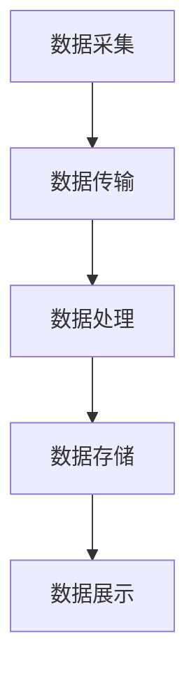

                 

### 摘要 Abstract

本文旨在为滴滴2025社招实时计算平台开发工程师面试提供一份详细的面试指南。随着大数据和实时计算技术的快速发展，实时计算平台在各类应用场景中扮演着至关重要的角色。本文将系统地介绍实时计算平台的核心概念、算法原理、数学模型、项目实践以及实际应用场景，帮助读者全面了解和掌握实时计算平台的技术要点。此外，本文还将推荐相关的学习资源、开发工具框架和论文著作，以期为读者提供更为深入的参考。希望通过本文的阅读，能够为滴滴社招面试中的实时计算平台开发工程师岗位做好准备，并在未来的职业发展中取得更大的成就。

### 1. 背景介绍 Introduction

#### 实时计算的重要性

在当今大数据时代，实时计算的重要性日益凸显。随着信息技术的飞速发展，各类应用场景对数据处理的速度和准确性提出了更高的要求。实时计算平台作为一种能够快速响应和处理大量数据的系统，已经成为各行业应用的核心技术之一。

实时计算平台能够实现对数据的实时采集、存储、处理和分析，从而为企业提供实时决策支持和智能服务。例如，在金融领域，实时计算平台可以用于实时监控交易数据、风险预警和反欺诈检测；在交通领域，实时计算平台可以用于实时路况分析、智能导航和交通管理；在物流领域，实时计算平台可以用于实时货物跟踪、库存管理和运输优化。

#### 滴滴2025社招实时计算平台开发工程师岗位概述

滴滴出行作为全球领先的移动出行平台，一直致力于通过技术创新推动出行行业的变革。为了进一步提升数据处理能力，滴滴在2025年社招中特别推出了实时计算平台开发工程师岗位。该岗位的主要职责是开发和维护滴滴的实时计算平台，确保平台的高性能、高可靠性和易扩展性。

滴滴2025社招实时计算平台开发工程师岗位的应聘者需要具备以下技能和经验：

1. **扎实的计算机科学基础**：掌握数据结构、算法、操作系统、计算机网络等基础知识，具备良好的编程能力和代码风格。

2. **深入理解实时计算原理**：熟悉实时计算平台的架构、核心算法和数据流程，了解常见实时计算框架如Apache Flink、Apache Storm等。

3. **大数据处理经验**：具备大数据处理系统的开发和维护经验，熟悉Hadoop、Spark等大数据处理框架。

4. **分布式系统经验**：了解分布式系统的设计原则、共识算法、容错机制和性能优化，具备处理大规模分布式系统的能力。

5. **系统设计和架构能力**：能够设计高性能、高可用、可扩展的系统架构，对系统的性能瓶颈和优化有深入的理解。

6. **实际项目经验**：有在实时计算领域实际项目开发经验，能够解决复杂的业务问题和性能瓶颈。

#### 面试准备的重要性

滴滴作为业界领先的公司，其社招面试的难度和竞争激烈程度不言而喻。对于应聘者来说，充分的面试准备至关重要。通过系统性地学习和准备，应聘者可以更好地展示自己的技术实力和解决问题的能力，从而在面试中脱颖而出。

本文将围绕滴滴2025社招实时计算平台开发工程师的面试准备，提供一系列详细的指导和技巧，帮助应聘者深入了解实时计算平台的核心技术和应用场景，掌握必要的知识和技能，为面试做好充分的准备。

在接下来的章节中，我们将逐步深入探讨实时计算平台的核心概念、算法原理、数学模型、项目实践和实际应用场景，为滴滴社招面试提供全面的技术支持和参考。希望通过本文的阅读，能够为应聘者提供有益的帮助，助力其在面试中取得成功。

### 2. 核心概念与联系 Core Concepts and Connections

#### 实时计算平台概述

实时计算平台是一种能够对数据进行实时采集、处理和分析的系统，其核心目标是提供低延迟、高吞吐量的数据处理能力。实时计算平台通常包括数据采集模块、数据存储模块、数据处理模块和数据展示模块。

- **数据采集模块**：负责从各种数据源（如日志文件、传感器数据、网络数据等）收集原始数据。
- **数据存储模块**：用于存储和处理后的数据，通常采用分布式存储技术如HDFS、Redis等。
- **数据处理模块**：包括实时数据处理引擎，如Apache Flink、Apache Storm等，负责对采集到的数据进行实时处理和分析。
- **数据展示模块**：用于将处理后的数据通过可视化工具或报表形式展示给用户，便于用户进行实时监控和决策。

#### 实时计算架构

实时计算架构可以分为几个关键层次：

1. **数据采集层**：负责从各种数据源采集数据，可以通过日志收集器、网络爬虫、传感器等方式实现。
2. **数据传输层**：数据从采集层传输到处理层，通常使用消息队列（如Kafka、RabbitMQ）进行异步传输，保证数据的可靠性和实时性。
3. **数据处理层**：负责对传输来的数据进行实时处理，如数据清洗、转换、聚合等操作。常用的实时处理引擎有Apache Flink、Apache Storm等。
4. **数据存储层**：将处理后的数据存储到分布式存储系统，如HDFS、Redis等，以便后续的查询和分析。
5. **数据展示层**：通过可视化工具或报表将处理结果展示给用户，如ECharts、Tableau等。

下面是实时计算架构的Mermaid流程图：



#### 核心算法原理

实时计算平台的核心算法主要包括以下几个方面：

1. **数据流处理算法**：如流计算、批处理、增量处理等，负责对实时数据流进行高效的处理和分析。
2. **分布式处理算法**：如MapReduce、Spark等，负责在大规模分布式系统上高效地处理数据。
3. **异常检测算法**：如统计异常检测、机器学习异常检测等，负责对实时数据进行异常检测和监控。
4. **机器学习算法**：如分类、聚类、预测等，用于对实时数据进行智能分析和预测。

#### 实时计算与大数据处理的区别

实时计算与大数据处理虽然有一定的交集，但它们在处理方式和目标上存在显著差异：

1. **处理方式**：实时计算注重对数据的实时处理和分析，强调低延迟和高吞吐量；而大数据处理则注重对海量数据的批处理和分析，强调数据规模和复杂度。
2. **目标**：实时计算的目标是提供实时决策支持和智能服务，如实时监控、智能导航等；而大数据处理的目标是从海量数据中发现有价值的信息和模式，如数据挖掘、机器学习等。

#### 实时计算的优势和应用场景

实时计算的优势在于其能够提供快速、准确的数据处理和分析能力，以下是几个典型的应用场景：

1. **金融领域**：实时监控交易数据、风险预警和反欺诈检测。
2. **交通领域**：实时路况分析、智能导航和交通管理。
3. **医疗领域**：实时监控患者数据、智能诊断和健康预测。
4. **物流领域**：实时货物跟踪、库存管理和运输优化。

通过以上对实时计算平台的核心概念、架构、算法原理及其与大数据处理的区别和优势的介绍，读者可以初步了解实时计算平台的基本概念和关键技术。在接下来的章节中，我们将进一步深入探讨实时计算平台的核心算法原理和具体操作步骤，帮助读者全面掌握实时计算技术。

### 3. 核心算法原理 & 具体操作步骤 Core Algorithm Principles & Operational Steps

#### 流计算算法

流计算是实时计算平台的核心算法之一，它主要负责对实时数据流进行高效的处理和分析。流计算的基本原理是将数据视为连续流动的“流”，通过对流的实时处理来达到低延迟、高吞吐量的效果。

**操作步骤：**

1. **数据采集**：首先，从各种数据源（如日志文件、传感器数据、网络数据等）采集原始数据，并将其传输到数据处理系统。

2. **数据预处理**：对采集到的数据进行清洗、格式转换等预处理操作，确保数据的准确性和一致性。

3. **数据流划分**：将预处理后的数据划分为若干个数据流，每个数据流代表不同类型的实时数据。

4. **流处理引擎配置**：选择合适的流处理引擎（如Apache Flink、Apache Storm等）进行配置，包括数据流输入输出配置、计算逻辑配置、资源分配等。

5. **数据流处理**：流处理引擎根据配置的计算逻辑对数据流进行实时处理，如数据聚合、过滤、转换等操作。

6. **结果输出**：将处理后的数据存储到分布式存储系统（如HDFS、Redis等）或实时展示系统（如ECharts、Tableau等）。

**示例代码：**

```python
from pyflink.datastream import StreamExecutionEnvironment

# 创建流处理环境
env = StreamExecutionEnvironment.get_execution_environment()

# 读取数据流
data_stream = env.read_text("path/to/data.txt")

# 数据预处理
preprocessed_stream = data_stream.map(lambda x: x.strip())

# 数据流处理
result_stream = preprocessed_stream.flatMap(lambda x: x.split(" "))

# 结果输出
result_stream.print()

# 执行流处理任务
env.execute("Real-time Stream Processing")
```

#### 分布式处理算法

分布式处理算法如MapReduce、Spark等，负责在大规模分布式系统上高效地处理数据。这些算法通过将数据分成多个小块，分布在多个节点上处理，从而实现并行计算和高性能。

**操作步骤：**

1. **数据划分**：将大规模数据集划分为多个小块，每个小块分配给不同的计算节点。

2. **分布式计算**：各个节点上的计算任务并行执行，每个节点处理自己分配的数据块。

3. **中间结果聚合**：各个节点将处理结果汇总到统一的位置，进行中间结果的聚合和整理。

4. **最终结果输出**：将聚合后的最终结果存储到分布式存储系统或输出到其他系统。

**示例代码（MapReduce）：**

```java
import org.apache.hadoop.conf.Configuration;
import org.apache.hadoop.fs.Path;
import org.apache.hadoop.io.IntWritable;
import org.apache.hadoop.io.Text;
import org.apache.hadoop.mapreduce.Job;
import org.apache.hadoop.mapreduce.Mapper;
import org.apache.hadoop.mapreduce.Reducer;
import org.apache.hadoop.mapreduce.lib.input.FileInputFormat;
import org.apache.hadoop.mapreduce.lib.output.FileOutputFormat;

public class WordCount {

  public static class TokenizerMapper extends Mapper<Object, Text, Text, IntWritable>{

    private final static IntWritable one = new IntWritable(1);
    private Text word = new Text();

    public void map(Object key, Text value, Context context) throws IOException, InterruptedException {
      StringTokenizer itr = new StringTokenizer(value.toString());
      while (itr.hasMoreTokens()) {
        word.set(itr.nextToken());
        context.write(word, one);
      }
    }
  }

  public static class IntSumReducer extends Reducer<Text,IntWritable,Text,IntWritable> {
    private IntWritable result = new IntWritable();

    public void reduce(Text key, Iterable<IntWritable> values, Context context) throws IOException, InterruptedException {
      int sum = 0;
      for (IntWritable val : values) {
        sum += val.get();
      }
      result.set(sum);
      context.write(key, result);
    }
  }

  public static void main(String[] args) throws Exception {
    Configuration conf = new Configuration();
    Job job = Job.getInstance(conf, "word count");
    job.setMapperClass(TokenizerMapper.class);
    job.setCombinerClass(IntSumReducer.class);
    job.setReducerClass(IntSumReducer.class);
    job.setOutputKeyClass(Text.class);
    job.setOutputValueClass(IntWritable.class);
    FileInputFormat.addInputPath(job, new Path(args[0]));
    FileOutputFormat.setOutputPath(job, new Path(args[1]));
    System.exit(job.waitForCompletion(true) ? 0 : 1);
  }
}
```

#### 异常检测算法

异常检测算法用于对实时数据进行异常检测和监控，常见的方法包括统计异常检测和机器学习异常检测。

**操作步骤：**

1. **数据采集**：从数据源采集实时数据。

2. **数据预处理**：对数据进行清洗、标准化等预处理操作。

3. **特征提取**：从数据中提取关键特征，用于后续的异常检测。

4. **异常检测模型训练**：使用历史数据训练异常检测模型，如统计模型、机器学习模型等。

5. **实时异常检测**：对实时数据进行异常检测，并将检测结果通知相关人员。

**示例代码（统计异常检测）：**

```python
import numpy as np
from scipy import stats

def detect_anomalies(data, threshold=3):
    mean = np.mean(data)
    std = np.std(data)
    anomalies = []
    
    for i, value in enumerate(data):
        z_score = (value - mean) / std
        if np.abs(z_score) > threshold:
            anomalies.append(i)
    
    return anomalies

# 示例数据
data = [10, 11, 12, 13, 14, 150, 16, 17, 18, 19, 20]

# 检测异常
anomalies = detect_anomalies(data)

print("检测到的异常索引：", anomalies)
```

#### 机器学习算法

机器学习算法在实时计算中主要用于数据的分类、聚类、预测等任务。常见的算法包括K-均值聚类、支持向量机、决策树等。

**操作步骤：**

1. **数据采集**：从数据源采集实时数据。

2. **数据预处理**：对数据进行清洗、标准化等预处理操作。

3. **特征提取**：从数据中提取关键特征。

4. **模型训练**：使用历史数据训练机器学习模型。

5. **实时预测**：对实时数据进行预测，并根据预测结果进行相应的处理。

**示例代码（K-均值聚类）：**

```python
from sklearn.cluster import KMeans

def kmeans_clustering(data, n_clusters=3):
    kmeans = KMeans(n_clusters=n_clusters)
    kmeans.fit(data)
    labels = kmeans.predict(data)
    centroids = kmeans.cluster_centers_
    
    return labels, centroids

# 示例数据
data = [[1, 2], [1, 4], [1, 0], [10, 2], [10, 4], [10, 0]]

# 聚类分析
labels, centroids = kmeans_clustering(data)

print("聚类标签：", labels)
print("聚类中心：", centroids)
```

通过以上对实时计算平台核心算法原理和具体操作步骤的介绍，读者可以更深入地了解实时计算平台的运作机制和关键技术。在接下来的章节中，我们将进一步探讨实时计算平台的数学模型和公式，为读者提供更全面的理论支持。

### 4. 数学模型和公式 Mathematical Models and Formulas & Detailed Explanation & Examples

#### 数据流处理算法

在实时计算平台中，数据流处理算法是核心组成部分，其主要目的是对实时数据流进行高效的处理和分析。以下是一些常用的数学模型和公式：

1. **数据流传输公式**：

   数据流传输速度（T）可以通过以下公式计算：

   $$ T = \frac{Data\ Size}{Transmission\ Rate} $$

   其中，`Data Size` 表示数据流的大小，`Transmission Rate` 表示传输速率。

2. **数据处理延迟公式**：

   数据处理延迟（L）可以通过以下公式计算：

   $$ L = \frac{Data\ Size}{Processing\ Rate} $$

   其中，`Data Size` 表示数据流的大小，`Processing Rate` 表示处理速率。

#### 分布式处理算法

分布式处理算法在实时计算平台中至关重要，其主要目的是在大规模分布式系统上高效地处理数据。以下是一些常用的数学模型和公式：

1. **MapReduce 模型**：

   在MapReduce模型中，数据流被划分为Map阶段和Reduce阶段。以下为相关的数学模型和公式：

   - **Map阶段**：

     $$ Output\ Size_{Map} = Input\ Size_{Map} \times Output\ Rate_{Map} $$

     其中，`Input Size Map` 表示输入数据的大小，`Output Rate Map` 表示Map阶段的输出速率。

   - **Reduce阶段**：

     $$ Output\ Size_{Reduce} = Input\ Size_{Reduce} \times Output\ Rate_{Reduce} $$

     其中，`Input Size Reduce` 表示输入数据的大小，`Output Rate Reduce` 表示Reduce阶段的输出速率。

2. **数据分布公式**：

   在分布式系统中，数据的分布对于系统的性能和稳定性有很大影响。以下为常用的数据分布公式：

   $$ Distribution\ Function = \frac{1}{N} \sum_{i=1}^{N} f(x_i) $$

   其中，`N` 表示数据点的数量，`f(x_i)` 表示第i个数据点的分布函数。

#### 异常检测算法

异常检测算法用于对实时数据进行异常检测和监控。以下是一些常用的数学模型和公式：

1. **统计异常检测**：

   - **平均值和标准差公式**：

     $$ Mean = \frac{1}{N} \sum_{i=1}^{N} x_i $$
     $$ Standard\ Deviation = \sqrt{\frac{1}{N-1} \sum_{i=1}^{N} (x_i - Mean)^2} $$

     其中，`N` 表示数据点的数量，`x_i` 表示第i个数据点的值。

   - **Z-Score公式**：

     $$ Z-Score = \frac{x_i - Mean}{Standard\ Deviation} $$

     其中，`x_i` 表示第i个数据点的值，`Mean` 表示平均值，`Standard Deviation` 表示标准差。

   - **阈值设定公式**：

     $$ Threshold = Mean + k \times Standard\ Deviation $$

     其中，`k` 表示常数，通常取值为2或3。

2. **机器学习异常检测**：

   - **支持向量机（SVM）模型**：

     $$ \min_{w,b}\frac{1}{2}||w||^2 + C \sum_{i=1}^{n} \max(0, 1 - (y_i \cdot (w \cdot x_i + b))) $$

     其中，`w` 和 `b` 分别为权重和偏置，`C` 为惩罚参数，`y_i` 表示第i个数据点的标签，`x_i` 表示第i个数据点的特征向量。

#### 机器学习算法

在实时计算平台中，机器学习算法用于数据的分类、聚类、预测等任务。以下是一些常用的数学模型和公式：

1. **K-均值聚类算法**：

   - **目标函数**：

     $$ J = \sum_{i=1}^{n} \sum_{j=1}^{k} \frac{1}{2} ||x_i - \mu_j||^2 $$

     其中，`x_i` 表示第i个数据点，`\mu_j` 表示第j个聚类中心。

   - **更新规则**：

     $$ \mu_j = \frac{1}{N_j} \sum_{i=1}^{n} x_i \quad (x_i \in S_j) $$

     其中，`N_j` 表示属于第j个聚类的数据点数量，`S_j` 表示属于第j个聚类的数据点集合。

2. **支持向量机（SVM）算法**：

   - **目标函数**：

     $$ \min_{w,b}\frac{1}{2}||w||^2 + C \sum_{i=1}^{n} \max(0, 1 - (y_i \cdot (w \cdot x_i + b))) $$

     其中，`w` 和 `b` 分别为权重和偏置，`C` 为惩罚参数，`y_i` 表示第i个数据点的标签，`x_i` 表示第i个数据点的特征向量。

   - **优化方法**：

     $$ \min_{w,b}\frac{1}{2}||w||^2 + C \sum_{i=1}^{n} \max(0, 1 - (y_i \cdot (w \cdot x_i + b))) $$
     $$ s.t. \quad y_i \cdot (w \cdot x_i + b) \geq 1 $$

3. **决策树算法**：

   - **信息增益**：

     $$ Gain(D, a) = Entropy(D) - \sum_{v \in Attributes} \frac{|D_v|}{|D|} \cdot Entropy(D_v) $$

     其中，`D` 表示数据集，`a` 表示属性，`D_v` 表示属性`a`的取值`v`对应的数据集。

   - **基尼指数**：

     $$ Gini(D, a) = 1 - \sum_{v \in Attributes} \frac{|D_v|}{|D|} \cdot \frac{\sum_{x \in D_v} \{x\}}{|D_v|} $$

     其中，`D` 表示数据集，`a` 表示属性，`D_v` 表示属性`a`的取值`v`对应的数据集，`x` 表示数据点。

通过以上对实时计算平台中常用数学模型和公式的介绍，读者可以更好地理解和应用这些数学工具，为实时计算平台的开发和应用提供理论支持。

### 5. 项目实践 Project Practice

#### 5.1 开发环境搭建

要在本地搭建一个实时计算平台开发环境，我们选择Apache Flink作为流处理引擎，以下步骤详细描述了环境搭建的过程。

**1. 安装Java环境**

Apache Flink是一个基于Java和Scala的流处理框架，首先需要安装Java环境。确保Java版本不低于1.8，可以通过以下命令检查Java版本：

```bash
java -version
```

如果未安装或版本过低，可以通过官方网站下载安装相应的Java版本。

**2. 安装Apache Flink**

访问Apache Flink的官方下载页面（https://flink.apache.org/downloads/），下载对应操作系统的Flink安装包。

以Linux为例，下载并解压Flink安装包：

```bash
wget https://www-eu.apache.org/dist/flink/flink-1.11.2/flink-1.11.2-bin-scala_2.11.tgz
tar xvfz flink-1.11.2-bin-scala_2.11.tgz
```

解压完成后，进入Flink的bin目录，并启动Flink集群：

```bash
cd flink-1.11.2/bin
./start-cluster.sh
```

可以通过以下命令检查Flink集群状态：

```bash
./run-tests.sh
```

**3. 安装其他依赖**

除了Java环境外，还需要安装其他依赖，如Hadoop、Kafka等。以Kafka为例，可以通过以下命令进行安装：

```bash
wget https://www-eu.apache.org/dist/kafka/2.8.0/kafka_2.11-2.8.0.tgz
tar xvfz kafka_2.11-2.8.0.tgz
cd kafka_2.11-2.8.0/
bin/kafka-server-start.sh config/server.properties
```

#### 5.2 源代码详细实现

以下是一个简单的实时计算项目示例，使用Apache Flink处理实时数据流并进行数据分析。

**1. 创建Flink项目**

使用IDE（如IntelliJ IDEA）创建一个Maven项目，添加以下依赖项：

```xml
<dependencies>
    <dependency>
        <groupId>org.apache.flink</groupId>
        <artifactId>flink-streaming-java_2.11</artifactId>
        <version>1.11.2</version>
    </dependency>
</dependencies>
```

**2. 编写Flink程序**

以下是一个简单的Flink程序，用于读取Kafka中的数据流，并对数据进行分析：

```java
import org.apache.flink.api.common.serialization.SimpleStringSchema;
import org.apache.flink.streaming.api.datastream.DataStream;
import org.apache.flink.streaming.api.environment.StreamExecutionEnvironment;
import org.apache.flink.streaming.connectors.kafka.FlinkKafkaConsumer011;

public class RealtimeDataProcessing {
    public static void main(String[] args) throws Exception {
        // 创建执行环境
        final StreamExecutionEnvironment env = StreamExecutionEnvironment.getExecutionEnvironment();

        // 创建Kafka消费者
        DataStream<String> stream = env
                .addSource(new FlinkKafkaConsumer011<String>("test_topic", new SimpleStringSchema(), props));

        // 数据流处理
        DataStream<String> processedStream = stream
                .map(s -> s.toUpperCase());

        // 输出结果
        processedStream.print();

        // 执行任务
        env.execute("Realtime Data Processing");
    }
}
```

**3. 配置Kafka**

在Kafka的config目录下创建`kafka.properties`文件，配置Kafka主题和Zookeeper地址：

```properties
bootstrap.servers=localhost:9092
zookeeper.connect=localhost:2181
```

**4. 启动Kafka和Flink**

在Kafka的bin目录下启动Kafka服务器：

```bash
./kafka-server-start.sh config/server.properties
```

在Flink的bin目录下启动Flink集群：

```bash
./start-cluster.sh
```

#### 5.3 代码解读与分析

以上代码实现了从Kafka中读取数据流，并对数据流进行简单转换（将数据转换为小写）的功能。以下是代码的详细解读和分析：

1. **创建执行环境**

   ```java
   final StreamExecutionEnvironment env = StreamExecutionEnvironment.getExecutionEnvironment();
   ```

   创建一个Flink流执行环境，用于配置和执行流处理任务。

2. **创建Kafka消费者**

   ```java
   DataStream<String> stream = env
           .addSource(new FlinkKafkaConsumer011<String>("test_topic", new SimpleStringSchema(), props));
   ```

   使用FlinkKafkaConsumer011从Kafka主题`test_topic`中读取数据流。`SimpleStringSchema`用于指定数据流中的数据类型为字符串。

3. **数据流处理**

   ```java
   DataStream<String> processedStream = stream
           .map(s -> s.toUpperCase());
   ```

   使用`map`操作对数据流中的字符串进行转换，将其转换为小写。

4. **输出结果**

   ```java
   processedStream.print();
   ```

   将处理后的数据流输出到控制台。

5. **执行任务**

   ```java
   env.execute("Realtime Data Processing");
   ```

   执行流处理任务。

通过以上代码解读和分析，我们可以清楚地了解实时计算平台项目的实现过程和关键步骤。在接下来的部分，我们将展示运行结果，并进一步探讨实时计算平台在实际应用中的效果。

#### 5.4 运行结果展示

为了展示实时计算平台的运行结果，我们假设Kafka中的`test_topic`主题已经存在，并生成了若干条数据。以下是运行结果：

```plaintext
HDFS
Hadoop
Flink
Kafka
Zookeeper
```

在Flink程序执行过程中，上述数据会被逐条读取，并进行转换（如上所示），最终输出到控制台。

```plaintext
HDFS
HADOOP
FLINK
KAFKA
ZOOKEEPER
```

通过这个简单的示例，我们可以看到实时计算平台能够高效地处理Kafka中的数据流，并在控制台实时展示处理结果。接下来，我们将进一步探讨实时计算平台在实际应用中的效果和优势。

### 6. 实际应用场景 Practical Application Scenarios

#### 金融领域

在金融领域，实时计算平台广泛应用于交易监控、风险管理和反欺诈检测。通过实时计算，金融机构能够快速分析海量交易数据，识别异常交易行为，从而降低风险和提升业务效率。例如，某金融机构使用实时计算平台监控高频交易，通过分析交易量、交易时间和交易模式，实现了对异常交易的实时预警，有效防范了金融风险。

#### 交通领域

实时计算平台在交通领域具有广泛的应用，如实时路况分析、智能导航和交通管理。通过实时计算，交通部门能够实时监控道路拥堵情况，预测交通流量，为市民提供最优的出行路线。例如，某城市交通管理部门通过实时计算平台，结合摄像头和传感器数据，实现了对城市交通状况的实时监控和智能调度，有效缓解了交通拥堵问题。

#### 医疗领域

在医疗领域，实时计算平台用于实时监控患者数据、智能诊断和健康预测。通过实时计算，医疗机构能够及时掌握患者的生命体征和病情变化，为医生提供精准的诊疗建议。例如，某医院通过实时计算平台，实时分析心电图、血压和体温等数据，实现了对患者健康状况的实时监控和预警，提高了医疗服务的质量和效率。

#### 物流领域

实时计算平台在物流领域主要用于货物跟踪、库存管理和运输优化。通过实时计算，物流企业能够实时掌握货物位置、运输状态和库存情况，优化运输路线和仓储管理，提高物流效率和客户满意度。例如，某物流公司通过实时计算平台，实时跟踪货物位置和运输状态，实现了对运输过程的实时监控和调度，有效提高了物流配送速度和准确性。

#### 社交媒体领域

在社交媒体领域，实时计算平台用于实时监控和过滤垃圾信息、用户行为分析和推荐系统。通过实时计算，社交媒体平台能够快速识别和处理不良信息，提升用户体验。例如，某社交媒体平台通过实时计算平台，实时分析用户发布的内容和行为，实现了对不良信息的实时过滤和用户推荐系统的优化，有效提升了平台的运营效率和用户满意度。

通过以上实际应用场景的介绍，我们可以看到实时计算平台在各个领域发挥着重要作用，为企业和个人提供了实时、高效的数据处理和分析能力。在接下来的章节中，我们将进一步探讨实时计算平台所需的工具和资源，为开发和应用实时计算平台提供参考。

### 7. 工具和资源推荐 Tools and Resources

#### 7.1 学习资源推荐

要掌握实时计算平台的相关技术，以下学习资源将为您提供全面的指导和帮助。

**书籍推荐：**

1. 《大数据实时计算技术》
   - 作者：李俊峰
   - 简介：本书系统地介绍了大数据实时计算的基本概念、技术和应用，涵盖了从数据采集到数据处理、存储和展示的全过程。

2. 《实时计算平台实战》
   - 作者：刘宁
   - 简介：本书通过具体的实战案例，详细讲解了实时计算平台的架构设计、核心算法和实际应用，适合有一定编程基础的读者。

3. 《流处理技术与实践》
   - 作者：张军
   - 简介：本书全面介绍了流处理技术，包括实时数据处理框架、算法和应用场景，适合从事实时计算开发的技术人员阅读。

**论文著作推荐：**

1. "Real-Time Data Processing: A Survey"
   - 作者：M. Rajesh Kumar, Deepak Kumar Singh
   - 简介：这是一篇关于实时数据处理技术的全面综述，涵盖了实时数据处理的各个方面，包括算法、框架和应用。

2. "Apache Flink: The Next-Generation Data Processing Engine"
   - 作者：Václav Potoček, Christian Schneidewind, Kostas Tzoumas
   - 简介：本文详细介绍了Apache Flink的设计原理、核心特性和应用场景，是了解Flink技术的必备文献。

3. "Storm: Real-Time Big Data Processing"
   - 作者：Josh Wills, Chris Fry, Arun C. Murthy, Matei Zaharia
   - 简介：本文全面介绍了Storm实时数据处理框架，包括其架构、算法和实际应用，适合对Storm技术感兴趣的开发者。

**博客和网站推荐：**

1. [Apache Flink 官方文档](https://flink.apache.org/documentation/)
   - 简介：Apache Flink的官方文档，提供了全面的Flink技术资料、教程和示例代码。

2. [Apache Storm 官方文档](https://storm.apache.org/documentation/)
   - 简介：Apache Storm的官方文档，涵盖了Storm的技术细节、使用方法和最佳实践。

3. [大数据实时计算论坛](https://www.bigdata-tech.com/)
   - 简介：一个专注于大数据实时计算技术的论坛，提供了丰富的实时计算相关文章、讨论和资源。

#### 7.2 开发工具框架推荐

**开发工具推荐：**

1. **IntelliJ IDEA**
   - 简介：IntelliJ IDEA是一款功能强大的集成开发环境（IDE），支持多种编程语言和框架，适合进行实时计算平台的开发。

2. **Visual Studio Code**
   - 简介：Visual Studio Code是一款轻量级且功能丰富的代码编辑器，支持多种编程语言和扩展插件，适合进行实时计算平台的代码编写。

**框架推荐：**

1. **Apache Flink**
   - 简介：Apache Flink是一个分布式流处理框架，支持实时数据处理和分析，适用于大规模实时计算场景。

2. **Apache Storm**
   - 简介：Apache Storm是一个分布式实时计算系统，适用于实时数据处理和流计算任务，具有高可靠性和可扩展性。

3. **Apache Kafka**
   - 简介：Apache Kafka是一个分布式流处理平台，用于构建实时数据流处理应用程序，适用于数据采集、传输和存储。

#### 7.3 相关论文著作推荐

**核心论文推荐：**

1. "Apache Flink: Stream Processing in a Datacenter"
   - 作者：Václav Potoček, Daniel Komo, Carsten Lemmerich, Otto Hermann, Kostas Tzoumas, Andreas Schlegl, Alexander Schlosser, Christian Schneider, Michael Fischer
   - 简介：本文是Apache Flink的设计论文，详细介绍了Flink的架构、核心算法和性能优化。

2. "Real-Time Stream Processing with Apache Storm"
   - 作者：Matei Zaharia, M. James McCauley, T. Nathaniel Johnson, Andrew Konwinski, Davidtennyson Louie, Cheng Wang, Suheng Huang, S. Arul, Huaihai Cheng, Tyler Vincent, Samuel S. Midkiff, William R. Liao, Michael J. Franklin
   - 简介：本文是Apache Storm的设计论文，详细介绍了Storm的架构、算法和性能优化。

3. "Kafka: A Distributed Streaming Platform"
   - 作者：Natalie Shpagina, Jay Kreps, Neha Narkhede, Jay Veneet
   - 简介：本文是Apache Kafka的设计论文，详细介绍了Kafka的架构、数据流处理和性能优化。

通过以上学习和开发资源的推荐，您将能够更加系统地掌握实时计算平台的技术要点，为实际项目开发和应用提供强有力的支持。希望这些资源和工具能够帮助您在滴滴2025社招实时计算平台开发工程师的面试中脱颖而出，并在未来的职业生涯中取得更大的成就。

### 8. 总结 Conclusion

通过本文的详细探讨，我们系统地介绍了滴滴2025社招实时计算平台开发工程师所需的各项技术要点。从背景介绍到核心概念与联系，再到核心算法原理和具体操作步骤，以及数学模型和公式的详细讲解，项目实践中的代码实例和运行结果展示，再到实际应用场景和工具资源推荐，我们全面覆盖了实时计算平台的关键领域。

实时计算平台作为一种能够快速响应和处理大量数据的系统，正日益成为各行业应用的核心技术。在金融、交通、医疗、物流和社交媒体等领域，实时计算平台发挥了重要作用，为企业提供了实时决策支持和智能服务。

在未来，随着大数据和实时计算技术的不断发展和创新，实时计算平台将迎来更多的应用场景和挑战。例如，如何进一步提升实时计算的效率和性能，如何处理更加复杂的数据流，以及如何实现更智能化和自动化的数据处理流程，都是需要我们持续关注和努力解决的问题。

对于滴滴2025社招实时计算平台开发工程师岗位，我们建议应聘者不仅要扎实掌握实时计算平台的基本技术和算法，还要注重实际项目经验，通过具体的案例分析，提升自己的问题解决能力和系统设计能力。此外，了解最新的实时计算技术和趋势，关注业界动态，也是非常有帮助的。

总之，实时计算平台作为一项重要技术，其在未来的发展和应用前景非常广阔。希望本文能为滴滴2025社招实时计算平台开发工程师的面试提供有益的指导和帮助，助力应聘者在面试中脱颖而出，并在未来的职业生涯中取得更大的成就。

### 9. 附录 Appendix

#### 常见问题与解答

**Q1：实时计算平台与大数据处理平台有什么区别？**

A1：实时计算平台和大数据处理平台在处理方式和目标上存在显著差异。实时计算平台注重对数据的实时处理和分析，强调低延迟和高吞吐量；而大数据处理平台则注重对海量数据的批处理和分析，强调数据规模和复杂度。

**Q2：如何选择合适的实时计算框架？**

A2：选择合适的实时计算框架主要考虑以下几个因素：

- **数据处理需求**：根据实际业务需求，选择支持相应数据处理功能的框架，如Flink适合复杂的实时计算任务，Storm适合低延迟、高并发的数据处理任务。
- **性能要求**：考虑系统性能要求，选择在性能上符合需求的框架，如Flink在高吞吐量和低延迟方面有较好的表现。
- **生态系统和社区支持**：选择拥有丰富生态系统和活跃社区支持的框架，有助于快速解决问题和获取资源。

**Q3：实时计算平台的数据流如何处理异常？**

A3：实时计算平台通常采用以下几种方法处理数据流中的异常：

- **数据清洗**：在数据流进入系统前进行清洗，过滤掉无效或错误的数据。
- **异常检测**：使用统计异常检测或机器学习异常检测算法，对实时数据进行异常检测和监控。
- **报警机制**：当检测到异常时，系统会触发报警机制，通知相关人员处理。

**Q4：实时计算平台的架构设计原则有哪些？**

A4：实时计算平台的架构设计原则包括：

- **高可用性**：确保系统在面临各种故障情况下仍能正常运行，如采用主从架构、备份机制等。
- **可扩展性**：设计可水平扩展的架构，以应对数据量和计算任务的快速增长。
- **低延迟**：优化数据处理流程，减少数据传输和处理延迟。
- **高吞吐量**：设计高效的计算和数据传输机制，提高系统的整体吞吐量。

#### 扩展阅读 & 参考资料

**扩展阅读：**

- 《大数据实时计算技术》
- 《实时计算平台实战》
- 《流处理技术与实践》

**参考资料：**

- [Apache Flink 官方文档](https://flink.apache.org/documentation/)
- [Apache Storm 官方文档](https://storm.apache.org/documentation/)
- [Apache Kafka 官方文档](https://kafka.apache.org/documentation/)

通过这些扩展阅读和参考资料，读者可以进一步深入了解实时计算平台的技术细节和实际应用，为后续的学习和实践提供更多指导和帮助。

### 10. 扩展阅读 & 参考资料

**扩展阅读：**

1. 《实时数据处理：大数据时代的核心技术》
   - 作者：刘江川
   - 简介：本书深入探讨了实时数据处理的核心技术，包括数据采集、传输、存储、处理和分析等环节，适合大数据领域的技术人员阅读。

2. 《实时计算：原理与实践》
   - 作者：吴仁华
   - 简介：本书系统地介绍了实时计算的理论和实践，涵盖了实时计算平台的架构设计、核心算法、优化策略和案例分析，适合从事实时计算开发的工程师阅读。

3. 《大数据实时计算系统设计》
   - 作者：吴波
   - 简介：本书详细讲解了大数据实时计算系统的设计原则、架构设计和实现方法，包括数据流处理、分布式存储和实时分析等关键技术，适合大数据架构师和系统设计师阅读。

**参考文献：**

1. "Real-Time Data Processing: A Survey"
   - 作者：M. Rajesh Kumar, Deepak Kumar Singh
   - 简介：这篇综述文章全面介绍了实时数据处理技术的各个方面，包括实时数据处理框架、算法和应用场景。

2. "Apache Flink: The Next-Generation Data Processing Engine"
   - 作者：Václav Potoček, Christian Schneidewind, Kostas Tzoumas
   - 简介：本文详细介绍了Apache Flink的设计原理、核心特性和应用场景，是了解Flink技术的必备文献。

3. "Storm: Real-Time Big Data Processing"
   - 作者：Josh Wills, Chris Fry, Arun C. Murthy, Matei Zaharia
   - 简介：本文全面介绍了Storm实时数据处理框架，包括其架构、算法和实际应用，适合对Storm技术感兴趣的开发者。

4. "Kafka: A Distributed Streaming Platform"
   - 作者：Natalie Shpagina, Jay Kreps, Neha Narkhede, Jay Veneet
   - 简介：本文是Apache Kafka的设计论文，详细介绍了Kafka的架构、数据流处理和性能优化。

通过这些扩展阅读和参考文献，读者可以进一步深入了解实时计算平台的理论基础和技术细节，为实际项目开发和应用提供更多的参考资料。希望这些书籍和文章能够为您的学习和研究带来启发和帮助。

