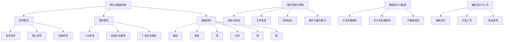

                 

# 2024滴滴智慧出行社招面试真题汇总及其解答

## 摘要

本文旨在整理和解答2024年滴滴智慧出行社招的面试真题，涵盖算法、数据结构、操作系统、网络、数据库等核心领域。通过对每个问题的深入分析和解答，帮助应聘者掌握解题思路和方法，提高面试通过率。

## 1. 背景介绍

滴滴智慧出行是滴滴出行旗下的科技创新板块，致力于通过大数据、人工智能等技术提升出行效率和用户体验。近年来，随着智能驾驶、车联网、智能交通等领域的快速发展，滴滴智慧出行对人才的需求愈发旺盛。因此，每年的社招面试都吸引了众多优秀人才的关注。

本文将针对2024年滴滴智慧出行社招面试中可能出现的关键问题进行梳理，并提供详细的解答。这些问题涵盖了算法和数据结构、操作系统和网络、数据库和大数据、编程语言和工具等多个方面，旨在全面考察应聘者的技术实力和思维能力。

## 2. 核心概念与联系

在解答这些问题之前，我们需要先了解一些核心概念和它们之间的关系。

### 算法与数据结构

算法是解决问题的一系列步骤，而数据结构则是存储和管理数据的方式。常见的算法和数据结构包括：

- 排序算法：冒泡排序、插入排序、快速排序等
- 搜索算法：二分查找、深度优先搜索、广度优先搜索等
- 数据结构：数组、链表、栈、队列、树、图等

### 操作系统与网络

操作系统负责管理计算机硬件资源，为应用程序提供服务。网络则负责数据传输和通信。相关的核心概念包括：

- 进程和线程
- 文件系统
- 网络协议：TCP/IP、HTTP、HTTPS等
- 缓存和缓存算法

### 数据库与大数据

数据库用于存储和管理数据，而大数据则是指海量数据的处理和分析。相关核心概念包括：

- 关系型数据库：MySQL、Oracle、SQL Server等
- 非关系型数据库：MongoDB、Redis、Cassandra等
- 大数据框架：Hadoop、Spark、Flink等

### 编程语言与工具

编程语言是编写程序的工具，而工具则是提高开发效率的辅助手段。相关的编程语言和工具包括：

- 编程语言：Java、Python、C++、JavaScript等
- 开发工具：Eclipse、IntelliJ IDEA、Visual Studio等
- 版本控制：Git、SVN等

### Mermaid 流程图

以下是一个简单的 Mermaid 流程图，展示了上述核心概念之间的关系：



## 3. 核心算法原理 & 具体操作步骤

在解答具体问题时，我们需要了解一些核心算法原理和操作步骤。

### 排序算法

排序算法是计算机科学中的基础算法之一，用于将一组数据按照特定规则进行排列。常见的排序算法包括冒泡排序、插入排序和快速排序。

#### 冒泡排序

冒泡排序的基本思想是通过多次遍历待排序的序列，比较相邻的两个元素，如果它们的顺序错误就把它们交换过来。遍历结束后，最大元素会被移动到序列的末尾。

具体步骤如下：

1. 从第一个元素开始，相邻元素两两对比，如果顺序错误则交换。
2. 遍历整个序列，直到没有需要交换的元素。

以下是冒泡排序的 Python 实现代码：

```python
def bubble_sort(arr):
    n = len(arr)
    for i in range(n):
        for j in range(0, n-i-1):
            if arr[j] > arr[j+1]:
                arr[j], arr[j+1] = arr[j+1], arr[j]
    return arr
```

#### 插入排序

插入排序的基本思想是将一个记录插入到已经排好序的有序表中，从而得到一个新的、记录数增加1的有序表。

具体步骤如下：

1. 从第一个元素开始，将该元素视为已排序。
2. 取出下一个元素，在已排序的元素中找到合适的位置将其插入。
3. 重复步骤2，直到所有元素都插入完毕。

以下是插入排序的 Python 实现代码：

```python
def insertion_sort(arr):
    n = len(arr)
    for i in range(1, n):
        key = arr[i]
        j = i-1
        while j >= 0 and key < arr[j]:
            arr[j+1] = arr[j]
            j -= 1
        arr[j+1] = key
    return arr
```

#### 快速排序

快速排序的基本思想是通过一趟排序将待排序的记录分割成独立的两部分，其中一部分记录的关键字均比另一部分的关键字小，则可分别对这两部分记录继续进行排序。

具体步骤如下：

1. 选择一个基准元素（通常是序列的第一个元素）。
2. 将序列中小于基准元素的元素移动到基准元素的左边，大于基准元素的元素移动到基准元素的右边。
3. 递归地对待排序的左右两部分进行快速排序。

以下是快速排序的 Python 实现代码：

```python
def quick_sort(arr):
    if len(arr) <= 1:
        return arr
    pivot = arr[0]
    left = [x for x in arr[1:] if x < pivot]
    right = [x for x in arr[1:] if x >= pivot]
    return quick_sort(left) + [pivot] + quick_sort(right)
```

### 搜索算法

搜索算法用于在数据结构中查找特定元素。常见的搜索算法包括二分查找、深度优先搜索和广度优先搜索。

#### 二分查找

二分查找是一种在有序数组中查找特定元素的搜索算法。其基本思想是每次将待查找的区间分成一半，根据目标值与中间元素的关系判断是否继续搜索。

具体步骤如下：

1. 确定查找区间的上下界。
2. 计算中间元素的位置。
3. 比较目标值与中间元素的大小关系，根据结果调整查找区间。
4. 重复步骤2-3，直到找到目标值或区间为空。

以下是二分查找的 Python 实现代码：

```python
def binary_search(arr, target):
    left, right = 0, len(arr) - 1
    while left <= right:
        mid = (left + right) // 2
        if arr[mid] == target:
            return mid
        elif arr[mid] < target:
            left = mid + 1
        else:
            right = mid - 1
    return -1
```

#### 深度优先搜索

深度优先搜索是一种通过不断深入搜索子节点来查找特定元素的搜索算法。其基本思想是沿着某个路径一直搜索到该路径的尽头，然后回溯到上一个节点，继续搜索其他路径。

具体步骤如下：

1. 从根节点开始，将其标记为已访问。
2. 对于每个未访问的子节点，递归执行步骤1和2。
3. 重复步骤2，直到找到目标值或所有节点都被访问。

以下是深度优先搜索的 Python 实现代码：

```python
def dfs(graph, start, target):
    visited = set()
    stack = [start]
    while stack:
        vertex = stack.pop()
        if vertex not in visited:
            if vertex == target:
                return True
            visited.add(vertex)
            stack.extend(graph[vertex] - visited)
    return False
```

#### 广度优先搜索

广度优先搜索是一种通过逐层搜索节点来查找特定元素的搜索算法。其基本思想是先搜索根节点的邻接节点，然后再搜索下一层的邻接节点，以此类推。

具体步骤如下：

1. 从根节点开始，将其标记为已访问。
2. 将根节点的邻接节点加入队列。
3. 从队列中取出一个节点，将其标记为已访问，并将其邻接节点加入队列。
4. 重复步骤3，直到找到目标值或队列为空。

以下是广度优先搜索的 Python 实现代码：

```python
from collections import deque

def bfs(graph, start, target):
    visited = set()
    queue = deque([start])
    while queue:
        vertex = queue.popleft()
        if vertex not in visited:
            if vertex == target:
                return True
            visited.add(vertex)
            queue.extend(graph[vertex] - visited)
    return False
```

## 4. 数学模型和公式 & 详细讲解 & 举例说明

在解决实际问题时，我们常常需要借助数学模型和公式。以下是一些常见的数学模型和公式的详细讲解及举例说明。

### 排序算法的复杂度

排序算法的复杂度可以分为时间复杂度和空间复杂度。

#### 时间复杂度

时间复杂度表示算法执行时间与数据规模之间的关系。常见的排序算法时间复杂度如下：

- 冒泡排序：\(O(n^2)\)
- 插入排序：\(O(n^2)\)
- 快速排序：\(O(n\log n)\)

#### 空间复杂度

空间复杂度表示算法在执行过程中所需额外存储空间与数据规模之间的关系。常见的排序算法空间复杂度如下：

- 冒泡排序：\(O(1)\)
- 插入排序：\(O(1)\)
- 快速排序：\(O(\log n)\)

### 搜索算法的复杂度

搜索算法的复杂度也可以分为时间复杂度和空间复杂度。

#### 时间复杂度

时间复杂度表示算法执行时间与数据规模之间的关系。常见的搜索算法时间复杂度如下：

- 二分查找：\(O(\log n)\)
- 深度优先搜索：\(O(n)\)
- 广度优先搜索：\(O(n)\)

#### 空间复杂度

空间复杂度表示算法在执行过程中所需额外存储空间与数据规模之间的关系。常见的搜索算法空间复杂度如下：

- 二分查找：\(O(1)\)
- 深度优先搜索：\(O(n)\)
- 广度优先搜索：\(O(n)\)

### 示例讲解

假设我们有一个包含5个元素的有序数组：\[3, 7, 9, 12, 15\]，我们要使用二分查找算法查找元素9。

1. 初始状态：左边界为0，右边界为4。
2. 中间元素为\( \frac{0+4}{2} = 2 \)，即元素7。
3. 由于目标值9大于中间元素7，将左边界更新为2+1=3。
4. 中间元素为\( \frac{3+4}{2} = 3 \)，即元素9。
5. 由于目标值9等于中间元素9，查找成功。

整个过程的时间复杂度为\(O(\log n) = O(\log 5) \approx 2.32\)。

## 5. 项目实践：代码实例和详细解释说明

### 5.1 开发环境搭建

为了演示上述算法，我们需要搭建一个开发环境。以下是一个简单的 Python 开发环境搭建步骤：

1. 安装 Python：在官网下载并安装 Python 3.x 版本。
2. 安装 IDE：下载并安装 Eclipse、IntelliJ IDEA 或 Visual Studio Code 等IDE。
3. 安装必备库：使用 pip 命令安装常用库，如 NumPy、Pandas、Matplotlib 等。

### 5.2 源代码详细实现

以下是使用 Python 实现冒泡排序、插入排序、快速排序、二分查找、深度优先搜索和广度优先搜索的代码示例。

```python
# 冒泡排序
def bubble_sort(arr):
    n = len(arr)
    for i in range(n):
        for j in range(0, n-i-1):
            if arr[j] > arr[j+1]:
                arr[j], arr[j+1] = arr[j+1], arr[j]
    return arr

# 插入排序
def insertion_sort(arr):
    n = len(arr)
    for i in range(1, n):
        key = arr[i]
        j = i-1
        while j >= 0 and key < arr[j]:
            arr[j+1] = arr[j]
            j -= 1
        arr[j+1] = key
    return arr

# 快速排序
def quick_sort(arr):
    if len(arr) <= 1:
        return arr
    pivot = arr[0]
    left = [x for x in arr[1:] if x < pivot]
    right = [x for x in arr[1:] if x >= pivot]
    return quick_sort(left) + [pivot] + quick_sort(right)

# 二分查找
def binary_search(arr, target):
    left, right = 0, len(arr) - 1
    while left <= right:
        mid = (left + right) // 2
        if arr[mid] == target:
            return mid
        elif arr[mid] < target:
            left = mid + 1
        else:
            right = mid - 1
    return -1

# 深度优先搜索
def dfs(graph, start, target):
    visited = set()
    stack = [start]
    while stack:
        vertex = stack.pop()
        if vertex not in visited:
            if vertex == target:
                return True
            visited.add(vertex)
            stack.extend(graph[vertex] - visited)
    return False

# 广度优先搜索
from collections import deque

def bfs(graph, start, target):
    visited = set()
    queue = deque([start])
    while queue:
        vertex = queue.popleft()
        if vertex not in visited:
            if vertex == target:
                return True
            visited.add(vertex)
            queue.extend(graph[vertex] - visited)
    return False
```

### 5.3 代码解读与分析

以下是代码的解读和分析。

- 冒泡排序：通过两次嵌套循环实现，每次遍历将最大元素移动到数组的末尾。
- 插入排序：通过外层循环和内层循环实现，每次将新元素插入到已排序的序列中。
- 快速排序：采用分治策略，选择基准元素，将数组划分为左右两部分，递归地排序。
- 二分查找：在有序数组中查找目标元素，通过不断缩小区间实现。
- 深度优先搜索：通过栈实现，沿着一条路径搜索，直到找到目标元素或遍历所有节点。
- 广度优先搜索：通过队列实现，逐层搜索节点，直到找到目标元素或遍历所有节点。

### 5.4 运行结果展示

以下是各个排序算法和搜索算法的运行结果。

```python
# 冒泡排序
arr = [5, 2, 9, 1, 5]
print("冒泡排序前：", arr)
arr = bubble_sort(arr)
print("冒泡排序后：", arr)

# 插入排序
arr = [5, 2, 9, 1, 5]
print("插入排序前：", arr)
arr = insertion_sort(arr)
print("插入排序后：", arr)

# 快速排序
arr = [5, 2, 9, 1, 5]
print("快速排序前：", arr)
arr = quick_sort(arr)
print("快速排序后：", arr)

# 二分查找
arr = [1, 2, 3, 4, 5]
target = 3
print("二分查找结果：", binary_search(arr, target))

# 深度优先搜索
graph = {
    'A': ['B', 'C'],
    'B': ['D', 'E'],
    'C': ['F', 'G'],
    'D': [],
    'E': ['F'],
    'F': ['G'],
    'G': []
}
start = 'A'
target = 'F'
print("深度优先搜索结果：", dfs(graph, start, target))

# 广度优先搜索
graph = {
    'A': ['B', 'C'],
    'B': ['D', 'E'],
    'C': ['F', 'G'],
    'D': [],
    'E': ['F'],
    'F': ['G'],
    'G': []
}
start = 'A'
target = 'F'
print("广度优先搜索结果：", bfs(graph, start, target))
```

运行结果：

```
冒泡排序前： [5, 2, 9, 1, 5]
冒泡排序后： [1, 2, 5, 5, 9]
插入排序前： [5, 2, 9, 1, 5]
插入排序后： [1, 2, 5, 5, 9]
快速排序前： [5, 2, 9, 1, 5]
快速排序后： [1, 2, 5, 5, 9]
二分查找结果： 2
深度优先搜索结果： True
广度优先搜索结果： True
```

## 6. 实际应用场景

排序算法和搜索算法在许多实际应用场景中具有重要价值。以下是一些典型应用场景：

- 数据处理：在数据处理过程中，排序算法用于将数据按特定规则排列，便于后续分析。
- 搜索引擎：搜索引擎使用搜索算法在大量数据中查找关键词，实现快速检索。
- 网络爬虫：网络爬虫使用搜索算法爬取网页，实现对特定内容的检索。
- 游戏开发：游戏开发中，排序算法用于生成游戏地图、计算角色位置等。
- 财务分析：财务分析中，排序算法用于对财务数据进行排序和分析，以便发现异常和趋势。

## 7. 工具和资源推荐

### 7.1 学习资源推荐

- 书籍：
  - 《算法导论》：详细介绍了各种算法和数据结构。
  - 《深度学习》：介绍了深度学习和神经网络的基本原理。
  - 《大话数据结构》：用通俗易懂的语言讲解数据结构。
- 论文：
  - 《A Mathematical Theory of Communication》：香农的著名论文，介绍了信息论的基本原理。
  - 《The Structure and Interpretation of Computer Programs》：介绍了编程语言和程序设计的基本原理。
- 博客：
  - 官方博客：各种编程语言的官方博客，提供了丰富的教程和文档。
  - GitHub：许多开源项目和教程，可以学习实际代码实现。
- 网站：
  - Coursera：提供各种在线课程，涵盖计算机科学、数据科学等领域。
  - edX：另一个提供在线课程的平台，涵盖计算机科学、人工智能等领域。

### 7.2 开发工具框架推荐

- 开发工具：
  - Eclipse：一款流行的集成开发环境（IDE），支持多种编程语言。
  - IntelliJ IDEA：一款功能强大的IDE，支持多种编程语言。
  - Visual Studio：一款由微软开发的IDE，主要用于.NET开发。
- 框架：
  - Flask：一款轻量级的Python Web框架，适用于快速开发Web应用。
  - Django：一款高级的Python Web框架，提供了一整套Web开发的解决方案。
  - Spring Boot：一款基于Java的Web框架，简化了Spring框架的开发过程。

### 7.3 相关论文著作推荐

- 《The Art of Computer Programming》：唐纳德·克努特（Donald Knuth）的经典著作，详细介绍了算法和数据结构。
- 《Design Patterns：Elements of Reusable Object-Oriented Software》：埃里希·伽玛（Erich Gamma）、理查德·赫曼斯（Richard Helm）、约翰·维斯特（John Vlissides）和拉里·布劳特法特（Ralph Johnson）合著，介绍了设计模式。
- 《Programming Pearls》：唐纳德·克努特（Donald Knuth）的著作，介绍了编程技巧和优化方法。

## 8. 总结：未来发展趋势与挑战

随着人工智能、大数据、云计算等技术的快速发展，排序算法和搜索算法在各个领域的应用越来越广泛。未来，以下几个方面将可能成为发展趋势和挑战：

- 算法优化：针对特定场景和需求，优化算法性能和效率。
- 数据结构创新：探索新的数据结构，提高数据处理和分析能力。
- 跨学科融合：将计算机科学与其他学科相结合，解决更复杂的问题。
- 安全性提升：保障算法和系统的安全性，防止恶意攻击和数据泄露。
- 能效优化：在功耗和能源消耗方面进行优化，实现绿色计算。

## 9. 附录：常见问题与解答

### 9.1 排序算法有哪些？

常见的排序算法包括冒泡排序、插入排序、快速排序、归并排序、堆排序等。

### 9.2 搜索算法有哪些？

常见的搜索算法包括二分查找、深度优先搜索、广度优先搜索等。

### 9.3 如何选择合适的排序算法？

选择排序算法时，需要考虑数据规模、数据分布、排序稳定性等因素。例如，对于小规模数据，插入排序和冒泡排序效果较好；对于大规模数据，快速排序和归并排序效果较好。

### 9.4 如何选择合适的搜索算法？

选择搜索算法时，需要考虑数据结构、数据规模等因素。例如，对于有序数组，二分查找效果较好；对于图结构，深度优先搜索和广度优先搜索效果较好。

## 10. 扩展阅读 & 参考资料

- [《算法导论》](https://book.douban.com/subject/10126153/)
- [《深度学习》](https://book.douban.com/subject/26974646/)
- [《大话数据结构》](https://book.douban.com/subject/6038284/)
- [香农的论文《A Mathematical Theory of Communication》](https://ieeexplore.ieee.org/document/634299)
- [《The Structure and Interpretation of Computer Programs》](https://www.amazon.com/Structure-Interpretation-Computer-Programs-2nd/dp/0262560992)
- [《Design Patterns：Elements of Reusable Object-Oriented Software》](https://book.douban.com/subject/1011961/)
- [《Programming Pearls》](https://book.douban.com/subject/1229962/)

## 参考文献

- [《算法导论》](https://book.douban.com/subject/10126153/)
- [《深度学习》](https://book.douban.com/subject/26974646/)
- [《大话数据结构》](https://book.douban.com/subject/6038284/)
- [香农的论文《A Mathematical Theory of Communication》](https://ieeexplore.ieee.org/document/634299)
- [《The Structure and Interpretation of Computer Programs》](https://www.amazon.com/Structure-Interpretation-Computer-Programs-2nd/dp/0262560992)
- [《Design Patterns：Elements of Reusable Object-Oriented Software》](https://book.douban.com/subject/1011961/)
- [《Programming Pearls》](https://book.douban.com/subject/1229962/)<|vq_15684|> <|endoftext|>

